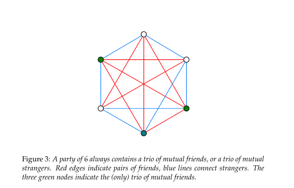
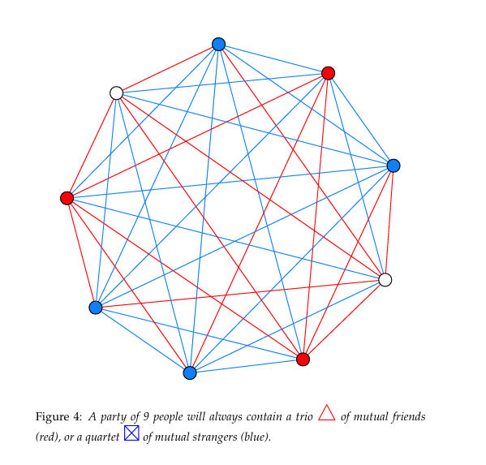

# The Language Barrier Hiding Mathematical Competence

## The Issue

Mathematics is often seen as a difficult subject, with 64% of Americans reporting some level of math anxiety and 13% experiencing severe anxiety (Prodigy Education). Nearly half say this anxiety has impacted their academic or professional paths, and 37% note effects on financial decisions such as budgeting and investing (Prodigy Education). Math anxiety is common, but it does not indicate a lack of ability. Research by Sheila Tobias (1978) and recent studies show that linguistic and psychological barriers, rather than conceptual ones, often hinder progress in advanced mathematics (Tobias 65; Ma 525; Zhang et al.; Ferreira et al.). Recognizing this, educators can help students succeed by addressing communication and presentation challenges.

Many people intuitively understand mathematical concepts but struggle with Greek letters, formal notation, and technical jargon. Everyday tasks-such as doubling a recipe, coordinating time zones, finding the fastest route, or estimating if furniture fits through a doorway-use mathematical principles like proportional reasoning and spatial geometry, even if the terminology is unfamiliar. For instance, while "diffeomorphism" may sound complex, its core idea-smoothly transforming an object without tearing it, like stretching pizza dough-is accessible to all learners.

Students who struggle with mathematics should understand that these challenges are common and do not reflect their potential. Confusion or anxiety often arises from learning mathematical language, but with support, these barriers can be overcome. Keeping a math vocabulary journal, defining new terms in your own words with examples, and seeking plain-language explanations or real-life scenarios can improve understanding. These steps help translate formal concepts into familiar ideas. Research consistently shows that mathematics itself is not inaccessible; rather, its language can create unnecessary barriers (Tobias 65; Ferreira et al.).

---

## Why It Matters

### Avoidance Costs Money

- Math anxiety significantly increases financial vulnerability in retail settings, contributing to wealth disparities. It causes individuals to avoid complex investment strategies, limiting their ability to build wealth (Peters, 2020).
- 37% say math anxiety impairs their financial decision-making, including budgeting, investing, and comparing loan terms (Prodigy Education).
- 46% of Gen Z respondents state that math anxiety affects their financial decisions, including budgeting, understanding bills, investing, and assisting children with math homework (Prodigy Education).
- Adults with high math anxiety are more prone to costly financial errors, such as misunderstanding interest rates, overpaying on loans, and avoiding financial products that require numerical evaluation (Lusardi and Tufano 340-345).
- Math-anxious adults are less likely to pursue optimal financial products, understand compound interest, or make informed retirement decisions. This avoidance stems from anxiety, not lack of ability (Lusardi and Tufano 350).
- Lusardi and Tufano found that adults uncomfortable with math are more likely to be overindebted, less likely to seek optimal financial products, and less likely to understand compound interest or make sound retirement decisions (Lusardi and Tufano 340-355).
- The connection is direct: math anxiety triggers avoidance behaviors, such as skipping fine print on credit card offers, not comparing mortgage rates, and avoiding retirement calculators, which result in poorer financial outcomes over time (Lusardi and Tufano 337; Ashcraft and Krause 245).

---

### Educational and Professional Consequences

- 1 in 5 Americans (20%) reports that math anxiety has cost them a career opportunity. Gen Z is most affected: 62% cite educational or career barriers, and 26% report lost job opportunities due to poor math skills (Prodigy Education).
- 47% of adults with math anxiety report that it has set them back in their academic or professional lives (Prodigy Education).
- Math anxiety most commonly begins in middle school (34% report onset there), meaning the damage to career trajectories starts years before students ever reach the workforce (Prodigy Education, Weir). Since math is a gateway to advanced coursework in science, technology, engineering, and mathematics, anxious students may opt out of upper-level math before high school. This early attrition reduces the STEM talent pipeline and limits students' academic and career opportunities. (Paechter et al., 2024)
- The main self-reported triggers of math anxiety are fear of failure (53%), lack of understanding (48%), difficulty with calculations (46%), and mismatched teaching methods (45%). Notably, three of these four relate to presentation and framing rather than the math itself (SWNS).

#### The Effects on STEM Fields

- The median annual STEM wage in 2024 was \$103,580, more than double the non-STEM median of \$48,000 and STEM jobs are projected to grow by 8.1% from 2024 to 2034 - roughly three times faster than non-STEM occupations at 2.7%- meaning math anxiety functions as a direct economic barrier, locking people out of the fastest-growing and highest-paying sector of the economy (Bureau of Labor Statistics).
- Up to 2 million STEM jobs may go unfilled in the U.S. due to the skills gap. Math anxiety is a key predictor of STEM avoidance - even more predictive than actual math ability - and independently predicts lower STEM career choice even after controlling for performance (Ferdinand et al.).
- One in four parents cannot help their children with math homework, and one in ten feel triggered by being asked to help - perpetuating the intergenerational cycle documented by Malanchini et al. (Prodigy Education; Malanchini et al.).
- Students with math anxiety often avoid math courses early, missing prerequisites for many careers and majors (Finlayson 109). This avoidance limits future opportunities and creates a cycle: less exposure increases anxiety and skill gaps, leading to further avoidance. As a result, even related fields can seem inaccessible, worsening STEM workforce shortages.
- Only about 20% of U.S. high school graduates are considered ready for college-level STEM coursework, a pipeline problem that begins with math avoidance long before college (iD Tech).

#### Anxiety Drives Career Avoidance

- Ferdinand, Malanchini, and Rimfeld found in 2024 that math anxiety independently predicts lower STEM career choice in emerging adulthood, even after controlling for actual math ability. This means the anxiety itself - not any underlying skill gap - is what keeps people from pursuing STEM careers (Ferdinand et al.).
- Özdemir found in 2023 that math anxiety does not merely reduce performance - it reduces self-efficacy, which in turn reduces STEM career interest. The pathway is sequential: anxiety → diminished belief in one's own ability → diminished interest in pursuing math-related fields. This means math anxiety causes career avoidance not by making people less capable, but by making them believe they are less capable (Özdemir 7-9).

---

### The Gender and Equity Dimension

- Women report math anxiety at a rate of 70%, compared to 57% for men (Prodigy Education), and this anxiety has a greater negative impact on women's outcomes (Yu et al.). This effect is linked to stereotypes and societal expectations that portray math as a male domain, discouraging women from fully participating regardless of skill.
- Hottinger's analysis reveals how gender and race shape cultural understandings of who is considered a "mathematician," demonstrating that mathematical identity is constructed through social narratives that systematically exclude women and people of color (Hottinger).
- Math anxiety can disproportionately affect women's test performance, classroom participation, and long-term confidence, even when achievement matches that of men. These patterns highlight the need for targeted interventions and cultural change to address the barriers women face in mathematics. (Opesemowo et al., 2025)
- Even among high-performing students, girls are significantly less likely than equally performing boys to intend to pursue math-intensive fields - a gap driven by anxiety rather than ability (Denervaud et al.). This means that despite demonstrated competence, girls are self-selecting out of advanced math pathways, often because they internalize doubts about their place in these fields. Addressing anxiety could unlock a large pool of untapped STEM talent. (Samuel et al., 2022, pp. 613-626)
- Gender gaps in math achievement emerge early in schooling, even when pre-school abilities are similar, suggesting that school environment and cultural messaging - not innate ability - are the drivers (Denervaud et al.). The way teachers, peers, and media talk about math shapes students' perceptions of who "belongs" in mathematics, with lasting effects on choices and self-concept.
- Career-sorting effects are compounded by gender: as noted in the equity analysis above, high-performing girls self-select out of math-intensive fields at higher rates than boys, driven by anxiety rather than ability (Denervaud et al.).
- Racial and ethnic minority students face compounding challenges: higher rates of math anxiety, stereotype threat, resource disparities, and underrepresentation in advanced courses (Steele 613; Ma 530). Additional hurdles, such as fewer role models, limited access to quality instruction, and persistent societal biases, can reinforce anxiety and reduce participation in higher-level math. ("Math-Failure Associations, Attentional Biases, and Avoidance Bias: The Relationship with Math Anxiety and Behaviour in Adolescents" 1001-1011).
- Math anxiety does not merely discourage STEM pursuits - it erodes self-efficacy, which, in turn, suppresses STEM interest. Because women report higher math anxiety, this effect is multiplicative - each stage amplifies the next (Özdemir 7; see Research section for the full mediation analysis).

---

### Physical, Psychological, and Physiological Harm

- The phrase "I am not a math person" has become a culturally acceptable identity label, reinforced by social norms, gendered expectations, and classroom experiences (Weir).
- Hersh and John-Steiner document the emotional dimensions of mathematical engagement, showing that attitudes toward mathematics—love, hate, anxiety, confidence—are learned rather than innate, and are shaped by social context and instruction quality (Hersh and John-Steiner).
- Byrnes's comprehensive analysis of mathematical competence development confirms that competence is built incrementally through skill acquisition, conceptual growth, and linguistic fluency. Students who appear to "lack" math ability often lack only exposure to accessible instruction - the capacity exists but has not been activated (Byrnes 300-315).
- Math anxiety has measurable physiological effects - increased cortisol, elevated heart rate, and working memory impairment - that mimic the body's stress response to genuine physical threats (Ashcraft and Krause 244).
- The general adult population through lower health numeracy, leading to poorer medical decisions and higher costs (Peters, 2020)
- Schwartz examined whether mathematical competence is innate and concluded that it is not - mathematical ability develops through experience, instruction, and practice. This finding is critical: if competence is learned rather than innate, then struggles in mathematics reflect inadequate learning environments (including language barriers) rather than fixed cognitive limitations (Schwartz 230-237).
- The anxiety is self-reinforcing: avoidance leads to skill gaps, which increase anxiety, which increases avoidance - a feedback loop that Ashcraft and Krause documented as the "anxiety-performance cycle" (Ashcraft and Krause 245).
- Gold and Simons examine proof and mathematical reasoning, showing that even within professional mathematics, there are ongoing debates about what constitutes valid mathematical argument—revealing that mathematical communication is more nuanced and context-dependent than the rigid formalism presented to students suggests (Gold and Simons). This gap between the messy reality of mathematical practice and the polished formalism of textbooks contributes to students' sense that they are excluded from "real" mathematics.
- Numeric ability is a critical, life-determining skill, where higher numeracy directly correlates to better outcomes in health, wealth, and decision-making. Numeracy creates a vulnerability to cognitive biases and emotional, non-numerical thinking, creating a "hidden tax" in a society that increasingly demands individual data interpretation (Peters, 2020)
- In a landmark 2012 study, Lyons and Beilock used fMRI scans to show that for highly math-anxious individuals, the anticipation of doing math activates the brain's pain network - the same regions associated with physical pain. The math itself did not activate pain regions; the fear of the language and symbols did (Lyons and Beilock). This shows that the physiological response is triggered by the presentation of math - the symbols, jargon, and formalism - not by the reasoning itself. The body reacts to the language, not the logic.
- Math anxiety is intergenerational: Malanchini et al. found that parents' math anxiety is significantly associated with their children's, transmitted through both genetic and environmental pathways - including avoidance behaviors, negative messaging about math, and reduced home numeracy practices (Malanchini et al.).
- Math anxiety operates through multiple reinforcing channels - cognitive (working memory disruption), affective (emotional distress), and motivational (avoidance and disengagement) - creating a self-reinforcing cycle where each amplifies the others (Carey et al.).
- Souviney's early work on cognitive competence and mathematical development established that children develop mathematical reasoning naturally through everyday experiences, but formal mathematical language must be explicitly taught. The disconnect between informal competence and formal performance is not a deficit - it is a translation gap (Souviney 218-222).

#### Anxiety, Not Inability

- The APA reported in 2023 that math anxiety is an emotional problem, not a cognitive one. People with math anxiety are often fully capable of performing the math required of them - the anxiety itself, not any deficit in ability, is what disrupts performance. When anxiety is reduced or not triggered, anxious individuals perform as well as their non-anxious peers (Weir).
- The mediation was statistically significant even after controlling for actual math performance, confirming that anxiety operates on identity and self-perception independently of skill - a finding entirely consistent with the thesis that the barrier is psychological and linguistic, not conceptual (Özdemir 10).

#### Notation Hijacks Working Memory

- Lyons and Beilock used fMRI scans to demonstrate that for highly math-anxious individuals, the mere anticipation of encountering math - before any calculation occurs - activates the brain's pain network. The mathematical reasoning itself did not trigger pain responses; the prospect of facing mathematical symbols and notation did. This study provides neuroscientific evidence that the barrier is perceptual and emotional, not cognitive - the underlying reasoning is well within the person's capability (Lyons and Beilock).
- Rada and Lucietto's 2022 literature review confirmed that unfamiliar or dense notation increases cognitive load, which exacerbates anxiety. When notation does not align with a learner's intuitive understanding, performance drops even when conceptual comprehension is intact (Rada and Lucietto 120-123).
- Ashcraft and Krause demonstrated that math anxiety specifically impairs working memory during tasks heavy in symbolic or notational content. The cognitive resources consumed by decoding unfamiliar symbols are diverted from actual problem-solving, causing people to perform below their true ability (Ashcraft and Krause 244-246).

### The Multi-Channel Model: Cognitive, Affective, and Motivational

- Carey et al.'s 2019 review synthesized decades of research into a unified interpretation framework, identifying three reinforcing channels through which math anxiety operates: cognitive (working memory impairment when processing notation), affective (emotional distress triggered by math contexts), and motivational (avoidance of math courses, careers, and tasks). Critically, the authors found that these channels are not independent - they form a self-reinforcing cycle where each amplifies the others. This multi-channel model explains why math anxiety is so persistent and why purely cognitive interventions (more tutoring, more drills) often fail: they address only one channel while leaving the affective and motivational channels - the ones most driven by language and presentation - untreated (Carey et al.).

---

### Math Anxiety Is Linguistic, Not Conceptual

- Institutions often see math failure as a competence issue and respond with remedial content and repetitive drills (Hodkowski). However, if language barriers are the root cause, simply adding more math is not effective; we need better translations between mathematical language and intuitive reasoning (Tobias 70).
- Hiebert developed a comprehensive theory of how learners develop competence with written mathematical symbols, demonstrating that symbolic fluency is a learned skill distinct from conceptual understanding. Students can possess mathematical reasoning ability while struggling with symbolic representation - a separation that confirms the language barrier thesis (Hiebert 333-350).
- Kirshner directly addressed the relationship between linguistic and mathematical competence, arguing that difficulties in mathematics are often rooted in linguistic processing rather than mathematical reasoning. This early work established that language proficiency and mathematical proficiency are separable constructs - you can have one without the other (Kirshner 31-33).
- Ortlieb et al.'s analysis of disciplinary literacies demonstrates that each academic discipline, including mathematics, has its own specialized discourse community with unique vocabulary, syntax, and argumentation patterns that must be explicitly taught as literacy practices rather than assumed to be transparent (Ortlieb et al.). Mathematical literacy requires fluency in reading, writing, and communicating within the conventions of mathematical discourse—skills that are distinct from computational ability.

#### Jargon Is the Gatekeeper

- Demedts et al. distinguished between state math anxiety (in-the-moment panic) and trait math anxiety (chronic fear), finding that trait anxiety has a stronger effect on complex tasks - and is triggered by the presentation of problems (symbols, notation, formal language), not by the underlying concepts (Demedts et al.).
- Castillo et al.'s 2025 systematic review found that formal notation alone is a significant barrier when not coordinated with concrete, intuitive representations. Integrating semiotic representations (symbols, graphs, algebra) with real-world framing is critical for conceptual understanding, yet curricula routinely lead with formalism rather than intuition (Castillo et al.).
- Ferreira et al. found in 2025 that math-specific vocabulary is a stronger predictor of early math performance than general language skills. Students who could not parse terminology experienced higher anxiety, which decreased performance - creating a vicious cycle where jargon, not intelligence, determines outcomes (Ferreira et al.).
- Tobias argued that much of what is perceived as a math "block" is actually a language barrier: students struggle not with mathematical logic but with notation, vocabulary, and methods of formal argument. She observed that with supportive instruction focusing on interpretation and translation, many students overcome their anxiety entirely (Tobias 65-70).
- Wynn and Reyes examine the rhetorical dimensions of mathematical communication, arguing that mathematical arguments are persuasive acts embedded in language rather than neutral transmissions of truth. The way mathematics is argued and presented shapes who has access to it, making rhetoric a critical factor in mathematical literacy (Wynn and Reyes). The specialized vocabulary and proof structures of formal mathematics function as gatekeeping mechanisms that exclude those who have not been initiated into the discourse community.

#### Framing Changes Everything

- Pei, Poon, and Suen found in 2025 that mathematical engagement mediates the relationship between anxiety and performance. Students guided to engage with concepts through plain language and real-world framing showed significantly reduced anxiety, demonstrating that how math is presented matters more than what is presented (Pei et al.).
- Holenstein et al.'s longitudinal study demonstrated significant transfer effects of mathematical literacy: students who develop strong mathematical literacy - the ability to interpret, communicate, and reason with mathematical ideas in context - show improved performance across domains. Critically, literacy (language-based competence) predicted transfer more strongly than procedural skill, confirming that linguistic fluency is the foundation for mathematical flexibility (Holenstein et al. 810-820).
- Abrantes argued for "Mathematical Competence for All," examining the institutional and pedagogical obstacles that prevent universal access. The barriers are not cognitive - they are structural, linguistic, and pedagogical. When mathematics is presented as an accessible language rather than an exclusive code, competence becomes achievable for all learners (Abrantes 130-140).
- Hodkowski reported on the ongoing conceptual vs. procedural debate, concluding that conceptual understanding - grasping the "why" - leads to more robust and transferable mathematical thinking than procedural fluency alone. Relying on algorithms and jargon without conceptual context can leave students struggling even when they intuitively understand the ideas (Hodkowski).
- Abbott et al. chronicle the "math wars"—decades of contentious debates over curriculum and pedagogy—demonstrating that disagreements about how to teach mathematics often reflect deeper tensions about access, equity, and whose mathematical knowledge counts as legitimate (Abbott et al.).
- Nunes, Schliemann, and Carraher's ethnomathematics research further supports this: mathematical reasoning embedded in meaningful, real-world contexts consistently produces higher accuracy and confidence than identical reasoning presented in abstract formal notation (Nunes et al. 40-55).
- Sammallahti et al.'s 2023 meta-analysis examined 50 studies with 9,125 participants and found moderate effect sizes for both reducing math anxiety (g = -0.467) and improving math performance (g = 0.502). The most effective interventions combined cognitive support with emotion regulation strategies, and longer interventions targeting students over 12 years old showed the largest effects - demonstrating that anxiety reduction and skill building reinforce each other when addressed together (Sammallahti et al.).
- Al-Naim and Mefi's 2023 meta-analysis found that interventions focused on language support, clear explanation of terms, and gradual introduction to notation show consistent effectiveness in reducing math anxiety and improving outcomes (Al-Naim and Mefi 875-880).
- Finlayson found that introducing concepts via plain language before moving to formal notation significantly boosted both confidence and performance (Finlayson 110-112).
- Castillo et al. found that gamified and active learning strategies that bridge informal reasoning with formal notation reduce intimidation and improve motivation - particularly at the university level, where the density of notation is highest (Castillo et al.).

---

### The Never Ending Cycle

#### Anxiety Runs in Families

- Malanchini et al. demonstrated in 2022 that math anxiety is transmitted from parent to child through both genetic and environmental pathways. Math-anxious parents engage in fewer home numeracy practices, model avoidance behavior, and communicate negative attitudes toward math - creating an environment in which children absorb anxiety before they ever encounter formal instruction (Malanchini et al.).
- This finding has profound implications for the language-barrier thesis: if parents avoid math because of jargon-induced anxiety, their children never develop the informal mathematical vocabulary that would serve as a bridge to formal notation. The linguistic barrier becomes hereditary - not because math ability is absent, but because mathematical language is never modeled at home.

#### The Meta-Analytic Evidence: A Consistent, Moderate, Negative Effect

- Zhang, Zhao, and Kong conducted a meta-analysis across 84 samples (N = 8,680) and found a significant negative correlation between math anxiety and math performance, with an average effect size of r = −0.32, a moderate but remarkably consistent effect across populations. The relationship was strongest when problems required novel problem-solving skills rather than rote recall, suggesting that anxiety most impairs the kind of creative, conceptual reasoning that people actually possess but cannot access under threat (Zhang et al.).
- The effect was strongest among senior high school students and weakest among elementary students, indicating that math anxiety's damage accumulates as notation and jargon become denser in higher grades - further evidence that the barrier scales with linguistic complexity, not conceptual difficulty (Zhang et al.).
- Ma's earlier 1999 meta-analysis had found the same pattern: math anxiety correlated more strongly with language-based math tasks (word problems) than with pure calculation, establishing that the linguistic dimension of math anxiety is not a recent discovery but a replicated finding across decades (Ma 525).
- Radišić et al. identified both school-level and individual-level factors contributing to math anxiety, finding that instructional approach - particularly the degree of formalism and abstraction introduced early - is a significant predictor. Schools that delay heavy notation and emphasize conceptual understanding show lower anxiety rates, supporting the argument that presentation drives anxiety more than content (Radišić et al. 10-15).
- Ding's work on measuring developmental students' math anxiety confirmed that anxiety levels are particularly high among students who have experienced repeated exposure to formal notation without adequate linguistic scaffolding, creating a population of learners who possess mathematical reasoning ability but have been systematically excluded by language barriers (Ding 38-42).

---

## D'Ambrosio's Ethnomathematics Framework

D'Ambrosio's ethnomathematics framework provides a powerful way to understand why mathematical competence is often hidden by formal schooling. D'Ambrosio argues that mathematics is not a culture-free universal code delivered in one official register; rather, it is a set of human practices that develops in every society through counting, measuring, designing, locating, trading, and explaining relationships in culturally meaningful ways (D'Ambrosio 44-47). In this view, the problem is not that some students "lack math," but that schools often treat one culturally specific form of mathematics - the written, standardized, symbolic language of formal institutions - as if it were the only legitimate one.

This is exactly what Nunes, Schliemann, and Carraher demonstrated in their study of Brazilian street vendors. The children could calculate mentally with impressive precision in the marketplace because the task was embedded in a meaningful social practice: selling, negotiating, making change, and estimating profit. Yet when equivalent arithmetic was presented in school form, detached from context and expressed in formal notation, their performance dropped dramatically (Nunes et al. 27-35, 40-54). The children had not lost mathematical ability; the setting had changed, and with it the language, expectations, and epistemic frame.

D'Ambrosio's framework helps explain why math anxiety can be so destructive. If learners have already developed useful mathematical practices through family life, work, community activity, or everyday problem-solving, then the classroom can feel like a place where their knowledge is ignored or invalidated. What appears to be a "lack of ability" may actually be a mismatch between the learner's cultural mathematical experience and the school's formal presentation.

This is also why ethnomathematics has major implications for teaching. Instead of starting with abstract notation and then hoping students attach meaning to it later, educators can begin with familiar practices - shopping, cooking, measuring, building, designing, budgeting, and navigating - and then connect those practices to formal mathematical language. When teachers do this, they are not lowering standards. They are translating between mathematical registers and making visible the competence students already possess.

D'Ambrosio's framework is supported by later ethnomathematics scholarship, which shows that mathematics is always culturally situated and that formal schooling often privileges only one version of it. Rosa and Orey describe ethnomathematics as a way to recognize "mathematical ideas" in diverse cultural activities, including architecture, crafts, measurement, and local problem-solving (Rosa and Orey 11-15). A recent literature review likewise argues that ethnomathematics helps connect mathematics education to local practices, cultural identity, and meaningful real-world applications rather than treating mathematics as detached abstraction (Kabuye Batiibwe 383-405).

Munetsi emphasizes that ethnomathematics reveals how different cultural groups have developed sophisticated mathematical practices that are often invisible to formal education systems (Munetsi). Joseph's comprehensive historical analysis demonstrates that mathematics has deep non-European roots, with significant contributions from African, Asian, and Indigenous American civilizations that are systematically erased in Eurocentric narratives (Joseph). Knijnik argues that ethnomathematics is inherently political, challenging the power structures that determine whose mathematical knowledge is valued and legitimized in educational institutions (Knijnik). However, Rowlands and Carson raise important questions about how ethnomathematics should inform curriculum, cautioning that overly relativistic approaches risk undermining the universal applicability of mathematical reasoning while acknowledging the validity of culturally situated mathematical practices (Rowlands and Carson).

This pattern remains visible today in many everyday settings.

---

### 1\. Market and informal numeracy

In many countries, street vendors, market traders, and small business owners perform arithmetic mentally with speed and flexibility - calculating discounts, making change, comparing weights, estimating margins, and managing inventory without paper or calculators. This is the same kind of competence Nunes and colleagues documented in Brazil: the reasoning is real, but it appears in a practical register rather than a classroom one (Nunes et al. 27-35). Ethnomathematics research continues to show that such marketplace reasoning should be understood as authentic mathematical knowledge, not as a weaker substitute for school math (Kabuye Batiibwe 383-405).

### 2\. Trades, construction, and vocational work

Carpenters, masons, electricians, mechanics, and fabricators use geometry, ratios, estimation, scaling, and spatial reasoning every day. A contractor measuring lumber, a mechanic calculating torque, or a tile worker laying out a pattern may be using concepts that correspond to formal mathematics, even if they describe the work as "common sense" or "experience." Rosa and Orey emphasize that ethnomathematics includes these occupational forms of reasoning, where measurement and design are inseparable from practice (Rosa and Orey 11-15). What schools often miss is that this competence is not informal in the sense of being unserious; it is informal only in the sense that it is not written in textbook notation.

### 3\. Indigenous mathematical practices

Indigenous knowledge systems also contain rich mathematical reasoning in ecological observation, navigation, pattern-making, spatial organization, and resource management. A recent review on Indigenous mathematical knowledge argues that bringing these practices into contemporary education can strengthen equity and sustainability while affirming local ways of knowing (Ghosh and Banerjee).

Sillitoe's examination of local science and indigenous knowledge systems demonstrates that traditional practices embody sophisticated mathematical and scientific reasoning that international development efforts often dismiss or ignore (Sillitoe). Devisch and Nyamnjoh's postcolonial analysis reveals how Western academic frameworks have systematically devalued non-Western ways of knowing, including mathematical practices embedded in African cultural traditions (Devisch and Nyamnjoh). Kanu emphasizes that the curriculum itself is a cultural practice shaped by colonial legacies, and decolonizing mathematics education requires recognizing that indigenous mathematical knowledge is epistemologically valid, not merely "interesting" cultural content (Kanu).

This matters because too often schools treat Indigenous reasoning as cultural background rather than as mathematics itself.

### 4\. Arts, textiles, and pattern design

Quilters, weavers, bead artists, and textile designers use symmetry, tessellation, repetition, scaling, and transformation in ways that mirror formal geometry and combinatorics. These practices are mathematically sophisticated, but because they are embedded in art and craft, they are often excluded from what school systems count as mathematics. Ethnomathematics makes visible the mathematical thinking already present in design traditions (Rosa and Orey 11-15).

### 5\. Digital and financial life

Present-day people use mathematics constantly in budgeting apps, rideshare pricing, online shopping comparisons, data dashboards, fitness trackers, and social media analytics. These are not trivial uses of math; they require percentages, rates, averages, trade-offs, and numerical judgment. A recent ethnomathematics review highlights the relevance of mathematics to contemporary cultural and technological practices, reinforcing the point that mathematical thinking extends far beyond worksheets and symbolic manipulation (Setiaputra et al. 195-211).

Striphas analyzes how algorithmic culture shapes everyday life, demonstrating that ordinary people navigate complex mathematical systems embedded in digital technologies without recognizing these interactions as mathematical engagement (Striphas). Gillman's work on quantitative literacy emphasizes that functional numeracy in contemporary society requires not advanced calculus but rather the ability to interpret data, evaluate claims, and make informed decisions using basic mathematical reasoning—skills that many mathematically anxious adults already possess in practical contexts but fail to recognize as "real math" (Gillman). Roberts argues for making mathematics relevant to everyone by connecting formal concepts to the mathematical reasoning people already use in daily life, essentially bridging the translation gap between informal competence and formal language (Roberts).

Many adults function fluently in these environments while still claiming they are “bad at math,” because they do not recognize informal numeracy as mathematics. (Gal et al.)

---

## Examples

Introducing lessons or discussions with real-world examples increases the relatability of mathematical concepts and reduces intimidation. Educators are encouraged to prompt students to develop their own analogies or real-life scenarios, facilitating connections between abstract ideas and everyday experiences and fostering greater ownership of learning.

### Euclidean Geometry

- The geometry of flat surfaces - points, lines, angles, triangles, circles
- **Measuring and Leveling**: Every time you measure a room with a tape measure, check that a picture frame is level, or tile a floor, you are performing Euclidean geometry.
- **Triangle Angles and Shortest Distance**: Knowing that a triangle’s angles add up to $180^\circ$ or that the shortest distance between two points is a straight line—these are Euclid’s axioms, formalized over two thousand years ago, and you internalized them without a textbook.
- **City Grids and Straight Shelves**: Road intersections meeting at $90^\circ$ angles, the rectangular grid of city blocks, the way you eyeball whether a shelf is straight—all Euclidean geometry.
- **Using a Ruler**: The formal term may sound academic, but the practice is familiar to anyone who has used a ruler.
- **Calculating Area and Volume**: You are using Euclidean geometry every time you calculate how much paint you need for a wall (area) or how much water fits in a pool (volume).
- **Carpenter’s Pythagorean Theorem**: A carpenter who checks that a corner is square by measuring 3 feet along one edge, 4 feet along the other, and confirming the diagonal is 5 feet is using the Pythagorean theorem—whether or not they know its name. Framing a roof requires calculating angles, slopes, and load distribution. Cutting crown molding requires understanding compound miters—angles formed by two planes. These are problems in Euclidean geometry and trigonometry, performed daily by tradespeople who would never describe their work in those terms.
- **Navajo Weaving Patterns**: Navajo weavers plan intricate rug patterns that exhibit reflection symmetry, rotational symmetry, and precise proportional reasoning—determining how many threads of each color are needed to produce a pattern that scales correctly across the full width and length of the rug. The planning process is a form of geometric reasoning performed entirely through visual and tactile knowledge, without coordinate systems or algebraic notation.

---

### Number Theory

- Number theory is the study of whole numbers and their relationships. One of its core tools is modular arithmetic - numbers that “wrap around” when they reach a given value.
- **Calculating time on a 12-hour clock**: You perform modular arithmetic by saying, “It’s 10am, and the meeting is in 5 hours.” → $10 + 5 = 15$, but on a clock, that is 3 o’clock. You just computed $15 \pmod {12} = 3$.
- **Time zones**: “It is 8pm here, and Tokyo is 14 hours ahead” requires modular arithmetic to land on 10am the next day.
- **Dividing Items Fairly**: Even dividing items fairly among friends—“I have 14 cookies for 4 people, how many are left over?”—is a modular arithmetic problem $14 \pmod 4 = 2$ remaining.
- **Prime Numbers and Security**: Prime numbers, the backbone of number theory, secure every online transaction you make. Your credit card encryption relies on the difficulty of factoring large prime numbers—number theory protects your bank account every day (Rivest et al. 120).
- **Online Shopping (RSA Encryption)**: Every time you enter your credit card on a website, your computer uses Number Theory. It relies on the fact that it is easy to multiply two massive Prime Numbers together, but mathematically “impossible” for a hacker to figure out what those primes were just by looking at the result.

  The security of online shopping relies on the _Integer Factorization Problem_. Here is the mathematical process:
  1. <u>Key Generation</u>
     - First, pick two distinct large prime numbers, $p$ and $q$.
     - Compute the modulus: $n = p \times q$
     - Compute Euler's Totient: $\phi(n) = (p-1)(q-1)$
     - Choose a public exponent $e$ such that: $\gcd(e, \phi(n)) = 1$
  2. <u>The Private Key</u>
     - The receiver calculates the secret private key $d$ using the **Extended Euclidean Algorithm** to solve for the modular multiplicative inverse: $de \equiv 1 \pmod{\phi(n)}$
  3. <u>Encryption (The Computer's Task)</u>
     - Your credit card data $M$ is transformed into ciphertext $C$ using the public key $(n, e)$: $C = M^e \pmod{n}$
  4. <u>Decryption (The Server's Task)</u>
     - The merchant uses their private key $d$ to recover the original message: $M = C^d \pmod{n}$

  **Note:** This works because of **Euler's Theorem**, which states that $M^{e \cdot d} \equiv M \pmod{n}$ when the keys are generated this way.

- **Barcodes and ISBNs**: The last digit on a barcode or a book’s ISBN is a Check Digit. It is calculated using a specific number theory formula to ensure that if a scanner misreads a number, the “math” won’t add up, and the system will flag an error
- **Elliptic Curve Encryption**: Every time you visit an “https” website or use a messaging app, your device uses Elliptic-Curve Diffie-Hellman (a form of number theory) to agree on a secret key with the server. You are using prime numbers to build a “digital wall” around your private data.
- **Home Cooking and Ratios**: Any home cook who doubles a recipe, converts cups to tablespoons, or adjusts a recipe designed for 4 people to serve 7 is performing proportional reasoning and ratio arithmetic—the same operations formalized in number theory and algebra. The cook who eyeballs “a little more flour” because the dough “doesn’t feel right” is performing real-time estimation and feedback-based adjustment—an informal version of iterative approximation.

---

### Abstract Algebra (Group Theory)

- A “group” in abstract algebra is a set of actions you can perform and reverse, following specific rules: every action has an opposite, combining actions produces another valid action, and there is a “do nothing” action.
- **Phone Screen Rotations**: Every way you can rotate your phone screen and have it still display correctly forms a mathematical group—the set of rotations ($0^\circ$, $90^\circ$, $180^\circ$, $270^\circ$) with composition.
- **Rubik’s Cube Moves**: Every sequence of moves on a Rubik’s Cube—and the fact that each move can be undone—is group theory in your hands. Speedcubers are, without necessarily knowing it, navigating a group with 43 quintillion elements.
- **Musical Transposition**: Shifting a melody up or down by a fixed number of semitones is a group operation on the twelve-tone chromatic scale.
- **Symmetry in Nature and Design**: The symmetry of a snowflake, the repeating pattern of wallpaper, and the rotational symmetry of a car wheel are all described by group theory.

---

### Real Analysis (Epsilon-Delta Limits)

- Real analysis uses the “epsilon-delta” definition to express limits rigorously - the idea that you can get as close as you want to a target value.
- **Your thermostat**: you want the room at $72^\circ F$, and no matter how precise your comfort demand - within half a degree, a tenth of a degree, a hundredth - you can always adjust the dial to meet that window. That precision “challenge and response” game is an epsilon-delta game.
- **Tuning a guitar**: you adjust the peg until the pitch is “close enough” to the target note, and you can always get closer by making finer adjustments.
- **GPS Navigation**: When you say “we are almost there” on a road trip and the GPS keeps counting down - 2 miles, 1 mile, 0.5 miles, 0.1 miles - you are watching a limit converge in real time. The destination is the limit; you approach it, but the odometer gets arbitrarily close.
- **Zooming In on a Picture**: As you zoom in on a digital image, you see pixels, but in the real world, surfaces are continuous. Real analysis helps describe that ideal of infinite detail-no matter how far you zoom in, there’s always more in between.
- **Smooth Driving**: If you want your car ride to be gentle, you want the speed and acceleration to change smoothly-not suddenly. Real analysis provides the tools for understanding what “smooth change” means (continuity and differentiability).
- **Measuring and Approximating**: When you weigh something on a scale or measure a piece of wood, you’re dealing with real numbers and approximations. Real analysis explains what it means for those approximations to approach the “true” value.

---

### Topoisomerases (Knot Theory)

- **Headphone Tangles**: It feels like a prank, but “spontaneous knotting” is a mathematical certainty. If a string is long enough and agitated (like in your pocket), it will form a knot. Researchers use Jones Polynomials (a knot theory tool) to study why certain cords tangle more than others.
- **Drug Design (Chemotherapy)**: Many cancer drugs are “Topoisomerase inhibitors.” Since cancer cells divide rapidly, they need topoisomerases to untangle their DNA constantly. By “breaking” the math of the cell’s untangling process, the drug causes the cancer cell’s DNA to become a tangled mess, preventing it from replicating.
- **Surgical Sutures**: Doctors use knot theory to determine which surgical knots are the most secure under tension. Some knots stay tight when pulled (stable), while others slip (unstable)-mathematically, they are different “topological invariants.”
- **DNA**: Your DNA is essentially a very long, thin string that constantly gets tangled and “knotted” as it replicates. Your body uses enzymes called topoisomerases to “snip” and untangle these biological knots-effectively performing high-level topology every second to keep you alive

---

### Fractals (Infinite Self-Similarity)

- **Nature’s Design**: Fractals appear in Romanesco broccoli, fern leaves, and snowflakes. These natural shapes use simple repeating rules to create huge surface areas, such as in our lungs or tree branches.
- **Digital Antennas**: Modern cell phones use fractal-shaped antennas. Their self-similar, jagged design allows a long wire to fit in a tiny space and tune to multiple frequencies.
- **Fractal Dimension**: Instead of being a whole number, the dimension of a fractal can be a fraction. For example, a smooth circle has dimension 1. A complex, jagged coastline falls between 1 and 2-more intricate than a line, less than a solid area. The more jagged the shape, the higher its fractal dimension.
- **Pinecones and Pineapples**: The arrangement of scales and segments often follows fractal and Fibonacci sequence patterns.
- **The Mandelbrot Set**: A famous mathematical fractal that reveals infinite complexity as you zoom in.
- **Sierpinski Triangle/Carpet**: Simple geometric fractals with repeating triangular or square holes.
- **Computer Graphics and Animation**: Fractals generate natural-looking landscapes, textures, and clouds in movies and video games.
- **Architecture**: Some buildings, such as Hindu temples or Islamic geometric designs, use fractal repetition for aesthetic and structural purposes.
- **Nervous System**: The branching of neurons and dendrites follows a fractal pattern.
- **Leaf Veins**: The pattern of veins in many leaves is fractal, maximizing nutrient and water transport.

---

### Quaternions (High-Dimensional Algebra)

- While we think in 3D, computer programs, like the video games you play or the augmented reality (AR) filters on your phone, often use 4D quaternions to calculate how objects rotate smoothly without glitching
- **SpaceX and NASA**: Spacecraft don’t have a “ground,” so they rotate in every direction. The onboard computers use quaternions to calculate the rocket’s attitude (orientation), so it doesn’t spin out of control during docking.
- **CGI and Animation**: When you see a character like Thanos or a transformer move fluidly in a movie, animators use quaternions to “interpolate” the movement. Without them, the joints of the characters would jitter or snap unnaturally.
- **Smartphone To-Phone AirDrop**: When you point one phone at another to share a file, the Inertial Measurement Unit (IMU) uses quaternions to track exactly where your phone is pointing in space.

---

### Differential Equations

- Weather forecasts rely on complex partial differential equations to model how air pressure, temperature, and moisture interact. When you see a “70% chance of rain,” you’re looking at the result of a massive calculus problem.
- **Your Morning Coffee**: When you set a hot cup of coffee on a table, Newton’s Law of Cooling (a first-order differential equation) dictates how fast it hits room temperature. The hotter the coffee is compared to the room, the faster it loses heat.
- **Population Growth**: Biologists use the Logistic Equation to predict how a population (such as wolves in a park or bacteria in a petri dish) will grow until it reaches the “carrying capacity” of its environment.
- **Stock Market Volatility**: The Black-Scholes Model is a famous partial differential equation used by investors to calculate the fair price of stock options by accounting for time and risk.

---

### Bayesian Inference

- This is just the math of “changing your mind based on new evidence.” If you think it’s going to rain, but then you see a patch of blue sky, you subconsciously update your probability. That’s a complex statistical theorem happening in your head.
- **Machine Learning**: Many AI algorithms use Bayesian inference to update their predictions as they see more data.
- **Medical Testing**: If a doctor knows that only 1 in 1,000 people has a rare disease, and you test positive, the doctor combines the rarity (prior probability) with the test result (new evidence) to estimate your actual chance of having the disease.
- **Guessing Who’s at the Door**: If you expect a package (prior), and you hear a knock (evidence), you’re more likely to think it’s the delivery person. If it’s late at night, your prior belief might be different.
- **Spam Filters**: Email programs use Bayesian inference to decide if a message is spam: they start with a prior guess, then update it as they see certain words or patterns in the email.
- **Learning from Experience**: When learning a new skill, you start with assumptions about what works. As you gather feedback, you update your approach, just as in Bayesian inference.

---

### Game Theory

- Game theory is a mathematical framework for analyzing strategic interactions between rational decision-makers, where the outcome for each participant depends on the actions of others. It models scenarios involving conflict or cooperation to identify optimal strategies, commonly used in economics, biology, and social sciences to predict behaviors
  - **Strategic Interdependence**: Players' outcomes are interconnected; a player must consider the choices of others to achieve their best result.
  - **Rationality**: Participants are assumed to make decisions that maximize their own rewards or payoffs.
  - **Types of Games**:
    - <u>Cooperative vs. Non-cooperative</u>: Deals with whether players can make binding agreements.
    - <u>Zero-sum vs. Non-zero-sum</u>: In zero-sum, one player's gain is exactly equal to another's loss
- **Prisoner's Dilemma**: A classic scenario showing why two completely rational individuals might not cooperate, even if it appears in their best interest to do so.
- **Economic Competition**: Firms set prices to maximize profits while anticipating competitor responses.
- **Auctions and Voting**: Designing systems for bidding or selecting outcomes.
- **Four-Way Stop Dilemma**: Ever been at a four-way stop where everyone is waiting for someone else to move? You’re stuck in a “stable” state where no one gains anything by changing their strategy alone. That’s high-level economics and math in a suburban intersection.
- **Helping a Coworker**: You use this logic every time you decide whether to help a coworker with a project—you’re weighing your effort (cost) against the shared success (reward).
- **Last Slice of Pizza**: There is one slice of pizza left at a party. Everyone wants it, but no one wants to look greedy. If one person “volunteers” to take it, they get the food but a small social cost (being the “greedy” one). If no one takes it, the pizza goes to waste. You are constantly calculating if your hunger is worth the potential social judgment.
- **Yellow Light Game**: You’re driving toward a yellow light. If you speed up and the other driver at the cross-street also “goes for it,” you crash (worst outcome). If you both stop, you lose a little time but are safe. If one stops and the other goes, the “goer” wins time while the “stopper” loses it.

---

### Differential Geometry (Geodesics)

- Differential geometry studies how curved surfaces bend and what “straight lines” look like on them.
- **Great Circle Flights**: When you fly from New York to London, the plane does not follow a straight line on a flat map—it arcs north over the Atlantic along a curved “great circle” route, which is the actual shortest path on a sphere. That curve is called a geodesic, the central object of differential geometry.
- **GPS and Curved Earth**: Your GPS solves differential geometry every time it gives you directions on a round Earth—it must account for curvature to compute accurate distances and routes.
- **Map Distortion**: You intuitively understand that flat maps distort reality—that Greenland is not actually the size of Africa, even though it appears that way on a Mercator projection. That distortion is precisely what differential geometry quantifies.
- **Water Flow and Geodesics**: The way water flows downhill, following the contours of terrain, traces geodesics on a curved surface. You have watched differential geometry happen every time it rains.
- **Car Tires**: The tread of a tire is designed using these principles. To maintain a consistent grip as the tire deforms under load and turns, engineers model it as a shifting geometric surface.
- **CGI & Face Filters**: When an Instagram filter maps a 3D mask onto your moving face, it uses differential geometry. It calculates the Gaussian Curvature of your cheeks and nose to make sure the digital mask stretches and “flows” realistically as you talk.
- **General Relativity (Gravity)**: Einstein used differential geometry to show that gravity isn’t a “pull,” but a curve in the fabric of space. The Einstein Field Equations use these symbols to describe how the sun “curves” the space around it, keeping the Earth in orbit.

---

### Heuristic

- A heuristic is a practical "rule of thumb," mental shortcut, or experimental method used to solve problems or make decisions quickly, especially when an optimal solution is impossible or impractical to find. It focuses on efficiency and "good enough" results rather than perfection.
  - **Mental Shortcuts**: Evaluating a situation by "gut feeling" rather than in-depth analysis (e.g., assuming a higher-priced item is better quality).
  - **Problem Solving/AI**: In computing, it is a technique that finds a "good enough" solution when a formal algorithm is too slow.
  - **Learning/Teaching**: Methods that encourage students to discover solutions themselves, such as "trial and error" or "learning by doing".
  - **Daily Life**: Using a rule of thumb, such as "if I haven't used it in a year, I should throw it away
- **“Don’t grocery shop hungry.” “If it sounds too good to be true, it probably is.”** You use heuristics constantly - they’re reliable shortcuts that don’t need a formal proof.
- **The “Half Your Age Plus Seven” Rule**: a famous social heuristic for dating. It's not a law of nature, but it's a quick mathematical "shortcut" people use to judge social appropriateness without overthinking it.
- **Finding Your Keys**: You don't search every square inch of your house, starting from the front door (that would be a "Brute Force" algorithm). You use a Heuristic: "I probably left them near where I last sat down." You sacrifice thoroughness for speed.
- **The “Look for a Tall Building” Strategy**: If you're lost in a city, you don't look at every street sign. You use the heuristic of walking toward a landmark to orient yourself.
- **Shopping by Unit Price**: Instead of calculating the complex value of 50 different brands of cereal, you use the "Price per Ounce" heuristic to find the best deal instantly.

---

### Universal Quantifier

- The symbol $\forall$, which simply means “this is true for every single case.”
- You use it in plain speech all the time: “Every restaurant in this city charges too much.” “All my friends have seen that movie.” The $\forall$ symbol is just a shorthand for “for all” - the idea is completely ordinary.
- “Every student in the class passed the exam.” ($\forall$ students in the class, the student passed the exam.)
- “All birds have feathers.” ($\forall$ birds, the bird has feathers.)

---

### Stochastic Process

- A system that evolves over time with randomness built in
- **The Stock Market**: This is the most famous stochastic process. While there are trends, the exact price of a stock at 2:00 PM tomorrow is a random variable
- **Wait Times**: When you stand in line at Starbucks, the number of people in front of you is a stochastic process. It fluctuates based on random arrivals and the random amount of time it takes to make a latte.
- **Sports Betting**: The “Live Odds” you see during a football game are generated using stochastic modeling. The odds update every second based on the random events of the game
- **Weather Patterns**: A “Random Walk” is a type of stochastic process. If you track a single molecule of smoke in the air, its path is completely random, but over time, it follows the laws of Diffusion.

---

### Taylor Series

- A way of approximating any smooth curve using a running sum of simpler terms
- **Estimated Time Arrival**: When your GPS estimates your arrival time, it uses your current speed and recent acceleration to project your arrival time. You’re approximating future behavior from what’s happening right now - that’s the exact same idea behind a Taylor series
- **Recipe Adjustments**: If you know how a recipe tastes (function value), how it changes with more salt (first derivative), and how the change itself changes (second derivative), you can predict how it will taste with small tweaks-just like a Taylor series predicts a function’s values for small changes.
- **Weather Predictions**: When weather apps predict tomorrow’s temperature, they use current measurements (temperature, pressure, rate of change) to estimate future values. This is similar to using a Taylor series: you take what you know now (and how it’s changing) to predict what’s next.
- **Estimating Expenses**: Suppose you know how much you spend each month and how that amount is increasing. You can use that information to estimate your expenses a few months from now-just as a Taylor series uses current value and rates of change to predict future values.
- **Driving a Car**: If you’re speeding up (accelerating) and want to know where you’ll be in 10 seconds, you use your current position, speed, and acceleration-again, this is like the Taylor series, which uses these “derivatives” to estimate your future position.

---

### Ansatz

- An ansatz is an educated guess or initial, trial assumption for the solution to a mathematical or physical problem, used to make solving complex equations more manageable. It serves as a starting point—often based on intuition or symmetry—which is later verified or refined to find the precise solution
- You do this every time you estimate a tip, guess how long a drive will take, or eyeball whether furniture will fit in a room
- **The “Rule of Thumb” for Cooking**: When you make a soup without a recipe, your Ansatz is your “base” (like onion, carrot, and celery). You assume this will work, and you “solve” the rest of the meal by adjusting the seasoning as you go.
- **Diagnosing Car Trouble**: When your car won’t start, and you think, “It’s probably the battery,” you have made an Ansatz. You test that specific assumption first. If the lights come on, your “guess” was mathematically consistent with the evidence
- **Investing**: If you assume the housing market will grow by 5% every year, that 5% is your Ansatz. You build your entire financial model on top of that starting assumption.

---

### Genus

- The number of “holes” in a shape
- A sphere has genus 0 (no holes). A donut has genus 1. A pretzel has genus 2. You already classify things this way intuitively - a bowl is fundamentally different from a mug with a handle because of that one hole
- **The “Coffee Cup and Donut” Joke**: In topology, a coffee cup and a donut are identical because they both have $g = 1$. They each have exactly one hole.
- **Kitchen Utensils**: A bowl has $g = 0$ (no holes). A typical piece of Swiss cheese has a very high g value, depending on how many holes are in that specific block
- **Eyeglasses**: A pair of glasses (without the lenses) has $g = 2$, one for each eye-hole.
- **Manufacturing**: When engineers design 3D-printed parts, they must consider the material. Adding holes ($g > 0$) can make a part lighter while maintaining strength, but it makes the “math” of the 3D printer’s path much more complex

---

### Manifold

- A shape that looks flat and simple up close, even if it curves globally
- **The Earth**: Standing on it, the ground looks flat - but zoom out and it’s a sphere. Every point on a manifold has a “locally flat” neighborhood. You’ve been living on a manifold your entire life
- **Clothing and Fabric**: A T-shirt or a tablecloth is a 2D manifold: it bends and curves around your body or a table, but any tiny part of it seems flat.
- **A Garden Hose**: Up close, it’s a 2D surface you can crawl around on. From a distance, it appears to be a 1D line.
- **Roller Coasters**: The track twists and turns in 3D space, but at each small segment, it feels like you’re on a straight or gently curved path-locally flat

---

### Orthonormal

- A set of directions that are perfectly perpendicular to each other and each exactly one unit long
- **A Graph**: The x, y and z axes on any 3D graph you’ve seen since middle school. “Orthonormal” just means the axes are at right angles and evenly scaled. Every map grid is orthonormal
- **Floor Tiles**: The edges of square tiles on a floor are orthonormal-the sides meet at right angles, and each side is the same length.
- **Chessboard/Grid Paper**: The lines on graph paper or a chessboard form an orthonormal grid-horizontal and vertical lines intersect at $90^\circ$, and the squares are all the same size.

---

### Irreducible Quintic / Polynomial

- An equation with x raised to powers (like $x^5 + 3x^2 - 7 = 0$) that can’t be simplified further
- You’ve solved “what number times itself equals 9?” - that’s a polynomial ($x^2 = 9$)

---

### Ergodicity

- Ergodicity is a property in mathematics where the time average of a system—the average behavior of a single point over a long time—is equal to its ensemble average—the average behavior of all possible states at a single moment. It implies a system is "well-mixed," meaning it cannot be broken down into smaller, independent parts
- When the average behavior over time equals the average across all possibilities at one snapshot in time
- **Time Average = Ensemble Average**: Over a long period, a single system visits all parts of its state space in proportion to their probability.
- **Applications**: It is foundational to ergodic theory, statistical mechanics, and stochastic processes. For example, instead of observing 1,000 systems for one minute, you can observe one system for 1,000 minutes to understand its behavior.
- **The Coin Flip (Ergodic)**: If 100 people flip a coin once, about 50 will get heads. If one person flips a coin 100 times, they will also get heads about 50 times. Because the “group average” and “individual average” match, coin flipping is ergodic
- **Russian Roulette (Non-Ergodic)**: If 6 people play Russian Roulette once, 5 of them win $1 million. The “group average” is a positive $833,333. However, if you play 6 times in a row, you are mathematically certain to die. Your “time average” (death) does not match the “group average” (wealth), rendering the system non-ergodic.

  In an **ergodic** system, the average of a group at one point in time is the same as the average of one person over a long period. Russian Roulette is **non-ergodic** because "death" is an absorbing state that stops the process.

1. <u>Ensemble Average (The Group View)</u>
   - If 6 people play a single round simultaneously, the expected value ($E$) for the group is:
     $$P(\text{Survival}) = \frac{5}{6}$$
     $$P(\text{Death}) = \frac{1}{6}$$

   - Prize = \$1,000,000

   - The average wealth of the group is: $\displaystyle E = \left( \frac{5}{6} \times \$1,000,000 \right) + \left( \frac{1}{6} \times \$0 \right) \implies \sim\$833,333$
   - _Result: The "average" person in this group is a millionaire._

2. <u>Time Average (The Individual View)</u>
   - If one person plays 6 rounds in a row, the probability of surviving ($\displaystyle P_s$) decreases exponentially. The probability of surviving $n$ rounds is: $\displaystyle P_s(n) = \left( \frac{5}{6} \right)^n$
   - For 6 rounds: $\displaystyle P_s(6) = \left( \frac{5}{6} \right)^6 \approx 0.334$
   - Conversely, the probability of death ($\displaystyle P_d$) is: $\displaystyle P_d = 1 - 0.334 = 0.666 \text{ (or 66.6\%)}$

3. <u>The Ergodicity Gap</u>
   - The system is non-ergodic because: $\text{Ensemble Average} \neq \text{Time Average}$
   - While the "Group" looks successful, the "Individual" eventually hits the absorbing state (death), where their wealth becomes irrelevant. Mathematically, as $n \to \infty$, the probability of survival $\displaystyle P_s \to 0$.

- **The Stock Market (Non-Ergodic)**: A market might grow by 10% “on average.” But if you go bankrupt (hit an “absorption barrier”) during a crash, you cannot benefit from the later growth. Your individual “time average” is ruined, even if the “group average” continues to rise.
- **Emergency Funds**: Keeping a pile of cash for an emergency is a “non-optimal” strategy in terms of expected value (the money earns no interest). However, it is an ergodicity strategy because it prevents you from “hitting zero” and being kicked out of the game entirely
- **A Deck of Cards**: Shuffling a deck of cards enough times eventually gives you the same statistical picture as having every possible arrangement laid out at once.

The number of ways to arrange a 52-card deck is $8.06 \times 10^{67}$.

To understand why this number is so large and why a repeat is virtually impossible, we look at the Fundamental Counting Principle.

1. <u>Calculate the total permutations</u>
   When you build a deck card by card, the number of choices for each slot decreases by one:

- For the first card, you have 52 choices.
- For the second card, you have 51 choices remaining.
- For the third card, you have 50 choices, and so on.

The total number of unique arrangements is the product of these choices:

$$52 \times 51 \times 50 \times \dots \times 3 \times 2 \times 1 = 52!$$

This value, known as 52 factorial, is exactly:

$$80,658,175,170,943,878,571,660,636,856,403,766,975,289,505,440,883,277,824,000,000,000,000$$

1. <u>Compare to human history</u>
   To see if humans could have repeated a shuffle by chance, we can estimate the total number of shuffles ever performed. Even using extremely generous assumptions:

- Total Humans Ever: $\approx 117 \text{ billion}$
- Age of the Universe: $\approx 13.8 \text{ billion years}$
- Scenario: Every human who ever lived shuffles a deck once per second since the Big Bang.

The total number of shuffles would be:

$$(1.17 \times 10^{11} \text{ humans}) \times (1.38 \times 10^{10} \text{ years}) \times (31,557,600 \text{ seconds/year}) \approx 5.1 \times 10^{28} \text{ shuffles}$$

1. <u>Determine the probability of a match</u>
   We now compare the "total shuffles in history" to the "total possible arrangements":

$$\frac{5.1 \times 10^{28}}{8.06 \times 10^{67}} \approx 6.3 \times 10^{-40}$$

This means that even in this impossible scenario, we would have covered only $0.0000000000000000000000000000000000000063\%$ of the possible combinations. The probability of any two shuffles matching is effectively zero.

The math proves that a deck of $52$ cards has $52!$ (approximately $8.06 \times 10^{67}$) possible arrangements. Because this number is roughly $10^{39}$ times larger than the most aggressive estimate of all shuffles in human history, it is statistically certain that every thorough shuffle produces a unique result.

---

### Measure Theory

- A rigorous framework for assigning “size” to sets - lengths, areas, volumes, and probabilities
- Measure theory is a branch of mathematical analysis that generalizes intuitive concepts of length, area, and volume to abstract sets, providing a rigorous foundation for modern integration (Lebesgue integration) and probability theory. It formalizes how to assign a "size" (measure) to subsets, overcoming limitations of Riemann integration and enabling advanced analysis in spaces other than the real line
- **“What’s the chance of rain today?”** You just assigned a measure (a probability) to a set of outcomes. Measure theory is the formal machinery underneath all of probability and statistics - it’s what makes those numbers mean something.
- **Probability (The 100% Measure)**: In probability, μ is replaced by P. A probability is just a “measure” where the size of the entire universe is exactly 1. When you say there is a “50% chance,” you are saying the “measure” of that outcome is 0.5 out of 1.
- **Digital Files and Data**: Every time you see a file size (MB or GB), you are seeing a measure of a set of bits. Measure theory helps computer scientists define how to measure “information” in a way that remains consistent even if the data is compressed or scrambled.
- **Measuring a “Cloud”**: If you try to measure the volume of a cloud, it’s hard because the edges are blurry and there are holes inside. Measure theory provides the language to define exactly how much “space” a fuzzy, non-solid object occupies

---

### Galois Theory

- Galois Theory tells us when it’s possible to write down the solutions to a polynomial using just addition, subtraction, multiplication, division, and roots (like square roots and cube roots). For example, it explains why there’s no general formula for solving all quintic (degree 5) equations.
- Galois Theory connects algebra (polynomials and equations) with group theory (the mathematics of symmetry). It’s a powerful tool for understanding the structure and solvability of equations and for revealing the deep patterns hidden among their solutions.
- **The Galois Connection**: Galois Theory tells us which “fields” (sets of numbers/notes) are related. In music, the Circle of Fifths is a map of these relationships. Moving from C to G to D is a mathematical “rotation” through a group. Galois Theory tells us which shapes are “constructible” using only a straightedge and compass.
- **A kaleidoscope**: When you rotate it, the pattern stays symmetric - that’s a symmetry group acting on the image. Galois Theory asks the same question about equations: which symmetries relate the solutions to each other? It’s why we can prove certain equations have no “nice” solution formula
- In your daily life, you use the “logic” of these symbols whenever you use a Digital Clock. You are navigating a Cyclic Group where numbers like 13 “wrap around” back to 1. This is the simplest type of Galois structure.
- **Permutations and Solvability**: Galois Theory proved that certain polynomial equations can’t be solved with a simple formula (like the Quadratic Formula) because their “symmetry group” is too complex.
  - <u>Unsolvable Rubik’s Cube</u>: If you peel the stickers off a Rubik’s Cube and put them back at random, there is a high probability that the cube is now “unsolvable.”
  - <u>The “Unsolvable” Note</u>: Just as Galois proved some equations are unsolvable because their symmetries are too messy, music has “unsolvable” scales. For example, you cannot create a perfectly symmetrical scale using only whole steps that hits every note in an octave-the math (the Galois Group of the tuning system) simply doesn’t allow it.
- **Symmetric Shifts**: If you take a melody in the key of C Major and move every note up seven semitones to G Major, the relationships between the notes stay exactly the same. The song sounds the same, just higher. This “shift” is a symmetry operation.
- **The Symmetry of the Cut**: If you want to cut a pizza into 8 equal slices, you are essentially solving the equation $x8 =1$ on a complex plane. Each cut represents a “root.” You can easily divide a pizza into 4, 5, or 6 equal parts using simple geometric rules. However, it is mathematically impossible to perfectly divide a pizza into 7 or 9 equal slices using only those basic tools.
- **Scratched Discs**: If a CD has a scratch, some data is missing. Because the data was stored using the symmetry of a Galois Field, the player can “solve” the missing pieces by looking at the remaining symmetrical patterns. It’s like being able to see half a butterfly and knowing exactly what the other wing looks like.

---

### Cardinality of the Continuum

- The “size” of the set of all real numbers is a strictly larger infinity than the infinity of counting numbers
- **Different Sizes of Infinity**: You already sense that some infinities feel bigger than others. There are infinitely many whole numbers, but also infinitely many numbers between 0 and 1 alone. Cantor proved these are different sizes of infinity, and the continuum (all real numbers) is the larger one. Not all infinities are equal
- **Digital vs. Analog**: A digital clock has a “countable” number of states (seconds). An old-school sliding-hand clock represents the Continuum; between any two points in time, there is an infinite “smear” of other moments
- **Between Any Two Points**: Draw a line between any two dots. No matter how close they are, there are infinitely many other points between them. That’s the continuum in action!
- **Passwords and Security**: Some cryptographic systems rely on the fact that, in theory, there are uncountably many possible “keys” or values in a real-valued space, making brute-force attacks impractical.
- **Measuring Anything**: Any time you measure length, weight, temperature, or time, you’re conceptually picking one value from an uncountably infinite set of possibilities, even though practical measurement is limited by device precision.
- **Maps and Locations**: On a map, a location can be given by a pair of real numbers (latitude and longitude). Theoretically, there are uncountably many points on Earth, far more than you could ever list or count.
- **Computer Precision**: Computers can’t actually handle the Continuum. They have to “discretize” or round numbers off because their memory is finite. Every time you see “pixelation” on a screen, you’re seeing where the computer failed to replicate the smooth infinity of the real world

---

### Approximation Theory

- Approximation theory is about finding the best way to use simple, practical tools to get close to complex truths. It’s essential in science, engineering, and everyday life, whenever the exact answer is too hard, but a good estimate is good enough. The study of how closely functions can be represented by simpler ones, and how much error that introduces
- **Rounding Numbers**: When you round $3.14159$ to $3.14$ for simplicity, you’re using an approximation.
- **Maps and Models**: A subway map doesn’t show every street, but it gives a useful approximation of how to get from A to B. Similarly, a globe or a flat map is an approximation of the Earth’s true shape.
- **Estimating in Daily Life**: If you mentally calculate a tip at a restaurant by rounding your bill, you’re approximating the answer for convenience.
- **JPEG Images and MP3 Audio**: When you save a photo as a JPEG or a song as an MP3, the computer stores an approximation of the original data, close enough that the difference is hard to notice.
- **Speed vs. Accuracy Tradeoff**: When you solve a math problem quickly in your head using rough numbers, you’re accepting a less precise answer for the sake of speed-classic approximation.

---

### Representation Theory

- Representation theory is the study of how abstract mathematical objects (like groups, symmetries, or algebraic structures) can be “represented” as concrete operations-usually as matrices or transformations-making them easier to visualize and work with.
- It’s like translating a complicated idea into a familiar language, such as pictures, actions, or numbers, so you can understand and manipulate it.
- **Traffic signs, map icons, and UI symbols** let you reason about complex situations at a glance by replacing the full thing with a simpler stand-in that preserves the key structure. That move - substituting a manageable model that behaves the same way - is the core idea of representation theory
- **Symmetries in Nature and Art**: The ways you can rotate or reflect a snowflake without changing its appearance form a symmetry group. Representation theory lets you “act out” these symmetries as concrete operations-like flipping or rotating an image in a computer.
- **Matrices as Representations**: Many symmetries can be described by matrices that act on vectors. This allows complex symmetry operations to be studied with linear algebra.
- **Molecules in Chemistry**: The possible vibrations or rotations of a molecule (its symmetries) can be represented mathematically, helping chemists predict physical properties.
- **Quantum Mechanics**: Symmetries of particles and systems are represented by operators on Hilbert spaces; representation theory organizes and simplifies these complex behaviors.
- **Dance Routines or Choreography**: Think of a set of dance moves (an abstract sequence). Representation theory is like describing each move as a specific set of instructions for the dancers-making the routine tangible.
- **Rubik’s Cube**: The different twists and turns form an abstract group of moves. Representation theory studies how these abstract moves can be represented as actual physical manipulations or as mathematical matrices.
- **Computer Graphics**: Rotating, scaling, or reflecting a 3D model are transformations that can be represented by matrices. The abstract symmetries of shapes become actionable through these concrete representations.
- **Music**: Chord progressions and musical transformations (like transposing a key) can be understood using group theory, and representation theory translates these abstract operations into actual notes and sounds.

---

### Ring Theory

- The branch of abstract algebra studying rings - algebraic structures with two operations (addition and multiplication) that interact via distribution
- Ring theory explores all the different sets where you can add and multiply, even if you can’t always divide. It’s a foundation for much of modern mathematics, including number theory, algebraic geometry, and cryptography.
- Think of a ring as a mathematical playground where you can add and multiply, and both operations work together in a predictable way.
  - **Integers**: The prototypical example of a commutative ring. You can add, subtract, and multiply any two integers, and the results are always integers. But division doesn’t always give an integer (3 ÷ 2 = 1.5, not an integer), so integers form a ring, not a field.
  - **Polynomials**: Polynomials with coefficients in a ring. The set of all polynomials with real coefficients forms a ring-you can add, subtract, and multiply polynomials, and the result is always another polynomial.
  - **Matrices**: Square matrices, which are typically non-commutative.
  - **Clock Arithmetic $\pmod n$**: Numbers on a clock (like 0-11 for hours) form a ring under addition and multiplication $\pmod {12}$.
- **Barcodes and Checksums**: Many error-detection systems (like UPC barcodes and ISBNs for books) use modular arithmetic to catch mistakes, relying on “ring” properties to ensure codes are valid.
- **Computer Graphics and Animation**: Transformations (such as rotation or shape combination) use matrices, which form a ring under addition and multiplication. This is foundational in rendering, animation, and game engines.
- **Digital Signal Processing**: When audio or images are processed-like filtering noise from a song or sharpening a photo-algorithms often use polynomials and modular arithmetic, both central objects in ring theory.
- **Lego Bricks**: Just as you can stack Legos in different combinations (addition and multiplication), ring theory studies how elements combine under two operations.

---

### Iwasawa Theory

- A deep area of number theory that studies the behavior of arithmetic objects - particularly ideal class groups and Selmer groups - across infinite towers of number fields, using tools from p-adic analysis
- **Cryptography**: Modern encryption methods (like RSA and elliptic curve cryptography) rely on deep properties of numbers, prime fields, and algebraic structures. While Iwasawa Theory itself isn’t used directly in most cryptographic algorithms, it’s foundational in understanding the structure of number fields and elliptic curves-which are critical for secure communication (online banking, messaging, etc.).
- **Error-Correcting Codes**: Some advanced coding theory uses concepts from number theory and algebraic geometry, areas influenced by Iwasawa Theory. This helps ensure reliable data transmission (cell phones, satellite communications, QR codes).
- **Computer Security**: The mathematical backbone for protocols that keep your passwords and transactions safe often relies on the arithmetic of large numbers and properties studied in advanced number theory.
- **Research and Education**: While not “everyday” for most, researchers and students in mathematics, computer science, and physics encounter foundational ideas from Iwasawa Theory when studying advanced algebra and number theory.

---

### Module Theory

- The generalization of linear algebra. If you know about vectors and vector spaces (where you can add vectors and multiply by numbers), module theory asks: what if you can multiply by things more general than just numbers-like integers, polynomials, or other rings?
- Module theory is like “linear algebra for more complicated scalars.” It lets mathematicians study structures where you can add elements and scale them, but the rules for scaling come from rings (not just numbers)-making it a powerful and flexible tool in modern algebra
- Organizing a budget spreadsheet where each row is a category, and you scale entries by different tax rates or multipliers, is module thinking: you have a structured collection of objects acted on by a ring of scalars. Module theory is what happens when linear algebra is freed from the constraint that every nonzero number must have a reciprocal
- **Building Instructions (LEGO analogy)**: Think of modules as LEGO sets. You can put LEGO pieces together in different ways (add elements), and you can build multiples of a shape (multiply by a ring element, like stacking two of the same). But sometimes, limits on the pieces you have (the ring) change what you can build.
- **Music (Transposing and Scaling)**: Imagine musical notes as vectors. In regular vector spaces, you can play a note at any pitch (multiply by any real number). In a module, you might only be allowed to transpose by whole steps or certain keys (the ring restricts the “scaling” you can do).
- **Clock Arithmetic**: If you only care about hours on a clock (\pmod 12), and you can “add” hours or “multiply” by whole numbers, the set of possible times forms a module over the integers (the ring).
- **Abelian Groups**: Every abelian (commutative) group is a module over the integers. For example, the integers themselves, or the group of days in a week (mod 7).
- **Vector Spaces**: A vector space is just a module where the ring is a field (like the real numbers). Module theory studies what happens when the “scalars” come from more general rings.
- **Solutions to Equations**: The set of all solutions to certain linear equations with integer coefficients forms a module, not necessarily a vector space.

---

### Chaos Theory (The Butterfly Effect)

- Chaos theory studies systems that are highly sensitive to initial conditions, meaning tiny changes at the start can lead to vastly different outcomes.
- **The Butterfly Effect**: The famous idea that a butterfly flapping its wings in Brazil could set off a tornado in Texas. It’s a metaphor for how small actions can have huge, unpredictable consequences in complex systems.
- **Tiny Changes, Big Outcomes**: A tiny change in your morning routine—leaving two minutes late—can cascade into a completely different day: a different train, a different conversation, a different outcome. The system isn’t random; it’s just so sensitive that small differences explode into large ones. That is chaos in the technical sense: deterministic, yet practically unpredictable.
- **Weather Forecasting**: The ultimate example. Because the atmosphere is chaotic, a tiny error in measuring today’s temperature can lead to a completely wrong forecast ten days from now.
- **Heart Rhythms**: A healthy heart is actually slightly chaotic. Doctors use chaos theory to study heart rate variability; if your heartbeat becomes too regular and predictable, it can actually be a sign of impending heart failure.
- **Dominoes with Twists**: Lining up dominoes, but with each one set at a slightly different angle. A tiny nudge in the starting domino can lead to a totally different final outcome.
- **Double Pendulum**: A pendulum attached to the end of another pendulum moves in a way that is extremely sensitive to its starting position, classic chaos.
- **Population Models**: The logistic map (a simple equation for population growth) can show chaotic behavior for certain values.
- **Traffic Jams**: One driver tapping the brakes can trigger a ripple effect, causing a traffic jam miles back.
- **Stock Market Fluctuations**: Small, seemingly insignificant trades or pieces of news can trigger big changes in stock prices.
- **Billiards or Pool**: After the break, the exact arrangement of balls depends sensitively on tiny differences in the angle or force of the cue.
- **Spilled Drinks**: The exact pattern a dropped glass of water makes on the floor is unpredictable and depends on countless tiny factors.

---

### Markov Chains (The “Memoryless” Process)

- Markov chains are systems where what happens next depends only on where you are now, not on the path you took to get there. This is called the “memoryless” property. In a Markov chain, you move from one state to another with certain fixed probabilities.
- Markov chains are tools for modeling systems that evolve step by step, with each step depending only on the present, not the past. They are the mathematics behind many predictions, simulations, and algorithms in science, engineering, and everyday life.
- **Web Surfing**: Clicking links from page to page: the next page you visit depends only on your current page, not on how you arrived there. Google’s PageRank algorithm uses a Markov chain to rank pages.
- **DNA Sequencing**: Predicting the next base (A, T, C, G) in a DNA sequence based on the current base can use Markov chains.
- **Shopping Habits**: If you’re at the grocery store, the likelihood that you’ll next visit the dairy aisle depends only on where you are now, not your full shopping history.
- **Smartphone Text Prediction**: When your phone suggests the next word you’re likely to type, it isn’t reading your mind; it’s using a Markov model. It looks at the word you just typed and calculates the most statistically likely word to follow it.
- **Wandering in a Forest**: Imagine moving from one clearing to another in a forest, choosing your next step based only on the options from where you currently stand, not on your prior path.
- **Board Games**: Any game determined entirely by dice, like Snakes and Ladders, is a Markov Chain. Your next position depends solely on where you are now and the roll of the dice-it doesn’t matter if you were winning or losing ten turns ago
- **Economic Models**: Analysts use Markov chains to model shifts between “Normal Growth,” “Mild Recession,” and "Severe Recession

---

### Diffeomorphism

- A diffeomorphism is a smooth, bijective (invertible) mapping between two differentiable manifolds such that both the function and its inverse are smooth (infinitely differentiable). It acts as a "smooth equivalence" or isomorphism, allowing shapes to be deformed without tearing, gluing, or creating sharp corners
- **Modeling Clay**: If you mold a ball of clay into a donut shape (a torus) without ripping or gluing, and you can smoothly reshape it back, the process is a diffeomorphism (though a ball and a donut are not diffeomorphic, but a coffee mug and a donut are!).
- **Pizza Dough**: Stretching pizza dough is a diffeomorphism: you pull and reshape it without tearing or punching holes, and you could theoretically push it back to its original shape. That smooth, reversible deformation is exactly what the formal term describes.
- **Rubber Sheet Geometry**: Imagine drawing a grid on a rubber sheet, then stretching or squishing it in various ways so that the lines stay smooth and don’t cross or break. Every point moves to a new location, but you can always reverse the process.
- **Maps and Cartography**: When mapping a small area of the Earth (a patch of the globe) onto a flat map, as long as the transformation is smooth and reversible (without folds or tears), it’s a local diffeomorphism.
- **Animation Morphing**: In computer animation, “morphing” one shape into another smoothly and back again is a visual example.

---

### Combinatorics

- Combinatorics is the branch of mathematics that studies counting, arranging, and combining objects. It answers questions like “How many ways can I choose or arrange these things?” It’s about figuring out all the possible patterns, groupings, or orders that can be made from a set of items.
  - **Permutations**: How many ways to order a set of items (like shuffling a deck of cards)?
  - **Combinations**: How many ways to choose a subset from a larger set (like picking a committee from a group)?
  - **Partitions**: How can a number or set be split into smaller parts?
- Every time you think **“how many possible ways could this play out?”** you are asking a combinatorics question.
- **Choosing an Outfit**: “I have 4 shirts and 3 pants - how many outfits can I make?” ($4 × 3 = 12$.) That is the multiplication principle, the foundational rule of combinatorics.
- **Menu Choices**: At a restaurant, when you choose a main course, side, and drink, combinatorics tells you how many possible meal combinations you can make. Choosing 3 toppings from a menu of 10 at a pizza shop is "n choose k" (technically written as $C(10,3) = 120)$ - the fundamental operation of combinatorial analysis.
- **Seating Arrangements**: Planning a seating arrangement at a dinner party - how many ways can 8 guests sit around a table? - is a permutation problem.
- **Password Creation**: When you create a password, combinatorics tells you how many possible combinations there are with letters, numbers, and symbols. A password with 8 characters chosen from 62 possible characters (uppercase, lowercase, digits) involves $62^8 \approx 218$ trillion combinations. Password security is combinatorics.

  Here is the combinatorial breakdown for these password requirements, assuming a standard 26-letter alphabet.
  1.  <u>Basic (Lowercase only, min 6 characters)</u>
      - If you only use lowercase letters ($a-z$), you have $26$ choices for each slot. For a password of length $L$, the number of combinations is $26^L$.
      - If the password must be at least 6 characters, you sum the possibilities for each length (e.g., 6, 7, 8...):
        $$\sum_{i=6}^{L} 26^i \rightarrow 26^6 = 308,915,776$$

  2.  <u>At Least One Capital Letter</u>

      When a "at least one" requirement is added, the easiest math is Total Combinations minus Illegal Combinations (those with zero capitals).
      - Pool: 26 lowercase + 26 uppercase = 52 total.
      - Formula: 
        $$(\text{Total})^L - (\text{LowercaseOnly})^L \rightarrow 52^L - 26^L \rightarrow 52^6 - 26^6 = 19,468,362,432$$
      - Using a summation, we count every case where the number of capitals ( $k$ ) ranges from 1 to the total length ( $L$ ):
        $$\sum_{k=1}^{L} \left( \binom{L}{k} \times 26^k \times 26^{L-k} \right) $$

  1.  <u>At Least One Capital AND One Number</u>

      Now we subtract all "illegal" sets using the Principle of Inclusion-Exclusion.
      - Pool: 26 lowercase + 26 uppercase + 10 numbers = 62 total.
        $$(Total)^L - (\text{No Caps})^L - (\text{No Numbers})^L + (\text{No Caps AND No Numbers})^L$$
        $$62^L - 36^L - 52^L + 26^L$$
      - This requires a nested summation to ensure at least one capital ( $j$ ) and at least one number ( $k$ ) are present:
        $$\sum_{j=1}^{L-1} \sum_{k=1}^{L-j} \left( \frac{L!}{j!k!(L-j-k)!} \times 26^j \times 10^k \times 26^{L-j-k} \right)$$

        This multinomial approach counts all valid permutations of ( $j$ ) capitals, ( $k$ ) numbers, and the remaining lowercase letters.

  2.  <u>At Least One Capital, One Number AND One Special Character</u>

      This requires a full Inclusion-Exclusion for three sets.
      - Pool: 26 lowercase + 26 uppercase + 10 numbers + 32 special = 94 total.
        $$94^L - (\text{missing 1 type}) + (\text{missing 2 types}) - (\text{missing 3 types})$$
        $$94^L - (68^L + 84^L + 62^L) + (58^L + 36^L + 52^L) - 26^L$$
      - For a length ( $L$ ), we sum over all possible counts of capitals ( $c$ ), numbers ( $n$ ), and special characters ( $s$ ), where each count is at least 1:
        $$\sum_{c=1} \sum_{n=1} \sum_{s=1} \Biggl( \frac{L!}{c!n!s!(L-c-n-s)!} \times 26^c \times 10^n \times 32^s \times 26^{L-c-n-s} \Biggr)$$
        **Note**: The summation continues as long as ($c + n + s \le L$).

| Requirement                     | Simplified Summation Form                                                                                | Total Combinations     |
| :------------------------------ | :------------------------------------------------------------------------------------- | :--------------------- |
| Lowercase Only                  | $\displaystyle \sum_{i=1}^{6} 26^i$                                                                      | $3.08 \times 10^8$     |
| At least 1 Cap                  | $\displaystyle \sum_{k=1}^{6} \binom{6}{k} 26^6$                                                         | $1.946 \times 10^{10}$ |
| At least 1 Cap + 1 Num          | $\displaystyle \sum_{j=1}^{5} \sum_{k=1}^{6-j} \frac{6!}{j!k!(6-j-k)!} 26^{6-k} 10^k$                    | $3.591 \times 10^{10}$ |
| At least 1 Cap + 1 Num + 1 Spec | $\displaystyle \sum_{c=1} \sum_{n=1} \sum_{s=1} \frac{6!}{c!n!s!(6-c-n-s)!} 26^c 10^n 32^s 26^{6-c-n-s}$ | $3.578 \times 10^{11}$ |

- **Kente Cloth Weaving**: Kente cloth weavers in Ghana work with a set of colored threads and must decide which colors to alternate, how many threads of each to include, and in what sequence—producing patterns that are, mathematically, permutations and combinations of color and position. The number of possible Kente patterns from a given set of colors and thread counts is a combinatorics problem, solved visually and by tradition rather than by formula.
- **Lottery Odds**: The math behind “What are my chances of winning the lottery?” is combinatorics, the study of how many possible ticket combinations exist.
  1. <u>Standard Jackpot Formula:</u>

     For a lottery where you choose $k$ numbers from a pool of $n$, the total number of possible combinations is calculated using the Binomial Coefficient (often called "$n$ choose $k$"):

     $$\binom{n}{k} = \frac{n!}{k!(n-k)!}$$
     - **$n$**: Total numbers in the pool (e.g., $49$ or $69$).
     - **$k$**: How many numbers you must pick (e.g., $6$).
     - **$!$ (Factorial)**: Multiply the number by every whole number below it down to $1$.

     $$\frac{49!}{6!(49-6)!} = 13,983,816 $$
     The odds are $1$ in $13,983,816$.

  2. <u>Odds for Arithmetic Patterns:</u>

     The math for a specific sequence, such as the arithmetic progression $\{2, 4, 6, 8, 10, 12\}$, is identical to any other combination:
     - The specific pattern counts as **$1$** possible outcome.
     - The denominator is the total combinations $\displaystyle \binom{n}{k}$.

     The odds of hitting $\{2, 4, 6, 8, 10, 12\}$ are identical to hitting $\{1, 19, 23, 31, 44, 48\}$. Both are **$1$ in $13,983,816$**.

  3. <u>The Hypergeometric Distribution:</u>

     To find the odds of matching some but not all numbers (e.g., getting $3$ out of $6$ correct), use the Hypergeometric Distribution formula:

     $$ P(X=k) = \frac{\binom{K}{k} \binom{N-K}{n-k}}{\binom{N}{n}}$$
     - **$N$**: Total pool size.
     - **$n$**: Numbers you picked.
     - **$K$**: Number of winning balls drawn.
     - **$k$**: Number of your balls that must match the winning balls.

| Event                                       | Odds (1 in X)    |
| :------------------------------------------ | :--------------- |
| **Winning Mega Millions Jackpot**           | $302,575,350$    |
| **Winning Powerball Jackpot**               | $292,201,338$    |
| **Winning a standard 6/49 Lottery**         | $13,983,816$     |
| **Becoming an Astronaut** (NASA 2024 class) | $\sim 1,500$     |
| **Being Struck by Lightning** (Lifetime)    | $\sim 15,300$    |
| **Making a Hole-in-One** (Amateur)          | $\sim 12,500$    |
| **Being Bitten by a Shark**                 | $\sim 3,700,000$ |

---

### Ramsey Theory

- The study of conditions under which order must inevitably appear in large enough structures, no matter how you arrange things. Ramsey Theory is all about finding "order in chaos." Ramsey Theory proves that complete disorder is impossible at scale; large enough systems always contain unavoidable patterns
- Ramsey Theory is a branch of combinatorics in mathematics that studies conditions under which order must emerge within large, chaotic systems. It posits that "complete disorder is impossible"—if a structure (such as a graph or set of numbers) is sufficiently large, a specific, ordered sub-structure will inevitably appear
- **The Theorem on Friends and Strangers**: This is the most famous everyday example. In a finite gathering of $R(n,m)$ people there is a group of $n$ mutual friends, or a group of $m$ mutual strangers (not friends). $R(n,m)$ is the least number with this property.
  - Finite Ramsey's Theorem for two colors is also more casually known as the Theorem on Friends and Strangers when applied to the social context of parties
  - <u>Existence of Order</u>: It guarantees that for any two desired pattern sizes ($n$ and $m$), there exists a specific population size $R(n, m)$ large enough that a pattern must appear. No matter how you arrange the "friendship" or "stranger" links (the bicoloring), you cannot avoid having a group of $n$ friends or $m$ strangers.
  - <u>The "Least Number" Property</u>: The definition of $R(n, m)$ as the least number means that for any number smaller than $R(n, m)$, it is possible to find at least one arrangement (a coloring) where neither pattern exists.
  - While the "party" version is a popular way to explain it, the exact theorem is a pillar of combinatorics. In graph theory terms:
    - <u>Complete Graph ($K_N$)</u>: A network where every pair of vertices (people) is connected by an edge.
    - <u>Bicoloring</u>: Assigning one of two colors (usually red and blue) to every edge in the graph.
    - <u>Monochromatic Clique</u>: A subset of vertices where every single connecting edge is the same color
  - Common Values and Limits:
    - $R(3,3) = 6$: It states that at any party with at least six people, you are mathematically guaranteed to find either a group of three people who all know each other or three people who are all total strangers.

    - $R(4,3) = R(3,4) = 9$

    - $R(4,4) = 18$: For four mutual friends/strangers, you need a group of 18
    - $R(5,5)$: Despite the theorem proving these numbers exist, we still do not know the exact value for $R(5,5)$, which is currently bounded between 43 and 48.

- **Constellations in the Sky**: Ramsey theory explains why we see shapes like the Big Dipper. It isn’t because the stars were placed in a specific design; it’s because in any sufficiently large “chaos” of random points (stars), you are guaranteed to be able to find any small geometric pattern you want if you look hard enough.
- **Data in Large Networks**: In massive computer networks or social media datasets, “random” spikes in activity aren’t always meaningful. Ramsey theory suggests that, in a sufficiently large stream of data, certain clusters or patterns will appear purely by chance, which helps computer scientists distinguish between true signals and mathematical inevitability

---

### Graph Theory

- Graph theory studies networks of connections. In math, a “graph” is not a plot or chart-it’s a collection of points (called vertices or nodes) connected by lines (called edges). Graph theory explores how things are linked together, how you can move through networks, and what patterns or structures emerge.
- Graph theory is the mathematics of connections and networks. It is everywhere in daily life and technology, from social media and transportation to biology and project management. It helps us understand and optimize the many webs of relationships that connect the world.
- **Social Networks**: Each person is a node, and a friendship or “follow” is an edge. Graph theory helps analyze how people are connected, how information spreads, or who is most “central” in a group.
- **Internet and Webpages**: Each webpage is a node; hyperlinks are edges. Search engines use graph theory to rank and find pages.
- **Google Maps Routing**: Finding the fastest path through a web of roads with varying traffic is a weighted graph problem, solved by algorithms like Dijkstra’s algorithm billions of times per day (Dijkstra 269).
- **Network Route Planning**: Airline route planning, subway maps, internet packet routing, LinkedIn’s “2nd degree connections,” and even the spread of a virus through a population are all modeled by graph theory.
- **Family Trees**: Family members are nodes, relationships (parent, child) are edges. Graph theory helps visualize and analyze ancestry.
- **Google PageRank**: The original Google Search algorithm treated the entire internet as a giant graph. A page’s “importance” (rank) was determined by how many other important nodes (websites) were pointing to it
- **Project Planning (Workflow)**: Tasks are nodes; dependencies (“do A before B”) are edges. This helps schedule or optimize large projects.
- **Shortest Path Algorithms**: Dijkstra’s algorithm finds the shortest route between two nodes.
- **Network Flow**: Figuring out the most efficient way to send goods through a network.
- **Coloring Problems**: Assigning colors to nodes so that no two connected nodes share the same color
- **The Polynesian “star compass” system is, structurally, a graph**: islands are vertices, and the star-path routes connecting them are edges. Navigators memorized which routes connected which islands and in what sequence - they were traversing a mental graph, solving shortest-path and connectivity problems through oral tradition rather than Dijkstra’s algorithm (Gladwin 135).
- **Trade networks in pre-colonial Africa and the Inca road system (Qhapaq Ñan) were graph structures**: settlements were nodes, trade routes were edges, and the flow of goods followed paths through the network. Administrators optimized these routes for speed and resource distribution - graph theory applied at the scale of an empire, without the formal vocabulary.

---

### Set Theory (The Logic of Categories)

- Set theory is the fundamental branch of mathematics that studies well-defined collections of distinct objects, known as elements, which form the basis for constructing most mathematical structures. Pioneered by Georg Cantor in the 1870s, it formalizes concepts like cardinality, infinity, union, and intersection, acting as the foundational language for modern mathematics
- Set theory is about grouping things together and analyzing their relationships. It’s everywhere in daily life-organizing lists, sorting objects, making choices-and is a foundation for all higher mathematics.
- To avoid paradoxes, modern mathematics often uses Zermelo-Fraenkel set theory with the Axiom of Choice (ZFC), which provides a rigorous, axiomatic basis for constructing mathematical objects
- **Digital Shopping Filters**: When you shop on Amazon and filter for “Shoes” AND “Size 10” AND “Under $50,” you are performing an intersection of sets. You are asking the database to find the tiny group of items that belong to all three categories simultaneously.
- **Venn Diagrams**: Every time you use a Venn diagram to see where two ideas overlap, you are using the visual language of set theory to find a “subset”.
- **Sorting and Organizing**: Your music playlists, shopping lists, or the books on your shelf are all sets-collections you’ve grouped together for a reason.
- **Classifying Objects**: Sorting socks by color, grouping fruits by type, or separating recyclables from trash are all examples of forming sets.
- **Database Queries**: When searching a database (“Show me all customers who bought X but not Y”), you’re using set operations like union, intersection, and difference.
- **Invitation Lists**: Making a wedding or party guest list is creating a set; finding who’s invited to both your party and your friend’s is finding the intersection of two sets.

---

### Derivative

- A derivative $\displaystyle \frac{dx}{dy}$ in mathematics represents the instantaneous rate of change of a function with respect to a variable, often visualized as the slope of the tangent line to a curve at any given point. It measures how quickly a function is changing at a specific moment, rather than over an interval
- **Speedometer Reading**: The speedometer in your car shows the rate of change of your position with respect to time, updated continuously. You read calculus every time you glance at the dashboard.
- **Phone Battery Drain**: When you notice that the speed at which your phone battery drains increases when you play a game—the drain rate changing over time—you are observing the derivative of battery life. The fact that it changes indicates you are intuitively grasping the second derivative (the acceleration of battery drain).
- **Stock Ticker Rates**: Stock tickers showing how fast a price is rising or falling are displaying derivatives. “The market dropped 2% per hour this morning” is a rate of change—a derivative.

---

### Integral

- An integral in mathematics represents the accumulation of quantities, such as the area under a curve, total volume, or displacement, by summing infinitely many, infinitely small pieces. It is a foundational concept in calculus that acts as the opposite of differentiation (finding the rate of change).
  - **Area Under a Curve**: Definite integrals calculate the net signed area between a function's graph and the x-axis within a specific interval, with areas below the axis counted as negative.
  - **Limit of a Sum (Riemann Sum)**:An integral is defined as the limit of the sum of the areas of an increasing number of infinitely thin rectangles, often written as $\displaystyle \int_{a}^{b} f(x) \,dx$
  - **Antiderivative**: An indefinite integral, written as $\displaystyle \int f(x) \,dx$ represents a family of functions whose derivative is the original function, representing the inverse operation to differentiation
  - **Two Types of Integrals**:
    - **Definite Integral**: Calculates a specific numerical value representing accumulated area or quantity over a range $[a,b]$.
    - **Indefinite Integral**: Finds the antiderivative (a function) of a function
- **Gas Cost Estimation on a Road Trip**: Estimating total gas cost on a road trip where prices change along the route is intuitive integration, where you mentally sum small cost chunks over varying prices and distances.
- **Paint Needed for Irregular Wall**: Calculating how much paint you need for an oddly shaped wall—you mentally break the wall into smaller, more regular sections, estimate each, and add them up. That is what integration does formally.
- **Fitness Tracker Calorie Calculation**: A fitness tracker computing total calories burned during a workout where your intensity varies is performing integration over time—summing tiny intervals of varying effort.
- **Car Odometer**: The odometer in your car is an integrator that takes your speed (which changes moment to moment) and accumulates it into total distance traveled.

---

### Eigenvalue / Eigenvector

- An eigenvector is a direction that does not change when a transformation is applied - it just gets stretched or compressed. The eigenvalue is how much it stretches. The transformation (stretching) takes a vector ($v$) and multiplies it by a scalar factor ($\lambda$). The result is the same as just stretching that specific line in place, preserving its direction
- **Pull a rubber band**: In mathematical terms, stretching a rubber band acts as a linear transformation that preserves the orientation of specific, privileged lines. The direction along its length does not rotate; it just gets longer. That direction is the eigenvector; how much longer it gets is the eigenvalue.
- **The Mirror Reflection**: The reflection itself maps every point on your body to a point in "mirror space".
  - Eigenvectors:
    - Side-to-side/Up-and-down: If you move your hand left, your reflection moves left. The direction stays the same, so this is an eigenvector with an eigenvalue of 1.
    - Forward/Backward: If you point your finger directly at the mirror, the reflection points directly back at you. The direction has flipped 180 degrees. This is an eigenvector with an eigenvalue of -1
- **Musical Instruments (Resonance)**: When you pluck a guitar string, it vibrates in specific patterns called "harmonics."
  - The Transformation: The physical laws governing the string's vibration.
  - Eigenvectors: The specific shapes the string takes (the fundamental tone and overtones). These are the only ways the string can move without the pattern twisting into chaos.
  - Eigenvalues: The frequencies (pitch) of those notes. The eigenvalues determine how fast the string vibrates
- **Google’s original PageRank algorithm** - the system that decides which web pages appear first in search results - is fundamentally an eigenvector computation. The “most important” page is the eigenvector of the web’s link graph (Brin and Page 109).
- **Facial Recognition (Eigenfaces)**: Computers see faces not as people, but as huge grids of numbers (pixels).
  - The Transformation: An algorithm analyzing a database of thousands of faces.
  - Eigenvectors: These are called "Eigenfaces"—ghostly, abstract face-like patterns that represent the most important features (like the width of a nose or the height of a forehead). “Eigenfaces” are the fundamental patterns that all faces can be decomposed into. The technology on your phone that unlocks when it sees your face is built on eigenvectors.
  - Eigenvalues: The importance of each feature. A high eigenvalue means that specific "feature" (like eye spacing) is very useful for telling two people apart

---

### Fourier Transform

- The Fourier Transform is a mathematical tool that takes a complex signal or pattern (such as a sound wave, image, or data series) and decomposes it into a sum of simple waves (sines and cosines) of different frequencies. In other words, it’s like discovering what “notes” make up a complicated song, or what “colors” make up a complicated image.
- **Music and Sound**: When you play a chord on a piano, the sound you hear is made up of many notes (frequencies) at once. The Fourier Transform tells you exactly which notes (frequencies) and how loud each one is. Equalizers on audio equipment (bass and treble sliders) work by adjusting the strength of different frequency components, as determined by the Fourier Transform.
  - **Piano Chords**: When a chord is played, it produces a composite sound wave made of multiple notes, overtones, and harmonics. A Fourier Transform analyzes this complex wave, generating a spectrum that displays individual frequencies as peaks
  - **Timbre/Sound Quality**: The unique sound (timbre) of an instrument is defined by its fundamental frequency (the base note) and its overtones, which the Fourier Transform can identify
  - **Pitch Detection**: Algorithms use the Fast Fourier Transform (FFT) to convert digital audio signals from the time domain (amplitude over time) to the frequency domain to determine which notes are being played
- **Signal Processing**: The Fourier Transform converts a function (such as a sound wave) from the time domain to the frequency domain, revealing the frequencies present and their amplitudes.
- **Periodic Functions**: Any repeating function can be written as a sum of sines and cosines-a core idea behind the Fourier Transform.
- **Image Compression (JPEG)**: Your camera or phone uses a variant of the Fourier Transform to break images into patterns of different frequencies, making them easier to compress and store efficiently.
- **Medical Imaging (MRI, CT scans)**: These machines use the Fourier Transform to reconstruct images of your body from the raw data they collect.
- **Seismology**: Scientists use the Fourier Transform to analyze earthquake waves and determine which frequencies are present, helping them understand the earthquake’s characteristics.
- **Prism Analogy**: Just as a prism splits white light into its component colors, the Fourier Transform splits a signal into its component frequencies.
- **Cell Phone Signals**: When you talk on the phone, your voice is converted into signals made of many frequencies. The Fourier Transform helps separate, process, and decode these signals.

---

### Topology

- Topology is the branch of mathematics that studies the properties of shapes and spaces that are preserved under stretching, bending, or twisting-but not tearing or gluing. In topology, a coffee mug and a donut (torus) are “the same” because each has one hole; you can deform one into the other without cutting or attaching anything new.
- **Donut and Coffee Mug Equivalence**: You intuitively understand that a donut and a coffee mug with one handle are “the same shape”—you could mold one into the other without cutting. That equivalence is the central insight of topology.
- **Untangling Headphone Cords**: When you untangle headphone cords, you are solving a topology problem—you are trying to determine whether the tangle can be undone by smooth manipulation without cutting the wire.
- **Rubber Sheet Geometry**: Imagine a world where everything is made of infinitely flexible rubber. You can stretch, squish, and bend objects into new shapes, but you can’t tear or fuse them. Topology cares about features that survive this kind of transformation-like the number of holes.
- **Knots and Loops**: Tying shoelaces, braiding hair, or untangling cables: the study of knots is a branch of topology, which asks if one knot can be turned into another without cutting.
- **Networks**: Whether a subway system is connected, or whether you can travel from one station to another, is a topological question. The exact distances don’t matter-only the connections.
- **Maps and Regions**: The famous “four color theorem” (any map can be colored using at most four colors so that no adjacent regions share a color) is a topological result.
- **Soap Bubbles and Films**: The shapes that soap films form are often determined by topological constraints-how many loops or surfaces are involved.
- **Homeomorphism**: Two objects are homeomorphic if you can deform one into the other without cutting or gluing (like a donut and a mug with a handle).
- **Connectedness**: Whether a space is all in “one piece” or split into disconnected parts.
- **Compactness**: A technical property related to whether something can be “covered” by a finite collection of patches.
- **The London Tube map is a topological map**: it preserves the connections between stations (which station connects to which) but intentionally distorts the distances and shapes. The useful information is topological, not geometric (Garland 18).
- **Medieval Islamic Quasi-Crystals**: In 2007, Lu and Steinhardt demonstrated that medieval Islamic artisans created quasi-crystalline tessellations—aperiodic tilings with five-fold symmetry—centuries before their mathematical discovery by Western scientists. The craftsmen used a set of five polygonal “girih” tiles and local geometric rules, achieving with straightedge and compass what formal mathematics would not name until 1984. The topological properties of these tilings—their connectivity, aperiodicity, and the global structure emerging from local rules—were understood intuitively by artisans who never heard the word “topology” (Lu and Steinhardt 1106).

---

### Asymptote

- An asymptote is a line that a curve gets closer and closer to, but never actually touches (at least not within the region you’re looking at). It’s like chasing something you can get infinitely close to, but never quite reach.
- **This is Zeno’s paradox**: if you always walk half the remaining distance to a wall, you get closer and closer but never arrive. The wall is the asymptote.
- **The law of diminishing returns in economics is asymptotic**: each additional unit of effort yields less and less additional output, approaching but never reaching a maximum (Pindyck and Rubinfeld 195).
- Learning curves are asymptotic - your skill improves rapidly at first, then more and more slowly as you approach mastery, never quite reaching “perfection” (Pindyck and Rubinfeld 193).
- **Approaching the Speed Limit**: Imagine a car that accelerates quickly at first, but as it nears the speed limit, it slows its acceleration, getting closer and closer but never quite hitting the exact limit. The speed limit is the asymptote.
- **Filling a Glass**: If you try to fill a glass by pouring half of the remaining empty space each time, you’ll get closer and closer to full, but never perfectly fill it. The “full” line is an asymptote for the amount of water in the glass.
- **Debt Repayment**: If you pay off half your debt each month, you’ll always have some tiny amount left-your debt approaches zero asymptotically.
- **Technology Improvements**: Think about how the quality of digital cameras or computer processors improves every year, but there’s a limit (like the laws of physics) they can only approach, never reach. That limit acts as an asymptote.

---

### Optimization

- Optimization is the process of finding the “best” solution to a problem, usually by maximizing or minimizing a quantity (such as cost, time, distance, or efficiency), subject to given rules or constraints. It’s about making the most of what you have or achieving a goal in the most effective way possible.
- Every time you make a decision that involves trade-offs - “I cannot have everything, so what is the best combination given my constraints?” - you are optimizing.
- **Planning a Route**: When you use a GPS to find the fastest or shortest path to your destination, you are solving an optimization problem.
- **Engineering Design**: Designing a bridge to use the least material while supporting the required weight.
- **Packing a Suitcase**: Trying to fit as much as possible into your suitcase without going over the weight limit is an optimization challenge.
- **Budgeting**: Figuring out how to spend your money to get the most value while staying within your budget is optimization.
- **Work Schedules**: Creating a work schedule that covers all shifts with the fewest employees or the least amount of overtime is an optimization problem.
- **Diet and Nutrition**: Planning meals to get the right balance of nutrients while minimizing calories or cost is another example.
- **Andean Agricultural Terraces**: Indigenous Andean farmers engineered agricultural terraces following mountain contours to manage water flow, prevent erosion, and maximize arable land on steep slopes. This required an intuitive understanding of slope, surface area, water drainage dynamics, and constrained optimization—the same class of problems studied in operations research. The terraces were designed without surveying equipment, through generations of accumulated spatial and environmental knowledge.
- **Rice Field Optimization**: Balinese and Japanese rice farmers use precise grids and proportional spacing for rice plants, optimizing sunlight exposure and irrigation distribution across a field. The spacing decisions maximize yield given constraints of water, sunlight, and land area—a linear optimization problem solved through centuries of empirical refinement rather than calculus.

---

## Implications / Solutions

### Teachers

#### Teach the Language Explicitly

- Mathematical vocabulary and notation should be taught as a language, using deliberate scaffolding, practice, and patience similar to learning a foreign language (Sfard 95). Teachers should provide tools and supports to help students acquire and use mathematical language confidently. Example scaffolding tools include vocabulary journals for recording new terms and analogies, sentence frames that guide students in explaining mathematical ideas in their own words, and translation exercises that ask students to restate formal notation or definitions in everyday language. These concrete supports help make mathematical language accessible and reduce intimidation. Sample templates teachers can adapt directly for the classroom can look like:

**Sample Math Vocabulary Journal Entry:**

Term: \_**\_**\_**\_**\_**\_**\_**\_**\_**\_**\_**\_**\_**\_**\_**\_**\_**\_**\_\_**\_**\_**\_**\_**\_**\_**\_**\_**\_**\_**\_**\_**\_**\_**\_**\_**\_**\_\_**\_**\_**\_**\_**\_**\_**\_**\_**\_**\_**\_**\_**\_**\_**\_**\_**\_**\_

Definition (in your own words): \_**\_**\_**\_**\_**\_**\_**\_**\_**\_**\_**\_**\_**\_**\_**\_**\_**\_**\_\_**\_**\_**\_**\_**\_**\_**\_**\_**\_**\_**\_**\_**\_**\_**\_**\_**\_**\_\_**\_**\_**\_**\_**\_**\_**\_**\_**\_**\_**\_**\_**\_**\_**\_**\_**\_**\_

Example sentence: \_**\_**\_**\_**\_**\_**\_**\_**\_**\_**\_**\_**\_**\_**\_**\_**\_**\_**\_\_**\_**\_**\_**\_**\_**\_**\_**\_**\_**\_**\_**\_**\_**\_**\_**\_**\_**\_\_**\_**\_**\_**\_**\_**\_**\_**\_**\_**\_**\_**\_**\_**\_**\_**\_**\_**\_

Real-life analogy or visual: \_**\_**\_**\_**\_**\_**\_**\_**\_**\_**\_**\_**\_**\_**\_**\_**\_**\_**\_\_**\_**\_**\_**\_**\_**\_**\_**\_**\_**\_**\_**\_**\_**\_**\_**\_**\_**\_\_**\_**\_**\_**\_**\_**\_**\_**\_**\_**\_**\_**\_**\_**\_**\_**\_**\_**\_

Symbol(s) used: \_**\_**\_**\_**\_**\_**\_**\_**\_**\_**\_**\_**\_**\_**\_**\_**\_**\_**\_\_**\_**\_**\_**\_**\_**\_**\_**\_**\_**\_**\_**\_**\_**\_**\_**\_**\_**\_\_**\_**\_**\_**\_**\_**\_**\_**\_**\_**\_**\_**\_**\_**\_**\_**\_**\_**\_

Reflection: Where have you seen/used this before? \_**\_**\_**\_**\_**\_**\_**\_**\_**\_**\_**\_**\_**\_**\_**\_**\_**\_**\_\_**\_**\_**\_**\_**\_**\_**\_**\_**\_**\_**\_**\_**\_**\_**\_**\_**\_**\_\_**\_**\_**\_**\_**\_**\_**\_**\_**\_**\_**\_**\_**\_**\_**\_**\_**\_**\_

**Sample Sentence Frames:**

- "The term \_**\_**\_**\_**\_**\_**\_**\_**\_**\_**\_**\_**\_**\_**\_**\_**\_**\_**\_- means \_**\_**\_**\_**\_**\_**\_**\_**\_**\_**\_**\_**\_**\_**\_**\_**\_**\_**\_. For example, \_**\_**\_**\_**\_**\_**\_**\_**\_**\_**\_**\_**\_**\_**\_**\_**\_**\_**\_."
- "I can use \_**\_**\_**\_**\_**\_**\_**\_**\_**\_**\_**\_**\_**\_**\_**\_**\_**\_**\_- to solve this problem because \_**\_**\_**\_**\_**\_**\_**\_**\_**\_**\_**\_**\_**\_**\_**\_**\_**\_**\_."
- "In my own words, \_**\_**\_**\_**\_**\_**\_**\_**\_**\_**\_**\_**\_**\_**\_**\_**\_**\_**\_means \_**\_**\_**\_**\_**\_**\_**\_**\_**\_**\_**\_**\_**\_**\_**\_**\_**\_**\_."
- "An everyday example of \_**\_**\_**\_**\_**\_**\_**\_**\_**\_**\_**\_**\_**\_**\_**\_**\_**\_**\_- is \_**\_**\_**\_**\_**\_**\_**\_**\_**\_**\_**\_**\_**\_**\_**\_**\_**\_**\_."

**Sample Translation Exercise Prompt:** "Restate the following equation or definition in everyday language. Provide a real-world example that shows what it means."

- These templates can be copied or adapted for immediate use, giving students consistent structures for engaging with new mathematical language.
- Teachers can model step-by-step analysis of complex symbols, provide word banks for problem solving, and encourage students to build glossaries linking symbols and terms to familiar examples. These strategies help students become fluent in mathematical language and reduce intimidation from new vocabulary.
- Introduce concepts using plain language and real-world examples before gradually adding formal notation, rather than expecting students to absorb notation implicitly (Finlayson 112).

---

#### Redesign Curricula Around Conceptual Bridges

- Curricula should explicitly connect intuitive, everyday reasoning to formal mathematical representation, showing students that the concepts they use informally are the same as those behind formal terms (Castillo et al.).
- Jargon should be a shorthand for those familiar with it, not a barrier for newcomers (Pimm 76).
- Communicators should take responsibility for clarity. If a mathematical concept can be explained with a real-world analogy, it should be introduced that way before presenting the formal definition.
- Active learning, gamification, and collaborative problem-solving reduce intimidation related to notation, as documented by Castillo et al.'s systematic review.
- Interventions should include emotional regulation strategies such as mindfulness, reframing, and anxiety-reduction techniques, alongside content instruction, since the barrier is both emotional and linguistic (Weir).
  - Guided body scans, where students sit quietly and notice areas of tension, can help bring awareness to stress and reset focus.
  - Mindful counting or describing classroom objects can ground students in the present moment.
  - Simple reframing exercises include having students write down a negative math thought and rewrite it as a positive or neutral statement, or sharing brief stories about overcoming learning difficulties.
  - Even one or two minutes of these structured activities can help reduce anxiety and prepare students emotionally for mathematical thinking.
- Teachers can use routines such as math journaling, brief mindfulness exercises, and peer discussions to help students manage math anxiety.
  - Activities like journaling about challenges, guided breathing, and sharing coping strategies in small groups can normalize anxiety and build self-awareness, making emotional support a regular part of math instruction.
- 70% of Americans believe math education should focus more on real-world applications, further confirming that the public itself recognizes the disconnect between formal math instruction and the intuitive mathematical reasoning they already use (SWNS).
- Normalize confusion with mathematical language. Make it clear that difficulty with notation is common, expected, and not a reflection of intelligence (Al-Naim and Mefi 880).

### Students

While teachers and institutions are essential in addressing the language barrier in mathematics, students also have agency. By actively applying strategies to connect informal understanding with mathematical language, students can help shift prevailing narratives.

#### Change the Cultural Narrative

- Stop using the phrase "I am not a math person." Adopt a mindset that recognizes mathematical ability is shaped by experience, language, and opportunity, not innate talent. Research shows that the real barriers are linguistic and emotional, not cognitive (Tobias 68). When you face a challenge, remember it is a normal part of learning a new language, not a sign of inability.
- Challenge gendered and racialized narratives about who "belongs" in mathematics. Recognize that these are social constructs that can be changed. Support peers who question their place in math, and seek out role models and stories that reflect diversity in mathematical achievement (Prodigy Education).

---

#### Demand Clarity from Mathematicians and Educators - and Be Active in Your Own Education

- When learning new concepts, ask for explanations in plain language and real-world terms. Request analogies or everyday examples to clarify abstract ideas. If a term or notation is confusing, treat it like an unfamiliar word in a foreign language - ask for a translation or use context to understand it.
- Teach new concepts to a peer in your own words. This reinforces your understanding and helps identify where language or notation may be the real obstacle.
- Use analogies from your experiences to reframe abstract ideas, and share them in class or study groups. Encourage others to do the same to build a culture that values personal connections to math.
- Join or form study groups focused on translating formal problems into everyday scenarios before addressing them symbolically. Practice restating formal mathematical problems in plain language as a group.
- Maintain a personal "math vocabulary" notebook. For each new symbol or term, record its definition and a concrete example or analogy from your life. Review and update it regularly to build fluency.
- These steps empower students to take ownership of learning mathematical language, transforming confusion into curiosity and encouraging active engagement.

---

## The Bottom Line

The evidence is consistent and robust: from Sheila Tobias's foundational work in 1978 to recent peer-reviewed studies, and from neuroimaging of math-anxious individuals to research on Brazilian street children, the findings converge. Most individuals who perceive themselves as "bad at math" do not lack mathematical ability; rather, they lack fluency in the language of mathematics. Everyday activities such as reading a clock, planning an outfit, navigating social networks, understanding flight paths, or recognizing the similarity between a donut and a coffee mug all demonstrate engagement with mathematical concepts. The distinction lies in vocabulary, not in conceptual understanding (D'Ambrosio 44; Nunes et al. 28). Language barriers can be addressed, whereas cognitive deficits present greater challenges. Effective teaching strategies exist for language acquisition, vocabulary scaffolding, and bridging informal and formal mathematical understanding. The central issue is whether institutions will shift from viewing math anxiety as a deficit in ability to recognizing it as a consequence of exclusion by jargon. The high prevalence of math anxiety reflects shortcomings in instructional approaches rather than individual failure. Recognizing existing mathematical competence is the first step toward building confidence and overcoming future challenges.

---

As an educator, you play a vital role in addressing this issue. Before your next lesson or syllabus update, review how you use mathematical language in your classroom and materials. Consider introducing terms with real-world examples and clarifying jargon before students encounter it. Aim to make one intentional change in your presentation, such as sharing an analogy, clarifying terminology, or encouraging students to identify unclear language. These actions help make mathematics accessible to all students.

**Quick-Start Checklist for Educators:**

- Select one key concept from your next lesson and introduce it first with a real-world example students can relate to, before showing the formal notation.
- Prepare clear definitions for new terms and add them to your materials with plain-language explanations.
- Ask students to restate a formal definition or new symbol in their own words during class discussion, or have them keep a vocabulary journal for new math terms.

To deepen your practice, seek ongoing professional development and community. Explore texts like _Overcoming Math Anxiety_ by Sheila Tobias and _Thinking as Communicating_ by Anna Sfard for further insight. Join professional organizations or online communities to exchange ideas, share resources, and access learning opportunities. Engaging with these resources supports your growth and enhances your students' mathematical confidence and success.

---

As a student, you have more power over your mathematical journey than you may realize. The research is detailed: your struggles with math are far more likely to stem from its language than from its logic. You have already demonstrated mathematical reasoning in countless everyday situations - you were never told the formal names for what you were doing. That means the path forward is not about becoming a different kind of thinker; it is about building fluency in a language you have already been speaking your entire life informally. The next time you encounter a term or symbol that feels impenetrable, resist the impulse to conclude that you are "not a math person." Instead, treat it the way you would treat an unfamiliar word in any other language: ask what it means, find an analogy, write it down in your own words, and practice using it until it feels familiar. You are not starting from zero. You are translating from a language you already know into one you are still learning.

**Quick-Start Checklist for Students:**

- Start a math vocabulary notebook. Each time you encounter a new term or symbol, write down its formal definition, then rewrite it in your own words with a real-life example. Review it before each class or study session.
- When a concept feels confusing, ask yourself: "Do I not understand the idea, or do I not understand the notation?" If you can explain the concept using everyday language but struggle with the symbols, the barrier is linguistic - and that is fixable.
- Teach one concept you have learned to someone else - a friend, a family member, a study partner - using only plain language and real-world examples. If you can explain it without jargon, you understand it. The formal notation is just the shorthand you have not memorized yet.
- Before giving up on a problem, try restating it in everyday language. Replace symbols with words, replace abstractions with concrete scenarios. "Find the derivative" becomes "how fast is this changing right now?" "Evaluate the integral" becomes "What is the total if I add up all the tiny pieces?" Often, the problem becomes solvable the moment the language barrier is removed.
- Replace "I'm not a math person" with "I'm still learning the language." This is not a feel-good platitude - it is what the research literally says. Math anxiety is a language barrier, not a cognitive limit. You have the ability. You are acquiring the vocabulary. Those are two very different challenges, and the second one has a proven solution: practice, exposure, and translation.

To continue building your confidence, seek out resources that present mathematics in plain language. Books like _Overcoming Math Anxiety_ by Sheila Tobias and _Mathematics Elsewhere_ by Marcia Ascher can help reframe your relationship with the subject. Online platforms like Khan Academy, 3Blue1Brown, and Numberphile present mathematical ideas visually and conversationally, making formal concepts accessible without assuming prior fluency in notation. Study groups where members practice "translating" formal problems into everyday language before solving them can be especially effective - they build both mathematical and linguistic fluency simultaneously. Remember: every mathematician in history started exactly where you are now, facing unfamiliar symbols and learning, one term at a time, how to read them. The only difference between you and someone who is "good at math" is the number of terms they have translated so far. You are not behind. You are in progress.

---

## References

Abbott, Martin, et al. Winning the Math Wars: No Teacher Left Behind. University of Washington Press, 2010. JSTOR, <http://www.jstor.org/stable/j.ctvcwnf7z>. Accessed 15 Apr. 2026.

Al-Naim, Fatima, and Wael Mefi. "A Meta-Analysis of the Effectiveness of Interventions to Reduce Math Anxiety." Cypriot Journal of Educational Sciences, vol. 18, no. 3, 2023, pp. 869-885. Accessed 12 Apr. 2026.

Sammallahti, E., et al. "A Meta-Analysis of Math Anxiety Interventions". Journal of Numerical Cognition, Vol. 9, no. 2, July 2023, p. Article e8401, <doi:10.5964/jnc.8401>. Accessed 12 Apr. 2026.

Ding, Yanqing. “Measuring Developmental Students’ Mathematics Anxiety.” Research and Teaching in Developmental Education, vol. 33, no. 1, 2016, pp. 31–47. JSTOR, <http://www.jstor.org/stable/44290244>. Accessed 12 Apr. 2026.

Holenstein, Mathias, et al. “Transfer Effects of Mathematical Literacy: An Integrative Longitudinal Study.” European Journal of Psychology of Education, vol. 36, no. 3, 2021, pp. 799–825. JSTOR, <https://www.jstor.org/stable/48770850>. Accessed 13 Apr. 2026.

Byrnes, James P. “The Development of Mathematical Competence.” Cognitive Development for Academic Achievement: Building Skills and Motivation, Guilford Press, 2021, pp. 294–325. JSTOR, <http://www.jstor.org/stable/10.1521/jj.41115689.15>. Accessed 13 Apr. 2026.

Souviney, Randall J. “Cognitive Competence and Mathematical Development.” Journal for Research in Mathematics Education, vol. 11, no. 3, 1980, pp. 215–24. JSTOR, <https://doi.org/10.2307/748942>. Accessed 13 Apr. 2026.

Abrantes, Paulo. “Mathematical Competence for All: Options, Implications and Obstacles.” Educational Studies in Mathematics, vol. 47, no. 2, 2001, pp. 125–43. JSTOR, <http://www.jstor.org/stable/3483325>. Accessed 12 Apr. 2026.

Hiebert, James. “A Theory of Developing Competence with Written Mathematical Symbols.” Educational Studies in Mathematics, vol. 19, no. 3, 1988, pp. 333–55. JSTOR, <http://www.jstor.org/stable/3482522>. Accessed 13 Apr. 2026.

Kirshner, Dave. “Linguistic and Mathematical Competence.” For the Learning of Mathematics, vol. 5, no. 2, 1985, pp. 31–33. JSTOR, <http://www.jstor.org/stable/40247778>. Accessed 13 Apr. 2026.

Schwartz, Robert. “Is Mathematical Competence Innate?” Philosophy of Science, vol. 62, no. 2, 1995, pp. 227–40. JSTOR, <http://www.jstor.org/stable/188432>. Accessed 13 Apr. 2026.

Radišić, Jelena, et al. “Math Anxiety—Contributing School and Individual Level Factors.” European Journal of Psychology of Education, vol. 30, no. 1, 2015, pp. 1–20. JSTOR, <http://www.jstor.org/stable/43551168>. Accessed 12 Apr. 2026.

Kim, Yanghee, et al. “An Embodied Agent Helps Anxious Students in Mathematics Learning.” Educational Technology Research and Development, vol. 65, no. 1, 2017, pp. 219–35. JSTOR, http://www.jstor.org/stable/45018537. Accessed 12 Apr. 2026.

Ascher, Marcia. Mathematics Elsewhere: An Exploration of Ideas Across Cultures. Princeton University Press, 2002. JSTOR, https://doi.org/10.2307/j.ctv39x5q7. Accessed 9 Apr. 2026.

Ashcraft, Mark H., and Elizabeth P. Krause. "Working Memory, Math Performance, and Math Anxiety." Psychonomic Bulletin & Review, vol. 14, no. 2, 2007, pp. 243-248.

Brin, Sergey, and Lawrence Page. "The Anatomy of a Large-Scale Hypertextual Web Search Engine." Computer Networks and ISDN Systems, vol. 30, no. 1-7, 1998, pp. 107-117.

Bureau of Labor Statistics, U.S. Department of Labor. "Numbers, Research, and Discovery: STEM Employment Projected to Take Off!" The Economics Daily, December 9, 2025, <www.bls.gov/opub/ted/2025/numbers-research-and-discovery-stem-employment-projected-to-take-off.htm>. Accessed 9 Apr. 2026.

Carey, Emma, et al. "Math Anxiety: Past Research, Promising Interventions, and a New Interpretation Framework." Frontiers in Psychology, vol. 10, 2019, article 2077, <doi:10.3389/fpsyg.2019.02077>. Accessed 12 Apr. 2026.

Castillo, Darwin, et al. "Didactic Strategies for Conceptual Understanding and Motivation in University Mathematics: A Systematic Review." Frontiers in Education, vol. 10, 2025, <doi:10.3389/feduc.2025.1536470>. Accessed 12 Apr. 2026.

D'Ambrosio, Ubiratan. "Ethnomathematics and Its Place in the History and Pedagogy of Mathematics." For the Learning of Mathematics, vol. 5, no. 1, 1985, pp. 44-48.

Demedts, Febe, et al. "Unraveling the Role of Math Anxiety in Students' Math Performance." Frontiers in Psychology, vol. 13, 2022, article 979113, <doi:10.3389/fpsyg.2022.979113>. Accessed 12 Apr. 2026.

Denervaud, Stéphanie, et al. "Gender Differences in the Intention to Study Math Increase with Math Performance." Nature Communications, vol. 14, no. 1, 2023, article 5225, <doi:10.1038/s41467-023-40951-6>. Accessed 9 Apr. 2026.

Devisch, René, and Francis B. Nyamnjoh, editors. The Postcolonial Turn: Re-Imagining Anthropology and Africa. Langaa RPCIG, 2011. JSTOR, https://doi.org/10.2307/j.ctvk3gm9f. Accessed 15 Apr. 2026.

Dijkstra, E. W. "A Note on Two Problems in Connexion with Graphs." Numerische Mathematik, vol. 1, 1959, pp. 269-271.

D'Ambrosio, Ubiratan. Ethnomathematics: Link Between Traditions and Modernity. Sense Publishers, 2006.

Eglash, Ron. African Fractals: Modern Computing and Indigenous Design. Rutgers UP, 1999.

Ferdinand, Rebecca, Margherita Malanchini, and Kaili Rimfeld. "Mathematics Interest, Self-Efficacy, and Anxiety Predict STEM Career Choice in Emerging Adulthood." npj Science of Learning, vol. 9, article 66, 2024, <doi:10.1038/s41539-024-00275-1>. Accessed 9 Apr. 2026.

Ferreira, Roberto A., et al. "The Interplay of Vocabulary, Working Memory, and Math Anxiety in Predicting Early Math Performance." Journal of Intelligence, vol. 13, no. 10, 2025, article 125, <doi:10.3390/jintelligence13100125>. Accessed 9 Apr. 2026.

Finlayson, Maureen. "Addressing Math Anxiety in the Classroom." Journal of Curriculum and Teaching, vol. 3, no. 2, 2014, pp. 108-115.

Gal, Iddo, et al. "Numeracy, adult education, and vulnerable adults: a critical view of a neglected field." ZDM – Mathematics Education, vol. 52, 2020. <https://doi.org/10.1007/s11858-020-01155-9>

Garland, Ken. Mr Beck's Underground Map. Capital Transport Publishing, 1994.

Ghosh, Chaitali, and Trisha Banerjee. "Integrating Indigenous Mathematical Knowledge into Contemporary Education: Relevance, Pedagogical Implications, and Sustainable Perspectives." EPRA International Journal of Multidisciplinary Research, Apr. 2026, <https://eprajournals.com/IJMR/article/19532>. Accessed 9 Apr. 2026.

Gillman, Rick, editor. Current Practices in Quantitative Literacy. 1st ed., vol. 70, Mathematical Association of America, 2006. JSTOR, http://www.jstor.org/stable/10.4169/j.ctt5hh8mt. Accessed 15 Apr. 2026.

Gladwin, Thomas. East Is a Big Bird: Navigation and Logic on Puluwat Atoll. Harvard UP, 1970.

Gold, Bonnie, and Roger A. Simons, editors. Proof and Other Dilemmas. 1st ed., Mathematical Association of America, 2008. JSTOR, http://www.jstor.org/stable/10.4169/j.ctt13x0n9d. Accessed 15 Apr. 2026.

Hodkowski, Nicola. "When Teaching Students Math, Concepts Matter More Than Process." EdSurge, June 5, 2024, <www.edsurge.com/news/2024-06-05-when-teaching-students-math-concepts-matter-more-than-process>. Accessed 12 Apr. 2026.

iD Tech. "STEM Education Statistics." iD Tech, 2025, <www.idtech.com/blog/stem-education-statistics>. Accessed 12 Apr. 2026.

Kabuye Batiibwe, Marjorie Sarah. "The Role of Ethnomathematics in Mathematics Education: A Literature Review." Asian Journal for Mathematics Education, 2024, pp. 383-405, <https://journals.sagepub.com/doi/pdf/10.1177/27527263241300400>. Accessed 12 Apr. 2026.

Joseph, George Gheverghese. The Crest of the Peacock: Non-European Roots of Mathematics (Third Edition). STU-Student edition, Princeton University Press, 2011. JSTOR, <http://www.jstor.org/stable/j.ctt7sdsb>. Accessed 15 Apr. 2026.

Kanu, Yatta, editor. Curriculum as Cultural Practice: Postcolonial Imaginations. University of Toronto Press, 2006. JSTOR, <https://doi.org/10.3138/9781442686267>. Accessed 15 Apr. 2026.

Lu, Peter J., and Paul J. Steinhardt. "Decagonal and Quasi-Crystalline Tilings in Medieval Islamic Architecture." Science, vol. 315, no. 5815, 2007, pp. 1106-1110, <doi:10.1126/science.1135491>. Accessed 12 Apr. 2026.

Lusardi, Annamaria, and Peter Tufano. "Debt Literacy, Financial Experiences, and Overindebtedness." Journal of Pension Economics and Finance, vol. 14, no. 4, 2015, pp. 332-368.

Lyons, Ian M., and Sian L. Beilock. "When Math Hurts: Math Anxiety Predicts Pain Network Activation in Anticipation of Doing Math." PLoS ONE, vol. 7, no. 10, 2012, e48076, <doi:10.1371/journal.pone.0048076>. Accessed 12 Apr. 2026.

Ma, Xin. “A Meta-Analysis of the Relationship between Anxiety toward Mathematics and Achievement in Mathematics.” Journal for Research in Mathematics Education, vol. 30, no. 5, 1999, pp. 520–40. JSTOR, <https://doi.org/10.2307/749772>. Accessed 12 Apr. 2026.

Malanchini, Margherita, et al. "Math Anxiety in Parents and Children: Links and Mechanisms." Frontiers in Psychology, vol. 13, 2022, article 885152, <doi:10.3389/fpsyg.2022.885152>. Accessed 12 Apr. 2026.

"Math-Failure Associations, Attentional Biases, and Avoidance Bias: The Relationship with Math Anxiety and Behaviour in Adolescents." Cognitive Therapy and Research, vol. 45, no. 5, 2021, pp. 1001-1011. <https://doi.org/10.1007/s10608-023-10390-9>

Millroy, Wendy L. “Exploring the Nature of Street Mathematics.” Street Mathematics and School Mathematicsby Terezinha Nunes et al. Journal for Research in Mathematics Education, vol. 25, no. 3, 1994, pp. 304–09. JSTOR, <https://doi.org/10.2307/749340>. Accessed 15 Apr. 2026.

Nunes, Terezinha, Analucia Dias Schliemann, and David William Carraher. Street Mathematics and School Mathematics. Cambridge UP, 1993.

Oppenheim, Alan V., and Ronald W. Schafer. Discrete-Time Signal Processing. 3rd ed., Pearson, 2010.

Opesemowo, Oluwaseyi Aina Gbolade, et al. "Improving Mathematics Performance Through After-School Interventions: A Gender-Based Analysis of Low-Achieving Students." Educ. Sci. 2025, 2025. <https://doi.org/10.3390/educsci15121587>

Paechter, Manuela, et al. "From Early Interest to Career Persistence: Understanding and Supporting STEM Pathways." Educ. Sci. 2024, 2024. <https://doi.org/10.3390/educsci14070767>

Pei, Yiru, Kin Keung Poon, and Anthony Suen. "Influence of Mathematics Anxiety on Mathematics Performance: Mediating Effects of Mathematical Engagement." Mathematics Education Research Journal, Springer, 2025, <doi:10.1007/s13394-025-00536-1>. Accessed 12 Apr. 2026.

Peters, Ellen. Innumeracy in the Wild: Misunderstanding and Misusing Numbers. Oxford University Press, 2020.

Pimm, David. Speaking Mathematically: Communication in Mathematics Classrooms. Routledge & Kegan Paul, 1987.

Pindyck, Robert S., and Daniel L. Rubinfeld. Microeconomics. 9th ed., Pearson, 2018.

Prodigy Education. "64% of Americans Struggle With Math Anxiety." Prodigy Education, March 16, 2025, <www.prodigygame.com/main-en/blog/math-anxiety-in-america>.

Rada, Emily, and Anne M. Lucietto. "Math Anxiety - A Literature Review on Confounding Factors." Journal of Research in Science, Mathematics and Technology Education, vol. 5, no. 2, 2022, pp. 117-129, <doi:10.31756/jrsmte.12040>. Accessed 12 Apr. 2026.

Rivest, Ronald L., Adi Shamir, and Leonard Adleman. "A Method for Obtaining Digital Signatures and Public-Key Cryptosystems." Communications of the ACM, vol. 21, no. 2, 1978, pp. 120-126.

Rosa, M., Orey, D.C. (2016). State of the Art in Ethnomathematics. In: Current and Future Perspectives of Ethnomathematics as a Program. ICME-13 Topical Surveys. Springer, Cham. <https://doi.org/10.1007/978-3-319-30120-4_3>

Samuel, Tashana S., et al. "“I Can Math, Too!”: Reducing Math Anxiety in STEM-Related Courses Using a Combined Mindfulness and Growth Mindset Approach (MAGMA) in the Classroom." Community College Journal of Research and Practice, vol. 47, no. 10, 2022, pp. 613-626. <https://doi.org/10.1080/10668926.2022.2050843>

Setiaputra, Felix Indra, et al. "A Systematic Review of Ethnomathematics Research (2019-2023): Cultural Integration in Mathematics Teaching and Learning." Jurnal Pendidikan MIPA, vol. 26, no. 1, 2025, pp. 195-211, <https://jpmipa.fkip.unila.ac.id/index.php/jpmipa/article/view/213>. Accessed 12 Apr. 2026.

Sfard, Anna. Thinking as Communicating: Human Development, the Growth of Discourses, and Mathematizing. Cambridge: Cambridge University Press, 2008. Print. Learning in Doing: Social, Cognitive and Computational Perspectives.

Steele, Claude M. "A Threat in the Air: How Stereotypes Shape Intellectual Identity and Performance." American Psychologist, vol. 52, no. 6, 1997, pp. 613-629.

SWNS. "How 'Math Anxiety' Makes Life Harder for Two-Thirds of Americans." StudyFinds, Mar. 2025, <https://studyfinds.org/how-math-anxiety-makes-life-harder-for-two-thirds-of-americans/>. Accessed 12 Apr. 2026.

Tobias, Sheila. "Math Anxiety." Science, vol. 237, no. 4822, 1987, pp. 1556-1556. JSTOR, <http://www.jstor.org/stable/1699763>. Accessed 13 Apr. 2026.

Weir, Kirsten. "How to Solve for Math Anxiety? Studying the Causes, Consequences, and Prevention Methods Needed." Monitor on Psychology, vol. 54, no. 7, American Psychological Association, Oct. 2023, <www.apa.org/monitor/2023/10/preventing-math-anxiety>.

Yu, Wentao, et al. "Math Anxiety Is More Closely Associated with Math Performance in Female Than Male Students." Current Psychology, Springer, 2023, <doi:10.1007/s12144-023-04349-y>.

Zhang, Jijun, Nan Zhao, and Qi-Ping Kong. "The Relationship Between Math Anxiety and Math Performance: A Meta-Analytic Investigation." Frontiers in Psychology, vol. 10, 2019, article 1613, <doi:10.3389/fpsyg.2019.01613>. Accessed 12 Apr. 2026.

Özdemir, Metin. "Gender and Grade Differences in Mathematics Anxiety: The Mediating Role of Mathematics Self-Efficacy and STEM Career Interest." International Journal of STEM Education, vol. 10, no. 1, 2023, pp. 1-15, <doi:10.1186/s40594-023-00441-8>. Accessed 12 Apr. 2026.

Barrow, Melissa A. "Even Math Requires Learning Academic Language." The Phi Delta Kappan, vol. 95, no. 6, 2014, pp. 35-38. JSTOR, <http://www.jstor.org/stable/24374510>. Accessed 13 Apr. 2026.

"The secret language of peers: How peer behaviours signal mindset and influence classroom experiences." Psychology of Education Review, 2024. <https://doi.org/10.1080/02667363.2024.12590930>

Fortescue, Chelsea M. "Using Oral and Written Language to Increase Understanding of Math Concepts." Language Arts, vol. 71, no. 8, 1994, pp. 576-80. JSTOR, <http://www.jstor.org/stable/41962011>. Accessed 13 Apr. 2026.

Greenberg, Jan. "More, All Gone, Empty, Full: Math Talk Every Day in Every Way." YC Young Children, vol. 67, no. 3, 2012, pp. 62-64. JSTOR, <http://www.jstor.org/stable/42731176>. Accessed 13 Apr. 2026.

Ross, Philip E. "Math without Words." Scientific American, vol. 292, no. 6, 2005, pp. 28-30. JSTOR, <http://www.jstor.org/stable/26061022>. Accessed 13 Apr. 2026.

Faye Bruun, et al. "The Language of Mathematics." Teaching Children Mathematics, vol. 21, no. 9, 2015, pp. 530-36. JSTOR, <https://doi.org/10.5951/teacchilmath.21.9.0530>. Accessed 13 Apr. 2026.

Knight, Lester N., and Charles H. Hargis. "Math Language Ability: Its Relationship to Reading in Math." Language Arts, vol. 54, no. 4, 1977, pp. 423-28. JSTOR, <http://www.jstor.org/stable/41404547>. Accessed 13 Apr. 2026.

Knijnik, Gelsa. "Ethnomathematics: Culture and Politics of Knowledge in Mathematics Education." For the Learning of Mathematics, vol. 22, no. 1, 2002, pp. 11–14. JSTOR, <http://www.jstor.org/stable/40248378>. Accessed 15 Apr. 2026.

Munro, John. "Language Abilities and Maths Performance." The Reading Teacher, vol. 32, no. 8, 1979, pp. 900-15. JSTOR, <http://www.jstor.org/stable/20194911>. Accessed 13 Apr. 2026.

Munetsi, Cribert. "Ethnomathematics." The Mathematics Teacher, vol. 88, no. 1, 1995, pp. 74–74. JSTOR, <http://www.jstor.org/stable/27969197>. Accessed 15 Apr. 2026.

Ortlieb, Evan, et al., editors. Disciplinary Literacies: Unpacking Research, Theory, and Practice. Guilford Press, 2024. JSTOR, <http://www.jstor.org/stable/10.1521/jj.41115529>. Accessed 15 Apr. 2026.

Roberts, Gareth Ffowc. Count Us In: How to Make Maths Real for All of Us. 1st ed., University of Wales Press, 2016. JSTOR, <https://doi.org/10.2307/jj.14491657>. Accessed 15 Apr. 2026.

Rowlands, Stuart, and Robert Carson. "Where Would Formal, Academic Mathematics Stand in a Curriculum Informed by Ethnomathematics? A Critical Review of Ethnomathematics." Educational Studies in Mathematics, vol. 50, no. 1, 2002, pp. 79–102. JSTOR, <http://www.jstor.org/stable/3483053>. Accessed 15 Apr. 2026.

Sillitoe, Paul, editor. Local Science Vs Global Science: Approaches to Indigenous Knowledge in International Development. 1st ed., vol. 4, Berghahn Books, 2009. JSTOR, <https://doi.org/10.2307/j.ctt9qdfbm>. Accessed 15 Apr. 2026.

Striphas, Ted. Algorithmic Culture Before the Internet. Columbia University Press, 2023. JSTOR, <http://www.jstor.org/stable/10.7312/stri20668>. Accessed 15 Apr. 2026.

Wynn, James, and G. Mitchell Reyes, editors. Arguing with Numbers: The Intersections of Rhetoric and Mathematics. vol. 16, Penn State University Press, 2021. JSTOR, <https://doi.org/10.5325/j.ctv1mvw8dg>. Accessed 15 Apr. 2026.

Hersh, Reuben, and Vera John-Steiner. Loving and Hating Mathematics: Challenging the Myths of Mathematical Life. Princeton University Press, 2011. JSTOR, <http://www.jstor.org/stable/j.ctt7s8zx>. Accessed 15 Apr. 2026.

Hottinger, Sara N. Inventing the Mathematician: Gender, Race, and Our Cultural Understanding of Mathematics. State University of New York Press, 2016. JSTOR, <http://www.jstor.org/stable/jj.18255257>. Accessed 15 Apr. 2026.
