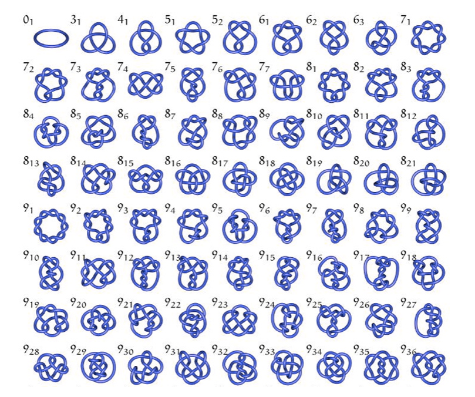
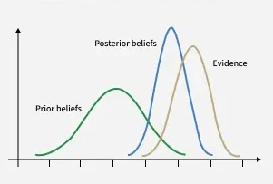

# Appendix

## Laplace Transform

It is defined as:

$$\mathcal{L}\{f(t)\} = F(s) = \int_{0}^{\infty} e^{-st} f(t) \,dt$$

This tool is widely used in engineering and physics to analyze control systems, circuits, and differential equations (Campbell and Haberman 247-250).

While named after Pierre-Simon Laplace, the transform's essential ideas appeared much earlier in Leonhard Euler's work from the 1730s and 1750s (Deakin 264-267). Euler used similar integral transforms to solve differential equations decades before Laplace formalized the method, demonstrating once again how mathematical concepts often exist in practice before receiving their formal names and notation (Deakin 268-269). The transform remained relatively obscure until Oliver Heaviside rediscovered and popularized operational methods in the late 19th century for solving electrical circuit problems (Widder 419-420).

The Laplace transform is computed by evaluating the improper integral, often using tables for common functions (MIT OCW). Inverse Laplace transforms recover $f(t)$ from $F(s)$, typically using partial fraction decomposition and inverse transform tables (Ungar 786-788; Widder 179-180). However, the inversion process can be remarkably intuitive once patterns are recognized, allowing practitioners to work "by inspection" without formal calculations (Ungar 789-791).

Beyond basic forms, the Laplace transform has been computed for remarkably complex functions including Bessel functions $J_n(t)$ (Spiegel 329-330), error functions (Opatowski 392), and the psi (digamma) function (Dixit 593-600). These specialized results connect the Laplace transform to deep areas of mathematical analysis including the gamma function and Euler's constant (Pribitkin 241-245). Generalizations extend the classical Laplace transform to time scales and conformable derivatives, broadening its applicability to discrete-continuous hybrid systems (Thange et al. 1699-1705).

**Properties** (Campbell and Haberman 251-255; Guggenheimer 196-198):

- Linearity $\mathcal{L}\{af+bg\} = aF+bG$
- Differentiation $\mathcal{L}\{f'\}=sF(s)-f(0)$
- Convolution $L\{f*g\}=F(s)G(s)$

**Advantages of Laplace Transform**:

- _Simplification_: Converts complicated integro-differential equations into easy algebraic expressions (Lunardi 185-188).
- _Initial Conditions_: Automatically incorporates initial conditions, making it ideal for transient analysis (Guggenheimer 199-200).
- _System Function_: Allows for the derivation of a "transfer function," which helps in understanding system behavior (stability) without solving the entire equation (Campbell and Haberman 258-262).
- _Matrix Exponentials_: Provides elegant methods for computing $e^{At}$ in systems of differential equations using algorithmic approaches (Adkins and Davidson 267-273).

| Transforms                                                                      |
| :------------------------------------------------------------------------------ |
| $\displaystyle \mathcal{L}\{1\} = \frac{1}{s}$                                  |
| $\displaystyle \mathcal{L}\{t^n\} = \frac{n!}{s^{n+1}}$ (Pribitkin 238-240)     |
| $\displaystyle \mathcal{L}\{e^{at}\} = \frac{1}{s-a}$                           |
| $\displaystyle \mathcal{L}\{\sin(bt)\} = \frac{b}{s^2+b^2}$ (Efthimiou 376-378) |

## Taylor Series

For a function $f(x)$ expanded around point $a$, the Taylor series is:

$$f(x) = f(a) + f'(a)(x-a) + \frac{f''(a)}{2!}(x-a)^2 + \frac{f'''(a)}{3!}(x-a)^3 + \cdots = \sum_{n=0}^{\infty} \frac{f^{(n)}(a)}{n!}(x-a)^n$$

When $a = 0$, this becomes the Maclaurin series. The remarkable fact is that every power series is actually a Taylor series for some function (Meyerson 51-52), creating a fundamental equivalence between polynomial approximations and smooth functions.

The Taylor series represents one of mathematics' most powerful ideas: any sufficiently smooth curve can be approximated locally by polynomials (Eves 40-45). The Mean Value Theorem guarantees that the error in truncating a Taylor series after $n$ terms can be bounded and estimated (Spiegel 263-266). This connection between derivatives and polynomial approximations enables both theoretical analysis and practical computation (Widder 126-130).

Taylor series converge to the original function within a specific radius of convergence, but can diverge outside this region or at certain pathological points (Erdős et al. 262-266). The coefficients' behavior determines convergence properties: bounded coefficients ensure convergence within the unit circle (Duffin and Schaeffer 141-145). The deep connection between Taylor series and Laplace transforms provides powerful tools for solving differential equations (Euler 305-307). Integration methods like Romberg integration leverage Taylor series to achieve high-precision numerical results (Rozema 284-288).

### Estimated Time Arrival

Suppose you're driving on a highway toward a destination 50 miles away. Your GPS doesn't just divide distance by current speed—it uses a Taylor series approximation of your position over time.

Let $s(t)$ be your position along the route at time $t$ (in miles from start). At the current time $t_0$, the GPS knows:

- Your current position: $s(t_0) = 10$ miles
- Your current velocity: $s'(t_0) = v_0 = 60$ mph
- Your current acceleration: $s''(t_0) = a_0 = 5$ mph per hour (you're speeding up)

To predict your position at future time $t = t_0 + \Delta t$, the GPS uses a truncated Taylor series:

$$s(t_0 + \Delta t) \approx s(t_0) + s'(t_0)\Delta t + \frac{s''(t_0)}{2}(\Delta t)^2$$

**First-order approximation (constant velocity)**:
$$s(t_0 + \Delta t) \approx 10 + 60\Delta t$$
To reach the destination at 50 miles: $\displaystyle 50 = 10 + 60\Delta t \Rightarrow \Delta t = \frac{40}{60} = 0.667$ hours ≈ 40 minutes.

**Second-order approximation (accounting for acceleration)**:
$$s(t_0 + \Delta t) \approx 10 + 60\Delta t + \frac{5}{2}(\Delta t)^2$$
To reach 50 miles: $50 = 10 + 60\Delta t + 2.5(\Delta t)^2$

Solving the quadratic: $2.5(\Delta t)^2 + 60\Delta t - 40 = 0$
$$\Delta t = \frac{-60 + \sqrt{3600 + 400}}{5} = \frac{-60 + 63.25}{5} \approx 0.65 \text{ hours} \approx 39 \text{ minutes}$$

The acceleration term changes the estimate by about 1 minute. If the GPS tracked higher-order derivatives (jerk, snap, crackle), it could include third, fourth, and fifth-order terms for even greater precision (Banner 562-565).

Modern GPS systems continuously update these calculations, incorporating:

- Traffic conditions (modeled as velocity changes)
- Speed limit changes (discontinuous derivatives)
- Historical traffic patterns (probabilistic modifications to the Taylor expansion)
- Route geometry (curves requiring different acceleration profiles)

Every time your GPS updates "Arrival: 3:47 PM" to "Arrival: 3:45 PM" as you accelerate onto the highway, it's recalculating the Taylor series with new derivative values. You're witnessing calculus update in real-time, packaged in a simple interface (Banner 570-572).

## Eigenvalue / Eigenvector

Formally, given a linear transformation represented by matrix $A$, a nonzero vector $v$ is an eigenvector with eigenvalue $\lambda$ if $Av = \lambda v$
The transformation takes the vector $v$ and multiplies it by a scalar factor $\lambda$, preserving its direction (Chu 1-5).

The eigenvalue problem is one of the most fundamental in mathematics, appearing in differential equations, quantum mechanics, structural engineering, and data analysis (Chu 5-10). Finding eigenvalues requires solving the characteristic equation $\det(A - \lambda I) = 0$, which reduces the linear algebra problem to finding roots of a polynomial (Tisseur and Meerbergen 235-240). For an $n \times n$ matrix, this yields $n$ eigenvalues (counting multiplicity), though they may be complex even when $A$ is real.

The quadratic eigenvalue problem $(\lambda^2 M + \lambda C + K)x = 0$ arises in vibration analysis, acoustic modeling, and fluid-structure interaction, generalizing the standard problem to account for damping and stiffness (Tisseur and Meerbergen 240-250). The inverse eigenvalue problem—constructing a matrix from specified eigenvalues—has applications in control theory, system identification, and molecular structure determination (Chu 10-20). In random matrix theory, eigenvalue distributions exhibit phase transitions and universal behavior with applications to statistics, nuclear physics, and wireless communications (Baik et al. 1643-1650).

### Musical Instruments (Resonance)

Musicians intuitively understand that instruments have "sweet spots" where certain notes resonate—they're finding physical eigenmodes without solving differential equations (Tisseur and Meerbergen 270-275).

A guitar string fixed at both ends (length $L$) obeys the wave equation:
$$\frac{\partial^2 u}{\partial t^2} = c^2 \frac{\partial^2 u}{\partial x^2}$$
where $u(x,t)$ is the displacement at position $x$ and time $t$, and $\displaystyle c = \sqrt{\frac{T}{\mu}}$ is wave speed (tension $T$, mass per length $\mu$).

Seeking standing wave solutions of the form $u(x,t) = X(x) \cdot \cos(\omega t)$ and applying boundary conditions $u(0,t) = u(L,t) = 0$ (fixed ends) yields the spatial eigenvalue problem:
$$\frac{d^2 X}{dx^2} = -k^2 X, \quad X(0) = X(L) = 0, \quad \text{where}\quad k = \frac{\omega}{c}$$

_Eigenfunctions (mode shapes)_:
$$X_n(x) = \sin\left(\frac{n\pi x}{L}\right), \quad n = 1, 2, 3, \ldots$$

These are the only shapes the string can vibrate in without "twisting into chaos"—each is an eigenfunction of the differential operator $\displaystyle \frac{d^2}{dx^2}$ with eigenvalue $\displaystyle -k_n^2 = -\left(\frac{n\pi}{L}\right)^2$.

_Eigenvalues (frequencies)_:
$$f_n = \frac{nc}{2L} = \frac{n}{2L}\sqrt{\frac{T}{\mu}}$$

For a guitar A string ($L \approx 0.65$ m, fundamental $f_1 = 110$ Hz):

- $n=1$: Fundamental tone, 110 Hz (the note you hear)
- $n=2$: First overtone, 220 Hz (octave higher)
- $n=3$: Second overtone, 330 Hz
- $n=4$: Third overtone, 440 Hz (two octaves higher)

When you pluck the string, the initial displacement decomposes into a sum of these eigenfunctions:
$$u(x,t) = \sum_{n=1}^{\infty} a_n \sin\left(\frac{n\pi x}{L}\right) \cos(2\pi f_n t)$$

The coefficients $a_n$ depend on _where_ you pluck. Plucking at the center excites odd harmonics strongly; plucking near the end emphasizes higher harmonics, creating a brighter timbre (Tisseur and Meerbergen 250-255). The guitar string "knows" its eigenmodes instinctively—physics forces the vibration into these patterns. Every musical instrument (violin, piano, flute, drum) operates on eigenvalue principles: permitted vibration modes determined by geometry and boundary conditions (Chu 25-30).

### Google's Original PageRank Algorithm

When you search Google and trust that the top result is probably most relevant, you're relying on eigenvector mathematics you've never seen (Bryan and Leise 580-581). The formalism $Av = \lambda v$ and characteristic polynomials $\det(A - \lambda I) = 0$ provide precision, but the conceptual competence—recognizing special directions, resonant patterns, influential positions, and dominant modes—operates continuously in perception, music, social navigation, and spatial reasoning (Schonefeld 318-319).

_The \$25 Billion Eigenvector_: In 2006, Google's market value was tied to this eigenvector computation running on billions of pages (Bryan and Leise 569). The algorithm's brilliance: reducing the subjective problem of "importance" to an objective eigenvalue problem (Langville and Meyer 135-145). Modern search uses hundreds of factors, but PageRank's eigenvector remains foundational (Langville and Meyer 145-155).

Imagine a simplified web with 4 pages. The link structure forms a matrix $H$ where $\displaystyle H_{ij} = \frac{1}{n_j}$ if page $j$ links to page $i$ ($n_j$ = number of outlinks from page $j$), and 0 otherwise.

Suppose:

- Page 1 links to pages 2, 3, 4
- Page 2 links to page 1
- Page 3 links to pages 1, 4
- Page 4 links to pages 1, 2, 3

The hyperlink matrix:

$$
H = \begin{bmatrix}
0 & 1 & 1/2 & 1/3 \\
1/3 & 0 & 0 & 1/3 \\
1/3 & 0 & 0 & 1/3 \\
1/3 & 0 & 1/2 & 0
\end{bmatrix}
$$

PageRank assumes a "random surfer" who follows links with probability $d \approx 0.85$ and jumps to a random page with probability $1-d$. The Google matrix:
$$G = dH + \frac{1-d}{n}E$$
where $E$ is the matrix of all ones, and $n=4$ pages. The PageRank vector $\pi$ satisfies 
$G\pi = \pi$

This is an eigenvector equation with eigenvalue $\lambda = 1$ (Bryan and Leise 572-575). The eigenvector components represent page importance:
$$\pi = \begin{bmatrix} 0.387 \\ 0.213 \\ 0.177 \\ 0.223 \end{bmatrix}$$

Page 1 receives 38.7% of the "importance," making it the top search result. Pages 2, 4, 3 follow in that order.

## Game Theory

Game theory is a mathematical framework for analyzing strategic interactions between rational decision-makers, where the outcome for each participant depends on the actions of others (Binmore 25-27). It models scenarios involving conflict or cooperation to identify optimal strategies, commonly used in economics, biology, and social sciences to predict behaviors (Resnik 121-125).

Game theory provides a rigorous mathematical framework, often requiring knowledge of calculus and real analysis, particularly for finding "existence proofs" of solutions such as Nash's theorem (Binmore 28-30). The core goal is to determine the best action for a player when the outcome depends on the actions of others (Resnik 125-128). Interestingly, game theory exhibits uncertainty principles analogous to quantum mechanics, where certain strategic information cannot be simultaneously optimized (Székely and Rizzo 688-695).

The notation of payoff matrices $u_i(s_1, s_2, \ldots, s_n)$ and Nash equilibrium conditions formalizes thinking that humans already do implicitly in countless social situations. While formal game theory requires mathematical sophistication, strategic competence—anticipating others' responses and optimizing accordingly—operates constantly in daily life, unrecognized as "mathematics" by those who claim to be "bad at math" (Stone 240-244; Rubinstein 140-146).

**Nash Equilibrium**: A situation where no player can benefit by changing strategies while others keep theirs unchanged (Binmore 30-32). Formally, a strategy profile $(s_1^*, s_2^*, \ldots, s_n^*)$ is a Nash equilibrium if for every player $i$ and every alternative strategy $s_i$:
$$u_i(s_1^*, \ldots, s_i^*, \ldots, s_n^*) \geq u_i(s_1^*, \ldots, s_i, \ldots, s_n^*)$$
where $u_i$ is player $i$'s utility function. It is foundational for predicting stable outcomes in competitive scenarios (Resnik 135-140).

**Mathematical Techniques**: Range from basic arithmetic for simple models to calculus (derivatives for optimization), linear algebra (eigenvector methods for finding equilibria), and probability for mixed strategies in complex scenarios (Weil 360-363; Binmore 25-34).

**Payoff Matrices**: Used to visualize and calculate the results of simultaneous games (like the Prisoner's Dilemma) for each player based on their choices (Resnik 130-135). Matrix entries represent utilities $u_i(s_1, s_2)$ for each combination of strategies.

**Utility Maximization**: Players assign numerical values (utility) to outcomes, acting to maximize their own expected utility (Binmore 26-28). The expected utility for mixed strategies is computed as 
$$E[u_i] = \sum_{s \in S} p(s) \cdot u_i(s)$$
where $p(s)$ is the probability of strategy profile $s$ 

### Prisoner's Dilemma

Two suspects are arrested and interrogated separately. Each has two strategies:

- **Cooperate** (with each other, stay silent)
- **Defect** (betray the other).

The payoff matrix shows years in prison (negative utility), with each entry $(a, b)$ represents (Suspect 1's years, Suspect 2's years):

|                          | **Suspect 2: Cooperate** | **Suspect 2: Defect** |
| ------------------------ | ------------------------ | --------------------- |
| **Suspect 1: Cooperate** | (-1, -1)                 | (-10, 0)              |
| **Suspect 1: Defect**    | (0, -10)                 | (-5, -5)              |

From Suspect 1's perspective:

- If Suspect 2 cooperates: Defecting gives 0 years vs. 1 year → **Defect is better**
- If Suspect 2 defects: Defecting gives 5 years vs. 10 years → **Defect is better**

Defecting is a **dominant strategy**—it's optimal regardless of the opponent's choice (Cunningham 15-18).

By symmetry, Suspect 2 has the same reasoning. Both rationally choose to defect, yielding outcome **(-5, -5)**.

_Nash Equilibrium_: (Defect, Defect) is the unique Nash equilibrium (Cunningham 18-20). At this point:
$$u_1(\text{Defect}, \text{Defect}) = -5 \geq u_1(\text{Cooperate}, \text{Defect}) = -10$$
$$u_2(\text{Defect}, \text{Defect}) = -5 \geq u_2(\text{Defect}, \text{Cooperate}) = -10$$

Neither player can unilaterally improve by switching strategies.

Mutual cooperation **(-1, -1)** would be better for both than mutual defection **(-5, -5)**, but rational self-interest prevents this outcome (Cunningham 20-24). This illustrates how individual rationality can lead to collective irrationality—a fundamental insight with implications for environmental policy, arms races, and public goods provision (Rubinstein 100-110).

When the game repeats indefinitely, cooperation can emerge through strategies like "Tit-for-Tat" (start cooperating, then mirror opponent's previous move). The folk theorem shows that with sufficient patience (low discount rate), nearly any outcome between full defection and full cooperation can be sustained as an equilibrium (Resnik 155-165).

### Helping a Coworker

You and a coworker are both working on a project that affects both your reputations. Each can choose:

- **Help** (contribute extra effort)
- **Slack** (minimal effort).

Payoffs represent net benefit (recognition minus effort):

|                | **Coworker: Help** | **Coworker: Slack** |
| -------------- | ------------------ | ------------------- |
| **You: Help**  | (3, 3)             | (-1, 4)             |
| **You: Slack** | (4, -1)            | (0, 0)              |

Interpretation:

- **(Help, Help) = (3, 3)**: Both contribute, project succeeds, both get credit minus effort cost
- **(Help, Slack) = (-1, 4)**: You work hard while they coast; they get credit, you're exhausted
- **(Slack, Help) = (4, -1)**: You coast while they work; you get credit without effort
- **(Slack, Slack) = (0, 0)**: Project mediocre, no one looks good, minimal effort wasted

From your perspective:

- If coworker helps: Slacking gives 4 vs. 3 → **Slack is better** (+1 gain)
- If coworker slacks: Slacking gives 0 vs. -1 → **Slack is better** (+1 gain)

Slacking is a dominant strategy for both players.

_Nash Equilibrium_: (Slack, Slack) with payoff **(0, 0)** (Binmore 30-32). Neither can improve unilaterally:
$$u_{\text{you}}(\text{Slack}, \text{Slack}) = 0 \geq u_{\text{you}}(\text{Help}, \text{Slack}) = -1$$

But mutual helping **(3, 3)** is Pareto superior—better for everyone (Cunningham 24-26). This creates workplace tension: rational self-interest suggests slacking, but everyone is worse off than if they'd cooperated.

Real-World Modifications:

- **Repeated interaction**: If you work together repeatedly, defecting (slacking) now damages future cooperation. The shadow of the future makes cooperation rational (Resnik 155-160).
- **Reputation**: In office environments, your choice affects your reputation. The single-shot payoffs don't capture long-term career costs of being known as a slacker (Rubinstein 110-120).
- **Altruism/Reciprocity**: People often have utility functions that value fairness and reciprocity beyond pure self-interest, changing the effective payoff matrix (Rubinstein 120-130).

Every time you think "I'll help if they help, but I'm not getting taken advantage of," you're computing conditional strategies in an implicit repeated game (van Benthem et al. 126-129).

## Fourier Transform

The continuous Fourier Transform is defined as:

$$\mathcal{F}\{f(t)\} = F(\omega) = \int_{-\infty}^{\infty} f(t) e^{-i\omega t} \,dt$$

where $f(t)$ is the time-domain signal and $F(\omega)$ is the frequency-domain representation (Berry 227-230). The inverse transform reconstructs the original signal: 
$$f(t) = \frac{1}{2\pi} \int_{-\infty}^{\infty} F(\omega) e^{i\omega t} \,d\omega$$
This bidirectional relationship—the Fourier Transform Identity Theorem—guarantees that information is perfectly preserved in both representations (Berry 230-232, 227).

The Fourier Transform satisfies remarkable inequalities that constrain how "spread out" a function can be simultaneously in time and frequency domains (Beckner 159-165). These uncertainty principles, formalized through weighted norm inequalities, have profound implications from quantum mechanics to signal processing (Beckner 175-180; Muckenhoupt 729-735). Mean convergence theorems ensure that Fourier representations converge to the original function under broad conditions (McShane 205-208). The transform extends beyond real and complex numbers to quaternions and higher algebraic structures, enabling analysis of multidimensional rotations and color image processing (Gao 9851-9860).

### Piano Chords

When you play a single note, say middle A at 440 Hz, the sound wave can be approximated as:
$$A(t) = \sin(2\pi \cdot 440 \cdot t)$$

When you play a chord—say A-major with notes A (440 Hz), C# (554 Hz), and E (659 Hz)—the sound wave is the sum:
$$S(t) = A_1\sin(2\pi \cdot 440t) + A_2\sin(2\pi \cdot 554t) + A_3\sin(2\pi \cdot 659t)$$

where $A_1, A_2, A_3$ are the amplitudes (loudness) of each note. The Fourier Transform decomposes this composite wave:
$$\mathcal{F}\{S(t)\} = F(\omega)$$

producing a frequency spectrum with three distinct peaks at 440 Hz, 554 Hz, and 659 Hz, with heights proportional to $A_1, A_2, A_3$ (Alm and Walker 461-465). This decomposition reveals exactly which notes are present and their relative volumes—information that exists in the composite waveform but is invisible in the time domain.

Real instruments are far more complex. A piano string doesn't produce a pure sine wave; it generates overtones (harmonics) at integer multiples of the fundamental frequency: 440 Hz, 880 Hz, 1320 Hz, etc. (Alm and Walker 465-470). The Fourier Transform reveals this entire harmonic structure:
$$\text{Piano A} = \sum_{n=1}^{\infty} a_n \sin(2\pi \cdot n \cdot 440 \cdot t)$$

where the coefficients $a_n$ decrease with $n$. The unique pattern of these overtones—the relative strengths of the harmonics—defines the instrument's timbre (Alm and Walker 471-473). A violin playing the same note has a different pattern of $a_n$ values, which is why it sounds distinct from a piano despite playing the same fundamental frequency.

## Euclidean Geometry

It is based on the axioms and postulates established by the ancient Greek mathematician Euclid. His notable work, _The Elements_, systematically organized geometric concepts into a cohesive framework using five postulates and fundamental definitions (Meserve 372-374). Commonly referred to as plane geometry, this branch illustrates the two-dimensional realm and also includes aspects of three-dimensional space. In Euclidean geometry, parallel lines never meet, and the sum of the interior angles in a triangle equals $180^\circ$ (Mader 43).

For centuries, philosophers debated whether Euclidean geometry was a discovered truth about physical reality or a human construction. Kant argued that Euclidean geometry was synthetic a priori knowledge—built into the structure of human perception itself (Jones 137-138; French 213). The later development of non-Euclidean geometries challenged this view, demonstrating that alternative geometric systems could be logically consistent, suggesting geometry might be a choice rather than a necessity (Jones 140-142). This philosophical shift—from viewing Euclidean geometry as "the" geometry to recognizing it as "a" geometry—represents one of mathematics' most profound conceptual revolutions (Daus 12-13).

Euclid's Elements is a foundational 13-book mathematical treatise, written around 300 BCE in Alexandria, which structured plane/solid geometry, number theory, and proportion through a logical framework of definitions, postulates, and proofs. It is the oldest, most influential deductive textbook in history, establishing the use of straight-edge and compass constructions.

**Key aspects include**:

- _The Five Postulates_: Euclidean geometry is based on five core assumptions, including that a straight line can be drawn between any two points, and the "parallel postulate," which dictates how parallel lines behave (Menger 721-722).
- _Properties_: The shortest distance between two points is a straight line, and all right angles ($90^\circ$) are congruent (Green 343).
- _Applications_: It is used to analyze 2D figures (planes) and 3D objects (solid geometry) (Posamentier et al. 221)

Mathematics educators face a persistent challenge: how to teach Euclidean geometry in a way that maintains its logical rigor while remaining accessible (Allendoerfer 165-167). The axiomatic approach, while mathematically elegant, often alienates students who can demonstrate geometric competence through construction, measurement, and spatial reasoning (Allendoerfer 168-169). This pedagogical tension mirrors the document's central theme—students may possess geometric understanding that formal axioms fail to capture or validate.

### Origami as Euclidean Construction

Remarkably, origami can solve certain geometric problems that are impossible with classical tools alone, such as trisecting an angle (Geretschläger 365-368). Someone who masters complex origami demonstrates profound geometric intuition without ever encountering formal proofs.

Consider folding a traditional paper crane (orizuru), which requires approximately 20-25 distinct folds.

- _Angle bisection_: Every valley fold bisects the angle between existing creases
- _Perpendicular construction_: Edge-to-edge folds create perpendiculars automatically
- _Proportion creation_: The $1:\sqrt{2}$ ratio appears in diagonal folds
- _Symmetry operations_: The crane exhibits bilateral symmetry across its central axis
- _Three-dimensional construction_: Flat Euclidean operations create a spatial form

Starting with a square sheet with corners at coordinates $(0,0)$, $(1,0)$, $(1,1)$, and $(0,1)$:

1. **Diagonal Folds** - Fold corner to opposite corner, creating the two main diagonals:
   $$L_1: y = x \quad \text{and} \quad L_2: y = 1-x$$

   These lines bisect the square at $90°$ angles, meeting at the center point $(0.5, 0.5)$. This construction divides the square into four congruent right isosceles triangles, each with legs of length $\displaystyle \frac{1}{\sqrt{2}}$ and angles of $45°-45°-90°$ (Geretschläger 358-360).

2. **Edge Midpoint Folds** - Folding each edge to the opposite edge creates perpendicular bisectors:
   $$L_3: x = 0.5 \quad \text{and} \quad L_4: y = 0.5$$

   These four fold lines (two diagonals + two edge bisectors) create the "preliminary fold" pattern, dividing the square into 8 congruent triangular regions. The intersection points form a regular octagon inscribed within the square (Geretschläger 361-363).

3. **The Bird Base Construction** - Creating the bird base requires collapsing the preliminary fold and then performing "petal folds." A petal fold brings a corner point to a central axis while simultaneously bisecting two angles:

   For the top flap, if the corner is at $(0.5, 1)$ and must align with the central vertical axis, the fold line satisfies:
   $$\text{Fold line: } y - 0.5 = m(x - 0.5)$$

   where $m = \tan(67.5°) \approx 2.414$. This creates an angle bisector dividing the original $135°$ angle into two $67.5°$ angles (Geretschläger 365-366).

4. **Geometric Transformations** - Each fold is mathematically a reflection across the fold line. If a fold line is $ax + by + c = 0$, a point $(x_0, y_0)$ reflects to:
   $$\left(x_0 - \frac{2a(ax_0 + by_0 + c)}{a^2 + b^2}, y_0 - \frac{2b(ax_0 + by_0 + c)}{a^2 + b^2}\right)$$

   The paper crane ultimately creates a three-dimensional structure from these planar reflections. The final crane has specific proportions: if the square has side length $s$, the crane's wingspan is approximately $0.7s$, and its body length is approximately $0.5s$ (Geretschläger 368-370).

Someone folding a paper crane performs dozens of angle bisections, creates precise $22.5°$ and $67.5°$ angles through repeated halving, constructs perpendiculars and parallels, and maintains symmetry—all without calculating a single trigonometric function or measuring an angle with a protractor (Geretschläger 370-371). The geometric competence is complete and rigorous; only the formal vocabulary is absent.

## Non-Euclidean Geometry

Non-Euclidean geometry is a branch of mathematics that defines space using different rules than classical Euclidean (flat) geometry, primarily by rejecting Euclid's parallel postulate (Busemann 19; Halsted 123). It describes curved spaces—either spherical (positive curvature) or hyperbolic (negative curvature)—where parallel lines can intersect or diverge, and the angles of a triangle do not sum to $180^\circ$ (Busemann 21-23).

The development of non-Euclidean geometry marks a remarkable milestone in mathematics, showcasing the vibrant evolution of our understanding. For over 2,000 years, mathematicians diligently sought to establish Euclid's fifth postulate—the parallel postulate—as a consequence of the other four postulates, believing it necessary to derive it from more fundamental principles (Halsted 247-249; Daus 12). A significant breakthrough occurred in the early 19th century when János Bolyai, Nikolai Lobachevsky, and Carl Friedrich Gauss independently demonstrated that legitimate geometries could indeed be formed by discarding the parallel postulate (Halsted 149-150; Miller 370-371). It is fascinating to note that concepts similar to non-Euclidean geometry might have been subtly sensed even before Euclid formalized his system (Tóth 87-90). The rich history of non-Euclidean geometry imparts a profound lesson about our mathematical journey. Over the centuries, while mathematicians possessed the logical tools necessary for exploring non-Euclidean principles, their understanding was often constrained by the prevailing belief in the supremacy of Euclidean geometry (Jones 139-140). The hindrance was not one of computation but rather a conceptual barrier. Once this mindset shifted, mathematics flourished. Similarly, students today may have innate geometric intuition and spatial reasoning that traditional Euclidean axioms fail to adequately capture. The potential for understanding is certainly present; it simply requires the right language to bring it to light.

- **Spherical (Elliptic) Geometry**: Models a positively curved surface, like a sphere (Leisenring 315). "Straight" lines are great circles, meaning parallel lines do not exist and all lines eventually intersect. The sum of angles in a triangle is always greater than $180^\circ$ (Busemann 22; Leisenring 317-318).

- **Hyperbolic Geometry**: Models a negatively curved, saddle-shaped surface (Busemann 23-25). Through a point not on a given line, there are at least two distinct parallel lines, and often infinitely many, that never intersect. The sum of angles in a triangle is less than $180^\circ$ (Leisenring 319-320). Visualizing hyperbolic space challenges human intuition, as we evolved in approximately Euclidean environments (Banchoff).

- **Key Differences**: In Non-Euclidean spaces, parallel lines can intersect (spherical) or curve away from each other (hyperbolic), and shapes cannot be scaled up or down without changing their angle measurements (Miller 371-372). Area formulas behave fundamentally differently: in hyperbolic geometry, area can be directly calculated from angles alone, without measuring sides (Leisenring 315-320).

## Genus

More specifically, genus measures the maximum number of non-intersecting simple closed curves that can be drawn on the surface without separating it into disconnected pieces (Munkres 341-343). This concept arises from topology, a branch of mathematics focused on properties preserved through continuous deformation—stretching, bending, and twisting—but not tearing or gluing (Armstrong 5-10).

The genus provides a complete classification of closed orientable surfaces, indicating that every such surface is topologically equivalent to a sphere with $g$ handles attached (Munkres 344-346). A remarkable aspect of the genus is that it is a topological invariant—it remains unchanged under continuous deformation (Armstrong 15-18). For example, a coffee mug can be continuously transformed into a donut by gradually morphing the handle into a ring shape, without tearing or creating new holes. Both the mug and the donut have a genus of 1, making them topologically equivalent despite their vastly different everyday functions (Munkres 341).

This counterintuitive equivalence illustrates how topology defines "sameness" differently from Euclidean geometry: in topology, shape and size are irrelevant; instead, fundamental structural properties like connectivity and the number of holes are what matter (Armstrong 10-12).

Mathematically, for a closed orientable surface, the genus $g$ relates to the surface's Euler characteristic $\chi$ through the formula:
$$\chi = 2 - 2g$$

where the Euler characteristic can be computed for any polyhedron as $\chi = V - E + F$ (vertices minus edges plus faces) (Armstrong 78-82). A sphere has $\chi = 2$, giving $g = 0$. A torus (donut shape) has $\chi = 0$, giving $g = 1$. A double torus (two-holed donut) has $\chi = -2$, giving $g = 2$ (Munkres 346-348).

## Number Theory

Often called "the queen of mathematics" by Carl Friedrich Gauss, number theory has historically been pursued for its intrinsic beauty and logical elegance rather than practical application (Hardy and Wright v-vi). Yet paradoxically, in the late 20th century, number theory became the foundation of modern cryptography and digital security, transforming one of the most "pure" mathematical disciplines into one of the most practically consequential (Koblitz 1-3). Despite its reputation for abstraction, number theory permeates daily life in ways most people never recognize.

The irony is instructive: mathematical knowledge developed for purely aesthetic reasons centuries ago—Fermat's Little Theorem (1640), Euler's Theorem (1736), Gauss's modular arithmetic (1801)—became essential tools for 21st-century digital infrastructure (Koblitz 3-8). This demonstrates both the unpredictability of mathematical application and the value of pursuing abstract knowledge without demanding immediate utility. Number theory's journey from "pure" to "applied" mathematics illustrates how mathematical structures, once understood, persist as tools waiting for problems they can solve (Koblitz 8-10).

The ancient Greeks studied perfect numbers and amicable numbers; Fermat posed questions in the 1600s that weren't resolved until the 1990s; the Riemann Hypothesis, formulated in 1859, remains unsolved and is considered one of mathematics' greatest open problems (Derbyshire 1-15). For over two millennia, number theory was the epitome of "useless" mathematics—pursued purely for intellectual satisfaction (Hardy 150-152). G.H. Hardy famously wrote in 1940 that number theory "has never been of the slightest practical use" and would never be applied to warfare or commerce (Hardy 151). Within decades, his prediction was spectacularly wrong. The development of public-key cryptography in the 1970s, particularly the RSA algorithm, transformed number theory into a discipline of profound practical importance (Koblitz 1-3; Rivest et al. 120-123). Today, number-theoretic algorithms secure credit card transactions, authenticate digital signatures, enable blockchain technology, and protect government communications (Menezes et al. 1-5).

**Modular Arithmetic**: One of number theory's most powerful tools is modular arithmetic, formalized by Gauss in his 1801 _Disquisitiones Arithmeticae_ (Gauss 1-5; Dudley 1-3). In modular arithmetic, numbers "wrap around" upon reaching a certain value called the modulus. Two integers $a$ and $b$ are congruent modulo $n$ (written $a \equiv b \pmod{n}$) if they differ by a multiple of $n$—equivalently, if they leave the same remainder when divided by $n$ (Dudley 3-5). Formally:

$$a \equiv b \pmod{n} \iff n \mid (a - b)$$

where $n \mid (a - b)$ means "$n$ divides $(a-b)$" (Dudley 4). For example, $17 \equiv 5 \pmod{12}$ because $17 - 5 = 12$, which is divisible by 12. Both 17 and 5 leave remainder 5 when divided by 12.

Modular arithmetic behaves algebraically: congruences can be added, subtracted, and multiplied while preserving congruence (Dudley 5-8). If $a \equiv b \pmod{n}$ and $c \equiv d \pmod{n}$, then:

- $a + c \equiv b + d \pmod{n}$
- $a - c \equiv b - d \pmod{n}$
- $a \cdot c \equiv b \cdot d \pmod{n}$

This algebraic structure makes modular arithmetic extraordinarily useful for solving problems about remainders, cyclical patterns, and divisibility (Dudley 8-10).

_Prime Numbers and Unique Factorization_: Central to number theory is the _Fundamental Theorem of Arithmetic_: every integer greater than 1 can be expressed uniquely as a product of prime numbers (Hardy and Wright 2-3). For example, $360 = 2^3 \times 3^2 \times 5$. This unique prime factorization is so foundational that it's easy to overlook its significance—without it, arithmetic as we know it would collapse (Hardy and Wright 3-4). The theorem guarantees that primes are the "atoms" of number theory: all composite numbers are built from primes in exactly one way.

Primes themselves exhibit mysterious patterns. The _Prime Number Theorem_, proved independently by Hadamard and de la Vallée Poussin in 1896, describes the asymptotic distribution of primes: the number of primes less than $x$ is approximately $\displaystyle \frac{x}{\ln(x)}$ (Derbyshire 70-75). Yet despite this regularity in the large-scale distribution, the primes appear randomly scattered when examined locally—no simple formula generates all primes, and predicting the next prime remains computationally challenging for large numbers (Derbyshire 75-80).

This asymmetry—multiplication is easy, factorization is hard—became the cornerstone of modern cryptography (Koblitz 1-5). Multiplying two 300-digit primes takes milliseconds on a standard computer. Factoring their product back into those primes could take longer than the age of the universe with current classical algorithms (Koblitz 5-8). This computational asymmetry, a fundamental property of number theory, protects every secure online transaction.

### RSA Encryption

It relies on the fact that it is easy to multiply two massive Prime Numbers together, but mathematically "impossible" for a hacker to figure out what those primes were just by looking at the result—the asymmetry between multiplication and factorization is the foundation of modern cryptography (Boyer and Moore 182; Meijer 103).

The journey from ancient cryptography to modern public-key systems illustrates how mathematical concepts accumulate power over time. Caesar used simple letter-shifting ciphers 2,000 years ago—pure modular arithmetic (Luciano and Prichett 3-5). During WWII, the Enigma machine relied on permutation groups, a concept from abstract algebra (Sinkov and Feil 1-15). By 1976, the RSA algorithm united number theory, modular arithmetic, and computational complexity into a system that revolutionized digital security (Luciano and Prichett 12-14; Holden 157-175). The same mathematical structures—just applied with increasing sophistication.

The security of online shopping relies on the _Integer Factorization Problem_ (Lefton 55-56). Here is the mathematical process:

1. Key Generation (Boyer and Moore 183-184)
   - First, pick two distinct large prime numbers, $p$ and $q$.
   - Compute the modulus: $n = p \times q$
   - Compute Euler's Totient: $\phi(n) = (p-1)(q-1)$
   - Choose a public exponent $e$ such that: $\gcd(e, \phi(n)) = 1$
2. The Private Key
   - The receiver calculates the secret private key $d$ using the **Extended Euclidean Algorithm** to solve for the modular multiplicative inverse: $de \equiv 1 \pmod{\phi(n)}$ (Lefton 57)
3. Encryption (The Computer's Task)
   - Your credit card data $M$ is transformed into ciphertext $C$ using the public key $(n, e)$: $C = M^e \pmod{n}$
4. Decryption (The Server's Task)
   - The merchant uses their private key $d$ to recover the original message: $M = C^d \pmod{n}$

> Note: This works because of **Euler's Theorem**, which states that $M^{e \cdot d} \equiv M \pmod{n}$ when the keys are generated this way (Boyer and Moore 185-187). The mathematical proof of RSA's correctness has been rigorously verified, even formalized in automated proof systems (Boyer and Moore 181). As one mathematician demonstrated, the elegance of RSA can even be expressed poetically: "To encode, just use the public key: _Compute M to the e, mod n_" (Treat 255).

### Elliptic Curve Encryption

Elliptic Curve Cryptography (ECC) relies on the algebraic structure of elliptic curves over finite fields, providing the same security as RSA with much smaller key sizes (DeArmond 2-5; Havil 205-210). While RSA might require a 2048-bit key for strong security, ECC achieves equivalent security with just 224 bits—making it ideal for smartphones and IoT devices where computational power is limited (Zimmermann 113). The mathematical foundation involves points on curves defined by equations like $y^2 = x^3 + ax + b$, where operations are performed modulo a prime number (Havil 206-208).

## Group Theory

Group theory is the branch of mathematics that studies symmetry and structure by analyzing groups—sets of elements combined with an operation (like multiplication or addition) that satisfy axioms of closure, associativity, identity, and invertibility. It provides a rigorous framework for identifying, classifying, and managing structural symmetries in mathematics, physics, and chemistry.

Groups are considered the foundation of abstract algebra because they isolate the core properties of algebraic operations, allowing mathematicians to study structural relationships in a generalized way. A group $G$ consists of a set of elements and a binary operation ($\cdot$) that combine two elements ($a, b$) to form another element ($a \cdot b$). Group theory formalizes symmetries, such as rotations and reflections of geometric shapes or permutations of roots in polynomial equations.

**The Four Group Axioms**:

1. Closure: If $a, b \in G$, then $a \cdot b \in G$.
2. Associativity: $(a \cdot b) \cdot c = a \cdot (b \cdot c)$.
3. Identity: An element $e$ exists such that $e \cdot a = a \cdot e = a$ for all $a \in G$.
4. Inverse: For every $a \in G$, there exists $a^{-1}$ such that $a \cdot a^{-1} = e$.

**Types of Groups**:

- _Abelian Group_: A group where the order of operations does not matter (commutative, $a \cdot b = b \cdot a$).
- _Finite Group_: A group with a finite number of elements (its order).
- _Isomorphic Groups_: Groups that are conceptually different but share the same structure and behave the same way.

### Rubik's Cube Moves

1. The Generators (The Actions)

   The group is generated by the set $S = \{R, L U, D, F, B\}$, representing the 90-degree clockwise turns of the six faces. Any sequence of moves is a word created from these letters (Turner and Gold 618).

2. The Group Axioms
   _Closure_: If you perform move $A$ and then move $B$, the result ( $AB$ ) is just another
   single, albeit more complex, element of the group.
   - _Identity_ ( $e$ ): This is the "do nothing" move. If you perform a sequence that returns the cube to its original state (like $R^4$ ), you have performed the identity.
   - _Inverses_: Every move has an opposite. The inverse of $R$ (clockwise) is $R'$ (counter-clockwise). For a sequence like $FR$, the inverse is $R'F'$.
   - _Associativity_: $(FR)U$ is the same as $F(RU)$. The order of operations matters, but the grouping doesn't.

3. Calculating the Size ( $|G|$ )
   The "43 quintillion" number comes from the Product Rule of combinatorics, constrained
   by the laws of the cube's mechanics (Turner and Gold 620):

   $$|G| = \frac{(8! \times 3^7) \times (12! \times 2^{11})}{2} = 43,252,003, 274, 489, 856, 000$$
   - _Corners_: $8!$ ways to arrange them; $3^7$ ways to orient them (the 8th is forced).
   - _Edges_: $12!$ ways to arrange them; $2^{11}$ ways to orient them (the 12th is forced).
   - _The "$/2$"_: You cannot swap just two pieces or flip a single edge without taking the cube apart; only even permutations are reachable (Turner and Gold 621; Hecker and Banerji 213).

4. Commutators and Conjugates

   Speedcubing "algorithms" are built on two specific structures:
   - _Commutators ( $aba^{-1}b^{-1}$ )_: Used to swap a few specific pieces while leaving the rest of the cube untouched.
   - _Conjugates ( $aba^{-1}$ )_: A "setup move" ( $a$ ), an operation ( $b$ ), and "undoing the setup" ($a^{-1}$).

- **God's Number: Solving Rubik's Cube in 20 Moves**
  **God's Number**—the maximum moves to solve any of the 43 quintillion states of a Rubik's Cube—is **20** (Half-Turn Metric). This represents the diameter of the Cayley graph of the Rubik's Cube group (Rokicki et al. 645). Proven in July 2010 by Tomas Rokicki, Morley Davidson, John Dethridge, and Herbert Kociemba using 35 CPU-years from Google, the proof combined mathematical group theory with massive computational search (Joyner 258; van Grol 10).

  **Lower Bound (n ≥ 20):** The "Superflip" position (all corners correct, all edges flipped) requires exactly 20 moves, proven by Michael Reid in 1995 (Rokicki et al. 647; Joyner 263).

  **Upper Bound (n ≤ 20):** Using coset decomposition and symmetry reduction, researchers reduced 43 quintillion positions to ~56 million unique cosets, solving each in ≤20 moves (Rokicki et al. 648-652; "God's Number Is 20").

  | **Metric**                   | **Detail**               |
  | ---------------------------- | ------------------------ |
  | God's Number (HTM)           | 20 moves                 |
  | Computing Power              | 35 CPU-years             |
  | Positions requiring 20 moves | ~490 million (0.000001%) |
  | Average optimal solution     | 17-18 moves              |

  **Metric Comparison:**

  | Metric             | Moves | Rule                                                                    |
  | ------------------ | ----- | ----------------------------------------------------------------------- |
  | Half-Turn (HTM)    | 20    | $F, F', F^2$ all = 1 move                                               |
  | Quarter-Turn (QTM) | 26    | $F, F'$ = 1 move; $F^2$ = 2 moves (Rokicki, "Towards God's Number" 242) |
  | Slice-Turn (STM)   | 18–20 | Middle slices (e.g., $M$) = 1 move (Hecker and Banerji 211)             |

  The variation in God's Number across metrics illustrates how mathematical results depend on formal definitions—the underlying puzzle-solving ability remains constant, but changing the "language" (metric) changes the answer (Jones et al. 267).

- **The Superflip**

  **Optimal 20-move sequence:** $U \ R^2 \ F \ B \ R \ B^2 \ R \ U^2 \ L \ B^2 \ R \ U' \ D' \ R^2 \ F \ R' \ L \ B^2 \ U^2 \ F^2$ (Rokicki et al. 647)

  **Notation:** $U, D, L, R, F, B$ = Up, Down, Left, Right, Front, Back (90° clockwise); $'$ (prime) = counter-clockwise; $^2$ = 180°.

  **Speedcuber version:** $(M' \ U) \times 4$, rotate cube ($y \ z'$), repeat $3 \times$ total.

  The Superflip demonstrates how complex mathematical objects can be described in plain language ("all edges flipped") yet require sophisticated group-theoretic proof to establish minimal solution length. This position is maximally distant from the solved state in the Cayley graph (van Grol 12).

- **Solving Algorithms**
  - **Thistlethwaite Algorithm (1980)**
    Proved the cube can be solved in ≤45 moves (avg. 31) using four nested subgroups ("Thistlethwaite's Algorithm"; Milewski and Frohardt 399). This algorithm demonstrates how breaking a problem into stages—each with progressively restricted "legal moves"—makes an impossibly large search space tractable.

    | Stage | Group | Allowed Moves                                  | Purpose                            | Max Moves |
    | ----- | ----- | ---------------------------------------------- | ---------------------------------- | --------- |
    | 0     | $G_0$ | $\langle L, R, F, B, U, D \rangle$             | Fully scrambled                    | -         |
    | 1     | $G_1$ | $\langle L, R, F, B, U^2, D^2 \rangle$         | Orient edges                       | 7         |
    | 2     | $G_2$ | $\langle L, R, F^2, B^2, U^2, D^2 \rangle$     | Position U/D edges, orient corners | 10        |
    | 3     | $G_3$ | $\langle L^2, R^2, F^2, B^2, U^2, D^2 \rangle$ | Correct orbits                     | 13        |
    | 4     | $G_4$ | $\{1\}$ (Identity)                             | Final permutation                  | 15        |

    **Key insight:** Coset decomposition and pruning the search space (e.g., $G_3$ has only ~663,552 states vs 43 quintillion in $G_0$) through one-way transitions between nested subgroups (Milewski and Frohardt 400). The formal language of subgroup chains $G_0 \supset G_1 \supset G_2 \supset G_3 \supset G_4$ describes a strategy any cuber uses intuitively: solve in stages.

  - **Kociemba's Algorithm (1992)**
    Modern standard for computer solvers; compresses Thistlethwaite's four stages into two phases, typically solving in ~20-22 moves ("Kociemba's Two-Phase Algorithm"; Joyner 260). This algorithm was fundamental to proving God's Number by enabling efficient computational search (Rokicki et al. 650).

    **Phase 1:** Reduce to subgroup $H$ where:
    - Edge Orientation (EO) solved
    - Corner Orientation (CO) solved
    - E-slice edges in middle layer

    Allowed moves: All ($\langle U, D, R, L, F, B \rangle$)

    **Phase 2:** Solve from $H$ (20 billion states) using only $\langle U, D, R^2, L^2, F^2, B^2 \rangle$. Uses pruning tables for near-instant optimal path (Rokicki et al. 651).

    | Feature    | Thistlethwaite         | Kociemba                     |
    | ---------- | ---------------------- | ---------------------------- |
    | Stages     | 4                      | 2                            |
    | Max Moves  | 45                     | ~20–22                       |
    | Philosophy | Mathematical Subgroups | Heuristic Search + Subgroups |
    | Use Case   | Educational/Theory     | World Record Robots          |

    **Pedagogical Value:** Milewski and Frohardt emphasize that using the Rubik's Cube to teach group theory makes abstract algebra concrete and accessible, demonstrating that "students can see and feel the algebraic structure" (397). The cube transforms symbols like $G_i$ and cosets from intimidating jargon into tangible manipulation.

## Representation Theory

As a branch of mathematics, representation theory simplifies the study of abstract algebraic structures like groups, Lie algebras, and associative algebras by representing their elements as linear transformations (i.e., matrices) that act on vector spaces. This effectively reduces complex, often nonlinear symmetry problems to more manageable linear algebra problems. In essence, representation theory makes abstract objects more concrete by describing their elements using matrices and performing operations through matrix addition and multiplication. This transformation allows mathematicians to convert complex issues in abstract algebra into problems that are easier to understand in linear algebra.

- _Representations_: A representation of an algebraic object (like a group $G$) on a vector space $V$ is a map that associates each element of the group with an invertible matrix (or linear operator) in a way that preserves the group's structure.
- _Irreducible Representations_: These are the "building blocks" of the theory. A representation is irreducible if it has no smaller "sub-representations" (subspaces that stay within themselves when acted upon by the group).
- _Linearization_: The process often turns non-linear actions (like the symmetries of a geometric shape) into linear actions on vector spaces, making them easier to calculate.

**Major Branches**:

- _Group Representations_: Historically the first branch, representing group elements as invertible matrices.
- _Lie Algebra Representations_: Studies infinitesimal symmetries, often used to understand continuous symmetry in physics.
- _Modular Representation Theory_: Studies representations over fields of positive characteristic (like finite fields), which is crucial for classifying finite simple groups.

Representation theory is considered its own distinct field because it pulls in heavy tools from other areas of math, like Ring Theory and Module Theory, which go beyond basic group theory.

## Lies Algebra

Lie algebras are mathematical structures used to study continuous symmetries, often acting as the "linearized" or "infinitesimal" version of a Lie group. They allow complex problems in geometry and physics to be translated into simpler linear algebra. Lie theory is fundamental to modern particle physics (where fundamental particles are seen as representations of Lie groups like $SU(3)$ or $SU(2)$ and the study of differential equations.

**Definition and Core Axioms**:

A Lie algebra is a vector space $\mathfrak{g}$ over a field $F$ equipped with a binary operation $[ \cdot, \cdot ]$ called the Lie bracket. It must satisfy three primary rules:

- Bilinearity: $[ax + by, z] = a[x, z] + b[y, z]$ and $[z, ax + by] = a[z, x] + b[y, z]$.
- Alternating Property: $[x, x] = 0$ for all $x \in \mathfrak{g}$ (this implies anticommutativity: $[x, y] = -[y, x]$).
- Jacobi Identity: $[x, [y, z]] + [y, [z, x]] + [z, [x, y]] = 0$.

**The Lie Group Connection**:

For every Lie group (a group that is also a smooth manifold), there is a corresponding Lie algebra, defined as the tangent space at the identity.

- Infinitesimal Motion: The Lie algebra represents "tiny" motions near the identity of the group.
- Exponential Map: You can "recover" the group from the algebra (at least locally) using the exponential map, $e^X$.
- Simplified Analysis: Because Lie algebras are vector spaces, it is often easier to classify and study them than the groups themselves.

**Examples of Lie Algebras**

- Matrix Commutator: Any associative algebra of $n \times n$ matrices becomes a Lie algebra if you define the bracket as $[A, B] = AB - BA$.
- General Linear ($\mathfrak{gl}_n$): All $n \times n$ matrices.
- Special Linear ($\mathfrak{sl}_n$): Matrices with trace zero, corresponding to volume-preserving transformations.
- Special Orthogonal ($\mathfrak{so}_n$): Skew-symmetric matrices ($M^T = -M$), representing rotations.
- Vector Fields: The space of smooth vector fields on a manifold forms an infinite-dimensional Lie algebra under the Lie derivative bracket.

**Key Classifications**:

Lie algebras are categorized by their internal structure:

- Abelian: All brackets are zero ($[x, y] = 0$).
- Simple: Non-abelian and has no non-trivial ideals (subspaces $I$ where $[\mathfrak{g}, I] \subseteq I$).
- Semisimple: A direct sum of simple Lie algebras; these are fully classified by Dynkin diagrams and root systems.

## Galois Theory

This powerful framework not only enhances our understanding of equation structures and their solvability but also reveals the intricate patterns connecting their solutions. By identifying which "fields" or sets of numbers are interconnected, Galois Theory explores how the roots of a polynomial can be rearranged (or permuted) while preserving the essential algebraic relationships among them.

Galois Theory offers a fascinating insight into the conditions under which the solutions of polynomials can be expressed through fundamental operations such as addition, subtraction, multiplication, division, and taking roots, like square and cube roots. For example, it beautifully elucidates why a general formula for all quintic equations (those of degree five) remains elusive. This remarkable branch of abstract algebra serves as a bridge between field theory and group theory, empowering mathematicians to approach intricate challenges related to fields—particularly the roots of polynomials—by transforming them into more approachable problems linked to groups.

This theory is named after the brilliant Évariste Galois, a French mathematician who, despite his untimely passing at the tender age of 20, made contributions that were so innovative they took years for the mathematical community to fully recognize. His legacy laid the groundwork for the evolution of modern abstract algebra, inspiring generations to explore the beauty of mathematics.

The Fundamental Theorem of Galois Theory establishes a one-to-one correspondence between:

- The subgroups of a Galois group.
- The intermediate fields of a field extension

## Real Analysis

### Epsilon-Delta Limits

The epsilon-delta ($\epsilon$-$\delta$) definition of a limit is the formal way to prove that a function $f(x)$ approaches a value $L$ as $x$ approaches $c$. While early calculus uses "approaches" or "tends to," this definition provides a precise, irrefutable mathematical structure for "closeness".

We say $\displaystyle \lim_{x \to c} f(x) = L$ if for every $\epsilon > 0$, there exists a $\delta > 0$ such that for all $x$, if $0 < |x - c| < \delta$, then $|f(x) - L| < \epsilon$.

- $\epsilon$ (Epsilon): Represents a tiny "tolerance" or error margin on the $y$-axis (the output range).
- $\delta$ (Delta): Represents a corresponding distance on the $x$-axis (the input range).
- $0 < |x - c|$: This ensures we are looking at values near $c$ but not necessarily at $c$, as the limit doesn't care what happens exactly at the point.

**The "Challenge" Game**

Think of this definition as a challenge between two people:

1.  Person A (The Challenger): Picks any tiny distance $\epsilon$ around the limit $L$. They say, "I want the function's output to stay within this window $(L - \epsilon, L + \epsilon)$."
2.  Person B (The Prover): Must find a distance $\delta$ around $c$. If they can find a $\delta$ such that every $x$ within that distance (except $c$) maps to an output within the challenger's window, the limit is proven.
3.  If the limit exists, Person B can always find a $\delta$, no matter how small Person A makes $\epsilon$.

#### Smooth Driving

_The Formal Definition of a Limit_: A function $f(x)$ approaches limit $L$ as $x$ approaches $a$ (written $\displaystyle \lim_{x \to a} f(x) = L$) if:

For every $\varepsilon > 0$ (epsilon, representing how close you want to be to the target), there exists a $\delta > 0$ (delta, representing how close you need to be to the input) such that whenever $0 < |x - a| < \delta$, we have $|f(x) - L| < \varepsilon$.

In plain language: No matter how tight a "tolerance window" ($\varepsilon$) you demand around the target value $L$, I can always find a corresponding "input window" ($\delta$) around $a$ that guarantees the output stays within your tolerance.

_The Challenge-Response Game_: Think of epsilon-delta as a game between you and the function:

1. **You challenge**: "I want the output within $\varepsilon = 0.01$ of the target"
2. **The function responds**: "Stay within $\delta = 0.005$ of the input, and I guarantee it"
3. **You challenge harder**: "Now I want $\varepsilon = 0.0001$"
4. **The function responds**: "Then stay within $\delta = 0.00005$"

If the function can always respond successfully no matter how small you make $\varepsilon$, the limit exists.

_Continuity (No Sudden Jumps)_: A function $f(x)$ is continuous at point $a$ if $\displaystyle \lim_{x \to a} f(x) = f(a)$. In driving terms: your velocity is continuous if there are no instantaneous jumps from 30 mph to 60 mph - the speedometer reading changes smoothly.

When you press the gas pedal, a well-designed car's velocity function $v(t)$ is continuous. The car doesn't teleport from one speed to another; it passes through every intermediate speed value. This is continuity.

_Differentiability (No Sharp Corners)_: A function is differentiable at point $a$ if its derivative exists at that point:

$$f'(a) = \lim_{h \to 0} \frac{f(a+h) - f(a)}{h}$$

In driving terms: your velocity has a well-defined derivative (acceleration) at every moment. There are no "sharp corners" where the acceleration is undefined or infinite.

When you smoothly press the gas pedal, your car's velocity function is not only continuous but differentiable - the acceleration $a(t) = v'(t)$ exists at every moment. A "jerky" ride happens when velocity changes aren't differentiable (sudden changes in acceleration).

_Highway Merging_: Suppose you're merging onto a highway and your velocity follows the function:

$$v(t) = 30 + 30t - 5t^2 \text{ mph (for } 0 \leq t \leq 3 \text{ seconds)}$$

- At $t = 0$: $v(0) = 30$ mph (your starting speed)
- At $t = 3$: $v(3) = 30 + 90 - 45 = 75$ mph (highway speed)
- The function is continuous: no jumps in speed
- The derivative (acceleration) is: $v'(t) = 30 - 10t$ mph/second
- At $t = 0$: $a(0) = 30$ mph/s (strong initial acceleration)
- At $t = 3$: $a(3) = 0$ mph/s (you've stopped accelerating)

The function is differentiable everywhere in $[0,3]$, meaning your acceleration changes smoothly from 30 mph/s to 0, creating a comfortable ride. If the acceleration function had a discontinuity (a jump), passengers would feel a jolt.

_Why Epsilon-Delta Matters for Engineering_: Engineers designing cruise control systems, antilock brakes, and automatic transmissions use epsilon-delta concepts to ensure that:

- Speed changes are continuous (no jumps)
- Acceleration changes are smooth (differentiable)
- The system responds predictably within tolerance windows

When a car manufacturer advertises "smooth acceleration," they're promising that velocity is not just continuous but also differentiable with bounded derivatives—pure real analysis translated into mechanical engineering.

_The Practical Translation_: Every time you judge a car as having a "smooth ride" versus "jerky," you're intuitively detecting whether the velocity and acceleration functions are continuous and differentiable. You're performing real analysis without the Greek letters.

## Knot Theory

In topology, a knot is defined as a closed loop in three-dimensional space, meaning it has no ends, unlike everyday knots. The simplest knot is called the unknot, which is a simple, untangled circle. The first non-trivial knot is the trefoil knot, which resembles an overhand knot. Two knots are considered equivalent (i.e., the same knot) if one can be continuously deformed into the other without cutting the string.

Knot theory is a branch of topology that studies closed, intertwined loops mathematically. It analyzes how these loops can be deformed, twisted, and classified without cutting or intersecting themselves. The goal is to classify knots based on their topological features rather than physical properties like thickness or tightness, ultimately determining whether two complex, closed curves are equivalent.

To prove that two knots are different, merely observing them is insufficient; they could be the same knot arranged differently. Instead, a mathematical test is required. Tools such as polynomials (for example, Jones polynomials) are calculated from knot diagrams to determine if two knots are genuinely different or merely variations of the same knot. There are three fundamental manipulations—twisting, passing one strand over another, and sliding a strand—that can be applied to alter a knot diagram without changing the underlying knot.

<figure>
    
    <figcaption>Table of knots through eight crossings, and most nine crossing knots. Source: <a href="https://graphics.stanford.edu/courses/cs468-02-fall/projects/desanti.pdf">An Introduction to the Theory of Knots by Giovanni De Santi</a>.</figcaption>
</figure>

**Knot Invariants (Mathematical Fingerprints)**: A knot invariant is a number, polynomial, or algebraic structure that stays the same no matter how you twist or deform the knot (Adams 50-55). If two knots have different invariants, they must be different knots—though the converse isn't guaranteed, as some distinct knots can share the same invariant values (Sossinsky 40-45).

- **Crossing Number**: The minimum number of times the string crosses over itself in any diagram of the knot (Adams 30-32). A trefoil has crossing number 3. An unknot has crossing number 0. Computing crossing numbers for complex knots is computationally difficult—the problem is NP-hard (De Santi 10-12).

- **Unknotting Number**: The minimum number of times you need to pass the string through itself to turn the knot into an unknot (Adams 35-38). For a trefoil, the unknotting number is 1. Determining unknotting numbers remains one of knot theory's unsolved problems for many knots.

- **Tricolorability**: A knot is tricolorable if its diagram can be colored with three colors such that at each crossing, either all three strands are the same color or all three are different colors (Adams 42-45). The trefoil is tricolorable; the unknot is not (unless colored with a single color). This simple invariant can distinguish many knots.

- **Jones Polynomial** $V(t)$: A mathematical formula assigned to each knot that acts like a fingerprint, discovered in 1984 with profound connections to quantum physics (Adams 105-110). Different knots (usually) have different Jones polynomials. For example:
  - _Unknot_: $V(t) = 1$
  - _Trefoil knot_: $V(t) = t + t^3 - t^4$
  - _Figure-eight knot_: $V(t) = t^{-2} - t^{-1} + 1 - t + t^2$

    If two knots have different Jones polynomials, they are definitely different knots (Sossinsky 120-125). However, distinct knots can share the same Jones polynomial, so it's not a complete invariant. The computation involves a recursive skein relation based on local changes at crossings (Adams 110-115).

### Headphone Tangles

Physicists studying confined flexible cords discovered that knotting probability depends on string length and confinement (Peterson 266). For a string of length $L$ and diameter $d$ in a box of size $R$, the knotting probability after agitation approaches certainty as the ratio $L/R$ increases.

Experimental results show:

- Strings shorter than 18 inches rarely knot spontaneously
- Strings longer than 5 feet almost always knot when confined and agitated
- The most common spontaneous knot is the trefoil (52% of observed knots)
- More complex knots appear with lower frequency: figure-eight (15%), others (33%)

The mathematical model involves random walk theory combined with topological constraints (Adams 205-210). Each agitation creates a random configuration, and the string "explores" configuration space until finding a knotted state. Once knotted, escaping requires passing an end through the knot—impossible for your headphones since the jack and plug are large, effectively creating a "closed" loop that traps the knot topologically.

Why you never find your headphones in a figure-eight knot despite it being simpler?

The trefoil forms more readily because it requires fewer crossings to trap. A figure-eight needs four crossings arranged specifically, while a trefoil needs only three (Adams 210-212). The spontaneous knotting follows maximum entropy: simpler knots (by crossing number) appear more frequently.

### Knitting

Researchers study how the topology of knitted stitches affects the geometric and mechanical properties, such as stretchiness, of the resulting material (Matsumoto and Grishanov 103-105).

A knitted fabric consists of yarn formed into interlocking loops arranged in rows and columns. Each stitch represents a topological operation:

- Knit Stitch: Insert needle through front of loop, wrap yarn, pull new loop through toward you. Mathematically, this creates an oriented link where the new loop passes through the old loop in a specific direction.
- Purl Stitch: Insert needle through back of loop, wrap yarn, pull new loop away from you. This is the mirror image of a knit stitch—topologically equivalent but geometrically reversed (Matsumoto and Grishanov 105-107).

A simple stockinette fabric (alternating rows of all knits and all purls) creates a topological structure analyzable as a **chain of interlocking unknots** (Grishanov et al. 5-8). Each stitch is individually an unknot, but they're linked together. If you cut one loop, the entire fabric can unravel—a phenomenon knitters call "dropping a stitch."

Consider a small knitted patch of $n \times m$ stitches:

- Each stitch is topologically an unknot (circle)
- Each stitch links with 4 neighbors (above, below, left, right)
- The linking number between adjacent stitches is $Lk = 1$
- Total number of links in an $n \times m$ fabric: approximately $2nm$ (each stitch links with neighbors)

The fabric's mechanical properties emerge from this topology (Grishanov et al. 8-12):

- Stretchiness: Pulling in one direction causes loops to deform and slide through each other. The linking prevents complete separation, but allows significant elongation. A stockinette fabric can stretch 30-50% before individual loops reach their limit.
- Curl: Stockinette curls at edges because knit stitches and purl stitches have different geometries despite identical topology. The asymmetry in loop geometry creates residual stress that manifests as curl (Matsumoto and Grishanov 110-112).
- Unraveling: If a loop is cut or broken, the structure cascades because each loop's integrity depends on its neighbors. The fabric "unknots" itself progressively.

Complex Knitting Patterns: More sophisticated stitch patterns create different topological structures (Grishanov et al. 12-15):

- Cables: Deliberately crossing groups of stitches creates visual braids. These are topologically links or braids, where multiple strands interweave systematically.
- Lace: Yarn-overs and decreases create deliberate holes, altering the connectivity graph of the fabric. Some lace patterns are topologically equivalent to meshes or nets.
- Ribbing: Alternating columns of knits and purls creates anisotropic stretch—high elasticity in one direction, low in the perpendicular direction.

Knitting patterns can be understood through knot theory concepts like crossing number, primality (whether a pattern can be decomposed into simpler sub-patterns), and amphichirality (whether a pattern is identical to its mirror image) (Matsumoto and Grishanov 115-118). A knitter who "reads" their knitting to identify mistakes is performing topological pattern recognition: they've detected that the linking structure deviates from the intended configuration. When knitters say a pattern "flows" or "fights itself," they're describing whether the topology naturally produces the intended geometry or requires forcing loops into energetically unfavorable configurations (Grishanov et al. 18-20).

### DNA

Human DNA is about 2 meters long but packed into a nucleus only 6 micrometers in diameter—roughly 300,000 times smaller. It's like fitting 40 km of thread into a tennis ball. During cell division, DNA must:

1. Unwind (the double helix)
2. Replicate (make a copy)
3. Separate the copies
4. Rewind

Without topoisomerases, the DNA would become a hopelessly knotted mess, and the cell would die (Wang 95; Austin and Fisher 148). This problem occurs in all living organisms—from bacteria to plants (Chiatante et al. 1045) to humans—making topoisomerases universally essential enzymes.

_Linking Number (Measuring DNA Entanglement)_: When two closed loops of DNA are intertwined, their linking number $Lk$ counts how many times one loop passes through the other (Wang 96). For a DNA double helix:

$$Lk = Tw + Wr$$

where:

- $Lk$ (Linking number): Total entanglement, an integer that doesn't change unless you cut the DNA
- $Tw$ (Twist): Number of times the two strands wind around each other
- $Wr$ (Writhe): How the DNA coils in 3D space (supercoiling)

Relaxed DNA has $Lk \approx 0$. When DNA is underwound (negative supercoiling), it's easier to separate the strands for replication. When overwound (positive supercoiling), it becomes too tightly packed. Cells carefully regulate this balance (Wang 97-98). Remarkably, DNA supercoiling can actually facilitate knot removal: tightly supercoiled DNA forces knots to become more compact, making them easier for topoisomerases to recognize and untangle (Witz et al. 3608-3610).

Topoisomerases are enzymes that temporarily cut one or both DNA strands, allow the strands to pass through the break, then reseal the cut (Wang 99; Austin and Fisher 149). There are two main types:

**Type I Topoisomerase**:

- Cuts one strand of the DNA
- Allows the other strand to pass through
- Changes linking number by $\pm1$ per action (Champoux 11998)
- Equation: $Lk_{new} = Lk_{old} \pm 1$
- Works "strictly one step at a time," making single-unit changes to DNA topology (Champoux 11999)
- Can synthesize and dissolve hemicatenanes (partially interlocked DNA rings), demonstrating remarkable topological sophistication (Lee et al. 15177)

**Type II Topoisomerase**:

- Cuts both strands
- Passes another double helix through the gap (Vologodskii et al. 3045)
- Changes linking number by $\pm 2$ per action
- Equation: $Lk_{new} = Lk_{old} \pm 2$
- Actively simplifies DNA topology beyond what random chance would achieve—they preferentially unknot and unlink DNA, maintaining chromosomes in their simplest possible topological state (Vologodskii et al. 3046-3048)
- Evolutionary variations include gyrase and topoisomerase IV, which perform specialized functions despite structural similarity (Neuman 22363)
- Can also participate in chromatin organization, preventing the spread of repressive histone modifications (Méteignier et al. 1-2)

These enzymes are solving knot theory problems in real time (Osheroff and Wang 232). They're computing topological invariants and performing controlled strand passage to achieve target linking numbers—a feat of molecular computation that operates at the intersection of chemistry, topology, and information processing. The mechanism involves recognizing topological complexity, temporarily creating a controlled break in the DNA backbone, passing another segment through the gap with remarkable precision, and resealing the break without errors (Vologodskii et al. 3047).

Every living cell performs advanced knot theory continuously. Your body contains trillions of cells, each running topological algorithms thousands of times per day during DNA replication and transcription. While the formal mathematical description involves linking numbers, writhe, and topological invariants, the biological "understanding" is encoded in protein structures that evolved over billions of years. Topoisomerases demonstrate perfect competence at solving knot-theoretic problems without symbolic notation—they respond to topological complexity through molecular recognition, not calculation. This biological example provides perhaps the most dramatic illustration of the document's thesis: sophisticated mathematical operations can be executed flawlessly by systems (biological or cognitive) that have no access to formal mathematical language.

## Clifford Algebras

Clifford algebras are associative algebraic structures that extend the real numbers, complex numbers, and quaternions to higher dimensions, acting as a unified language for geometry and physics (Lee 760; Shale and Stinespring 365). They generalize the exterior (Grassmann) algebra by allowing vectors to square to a scalar, linking algebraic multiplication directly to geometric, rotation-based transformations. Clifford algebras are often called _Geometric Algebra_ when used to represent geometric objects and operations directly. The mathematical framework, formalized in the 1940s-1960s, provides a unified algebraic structure for representing geometric transformations that would otherwise require separate mathematical languages (Lee 761; Lounesto and Latvamaa 533).

**Key Concepts and Features**

- _Geometric Product_: Clifford algebra introduces a product that combines the dot product (scalar) and the wedge product (bivector) to describe both length and orientation (Lee 762).
- _Defining Relation_: The algebra is generated by vectors $v$ where $v^2 = Q(v)$, meaning the square of a vector equals the value of a quadratic form, often $v^2 = \pm 1 \text{or} 0$ (Shale and Stinespring 366)
- _Basis Components_: Clifford algebras contain scalars, vectors, bivectors (areas), and higher-grade elements (multivectors) (Lee 763)
- _Structure_: For an $n$-dimensional vector space, the Clifford algebra forms a $2^n$-dimensional associative algebra (Lee 760)
- _Conformal Transformations_: Clifford algebras naturally encode conformal transformations (angle-preserving mappings), making them ideal for computer graphics applications where shapes must be rotated and scaled while preserving their fundamental geometry (Lounesto and Latvamaa 533-536)

Quaternions are a four-dimensional number system ( $a + bi + cj + dk$ ) discovered by William Rowan Hamilton in 1843, extending complex numbers to higher dimensions (Hamilton 1; Bannon 43). Hamilton's breakthrough came on October 16, 1843, during a walk along the Royal Canal in Dublin when he realized that by sacrificing commutativity (the order of multiplication), he could extend complex numbers from 2D to a 4D system that elegantly represents 3D rotations (Bannon 44-47). The discovery was so significant that Hamilton carved the fundamental equations into the stone of Brougham Bridge: $i^2 = j^2 = k^2 = ijk = -1$ (Bannon 48).

For decades after Hamilton's 1843 discovery, quaternions were taught as a competing system to vector algebra (Bannon 48-50; Alderson 735). Mathematicians debated whether quaternions or vectors would become the standard language for 3D geometry. Vectors won for most purposes—but quaternions found their niche in the one place where their non-commutative structure is an advantage: rotations. What seemed like a mathematical curiosity for 19th-century physicists became indispensable for 21st-century computer graphics (Wood 12).

They are non-commutative ( $ij = k$, but $ji = -k$), providing an efficient mathematical framework for representing 3D rotations, widely used in computer graphics, robotics, and navigation (Dirac 261; Niven 654). What makes quaternions remarkable is that this seemingly abstract mathematical structure—born from pure theoretical investigation—turned out to be precisely what modern technology needs for smooth rotation calculations (Alderson 735).

**Core Characteristics**

- _Structure_: Represented as $q = a + bi + cj + dk$, where $a$, $b$, $c$, $d$ are real numbers and $i$, $j$, $k$ are imaginary units (Hamilton 2; Wood 11).
- _Dimensions_: Comprised of one real dimension and three imaginary dimensions (Ladd 172).
- _Non-Commutative_: The order of multiplication matters ($ij = k$, $ji = -k$), a property that initially seemed like a mathematical defect but is precisely what makes quaternions suitable for representing rotations (Niven 655; Bannon 46).
- _Algebraic Properties_: Form a four-dimensional associative normed division algebra over real numbers (Hamilton 3; Lee 761)
- _Solving Equations_: Quaternion equations behave differently from real or complex equations. For instance, the equation $x^2 + 1 = 0$ has exactly two solutions in complex numbers ($i$ and $-i$), but infinitely many solutions in quaternions—any unit vector in the imaginary 3D subspace works (Niven 656-658). This demonstrates how the algebraic structure fundamentally changes the nature of mathematical operations.

## Bayesian Inference

Unlike traditional (frequentist) statistics, which treats probability as the long-run frequency of repeatable events, the Bayesian approach treats it as a "degree of belief" in a specific outcome or parameter.

**The Core Logic: Bayes' Theorem**
At the heart of this method is Bayes' Theorem, which provides a formal mathematical bridge to update your initial views with new data, which can be written as:
$$P(A|B) = \frac{P(B|A) \cdot P(A)}{P(B)}$$

where

- $P(A|B)$ is the posterior probability, the probability of the hypothesis A given the data B .
- $P(B|A)$ is the likelihood, the probability of observing the data B given the hypothesis A.
- $P(A)$ is the prior probability, the initial belief about the hypothesis before seeing the data.
- $P(B)$ is the marginal likelihood, the probability of observing the data under all possible hypotheses.

The relationship is often summarized as:
$$\text{Posterior} \propto \text{Likelihood} \times \text{Prior}$$

- Prior ($P(H)$): Your initial degree of belief in a hypothesis before seeing the new data.
- Likelihood ($P(D|H)$): How likely it is that you would see this specific data if your hypothesis were true.
- Posterior ($P(H|D)$): Your updated belief in the hypothesis after accounting for the new evidence.
- Evidence ($P(D)$): A normalizing constant representing the total probability of observing the data across all possible hypotheses.

<figure>
    
    <figcaption>Visual representation of Bayesian Updating Source: <a href="https://www.geeksforgeeks.org/data-science/bayesian-inference-1/">GeeksForGeeks: Bayesian Inference</a>.</figcaption>
</figure>

In the above graphical representation,

- Prior Belief (Green Curve): This represents the initial understanding or assumptions before, seeing any new data. It is based on previous knowledge.
- Evidence (Brown Curve): This the data we collect from experiments or real-world interactions and this act as the new information we want to incorporate.
- Posterior Beliefs (Blue Curve): After considering the new evidence, the prior is updated to form posterior distribution which is a redefined belief that more accurately represents the state of knowledge.

**Key Differences from Frequentist Statistics**

| Feature                | Frequentist Approach                  | Bayesian Approach                                 |
| ---------------------- | ------------------------------------- | ------------------------------------------------- |
| Probability Definition | Long-run frequency of events.         | Subjective degree of belief or certainty.         |
| Parameters             | Fixed, unknown values.                | Random variables with a probability distribution. |
| Prior Knowledge        | Not formally used in the calculation. | Explicitly combined with new data.                |
| Goal                   | Find a single "best" point estimate.  | Find a full distribution of possible values.      |

## Differential Geometry (Geodesics)

The mathematical framework, while expressed through Christoffel symbols and covariant derivatives, describes phenomena everyone experiences intuitively (Jamski 227; Bliss 1). At the heart of this study lies the concept of a geodesic—a remarkable curve that parallel-transports its own tangent vector. To put it simply, a geodesic represents the shortest path between two points on a curved surface, acting as a splendid generalization of the "straight line" in curved spaces (Liu 1; Villanueva 1). Imagine walking along a geodesic; if you continue straight ahead without veering left or right in relation to the surface, you are following this elegant path. 

On a flat plane, geodesics align with familiar straight lines, while on a sphere, like our beautiful Earth, they become segments of great circles whose centers coincide with that of the sphere (Jamski 228; Strong and Strong 43). This vibrant interplay of geometry and intuition enriches our understanding of the world around us!

A curve on a curved surface is a geodesic if its geodesic curvature ( $\kappa_g$ ) is zero everywhere. This means the acceleration vector of the curve is everywhere normal (orthogonal) to the tangent plane of the surface, representing the "straightest" possible path, defined by satisfying the geodesic differential equations (Baek 1; Rumble 105).

**Key conditions that define a geodesic**:

- _Zero Geodesic Curvature ( $\kappa_g = 0 $ ):_ The curve does not bend within the tangent plane of the surface (Jia 2).

- _Normal Acceleration_: The acceleration vector, $\gamma''(s)$ (for a unit-speed curve $\gamma$ ), is parallel to the surface normal vector $N$ at every point (Villanueva 2)

- _Locally Shortest Path_: The curve locally minimizes the distance (length) between points on the surface (Bliss 3; Rumble 107)

- _Geodesic Equations_: A curve $\gamma(t) = (x^1(t), x^2(t), \ldots, x^n(t))$ on a curved surface is a geodesic if it satisfies (Jia 3; Liu 2):

  $$\frac{d^2 x^k}{dt^2} + \sum_{i,j} \Gamma^k_{ij} \frac{dx^i}{dt} \frac{dx^j}{dt} = 0$$

  where $\Gamma^k_{ij}$ are the Christoffel symbols, which encode how the surface curves.

  The equation says: the curve has zero acceleration when you account for the curvature of the space.

  In plain language: A geodesic is a path where, if you're moving along it, you feel no "sideways" force pushing you off course. On a curved surface, this doesn't mean the path looks straight from the outside—it curves with the surface.

## Stochastic Processes and Random Dynamical Systems

A stochastic process is a mathematical model describing a system that evolves over time with inherent randomness—a collection of random variables indexed by time (Ross 45-48). Unlike deterministic systems where the future is completely determined by present conditions, stochastic processes incorporate uncertainty at every step: given the current state, multiple future states are possible, each with an associated probability (Karlin and Taylor 1-5). The word "stochastic" derives from the Greek _stokhastikos_, meaning "able to guess" or "proceeding by conjecture," reflecting the fundamental role of probability in predicting these systems' behavior (Ross 45).

The mathematical theory of stochastic processes emerged primarily in the early 20th century, though gambling problems had prompted earlier probability work by Fermat and Pascal in the 1650s (Feller 1-5). Markov developed his chains in 1906 to analyze sequences of vowels and consonants in _Eugene Onegin_, demonstrating that literary patterns could be modeled mathematically (Basharin et al. 1-5). Einstein's 1905 work on Brownian motion applied stochastic thinking to physics. Norbert Wiener formalized Brownian motion mathematically in the 1920s, creating what's now called the Wiener process (Wiener 131-150). Andrey Kolmogorov axiomatized probability theory in 1933, providing the rigorous foundation for all modern stochastic analysis (Kolmogorov 1-8).

The philosophical distinction between deterministic and stochastic systems has deep implications. Classical physics, from Newton through the 19th century, assumed fundamental determinism: given perfect knowledge of initial conditions, the future could be predicted exactly (Laplace 4-6). The discovery of quantum mechanics and the development of chaos theory shattered this worldview. Quantum mechanics is fundamentally probabilistic—outcomes are inherently random, not just unknown (Heisenberg 197-205). [Chaos theory](#chaos-theory-the-butterfly-effect) showed that even deterministic systems can be practically unpredictable due to sensitive dependence on initial conditions (Lorenz 130-141). Weather is chaotic but not stochastic—in principle deterministic, yet in practice unpredictable beyond a few days because tiny measurement errors amplify exponentially (Lorenz 133-136). Distinguishing deterministic chaos from genuine stochasticity remains an active research area.

When randomness becomes continuous (Brownian motion rather than discrete coin flips), ordinary calculus fails—functions that are continuous everywhere but differentiable nowhere cannot be handled with standard derivatives and integrals (Øksendal 1-5). This necessitated the development of stochastic calculus in the 1940s-1960s, particularly Kiyoshi Itô's theory of stochastic integration (Itô 1-10). The Itô integral and Itô's lemma became the foundation for modern quantitative finance: the Black-Scholes option pricing formula, which won its creators the 1997 Nobel Prize in Economics, is derived using stochastic calculus applied to geometric Brownian motion (Black and Scholes 637-654).

Formally, a stochastic process is a family of random variables $\{X(t) : t \in T\}$ where $t$ represents time (either discrete or continuous) and $X(t)$ represents the state of the system at time $t$ (Karlin and Taylor 2-3). The state space can be discrete (like the number of customers in a queue) or continuous (like the price of a stock). Each realization of the process—one particular pathway through time—is called a sample path or trajectory (Ross 48-50).

**Key Types of Stochastic Processes**:

1. **Markov Chains and the Memoryless Property**: A Markov chain is a stochastic process where the future depends only on the present state, not on the sequence of events that preceded it—the _Markov property_ or "memorylessness" (Karlin and Taylor 30-35). Mathematically, for a discrete-time Markov chain:
   $$P(X_{n+1} = j \mid X_n = i, X_{n-1} = i_{n-1}, \ldots, X_0 = i_0) = P(X_{n+1} = j \mid X_n = i)$$

   The system has "no memory" of how it arrived at state $i$; only the current state matters for predicting the next state (Ross 180-185). This property dramatically simplifies analysis: instead of tracking the entire history, we only need to know where we are now.

2. **Random Walks**: The simplest non-trivial stochastic process, a random walk describes a path consisting of a succession of random steps (Feller 342-345). In one dimension, at each time step, the walker moves either left or right (or up or down) with certain probabilities. The position after $n$ steps is:
   $$S_n = X_1 + X_2 + \cdots + X_n$$
   where each $X_i$ is a random step. Random walks model diffusion, stock prices, gambling outcomes, and countless other phenomena (Feller 345-350).

3. **Brownian Motion (Wiener Process)**: Named after botanist Robert Brown's 1827 observation of pollen grains jiggling randomly in water, Brownian motion is the continuous-time analog of a random walk (Einstein 1-10; Wiener 131-140). A standard Brownian motion $B(t)$ satisfies:
   - $B(0) = 0$
   - Independent increments: changes in disjoint time intervals are independent
   - $B(t) - B(s) \sim N(0, t-s)$ for $t > s$ (normally distributed with mean 0 and variance $t-s$)
   - Continuous paths (but nowhere differentiable—mathematically continuous yet infinitely jagged) (Einstein 8-12)

   Einstein's 1905 theory of Brownian motion provided crucial evidence for the atomic theory of matter: the visible random jiggling of pollen resulted from invisible collisions with water molecules (Einstein 12-15). The same mathematics now underpins modern financial modeling, where stock prices are often modeled as "geometric Brownian motion" (Black and Scholes 637-641).

4. **Poisson Processes**: A Poisson process models random events occurring continuously over time at a constant average rate $\lambda$ (Ross 290-295). Examples include phone calls arriving at a call center, radioactive decay events, or customers entering a store. The number of events $N(t)$ in time interval $[0,t]$ follows a Poisson distribution:
   $$P(N(t) = k) = \frac{(\lambda t)^k e^{-\lambda t}}{k!}$$

   The time between events follows an exponential distribution with mean $1/\lambda$, and crucially, these inter-arrival times are memoryless: if you've been waiting 5 minutes for a bus, your remaining wait time has the same distribution as when you first arrived (Ross 295-300). This counterintuitive property—that "waiting doesn't help"—is unique to the exponential distribution and reflects the Markov property at the continuous-time level.

### Queueing Theory and Wait Times

The simplest model, the M/M/1 queue (Markovian arrivals, Markovian service, 1 server), assumes customers arrive according to a Poisson process with rate $\lambda$ and service times are exponentially distributed with rate $\mu$ (Ross 469-475). The average number of customers in the system at steady state is:
$$L = \frac{\lambda}{\mu - \lambda}$$

This formula reveals a dramatic insight: as arrival rate $\lambda$ approaches service rate $\mu$, the queue length explodes to infinity (Ross 475-478). A coffee shop at 80% capacity ($\lambda = 0.8\mu$) has an average of 4 customers in line, but at 95% capacity ($\lambda = 0.95\mu$), the average swells to 19 customers. This nonlinear relationship explains why wait times can suddenly become intolerable with small increases in demand—a stochastic effect everyone has experienced, though few know the mathematical formula describing it.

## Markov Chains

In this model, the chance of each event depends only on the previous event. This key feature, called the Markov property or memorylessness, means that future outcomes depend only on the current situation, not on what happened before. This unique memoryless quality allows movement between states based on set probabilities. Markov chains are useful for understanding systems that change step by step, with each step based on the current situation. They provide a basis for many predictions, simulations, and algorithms used in various fields like science, engineering, and daily life. By using Markov chains, people can spark innovation and gain a deeper understanding in many areas.

**Core Concepts**

- State Space ($\Omega$): The set of all possible "states" or conditions the system can be in. These can be discrete (like "sunny" vs. "rainy") or continuous.
- Transitions: The movement from one state to another at each step (often representing a unit of time).
- Transition Matrix ($P$): A square matrix where the entry $P_{ij}$ represents the probability of moving from state $i$ to state $j$. Each row must sum to 1.
- Stationary Distribution ($\pi$): A long-term "steady state" where the probability of being in any given state remains constant even as transitions continue. Mathematically, it satisfies $\pi P = \pi$.

## Ergodicity

### Russian Roulette

In an **ergodic** system, the average of a group at one point in time is the same as the average of one person over a long period. Russian Roulette is **non-ergodic** because "death" is an absorbing state that stops the process.

1. Ensemble Average (The Group View)
   - If 6 people play a single round simultaneously, the expected value ($E$) for the group is:
     $$P(\text{Survival}) = \frac{5}{6}$$
     $$P(\text{Death}) = \frac{1}{6}$$

   - Prize = $\$1,000,000$

   - The average wealth of the group is: $\displaystyle E = \left( \frac{5}{6} \times \$1,000,000 \right) + \left( \frac{1}{6} \times \$0 \right) \implies \sim\$833,333$
   - _Result: The "average" person in this group is a millionaire._

2. Time Average (The Individual View)
   - If one person plays 6 rounds in a row, the probability of surviving ($\displaystyle P_s$) decreases exponentially. The probability of surviving $n$ rounds is: $\displaystyle P_s(n) = \left( \frac{5}{6} \right)^n$
   - For 6 rounds: $\displaystyle P_s(6) = \left( \frac{5}{6} \right)^6 \approx 0.334$
   - Conversely, the probability of death ($\displaystyle P_d$) is: $\displaystyle P_d = 1 - 0.334 = 0.666 \text{ (or 66.6\%)}$

3. The Ergodicity Gap
   - The system is non-ergodic because: $\text{Ensemble Average} \neq \text{Time Average}$
   - While the "Group" looks successful, the "Individual" eventually hits the absorbing state (death), where their wealth becomes irrelevant. Mathematically, as $n \to \infty$, the probability of survival $\displaystyle P_s \to 0$.

### A Deck of Cards

The number of ways to arrange a 52-card deck is $8.06 \times 10^{67}$.

To understand why this number is so large and why a repeat is virtually impossible, we look at the _Fundamental Counting Principle_ (or rule of product) states that if there are $n$ ways to do one thing and $m$ ways to do another, there are $n \times m$ ways to do both. 

The Fundamental Counting Principle calculates the total number of outcomes for multiple independent choices by multiplying the number of options for each decision, which is crucial for large-scale combinations where diagrams are impractical.

**Key Aspects of the Fundamental Counting Principle Definition**:

- If a task can be broken down into stages (e.g., event 1, event 2,...), the total number of ways to complete the task is the product of the number of choices at each stage.
- Independent Events: The formula works best when choices are independent, meaning the selection in one step does not affect the number of options in another.
- Formula: Total Outcomes = $M_1 \times M_2 \times M_3 \times \dots \times M_n$.
- Application: Used extensively in probability and combinatorics to determine total outcomes, such as combinations of food, outfits, or password possibilities

To calculate the number of ways to arrange a 52-card deck, we follow the given steps:

1. Calculate the total permutations
   When you build a deck card by card, the number of choices for each slot decreases by one:

   For the first card, you have 52 choices.

   For the second card, you have 51 choices remaining.

   For the third card, you have 50 choices, and so on.

   The total number of unique arrangements is the product of these choices:

   $$52 \times 51 \times 50 \times \dots \times 3 \times 2 \times 1 = 52!$$

   This value, known as 52 factorial, is exactly:

   $$80,658,175,170,943,878,571,660,636,856,403,766,975,289,505,440,883,277,824,000,000,000,000$$

2. Compare to human history
   To see if humans could have repeated a shuffle by chance, we can estimate the total number of shuffles ever performed. Even using extremely generous assumptions:

   Total Humans Ever: $\approx 117 \text{ billion}$

   Age of the Universe: $\approx 13.8 \text{ billion years}$

   Scenario: Every human who ever lived shuffles a deck once per second since the Big Bang.

   The total number of shuffles would be:

   $$(1.17 \times 10^{11} \text{ humans}) \times (1.38 \times 10^{10} \text{ years}) \times (31,557,600 \text{ seconds/year}) \approx 5.1 \times 10^{28} \text{ shuffles}$$

3. Determine the probability of a match
   We now compare the "total shuffles in history" to the "total possible arrangements":

   $$\frac{5.1 \times 10^{28}}{8.06 \times 10^{67}} \approx 6.3 \times 10^{-40}$$

   This means that even in this impossible scenario, we would have covered only $0.0000000000000000000000000000000000000063\%$ of the possible combinations. The probability of any two shuffles matching is effectively zero.

   The math proves that a deck of $52$ cards has $52!$ (approximately $8.06 \times 10^{67}$) possible arrangements. Because this number is roughly $10^{39}$ times larger than the most aggressive estimate of all shuffles in human history, it is statistically certain that every thorough shuffle produces a unique result.

## Cardinality of the Continuum

The cardinality of the continuum is a foundational concept in set theory that describes an infinity strictly larger than the "countable" infinity of whole numbers and is denoted by the symbol $\mathfrak{c}$ or $|\mathbb{R}|$. The core insight, famously proven by Georg Cantor, is that this infinity is "larger" than the infinity of the natural numbers ($\mathbb{N}$).

**Cantor’s Diagonal Argument**

Before Cantor, it was assumed all infinite sets were the same size. He proved otherwise by showing that you cannot create a one-to-one correspondence (a perfect pairing) between the counting numbers ($1, 2, 3...$) and the real numbers.

- The Result: Even if you had an infinite list of real numbers, you could always construct a new real number that isn't on that list.
- The Conclusion: The real numbers are uncountable.

**How Big is $\mathfrak{c}$?**

Mathematically, the cardinality of the continuum is equal to $2^{\aleph_0}$ (2 raised to the power of "aleph-null").

- $\aleph_0$ (Aleph-null): The size of the natural numbers (integers, fractions).
- $2^{\aleph_0}$: The size of the power set of the natural numbers.
- Interestingly, the number of points on a 1-inch line segment is the exact same as the number of points in the entire universe or a 3D cube. In higher dimensions, the cardinality remains $\mathfrak{c}$.

**The Continuum Hypothesis (CH)**

This is one of the most famous problems in mathematical history. It asks: Is there any infinity between the size of the integers ($\aleph_0$) and the size of the real numbers ($\mathfrak{c}$)?

**The Answer**: In 1963, Paul Cohen proved that this is "undecidable" using standard set theory (ZFC). You can choose to believe there is an intermediate size, or choose to believe there isn't, and the math remains consistent either way.

Zermelo-Fraenkel set theory with the Axiom of Choice (ZFC) is the standard foundational system for modern mathematics, designed to avoid paradoxes (like Russell's) by defining sets through axioms. It defines sets via a single membership relation ($\in$), building structures from the empty set to define complex math objects.

**Core Axioms of ZFC**:

- Extensionality: Two sets are equal if they have the same elements.
- Empty Set: There exists a set $\emptyset$ containing no elements.
- Pairing: For any sets $x, y$, there exists a set $\{x, y\}$.
- Union: For any set of sets, there exists a set containing all elements of those sets.
- Power Set: For any set $x$, there exists a set $\mathcal{P}(x)$ containing all subsets of $x$.
- Infinity: There exists an infinite set, used to construct natural numbers.
- Replacement: The image of a set under a definable function is also a set.
- Separation (Subset): A subset of an existing set can be formed from a property $P(x)$.
- Foundation (Regularity): Every non-empty set has an $\in$-minimal element, prohibiting sets containing themselves and ruling out infinite descending membership chains.
- Choice (AC): A "choice function" exists for any family of non-empty sets.

**Key Aspects**:

- Paradox Prevention: Replaces unrestricted comprehension with specific axioms like Separation and Replacement.
- Foundation of Mathematics: Almost all mathematical objects (numbers, functions, topological spaces) are encoded as sets within ZFC.
- Independence: Foundational results, such as the independence of the continuum hypothesis, are studied within this framework.

## Iwasawa Theory

Initiated by Kenkichi Iwasawa in the 1950s, it connects these algebraic objects to $p$-adic $L$-functions via the "main conjecture," which was proved by Mazur & Wiles.

**Key Aspects of Iwasawa Theory**

- Infinite Towers (-extensions): The theory looks at a tower of number fields $F = F_0 \subset F_1 \subset F_2 \subset \dots \subset F_\infty$, where the Galois group $\displaystyle \text{Gal}(\frac{F_n}{F})$ is a cyclic group of order $p^n$, and the total Galois group $\displaystyle \Gamma = \text{Gal}(\frac{F_\infty}{F})$ is isomorphic to the additive group of $p$-adic integers $\mathbb{Z}_p$.
- Growth of Class Groups: Iwasawa showed that the $p$-part of the class number $h_{F_n}$ (the size of the ideal class group) follows a strict formula for large $n$: $\displaystyle p^{e_n}$ where $e_n = \mu p^n + \lambda n + \nu$, with $\mu, \lambda, \nu$ being constants known as Iwasawa invariants.
- Iwasawa Algebra: The study involves the Iwasawa algebra $\Lambda = \mathbb{Z}_p[[\Gamma]]$, which is isomorphic to the power series ring $\mathbb{Z}_p[[T]]$. Arithmetic objects like the inverse limit of class groups are modules over this ring.
- Main Conjecture: Proved by Barry Mazur and Andrew Wiles in 1984, this conjecture bridges algebraic objects and analytic functions, stating that the characteristic ideal of an Iwasawa module is generated by a $p$-adic $L$-function.
- Iwasawa Main Conjectures: Generalizations of the main conjecture exist for elliptic curves and higher-dimensional varieties, linking Selmer groups to $p$-adic $L$-functions, as highlighted in studies on link to Springer Book on Iwasawa Theory 2012 and research on Elliptic Curves and Iwasawa's µ = 0 Conjecture.

## Diffeomorphism

**The Three Requirements**

For a function $f$ between two manifolds to be a diffeomorphism, it must satisfy three conditions:

1. Bijective: It is a perfect 1-to-1 pairing; every point on the first shape maps to exactly one point on the second, and vice versa.
2. Differentiable ($C^\infty$): The function is smooth. If you move along the first shape, the corresponding movement on the second shape changes smoothly, with no sudden jumps or sharp turns.
3. Inverse is Differentiable: The "return trip" must also be smooth. This is the crucial part that distinguishes it from a standard smooth map.

**Diffeomorphism vs. Homeomorphism**

While they sound similar, the difference is about the "tools" you are allowed to use:

- Homeomorphism (Topology): Cares about connectivity. As long as you don't tear the object, it's the same. (A square is homeomorphic to a circle).
- Diffeomorphism (Differential Geometry): Cares about calculus. You need the transition to be smooth. (A square is not diffeomorphic to a circle because of the sharp corners).

## Graph Theory

In mathematics, a "graph" is not a plot or chart; rather, it is a collection of points, known as vertices or nodes, connected by lines called edges. Graph theory examines how these points are linked, how one can navigate through networks, and what patterns or structures may arise. It represents the mathematics of connections and networks and is applicable in many aspects of daily life and technology, including social media, transportation, biology, and project management. By utilizing graph theory, we can better understand and optimize the various webs of relationships that connect the world.

### Project Planning

The Graph Structure (Planning a Math Degree):

- **Nodes (Vertices)**: Each course is a node: Calculus I, Linear Algebra, Differential Equations, etc.
- **Directed Edges**: A directed edge from node $A$ to node $B$ (written $A \to B$) means "A is a prerequisite for B" or "A must be completed before B."

  For example: Calculus I $\to$ Calculus II $\to$ Calculus III represents the sequence where each course requires completion of the previous one.

- **In-degree**: The number of edges pointing into a node (how many prerequisites a course has). A course with in-degree 0 has no prerequisites and can be taken immediately.
- **Out-degree**: The number of edges leaving a node (how many courses require this one as a prerequisite). A capstone course might have out-degree 0.

_Acyclic Property (No Impossible Loops)_: The graph must be acyclic—it cannot contain any cycles. If there were a path Calculus I $\to$ Linear Algebra $\to$ Discrete Math $\to$ Calculus I, it would be mathematically impossible to complete your degree because each course would be waiting on itself. A cycle in a prerequisite graph represents a logical impossibility.

_Topological Sorting (Finding a Valid Course Order)_: A topological sort of a DAG is a linear ordering of all vertices such that for every directed edge $u \to v$, vertex $u$ comes before $v$ in the ordering. In plain language: it's a valid order in which you can take all your courses while respecting all prerequisites. There may be multiple valid topological orderings (multiple ways to schedule your degree), but at least one must exist if the graph is a DAG.

_Kahn's Algorithm (one method for topological sorting)_:

1. Find all nodes with in-degree 0 (courses with no prerequisites)
2. Add them to your schedule and "remove" them from the graph
3. Update in-degrees for remaining courses (since prerequisites are now completed)
4. Repeat until all courses are scheduled

Consider a simplified math major with these prerequisites:

- Calculus I (no prereqs) $\to$ Calculus II $\to$ Calculus III
- Calculus I $\to$ Linear Algebra
- Calculus II $\to$ Differential Equations
- Linear Algebra $\to$ Abstract Algebra
- Calculus III + Linear Algebra $\to$ Real Analysis (requires both)

_One valid topological ordering_: Calculus I $\to$ Calculus II $\to$ Linear Algebra $\to$ Calculus III $\to$ Differential Equations $\to$ Abstract Algebra $\to$ Real Analysis

_Another valid ordering_: Calculus I $\to$ Linear Algebra $\to$ Calculus II $\to$ Abstract Algebra $\to$ Calculus III $\to$ Differential Equations $\to$ Real Analysis

Both satisfy all prerequisites, demonstrating that multiple valid degree plans can exist.

_Critical Path (Longest Path to Graduation)_: The longest path through the graph determines the minimum number of semesters needed to graduate. In the example above, the critical path is Calculus I $\to$ Calculus II $\to$ Calculus III $\to$ Real Analysis (4 semesters minimum, assuming Real Analysis also needs Linear Algebra completed). You can take other courses in parallel, but this path determines your graduation timeline.

When your college advisor says "you can't take Real Analysis yet," they're enforcing the edge constraints in the prerequisite graph. When you plan your schedule, you're computing a topological sort. When you ask "what's the fastest I can graduate?" you're finding the critical path. This is pure graph theory in action, whether or not the formal terminology is used.

## Combinatorics

Key concepts in combinatorics include factorials, graph theory, and the principle of inclusion-exclusion. This field has significant applications in computer science, cryptography, and probability. Combinatorics addresses questions such as "How many ways can I choose or arrange these items?" It involves discovering all possible patterns, groupings, or orders that can be created from a given set of objects.

**Basic Concepts and Formulas**

- Permutations: The number of ways to order $n$ distinct objects, denoted as $n!$
- Combinations: The number of ways to choose $r$ objects from a set of $n$ without regard to order, calculated as $\displaystyle \frac{n!}{r!(n-r)!}$. How many ways to choose a subset from a larger set (like picking a committee from a group)?
  - Types of Combinatorics
    - Enumerative Combinatorics: Counting the number of elements in finite sets.
    - Extremal Combinatorics: Determining the maximum or minimum size of a collection of finite structures that satisfy certain properties.
    - Algebraic Combinatorics: Using algebraic methods to solve combinatorial problems.
    - Probabilistic Combinatorics: Using probability theory to prove the existence of specific configurations.
    - Graph Theory: The study of graphs, which are mathematical structures used to model pairwise relations between objects.
- Partitions: Methods of breaking down integers or sets. How can a number or set be split into smaller parts?
  - Types of Partitions:
    - Integer Partitions: The partition function $p(n)$ represents the number of ways to write an integer $n$ as a sum of positive integers. The number of partitions of 4 is 5: (4), (3+1), (2+2), (2+1+1), (1+1+1+1).
    - Set Partitions: A partition of a set $A$ is a collection of disjoint subsets (blocks) whose union equals the original set. The number of ways to partition a set with $n$ elements is known as the Bell number $B_n$ (e.g., $B_3 = 5$, $B_4 = 15$). For complex set partitions, the number of ways to partition $k$ distinct elements into $n$ subsets is described by the Stirling number of the second kind, denoted $S(k,n)$ or $\lbrace\begin{matrix} \begin{array}{c} x \\ y \end{array} \end{matrix} \rbrace$.
  - Representations:
    - Ferrers/Young Diagrams: Visual representations using dots or squares to represent integer partitions.
    - Conjugate Partitions: Obtained by reflecting a Ferrers diagram along its diagonal.
  - Special Partition Types:
    - Distinct Parts: Partitions where each integer is used at most once.
    - Odd Parts: Partitions where each part is an odd integer, which equals the number of partitions into distinct parts.
  - Counting Methods:
    - Generating Functions: Used to calculate $p(n)$ using power series, such as Euler's pentagonal number theorem.
    - Recurrence Relations: Used for computing specific values of $p(n, k)$ (partitions of $n$ with $k$ parts).
  - Key Differences
    - Partitions: Order does not matter ($2+1$ is the same as $1+2$).
    - Compositions: Order matters ($2+1$ is different from $1+2$).
- Rule of Sum: If one task can be done in $n$ ways and another in $m$ ways, and they cannot be done together, there are $n+m$ ways.
- Rule of Product: If one task can be done in $n$ ways and a second independent task in $m$ ways, there are $n \times m$ ways.

**Common Techniques**

- Recurrence Relations: Defining a sequence based on a rule that relates terms to earlier terms.
- Generating Functions: Using power series to solve counting problems.
- Inclusion-Exclusion Principle: A technique to compute the size of the union of multiple sets.

### Password Creation

1.  Basic (Lowercase only, min 6 characters)
    - If you only use lowercase letters ($a-z$), you have $26$ choices for each slot. For a password of length $L$, the number of combinations is $26^L$.
    - If the password must be at least 6 characters, you sum the possibilities for each length (e.g., 6, 7, 8...):
      $$\sum_{i=6}^{L} 26^i \rightarrow 26^6 = 308,915,776$$

2.  At Least One Capital Letter

    When a "at least one" requirement is added, the easiest math is Total Combinations minus Illegal Combinations (those with zero capitals).
    - Pool: 26 lowercase + 26 uppercase = 52 total.
    - Formula:
      $$(\text{Total})^L - (\text{LowercaseOnly})^L \rightarrow 52^L - 26^L \rightarrow 52^6 - 26^6 = 19,468,362,432$$
    - Using a summation, we count every case where the number of capitals ( $k$ ) ranges from 1 to the total length ( $L$ ):
      $$\sum_{k=1}^{L} \left( \binom{L}{k} \times 26^k \times 26^{L-k} \right) $$

3.  At Least One Capital AND One Number

    Now we subtract all "illegal" sets using the Principle of Inclusion-Exclusion.
    - Pool: 26 lowercase + 26 uppercase + 10 numbers = 62 total.
      $$(Total)^L - (\text{No Caps})^L - (\text{No Numbers})^L + (\text{No Caps AND No Numbers})^L$$
      $$62^L - 36^L - 52^L + 26^L$$
    - This requires a nested summation to ensure at least one capital ( $j$ ) and at least one number ( $k$ ) are present:
      $$\sum_{j=1}^{L-1} \sum_{k=1}^{L-j} \left( \frac{L!}{j!k!(L-j-k)!} \times 26^j \times 10^k \times 26^{L-j-k} \right)$$

      This multinomial approach counts all valid permutations of ( $j$ ) capitals, ( $k$ ) numbers, and the remaining lowercase letters.

4.  At Least One Capital, One Number AND One Special Character

    This requires a full Inclusion-Exclusion for three sets.
    - Pool: 26 lowercase + 26 uppercase + 10 numbers + 32 special = 94 total.
      $$94^L - (\text{missing 1 type}) + (\text{missing 2 types}) - (\text{missing 3 types})$$
      $$94^L - (68^L + 84^L + 62^L) + (58^L + 36^L + 52^L) - 26^L$$
    - For a length ( $L$ ), we sum over all possible counts of capitals ( $c$ ), numbers ( $n$ ), and special characters ( $s$ ), where each count is at least 1:
      $$\sum_{c=1} \sum_{n=1} \sum_{s=1} \Biggl( \frac{L!}{c!n!s!(L-c-n-s)!} \times 26^c \times 10^n \times 32^s \times 26^{L-c-n-s} \Biggr)$$
      **Note**: The summation continues as long as ($c + n + s \le L$).

| Requirement                     | Simplified Summation Form                                                                                | Total Combinations     |
| :------------------------------ | :------------------------------------------------------------------------------------------------------- | :--------------------- |
| Lowercase Only                  | $\displaystyle \sum_{i=1}^{6} 26^i$                                                                      | $3.08 \times 10^8$     |
| At least 1 Cap                  | $\displaystyle \sum_{k=1}^{6} \binom{6}{k} 26^6$                                                         | $1.946 \times 10^{10}$ |
| At least 1 Cap + 1 Num          | $\displaystyle \sum_{j=1}^{5} \sum_{k=1}^{6-j} \frac{6!}{j!k!(6-j-k)!} 26^{6-k} 10^k$                    | $3.591 \times 10^{10}$ |
| At least 1 Cap + 1 Num + 1 Spec | $\displaystyle \sum_{c=1} \sum_{n=1} \sum_{s=1} \frac{6!}{c!n!s!(6-c-n-s)!} 26^c 10^n 32^s 26^{6-c-n-s}$ | $3.578 \times 10^{11}$ |

### Lottery Odds

1. Standard Jackpot Formula:

   For a lottery where you choose $k$ numbers from a pool of $n$, the total number of possible combinations is calculated using the Binomial Coefficient (often called "$n$ choose $k$"):

   $$\binom{n}{k} = \frac{n!}{k!(n-k)!}$$
   - **$n$**: Total numbers in the pool (e.g., $49$ or $69$).
   - **$k$**: How many numbers you must pick (e.g., $6$).
   - **$!$ (Factorial)**: Multiply the number by every whole number below it down to $1$.

   $$\frac{49!}{6!(49-6)!} = 13,983,816 $$
   The odds are $1$ in $13,983,816$.

2. Odds for Arithmetic Patterns:

   The math for a specific sequence, such as the arithmetic progression $\{2, 4, 6, 8, 10, 12\}$, is identical to any other combination:
   - The specific pattern counts as **$1$** possible outcome.
   - The denominator is the total combinations $\binom{n}{k}$.

   The odds of hitting $\{2, 4, 6, 8, 10, 12\}$ are identical to hitting $\{1, 19, 23, 31, 44, 48\}$. Both are **$1$ in $13,983,816$**.

3. The Hypergeometric Distribution:

   To find the odds of matching some but not all numbers (e.g., getting $3$ out of $6$ correct), use the Hypergeometric Distribution formula:

   $$ P(X=k) = \frac{\binom{K}{k} \binom{N-K}{n-k}}{\binom{N}{n}}$$
   - **$N$**: Total pool size.
   - **$n$**: Numbers you picked.
   - **$K$**: Number of winning balls drawn.
   - **$k$**: Number of your balls that must match the winning balls.

| Event                                                     | Odds (1 in X)                      |
| :-------------------------------------------------------- | :--------------------------------- |
| **Winning Mega Millions Jackpot**                         | $302,575,350$                      |
| **Winning Powerball Jackpot**                             | $292,201,338$                      |
| **Winning a standard 6/49 Lottery**                       | $13,983,816$                       |
| **Being Struck by Lightning** (Lifetime)                  | $\sim 15,300$                      |
| **Making a Hole-in-One** (Amateur)                        | $\sim 12,500$ (per par-3 hole)     |
| **Being Injured by a Toilet** (Annually)                  | $\sim 10,000$                      |
| **Being Bitten by a Shark**                               | $\sim 3,700,000$ (per beach visit) |
| **Being Killed by a Shark** (Lifetime)                    | $\sim 4, 332, 817$                 |
| **An Average Person Winning an Olympic Medal** (Lifetime) | $\sim 662, 000$                    |
| **Being Killed by a Vending Machine** (Annually)          | $\sim 112,000,000$                 |

## Dirichlet's Box Principle (The Pigeonhole Principle)

Also known as Dirichlet's box principle or Dirichlet's drawer principle, named after German mathematician Peter Gustav Lejeune Dirichlet (1805-1859). Despite its simplicity, the pigeonhole principle is a fundamental tool in combinatorics and is closely related to Ramsey Theory—both guarantee that certain patterns must appear when a structure is large enough

**The Basic Principle**: If you try to put 11 pigeons into 10 pigeonholes, at least one pigeonhole must contain at least 2 pigeons. More generally, if you have $n$ pigeons and $m$ holes where $n > m$, at least one hole must contain at least $\lceil \frac{n}{m} \rceil$ pigeons (the ceiling function rounds up to the nearest integer).

**The Strong Pigeonhole Principle**: If $n$ items are distributed among $m$ containers, then at least one container must hold at least $\lceil \frac{n}{m} \rceil$ items. For example, if you distribute 100 items into 7 containers, at least one container must hold at least $\lceil \frac{100}{7} \rceil = 15$ items.

The pigeonhole principle proves that coincidences and patterns are sometimes unavoidable mathematical necessities rather than unlikely events. It's a tool for proving existence without construction—you can prove something must exist without finding or identifying it.
