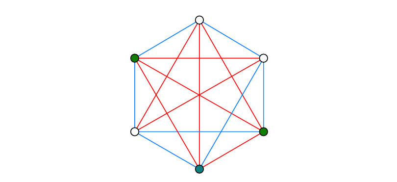
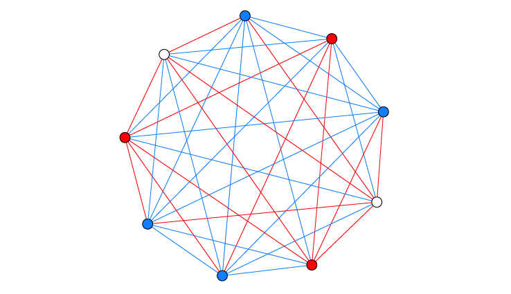

## Ramsey Theory

The study of conditions under which order must inevitably appear in large enough structures, no matter how you arrange things. Ramsey Theory proves that complete disorder is impossible at scale; large enough systems always contain unavoidable patterns — that "complete disorder is impossible", if a structure (such as a graph or set of numbers) is sufficiently large, a specific, ordered sub-structure will inevitably appear — the "order in chaos."

### The Theorem on Friends and Strangers

This is the most famous everyday example. In a finite gathering of $R(n,m)$ people there is a group of $n$ mutual friends, or a group of $m$ mutual strangers (not friends). $R(n,m)$ is the least number with this property (Klop).

**Finite Ramsey's Theorem** for two colors is also more casually known as the Theorem on Friends and Strangers when applied to the social context of parties

**Existence of Order**: It guarantees that for any two desired pattern sizes ($n$ and $m$), there exists a specific population size $R(n, m)$ large enough that a pattern must appear. No matter how you arrange the "friendship" or "stranger" links (the bicoloring), you cannot avoid having a group of $n$ friends or $m$ strangers.

**The "Least Number" Property**: The definition of $R(n, m)$ as the least number means that for any number smaller than $R(n, m)$, it is possible to find at least one arrangement (a coloring) where neither pattern exists.

While the "party" version is a popular way to explain it, the exact theorem is a pillar of combinatorics. In graph theory terms:

- **Complete Graph ( $K_N$ )**: A network where every pair of vertices (people) is connected by an edge.
- **Bicoloring**: Assigning one of two colors (usually red and blue) to every edge in the graph.
- **Monochromatic Clique**: A subset of vertices where every single connecting edge is the same color

**Common Values and Limits** (Klop):

- $R(3,3) = 6$: It states that at any party with at least six people, you are mathematically guaranteed to find either a group of three people who all know each other or three people who are all total strangers.

<figure>
  
  <figcaption>A party of 6 always contains a trio of mutual friends, or a trio of mutual strangers. Red edges indicate pairs of friends, blue lines connect strangers. The three green nodes indicate the (only) trio of mutual friends. Source: Klop 4.</figcaption>
</figure>

- $R(4,3) = R(3,4) = 9$:

<figure>
    
    <figcaption>A party of 9 people will always contain a trio (red), or a quartet of mutual friends of mutual strangers (blue). Source: Klop 5.</figcaption>
</figure>

- $R(4,4) = 18$: For four mutual friends/strangers, you need a group of $18$
- $R(5,5)$: Despite the theorem proving these numbers exist, we still do not know the exact value for $R(5,5)$, which is currently bounded between $43$ and $48$.