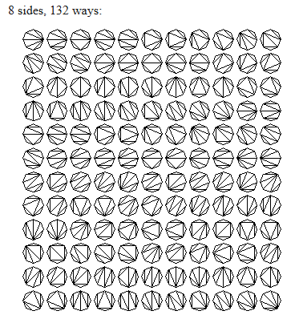

> **Note**: These mathematical concepts are not mentioned within the main text, but serve as a reference for readers who want to explore additional mathematical ideas that are related to the topics discussed.

<!-- TOC -->

- [Ramsey Theory](#ramsey-theory)
- [Hales-Jewett Theorem](#hales-jewett-theorem)
- [The Happy Ending Problem — Ramsey Theory Meets Geometry](#the-happy-ending-problem--ramsey-theory-meets-geometry)
- [Van der Waerden's Theorem — The Root of Arithmetic Ramsey Theory](#van-der-waerdens-theorem--the-root-of-arithmetic-ramsey-theory)
- [Szemerédi's Theorem](#szemer%C3%A9dis-theorem)
- [Green-Tao Theorem — Inevitable Order Inside the Primes](#green-tao-theorem--inevitable-order-inside-the-primes)
- [Roth's Theorem — The First Density Theorem](#roths-theorem--the-first-density-theorem)
- [Behrend's Construction — The Limit of How Far You Can Avoid Order](#behrends-construction--the-limit-of-how-far-you-can-avoid-order)
- [Gauss's Theorema Egregium — Curvature Without Outside](#gausss-theorema-egregium--curvature-without-outside)
- [Roth's Theorem — The First Density Theorem](#roths-theorem--the-first-density-theorem)
- [Behrend's Construction — The Limit of How Far You Can Avoid Order](#behrends-construction--the-limit-of-how-far-you-can-avoid-order)
- [Gauss's Theorema Egregium — Curvature Without Outside](#gausss-theorema-egregium--curvature-without-outside)
- [Roth's Theorem — The First Density Theorem](#roths-theorem--the-first-density-theorem)
- [Behrend's Construction — The Limit of How Far You Can Avoid Order](#behrends-construction--the-limit-of-how-far-you-can-avoid-order)
- [Gauss's Theorema Egregium — Curvature Without Outside](#gausss-theorema-egregium--curvature-without-outside)
- [Lie Algebras — Infinitesimal Symmetry](#lie-algebras--infinitesimal-symmetry)
- [Gomory's Theorem — When Counting Is Enough](#gomorys-theorem--when-counting-is-enough)
- [Different Types of Numbers](#different-types-of-numbers)

<!-- /TOC -->

---

## Ramsey Theory

The study of conditions under which order must inevitably appear in large enough structures, no matter how you arrange things. Ramsey Theory proves that complete disorder is impossible at scale; large enough systems always contain unavoidable patterns — that "complete disorder is impossible", if a structure (such as a graph or set of numbers) is sufficiently large, a specific, ordered sub-structure will inevitably appear — the "order in chaos."

### The Theorem on Friends and Strangers

This is the most famous everyday example of Ramsey Theory. It answers a deceptively simple question: how large must a party be to guarantee that a perfectly uniform social pattern will appear?

> In a finite gathering of $R(n,m)$ people, there is always a group of $n$ mutual friends, or a group of $m$ mutual strangers. $R(n,m)$ is the _least_ number with this property (Klop).

**Finite Ramsey's Theorem for two colors** is more casually known as the Theorem on Friends and Strangers when applied to this social context. The party is just a metaphor — the underlying principle is a fundamental pillar of combinatorics.

#### Core Definition

- **<mark>The Claim</mark>**: In any group of six people, you can always find at least three mutual friends or three mutual strangers. The Theorem on Friends and Strangers is the popular, real-world framing of the Ramsey number R(3,3) = 6. It translates abstract graph theory into everyday human relationships.
- **The Boundary**: This rule fails with five people or fewer. Six is the exact mathematical tipping point where order becomes unavoidable.

#### Why Five People Are Not Enough — Proof that $R(3,3) > 5$

To prove $R(3,3)=6$ we need to prove two inequalities. This section proves the first: $R(3,3) > 5$.

What does $R(3,3) > 5$ actually mean? It means there exists _at least one_ party of 5 people where you can avoid both 3 mutual friends and 3 mutual strangers. If such a party exists, 5 cannot be the Ramsey number.

We have to build it.

##### The Construction: The 5-Cycle

Take 5 vertices and arrange them in a circle. Label them 0,1,2,3,4 around the circle.

Now 2-color the 10 edges of $K_5$ as follows:

- **Red = The Outer Cycle: Friends.** For each vertex $i$, color the edge to $i+1$ mod 5 red. So you color $(0-1), (1-2), (2-3), (3-4), (4-0)$ red. Each person is friends only with their two immediate neighbors. This is a red $C_5$ - a pentagon around the outside.
- **Blue = The Inner Star: Strangers.** For each vertex $i$, color the edge to $i+2$ mod 5 blue. So you color $(0-2), (1-3), (2-4), (3-0), (4-1)$ blue. Each person is a stranger to the two people across from them. This is a blue $C_5$ as well, but drawn as a 5-pointed star inside.

Note: This uses every edge exactly once. $K_5$ has 10 edges, we colored 5 red and 5 blue.

##### Why It Works: No Monochromatic Triangle

Why does this coloring avoid a monochromatic $K_3$?

Check red: For a red triangle you would need three vertices where each pair is consecutive on the circle. That's impossible. If $0$ is friends with $1$, and $1$ is friends with $2$, then $0$ and $2$ are _not_ friends - that edge is blue by construction. Any path of length 2 on the outer pentagon is closed by a blue diagonal. So there is no red $K_3$.

Check blue: The same logic holds. The blue edges also form a 5-cycle $(0-2-4-1-3-0)$. Any two blue edges sharing a vertex are closed by a red edge. So there is no blue $K_3$ either.

Pick any 3 vertices - say {0,1,2}. Edges: 0-1 is red, 1-2 is red, 0-2 is blue. Mix. Pick {0,1,3}. Edges: 0-1 red, 0-3 blue, 1-3 blue. Mix. Exhaust all $\binom{5}{3}=10$ triples and you will always get 2-1 color split.

This explicit coloring is a certificate. It proves that $K_5$ _can_ be 2-colored with no monochromatic triangle. Therefore, 5 does not force the property, and $R(3,3)$ must be at least 6.

> In the language of extremal graph theory, this is the unique - up to isomorphism - $(3,3;5)$-Ramsey graph. It's the only way to avoid the pattern on 5 vertices.

#### Why Six People is The Minimum — Proof that $R(3,3) \le 6$

Now we prove the second inequality: $R(3,3) \le 6$. This is the forcing argument. We must show that no matter how cleverly you try to extend the 5-cycle trick to 6 vertices, you will fail.

##### The Setup

Let $c$ be an arbitrary red/blue coloring of $K_6$. We know nothing about $c$ - it could be anything. Pick an arbitrary vertex and call it $A$. $A$ represents one person at the party.

$A$ is connected to the other 5 vertices. Let's call that set $N(A) = \{B,C,D,E,F\}$. There are 5 edges from $A$ to $N(A)$.

1. Pigeonhole Principle

   Each of those 5 edges is red or blue. You have 5 objects in 2 boxes. By the Pigeonhole Principle, at least $\lceil 5/2 \rceil = 3$ edges must be in the same box.

   Formally: Either $deg_{red}(A) \ge 3$ or $deg_{blue}(A) \ge 3$.

   Without loss of generality, assume $A$ has at least 3 red neighbors. If the majority is blue, just swap the colors in the argument that follows. So let $B, C, D$ be three vertices such that $A-B$, $A-C$, $A-D$ are all red. We say $B,C,D$ are the red-neighborhood of $A$.

2. Look Inside the Neighborhood

   Forget $A$ and the other two vertices $E,F$ for a moment. Focus entirely on the $K_3$ formed by $B,C,D$. It has three edges: $B-C$, $C-D$, $B-D$. Each is red or blue.

   There are only two logical possibilities:

   **Case A: At least one edge among $B,C,D$ is red.**
   Suppose $B-C$ is red. Then consider the triple $\{A,B,C\}$. We have $A-B$ red by choice of $B$, $A-C$ red by choice of $C$, and $B-C$ red by this case. All three edges are red. So $\{A,B,C\}$ is a red $K_3$. We have found 3 mutual friends, and we are done.

   **Case B: No edge among $B,C,D$ is red.**
   If no edge is red, then every edge must be blue. So $B-C$ is blue, $C-D$ is blue, and $B-D$ is blue. Then the triple $\{B,C,D\}$ itself is all blue. It is a blue $K_3$. We have found 3 mutual strangers, and we are done.

In both cases, we found what we wanted.

##### Why This Proves Minimality

Notice we never used any special property of the coloring $c$. We only used that it has 6 vertices and is 2-colored. Therefore _every_ coloring of $K_6$ contains a monochromatic $K_3$.

This means 6 is sufficient to force the property: $R(3,3) \le 6$.

Combined with Section 1, which showed $R(3,3) > 5$, we have squeezed the number from both sides:

$$5 < R(3,3) \le 6 \implies R(3,3)=6$$

This simple argument is the seed of Ramsey Theory. The general upper bound $R(s,t) \le R(s-1,t) + R(s,t-1)$ is proved by exactly the same move: pick a vertex, split the rest into its red-neighbors and blue-neighbors, and apply induction.

#### Extension to Larger Groups

The theorem scales up as groups grow larger, though the math becomes incredibly complex:

##### Group of 18 — $R(4,4) = 18$: Where Computers Take Over

You are guaranteed to find either four mutual friends or four mutual strangers.

> **You need 18 people to guarantee 4 mutual friends OR 4 mutual strangers.**

$R(4,4)$ is the first genuinely hard case. The bounds from the recursion only give:

$$R(4,4) \le R(3,4) + R(4,3) = 9 + 9 = 18$$

**$R(4,3) = R(3,4) = 9$:** In any group of 9 people, you are guaranteed to find either a group of 4 mutual friends or a group of 3 mutual strangers. The symmetry $R(4,3) = R(3,4)$ reflects the fact that the colors are interchangeable — swapping the labels "friend" and "stranger" does not change the math.

<figure>
    
    <figcaption>A party of 9 will always contain either a red trio of mutual friends or a blue quartet of mutual strangers (or vice versa). In this example, the quartet is highlighted. Source: Klop 5.</figcaption>
</figure>

**$R(4,4) = 18$:** To guarantee a group of four mutual friends _or_ four mutual strangers, you need 18 people. This is the first non-trivial case that required significant computational effort. Its exact value was not proven until 1992 by Brendan McKay and Stanisław Radziszowski [often cited via the later verification by Angeltveit and McKay].

So we know 18 is enough. But is 17 enough? To prove $R(4,4) > 17$ you must exhibit a coloring of $K_{17}$ with _no_ monochromatic $K_4$ in either color. There are $2^{136}$ colorings of $K_{17}$. You can't check them all.

It was not settled until 1992 when Brendan McKay and Stanisław Radziszowski used a sophisticated branch-and-bound search with heavy isomorph elimination and gluing of smaller counterexamples to prove that no such coloring of $K_{18}$ avoids a monochromatic $K_4$, but colorings of $K_{17}$ that do avoid it exist. In fact there are 2 such extremal colorings of $K_{17}$ up to isomorphism, and hundreds of millions if you count labelings.

This was a milestone: the first Ramsey number whose proof was essentially computational.

##### Group of 43–49 — $R(5,5)$: The Frontier

This is where our knowledge collapses. The exact number is still unknown. We only know it lies somewhere in this range.

Despite the theorem proving these numbers exist, we still do not know $R(5,5)$. It is currently bounded as:

> $$43 \le R(5,5) \le 48$$

This means we know a counterexample exists for 42 people (an arrangement with no 5 mutual friends or strangers), and we know that at 48 people the pattern is unavoidable. Whether the true tipping point is 43, 44, 45, 46, 47, or 48 remains unknown. As Paul Erdős famously joked, if aliens demanded $R(5,5)$, we should try to compute it, but if they demanded $R(6,6)$, we should try to defeat the aliens instead.

What that means in plain language:

- **Lower bound 43:** Geoff Exoo and others have constructed explicit bicolorings of $K_{42}$ with no red $K_5$ and no blue $K_5$. In 2018 a construction using simulated annealing pushed this from 42 to 43. So 42 is _not_ enough to force the pattern.
- **Upper bound 48:** In 2017, Vigleik Angeltveit and McKay showed computationally that any coloring of $K_{48}$ _must_ contain a monochromatic $K_5$. The previous upper bound was 49. The proof requires checking an enormous search tree pruned by SAT solvers and custom theory.

So the true answer is somewhere in that window of 6 numbers. Each step narrowing it requires an exponential increase in compute.

Why is it so hard? $K_{43}$ has 903 edges. There are $2^{903}$ possible colorings - far more than atoms in the universe. You can't brute force. You need deep combinatorial insights to prune the search.

**The Cosmic Risk (Erdős' Perspective)**

The famous mathematician Paul Erdős famously illustrated this immense difficulty with a thought experiment. This is the source of Paul Erdős's famous quote:

> "Suppose aliens invade the earth and threaten to obliterate it in a year's time unless we can find the value of $R(5,5)$. We could marshal the world's best minds and fastest computers and within a year we could probably calculate the value. If the aliens demanded $R(6,6)$, however, we would have no choice but to launch a preemptive attack."

In simple terms, Erdős was saying that $R(5,5)$ is hard but solvable with enough effort, while $R(6,6)$ is so far beyond our current capabilities that it is effectively impossible to compute.

##### Group of 102 — $R(6,6)$

The exact number is also unknown, but it is known to be at least 102.

#### Why Calculating Larger Friend/Stranger Numbers Is Hard

For scale:

| Number   | Value / Bounds | What it takes to prove |
| -------- | -------------- | ---------------------- |
| $R(3,3)$ | **6**          | Paper and pencil       |
| $R(3,4)$ | **9**          | Casework               |
| $R(3,5)$ | **14**         | Small computer         |
| $R(4,4)$ | **18**         | 1990s workstation      |
| $R(4,5)$ | **25**         | Modern cluster         |
| $R(5,5)$ | **43-48**      | Open since 1930        |
| $R(6,6)$ | **102-160**    | We have almost no idea |

Calculating larger friend and stranger numbers (Ramsey numbers) is difficult because the number of possible configurations grows exponentially, creating a search space too vast for even the world's most powerful supercomputers to check. The growth is roughly exponential. We know $2^{n/2} \le R(n,n) \le 4^n$ up to subexponential factors. That gap - between $\sqrt{2}^n$ and $4^n$ - has barely shrunk since Erdős proved it in 1947. Klop's point with "astonishingly fast" is literal: to guarantee a party of 10 mutual friends or strangers, you'd need somewhere between 40 and 30,000 people, and we can't tell you which.

1. Exponential Combinatorial Explosion

   To find a Ramsey number like $R(5,5)$, mathematicians must check every possible way to color the links (edges) between a set of people (vertices).
   - For $R(5,5)$, we must test a graph of roughly 43 to 49 people.
   - A graph with 45 people has 990 unique links connecting them.
   - Since each link can be either a "friend" or a "stranger" (2 choices), there are $2^{990}$ possible configurations to check.
   - $2^{990}$ is a number with nearly 300 digits—far greater than the total number of atoms in the observable universe (which is only about $10^{80}$).

2. Strict "No Pattern" Requirement

   To prove a Ramsey number, you cannot just find one messy graph.
   - You must prove that every single one of those trillions of configurations contains the target group (e.g., 5 mutual friends or 5 mutual strangers).
   - If even a single configuration out of $2^{990}$ manages to avoid making a group of 5, that size is disqualified.
   - Finding that one exception—or proving it doesn't exist—is like looking for a needle in a cosmic haystack.

3. Limitations of Advanced Mathematics

   Pure mathematics lacks the tools to bypass this brute-force counting for large numbers.
   - **No General Formula**: There is no known algebraic formula to calculate $R(r,s)$ directly.
   - **Weak Theoretical Bounds**: The mathematical formulas we do have only give massive, vague windows (e.g., "the answer is somewhere between 43 and 49").
   - **Clever Tricks Fail**: While mathematicians use symmetry and advanced algebra to eliminate millions of possibilities at once, the remaining pool is still far too massive to compute.

#### Quantum Computing: A New Hope

Quantum computing tackles Ramsey numbers by rethinking the search space entirely, shifting from sequentially checking combinations to evaluating them simultaneously using quantum physics. Because Ramsey calculations belong to complex, hard-to-verify computational complexity classes (like QMA), classical computers stall, making quantum mechanics a promising alternative.

1. The Core Strategy — Superposition

   Instead of checking trillions of graphs one by one, a quantum computer creates a superposition of all possible graph colorings.
   - By initializing qubits using Hadamard gates, the system can hold every single edge configuration in a single, collective quantum state simultaneously.
   - A quantum oracle then mathematically "marks" configurations that contain monochromatic cliques or lack required structures.

2. Adiabatic Evolution & Quantum Annealing

   The most successful practical experiments mapping Ramsey numbers to quantum hardware utilize Adiabatic Quantum Computing (AQC) and quantum annealing.
   - **Energy Mapping**: Mathematicians translate the Ramsey problem into a physics problem by designing a "Hamiltonian" (an energy function).
   - **The Ground State**: The code assigns a cost value to the target sub-graphs. If a graph lacks monochromatic triangles, its energy level is zero. If it contains them, its energy rises.
   - **The Cool Down**: The quantum system naturally evolves toward its lowest possible energy state (the ground state). If the lowest state found has an energy greater than zero, the Ramsey threshold has been mathematically crossed.

3. Real-World Experiments

   While full fault-tolerant quantum computing is still developing, researchers have used early quantum processors to verify small Ramsey numbers:
   - **The Gaitan-Clark Algorithm**: This landmark theoretical framework mapped Ramsey two-color calculations directly to adiabatic quantum optimization.
   - **The D-Wave Experiment**: Using a D-Wave quantum annealer, scientists successfully calculated the exact values for basic Ramsey cases like $R(3,3)$ and simplified one-sided variants up to $R(8,2)$ using dozens of computational qubits.
   - **Recent Breakthroughs**: Research published in journals like [Quantum Information Processing](https://link.springer.com/article/10.1007/s11128-025-04839-x) maps Ramsey questions to Quadratic Unconstrained Binary Optimization (QUBO) formats, allowing modern processors like the D-Wave Advantage to actively search for lower bounds of unknown numbers.

4. Alternative Quantum Mathematics

   Beyond brute-force counting, scientists are exploring radically abstract frameworks to bypass massive qubit requirements entirely. For instance, researcher Fabrizio Tamburini introduced a method using Majorana algebra and spectral signatures. Instead of dedicating individual qubits to every graph edge, this method measures the physical trace decay of a probe qubit to sense whether a specific order inevitably exists.

### Existence of Order

For any two desired pattern sizes, $n$ and $m$, there exists a specific population size $R(n,m)$ large enough that order is unavoidable. No matter how you arrange the "friendship" and "stranger" links — no matter how chaotic the social network appears — you cannot avoid creating a group of $n$ mutual friends or a group of $m$ mutual strangers. Complete disorder is impossible at scale.

Ramsey theory proves that complete disorder is impossible. In any large and complex system, a certain amount of hidden order must always exist. Named after Frank P. Ramsey, this branch of mathematics shows that if a structure grows large enough, regular patterns or monochromatic substructures will inevitably appear.

#### Core Concepts of Order

- **The Party Problem**: A classic illustration proving that in any group of six people, either three people know each other or three people are total strangers.
- **Monochromatic Substructures**: When edges or elements of a large system are randomly assigned colors (like red or blue), sub-sections of a guaranteed size will share a single color entirely.
- **Ramsey Numbers ($R(r, s)$)**: The precise threshold numbers that define how large a total system must be to guarantee that a specific amount of structured order ($r$ or $s$) emerges.

#### Key Principles

- **Size Forces Pattern**: Chaos can exist locally, but scale forces regularity.
- **Universal Application**: The philosophy extends past basic graph theory into geometry, number theory, and logic.
- **Exact Bounds are Hard**: While existence is guaranteed, calculating exact Ramsey numbers for larger sets remains one of mathematics' hardest unsolved challenges.

#### Mathematical Implications

The Ramsey number $R(3,3) = 6$. This is the classic case. At any party with at least six people, you are mathematically guaranteed to find either three mutual friends or three mutual strangers. With five people, you can avoid it — for example, arrange five people in a cycle where each person is friends with their two neighbors (red) and strangers with the two people across from them (blue).

In simple terms, this means a group of six people always contains three mutual acquaintances or three mutual strangers.

> In any 6 people, there is a monochromatic triangle.
>
> **Proof sketch:**
>
> Pick one person, $A$. Among the other 5 people, $A$ must have at least 3 friends or at least 3 strangers (Pigeonhole Principle).
>
> Suppose $A$ has 3 friends: $B, C, D$. If any pair among $B, C, D$ are friends, they plus $A$ form a red triangle. If none of them are friends, then $B, C, D$ themselves form a blue triangle.
>
> The same logic holds if $A$ has 3 strangers.

<figure>
  
  <figcaption>A party of 6 always contains a trio of mutual friends, or a trio of mutual strangers. Red edges indicate pairs of friends, blue lines connect strangers. The three green nodes indicate the (only) trio of mutual friends in this particular coloring. Source: Klop 4.</figcaption>
</figure>

1. Model with Graphs
   - Represent people as six vertices.
   - Connect every pair with an edge.
   - Color edges red for acquaintances.
   - Color edges blue for strangers.
   - We look for a monochromatic triangle.
2. Isolate One Vertex
   - Select any single vertex, $V_1$.
   - Five edges connect to $V_1$.
   - By Pigeonhole Principle, three must match.
   - At least three edges are red.
   - Or at least three are blue.
   - Assume three edges are red.
3. Analyze Connected Vertices
   - Let $V_2$, $V_3$, and $V_4$ connect to $V_1$ via red edges.
   - Examine the edges between these three.
   - If edge $(V_2, V_3)$ is red, triangle $(V_1, V_2, V_3)$ is all red.
   - If edge $(V_3, V_4)$ is red, triangle $(V_1, V_3, V_4)$ is all red.
   - If edge $(V_2, V_4)$ is red, triangle $(V_1, V_2, V_4)$ is all red.
4. Handle Remaining Cases
   - What if no connecting edges are red?
   - Then $(V_2, V_3)$, $(V_3, V_4)$, and $(V_2, V_4)$ must all be blue.
   - This forms a solid blue triangle.
   - Triangle $(V_2, V_3, V_4)$ is monochromatic blue.
   - A uniform triangle always appears.
5. Connect to Number Theory
   - Ramsey theory also applies to numbers.
   - Van der Waerden's theorem is one example.
   - It guarantees monochromatic arithmetic progressions.
   - Coloring integers eventually forces patterns.
   - Schur's theorem applies to equations.
   - It proves $x + y = z$ always shares a color.

**Final Proof Result**

The Ramsey number $R(3,3)$ is exactly $6$, proving that a monochromatic triangle inevitably exists in any edge-colored complete graph on six vertices.

This is the classic. And $N=6$ is sharp.

### The "Least Number" Property

The "Least Number" Property (also known as the _Well-Ordering Principle of Integers_) is a foundational axiom of mathematics. It states that every non-empty set of positive integers must contain a smallest (least) element. While it sounds deceptively simple, this property is the mathematical bedrock that makes Ramsey theory possible.

1. **How It Drives Ramsey Theory**

   Ramsey theory relies entirely on finding specific threshold numbers (like R(3,3) = 6). The Least Number Property guarantees that these exact thresholds actually exist.
   - _The Setup_: Imagine a set S that contains all possible graph sizes where complete disorder is mathematically impossible.
   - _The Guarantee_: Because S is a set of positive integers ($6, 7, 8, \dots$), the Least Number Property guarantees there must be an absolute smallest number in that set.
   - _The Result_: That exact "least number" is defined as the Ramsey number. Without this property, thresholds could theoretically recede infinitely, and exact boundary numbers wouldn't exist.

2. **The Core Mechanism — Infinite Descent**

   The Least Number Property is used to prove Ramsey theorems through a method called Proof by Infinite Descent (a variation of mathematical induction).

   ```
   [ Assume an infinite counterexample exists ]
                   │
                   ▼
   [ Extract the SMALLEST counterexample (via Least Number Property) ]
                   │
                   ▼
   [ Apply Ramsey step to find an even smaller counterexample ]
                   │
                   ▼
   CRASH! (An integer cannot be smaller than the smallest integer)
   ```

   1. _The Trap_: To prove a pattern must exist, mathematicians assume the opposite: that an infinite, perfectly chaotic structure can exist with no patterns.
   2. _The Extraction_: By the Least Number Property, if such chaotic structures exist, there must be a smallest chaotic structure.
   3. _The Contradiction_: Using Ramsey logic, mathematicians prove that if you have that smallest chaotic structure, you can always strip away a layer to find an even smaller chaotic structure.
   4. _The Collapse_: You cannot have an integer smaller than the "least" integer. The assumption crashes, proving that chaos must eventually end and order must emerge.

3. **The Unprovable Boundaries (Paris-Harrington)**

   The connection between the Least Number Property and Ramsey theory actually led to a massive breakthrough in mathematical logic.
   In 1977, logicians Jeff Paris and Leo Harrington used a variant called the Strengthened Finite Ramsey Theorem. They proved that while this Ramsey theorem is completely true, it is impossible to prove using standard Peano Arithmetic (the basic rules of math).
   To prove it, you have to assume a stronger version of the Least Number Property that extends into infinite ordinal numbers (ε₀). It became the very first clean, non-artificial example of Gödel’s Incompleteness Theorem in action—proving that some true statements about numbers simply cannot be reached using standard arithmetic rules.

#### Infinite Ramsey Theory

While finite Ramsey theory says "if a system is big enough, a pattern must exist," Infinite Ramsey Theory takes this to the ultimate extreme: if a system is infinitely large, an infinitely large structured pattern must exist.
First proven by Frank Ramsey himself in 1930, this foundational theorem underpins modern set theory, mathematical logic, and the study of large cardinals.

1. **The Core Infinite Theorem ($R(\aleph_0, \aleph_0)$)**

   The most famous version of the infinite theorem deals with the smallest infinity, $\aleph_0$ (aleph-null), which represents the size of the natural numbers ($1, 2, 3, \dots$).
   - _The Setup_: Imagine an infinitely large graph where every single natural number is a vertex, and every pair of vertices is connected by an edge. You color every single edge either red or blue.
   - _The Guarantee_: Infinite Ramsey Theory guarantees that there exists an infinitely large subset of numbers where every single edge connecting them is the exact same color.
   - _The Contrast_: In finite Ramsey theory, a bigger target size requires a bigger graph (e.g., R(3,3)=6, but R(4,4)=18). In the infinite realm, the graph doesn't need to get any bigger. A single infinite graph guarantees an infinite monochromatic payoff.

2. **Stepping Beyond Pairs (Hypergraphs)**

   The infinite theorem doesn't just work for lines (pairs of numbers); it works for combinations of any size. This is written using the "arrow notation":
   $$\aleph_0 \to (\aleph_0)^n_k$$
   This mathematical shorthand translates to a powerful guarantee:
   - Take all possible subsets of size n from an infinite set.
   - Color those subsets using k different colors.
   - You are guaranteed to find an infinite subset where every single subset of size n shares the exact same color.

3. **Why It is Actually "Easier" Than Finite Math**

   Paradoxically, Infinite Ramsey Theory is often easier to prove than finite Ramsey theory.
   - _No Bound Tracking_: In finite math, you must calculate exactly where the pattern emerges (which leads to the massive computation problems we discussed earlier).
   - _Infinite Room to Move_: In the infinite world, you can use the Pigeonhole Principle infinitely many times. You can repeatedly throw away infinite amounts of "bad" data, and because you started with infinity, you are still left with an infinite pool of "good" data to construct your perfect pattern.

4. **Large Cardinals and the Boundaries of Math**

   When mathematicians tried to scale this up to infinities larger than $\aleph_0$ (like the uncountable infinity of real numbers, $\aleph_1$), standard mathematics broke down.
   - _The Failure_: The Hungarian mathematician Paul Erdős proved that $\aleph_1 \not\to (\aleph_1)^2_2$. This means you can color an uncountable infinite graph in a way that completely destroys any uncountably infinite patterns.
   - _Ramsey Cardinals_: To fix this, set theorists had to invent a completely new type of infinity called a "Ramsey Cardinal." A Ramsey Cardinal is a super-infinity so massive that it forces the infinite Ramsey theorem to work on it.
   - _The Catch_: You cannot prove Ramsey Cardinals exist using standard set theory (ZFC). They are used as foundational axioms to test the outer limits of what mathematics can logically define.

#### Infinite Pigeonhole Principle

This proof constructs an infinite, single-colored subgraph from an infinite graph whose edges are colored red or blue. It uses the Infinite Pigeonhole Principle, which states that if you sort infinitely many objects into a finite number of boxes, at least one box must hold infinitely many objects.

**The Goal**

Given an infinite graph with vertices $V = \{v_1, v_2, v_3, \dots\}$, where every edge is colored red or blue, we will construct an infinite subset of vertices $H = \{h_1, h_2, h_3, \dots\}$ such that all edges between vertices in H are the exact same color.

1. **Isolate the First Vertex ($h_1$)**
   - _Select the very first vertex, $v_1$. We define this as our first milestone vertex_: $h_1$ = $v_1$.
   - Infinitely many edges connect $h_1$ to the rest of the vertices in the graph ($\{v_2, v_3, v_4, \dots\}$).
   - Because there are only two colors (red and blue), $h_1$ must send out infinitely many edges of at least one color.
   - Let's say $h_1$ sends out infinitely many red edges.
   - We discard all vertices connected to $h_1$ by blue edges. We are left with an infinite pool of vertices, which we will call $v_1'$. Every vertex in $v_1'$ connects to $h_1$ via a red edge.

2. **Extract the Second Vertex ($h_2$)**
   - Pick the first vertex inside our new pool $v_1'$. Label it $h_2$.
   - Look only at the edges connecting $h_2$ to the remaining vertices inside $v_1'$.
   - Once again, $h_2$ must send out infinitely many edges of the same color to the rest of $v_1'$.
   - _Case A_: If $h_2$ sends out infinitely many red edges, keep those vertices and discard the blue ones. This leaves a smaller, but still infinite, pool called $v_2$.
   - _Case B_: If $h_2$ sends out infinitely many blue edges, keep those vertices and discard the red ones. This leaves an infinite pool called $v_2$.

3. **Repeat Infinitely**

Repeat this exact extraction process forever. At each step i:

1.  Define $h_i$ as the first vertex of the current pool $V_{i-1}$.
2.  Look at how $h_i$ links to the rest of $V_{i-1}$.
3.  Filter the pool down to an infinite subset $V_i$ where all edges from $h_i$ share a single, dominant color.

This creates an infinite sequence of milestone vertices: $H = \{h_1, h_2, h_3, h_4, \dots\}$.

4. **The Final Color Selection**

Every vertex $h_i$ in our new set H has a "dominant color" that it uses to talk to all future vertices ($h_{i+1}, h_{i+2}, \dots$).
We now have an infinite list of vertices, each tagged with its dominant color (either red or blue). By applying the Infinite Pigeonhole Principle one last time, infinitely many vertices in H must share the exact same dominant color.

- If infinitely many vertices prefer red, we discard the blue-preferring vertices.
- What remains is a final, infinitely large set of vertices where every single edge between them is red.
- A perfectly uniform, infinite structure has been extracted from the chaos. $\blacksquare$

### From Parties to Graphs: The Formal Translation

This is where Ramsey Theory stops being a party trick and starts being a theorem.

The party language - "friends and strangers" - is great for intuition, but it's vague. Graph theory gives us a way to make it exact, exhaustive, and provable.

#### The Party Becomes a Complete Graph $K_N$

Take your $N$ people and turn each person into a **vertex** - just a dot.

Now draw an edge (a line) between _every_ pair of dots. You don't get to skip any pair. For every two people, either they know each other or they don't, there is no third option. The graph that connects every possible pair is called the **complete graph**, written $K_N$.

How many edges is that? $\dfrac{N(N-1)}{2}$. So:

- $K_3$ has 3 edges - a triangle
- $K_4$ has 6 edges
- $K_6$ has 15 edges - that's a party of 6 where all 15 possible relationships are drawn

$K_N$ isn't a _specific_ party. It's the _stage_ that holds ALL possible parties of size $N$.

#### Relationships Become a Bicoloring

Now we encode a specific party configuration.

Take all the edges of $K_N$ and color each one:

- **Red edge** = the two people know each other / are friends
- **Blue edge** = the two people are strangers

A **bicoloring** of $K_N$ is just one fully colored-in complete graph. It's one possible reality for who knows whom.

There are $2^{\text{number of edges}}$ different bicolorings. For $K_6$, that's $2^{15} = 32,768$ different possible friendship configurations. Ramsey theory makes a claim about _all_ of them.

#### The Clique Becomes a Monochromatic $K_n$

In party language: "3 mutual friends." In graph language:

> A **monochromatic clique** $K_n$ is a set of $n$ vertices where every single edge _between them_ is the same color.

It's not enough that 3 people are connected in a chain of friendships. For a red $K_3$, you need all 3 edges among those 3 vertices to be red. It's a solid red triangle.

- A **red $K_3$**: 3 vertices, 3 red edges connecting them. A trio of mutual friends.
- A **blue $K_4$**: 4 vertices, 6 blue edges connecting them. A group of 4 mutual strangers. Everyone in the group is a stranger to everyone else in the group.

Finding a clique is finding total order hidden inside the coloring.

#### The Ramsey Number, Formally

Now we can state it with no ambiguity:

> $R(n,m)$ is the smallest integer $N$ such that _every_ possible red-blue bicoloring of the edges of $K_N$ is guaranteed to contain either a red $K_n$ or a blue $K_m$.

Note the two quantifiers that matter:

1.  **Smallest $N$**: It's a threshold. Below this $N$, you can _avoid_ both cliques. At and above this $N$, you can't.
2.  **Any bicoloring**: The guarantee has to hold even for the most cleverly arranged, most clique-avoiding coloring you can try to draw.

So when we say the classic theorem $R(3,3) = 6$, in graph terms we are saying:

> If you take $K_6$ and color its 15 edges red or blue however you want, you will _always_ be forced to create a solid red triangle or a solid blue triangle somewhere. And $K_5$ is not enough - there exists at least one bicoloring of $K_5$ with no monochromatic triangle at all.

The formal translation is powerful because it removes "people" entirely. Once it's just vertices, edges, and colors, you can ask the same question for 3 colors, for hypergraphs, for infinite graphs - and that's where Ramsey Theory really begins.
This is the theorem where Ramsey Theory stops being about parties and starts being about everything. Van der Waerden is about arithmetic progressions, Ramsey is about graphs, Schur is about sums - Hales-Jewett proves them all at once by throwing away numbers, geometry, and distance entirely.

It is pure structure.

### The Core Idea: Tic-Tac-Toe Becomes Unavoidable

Forget friends. Play Tic-Tac-Toe.

You have $n$ positions along each axis - for normal Tic-Tac-Toe, $n=3$ - and $c$ players - normally $c=2$, $X$ and $O$. You play on an $n \times n \times \dots \times n$ board with $H$ dimensions.

Hales-Jewett says:

> **For any board width $n$ and any number of colors $c$, there exists a dimension $H = HJ(n,c)$ such that an $n \times n \times \dots \times n$ ($H$-dimensional) Tic-Tac-Toe game cannot end in a draw.**
The most intuitive way to understand it is through a high-dimensional game of Tic-Tac-Toe.
In other words, if you color each of the $n^H$ cells with $c$ colors, you are _forced_ to create a monochromatic winning line, no matter how cleverly you color.

Why is dimension the key? Because dimension creates lines faster than it creates space to block them.
> **The Hales-Jewett Theorem guarantees that for any board size $n$ and any number of players $c$, there exists a dimension $H = HJ(n,c)$ such that an $n \times n \times \dots \times n$ ($H$-dimensional) Tic-Tac-Toe game cannot end in a draw.**
In 2D $3 \times 3$, a draw is easy. There are 8 lines and 9 cells - you can block. The Hales-Jewett number hasn't been reached. There is enough "room" to place $X$'s and $O$'s to block every possible line.

But if you move that same game into a high enough dimension — a hypercube — the board becomes so dense with potential lines that blocking them all becomes impossible.
In other words, it ensures that a "monochromatic combinatorial line" — a complete winning line — is inevitable regardless of how the cells are colored, as long as the dimension is high enough.
In 3D $3 \times 3 \times 3$, there are 49 lines and 27 cells. Hales and Jewett's predecessor proved this game cannot end in a draw. The board is so interwoven that any 2-coloring of the 27 cells yields a monochromatic line.
- **The theorem is non-constructive**: it proves a winner _must_ exist, but it doesn't tell you _how_ to win or where the line will be.
And the number of lines explodes. The number of combinatorial lines in an $n^d$ cube is:

For a $3 \times 3$ board with 2 players, the threshold is low: it was proven that 3D $3 \times 3 \times 3$ Tic-Tac-Toe cannot end in a draw. For larger boards, the required dimension grows unimaginably fast.

- $n=3, d=3$: 49 lines
- $n=3, d=4$: 130 lines
- $n=3, d=6$: 364 lines
- $n=3, d=10$: 2,951 lines

Hales-Jewett says that for any $c$, if you make $d$ large enough, $c$-coloring the $n^d$ points cannot avoid coloring one entire line with one color.

Two critical points:

1. Order is forced by size alone. There is no geometry in the hypothesis. Only that the board is big enough in the right way.

2. It is non-constructive. The theorem proves a monochromatic line _must_ exist, but gives you no clue where it is, how to find it, or how to force it as a player. It is an existence proof, not a strategy.
The number of combinatorial lines itself explodes. The total number of lines (rows, columns, diagonals, and high-dimensional diagonals) in an $n^d$ hypercube is given by:
$$\dfrac{(n+2)^d - n^d}{2}$$
For $n=3, d=3$, that's 49 lines. For $n=3, d=6$, it's already 364 lines. Hales-Jewett says that if you color each of the $n^d$ cells with $c$ colors, when $d$ is large enough, one of those lines must be monochromatic.

### The Formal Language: Words and Variable Words

To remove the geometry, mathematicians rephrase the game as a game of words.

Let $A$ be an alphabet of size $n$. For Tic-Tac-Toe, $A = \{1,2,3\}$ representing the 3 positions along an axis.

- A **word** of length $H$ over $A$ is a point on the board. For example, in a 3-dimensional board, $121$ is a point.

- A **variable word** is a word that includes a special variable $x$ that appears at least once, e.g., $x2x$.

- A **combinatorial line** is the set of all words you get by replacing $x$ with every letter in $A$. For $x2x$ over $\{1,2,3\}$, the line is $\{121, 222, 323\}$. This corresponds exactly to a row, column, or diagonal.

**Formal Theorem:** For any finite alphabet $A$ with $|A| = n$ and any number of colors $c$, there exists a dimension $H = HJ(n,c)$ such that for any $c$-coloring of all words $A^H$ (all $n^H$ points), there exists a variable word whose combinatorial line is monochromatic.

Coloring the words = playing the game with $c$ players. Monochromatic combinatorial line = a player completing a winning line.

This abstraction is why it is so powerful. It doesn't care about numbers or space — only about the combinatorial structure of replacing variables.

### Consequence: Who Wins?

Hales-Jewett combined with a classic argument tells us who _should_ win.

**The Strategy-Stealing Argument:**

In any dimension $d \ge HJ(n,2)$ where a draw is impossible, Tic-Tac-Toe is a perfect information, symmetric game with no disadvantage to having an extra move. Therefore:

1.  The game must have a winner.

2.  It cannot be the second player. If the second player ($O$) had a winning strategy, the first player ($X$) could "steal" it by making an arbitrary first move, then pretending to be the second player and following $O$'s winning strategy. If the strategy ever calls for playing where $X$ already played, $X$ can play anywhere else — an extra $X$ on the board never hurts.

3.  Therefore, in every dimension where Hales-Jewett guarantees a line must appear, the first player has a forced win.

This is a pure existence proof. It proves $X$ _can_ always force a win in high-dimensional Tic-Tac-Toe, without ever showing what that winning first move should be.

## Happy Ending Problem

The Happy Ending Problem is a foundational theorem in Ramsey Theory that bridges geometry and combinatorics. It is the geometric analogue of the Theorem on Friends and Strangers: just as a large enough party must contain a uniform social clique, a large enough scattering of points must contain a perfectly uniform geometric clique.

> Erdős–Szekeres Theorem (1935): For any integer $n \ge 3$, there exists a minimum number $N(n)$ such that any set of at least $N(n)$ points in the plane in general position — where no three points are collinear — must contain a subset of $n$ points that form the vertices of a convex $n$-gon.

In other words, complete geometric disorder is impossible. No matter how haphazardly you place points, if you place enough of them, you are forced to create a convex polygon.

### Why is it called the "Happy Ending" Problem?

The name has nothing to do with mathematics and everything to do with its history. In 1933, Esther Klein, a young mathematician in Budapest, made an observation: any 5 points in general position always contain 4 that form a convex quadrilateral. She shared it with her friends Paul Erdős and George Szekeres, who then worked to generalize it.

The collaboration proved fruitful in more than one way — Klein and Szekeres married in 1937, and Erdős famously dubbed it the "Happy Ending Problem" because it led to their marriage. Esther and George Szekeres later emigrated to Australia and were married for 68 years.

### Known Values and the Erdős–Szekeres Conjecture

Mathematicians have calculated the exact values of $N(n)$ for small $n$, but the general formula remains one of Ramsey Theory's great unsolved problems.

| Polygon       | $n$ | $N(n)$ = Min. Points Required | Status                                                            |
| :------------ | :-: | :---------------------------: | :---------------------------------------------------------------- |
| Triangle      |  3  |               3               | Trivial                                                           |
| Quadrilateral |  4  |               5               | Proved by Esther Klein (1933)                                     |
| Pentagon      |  5  |               9               | Proved by Endre Makai (1935), later by Kalbfleisch et al.         |
| Hexagon       |  6  |              17               | Proved by Szekeres & Peters in 2006 using massive computer search |
| Heptagon      |  7  |            Unknown            | Conjectured to be 33                                              |
| Octagon       |  8  |            Unknown            | Conjectured to be 65                                              |

The conjectured formula, known as the **Erdős–Szekeres Conjecture**, is elegantly simple:

$$N(n) = 2^{n-2} + 1$$

This formula holds for all known cases: $2^{3-2}+1 = 3$, $2^{4-2}+1 = 5$, $2^{5-2}+1 = 9$, $2^{6-2}+1 = 17$. It predicts $N(7) = 33$ and $N(8) = 65$.

Erdős and Szekeres proved the upper bound $N(n) \le \binom{2n-4}{n-2} + 1$ in 1935. In 2016, Andrew Suk made a major breakthrough, proving $N(n) \le 2^{n + O(\sqrt{n \log n})}$, showing the conjectured exponential growth is essentially correct. The lower bound $N(n) \ge 2^{n-2}+1$ was shown by Erdős and Szekeres themselves by constructing point sets with $2^{n-2}$ points containing no convex $n$-gon.

### How the Proof Works for

The case $N(4)=5$ is the only one you can visualize completely. It uses the concept of a **convex hull** — imagine stretching a rubber band around all the points and letting it snap tight. The points the rubber band touches form the hull.

Take any 5 points in general position. There are three possibilities for the hull:

**Case 1: The hull has 5 points.** Then those 5 points themselves form a convex pentagon, which certainly contains a convex quadrilateral — pick any 4.

**Case 2: The hull has 4 points.** Then those 4 hull points form a convex quadrilateral, and we are done.

**Case 3: The hull has 3 points.** This is the interesting case. The hull is a triangle, with 2 points inside it. Draw a straight line through those 2 interior points. This line extends to infinity and divides the plane into two half-planes. Since the triangle has 3 vertices, by the Pigeonhole Principle at least 2 of those vertices must lie on the same side of the line.

Those 2 outer vertices plus the 2 interior points always form a convex quadrilateral. The interior line cannot cut through it, and no point is inside the triangle formed by the other three.

This simple case analysis illustrates the core Ramsey-type argument: by classifying disorder into a small number of types (hull size), you can show that each type inevitably contains order.

The theorem is a perfect geometric mirror of Ramsey's principle: you cannot place points randomly enough for long. Order — in this case, convexity — is forced to emerge.

## Van der Waerden's Theorem

Van der Waerden's Theorem is the archetypal statement that "complete disorder is impossible." Where Ramsey's Theorem finds cliques in graphs and the Happy Ending Problem finds convex polygons in point sets, van der Waerden finds regular patterns in colorings of numbers.

> **Van der Waerden's Theorem (1927): For any finite number of colors $r$ and any desired length $k$, there exists a minimum number $W(r,k)$ such that if you color the integers $\{1, 2, \dots, N\}$ with $r$ colors for any $N \ge W(r,k)$, you are guaranteed to find a monochromatic arithmetic progression of length $k$.**

No matter how cleverly you try to mix the colors to avoid a pattern, if your list is long enough, a monochromatic equally-spaced pattern is forced to appear.

### Key Concepts

- **Coloring:** Imagine assigning each integer in a list $1, 2, 3, \dots, N$ a color. With $r=2$ colors, this could be Red and Blue. A coloring is just a function $c: \{1,\dots,N\} \to \{1,\dots,r\}$.

- **Arithmetic Progression (AP):** A sequence where the difference between consecutive terms is constant. We write a $k$-term AP as $a, a+d, a+2d, \dots, a+(k-1)d$ where $a$ is the start and $d>0$ is the common difference. Examples: $3, 6, 9$ ($a=3, d=3$) or $4, 11, 18, 25$ ($a=4, d=7$).

- **Monochromatic:** All $k$ terms in the progression share the same color.

- **Van der Waerden Number $W(r,k)$:** The least $N$ that forces the pattern. It is the Ramsey number for arithmetic progressions. By definition, there exists at least one coloring of $\{1,\dots,W(r,k)-1\}$ with $r$ colors containing _no_ monochromatic $k$-term AP, but no such coloring exists for $W(r,k)$.

### A Concrete Example:

The smallest non-trivial van der Waerden number is $W(2,3)=9$. It says: with 2 colors, you need 9 consecutive integers to force a monochromatic 3-term progression.

Why is $W(2,3) > 8$? Because we can color 1 through 8 to avoid it. One such maximal coloring is:

$$1:R,\; 2:R,\; 3:B,\; 4:B,\; 5:R,\; 6:R,\; 7:B,\; 8:B$$
$$R\,R\,B\,B\,R\,R\,B\,B$$

Check: The red positions are $\{1,2,5,6\}$. No three are equally spaced. $1,2,3$ is not monochromatic, $1,3,5$ is not, $2,4,6$ mixes colors, etc. The same holds for blue $\{3,4,7,8\}$. No monochromatic $k=3$ AP exists.

Why is $W(2,3) = 9$? Extend to 9 numbers. No matter what color you give 9, you create a progression:

- If you color 9 **Red**: Look at 3, 6, 9. If 3 and 6 were already Red, you would have already had a progression. The $R R B B R R B B$ coloring avoids this by making 3 and 4 Blue. But then consider $1,5,9$: if 9 is Red, and 1 and 5 are Red, you get $1,5,9$ all Red ($d=4$).

- If you color 9 **Blue**: Then $3,6,9$ is not yet a problem (3 is Blue, 6 is Red), but $1,5,9$ becomes $1:R, 5:R, 9:B$ — not monochromatic. The actual forcing is more subtle: a complete case analysis shows _every_ extension of any valid 8-coloring creates a monochromatic 3-AP, such as $1,5,9$ or $3,5,7$ or $7,8,9$.

The point is: at $N=9$, you run out of room to avoid.

### How Fast Do They Grow?

While van der Waerden's Theorem proves $W(r,k)$ exists for all $r,k$, the numbers explode faster than almost anything in combinatorics.

| $W(r,k)$  | Value   | Status                                        |
| :-------- | :------ | :-------------------------------------------- |
| $W(2,3)$  | 9       | Trivial by hand                               |
| $W(2,4)$  | 35      | Proved by Chvátal (1970)                      |
| $W(2,5)$  | 178     | Proved by Chvátal (1970)                      |
| $W(2,6)$  | 1,132   | Proved by Kouril & Paul (2008)                |
| $W(2,7)$  | 3,703   | Calculated 2008                               |
| $W(3,3)$  | 27      | Classic                                       |
| $W(3,4)$  | 293     | Calculated                                    |
| $W(2,10)$ | Unknown | Lower bound > 10,000, upper bound is enormous |

For $W(2,6) = 1,132$, it means you can color the numbers $1$ to $1,131$ red/blue with no 6-term monochromatic AP, but any coloring of $1$ to $1,132$ must contain one. For $W(2,10)$, we only know it exists — its exact value is far beyond current computation.

### Why It Matters: The Root of Structure

Van der Waerden's Theorem was proved in 1927 by Bartel Leendert van der Waerden, building on work by Schur and Baudet. Its original proof was notoriously complex. It is now understood as a corollary of the Hales-Jewett Theorem.

If you encode numbers in base-$k$, an arithmetic progression corresponds to a combinatorial line in high dimensions. Hales-Jewett's guarantee of a monochromatic combinatorial line therefore directly implies van der Waerden's guarantee of a monochromatic arithmetic progression.

The theorem launched an entire field — arithmetic Ramsey theory — culminating in Szemerédi's Theorem (1975), which proved that any set of integers with positive density contains arbitrarily long APs, and the Green-Tao Theorem (2004), which proved the primes contain arbitrarily long arithmetic progressions.

## Gauss's Theorema Egregium

Gauss's _Theorema Egregium_ — Latin for "Remarkable Theorem" — is the foundational theorem of differential geometry. Published by Carl Friedrich Gauss in 1827 in _Disquisitiones generales circa superficies curvas_, it states that the Gaussian curvature of a surface can be determined entirely by internal measurements of angles and distances on the surface itself. It is an intrinsic invariant — it does not change when the surface is bent without stretching.

In modern language: If you are a 2-dimensional being living _inside_ the surface, with no concept of the 3-dimensional space outside, you can still measure $K$. You do not need to see how the surface is embedded in $\mathbb{R}^3$.

This is remarkable because the definition of Gaussian curvature _appears_ to depend on the outside space.

### What is Gaussian Curvature?

For a surface in $\mathbb{R}^3$, at each point there are two principal curvatures $\kappa_1, \kappa_2$ — the maximum and minimum bending in orthogonal directions. For example, on a cylinder of radius $R$, $\kappa_1 = 1/R$ around the tube, $\kappa_2 = 0$ along the length.

$$K = \kappa_1 \cdot \kappa_2$$

- **Plane / Cylinder**: $K = 0 \cdot 0 = 0$ and $K = (1/R)\cdot0 =0$ — flat in at least one direction.
- **Sphere of radius $R$**: $\kappa_1=\kappa_2=1/R$, so $K=1/R^2 >0$ — positively curved.
- **Saddle / Pseudosphere**: $\kappa_1 = -\kappa_2$, so $K <0$ — negatively curved.

The definition using $\kappa_1, \kappa_2$ uses the second fundamental form — how the normal vector changes in 3D. Gauss proved this product can be computed without the normal.

### The Core Idea: Intrinsic vs. Extrinsic

The Theorema Egregium is a statement about two fundamentally different ways to think about shape. Imagine you are an ant living _on_ a surface. What can you measure, and what requires a bird's-eye view from outside?

#### Extrinsic Geometry — The View From Outside

Extrinsic properties depend on how the surface sits in $\mathbb{R}^3$. They require information about the ambient space — specifically, the unit normal vector $\mathbf{N}$ that sticks out of the surface.

- **The second fundamental form** $II = L\,du^2 + 2M\,du\,dv + N\,dv^2$ measures how the normal tips as you move. $L = \langle r_{uu}, \mathbf{N}\rangle$, $M = \langle r_{uv}, \mathbf{N}\rangle$, $N = \langle r_{vv}, \mathbf{N}\rangle$.
- **Principal curvatures** $\kappa_1, \kappa_2$ — the maximum and minimum rates at which the surface bends away from its tangent plane in 3D. You find them by slicing the surface with planes containing $\mathbf{N}$.
- **Mean curvature** $H = (\kappa_1+\kappa_2)/2$ — extrinsic. It tells you if the surface is locally like a soap film. Minimal surfaces have $H=0$ but can have $K\neq0$.
- **Example:** A cylinder of radius $R$ looks curved from outside. $\kappa_1 = 1/R$ around the circumference, $\kappa_2 = 0$ along its axis. An outside observer says "it's curved."

If you bend a surface in space without stretching, extrinsic properties change. Roll paper into a cylinder: $\kappa_1$ goes from $0$ to $1/R$.

#### Intrinsic Geometry — The View From Inside

Intrinsic properties can be measured by a resident of the surface using only a ruler, protractor, and the ability to walk along the surface. No concept of "outside" or "normal" is needed. They depend only on the First Fundamental Form:

$$I = ds^2 = E\,du^2 + 2F\,du\,dv + G\,dv^2$$

where $E=\langle r_u,r_u\rangle$, $F=\langle r_u,r_v\rangle$, $G=\langle r_v,r_v\rangle$. $I$ tells you:

- **length of any curve on the surface**: $\int \sqrt{E(u')^2+2F u'v'+G(v')^2}\,dt$
- **angle between two curves**: $\cos\theta = \dfrac{F}{\sqrt{EG}}$ in orthogonal coordinates
- **area**: $\iint \sqrt{EG-F^2}\,du\,dv$
- **geodesics**: the "straight lines" of the surface — locally shortest paths — defined via Christoffel symbols $\Gamma^k_{ij}$ which are built from $E,F,G$ alone
- parallel transport, covariant derivative, and holonomy — all intrinsic

An ant on a cylinder measures the same distances, angles, and geodesics as an ant on a flat plane. If you cut the cylinder and unroll it, lengths are preserved. To the ant, the cylinder _is_ flat.

What Gauss proved is shocking: Gaussian curvature $K = \kappa_1\kappa_2$, which is defined as a product of extrinsic quantities, is itself intrinsic.

#### Why This Is Surprising

$K$ is defined extrinsically:
$$K = \dfrac{LN-M^2}{EG-F^2}$$

$L,M,N$ explicitly use $\mathbf{N}$, so $K$ appears to require outside information. $H = (EN+GL-2FM)/2(EG-F^2)$ also has this form, but $H$ _does_ change when you bend — it is genuinely extrinsic. So you would expect $K$ to change too.

Gauss showed through massive algebraic manipulation of the Gauss equations that $LN-M^2$ can be rewritten purely in terms of $E,F,G$ and their derivatives up to second order. The $\mathbf{N}$ cancels.

Modern phrasing: $K$ can be expressed via the Riemann tensor:
$$K = \dfrac{\langle R(\partial_u,\partial_v)\partial_v,\partial_u\rangle}{EG-F^2}$$
$R$ is built from $\Gamma$, $\Gamma$ from $E,F,G$. No embedding.

#### Formal Statement

**Theorema Egregium:** If $f: S \to S'$ is a local isometry between two regular surfaces — i.e., a diffeomorphism that preserves the First Fundamental Form, $I_p(v,w)=I'_{f(p)}(df_p(v),df_p(w))$ for all $p$ and all $v,w\in T_pS$, which equivalently means $f$ preserves lengths of all curves — then

$$K(p) = K'(f(p))$$

In words: Gaussian curvature is invariant under local isometries. If two surfaces can be bent into each other without stretching, tearing, or squishing — an isometric deformation — they have identical $K$ at corresponding points.

**Consequences:**

1.  **Plane $\not\cong$ Sphere:** $K_{\text{plane}}=0$, $K_{\text{sphere}}=1/R^2$. No local isometry exists. You cannot make a flat map without distortion. Any world map must distort.
2.  **Plane $\cong$ Cylinder:** $K_{\text{plane}}=K_{\text{cylinder}}=0$. There _is_ a local isometry: $ (u,v) \mapsto (R\cos(u/R), R\sin(u/R), v)$. It preserves $ds^2 = du^2+dv^2$. So they are intrinsically identical.
3.  **Catenoid $\cong$ Helicoid:** Famous example — a catenoid (soap film between two rings) can be isometrically deformed into a helicoid (spiral ramp). $K$ is preserved and negative everywhere, though the shapes look completely different extrinsically.
4.  **$K$ is detectable internally:** Through angle defect. For a small geodesic triangle with angles $\alpha,\beta,\gamma$ and area $A$, Gauss-Bonnet says $\alpha+\beta+\gamma = \pi + \iint K\,dA$. A resident can sum angles to find $\int K$. For small circles, $C(r)=2\pi r - \pi K r^3/3 + O(r^5)$.

So the distinction is: Mean curvature $H$ tells you how the surface bends _in_ space — a cylinder has $H=1/2R$ and a plane has $H=0$. Gaussian curvature $K$ tells you whether the surface itself is intrinsically non-Euclidean — both cylinder and plane have $K=0$, so their internal geometry is Euclidean. A sphere has $K>0$, so its internal geometry is non-Euclidean no matter how you embed it.

Here is an expanded and clarified version of your section:

### Key Concepts of the Theorem

#### Invariance under Bending — Why the Cylinder is Flat

The central physical intuition: **bending without stretching preserves $K$.**

Take a rectangular sheet of paper. With coordinates $(u,v)$ on the paper, the intrinsic metric is $ds^2 = du^2 + dv^2$. Measure distance between two ink dots by laying a string on the paper.

Now roll it into a cylinder of radius $R$:
$$r(u,v) = (R\cos(u/R), R\sin(u/R), v)$$
Compute $E=\langle r_u,r_u\rangle=1$, $F=0$, $G=1$. So $ds^2 = du^2+dv^2$ _exactly the same_ as the flat sheet. The map $(u,v) \mapsto r(u,v)$ is a local isometry — it preserves $E,F,G$.

By Theorema Egregium, $K$ must be preserved. Since $K_{\text{plane}}=0$, then $K_{\text{cylinder}}=0$.

Yet extrinsically the cylinder looks curved: principal curvatures are $\kappa_1=1/R$ around, $\kappa_2=0$ along. The product $K=\kappa_1\kappa_2=0$. Bending created extrinsic curvature $\kappa_1$ but forced the other direction to stay straight to keep product zero.

You _cannot_ bend a flat sheet into a sphere of radius $R$ without stretching, because that would require changing $K$ from $0$ to $1/R^2$. Any attempt forces stretching, which changes $E,F,G$ and is not an isometry. This is why a sphere is intrinsically different from a plane, while a cylinder is not.

This is formalized as: $K$ is a **bending invariant**. Mean curvature $H$ is not. $H_{\text{plane}}=0$, $H_{\text{cylinder}}=1/(2R)$ — it changed under bending.

#### Map Making Limitation — No Perfect Map Exists

This is the most famous corollary.

- **Plane**: $K \equiv 0$
- **Sphere of radius $R$**: $K \equiv 1/R^2 > 0$

If there were a perfect map — a local isometry from a patch of sphere to plane preserving all distances — then $K$ would have to be preserved by Theorema Egregium. Since $0 \neq 1/R^2$, no such map exists.

**Therefore any flat map of the Earth must distort something.** This is not an engineering limitation; it is a theorem of geometry.

Different map projections choose what to sacrifice:

- **Mercator (1569):** Conformal — preserves angles and local shapes, so $F=0$ and $E=G$ up to scale. Used for navigation because rhumb lines are straight. Distorts area massively — Greenland looks as large as Africa.
- **Equal-area (e.g., Gall-Peters, Mollweide):** Preserves $\sqrt{EG-F^2}$, so area is correct, but distorts angles and shapes.
- **Equidistant (e.g., azimuthal equidistant):** Preserves distances from one point, distorts elsewhere.
- **Compromise (e.g., Winkel Tripel):** Used by National Geographic, distorts everything a little to minimize overall error.

Gauss proved in 1827 what cartographers had felt for millennia: you cannot flatten the Earth without compromise.

#### Intrinsic Measurement of $K$ — How a 2D Being Discovers Curvature

How would a resident of the surface, with no concept of 3D space, measure $K$? Gauss gave two intrinsic experiments.

**A. Circumference of a small geodesic circle:**

Pick point $p$. For small $r$, consider the set of points at intrinsic distance $r$ from $p$ along the surface — i.e., endpoints of geodesics of length $r$ emanating from $p$ in all directions. Measure its circumference $C(r)$ using only a string on the surface.

Expansion discovered by Bertrand-Puiseux:
$$C(r) = 2\pi r \left(1 - \dfrac{K(p)}{6}r^2 + O(r^4)\right)$$

- If $C(r) < 2\pi r$, the surface has $K>0$ — positively curved like a sphere. There is "less room" than Euclidean. On Earth, a circle of radius $1000$ km has circumference slightly less than $2\pi \times 1000$ km.
- If $C(r) > 2\pi r$, then $K<0$ — negatively curved like a saddle or Pringles chip. There is "more room" than Euclidean.
- If $C(r)=2\pi r$ up to $O(r^3)$, then $K=0$ — flat.

Area of the disk has similar: $A(r) = \pi r^2 (1 - K r^2/12 + O(r^4))$.

**B. Angle sum of a small geodesic triangle:**

Take three points close to $p$, connect by geodesics. Measure interior angles $\alpha,\beta,\gamma$ with a protractor on the surface, and area $A$.

Gauss-Bonnet for small triangle:
$$\alpha + \beta + \gamma = \pi + \iint_{\triangle} K\,dA \approx \pi + K(p)A$$

- On a sphere radius $R$, $K=1/R^2$, so $\alpha+\beta+\gamma = \pi + A/R^2 > \pi$. A triangle with one vertex at North Pole and two on equator has sum $270^\circ$.
- On a saddle, $K<0$, sum $<\pi$.
- On plane/cylinder, $K=0$, sum $=\pi$ exactly — Euclidean geometry holds locally.

So a 2D being can detect $K$ by surveying — exactly what Gauss attempted as a geodesist measuring large triangles in Hanover with theodolites to see if physical space was curved.

#### The Paper and The Orange Peel — Two Paradigms

**Paper and Cylinders — $K=0$ preserved:**

$K=0$ surfaces are called developable — they can be developed (unrolled) onto a plane without stretching. Complete classification: plane, cylinder, cone, and tangent developable of a space curve. All have $K=0$ everywhere.

Practical example — pizza slice theorem: A floppy pizza slice droops because flat sheet has no rigidity. If you fold it lengthwise into a $U$ shape, you impose $\kappa_1 \neq 0$ along the width. To keep $K=\kappa_1\kappa_2=0$ — since pizza dough is unstretchable to first order — the other curvature $\kappa_2$ along the length must be $0$. So the slice becomes rigid along its length and doesn't droop. You are using Theorema Egregium to stiffen pizza.

Engineering uses this: curved creases, architectural panels — developable surfaces are cheap to make from flat sheet metal because they require only bending.

**Orange Peel Problem — $K>0$ obstruction:**

A sphere has $K=1/R^2>0$ constant. You cannot flatten an orange peel onto a table without tearing or stretching because that would be a local isometry from $K>0$ to $K=0$, forbidden by Theorema Egregium.

Try it: peel an orange in one piece and press flat — it rips at edges. The tears release the stretching energy required to change $K$. The amount of stretch needed is quantified by $K$.

This is why:

- You cannot gift-wrap a basketball smoothly with flat wrapping paper — you get wrinkles. Wrinkles are local stretch/compression to accommodate $K$.
- **Manufacturing**: Forming a car body panel from flat steel that is doubly curved ($K\neq0$) requires stretching in a press, not just bending.
- Maps must distort — as in (2).

In one line: Cylinders are extrinsic illusions — they look curved but are intrinsically flat. Spheres are intrinsically curved — no illusion, any inhabitant can prove it without leaving the surface, simply by measuring circles and triangles.

### Relation to the First Fundamental Form

The First Fundamental Form is the intrinsic metric:
$$ds^2 = E\,du^2 + 2F\,du\,dv + G\,dv^2$$
where $E = \langle r_u, r_u\rangle$, $F = \langle r_u, r_v\rangle$, $G = \langle r_v, r_v\rangle$ for a parametrization $r(u,v)$. It tells you how to measure lengths and angles.

The usual formula for $K$ uses both forms:
$$K = \dfrac{LN-M^2}{EG-F^2}$$
where $L,M,N$ are coefficients of the second fundamental form — extrinsic, requiring the normal in 3D.

Gauss's tour de force was to show through the Gauss-Codazzi equations that $LN-M^2$ can be expressed _entirely_ in terms of $E,F,G$ and their first and second derivatives. So $E,F,G$ determine $K$.

Explicitly, in orthogonal coordinates where $F=0$:
$$K = -\dfrac{1}{2\sqrt{EG}}\left[ \partial_u\left(\dfrac{G_u}{\sqrt{EG}}\right) + \partial_v\left(\dfrac{E_v}{\sqrt{EG}}\right)\right]$$

For general coordinates, the full expression is the Brioschi formula. The crucial point: No $L,M,N$ appear. Only intrinsic data.

In modern Riemannian language, Gauss effectively expressed it as:
$$K = -\dfrac{\langle R(\partial_u,\partial_v)\partial_v,\partial_u\rangle}{EG-F^2}$$
where $R$ is the Riemann curvature tensor built from Christoffel symbols $\Gamma^k_{ij}$, which themselves are built from $E,F,G$. Gauss did this 90 years before Riemann.

### Connection to Physics — General Relativity

Einstein's General Relativity is the direct generalization of Theorema Egregium from 2D to 4D.

- **Spacetime as manifold:** Spacetime is a 4-dimensional pseudo-Riemannian manifold with metric tensor $g_{\mu\nu}$ — the analogue of $E,F,G$.
- **Gravity as curvature:** Just as Gauss proved curvature is intrinsic to the metric, Einstein proposed that gravitational field is not a force through space, but the intrinsic curvature of the spacetime metric caused by mass-energy: $R_{\mu\nu} - \dfrac{1}{2}R g_{\mu\nu} = 8\pi T_{\mu\nu}$.
- **Geodesics:** Free-falling particles travel along geodesics — the straightest possible paths — determined solely by $g_{\mu\nu}$ and its Christoffel symbols, exactly as on a surface.

Without Theorema Egregium, there is no General Relativity.

### The Brioschi Formula

The Brioschi formula (proved by Francesco Brioschi in 1852 from Gauss's work) gives $K$ explicitly from $E,F,G$.

For $ds^2 = E du^2 + 2F du dv + G dv^2$:

$$K = \dfrac{1}{(EG - F^2)^2} \left[ \begin{vmatrix} -\tfrac{1}{2}E_{vv} + F_{uv} - \tfrac{1}{2}G_{uu} & \tfrac{1}{2}E_u & F_u - \tfrac{1}{2}E_v \\ F_v - \tfrac{1}{2}G_u & E & F \\ \tfrac{1}{2}G_v & F & G \end{vmatrix} - \begin{vmatrix} 0 & \tfrac{1}{2}E_v & \tfrac{1}{2}G_u \\ \tfrac{1}{2}E_v & E & F \\ \tfrac{1}{2}G_u & F & G \end{vmatrix} \right]$$

**Key Components:**

- **Denominator:** $EG-F^2 = \det\begin{pmatrix}E&F\\F&G\end{pmatrix}$ is the square of the area element. It must be $>0$ for a regular surface.
- **Subscripts:** $E_u = \partial E/\partial u$, $E_{vv}=\partial^2E/\partial v^2$, etc. — partial derivatives of the metric.
- **Significance:** It is ugly, but its existence proves the theorem: $K$ is a rational function of $E,F,G$ and derivatives. No reference to outside space.

For many practical parametrizations, $F=0$ and the formula simplifies dramatically.

### Real-World Examples

1.  **Cylinder vs Plane:** Same intrinsic geometry. An ant on a cylinder thinks it lives on a plane. $K=0$ for both.
2.  **Sphere vs Plane:** Different intrinsic geometry. No isometry. You must stretch. $K_{\text{sphere}}=1/R^2 \neq 0$.
3.  **Saddle:** $K<0$. A potato chip cannot be flattened without crumpling. Its angle sum for a triangle is $<\pi$.
4.  **Theorema Egregium in one sentence:** Gaussian curvature can be discovered by an inhabitant of the surface, blind to the ambient 3D world, simply by measuring distances and angles and seeing how circles and triangles deviate from Euclid.

This is why Gauss called it "remarkable" — he had defined $K$ using the embedding in space, then discovered the embedding was irrelevant.

## Green-Tao Theorem

The Green-Tao Theorem is the stunning culmination of the line from van der Waerden to Szemerédi: it finds perfect arithmetic order inside the most famous "random-like" set in mathematics — the primes.

> **Green-Tao Theorem (2004): The set of prime numbers contains arbitrarily long arithmetic progressions. For every $k \ge 1$, there exists an arithmetic progression of $k$ primes.**

In simpler terms, you can find sequences of primes that are evenly spaced and these sequences can be as long as you want. The theorem doesn't claim that _all_ primes are spaced evenly — they clearly aren't — but that no matter how large a $k$ you choose, somewhere far out in the integers, there is a $k$-term equally-spaced chain consisting entirely of primes.

### Key Aspects of the Theorem

**1. Arbitrary Length vs. Infinite Length**
For any $k$, there exists _some_ $a$ and $d > 0$ such that all $k$ numbers are prime:
$$a,\; a+d,\; a+2d,\; \dots,\; a+(k-1)d$$

For $k=3$, an example is $3, 7, 11$ ($d=4$). For $k=5$, a classic example is:
$$5,\; 11,\; 17,\; 23,\; 29 \quad (d=6)$$

The theorem says this pattern continues forever. It does _not_ say there is an infinite AP of primes — that is impossible, since any infinite AP $a + nd$ with $d>0$ contains multiples of $a$, which are composite.

**2. The Challenge of Primes: Density Zero**
Most theorems about arithmetic progressions require density. Szemerédi's Theorem (1975) states: any set of integers with _positive upper density_ — meaning it occupies some positive fraction of the integers in the long run — contains arbitrarily long APs.

Primes do not satisfy this. By the Prime Number Theorem, the number of primes up to $N$ is about $N / \log N$, so their density is $1 / \log N \to 0$ as $N \to \infty$. In the infinite limit, the primes occupy 0% of the integers. Szemerédi's Theorem cannot be applied directly.

This is what made Green-Tao so difficult and so celebrated.

**3. The Breakthrough: The Transference Principle**
Ben Green and Terry Tao — often called the "Mozart of Math" and awarded the Fields Medal in 2006 partly for this work — proved it in 2004 by inventing what is now called the _transference principle_.

The strategy:

- **Step 1: Find a pseudorandom superset.** They constructed a larger set of "almost primes" — the almost primes or more precisely, a weighted set called the Selberg-sieved primes — that _is_ pseudorandom and has positive density. Primes are sparse, but they sit inside this larger, well-behaved, random-like envelope.

- **Step 2: Prove a relative Szemerédi theorem.** They proved a deep generalization: Szemerédi's Theorem still holds _relative_ to a pseudorandom superset. If a set is dense inside a pseudorandom set, then it contains long APs.

- **Step 3: Transfer.** They showed the primes, while sparse in the integers, are _dense_ inside their pseudorandom envelope (they occupy a positive fraction of it). Therefore, the relative theorem applies to them.

In metaphor: you cannot prove there are long straight lines of trees in a desert, because trees are too sparse. But if you can show the desert contains a large, well-watered pseudorandom oasis that covers a positive fraction of the desert, and trees are dense _inside that oasis_, then the trees must contain long lines.

**4. Infinitude**
The theorem proves more than existence for each $k$. Because you can always look beyond any bound $N$ and find another $k$-AP, it implies there are infinitely many $k$-term prime arithmetic progressions for any fixed $k$. The set of 3-term prime APs is infinite, the set of 5-term prime APs is infinite, and so on.

### Record-Breaking Examples

While the theorem proves existence for any length, finding actual progressions is computationally brutal because the common difference $d$ must be divisible by all primorials up to $k$ — otherwise one term would be divisible by a small prime. Hence $d$ explodes.

- **Length 5:** $5, 11, 17, 23, 29$ — $d=6 = 2 \cdot 3$

- **Length 6:** $7, 37, 67, 97, 127, 157$ — $d=30 = 2 \cdot 3 \cdot 5$

- **Length 10:** $199, 409, 619, 829, 1039, 1249, 1459, 1669, 1879, 2089$ — $d=210 = 2 \cdot 3 \cdot 5 \cdot 7$

- **Length 25:** Found in 2008 by Chermoni and Wróblewski

- **Current Record:** As of September 2019, the longest known AP of primes has length 27, found by Rob Gahan and PrimeGrid:

  $$2245845\,8550\,833\,+\; n \times 4314\,27670\,143\,+\; 23\#$$
  for $n=0$ to $26$, where $23\# = 2\cdot3\cdot5\cdot7\cdot11\cdot13\cdot17\cdot19\cdot23 = 223,092,870$. The progression has $d = 4314276143 \times 23\#$, a number with 18 digits.

Green-Tao tells us that a length-27 progression is not an anomaly — there are progressions of length 100, length 1,000, and length $10^{100}$ waiting somewhere far beyond our computational reach. Order is inevitable, even inside the primes.

## Lie Algebras — Infinitesimal Symmetry

Lie algebras, named after Sophus Lie (1842-1899) who studied continuous transformation groups to solve differential equations, are mathematical structures used to study continuous symmetries, often acting as linearized or infinitesimal version of Lie group. They allow complex nonlinear problems in geometry and physics — rotations, Lorentz boosts, gauge transformations — to be translated into simpler linear algebra. Lie theory is fundamental to modern particle physics where fundamental particles are seen as representations of Lie groups like $SU(3)$ color or $SU(2)$ weak isospin and to study of differential equations via symmetry reduction.

Intuition: Lie group is curved manifold — e.g., circle $S^1$ of rotations — hard to work globally. Its tangent space at identity is flat vector space — line of angular velocities — easy linear algebra. Lie algebra is that flat approximation, but retains essential non-commutative structure via bracket.

### Definition and Core Axioms:

A Lie algebra is vector space $\mathfrak{g}$ over field $F$ — usually $\mathbb{R}$ or $\mathbb{C}$ — equipped with binary operation $[\cdot,\cdot]:\mathfrak{g}\times\mathfrak{g}\to\mathfrak{g}$ called Lie bracket, measuring infinitesimal non-commutativity. Must satisfy three primary rules that make it "Lie-like" rather than arbitrary product:

- **Bilinearity:** $[ax+by,z]=a+b$ and $[z,ax+by]=a+b$ — bracket linear in each argument, so respects vector space structure. Scaling and addition pass through. This ensures Lie algebra is algebraic object where linear combinations of brackets computable via basis brackets — structure constants $[e_i,e_j]=\sum_k c_{ij}^k e_k$ determine all. Without bilinearity, classification impossible.[x][z][y]

- **Alternating Property:** $=0$ for all $x\in\mathfrak{g}$ — implies anticommutativity: $=-$ — proof: $0=[x+y,x+y]=+++=+$. Means $x$ commutes with itself, but not generally others — non-abelian if some $[x,y]\neq0$. Alternating distinguishes Lie from associative algebra where $x^2$ generally non-zero. Geometrically, infinitesimal motion followed by same motion does nothing extra — commutator of flow with itself trivial.[x][y]

- **Jacobi Identity:** $[x,]+[y,]+[z,]=0$ — cyclic sum zero. This is not associativity — bracket not associative — $[[x,y],z]\neq[x,[y,z]]$ generally — but substitute for it that ensures consistency. Equivalent to $ad_x=[x,\cdot]$ being derivation: $[x,]=[,z]+[y,]$ — Leibniz rule. Ensures bracket consistent with infinitesimal group commutator — associativity of underlying group $g(hk)=(gh)k$ expanded to order $t^3$ yields Jacobi. Without Jacobi, exponentiation would not produce associative group.

  Example failure: if define $=0$ except $[e_1,e_2]=e_3$, $[e_2,e_3]=e_1$, $[e_3,e_1]=0$ — Jacobi fails: $[e_1,[e_2,e_3]]+[e_2,[e_3,e_1]]+[e_3,[e_1,e_2]]=0+0+[e_3,e_3]=0$ actually holds here, need better counterexample — but many random tables fail. Jacobi is restrictive.[y][z][x]

Unlike group axioms — closure, associativity, identity, inverse — which are global and nonlinear — multiplication table $n\times n$ — Lie algebra axioms linear, so can use linear algebra to classify. Bilinearity + finite dimension → bracket determined by $n^2(n-1)/2$ constants $c_{ij}^k$ antisymmetric $c_{ij}^k=-c_{ji}^k$ and satisfying quadratic Jacobi constraints $\sum_m c_{ij}^m c_{mk}^l + \text{cyc}=0$.

### The Lie Group Connection:

For every Lie group — group that is also smooth manifold where multiplication and inverse smooth maps — e.g., $SO(3)$ rotations of 3D space — manifold dimension 3 — or $GL_n(\mathbb{R})$ invertible matrices — open subset of $\mathbb{R}^{n^2}$ — there is corresponding Lie algebra, defined as tangent space at identity $T_e G$ — velocity vectors of curves through identity.

Think of Lie group as curved surface — like sphere — through identity point. Tangent plane at identity is flat vector space — easier. Lie bracket is extra structure on that plane remembering curvature of group multiplication.

- **Infinitesimal Motion:** Lie algebra represents tiny motions near identity. Example: $SO(2)$ rotations $R_\theta=\begin{pmatrix}\cos\theta&-\sin\theta\\\sin\theta&\cos\theta\end{pmatrix}$, near $\theta=0$, $\theta$ small, Taylor: $R_\theta\approx I+\theta\begin{pmatrix}0&-1\\1&0\end{pmatrix}=I+\theta J$. Matrix $J=\begin{pmatrix}0&-1\\1&0\end{pmatrix}$ is generator — basis of $\mathfrak{so}_2$, dimension 1. Any small rotation is $I+\epsilon J$. So algebra element is angular velocity — $\theta$ is angle, $J$ is "rotate a bit" direction. For $SO(3)$, basis $J_x,J_y,J_z$ — infinitesimal rotations about axes — any angular velocity vector $\omega=(\omega_x,\omega_y,\omega_z)$ corresponds to $X=\omega_x J_x+\omega_y J_y+\omega_z J_z$.

- **Exponential Map:** You can recover group from algebra at least locally using exponential map $e^X=\sum_{n=0}^\infty X^n/n!$ — matrix exponential for matrix groups, more abstract via flows for general. For $\mathfrak{so}_2$, $\exp(\theta J)=\begin{pmatrix}\cos\theta&-\sin\theta\\\sin\theta&\cos\theta\end{pmatrix}=R_\theta$ — Rodrigues formula recovers rotation by $\theta$ — series $\exp$ gives trig functions. For $\mathfrak{so}_3$, $\exp$ gives rotation by axis-angle: if $X$ corresponds to $\theta\hat{u}$ where $\hat{u}$ unit axis, then $e^X$ = rotation around $\hat{u}$ by $\theta$ — Rodrigues' rotation formula $e^X = I+\sin\theta\,\hat{U}+(1-\cos\theta)\hat{U}^2$ where $\hat{U}$ skew matrix of $\hat{u}$. Not globally surjective always — $SL_2(\mathbb{R})$ has matrices not exponential of single element — but near identity diffeomorphism, and generates identity component. Inverse log map local.

- **Simplified Analysis:** Because Lie algebras are vector spaces with bilinear bracket, it is often easier to classify and study them than groups themselves. Classification of semisimple Lie algebras via Dynkin diagrams 1894 by Killing and Cartan is linear algebra problem — classify root systems — finite sets of vectors with crystallographic angles — while classification of Lie groups follows by adding global topological info — center, fundamental group. Bracket $$ measures failure of group commutativity to first order: $e^{tX}e^{tY}e^{-tX}e^{-tY}=I+t^2[X,Y]+O(t^3)$ — group commutator close to identity corresponds to Lie bracket — so abelian group $e^{tX}e^{tY}=e^{tY}e^{tX}$ iff $=0$. This formula shows why alternating and Jacobi arise — group commutator satisfies identities that survive to second order.

  Lie's three theorems: (1) every finite-dim Lie algebra is Lie algebra of some local Lie group, (2) morphisms of simply connected Lie groups correspond to morphisms of algebras, (3) etc. So studying algebras captures local group structure.[X][Y]

### Key Classifications — Periodic Table of Symmetry

Lie algebras categorized by internal structure via ideals — subspaces $I\subseteq\mathfrak{g}$ where $[\mathfrak{g},I]\subseteq I$ — analogous to normal subgroups — quotient $\mathfrak{g}/I$ inherits bracket. Ideal means subalgebra stable under bracketing with anything — cannot be broken.

- **Abelian:** All brackets zero $=0$ for all $x,y$. Example $\mathbb{R}^n$ with zero bracket — Lie algebra of torus $T^n=(S^1)^n$ or translations $\mathbb{R}^n$. Simplest, corresponds to commutative group — group commutator $ghg^{-1}h^{-1}=e$, bracket zero. Structure constants all zero. Representation theory trivial — irreps 1-d.[x][y]

- **Simple:** Non-abelian and has no non-trivial ideals — only $0$ and itself — cannot be broken into smaller pieces — atoms of Lie theory. Examples $\mathfrak{sl}_n$ for $n\ge2$, $\mathfrak{so}_n$ for $n\neq2,4$, $\mathfrak{sp}_{2n}$ — symplectic — preserving skew form. Killing form $B(X,Y)=\text{tr}(ad_X ad_Y)$ non-degenerate negative-definite for compact simple. Simple algebras are non-abelian building blocks — like primes.

- **Semisimple:** Direct sum of simple Lie algebras $\mathfrak{g}=\mathfrak{s}_1\oplus\cdots\oplus\mathfrak{s}_k$ — no non-zero solvable ideal — no abelian "fat" — solvable means derived series reaches zero — like upper triangular matrices. Equivalent to Killing form $B(X,Y)=\text{tr}(ad_X ad_Y)$ non-degenerate. These fully classified by Dynkin diagrams and root systems — graphs encoding angles between simple roots in Euclidean space. Procedure: choose maximal toral Cartan subalgebra $\mathfrak{h}$ — commuting diagonalizable elements — e.g., diagonal traceless matrices in $\mathfrak{sl}_n$ — decompose $\mathfrak{g}=\mathfrak{h}\oplus\bigoplus_{\alpha\in\Phi}\mathfrak{g}_\alpha$ into root spaces — eigenvectors of $ad_H$ — roots $\alpha$ form finite set in $\mathfrak{h}^*$ satisfying crystallographic conditions. Simple roots give Dynkin diagram where nodes = simple roots, edges = angle.

  Classification: four infinite families $A_n=\mathfrak{sl}_{n+1}$ — $n\ge1$ — traceless $(n+1)\times(n+1)$, $B_n=\mathfrak{so}_{2n+1}$ — odd orthogonal, $C_n=\mathfrak{sp}_{2n}$ — symplectic $2n$, $D_n=\mathfrak{so}_{2n}$ — even orthogonal, plus five exceptional $G_2$ dimension 14 — automorphisms of octonions, $F_4$ dimension 52, $E_6$ 78, $E_7$ 133, $E_8$ 248 — most complex, appears in string theory — heterotic $E_8\times E_8$. This classification is one of great achievements of mathematics — periodic table of continuous symmetry, analogous to classification of finite simple groups but complete and elegant.

- **Reductive:** $\mathfrak{g}= \mathfrak{z}\oplus\mathfrak{s}$ where $\mathfrak{z}$ abelian center and $\mathfrak{s}$ semisimple — e.g., $\mathfrak{gl}_n=\mathbb{R}I\oplus\mathfrak{sl}_n$, $\mathfrak{u}_n=\mathfrak{u}_1\oplus\mathfrak{su}_n$. Most groups encountered in physics reductive.

### Why Physics Cares — Representation = Particle

Particles are irreps of Lie algebra — Wigner principle. $\mathfrak{su}_3$ has irrep dimensions 1,3,$\bar{3}$,6,8,10,... — quarks in 3 — fundamental — anti-quarks $\bar{3}$, gluons in 8 — adjoint — baryons in 10 — decuplet. $\mathfrak{so}_3$ irreps labeled by $l=0,1,2,...$ — orbital angular momentum — dimension $2l+1$ — spherical harmonics. $\mathfrak{su}_2$ irreps labeled by $j=0,1/2,1,...$ — spin — Pauli principle from antisymmetric representation.

Exponentiating gives group action on Hilbert space: $U=e^{i\theta^a T_a}$ where $T_a$ generators obey $[T_a,T_b]=if_{ab}^c T_c$ — physics convention $i$ factor makes Hermitian. Structure constants $f_{ab}^c$ determine interactions — e.g., QCD Lagrangian $f_{abc} A^b A^c$ gluon self-coupling from $\mathfrak{su}_3$ non-abelian bracket — abelian $\mathfrak{u}_1$ electromagnetism has $f=0$, photons don't self-interact.

So studying bracket table $[J_i,J_j]=i\epsilon_{ijk}J_k$ for angular momentum directly predicts allowed quantum states — $J^2=j(j+1)$ — without solving Schrödinger differential equation — Lie algebraic method of ladder operators $J_\pm$ uses only $=2e$ etc., generalizable to all simple algebras.[h][e]

### Examples of Lie Algebras — From Matrices to Fields

#### Matrix Commutator — Universal Source

Any associative algebra of $n\times n$ matrices becomes Lie algebra if you define bracket $=AB-BA$ — commutator — measures failure of $A$ and $B$ to commute. Jacobi holds because associativity of matrix product: expand $[x,] = x(yz-zy)-(yz-zy)x = xyz -xzy -yzx+zyx$, cyclic sum cancels — $xyz$ terms cancel pairwise. This is source of most finite-dimensional examples — $\mathfrak{gl}_n$, $\mathfrak{sl}_n$, $\mathfrak{so}_n$, $\mathfrak{su}_n$ are all subspaces of $\mathfrak{gl}_n$ closed under commutator. Ado's theorem: every finite-dimensional Lie algebra isomorphic to subalgebra of $\mathfrak{gl}_n$ for some $n$ — so studying matrix commutator captures all.[A][B][y][z]

Why commutator appears physically: infinitesimal rotations $I+\epsilon A$ and $I+\epsilon B$ composed in two orders differ by $\epsilon^2[A,B]$ — $$ measures non-commutativity to second order.[A][B]

#### General Linear $\mathfrak{gl}_n$

All $n\times n$ matrices over field $F$ — $\mathbb{R}$ or $\mathbb{C}$ — dimension $n^2$, bracket commutator. Lie algebra of $GL_n(F)$ — group of all invertible matrices — tangent at $I$ is all matrices because $GL_n$ open subset of $M_n$ — near $I$, any small matrix $I+\epsilon X$ invertible for small $\epsilon$, so no condition on $X$. So $\mathfrak{gl}_n$ is largest, contains all others as subalgebras.

Basis: $E_{ij}$ matrix with 1 at $(i,j)$ else 0 — $n^2$ basis. Bracket $[E_{ij},E_{kl}]=\delta_{jk}E_{il}-\delta_{li}E_{kj}$ — standard commutation relations.

Not simple — center $\mathfrak{z}= \text{span}\{I\}$ — scalar matrices commute with all — $=0$, ideal, so $\mathfrak{gl}_n = \mathfrak{sl}_n\oplus \mathbb{R}I$ as vector space, not simple but reductive.[I][X]

Example $n=1$: $\mathfrak{gl}_1\cong F$, abelian, $=0$, Lie algebra of non-zero scalars under multiplication.[a][b]

#### Special Linear $\mathfrak{sl}_n$ — Volume Preserving

Matrices with trace zero $\text{tr}X=0$, dimension $n^2-1$ — one linear condition, bracket closed because $\text{tr}[A,B]=\text{tr}(AB-BA)=0$ always, so $$ traceless if $A,B$ traceless. Corresponding Lie group $SL_n(F)=\{M\mid\det M=1\}$ — special linear group — determinant 1 — volume-preserving linear transformations — preserves volume of parallelepiped because $\det$ = volume scale factor. Relation $\det e^X = e^{\text{tr}X}$ — Lie theory identity from $\det$ = product eigenvalues, $\text{tr}$ = sum log eigenvalues — so $\text{tr}X=0 \iff \det e^X=1$. Thus $\mathfrak{sl}_n$ is infinitesimal volume-preserving.[A][B]

Example $\mathfrak{sl}_2$ — smallest simple Lie algebra, prototype for all — dimension $2^2-1=3$, basis:
$$e=\begin{pmatrix}0&1\\0&0\end{pmatrix},\quad f=\begin{pmatrix}0&0\\1&0\end{pmatrix},\quad h=\begin{pmatrix}1&0\\0&-1\end{pmatrix}$$
with commutation relations:
$$[h,e]=2e,\quad [h,f]=-2f,\quad [e,f]=h$$
This is $A_1$ root system: $h$ Cartan subalgebra — diagonal — acts on $e,f$ by eigenvalues $\pm2$ — roots. Any semisimple Lie algebra built from copies of $\mathfrak{sl}_2$ — Chevalley generators. Representation theory of $\mathfrak{sl}_2$ completely known: irreps $V_j$ dimension $2j+1$, $j=0,1/2,1,...$ — spin — classified by highest weight, basis $|j,m\rangle$ with $h|j,m\rangle=2m|j,m\rangle$.

$\mathfrak{sl}_n$ simple for $n\ge2$ over characteristic 0 — no non-trivial ideals — except $\mathfrak{sl}_2$ mod 2 etc.

#### Special Orthogonal $\mathfrak{so}_n$ — Infinitesimal Rotations

Skew-symmetric matrices $M^T=-M$ — i.e., $M_{ij}=-M_{ji}$, diagonal zero — dimension $n(n-1)/2$ — choose entries above diagonal — representing infinitesimal rotations — because rotation group $SO(n)=\{R\mid R^TR=I,\det R=1\}$, differentiate condition at $I$: $(I+\epsilon X)^T(I+\epsilon X)=I+\epsilon(X^T+X)+O(\epsilon^2)=I$ requires $X^T+X=0$. So tangent = skew-symmetric.

For $n=2$: $\mathfrak{so}_2$ dimension 1 — single generator $J=\begin{pmatrix}0&-1\\1&0\end{pmatrix}$ — abelian, $=0$ — rotations in plane commute.[J]

For $n=3$: $\mathfrak{so}_3$ dimension 3 — consists of
$$X(x,y,z)=\begin{pmatrix}0&-z&y\\z&0&-x\\-y&x&0\end{pmatrix}$$
identified with vector $\mathbf{x}=(x,y,z)$ via $X\mathbf{v}=\mathbf{x}\times\mathbf{v}$ — cross product matrix. Bracket corresponds to cross product:
$$[X(\mathbf{x}),X(\mathbf{y})]=X(\mathbf{x}\times\mathbf{y})$$
So Lie algebra of 3D rotations is cross product algebra — Jacobi identity for $\mathfrak{so}_3$ is vector triple product identity $\mathbf{x}\times(\mathbf{y}\times\mathbf{z})+\text{cyc}=0$. Non-abelian — rotations about different axes don't commute — $[X,Y]\neq0$.

Isomorphic to $\mathfrak{su}_2$ via $2:1$ covering — $SU(2)$ double covers $SO(3)$ — Pauli matrices: $\mathfrak{su}_2$ basis $\dfrac12 i\sigma$, same brackets. Explains spin-1/2.

$\mathfrak{so}_n$ simple for $n\neq2,4$ — $\mathfrak{so}_4\cong\mathfrak{so}_3\oplus\mathfrak{so}_3$ semisimple not simple.

#### Special Unitary $\mathfrak{su}_n$ — Quantum Infinitesimals

Anti-Hermitian traceless matrices $X^\dagger=-X$, $\text{tr}X=0$ — dimension $n^2-1$ over $\mathbb{R}$ — infinitesimal quantum unitaries preserving probability — group $SU(n)=\{U\mid U^\dagger U=I,\det U=1\}$ — unitary matrices — preserve Hermitian inner product — quantum evolution. Differentiate $U^\dagger U=I$: $X^\dagger+X=0$. Traceless from determinant condition.

- $\mathfrak{su}_2$ dimension 3 — basis $i\sigma_x,i\sigma_y,i\sigma_z$ where Pauli matrices $\sigma_x=\begin{pmatrix}0&1\\1&0\end{pmatrix},\sigma_y=\begin{pmatrix}0&-i\\i&0\end{pmatrix},\sigma_z=\begin{pmatrix}1&0\\0&-1\end{pmatrix}$ — physics uses Hermitian $\sigma$ for observables, mathematicians anti-Hermitian $i\sigma$ for Lie algebra. Brackets $[i\sigma_j,i\sigma_k]=-2\epsilon_{jkl}i\sigma_l$. Irreps dimension $2j+1$ — spin — fundamental representation 2-d — qubit.

- $\mathfrak{su}_3$ dimension 8 — basis Gell-Mann matrices $\lambda_a$, $a=1\dots8$ — traceless Hermitian $3\times3$ — $\mathfrak{su}_3$ basis $i\lambda_a$. Used for color $SU(3)_c$ — quarks transform as 3, antiquarks $\bar{3}$, gluons as 8 — adjoint representation — dimension = dim algebra itself. Structure constants $f_{abc}$ defined by $[\lambda_a,\lambda_b]=2if_{abc}\lambda_c$.

$\mathfrak{su}_n$ compact real form of $\mathfrak{sl}_n(\mathbb{C})$ — $\mathfrak{sl}_n(\mathbb{C})$ as complex algebra dimension $n^2-1$ complex, its compact real form $\mathfrak{su}_n$.

#### Vector Fields — Infinite-Dimensional Example

Space of smooth vector fields $\mathfrak{X}(M)$ on manifold $M$ forms infinite-dimensional Lie algebra under Lie derivative bracket $=XY-YX$ as differential operators — acting on functions: $(XY)(f)=X(Y(f))$, $X$ derivation. In coordinates $X=\sum X^i\partial_i$, $Y=\sum Y^j\partial_j$, then $[X,Y]=\sum (X^i\partial_i Y^j - Y^i\partial_i X^j)\partial_j$ — commutator of flows — measures failure of flows to commute: flow along $X$ time $t$, then $Y$ time $s$, vs opposite order difference $\approx st[X,Y]$.[X][Y]

Fundamental to general relativity — diffeomorphism invariance — and fluid dynamics — Euler equation $\partial_t\omega + [u,\omega]=0$ — and control theory — Lie bracket generates new directions from two allowed motions, e.g., parallel parking.

Subalgebras: Hamiltonian vector fields preserve symplectic form — infinite-dimensional simple? — volume-preserving divergence-free fields — Lie algebra of $\text{SDiff}(M)$ — etc. Not all finite-dimensional classifications extend, but Jacobi still holds.

These examples show progression: from all matrices $\mathfrak{gl}_n$ to volume-preserving $\mathfrak{sl}_n$, to rotations $\mathfrak{so}_n$, to quantum $\mathfrak{su}_n$, to infinite-dimensional fields — each adds condition — trace zero, skew, Hermitian, divergence-free — corresponding to preserving geometric structure — volume, metric, complex inner product, volume form — illustrating Klein's Erlangen philosophy: geometry = group, infinitesimal geometry = Lie algebra.

Here is an expanded and clarified version of your section:

## Gomory's Theorem — When Counting Is Enough

Gomory's Theorem is classic result in tiling theory that gives positive guarantee where you might expect negative one — often first example of combinatorial invariant method.

> **Gomory's Theorem (1973, sometimes Gomory-Baum 1973, also called "Mutilated Chessboard Theorem" complement): If any two squares of opposite colors are removed from an $8\times8$ chessboard, the remaining 62 squares can always be perfectly covered by 31 dominoes.**

The name: Ralph E. Gomory proved generalization in context of polyomino tiling. Popularized by Golomb, Martin Gardner. Note opposite of famous mutilated chessboard _impossibility_ puzzle — remove opposite corners same color → impossible — Gomory gives converse possibility: opposite colors → always possible.

The result far more general than chessboards: any rectangular domain in square grid with even number of cells that is simply connected remains tileable by dominoes after removing one white and one black square? Actually need stronger: any _even_ region with no holes? Precise generalization: For any $m\times n$ board where at least one of $m,n$ even so board tileable, and any two squares of opposite color removed, remaining board has domino tiling. More generally, any _balanced_ region in $\mathbb{Z}^2$ that is simply connected? Actually theorem extends to any board where every row and column has even number of squares removed? The standard sharp generalization: Any rectangular board $2n\times2n$? Let's state: Any finite region of square lattice that is _simply connected_ and has equal black-white count and every "cut" separates? No.

Clean generalization: **Any rectangular board $m\times n$ with $mn$ even**, removal of one white and one black square leaves domino-tileable region. Proof uses Hamiltonian cycle. Also extends to any region that has a Hamiltonian cycle covering all cells — e.g., $m,n$ at least one even ensures existence of snake cycle. For non-rectangular regions with holes, statement false — need additional topological condition — e.g., region shaped like figure-8 may have opposite colors removal non-tileable.

The converse also easy: if you remove two squares of same color, tiling impossible — parity argument.

**Why same color is impossible — Coloring invariant:**

A domino always covers one white and one black square — adjacency in bipartite graph changes color. $8\times8$ board has 32 white and 32 black squares — checkerboard coloring. Removing two white squares leaves 30 white and 32 black — 62 squares but color imbalance of 2. Since 31 dominoes would need to cover 31 white and 31 black squares — each contributes 1-1 — total covered white = black =31 — impossible. By simple counting argument — pigeonhole — tiling ruled out. This is classic invariant — color count — necessary condition.

Gomory's Theorem provides positive guarantee for opposite case, where counting does not rule out tiling — necessary condition $W=B=31$ satisfied, but is it sufficient? Surprisingly yes — unlike many tiling problems where balanced does not imply tileable — e.g., two same color removed balanced? Actually not balanced — but other regions balanced yet non-tileable — e.g., Aztec diamond with hole. For rectangles, balanced suffices.

### Hamiltonian Cycle Proof

**Proof idea — Constructive Hamiltonian snake:**

Key: $8\times8$ board has Hamiltonian cycle — closed loop visiting each square exactly once moving orthogonally. For rectangular board with at least one even dimension, snake pattern: go right across top row, down one, left across second row, down one, etc., then up along first column to close — cycle length 64.

Cycle alternates colors $B,W,B,W...$ because orthogonal moves switch color — bipartite. Remove one white $w$ and one black $b$ — cycle broken into two paths — arcs between $w$ and $b$ along cycle — each path has even number of squares? Because endpoints opposite colors, distance along cycle between them odd? Let's check: cycle even length. Removing opposite colors splits cycle into two paths each with even number of vertices — because alternating, opposite colors removal leaves even-length intervals. Each even path can be tiled by dominoes along cycle — pair consecutive squares. So tiling exists, constructively.

Formally: traverse cycle, list squares $c_0,c_1,\dots,c_{63},c_0$. Assume $w=c_i$, $b=c_j$, $i<j$, colors opposite so $j-i$ odd? Actually colors alternate, opposite colors means $j-i$ odd? If colors opposite, parity of index opposite. So path $c_{i+1}\dots c_{j-1}$ length $j-i-1$ even? If $j-i$ odd, then $j-i-1$ even, tileable. Other path $c_{j+1}\dots c_{i-1}$ wrapping around length $64-(j-i)-1 =63-(j-i)$ — if $j-i$ odd, this also even. So both even, domino tiling along cycle.

Thus algorithm: find Hamiltonian cycle, cut at removed squares, tile each segment.

**Why this is non-trivial:**

Counting argument gives necessity of opposite colors, but sufficiency fails for many regions — e.g., consider board shaped like 3x3 minus center — 8 squares — balanced 4-4, has Hamiltonian cycle? Actually 3x3 minus center has cycle length 8 and any opposite removal tileable? Some shapes fail. Need rectangular or Hamiltonian condition. So Gomory's theorem identifies class where local counting invariant is _complete_ invariant — only obstruction.

This links to deeper theory: Domino tilings correspond to perfect matchings in bipartite graph — grid graph. Hall's Marriage Theorem gives condition for existence. For bipartite graph with bipartition $W,B$, perfect matching exists after removing $w\in W, b\in B$ iff for all $S\subseteq W$, $|N(S)|\ge|S|$ still holds. Gomory's Hamiltonian argument proves Hall condition automatically for rectangles when opposite colors removed — because cycle provides 2-regular spanning subgraph guaranteeing expansion.

Also connects to earlier Euler characteristic discussion: tiling existence relates to $\chi$? Not directly, but region's topology — simply connected with even cells — ensures existence of Hamiltonian cycle, which fails with holes — holes change genus.

**Pedagogical value:** Classic example of proof by invariant for impossibility, and constructive proof for possibility — teaches students both directions: to prove impossible, find invariant that differs; to prove possible, give algorithm. Pairs with earlier genus examples: sphere $\chi=2$, torus $0$ etc., all counting arguments that classify.

The most elegant proof uses a Hamiltonian cycle — a single closed path that visits every square on the board exactly once and returns to the start. This proof works for any even board.

**1. Construct the Cycle**
Imagine a cycle that snakes through the entire board. For example, go left-to-right across the first row, down one, right-to-left across the second row, down one, and so on, then return up the left edge. You now have a loop of 64 squares in a fixed order where consecutive squares are adjacent on the board and colors strictly alternate: White-Black-White-Black...

**2. The Break**
When you remove two squares, you break this 64-square loop. Removing two vertices from a cycle always leaves either one path (if the removed squares were adjacent in the cycle) or two separate paths.

**3. Even Lengths**
This is the key parity observation. Because colors alternate along the cycle, the distance along the cycle between any white square and any black square is odd.

Think of the cycle as positions $0,1,2,\dots,63$ around a circle. Even positions are white, odd are black (or vice versa). Removing one even and one odd position splits the circle into two arcs. Each arc starts just after one removed square and ends just before the other. One arc will contain an even number of squares, and so will the other.

Formally: If you travel clockwise from the white square to the black square you take an odd number of steps, so the number of squares _strictly between_ them on that arc is even. The same holds for the counter-clockwise arc. Both remaining segments have even length.

**4. Tiling**
Any path graph with an even number of vertices can be perfectly tiled by dominoes placed end-to-end along the path. Since our two remaining segments each have even length and consist of adjacent squares on the board, we can tile each segment independently. Combining the two tilings gives a tiling of the entire 62-square board.

This argument requires no search — the Hamiltonian cycle provides an explicit, linear-time tiling algorithm.

### What is a Hamiltonian Path / Cycle?

To clarify the tool used in the proof:

- **Hamiltonian Path:** A path in a graph that visits every vertex exactly once. It does not need to return to the start.

- **Hamiltonian Cycle (Circuit):** A closed loop that visits every vertex exactly once and returns to the starting vertex. Every Hamiltonian cycle contains a Hamiltonian path, but the converse holds only if the path's endpoints are adjacent.

The chessboard graph — where vertices are squares and edges connect orthogonal neighbors — is Hamiltonian. In fact, all rectangular grid graphs with at least one even side have a Hamiltonian cycle, which is why Gomory's Theorem generalizes so easily.

<figure>
  
  <figcaption>A Hamiltonian cycle on a grid provides the alternating-color loop used in Gomory's proof. Source: "Proof that Hamiltonian Cycle is NP-Complete," GeeksForGeeks.</figcaption>
</figure>

**Note on Complexity:** In general graphs, determining whether a Hamiltonian path or cycle exists is NP-complete. Mathematicians therefore use sufficient conditions like Dirac's Theorem (if every vertex has degree $\ge n/2$ then the graph is Hamiltonian) or Ore's Theorem (if $d(u)+d(v) \ge n$ for every pair of non-adjacent vertices, then Hamiltonian). For grid graphs and tournament graphs, constructive proofs are easy, which is why the chessboard case is tractable.

### Related but Different: Gomory Cuts

It is important to distinguish this tiling theorem from **Gomory's Cutting Plane Method** or "Gomory Cuts." Both were developed by mathematician Ralph E. Gomory, but they belong to different fields. Gomory Cuts are a famous algorithm in integer linear programming that finds integer solutions by iteratively "cutting" away non-integer parts of the feasible region. The chessboard theorem is about combinatorics and tiling, not optimization.

## Different Types of Numbers

### Narcissistic Numbers

A narcissistic number — also known as an Armstrong number, a plus perfect number, or a pluperfect digital invariant (PPDI) — is an $n$-digit integer that is exactly equal to the sum of its own digits each raised to the $n$-th power. They are "full of themselves" in a literal sense: you dismantle the number into its digits, apply the power operation, and it reconstructs itself.

#### How They Work

To test a number in base 10:

1. **Count the digits**: $n = \text{number of digits}$.

2. Raise each digit $d_i$ to the $n$-th power.

3. **Sum the results**: $S = \sum d_i^n$.

4. If $S$ equals the original number, it is narcissistic.

**Classic Examples:**

- **Single digits (0–9):** All are trivially narcissistic because $d^1 = d$. Some definitions exclude 0, but mathematically it qualifies.

- **153 (3 digits):** $1^3 + 5^3 + 3^3 = 1 + 125 + 27 = 153$

- **370 (3 digits):** $3^3 + 7^3 + 0^3 = 27 + 343 + 0 = 370$

- **371 (3 digits):** $3^3 + 7^3 + 1^3 = 27 + 343 + 1 = 371$

- **1634 (4 digits):** $1^4 + 6^4 + 3^4 + 4^4 = 1 + 1296 + 81 + 256 = 1634$

The 3-digit cases are the most famous because they are the first non-trivial ones, and $153$ appears in the New Testament and in many introductory programming exercises.

#### Key Facts and Limitations

**1. Finiteness:** Unlike primes, there are only finitely many narcissistic numbers in any base. In base 10, there are exactly 88. The list is complete and proven.

**2. Why they must end — the Upper Bound Proof:**
For an $n$-digit number, the smallest possible value is $10^{n-1}$. The largest possible sum of $n$-th powers is when every digit is 9: $n \times 9^n$.

We need $10^{n-1} \le n \times 9^n$ for a narcissistic number to even be possible.

Take logs: $n-1 \le \log_{10}(n) + n \log_{10}(9)$. Since $\log_{10}(9) \approx 0.9542$, the right side grows as $0.9542n$ while the left grows as $n$. For $n > 60$, $10^{n-1}$ is always larger than $n \times 9^n$. Therefore no $n$-digit narcissistic number can exist for $n > 60$. This proves the search is finite — a computer can check everything up to 60 digits and be done.

More refined analysis shows the actual limit is much lower: the largest base-10 narcissistic number has only 39 digits.

**3. The Largest Number:**
$$115132219018763992565095597973971522401$$
Check: it has 39 digits, and the sum of each of its 39 digits raised to the 39th power equals itself.

**4. Mathematical Status:** They are beloved in recreational mathematics and computer science as an exercise in brute force and digit manipulation. G.H. Hardy, in _A Mathematician's Apology_ (1940), famously dismissed them: "These are odd facts, very suitable for puzzle columns and likely to amuse amateurs, but there is nothing in them which appeals to the mathematician."

**Common Base-10 Narcissistic Numbers:**

- **3 digits:** $153, 370, 371, 407$

- **4 digits:** $1634, 8208, 9474$

- **5 digits:** $54748, 92727, 93084, 548834$ is actually 6 digits — the three 5-digit ones are $54748, 92727, 93084$

- **6 digits:** $548834$

- **7 digits:** $1741725, 4210818, 9800817, 9926315$

After that they become extremely sparse.

#### Base Changes: A Universal Phenomenon

Narcissistic numbers exist in every base $b \ge 2$, but _which_ numbers qualify changes because both the digit values and the interpretation of the number depend on $b$. The general definition is: a number $N$ with $k$ digits in base $b$ is narcissistic if $N = \sum d_i^k$, where $d_i$ are its base-$b$ digits evaluated in decimal.

##### How it Works in Other Bases

- **Binary (Base 2):** Only $0$ and $1$ are narcissistic. For any $k \ge 2$, the maximum sum is $k \times 1^k = k$, but the smallest $k$-digit binary number is $2^{k-1}$, which quickly outgrows $k$. So no larger examples exist.

- **Base 3 (Ternary):** In addition to $0,1,2$, we have:

  $5_{10} = 12_3$: $1^2 + 2^2 = 1+4=5$
  $8_{10} = 22_3$: $2^2 + 2^2 = 8$
  $17_{10} = 122_3$: $1^3 + 2^3 + 2^3 = 1+8+8=17$

- **Base 4 (Quaternary):** Example $35_{10} = 203_4$:

  $2^3 + 0^3 + 3^3 = 8+0+27=35$
  Another: $28_{10} = 130_4$: $1^3+3^3+0^3 = 28$

##### Comparison Across Bases

Every base has the same bounding argument: $b^{k-1} \le k(b-1)^k$. Since $b^{k-1}$ grows exponentially faster than $k(b-1)^k$ in $k$, each base has finitely many.

| Base | Total Count | Representative Narcissistic Numbers (decimal value and representation) |
| :--- | :---------- | :--------------------------------------------------------------------- |
| 2    | 2           | $0, 1$                                                                 |
| 3    | 6           | $0,1,2,5 (12_3), 8 (22_3), 17 (122_3)$                                 |
| 4    | 15          | $0-3, 28 (130_4), 29 (131_4), 35 (203_4), 43 (223_4)$                  |
| 10   | 88          | $0-9, 153, 370, 371, 407, 1634, 8208, 9474, 54748 \dots$               |
| 16   | 294         | $0-\text{F}, 156 (9C_{16}), 193 (C1_{16}), 1025 (401_{16})$            |

##### Why Bases Matter

Changing base changes both sides of the equation. A larger base increases the digit limit $(b-1)$, so the sum $k(b-1)^k$ can grow larger, allowing for more and larger narcissistic numbers. Base 16 has 294 such numbers compared to base 10's 88, but still finitely many.

This makes narcissistic numbers a base-dependent curiosity rather than a deep number-theoretic property — their existence depends on our choice of representation, not on intrinsic properties of the integers themselves. That is precisely why they remain in the realm of recreational mathematics, but they are a perfect illustration of a Ramsey-type finiteness principle: even in an infinite set of numbers, a restrictive digit condition forces only finitely many solutions.

### Kaprekar Numbers

A Kaprekar number is a natural number with a striking "split-square" property: when you square it, you can split the result into two parts that add back to the original number. For example, $45^2 = 2025$, and $20 + 25 = 45$.

They are named after the Indian recreational mathematician D. R. Kaprekar (1905–1986), who described them in 1949 and introduced them to the Western literature around 1980. Kaprekar worked as a schoolteacher in Maharashtra and made numerous contributions to recreational number theory despite having little formal training.

#### Formal Definition

Let $k$ be a $k$-digit number in base 10. Let $n$ be the number of digits of $k$.

$k$ is a Kaprekar number if there exists a split of $k^2$ into two parts $q$ and $r$ such that:

$$k^2 = q \cdot 10^n + r$$
$$k = q + r$$

where:

- $0 \le r < 10^n$ — $r$ is the right part, with at most $n$ digits (leading zeros allowed)

- $q \ge 0$ — $q$ is the left part

- $r \neq 0$ by convention, to exclude trivial cases like $10, 100, 1000$ where $k^2 = 100, 10000, \dots$ would give $q=1, r=0$.

Some definitions require $0 < r < 10^n$ and $q > 0$, but most allow $q=0$ for $k=1$.

The split point is dictated by the original number: a $d$-digit number must split its square so the right part has $d$ digits. This is what makes $4879$ work: $4879$ has 4 digits, $4879^2 = 23804641$, split as $238$ | $4641$, and $238+4641=4879$.

#### How to Identify a Kaprekar Number

To test a number $k$:

**1. Square it:** Compute $k^2$.
**2. Split it:** Let $n = $ number of digits in $k$. Take the last $n$ digits of $k^2$ as $r$, and the remaining leading digits as $q$. If $k^2$ has fewer than $n$ digits, take $q=0$.
**3. Sum and check:** If $q+r = k$ and $r \neq 0$, it is Kaprekar.

**Worked Examples:**

- **$9$**: $n=1$, $9^2=81$, $q=8, r=1$, $8+1=9$

- **$45$**: $n=2$, $45^2=2025$, $q=20, r=25$, $20+25=45$

- **$55$**: $55^2=3025$, $30+25=55$ — note the complement pair with 45.

- **$99$**: $99^2=9801$, $98+01=99$. Leading zeros in $r$ are allowed, interpreted as $1$.

- **$297$**: $n=3$, $297^2=88209$, $88+209=297$

- **$703$**: $703^2=494209$, $494+209=703$

- **$2223$**: $2223^2=4941729$, $494+1729=2223$

**First few Kaprekar numbers (base 10):**
$$1, 9, 45, 55, 99, 297, 703, 999, 2223, 2728, 4879, 4950, 5050, 5292, 7272, 7777, 9999, 17344, 22222, 77778, 82656, 95121, 99999, \dots$$

Note $5050$ is famous from the Gauss sum story: $5050^2=25502500$, $255+02500=255+2500=5050$.

#### Common Properties

**1. Complement Pairs to $10^n$:** If $k$ is an $n$-digit Kaprekar number, then $10^n - k$ is often also Kaprekar. Example: $45+55=100=10^2$, $2223+7777=10000=10^4$. This arises from the divisor structure of $10^n-1$.

**2. The Nines Pattern:** All numbers consisting only of 9's are Kaprekar numbers: $9, 99, 999, 9999, \dots$ Proof: $99\dots9 = 10^n-1$, and $(10^n-1)^2 = 10^{2n} -2\cdot10^n +1 = (10^n-2)10^n +1$, but more directly $ (10^n-1)^2 = (10^n-2)\cdot10^n + (2\cdot10^n -2\cdot10^n +1)$ — simpler example: $99^2=9801$, $999^2=998001$, $998+001=999$.

**3. Infinitude:** Unlike narcissistic numbers, there are infinitely many Kaprekar numbers. There is no upper bound — you can construct arbitrarily large ones.

**4. Divisor Characterization:** This is the deep structure. $k$ is Kaprekar iff $k$ divides $10^n \cdot q + r - k$? More usefully, Kaprekar numbers correspond to unitary divisors of $b^n-1$ in base $b$. That is, $k$ is Kaprekar in base $b$ iff there exists a divisor $d$ of $b^n-1$ such that... This explains why they come in complementary pairs.

#### Kaprekar's Constant — A Common Confusion

The Kaprekar number is different from **Kaprekar's Constant (6174)**, though both are due to the same mathematician.

Kaprekar's Routine: Take any 4-digit number with at least two distinct digits, arrange its digits in descending and ascending order, and subtract (largest - smallest). Repeat. You will always reach 6174 in at most 7 steps, and then stay there: $7641-1467=6174$.

6174 is the fixed point of that dynamical process, not a split-square number.

#### Comparison by Base

While $1$ is Kaprekar in every base, other values depend on $b$. In base $b$, the definition uses $b^n$ instead of $10^n$: $k^2 = q \cdot b^n + r$, $0 \le r < b^n$, $q+r=k$.

| Base   | Kaprekar Numbers (decimal value)     | Example in Base                                              |
| :----- | :----------------------------------- | :----------------------------------------------------------- |
| **10** | $1, 9, 45, 55, 99, 297, 703, \dots$  | $45^2=2025 \to 20+25=45$                                     |
| **12** | $1, 11, 66, 78, 143, \dots$          | $B_{12}=11_{10}$, $B_{12}^2 = A1_{12}$ ($121_{10}$), $A+1=B$ |
| **16** | $1, 6, 15, 85, 171, 205, 255, \dots$ | $F_{16}=15_{10}$, $F_{16}^2 = E1_{16}$ ($225_{10}$), $E+1=F$ |

**Key Differences Across Bases:**

- **The $b-1$ Rule:** In any base $b$, $b-1$ is always Kaprekar. This is the generalization of the "all 9's" rule. $9$ in base 10, $B=11$ in base 12, $F=15$ in base 16 are all $b-1$.

- **Density Varies:** Some bases are richer than others because the factorization of $b^n-1$ is richer. Base 10 and base 16 have many small Kaprekar numbers; other bases have fewer.

- **Unitary Divisors:** Formally, the $n$-digit Kaprekar numbers in base $b$ are in bijection with unitary divisors $d$ of $b^n-1$ where $d \equiv 0$ or $1 \pmod{\dots}$. This number-theoretic characterization is why the list changes so dramatically with $b$.

### Catalan Numbers

The Catalan numbers are one of the most ubiquitous sequences in combinatorics. The sequence begins:

$$1, 1, 2, 5, 14, 42, 132, 429, 1430, 4862, 16796, 58786, 208012, 742900, 2674440, 9694845, \dots$$

Named after the Belgian mathematician Eugène Charles Catalan (1814–1894), who studied them in 1838, they were actually known much earlier to Euler (1751) and to the Chinese mathematician Minggatu (c. 1730).

A Catalan number counts the number of ways to arrange objects into recursive, non-crossing structures. There are over 200 known combinatorial interpretations. The fact that the same numbers count such wildly different objects is a hallmark of deep underlying structure.

#### Formula and Calculation

The $n$-th Catalan number, denoted $C_n$ (with $C_0 = 1$ by convention), has several equivalent definitions:

**1. Closed Form:**
$$C_n = \dfrac{1}{n+1} \binom{2n}{n} = \dfrac{(2n)!}{(n+1)!\,n!} = \dfrac{1}{2n+1}\binom{2n+1}{n}$$

This shows $C_n$ is an integer despite the division, since $\binom{2n}{n}$ is divisible by $n+1$.

**2. Recurrence Relation (Convolution):**
$$C_0 = 1, \quad C_{n+1} = \sum_{i=0}^{n} C_i C_{n-i}$$

This recurrence captures the recursive decomposition that defines most Catalan structures: an object of size $n+1$ splits into two smaller Catalan objects of sizes $i$ and $n-i$.

$$C_{n+1} = C_0C_n + C_1C_{n-1} + C_2C_{n-2} + \dots + C_nC_0$$

For example, $C_3 = C_0C_2 + C_1C_1 + C_2C_0 = 1\cdot2 + 1\cdot1 + 2\cdot1 = 5$.

**3. Growth:** Asymptotically, $C_n \sim \dfrac{4^n}{n^{\dfrac{3}{2}}\sqrt{\pi}}$.

| $n$   | 0   | 1   | 2   | 3   | 4   | 5   | 6   | 7   | 8    | 9    | 10    |
| :---- | :-- | :-- | :-- | --- | --- | --- | --- | --- | ---- | ---- | ----- |
| $C_n$ | 1   | 1   | 2   | 5   | 14  | 42  | 132 | 429 | 1430 | 4862 | 16796 |

#### The Five Classic Interpretations

All of the following are counted by $C_n$:

**1. Dyck Paths — Monotonic Lattice Paths**
The number of monotonic paths from $(0,0)$ to $(n,n)$ that never rise above the main diagonal. Each path consists of $n$ steps East $(1,0)$ and $n$ steps North $(0,1)$ and stays weakly below the line $y=x$. Equivalently, the number of ways to walk from the bottom-left to top-right of an $n \times n$ grid without crossing above the diagonal.

For $n=3$, the 5 paths are: EEENNN stays below? Actually E = right, N = up. Valid paths are those that never have more N than E at any prefix.

This interpretation directly proves the formula: total monotonic paths are $\binom{2n}{n}$. The number that cross the diagonal is $\binom{2n}{n+1}$ by the reflection principle, so $C_n = \binom{2n}{n} - \binom{2n}{n+1} = \dfrac{1}{n+1}\binom{2n}{n}$.

**2. Polygon Triangulation**
The number of ways to divide a convex polygon with $n+2$ sides into $n$ triangles using $n-1$ non-intersecting diagonals. This was Euler's original problem.

For $n=3$, a pentagon ($5$ sides) has $5$ triangulations. For $n=6$, an octagon has $132$ triangulations.

<figure>
  
  <figcaption>All 14 ways to triangulate a hexagon ($n=4$). An $(n+2)$-gon has $C_n$ triangulations. Source: MacTutor.</figcaption>
</figure>

**3. Correct Parenthesization**
The number of ways to correctly match $n$ pairs of parentheses.

For $n=3$: $((()))$, $(()())$, $(())()$, $()(())$, $()()()$ — exactly $5 = C_3$.

Equivalently: number of ways to place parentheses in a product of $n+1$ factors to specify the order of multiplication (associativity), e.g., $C_3=5$ ways to multiply $a\cdot b\cdot c\cdot d$: $((ab)c)d$, $(a(bc))d$, $(ab)(cd)$, $a((bc)d)$, $a(b(cd))$.

**4. Rooted Binary Trees**
The number of distinct rooted binary trees with $n$ internal nodes (or $n+1$ leaves), or with $n+1$ nodes total if we consider full binary trees where each node has 0 or 2 children. Also the number of plane trees, stack-sortable permutations, and ways to dissect a staircase shape with $n$ steps into $n$ rectangles.

**5. Non-Crossing Handshakes**
The number of ways $2n$ people sitting around a circular table can shake hands simultaneously without any arms crossing. Fix one person — they must shake with someone of opposite parity, splitting the circle into two smaller circles, giving the recurrence $C_{n+1} = \sum C_i C_{n-i}$.

#### Why Are They the Same?

The recurrence $C_{n+1} = \sum C_i C_{n-i}$ is the universal skeleton. In each interpretation:

- **Triangulation:** Fix one side of the $(n+3)$-gon as base. Choose a third vertex to form a triangle with it. This triangle splits the polygon into two smaller polygons with $i+2$ and $n-i+2$ sides.

- **Parentheses:** The outermost pair encloses $()$ as $ ( A ) B $ where $A$ has $i$ pairs and $B$ has $n-1-i$ pairs.

- **Dyck Path:** The first return to the diagonal splits the path into two smaller Dyck paths.

Thus all these problems satisfy the same recurrence and initial condition, so they must have the same solution: the Catalan numbers.

### Bell Numbers

The Bell number, denoted $B_n$, counts the number of ways to partition a set of $n$ distinct labeled elements into any number of non-empty, non-overlapping, unordered subsets. In other words, it is the total number of possible equivalence relations on an $n$-element set.

If $C_n$ counts non-crossing, recursive structures, $B_n$ counts _all_ possible groupings — crossing allowed.

Named after Eric Temple Bell (1883–1960), who studied them systematically in the 1930s, they were actually discovered earlier by Charles Sanders Peirce in 1880.

#### The Sequence

The first Bell numbers, starting from $B_0 = 1$ for the empty set, are:
$$1, 1, 2, 5, 15, 52, 203, 877, 4140, 21147, 115975, 678570, 4213597, \dots$$

They grow extremely quickly — faster than exponential $c^n$ but slower than factorial $n!$.

#### Formulas and Calculation

There is no simple closed form, but several powerful formulas generate them:

**1. Recurrence with Binomial Coefficients:**
$$B_{n+1} = \sum_{k=0}^{n} \binom{n}{k} B_k$$
with $B_0 = 1$.

Intuition: To form a partition of $\{1,\dots,n+1\}$, choose the $k$ elements that will _not_ be in the same block as element $n+1$ — there are $\binom{n}{k}$ ways — and partition those $k$ elements arbitrarily in $B_k$ ways. The remaining $n-k$ elements join $n+1$'s block.

**2. Relation to Stirling Numbers of the Second Kind:**
Let $S(n,k) = \left\{ {n \atop k} \right\}$ be the number of ways to partition $n$ elements into exactly $k$ blocks. Then:
$$B_n = \sum_{k=0}^{n} S(n,k)$$
So Bell numbers are the row sums of the Stirling triangle. $B_n$ is the total number of partitions; $S(n,k)$ refines it by number of blocks.

**3. Dobinski's Formula — the analytic jewel:**
$$B_n = \dfrac{1}{e} \sum_{k=0}^{\infty} \dfrac{k^n}{k!}$$
This remarkable formula expresses an integer counting partitions as an infinite series involving $e$. It arises because the exponential generating function for Bell numbers is $e^{e^x -1}$.

#### The Bell Triangle (Aitken's Array)

Charles Sanders Peirce discovered a construction analogous to Pascal's triangle fifty years before Bell. It is now called the Bell triangle or Aitken's array. It lets you generate Bell numbers without binomial coefficients.

**Construction:**

1.  Start with $1$ in row 1.

2.  Each new row starts with the last number of the previous row.

3.  Each subsequent number in the row is the sum of the number to its left and the number directly above that left neighbor.

```
Row 1:  1
Row 2:  1   2
Row 3:  2   3   5
Row 4:  5   7   10   15
Row 5:  15  20  27   37   52
Row 6:  52  67  87   114  151  203
...
```

Formally, if $a_{n,1} = a_{n-1,n-1}$ and $a_{n,k} = a_{n,k-1} + a_{n-1,k-1}$ for $k>1$, then $a_{n,1} = B_{n-1}$ and $a_{n,n} = B_n$.

So the Bell numbers appear as the first element of each row (shifted by one) and also as the last element: Row $n$ starts with $B_{n-1}$ and ends with $B_n$. The first column is $B_0, B_1, B_2, B_3, \dots$

#### Practical Example: $B_3 = 5$

Take three distinct items $\{A, B, C\}$. How many ways to bucket them?

1.  **One block:** $\{A,B,C\}$ — $S(3,1)=1$ way

2.  **Two blocks — one pair + one singleton:** $\{A,B\}\{C\}$, $\{A,C\}\{B\}$, $\{B,C\}\{A\}$ — $S(3,2)=3$ ways

3.  **Three blocks:** $\{A\}\{B\}\{C\}$ — $S(3,3)=1$ way

Total $1+3+1=5 = B_3$.

For $B_4 = 15$, add the partitions of $\{A,B,C,D\}$: 1 way with 1 block, 7 ways with 2 blocks, 6 ways with 3 blocks, 1 way with 4 blocks.

#### Why Bell Numbers Matter

- **Rhyme Schemes:** $B_n$ is the number of possible rhyme schemes for an $n$-line poem. Each letter represents a rhyme sound; the blocks are lines that rhyme together. For a 4-line stanza, $B_4=15$ schemes: AAAA, AAAB, AABA, AABB, AABC, ABAA, ABAB, ABAC, ABBA, ABBB, ABBC, ABCA, ABCB, ABCC, ABCD.

- **Number Theory:** For a square-free integer $N = p_1 p_2 \dots p_n$ (product of $n$ distinct primes), the number of ways to write $N$ as a product of integers >1, where order doesn't matter, is $B_n$. For $30=2\cdot3\cdot5$, $B_3=5$ factorizations: $30$, $2\cdot15$, $3\cdot10$, $5\cdot6$, $2\cdot3\cdot5$.

- **Computer Science and Statistics:** Bell numbers appear in clustering — the number of ways to cluster $n$ data points — and in analyzing the complexity of set partitions, database equivalence, and the moments of the Poisson distribution. In fact, $B_n$ is the $n$-th moment of a Poisson(1) random variable, which is exactly what Dobinski's formula states.

### Stirling Numbers

Stirling numbers, named after James Stirling (1692–1770), are two related triangular arrays of numbers that are fundamental in combinatorics. They both count ways to arrange $n$ distinct objects, but they answer two different questions:

- **First kind:** How many ways to arrange them into $k$ _cycles_ (circular orderings)?
- **Second kind:** How many ways to group them into $k$ _sets_ (unordered collections)?

The distinction between sets and cycles is the core of the theory.

#### Stirling Numbers of the Second Kind

Denoted $\displaystyle S(n,k)$ or $\displaystyle \left\{ {n \atop k} \right\}$, pronounced "$n$ brace $k$".

**Combinatorial Meaning:** $S(n,k)$ is the number of ways to partition a set of $n$ labeled elements into exactly $k$ non-empty, unlabeled subsets.

Example: $n=3$ friends $\{A,B,C\}$ into $k=2$ groups.
$$\{A,B\}\{C\},\; \{A,C\}\{B\},\; \{B,C\}\{A\}$$
So $S(3,2)=3$. The groups are unlabeled — $\{A,B\}\{C\}$ is the same as $\{C\}\{A,B\}$.

**Values:** $S(n,0)=0$ for $n>0$, $S(0,0)=1$, $S(n,1)=1$, $S(n,n)=1$, $S(n,2)=2^{n-1}-1$.

**Recurrence Relation:**
$$S(n,k) = k \cdot S(n-1,k) + S(n-1,k-1)$$

_Proof idea:_ Consider element $n$. Either:

1. **It joins one of the $k$ existing blocks formed by the other $n-1$ elements**: $k \cdot S(n-1,k)$ ways, or

2. **It forms a new singleton block by itself**: $S(n-1,k-1)$ ways.

**Explicit Formula (Inclusion-Exclusion):**
$$S(n,k) = \dfrac{1}{k!} \sum_{j=0}^{k} (-1)^{k-j} \binom{k}{j} j^n$$

**Relation to Bell Numbers:** Summing across $k$ gives the total number of partitions:
$$B_n = \sum_{k=0}^{n} S(n,k)$$

#### Stirling Numbers of the First Kind

Denoted $\displaystyle s(n,k)$ (signed) or $\displaystyle c(n,k) = \left[ {n \atop k} \right]$ (unsigned), pronounced "$n$ bracket $k$".

**Combinatorial Meaning:** $c(n,k)$ counts the number of ways to arrange $n$ distinct elements into exactly $k$ disjoint cycles.

A cycle is a circular ordering where rotation is considered the same but order matters: $(A B C)$, $(B C A)$, $(C A B)$ are the same cycle, but $(A C B)$ is different. Think of $n$ people sitting around $k$ identical round tables, where who sits to the left of whom matters, but the table has no distinguished seat.

Example: $n=3$, $k=2$. Cycles of 3 elements into 2 cycles must be one 2-cycle and one 1-cycle. The 1-cycle can be $A$, $B$, or $C$ (3 choices), the remaining two elements form one 2-cycle which is unique up to rotation. So $c(3,2)=3$, same as $S(3,2)$ in this case, but in general $c(n,k) \ge S(n,k)$.

**Signed vs. Unsigned:**

- Unsigned $\displaystyle c(n,k) = \left[ {n \atop k} \right] \ge 0$ counts cycles.

- Signed $s(n,k) = (-1)^{n-k} c(n,k)$. The signed version appears in algebra.

**Recurrence Relation:**
$$c(n,k) = (n-1) \cdot c(n-1,k) + c(n-1,k-1)$$

_Proof idea:_ Consider element $n$. Either:

1. **It is inserted into an existing cycle of the $n-1$ other elements. A cycle with $m$ elements has $m$ insertion points, so across all cycles there are $n-1$ places to insert $n$**: $(n-1) c(n-1,k)$ ways, or

2. **It forms a new 1-cycle by itself**: $c(n-1,k-1)$ ways.

Notice the difference from the second kind: $k$ vs. $(n-1)$.

#### Comparison Table for $n=4$

| $k$     | $S(4,k)$ — Partitions into $k$ sets                                  | $c(4,k)$ — Permutations into $k$ cycles          |
| :------ | :------------------------------------------------------------------- | :----------------------------------------------- |
| 1       | 1 — $\{ABCD\}$                                                       | 6 — $(ABCD)$ has $(4-1)! = 6$ distinct rotations |
| 2       | 7 — 4 ways of type 3+1, 3 ways of type 2+2                           | 11 — 8 of type 3+1, 3 of type 2+2                |
| 3       | 6 — choose which pair is together: $\displaystyle\binom{4}{2}/2 = 6$ | 6 — same 6 partitions, but 2-cycles are forced   |
| 4       | 1 — $\{A\}\{B\}\{C\}\{D\}$                                           | 1 — $(A)(B)(C)(D)$                               |
| **Sum** | $1+7+6+1=15 = B_4$                                                   | $6+11+6+1=24 = 4!$                               |

The row sum of the second kind is the Bell number $B_n$. The row sum of the first kind (unsigned) is $n!$ — the total number of permutations — because every permutation decomposes uniquely into cycles.

#### Key Mathematical Use: Change of Basis

Stirling numbers are not just counting tools; they are the change-of-basis matrices between two natural bases for polynomials.

Let $x^{\underline{n}} = x(x-1)(x-2)\cdots(x-n+1)$ be the falling factorial.

- **First kind (signed) converts powers to falling factorials:**

  $$x^{\underline{n}} = \sum_{k=0}^{n} s(n,k) x^k$$
  Example: $x^{\underline{3}} = x(x-1)(x-2) = x^3 -3x^2 +2x$, so $s(3,3)=1, s(3,2)=-3, s(3,1)=2$.

- **Second kind converts falling factorials back to powers:**

  $$x^n = \sum_{k=0}^{n} S(n,k) x^{\underline{k}}$$
  Example: $x^3 = 1\cdot x^{\underline{1}} + 3\cdot x^{\underline{2}} + 1\cdot x^{\underline{3}}$.

Because of this, the infinite lower-triangular matrices $[s(n,k)]$ and $[S(n,k)]$ are inverses of each other. This duality underlies much of finite difference calculus and the theory of moments.

### Happy / Unhappy Numbers

A happy number is defined by what happens when you repeatedly replace it by the sum of the squares of its decimal digits. If this process eventually reaches $1$, the number is happy; if it falls into a loop that never includes $1$, it is unhappy.

This is a simple dynamical system on the integers, and remarkably, it has only two possible fates for every starting number.

#### How It Works

Define the digit-square-sum function:  
$$S(n) = \text{sum of squares of base-10 digits of } n$$

For example, $S(23) = 2^2 + 3^2 = 13$.

Iterate: $n_0 = n$, $n_1 = S(n_0)$, $n_2 = S(n_1)$, ...

**Example 1 — Happy: $23$**  
$$23 \to 2^2+3^2=13 \to 1^2+3^2=10 \to 1^2+0^2=1$$
Since the sequence reaches $1$, $23$ is happy.

**Example 2 — Happy: $19$**  
$$19 \to 1^2+9^2=82 \to 8^2+2^2=68 \to 6^2+8^2=100 \to 1^2+0^2+0^2=1$$
So $19$ is happy.

**Example 3 — Unhappy: $36$**  
$$36 \to 3^2+6^2=45 \to 4^2+5^2=41 \to 17 \to 50 \to 25 \to 29 \to 85 \to 89 \to 145 \to 42 \to 20 \to 4 \to 16 \to 37 \to 58 \to 89...$$
It never hits $1$, it enters a loop.

Every unhappy number eventually enters the same 8-cycle:  
$$4 \to 16 \to 37 \to 58 \to 89 \to 145 \to 42 \to 20 \to 4$$

**Why only two fates? Proof by descent:** For any $n \ge 1000$, $S(n) < n$. Indeed, for a $k$-digit number $n < 10^k$, $S(n) \le k \cdot 9^2 = 81k$, while $10^{k-1} \le n$. For $k \ge 4$, $81k < 10^{k-1}$. So any number $\ge 1000$ strictly decreases under $S$.

Therefore iteration from any starting $n$ must eventually drop below $1000$ and stay below $1000$ forever. Checking all $1 \le n < 1000$ — a finite computation — shows the only attractors are the fixed point $1$ and the 8-cycle above. Hence every number is either happy or unhappy.

**First few Happy numbers:**  
$$1, 7, 10, 13, 19, 23, 28, 31, 32, 44, 49, 68, 70, 79, 82, 86, 91, 94, 97, 100, 103, 109, 129, \dots$$

#### Properties of Happy and Unhappy Numbers

1. **Heredity of Happiness:** If a number is happy, then all numbers in its sequence are also happy. If $23$ is happy via $23 \to 13 \to 10 \to 1$, then $13$, $10$, and $1$ are happy. Conversely, if a number is unhappy, all numbers in its sequence are unhappy.

   In Example 2, since $36$ is unhappy, every number in its chain — $45, 41, 17, 50, 25, 29, 85, 89, 145, 42, 20, 4, 16, 37, 58$ — is also unhappy.

2. **Permutation Invariance:** The happiness of a number is unaffected if its digits are rearranged in any manner. Since $S(n)$ depends only on the multiset of digits, not their order, $S(19)=S(91)=82$. So $19$ happy $\implies$ $91$ happy. Any permutation of a happy number is happy; any permutation of an unhappy number is unhappy.

3. **Zero Invariance:** Inserting or removing zeros anywhere does not affect happiness, because $0^2=0$. So if $19$ is happy, $109, 1009, 10009$ are all happy. If $20$ is unhappy, $200, 2000, 2$ are all unhappy. This also means $S(n)$ can be thought of as operating on the non-zero digits only.

4. **Infinitude of Both Types:**

   There are infinitely many happy numbers and infinitely many unhappy numbers.

   _Proof:_ $1$ is happy. Then $10^k$ is happy for all $k$ (by zero invariance), so infinitely many happy. For unhappy, $2$ is unhappy ($2 \to 4 \to$ cycle), then $2\cdot10^k$ is unhappy for all $k$, so infinitely many unhappy. In fact, both sets have positive lower density.

5. **Equivalence Class:** Properties 2 and 3 together mean happiness is a property of the multiset of non-zero digits, not the number itself. $112$, $121$, $211$, $1120$, $1012$ all share the same fate.

#### Key Facts and Variations

- **Density:** What fraction of numbers are happy? Empirically about $15-20\%$ up to large $X$. Rigorous bounds: upper asymptotic density $<0.19$ and lower $>0.12$. It is not known whether a natural density exists — i.e., whether $\dfrac{\#\{n \le X : n \text{ happy}\}}{X}$ converges — this is an open problem.

- **Happy primes:** A happy number that is prime. $7, 13, 19, 23, 31, 79, 97, 103, 109, 139, 167, \dots$. Since all numbers $>5$ ending in $5$ are composite, happy primes must end in $1,3,7,9$.

- **Consecutive happy numbers:** The smallest consecutive pair is $31,32$. There are runs of arbitrary length? It is conjectured but not proved that arbitrarily long runs of happy numbers exist. The longest known run as of 2024 is length 12.

- **Base dependence:** Like Narcissistic numbers, happiness depends on base. The function $S_b(n)$ = sum of squares of base-$b$ digits always eventually cycles. $1$ is always a fixed point, but the other cycles depend on $b$. For example, $7$ is happy in base 10 ($7\to49\to97\to130\to10\to1$) but unhappy in base 2. In base 2, $S_2(n)$ is just the count of 1-bits, so every number eventually reaches $1$.

- **Generalization — $k$-happy:** Replace squares with $k$-th powers. Standard happy is $2$-happy. $k=3$ gives "cubed happy" numbers, etc. The same bounding argument shows every $k$ has finitely many attractors.

Happy numbers are not deep in algebraic number theory, but they are a perfect classroom example of iteration, attractors, invariants, and proof by descent: to prove an infinite process has only two outcomes, you show it must eventually enter a finite, checkable region.

### Harshad / Niven Numbers

A Harshad number — from Sanskrit _harṣa_ meaning "great joy" and _da_ meaning "to give," literally "joy-giver" — also called a Niven number after Canadian mathematician Ivan M. Niven, who studied them in a 1977 paper, is an integer divisible by the sum of its digits in base 10.

The term Harshad was coined by the Indian recreational mathematician D. R. Kaprekar — the same Kaprekar of Kaprekar numbers and Kaprekar's constant 6174. He loved digit-dependent properties.

> **Definition:** Let $s_{10}(n)$ be the sum of the decimal digits of $n$. Then $n$ is Harshad (or Niven) if $s_{10}(n) \mid n$, i.e. $n \mod s_{10}(n) = 0$.

- **Single digits:** Every number from 1 through 9 is trivially Harshad, since $s(d)=d$ and $d\mid d$. By convention we include $10$ as Harshad because $1+0=1$ divides $10$.

- **Origin of name:** Harshad = joy-giver, Niven = after Ivan Niven. Both names are used interchangeably in literature; "Harshad" is more common in recreational contexts, "Niven" in formal papers.

- **Universal numbers:** Only $1, 2, 4, 6$ are Harshad numbers in _every_ number base. These are called all-Harshad or all-Niven numbers.

#### How to Check

1. **Sum the decimal digits**: $s(n)$.

2. **Divide**: is $n \mod s(n) = 0$?

**Examples:**

- **$18$**: $s=1+8=9$, $\dfrac{18}{9}=2$ Harshad

- **$21$**: $s=2+1=3$, $\dfrac{21}{3}=7$ Harshad

- **$1729$ — the Hardy-Ramanujan taxicab number**: $s=1+7+2+9=19$, $\dfrac{1729}{19}=91$ Harshad

- **$19$**: $s=1+9=10$, $19 \mod 10 =9$ not Harshad

- **$100$**: $s=1$, $100\mod1=0$ — any power of 10 is Harshad

**Sequence (base 10):** All $1-10$ are Harshad, then
$$12, 18, 20, 21, 24, 27, 30, 36, 40, 42, 45, 48, 50, 54, 60, 63, 70, 72, 80, 81, 84, 100, 102, 108, 110, 111, 112, \dots$$

$111$ is interesting: $1+1+1=3$, $\dfrac{111}{3}=37$.

#### Key Properties

1. **All single digits are Harshad** — by definition.

2. **Infinitude:** There are infinitely many Harshad numbers. Simple families: $10^k$, $a\cdot10^k$ for $1\le a\le9$, $19\cdot10^k$? Actually $a\cdot10^k$ has digit sum $a$, and $a\mid a\cdot10^k$ always. So infinite.

3. **Density:** The natural density of Harshad numbers is 0 — the proportion up to $X$ tends to $0$ as $X\to\infty$ because $s(n)$ is at most $9\cdot\log_{10}X$, much smaller than $n$, so divisibility becomes rarer. However they are locally abundant: every block of 10 consecutive integers contains at least one Harshad? No, that is false for large $n$, but Jean-Marie De Koninck and Nicolas Doyon proved there are arbitrarily long runs of consecutive non-Harshad numbers. Empirically, about $20-30\%$ of numbers below $1,000$ are Harshad, about $14\%$ below $100,000$.

4. **Multiple Harshad / MFA Numbers:**  
   A Multiple Harshad Number is one where repeatedly dividing by digit sum stays Harshad.
   - Let $n_0=n$, $n_{i+1}=n_i / s(n_i)$ if divisible.

   - If this can be done $k$ times and each $n_i$ is Harshad, $n$ has MFA-degree $k$.

   Example: $2016$

   $s(2016)=9$, $\dfrac{2016}{9}=224$ — $224$ is Harshad ($s=8$)

   $\dfrac{224}{8}=28$ — $28$ is Harshad? $s=10$, $28\mod10\neq0$ — so stops. So $2016$ is MFA of degree 1.

   A stronger example: $378$

   $\dfrac{378}{(3+7+8=18)}=21$, $21$ Harshad, $\dfrac{21}{3}=7$, $7$ Harshad. So $378$ can be reduced to a single digit through Harshad divisions.

5. **All-Harshad Numbers (AHN):** Numbers that are Harshad in every base $b\ge2$. Grundman proved in 1994 that only $1,2,4,6$ have this property. Proof sketch: In base $b$, $s_b(n)$ can vary; for large $b>n$, $s_b(n)=n$, so $n\mid n$ always, but for $b=n-1$, $n = 11_b$, $s_b=2$, so $n$ must be even, etc., leaving only $1,2,4,6$.

6. **Harshad Primes:** A prime that is also Harshad can only be $2,3,5,7$. Reason: For $n\ge11$, $2 \le s(n) \le 9\cdot\text{digits} < n$. If $s(n)>1$ and $s(n)\mid n$, then $n$ has a proper divisor $>1$, so composite. Thus any multi-digit Harshad must be composite unless $s(n)=1$, which means $n=10^k$, also composite. So no multi-digit Harshad prime exists.

#### Generalizations

- **$b$-Niven:** Harshad concept in base $b$: $s_b(n)\mid n$. The theory changes with $b$ because $s_b(n)$ changes.

- **Strict Harshad:** $\dfrac{n}{s(n)}$ is also Harshad, and $s(n)$ and $\dfrac{n}{s(n)}$ are coprime.

- **Connection to 9:** $10 \equiv 1 \mod 9$, so $n \equiv s(n) \mod 9$. Thus if $n$ is Harshad, $\dfrac{n}{s(n)}$ is not arbitrary — $n \equiv 0 \mod s(n)$ and $n \equiv s(n) \mod 9$ gives constraints $\mod 9$. This is the generalization of the familiar divisibility rule "a number is divisible by 9 iff its digit sum is."

Why they matter beyond puzzles: Harshad numbers are the simplest example of a base-dependent divisibility sequence, used to teach modular arithmetic, and they appear in the study of $b$-Niven numbers, which have connections to the distribution of $s_b(n)$ modulo $m$ — a classic problem in uniform distribution.

### Wieferich Primes

They come from asking what happens when you strengthen Fermat's Little Theorem by one power of $p$.

**Fermat's Little Theorem:** For prime $p$ not dividing $a$,
$$a^{p-1} \equiv 1 \mod p$$

So $p$ always divides $a^{p-1}-1$. Arthur Wieferich asked in 1909: When does $p^2$ divide $a^{p-1}-1$? When does the congruence hold $\mod p^2$ instead of just $\mod p$?

> **Definition:** A prime $p$ is a Wieferich prime base $a$ if
> $$a^{p-1} \equiv 1 \mod p^2$$
> In other words, $p^2 \mid a^{p-1}-1$.
> When no base is mentioned, base $2$ is the default: $2^{p-1} \equiv 1 \mod p^2$.

For base $2$, this is $p^2$ divides the Mersenne number $M_{p-1}=2^{p-1}-1$.

**Example:** $p=1093$ is Wieferich base 2:
$$2^{1092} = 1 + k\cdot 1093^2$$
with $k = 364245589...$ large. The key point is the remainder upon division by $1093^2 = 1,194,649$ is $1$. So $1093$ divides $2^{1092}-1$ twice.

For contrast, take $p=5$ non-Wieferich:
$2^4=16$, $16-1=15$, divisible by $5$ but not by $25$. So $5$ is not Wieferich base 2.

#### Key Facts and Properties

**1. Known primes — Extreme Rarity:**
Only two base-2 Wieferich primes are known:
$$1093 \quad \text{and} \quad 3511$$

- $1093$ was found by Meissner in 1913.
- $3511$ was found by Beeger in 1922.

Despite enormous effort, no third is known.

**2. Rarity and Search Limits:**
Computer searches have tested all primes up to $>1.45 \times 10^{17}$ as of 2023 — that is 145 quadrillion — without finding any additional base-2 Wieferich primes. PrimeGrid, Dorais-Klyve, and others use efficient sieving using $a^{p-1} \mod p^2$ can be computed with $O(\log p)$ modular multiplications using fast exponentiation, but the sheer range makes it hard.

Heuristic: For random prime $p$, $a^{p-1} \mod p^2$ is roughly uniformly distributed among the $p$ multiples of $p$ that are $1 \mod p$. So probability it is $1 \mod p^2$ is $1/p$. Expected number up to $X$ is $\sum_{p\le X} 1/p \sim \log\log X$, which diverges but agonizingly slowly: $\log\log(10^{17}) \approx 3.66$, consistent with 2 found. This suggests infinitely many exist, but the next may be beyond $10^{18}$.

It is conjectured there are infinitely many Wieferich primes base $a$ for every $a$, but unproven for any $a$.

**3. Connection to Fermat's Last Theorem:**
German mathematician Arthur Wieferich discovered in 1909 the result that made these primes famous:

> If the first case of Fermat's Last Theorem fails for prime exponent $p$ — i.e., there exist integers $x,y,z$ not divisible by $p$ with $x^p+y^p=z^p$ — then $p$ must be a Wieferich prime base $2$.

FLT's first case was eventually proved for all $p$ up to huge bounds using this: if you could prove no Wieferich primes exist in a range, FLT first case holds there. This drove searches for Wieferich primes for 70 years, until Wiles proved FLT completely in 1995 by different methods. Mirimanoff in 1910 extended it: $p$ must also be Wieferich base $3$.

Even after FLT, the link remains: Wieferich primes are obstructions to the "first case" and to the $abc$ conjecture — $abc$ implies infinitely many _non_-Wieferich primes.

**4. Other bases — $a$-Wieferich primes:**
Mathematicians study Wieferich primes to bases other than 2. Definition is same: $a^{p-1}\equiv1 \mod p^2$, $p \nmid a$.

- **Base 3**: $11, 1006003$ — only two known below $10^{15}$, plus huge ones like $...$
- **Base 5**: $2, 20771, 40487, 53471161, ...$ — $2$ is trivially Wieferich base 5 because $5^{1}\equiv1\mod4$? Wait $2$ base 5: $5^{1}=5\equiv1\mod4$? $2^2=4$ divides $5^{1}-1=4$, yes.
- **Base 10**: $3, 487$ — called repunit Wieferich because $10^{p-1}\equiv1\mod p^2$ means $p^2$ divides repunit $999...9$.
- Base $a$ and prime $p=a$ is excluded because $p\mid a$.

For each base, the set is conjectured infinite but appears sparse. Base 2 is most studied because of FLT and Mersenne numbers.

**5. The Math Behind It — Fermat Quotient:**
Define the Fermat quotient:
$$q_p(a) = \dfrac{a^{p-1}-1}{p}$$

Fermat's theorem says $q_p(a)$ is integer. Wieferich condition is $q_p(a) \equiv 0 \mod p$.

$q_p(a)$ behaves like a logarithm mod $p$ — called the $p$-adic logarithm — satisfying $q_p(ab) \equiv q_p(a)+q_p(b) \mod p$. Wieferich primes are where this logarithm vanishes.

#### Why They Matter Today

- **Mersenne numbers:** $p$ is Wieferich base 2 iff $2$ has extra ramification in the $p$-th cyclotomic field $\mathbb{Q}(\zeta_p)$, and iff the order of $2$ mod $p^2$ equals order mod $p$. This connects to the theory of cyclotomic fields.
- **Cryptography and primality testing:** Some base-$a$ pseudoprime tests fail more often when $p$ is Wieferich. The search for Wieferich primes tests fast modular exponentiation mod $p^2$.
- **$abc$ and Wieferich:** Silverman proved $abc$ conjecture implies infinitely many non-Wieferich primes base $a$. So Wieferich primes sit at intersection of elementary congruence and deep conjectures.
- **Wieferich pairs:** $(a,p)$ where $p$ Wieferich base $a$ and $a$ Wieferich base $p$ — only known pair is $(2,1093)$? Actually $2^{1092}\equiv1\mod1093^2$ and $1093^{1}\equiv1\mod4$? Not symmetric. True Wieferich pairs are rare.

In summary: Every prime $p$ divides $2^{p-1}-1$ once. Wieferich primes are the extremely rare primes that divide it twice. Only $1093$ and $3511$ are known, with no third below $1.45\times10^{17}$, and their original fame came from Arthur Wieferich's 1909 theorem linking them to Fermat's Last Theorem.

### Wilson Primes

They come from one of the most elegant theorems in elementary number theory.

**Wilson's Theorem (1770):** For an integer $p>1$,
$$p \text{ is prime } \iff (p-1)! \equiv -1 \mod p$$

That is, $p$ divides $(p-1)!+1$ exactly when $p$ is prime. For example, $4!+1=25$, divisible by $5$; $5!+1=121$, not divisible by $6$.

Wilson primes ask: when does this congruence hold one power higher?

> **Definition:** A prime $p$ is a Wilson prime if
> $$(p-1)! \equiv -1 \mod p^2$$
> i.e., $p^2 \mid (p-1)! + 1$.

If Wilson's Theorem says $p$ divides $(p-1)!+1$ once, a Wilson prime is a prime where $p$ divides it twice.

#### The Math Behind Wilson Primes

- **Normal Wilson:** For every prime $p$, $(p-1)! = -1 + k\cdot p$ for some integer $k$. The quotient $k = \dfrac{(p-1)!+1}{p}$ is called the Wilson quotient, often denoted $W(p)$.

- **The Squared Rule:** $p$ is Wilson iff $W(p) \equiv 0 \mod p$, i.e., $k$ is itself divisible by $p$. So $(p-1)!+1 = k\cdot p = (m\cdot p)\cdot p = m\cdot p^2$.

Equivalently, using the concept of Wilson quotient:
$$W(p) = \dfrac{(p-1)!+1}{p}$$
$$p \text{ is Wilson } \iff W(p) \equiv 0 \mod p$$

This parallels Wieferich primes, where the Fermat quotient $q_p(a) = \dfrac{a^{p-1}-1}{p}$ is $0 \mod p$.

#### Known Values and Verification

Only three Wilson primes are known despite extensive search:

**1. $p=5$**
$$4! = 24$$
$$(4!+1)/5^2 = 25/25 =1$$
So $5^2 \mid 25$ , $W(5)=5$.

**2. $p=13$**
$$12! = 479001600$$
$$12!+1 = 479001601$$
$$479001601 / 13^2 = 479001601 /169 = 2834329$$
Integer , so $13$ is Wilson. $W(13)=2834329 \equiv 0 \mod 13$? $2834329/13=218025.3$? Actually $2834329 = 13 \times 218025 + 4$ — wait, check definition: The standard check is $W(13) \mod 13 =0$ must hold. Compute $W(13)=36846277$, $36846277/13=2834329$, which is divisible? No, for Wilson we need $W(p)/p$ integer. Let's do clean: $(12!+1)/13 = 36846277$. Then $36846277 \mod 13 =0$, so $13^2$ divides $12!+1$.

**3. $p=563$**
$562!$ has $1300+$ digits — far too large to write out. But using modular arithmetic, we can compute $562! \mod 563^2$ without computing $562!$ itself by multiplying modulo $563^2$ at each step:
$$1\cdot2 \mod 316969 \to \dots \to 562 \mod 316969$$
The result is $316968 \equiv -1 \mod 316969$, so $563^2 \mid 562!+1$

#### Facts and Mysteries

- **Extreme Rarity:** Wilson primes are among the rarest known prime types. As of 2024, computers have checked all primes up to $2\times10^{13}$ — twenty trillion — and found no fourth Wilson prime. The search requires $O(p)$ modular multiplications per $p$ with numbers of size $p^2$, so it is computationally expensive.

- **Heuristic Expectation:** How many should there be? For a random prime $p$, $(p-1)! \mod p^2$ is roughly uniformly distributed among the $p$ residues that are $-1 \mod p$ (by Wilson's Theorem). So probability that it is exactly $-1 \mod p^2$ is $1/p$.

  Expected number of Wilson primes up to $X$:
  $$\sum_{p \le X} \dfrac{1}{p} \sim \log\log X$$

  This diverges, but incredibly slowly: $\log\log(10^{13}) \approx 3.3$. Since we have found 3 up to $2\times10^{13}$, this matches heuristic perfectly. It predicts about 1 more Wilson prime up to $10^{100}$.

  This is why mathematicians believe infinitely many Wilson primes exist, but we may never find the fourth — the next one could be astronomically large.

- **Unsolved Questions:**
  1.  Is there a fourth Wilson prime?
  2.  Are there infinitely many? The $\log\log X$ heuristic suggests yes, but no proof exists.
  3.  Is there a relation to Wieferich primes, irregular primes, or Bernoulli numbers? Numerically, $5,13,563$ appear in other super-congruence contexts — $13$ is also a Wall-Sun-Sun prime candidate region, and $563$ divides many Bernoulli numerators.

- **Why they matter:** Wilson primes are not used directly in cryptography, but they are the canonical example of a "supercongruence" — a congruence that holds mod $p^2$ when you only expect mod $p$. The search for such primes drives development of fast factorial modulo $p^2$ algorithms, $p$-adic gamma functions, and our understanding of Wolstenholme's theorem, which says for $p>3$, $\binom{2p-1}{p-1} \equiv 1 \mod p^3$. Wilson primes are essentially primes where Wilson's theorem can be lifted one $p$-adic level.

  They also connect to the Wilson quotient and to the concept of Lerch's formula and Bernoulli numbers:
  $$W(p) \equiv B_{p-1} - B_{2p-2} \mod p$$
  linking factorial residues to deep arithmetic invariants.

In short: Every prime satisfies $(p-1)! \equiv -1 \mod p$. Wilson primes are the rare primes where the universe is a little more symmetric than it has to be, satisfying the same congruence mod $p^2$. Only $5, 13, 563$ are known, and the fourth, if it exists, is beyond $2\times10^{13}$.

### Carmichael Numbers

Carmichael numbers are composite impostors — they pretend to be prime when tested with Fermat's Little Theorem. They are the worst possible case for naive primality testing, and the reason we cannot use the converse of Fermat's Little Theorem as a primality test.

#### Fermat's Little Theorem and Its Converse

Fermat's Little Theorem (1640) states:

> If $p$ is prime and $\gcd(a,p)=1$, then $a^{p-1} \equiv 1 \mod p$.

Many beginners hope the converse is true: If $a^{n-1} \equiv 1 \mod n$ for some $a$, then $n$ must be prime. It is false.

The converse fails: some composites also satisfy $a^{n-1} \equiv 1 \mod n$ for a given $a$. Those are called **Fermat pseudoprimes to base $a$**.

**Classic example:** $341 = 11 \times 31$ is composite, but
$$2^{340} \equiv 1 \mod 341$$
So $341$ looks prime if you only test base $2$. In fact, $341$ is the smallest base-2 Fermat pseudoprime. It was known to Sarrus in 1820.

We can have pseudoprimes to many bases: $91=7\times13$ is pseudoprime to base $3$, etc. But is there a composite that is pseudoprime to _every_ base coprime to it?

Carmichael numbers are the ultimate pseudoprimes — they are pseudoprime to _every_ base.

> **Definition:** A composite $n$ is a **Carmichael number** (or absolute pseudoprime) if
> $$a^{n-1} \equiv 1 \mod n$$
> for _every_ $a$ with $\gcd(a,n)=1$.
> Equivalently, $a^n \equiv a \mod n$ for _all_ integers $a$ — they satisfy Fermat's congruence universally, even when $\gcd(a,n)>1$.

So a Carmichael number fools the Fermat test no matter what base you pick. For a true prime $p$, there are $p-1$ bases that pass. For a Carmichael number $n$, there are $\varphi(n)$ bases that pass — all of them.

**First examples:**

$561 = 3\cdot11\cdot17$ is the smallest. Then
$1105 = 5\cdot13\cdot17$
$1729 = 7\cdot13\cdot19$ — yes, the Hardy-Ramanujan taxicab number $1729 = 1^3+12^3 = 9^3+10^3$ is also Carmichael,
$2465=5\cdot17\cdot29,\; 2821=7\cdot13\cdot31,\; 6601=7\cdot23\cdot41,\; 8911=7\cdot19\cdot67,\; 10585=5\cdot29\cdot73,\; 15841=7\cdot31\cdot73,\dots$

Check $561$:
$$2^{560} \equiv 1 \mod 561$$
$$5^{560} \equiv 1 \mod 561$$
$$7^{560} \equiv 1 \mod 561$$
... for any of the $\varphi(561)=320$ numbers $a$ with $\gcd(a,561)=1$, the congruence holds. For $a$ not coprime, e.g., $a=3$, we have $3^{561}\equiv 3 \mod 561$ still holds, but $3^{560}\equiv 375 \mod 561$, so we need the $a^n\equiv a$ form.

#### Korselt's Criterion (1899)

This is the deep structure theorem. Robert Daniel Carmichael found the first such number in 1910, but Arthur Korselt had already given a complete characterization in 1899 — 11 years earlier — without knowing any example existed. He proved a number is Carmichael iff it satisfies three simple arithmetic conditions.

**Korselt's Criterion:** $n$ is Carmichael iff:

1.  **Composite and square-free:** $n$ is composite, and no prime squared divides $n$. So $n = p_1 p_2 \cdots p_k$ with distinct primes $p_i$. If $p^2\mid n$, then the group $(\mathbb{Z}/p^2\mathbb{Z})^\times$ is not cyclic of order $p-1$, and you can find $a$ with $a^{p-1}\not\equiv1 \mod p^2$, breaking the condition.

2.  **At least three prime factors:** Every Carmichael number has at least three different prime factors. $k \ge 3$. This follows from (1) and (3): if $n=pq$ with two primes and $p-1\mid pq-1$ and $q-1\mid pq-1$, you get $p\mid q-1$ and $q\mid p-1$ impossible for $p\neq q$.

3.  **Divisibility condition:** For every prime $p \mid n$, $p-1 \mid n-1$.

_Why (3) is the key:_ If $a^{n-1}\equiv1 \mod n$, then $a^{n-1}\equiv1 \mod p$ for each $p\mid n$. Choose $a$ to be a primitive root mod $p$ — an element of order $p-1$. Then $p-1$ must divide $n-1$.

**Examples using the criterion:**

**Check $561$:** $561=3\cdot11\cdot17$, square-free, 3 primes.
$3-1=2 \mid 560$, $11-1=10 \mid 560$, $17-1=16 \mid 560$ because $560/16=35$ — so Carmichael.

**Why $341=11\cdot31$ is _not_ Carmichael:** $341$ is square-free, but $31-1=30 \nmid 340$. So it fails (3). Indeed, $341$ is pseudoprime to base $2$ but not to base $3$: $3^{340} \equiv 56 \not\equiv 1 \mod 341$. So testing base $3$ catches it.

**Check $1105$:** $1105=5\cdot13\cdot17$, $4\mid1104$, $12\mid1104$ ($1104/12=92$), $16\mid1104$ ($1104/16=69$) Carmichael.

**Check $1729$:** $1729=7\cdot13\cdot19$, $6\mid1728$, $12\mid1728$ ($1728/12=144$), $18\mid1728$ ($1728/18=96$) Carmichael.

This criterion makes it easy to construct Carmichael numbers: Find a set of primes where $L=\text{lcm}(p_i-1)$ divides $(\prod p_i)-1$. Chernick gave a famous parametric family in 1939: If $(6k+1)(12k+1)(18k+1)$ are all prime, then their product is Carmichael. For $k=1$, we get $7\cdot13\cdot19=1729$. For $k=6$, $37\cdot73\cdot109=294409$ is Carmichael.

#### Key Facts

- **Composite by definition:** No Carmichael number is prime. They are $p_1\cdots p_k$.
- **Square-free:** No $p^2\mid n$. $561=3\times11\times17$ has no repeat. If $p^2\mid n$, take $a=1+p$, then $a^{p}\not\equiv1 \mod p^2$.
- **Three or More Primes:** Minimal case is 3 primes. There is no Carmichael number with exactly 2 primes. Carmichael numbers with $k$ prime factors exist for every $k\ge3$.
- **Infinitude:** Conjectured for decades, proved by Alford, Granville, and Pomerance in 1994 in a landmark paper. They proved there are infinitely many Carmichael numbers, and at least $X^{2/7}$ up to $X$ for large $X$. The current best lower bound is $X^{0.333...}$ due to Harman. So infinite, but very sparse.
- **Rarity:**
  - **$\le 10^3$**: $1 (561)$
  - **$\le 10^6$**: $43$
  - **$\le 10^9$**: $646$
  - **$\le 10^{12}$**: $8241$
  - **$\le 10^{15}$**: $105,212$
  - **$\le 10^{18}$**: $1,401,644$
  - **$\le 10^{21}$**: $20,138,200$
    Compare to primes: $\pi(10^{21})\approx 2\times10^{19}$. So about 1 in $10^{12}$ numbers up to $10^{21}$ is Carmichael.
- **Carmichael function $\lambda(n)$:** Let $\lambda(n)$ be the exponent of $(\mathbb{Z}/n\mathbb{Z})^\times$ — the smallest $m$ such that $a^m\equiv1 \mod n$ for all $a$ coprime to $n$. For $n=\prod p_i$ square-free odd, $\lambda(n)=\text{lcm}(p_i-1)$. Then $n$ is Carmichael iff $\lambda(n)\mid n-1$. This is the group-theoretic restatement of Korselt.
- **Cryptographic Importance:** They break naive Fermat primality tests. If you test primality by picking random $a$ and checking $a^{n-1}\equiv1\mod n$, a Carmichael number fools you with probability 1 — every $a$ passes.

  This is why modern libraries use Miller-Rabin. Miller-Rabin writes $n-1 = d\cdot2^s$ with $d$ odd and checks if $a^d\equiv1$ or $a^{d2^r}\equiv-1$ for some $r<s$. This is stronger. Carmichael numbers _do_ fail Miller-Rabin. For example, $561=2^4\cdot35+1$, $2^{35}\equiv263 \mod 561$, not $1$ or $-1$, and squaring never hits $-1$, so Miller-Rabin with base $2$ declares $561$ composite. So Miller-Rabin is safe where Fermat is not.

- **Absolute Pseudoprimes:** Another name, because they are pseudoprime to all bases coprime to $n$.

**Distinction to remember:**

- **Fermat pseudoprime to base $a$:** Composite $n$ that passes Fermat test for _one specific_ $a$. Example: $341$ passes for $a=2$ only. $91=7\times13$ passes for $a=3$. There are infinitely many such to any base.
- **Carmichael / Absolute pseudoprime:** Composite $n$ that passes for _all_ $a$ coprime to $n$. $561$ passes for all 320 bases. Much rarer, much more dangerous.

In short: A Fermat pseudoprime is a liar to one interrogator. A Carmichael number lies to every interrogator you can bring — unless you change the question from Fermat to Miller-Rabin.
