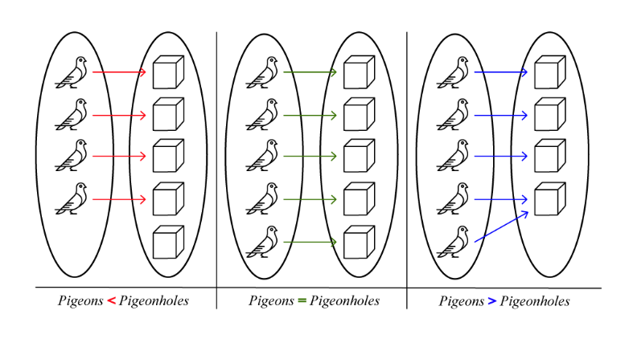

# The Language Barrier Hiding Mathematical Competence

## The Issue

Mathematics is commonly perceived as a challenging discipline, frequently eliciting discomfort and anxiety among learners. Recent statistics indicate that approximately 64% of Americans experience some level of math anxiety, with 13% reporting severe anxiety (Prodigy Education). These data highlight a pervasive struggle with mathematical concepts that may have substantial and lasting consequences.

Math anxiety often impedes academic and professional advancement, with nearly half of affected individuals reporting negative outcomes. (Eidlin-Levy et al.) It shapes career trajectories, restricts opportunities for advancement, and diminishes self-confidence. Notably, 37% of individuals report that math anxiety influences their financial decisions, including budgeting and investing. (Andersen et al.) These findings underscore the urgent need to address math anxiety to support both personal and professional development.

Math anxiety is prevalent among students but does not inherently reflect a deficiency in mathematical ability. (Caviola et al.) Research by Sheila Tobias (1978) and others demonstrates that challenges in advanced mathematics often stem from linguistic and psychological barriers rather than insufficient conceptual understanding. These barriers may include test anxiety, difficulties with technical language, or reluctance to seek assistance.

Students may experience challenges interpreting mathematical terminology or become overwhelmed by performance pressures, resulting in a cycle of anxiety that impedes academic progress. ("Math Performance and Academic Anxiety Forms, from Sociodemographic to Cognitive Aspects: a Meta-analysis on 906,311 Participants") Studies by Ma (525), Zhang et al., and Ferreira et al. emphasize the importance of addressing non-academic factors to foster a more inclusive and supportive educational environment.

Recognizing these barriers allows educators to implement targeted support strategies, such as providing clearer explanations, fostering a supportive classroom environment, and enhancing students’ confidence in communicating mathematical ideas. Concrete classroom practices operationalize these strategies. For example, sentence frames like "To solve this problem, first I..." or "The key idea here is..." offer students accessible structures for articulating mathematical reasoning. Incorporating think-aloud protocols, in which teachers or students verbalize their problem-solving processes step by step, can demystify mathematical thinking. Peer explanation routines, where students explain their solutions or reasoning to a partner or small group, encourage active engagement and reinforce understanding. Empirical research supports the effectiveness of these interventions: a meta-analysis by Sammallahti et al. (2023) found that structured cognitive and communicative strategies, such as sentence frames and peer explanation, significantly reduce math anxiety and improve student performance. Similarly, Ramirez et al. (2018) demonstrated that collaborative and inquiry-based classroom practices, including think-alouds, promote deeper understanding and lower anxiety levels among mathematics learners. Employing these strategies increases access to advanced mathematics and helps students overcome anxiety, thereby promoting greater academic achievement.

For advanced learners, including graduate students, early-career researchers, and professional mathematicians, these interventions can be adapted to address challenges at higher levels of expertise. Collaborative problem-solving groups that encourage open discussion of approaches can be integrated into research seminars or working groups, facilitating peer-to-peer explanation at a more advanced conceptual level. Think-aloud techniques may be employed when developing new proofs or exploring unfamiliar mathematical domains, making the reasoning process explicit and supporting metacognitive awareness. Structured mentoring relationships, in which experienced colleagues help reframing technical challenges or clarify advanced notation, can also reduce anxiety when engaging with new areas. Extending these strategies to advanced contexts emphasizes clear communication, supports resilience when navigating complex research problems, and promotes ongoing professional growth.

Many individuals possess an intuitive grasp of mathematical concepts but encounter challenges with Greek letters, complex notation, and specialized jargon. (Verschaffel et al.) Everyday activities such as doubling recipes, coordinating time zones, planning routes, or estimating whether furniture will fit through a doorway require mathematical reasoning. These tasks depend on proportional reasoning and spatial geometry, which are frequently applied instinctively without formal terminology. (Banerjee and Bhat)

For example, although the term “diffeomorphism” may appear intimidating, its underlying concept is accessible: it refers to a smooth transformation that preserves an object’s properties, similar to stretching pizza dough. This analogy illustrates that advanced mathematical ideas are present in everyday contexts, making them comprehensible to a broad range of learners. Relating complex concepts to familiar experiences bridges the gap between intuition and formal mathematics, thereby enhancing engagement and understanding.("What Makes an Analogy Effective for Students’ Learning of Mathematics? Conceptualizing Analogy Effectiveness for Teaching Mathematics")

Many students report feeling overwhelmed by mathematics; however, these challenges are widespread and do not necessarily indicate a lack of ability. Confusion and anxiety frequently arise from difficulties with mathematical language. With appropriate support and effective strategies, students can overcome these obstacles. ("Math Performance and Academic Anxiety Forms, from Sociodemographic to Cognitive Aspects: a Meta-analysis on 906,311 Participants")

Maintaining a mathematics vocabulary journal is an effective strategy. Students can record new terms, define them in their own words, and provide examples, thereby facilitating memorization and deepening understanding. Seeking explanations in everyday language or real-life scenarios further enhances comprehension. (Lin et al. 123-135)

Introducing formal mathematical concepts using familiar, accessible language helps students demystify the subject. (Gonzales-Martinez and Sanchez) Research indicates that intimidating language, rather than the content itself, often contributes to difficulties in mathematics (Tobias 65; Ferreira et al.). With appropriate instructional tools and methods, mathematics can become accessible and engaging for all learners.

---

## Significance of the Issue

### Financial Consequences of Avoidance

Math anxiety increases financial vulnerability in retail settings and contributes to wealth disparities. (Storozuk & Maloney, 2023) Those affected often experience negative emotions when faced with numerical information, which can cause cognitive overload and emotional distress. (Cohen & Korem, 2021) This discomfort may undermine their confidence and self-efficacy in handling numerical tasks, leading to avoidance. (Choe et al., 2019) As a result, they are less likely to compare prices, analyze interest rates, or evaluate investment options. (Storozuk et al., 2023) Over time, this avoidance leads to poor financial decisions and reduced opportunities for wealth accumulation (Peters, 2020).

Thirty-seven percent of respondents report that math anxiety impairs their financial decision-making, including budgeting, investing, and comparing loan terms. This statistic is drawn from a 2022 online survey of approximately 2,000 adults in the United States, conducted by Prodigy Education, which included a nationally representative sample balanced by age, gender, and socioeconomic background. Among Generation Z, 46% say math anxiety affects their financial decisions, such as budgeting, understanding bills, investing, and helping children with math homework (Prodigy Education).

Adults with high math anxiety are more likely to make costly financial errors, such as misunderstanding interest rates, overlooking key details in credit card offers, and avoiding financial products that require numerical evaluation (Lusardi and Tufano 340-345; 337; Ashcraft and Krause 245). Similar patterns have been documented in research from other countries, indicating that the impact of math anxiety on financial decision-making extends beyond the United States. (Lau et al., 2022) For example, studies in the United Kingdom, Australia, and Germany have reported comparable associations between math anxiety and mistakes in budgeting, borrowing, and investing (Furnham and Lumb 199; OECD 2019). These international findings reinforce the broader relevance of addressing math anxiety as part of financial education efforts.

Adults with math anxiety are less likely to compare mortgage rates, seek optimal financial products, understand compound interest, or make informed decisions about retirement and loans. This avoidance leads to overindebtedness and reduced wealth accumulation over time and is driven by anxiety rather than a lack of ability (Lusardi and Tufano 350-355). Research indicates that targeted educational interventions, such as math-specific cognitive behavioral strategies, numeracy workshops, and supportive learning environments, can help reduce math anxiety and improve financial decision-making skills. Integrating practical, real-life financial scenarios into math education has also been shown to increase confidence and support better financial outcomes (Ashcraft and Krause 250; OECD 2019).

---

### Educational and Professional Consequences

Approximately 20% of Americans report missing significant career opportunities as a result of math anxiety, according to a national survey by Prodigy Education. The impact is particularly pronounced among Generation Z, with 62% of respondents indicating educational or career barriers related to math skills and 26% reporting lost job opportunities due to insufficient proficiency. While not all sources are peer-reviewed, organizational reports and large-scale surveys provide valuable insights into current trends. These findings highlight the substantial effect of math anxiety on the prospects of young professionals. (The Professional and Technical Workforce: By the Numbers, 2024)

Math anxiety is a global phenomenon; however, rates in the United States frequently exceed those observed in other developed countries. An OECD report indicates that 30% of American students feel nervous or tense when engaging in mathematics, compared to 12% in Finland, 14% in Japan, and 15% in Canada. These statistics demonstrate that American students experience math-related stress and avoidance at significantly higher rates than their international peers. Countries with lower rates of math anxiety often implement early interventions and supportive teaching methods, offering potential models for policymakers in the United States. (Codding et al., 2023, p. 101229)

Math anxiety frequently impedes both academic and professional advancement. According to Prodigy Education, 47% of adults with math anxiety have experienced significant setbacks in education or career progression. Weir (year) further observes that many individuals trace the onset of math anxiety to adolescence, with 34% identifying middle school as the origin of their fears (Prodigy Education, Weir, Ahmed 158-166).

Mathematics serves as a foundational discipline for advanced studies in STEM fields, equipping students with essential skills for higher-level coursework and future academic or career objectives. However, many students experiencing math anxiety begin to avoid these courses before high school. (Eidlin-Levy et al.)

Such avoidance restricts immediate academic options and produces long-term consequences for the STEM talent pipeline. (Ferdinand et al., 2024) A reduced number of students pursuing these fields may diminish the pool of skilled professionals required for innovation in critical sectors (Paechter et al., 2024). Although math anxiety represents a significant barrier, additional factors such as socioeconomic status, access to high-quality resources, and extracurricular support also influence participation in advanced mathematics and STEM disciplines. (Lau et al., 2022) These trends underscore the urgent need for targeted interventions and support systems to address math anxiety and foster engagement in mathematics and related fields. (Ferdinand et al., 2024)

Effective policy measures include investing in teacher professional development to address math anxiety, implementing curriculum reforms that prioritize conceptual understanding and student engagement, and providing early screening and support for at-risk students. Policymakers may also collaborate with universities and STEM employers to offer mentorship and real-world learning opportunities, thereby clarifying mathematical concepts and their practical applications. Collectively, these strategies can foster a supportive learning environment that builds confidence and promotes long-term academic achievement. (Niu et al., 2022)

To begin moving from theory to action, schools or districts can take several practical steps. First, school leaders might initiate a needs assessment to identify specific areas where students or teachers experience the greatest challenges with math anxiety. Based on these insights, they could organize professional development workshops focused on strategies for reducing anxiety, such as using clear language and collaborative learning activities. Schools can also pilot revised lesson plans or curriculum units that emphasize accessible explanations and relate mathematics to real-life contexts before expanding changes school-wide. Establishing early identification protocols—such as brief student surveys or teacher checklists—can help pinpoint students who would benefit from targeted support or small group interventions. Creating partnerships with local universities or businesses to establish mentorship programs can further enhance these efforts. By starting with manageable pilot initiatives and collecting feedback from students and educators, schools can refine their approaches and gradually scale up successful strategies to benefit the entire learning community.

Research identifies several primary self-reported triggers of math anxiety: fear of failure (53%), inadequate understanding (48%), calculation difficulties (46%), and mismatched teaching methods (45%). Notably, three of these factors pertain to instructional approaches rather than the subject matter itself (SWNS). Additional contributing issues include technical jargon, unexplained abstract symbols, rapid instructional pacing, and teaching practices that emphasize memorization over comprehension. (Lau et al., 2022) Evidence-based reforms such as inquiry-based learning, collaborative classroom activities, and real-world problem-solving have demonstrated effectiveness in reducing math anxiety. For instance, a meta-analysis by Ramirez et al. (2018) found that collaborative and inquiry-based instruction significantly reduced students’ reported math anxiety. Similarly, Passolunghi et al. (2021) reported that real-world problem-solving tasks increased student confidence and decreased anxiety. These strategies foster deeper understanding and a more supportive learning environment, thereby addressing the root causes of math anxiety and enhancing educational outcomes.

#### Impact of Math Anxiety on STEM Fields

In 2024, individuals employed in STEM (Science, Technology, Engineering, and Mathematics) roles earned a median annual wage of $103,580, which is more than double the $48,000 median for non-STEM positions. Furthermore, STEM jobs are projected to grow by 8.1% from 2024 to 2034, nearly three times the 2.7% growth expected for non-STEM occupations. (Numbers, research, and discovery: STEM employment projected to take off!, 2025)

Math anxiety remains a significant barrier in STEM, hindering individual growth and deterring many qualified candidates from pursuing high-paying roles. Its effects extend beyond personal challenges, posing a critical economic concern that limits workforce diversity and overall economic growth (Bureau of Labor Statistics). Evidence-based strategies, including fostering a growth mindset, establishing peer support, and applying targeted classroom techniques, have proven effective in reducing math anxiety. (Employment in STEM occupations, 2024)

The United States may face up to 2 million unfilled STEM positions, primarily due to a significant skills gap among potential workers. (Employment in STEM occupations: U.S. Bureau of Labor Statistics, 2024) Research indicates that math anxiety is a major contributor, often predicting STEM avoidance more strongly than math proficiency or past performance. (Daker et al., 2021)

A study by Ferdinand and colleagues shows that math anxiety independently affects students’ STEM career choices, regardless of their math skills or achievements. The research, based on a nationally representative sample of over 1,500 high school students from diverse backgrounds, used surveys and academic records to analyze the relationships among math anxiety, performance, and career intentions. These results highlight the urgent need for targeted interventions and support systems to reduce math anxiety and build a more inclusive, skilled workforce.

Students with math anxiety often avoid mathematics courses during key academic years, resulting in the loss of essential prerequisites for many academic and career paths, as noted by Finlayson. This avoidance limits educational options and creates a cycle where reduced exposure to math increases anxiety and widens the skills gap. The ongoing cycle of avoidance and anxiety further restricts opportunities, posing a significant barrier for aspiring STEM students. (Rozgonjuk et al., 2020)

Consequently, many students interested in STEM view these fields as out of reach, contributing to workforce shortages. Only about 20% of graduating U.S. high school students are prepared for college-level STEM coursework, highlighting a pipeline issue related to early math avoidance (iD Tech). (Gragnaniello, n.d.) Targeted interventions are needed to address math anxiety and promote early engagement with mathematics.

### The Impact of Anxiety on Career Choices in STEM Fields

A recent study by Ferdinand, Malanchini, and Rimfeld (2024) finds a strong link between math anxiety and the avoidance of certain career paths among emerging adults, especially in science, technology, engineering, and mathematics (STEM). The research shows that individuals with high math anxiety are much less likely to pursue STEM careers, regardless of their actual math skills. These results suggest that emotional and psychological barriers have a greater impact on career choices than mathematical ability. One strength of the study is its focus on emerging adults, offering insight into a critical stage of career decision-making.

However, the study relies on self-reported measures of anxiety and career intentions, which may introduce bias or limit the generalizability of its findings. As a result, many qualified individuals are discouraged from entering STEM fields, which reduces both diversity and innovation in the STEM workforce. These findings suggest that targeted policy actions are needed, such as increased funding for interventions that address math anxiety and the integration of psychological support within educational standards. By using this research to inform policy, decision-makers can support initiatives that help more students overcome anxiety barriers and pursue careers in STEM.

Expanding on this perspective, Özdemir (2023) examines how math anxiety influences career interests and decisions. The study highlights that math anxiety can significantly lower self-efficacy, or the belief in one’s ability to succeed. This reduction in self-efficacy occurs as individuals who experience anxiety about mathematical tasks often engage in avoidance behaviors, such as steering clear of math-related subjects or situations. Additionally, they may engage in negative self-talk, reinforcing beliefs that they are incapable of succeeding in math. Anxiety about mathematical tasks often reduces self-confidence and causes individuals to doubt their skills and potential.

As a result, individuals with lower self-efficacy may disengage from academic and career paths that require math skills. The study shows that reduced self-efficacy creates a negative feedback loop: as confidence drops, interest in math-related fields declines as well. This disengagement increases anxiety and perpetuates a difficult cycle of avoidance. However, the cycle can be disrupted by interventions such as providing early positive math experiences, encouraging mentorship programs, or creating supportive classroom environments that help students build confidence and resilience in math. These strategies can foster self-efficacy and offer practical pathways to break the pattern of avoidance.

Özdemir’s findings show that math anxiety has a significant and complex impact. It is not just a minor obstacle to learning math but a major barrier that can undermine self-confidence and discourage individuals from pursuing STEM careers. If left unaddressed, these psychological barriers may continue to limit the participation of qualified individuals in these fields.

---

### Gender and Equity in Mathematics: Structural and Social Determinants

Hottinger’s analysis demonstrates that gender, race, and societal perceptions shape the definition of a “mathematician.” Mathematical identity is constructed through narratives that have historically marginalized women and people of color in mathematics (Hottinger). These narratives influence both self-perception and external perceptions, reinforcing stereotypes that discourage participation. In school settings, such narratives can manifest in classroom interactions, teacher expectations, and the representation of students in advanced coursework.

Studies indicate that about 70% of women experience math anxiety, compared to 57% of men (Prodigy Education). This anxiety disproportionately undermines women’s academic performance and self-perception in mathematics (Yu et al.). Stereotypes portraying mathematics as a male-dominated field foster feelings of inadequacy among women, discouraging participation regardless of ability. High-achieving girls are less likely than boys to pursue math-intensive careers, primarily due to heightened anxiety rather than a lack of ability (Denervaud et al.).Math anxiety has broader consequences, discouraging students from pursuing STEM careers and diminishing self-confidence. This issue is particularly acute among women, who report higher anxiety levels throughout their educational trajectories, from elementary school through higher education (Özdemir 7). Research indicates that gender disparities in math performance can emerge early, sometimes before formal schooling, even when preschoolers of different genders demonstrate similar mathematical skills. (Devlin et al., 2024)

Statistical evidence indicates that 70% of women experience math anxiety, compared to 57% of men (Prodigy Education). This anxiety more severely affects women, diminishing their academic performance and self-image in mathematics (Yu et al.). Stereotypes depicting mathematics as male-dominated contribute to feelings of inadequacy among women, discouraging engagement regardless of skill. High-achieving girls are less likely than boys to pursue math-intensive careers, primarily due to increased anxiety rather than a lack of ability (Denervaud et al.).

Math anxiety discourages students from pursuing STEM careers and undermines self-efficacy. This issue is particularly pronounced among women, who report higher anxiety at every academic stage, from elementary school through higher education (Özdemir 7). Research demonstrates that gender disparities in math achievement emerge early, often before formal schooling, even though preschool children of different genders exhibit similar abilities. (Penner & Paret, 2008)

Math anxiety influences gendered career choices, with high-performing girls more likely to avoid math-intensive paths due to emotional responses rather than ability (Denervaud et al.). Math anxiety also negatively affects women’s test performance, classroom participation, and confidence, even when their achievements are comparable to those of boys. This highlights the need for targeted interventions to help students, particularly girls, overcome psychological barriers (Opesemowo et al., 2025). Persistent self-doubt leads many young women to avoid advanced mathematics coursework, limiting both immediate academic opportunities and future potential in STEM fields (Samuel et al., 2022, pp. 613-626).

The intersection of math anxiety with race, ethnicity, and socioeconomic status further complicates the challenges students encounter. Women of color and those from low-income backgrounds encounter additional barriers, including stereotype threat, limited access to quality resources, and underrepresentation in advanced mathematics. Racial and ethnic minority students experience heightened math anxiety due to persistent stereotypes, resource disparities, and a lack of role models in advanced math classes (Steele 613; Ma 530). The absence of role models and limited access to effective instruction intensify anxiety and discourage participation. (Maloney et al., 2013, pp. 115-128) Negative stereotypes diminish students’ sense of belonging, as societal biases erode confidence and impede mathematical success (“Math-Failure Associations, Attentional Biases, and Avoidance Bias: The Relationship with Math Anxiety and Behavior in Adolescents” 1001-1011). Collectively, these factors increase anxiety and have enduring effects on engagement with mathematics.

Peer interactions significantly shape students’ self-perceptions and mathematical abilities, influencing their engagement with mathematical concepts. These interactions can enhance or undermine self-esteem and motivation, which is particularly important in a challenging subject. (Reciprocal relations between adolescents’ self-concepts of ability and achievement emotions in mathematics and literacy, 2021) Media portrayals of gender roles in mathematics reinforce stereotypes and shape students’ perceptions of their potential. For example, repeated depictions of men as math experts may lead girls to internalize beliefs of lesser capability. (Wille et al., 2018) The combined impact of these influences shapes academic choices and self-concept, highlighting the need to address disparities within the educational system (The Secret Language of Peers: How Peer Behaviors Signal Mindset and Influence Classroom Experiences, 2024). This evidence suggests that performance gaps are primarily driven by environmental and cultural factors rather than inherent ability.

External factors exert a greater influence on students’ performance than presumed innate abilities (Denervaud et al.). This finding underscores the need for systemic change in educational and societal structures to promote equity in participation and achievement in mathematics.

Teachers, peers, and media play essential roles in shaping students’ experiences and sense of belonging in mathematics. Teachers who set high expectations and provide encouragement can foster positive attitudes toward mathematics. (Wu & Cai, 2023, pp. 1234-1245) Addressing these factors is critical for creating a more inclusive and equitable STEM education environment.

---

### Physical, Psychological, and Physiological Harm

The phrase “I am not a math person” has become a significant identity label shaped by societal norms, gender expectations, and educational experiences (Weir). For example, research by Good, Rattan, and Dweck (2012) found that girls are less likely to be encouraged to pursue advanced mathematics, and studies of classroom interactions show teachers tend to call on boys more often for challenging math questions (Sadker & Sadker, 2009). Girls may also see fewer female mathematicians featured in textbooks or hear teachers and parents suggest that boys are naturally better at math. Media representations often reinforce these biases, showing men as engineers or scientists and women in non-mathematical roles. (Nandi et al., 2024) A large-scale study conducted by Ceci and Williams (2010) revealed that such societal cues and expectations significantly impact girls’ participation and performance in mathematics. This mindset is internalized and influences how individuals perceive their mathematical abilities. (Zhang et al., 2019)

These social and cultural influences are not only important for educational practice; they also raise foundational questions in mathematical epistemology and philosophy. The question of whether mathematical ability is socially constructed or innate draws us directly into longstanding philosophical debates, notably the positions of Platonism, constructivism, and social constructivism. Platonism, for example, asserts that mathematical truths exist independently of human minds, are perceivable by reason alone, and are universal in nature. However, if our beliefs about who can do mathematics are socially constructed and shaped by experience, this standpoint comes into question, inviting a move toward constructivist and social constructivist perspectives. Constructivism holds that mathematical knowledge is actively built by each learner through experience, while social constructivism emphasizes the fundamental role of language, culture, and interpersonal interaction in the formation of mathematical concepts. Such considerations invite us to reflect on the nature and development of mathematical knowledge, the role of social context in shaping reasoning, and the epistemic access individuals have to mathematics itself. Furthermore, the idea that access to mathematics is mediated by cultural context invites us to question the presumed objectivity and universality of mathematical knowledge, as social constructivism would argue that what we take as mathematical truth is, to a significant extent, created and negotiated within communities. If the identities and experiences of learners affect not only who engages with mathematics but also how mathematical truths are approached and understood, then the discipline itself cannot be fully disentangled from its social foundations. This perspective suggests a more dynamic and situated view of mathematical knowledge, where objectivity is informed by the plurality of human experiences and the evolving practices of mathematical communities. By explicitly connecting these social influences to major philosophical positions, it becomes clear that mathematics is not a purely abstract and neutral discipline, but one that evolves in dialogue with culture, language, and society. (Riegle-Crumb & Humphries, 2012)

Hersh and John-Steiner examine the emotional aspects of mathematics, such as love, hate, anxiety, and confidence. They argue these emotions are learned and shaped by social environments and instructional quality (Hersh and John-Steiner). Supportive classrooms foster positive attitudes, while negative experiences can lead to anxiety and aversion. The impact of emotion extends beyond attitudes, directly influencing mathematical reasoning and creativity. For example, research on cognitive load theory suggests that anxiety can consume working memory resources, which limits a student’s ability to solve complex problems. Conversely, feelings of curiosity or enjoyment may increase intrinsic motivation and encourage flexible thinking, leading to creative approaches and deeper conceptual understanding. (Moustafa et al., 2020, pp. 287-296) Emotional states can act as either barriers or catalysts: a student who feels confident is more likely to persevere with challenging problems, while one who feels threatened may rely on rote memorization or abandon reasoning altogether. Theories such as Fredrickson’s broaden-and-build model suggest that positive emotions help broaden cognitive resources, supporting better problem-solving and creative insight in mathematical contexts. (Fredrickson, 2004)

Schwartz examines whether mathematical ability is innate or learned and concludes it develops through experience, instruction, and practice. Empirical research supports this view: for example, Siegler and Ramani (2008) found that structured number board games can significantly improve numerical proficiency in young children from low-income backgrounds, while the longitudinal studies of Gunderson et al. (2012) demonstrated that parental involvement and positive math talk at home lead to measurable gains in children’s achievement. Additionally, a meta-analysis by Sisk et al. (2018) showed that growth mindset interventions, which emphasize effort and learning, can lead to statistically significant improvements in students’ math performance. These studies indicate that educational challenges typically result from poor teaching, limited resources, or language barriers, rather than fixed cognitive limitations. Educators are encouraged to improve instructional methods and learning environments to support all students. (Heyd-Metzuyanim, 2025)

Math anxiety produces measurable physiological effects, such as increased cortisol, elevated heart rate, and impaired working memory, similar to the body’s response to physical threats. This often leads to avoidance, creating skill gaps that reinforce fear and further avoidance, known as the “anxiety-performance cycle” (Ashcraft and Krause). Their research highlights psychological barriers to mathematical development.

Gold and Simons point out that even professional mathematicians discuss what counts as a valid argument. For instance, some proofs rely on visual or probabilistic reasoning, which may spark debate among experts about their rigor or acceptability. A well-known example is the use of computer-assisted proofs, such as the proof of the Four Color Theorem, which initially faced skepticism because the argument relied on exhaustive case checking rather than traditional, concise written logic. Similarly, disputes can arise over the validity of non-constructive existence proofs versus constructive proofs, with mathematicians disagreeing about whether a proof adequately demonstrates an object’s existence when it does not provide an explicit example. The negotiation of these standards reflects the evolving nature of mathematical rigor. As mathematical methods and technologies advance, the community actively debates and revises what qualifies as an acceptable proof. These debates are deeply connected to foundational questions in the philosophy of mathematics, including whether mathematical truth is discovered (as in Platonism), constructed (as in constructivism), or derived from formal systems of symbols without reference to external reality (as in formalism). The controversies surrounding acceptable proof methods often reflect underlying philosophical commitments about the nature and existence of mathematical objects, the role of intuition, and the necessity of explicit construction versus abstract existence. As such, these evolving standards of rigor not only shape mathematical practice but also directly engage with epistemological issues concerning what constitutes mathematical knowledge and truth. These evolving standards influence professional practice by requiring mathematicians to adapt their communication, teaching, and collaboration to ensure clarity, consensus, and transparency. These cases illustrate how mathematical communication is often more complex and context-dependent than conventional teaching suggests, and highlight the importance of presenting reasoning in line with professional standards.

Numeracy, in a mathematically precise sense, refers to the ability to understand, interpret, and use mathematical concepts, operations, and reasoning in varied contexts. Unlike general quantitative literacy, which involves a broader set of skills such as interpreting graphs or using numerical information in daily life, numeracy encompasses the proficiency to engage with the logical structure of mathematics, apply quantitative methods, and communicate mathematical ideas with rigor. This distinction is important for mathematicians, as numeracy involves not just the manipulation of numbers, but also familiarity with mathematical argumentation, abstraction, and problem-solving strategies. (Schreiber-Barsch et al., 2020)

Numeracy is crucial for overall well-being, extending beyond just academic achievement. For students, numeracy affects daily decisions, such as managing a budget, understanding interest rates on student loans, accurately interpreting data found in news articles or social media, and making informed choices about nutrition and health. Higher levels of numeracy are linked to better health, increased wealth, and enhanced decision-making skills. Individuals with low numeracy skills are more susceptible to cognitive biases, which can lead to poorer choices and contribute to a ‘hidden tax’ in a data-driven society. Additionally, low health numeracy results in less effective medical decisions and higher healthcare costs. (Rolison et al. 222-234, Root & Bhala, 2020) As Peters (2020) points out, improving numeracy is essential for both individual and public health. Peters’ (2020) review found that stronger numeracy skills lead to greater competency in assessing risk and benefit, improved health outcomes, and reduced susceptibility to misleading information. Peters also recommends implementing targeted educational policies and interventions to support numeracy development from an early age, arguing that these steps are critical to empowering individuals and ensuring equitable access to information, services, and opportunities.

Numeracy also forms the foundation for advanced mathematical practice and is vital for professional mathematicians and researchers. The ability to reason quantitatively, interpret abstract symbols, and apply logical structures is essential not only in daily life but also in the rigorous development of mathematical theory. Advanced research depends on strong numeracy skills for constructing proofs, understanding complex models, and communicating sophisticated ideas with clarity and precision. Thus, strengthening numeracy benefits individuals at every level, from students to expert practitioners, reinforcing the discipline and advancing mathematical knowledge as a whole. (Amalric and Dehaene 4909-4917, Gal et al., 2020)

Research by Lyons and Beilock utilized fMRI scans to examine the neurological reactions of individuals with high math anxiety. They found that when anticipating math-related tasks, the brain areas associated with physical pain were activated. This response was triggered by anxiety surrounding mathematical language and symbols, rather than the act of problem-solving itself (Lyons and Beilock). The results suggest that the body reacts to the mere presence of mathematics, rather than to the reasoning involved in mathematical processes.

Carey et al.'s 2019 review synthesized decades of research on math anxiety and identified three interrelated dimensions: cognitive, affective, and motivational.

1. **Cognitive Channel**: This dimension involves difficulties with working memory when handling mathematical notation. For those with math anxiety, complex symbols and abstract concepts can overwhelm cognitive resources, hindering problem-solving, reasoning, and the ability to understand relationships. Increased anxiety may cause mental blocks that limit access to necessary skills and knowledge. Individuals may struggle to recall formulas or apply principles correctly, leading to greater inadequacy and frustration. This decline in performance undermines confidence and perpetuates a negative cycle, significantly limiting mathematical ability and success in academic and practical contexts.
2. **Affective Channel**: This dimension addresses the emotional reactions people experience when facing mathematical problems. For many, even thinking about mathematics can cause panic, frustration, and inadequacy, increasing stress and associating math with fear. As distress grows, individuals often avoid math by missing classes, avoiding exams, or abandoning math-related careers, which reinforces their fears. Over time, this avoidance heightens feelings of inadequacy and negative perceptions, with lasting effects on academic performance, confidence, and self-esteem. Mathematics thus becomes both a cognitive and emotional challenge.
3. **Motivational Channel**: This dimension involves avoiding subjects, careers, and activities that require mathematical skills. Individuals with math anxiety often withdraw from opportunities that could enhance their abilities and boost their confidence. This reluctance shapes their educational and career choices, leading them to steer clear of mathematics and limit their professional growth. By avoiding math-related experiences, they miss out on valuable skill development and continue to experience anxiety, creating a self-fulfilling prophecy of incompetence. These patterns hinder both personal and professional development, resulting in lower confidence and competence in mathematics. The factors involved are interdependent and create a self-reinforcing cycle that perpetuates math anxiety. Traditional interventions often fail to be effective because they focus solely on cognitive difficulties, overlooking the equally important emotional and motivational aspects shaped by how mathematical concepts are presented (Carey et al.). In response, advanced interventions for higher levels of mathematical training have begun to address these broader dimensions. For example, structured mentoring programs, peer-supported collaborative problem-solving, and workshops that explicitly address emotional barriers aim to build resilience and confidence among students and early-career mathematicians. Reflective teaching practices, such as integrating growth mindset strategies and fostering a supportive classroom community, have also shown promise in mitigating anxiety and sustaining motivation as learners progress to more advanced mathematical work. Such approaches are particularly relevant for educators and mentors seeking to support individuals beyond introductory courses.

According to Souviney’s research, children learn mathematical reasoning from their everyday experiences, but they need direct instruction to master formal mathematical language. The difference between informal understanding and formal performance is known as a “translation gap,” not a deficit, and children require support to overcome it (Souviney 218-222).

#### The Influence of Mathematical Notation on Working Memory

Lyons and Beilock’s fMRI study, When Math Hurts, identified math anxiety as a neurocognitive phenomenon. The researchers recruited 28 adults who were pre-screened and categorized as either high or low in math anxiety based on standardized self-report measures. (Hart & Ganley, 2019, pp. 122-139) During the experiment, participants underwent brain imaging while solving a series of timed math puzzles, such as basic arithmetic and algebra problems, as well as word puzzles designed to serve as a non-mathematical control condition. The task order was counterbalanced, and both puzzle types were matched for difficulty and presentation format to isolate the neural effects of math-specific anxiety. (Ashcraft & Krause, 2007) This controlled design allowed the researchers to compare brain activity associated with mathematical versus linguistic tasks, and to assess how individual differences in math anxiety modulated anticipation and performance in these contexts. (Sarkar et al., 2014)

The primary finding was that anticipating engaging in mathematics, rather than the act itself, triggers discomfort. In individuals with high math anxiety, anticipating a math task activated the bilateral dorsoposterior insula, a brain region associated with physical pain (Lyons and Beilock e48076). This neural activation was absent during actual math performance, suggesting that the perceived threat is emotional and perceptual rather than computational. As the authors note, “For someone who has math anxiety, the anticipation of doing math prompts a similar brain reaction as when they experience pain” (Lyons and Beilock e48076). This perspective reframes math anxiety as an issue of emotional regulation in response to symbolic cues, rather than a deficit in reasoning. (González-Gómez et al., 2023) This interpretation is consistent with related findings that math anxiety is distinct from math competence (Lyons and Beilock, “Mathematics Anxiety” 2102).

This perceptual threat has a direct impact on working memory. Two complementary theoretical frameworks elucidate this mechanism:

1. **The Working Memory Depletion Model**: Ashcraft and Krause demonstrated that math performance depends on working memory for arithmetic tasks that extend beyond simple recall (243). (Ashcraft & Krause, 2007, pp. 243-248) Individuals with high math anxiety exhibited reduced working memory spans, particularly on computation-based tasks (Ashcraft and Krause 244). Anxiety consumes cognitive resources, disrupts attentional control, and impairs information updating, thereby diminishing processing efficiency in mathematical tasks (Ashcraft and Krause 246). (Ashcraft & Krause, 2007, pp. 243-248)

In practical terms, math anxiety fills working memory with intrusive, self-referential thoughts, thereby reducing the capacity available for problem-solving and vocabulary retrieval (Ashcraft and Kirk 224). (Shi & Liu, 2016) Ashcraft and Kirk observed that university students with high math anxiety performed worse on number-based working memory tasks than their non-anxious peers, a deficit attributed to reduced working memory capacity resulting from anxiety (226).

2. **Attentional Control Theory (ACT)**: Eysenck et al. propose that anxiety impairs executive functions by depleting working memory resources (Eysenck et al. 968). Efficient cognition depends on the balance between goal-driven and stimulus-driven systems. Anxiety disrupts this equilibrium, allowing the stimulus-driven system to predominate (Eysenck et al. 986). (Eysenck et al., 2007, pp. 336-353) For learners with math anxiety, unfamiliar notation serves as a threat stimulus that captures attention and further reduces resources available for problem-solving. (Caviola et al., 2017)

Notation is central to this process. According to Cognitive Load Theory (CLT), developed by John Sweller, total cognitive load comprises intrinsic, extraneous, and germane components (Sweller, “Cognitive Load During Problem Solving” 258). Extraneous load refers to the cognitive effort imposed by poorly designed instructional methods that impede schema acquisition (Sweller et al. 11). Concrete examples from mathematics include the use of the same symbol for different concepts within a single context, such as the letter ‘x’ being used to represent both a variable and a multiplication operation. Similarly, ambiguous or overloaded notation, such as using $f'$ to denote the derivative of a function while also using prime notation to indicate distinct but related objects, can confuse learners. Mathematical expressions that stack multiple indices, as in tensor notation (e.g., $T^{i_{jk}}$), often create additional difficulty for students who are not yet fluent in these symbolic conventions. (Hinrichs, 2018)

These notational choices can increase extraneous cognitive load, requiring students to devote attention to deciphering symbols rather than understanding underlying concepts. (Ashcraft & Krause, 2007, pp. 243-248) Empirical research supports these claims: Kirshner (1989) demonstrated that students confronted with unconventional or complex notational systems experienced measurable increases in problem-solving time and error frequency, attributable directly to working memory overload. Similarly, Durkin and Rittle-Johnson (2012) found that clearer and more intuitive notation in instructional materials led to improved learning outcomes and lower extraneous cognitive load, as measured by both performance and subjective cognitive load ratings. These studies quantify the impact of notational complexity, illustrating the need for educational researchers to address symbol design as an integral component of effective mathematics instruction.

Unfamiliar or complex notation is a major source of extraneous cognitive load. While it does not increase the complexity of the mathematical concept itself, it increases the effort required to complete the task. (Ayres, 2001, pp. 227-248) When notation differs from a learner’s intuitive understanding, the effort to decode it can overshadow their ability to use conceptual knowledge (Rada and Lucietto 120-123). The impact of notation is especially pronounced across mathematical fields that rely on highly specialized symbolic languages. For example, topology uses visually dense diagrams and shorthand symbolic systems, while mathematical logic introduces multi-tiered symbols that often defy everyday experience. (Atagi et al., 2016) Notably, research on the cognitive impact of notation among expert mathematicians reveals that even those with extensive experience are not immune to the effects of complex or unfamiliar symbolic systems. Studies have shown that experts also experience temporary increases in cognitive load and reduced problem-solving efficiency when required to switch to newly introduced or unconventional notation, underscoring the universal nature of these processing demands. (Vallée-Tourangeau et al., 2016) Even experienced mathematicians can encounter periods of adjustment when learning discipline-specific notational conventions, highlighting that notational complexity is not reserved for novices. (Nuerk et al., 2004, pp. 835-863)

Recent CLT research shows that adding representational systems requires extra processing and integration, increasing cognitive load. (Paas & Sweller, 2012) Working memory tasks that require high executive control, such as parsing dense notation, show a stronger negative correlation with math anxiety than simple storage tasks (Finell et al.). (Finell et al., 2022) Recent studies continue to highlight this issue: Lin and Kalyuga (2021) found that the introduction of overly symbolic or dense mathematics notation in instructional contexts elevated cognitive load ratings and reduced student performance, even among upper-level undergraduate learners. Similarly, a large-scale study by Nguyen, Rauterberg, and Hu (2023) demonstrated that aligning notation with students’ prior knowledge substantially mitigates unnecessary processing demands and improves comprehension.

Furthermore, international comparative work by Hitt et al. (2019) underscores the need to consider cultural and linguistic variation in symbol conventions, as misalignments can unintentionally increase cognitive load for multilingual learners or those from diverse educational backgrounds. (Ngu et al., 2023, pp. 1051-1063). These findings reinforce the importance of continual evaluation and adaptation of notation to ensure accessibility and lower barriers for all learners.

The typical experience of a learner with math anxiety follows this sequence:

- **Cue**: The learner encounters complex or unfamiliar notation, which prompts an immediate sense of confusion.
- **Threat Response**: This confusion triggers anticipatory anxiety, activating the brain’s pain and threat-detection networks, as demonstrated by Lyons and Beilock (e48076). The learner experiences increasing tension and anticipates potential failure or embarrassment.
- **Resource Depletion**: As anxiety intensifies, worry and intrusive thoughts consume cognitive resources, particularly the phonological loop and central executive functions of working memory (Ashcraft and Krause 244). This reduction in available capacity impairs the learner’s ability to focus on the task.
- **Extraneous Load Spike**: Decoding unfamiliar notation imposes additional cognitive demands, further straining an already burdened working memory system (Sweller et al. 11). As a result, the learner finds it increasingly difficult to process information.
- **Performance Drop**: As cognitive capacity diminishes, the learner’s performance declines significantly. This phenomenon, often described as “choking under pressure,” illustrates how anxiety can directly impair mathematical ability and execution (Beilock 339). The outcome is frequently frustration and disappointment.

Interventions targeting this cycle provide empirical support for the model. Beilock’s laboratory found that expressive writing about math anxieties before testing can reduce worry and free working memory resources, thereby improving performance. (Park et al., 2014, pp. 103-111) Instructional redesigns that employ consistent, visually distinct, and conceptually clear notation also enhance knowledge transfer without altering intrinsic content. (Atagi et al., 2016) For example, conceptually clear notation avoids overloading symbols with multiple meanings within the same context, and ensures that each symbol consistently represents a single concept. Visually distinct notation uses formatting such as spacing, color, or varied symbol styles to differentiate variables and operations clearly and to standardize conventions across materials, reducing confusion. (Moscoso et al., 2022) This finding aligns with Sweller’s principle that “when part of the total cognitive load is used up by extraneous load, the learning is less than optimal”. (Sweller, 2010)

However, the scope and duration of these interventions’ effects may be limited. For example, while expressive writing can produce immediate benefits, its long-term impact on math anxiety and academic achievement remains under investigation, and follow-up data are sparse or confined to short timeframes. Similarly, instructional changes to notation often show the greatest benefit in controlled educational settings, which may not generalize to more varied or less supportive classroom environments. Effectiveness can also vary with individual differences in baseline anxiety, subject-matter complexity, intervention duration, and prior knowledge. Several studies note that small sample sizes, brief interventions, lack of longitudinal tracking, and limited participant diversity further constrain the robustness and generalizability of the findings. As a result, these interventions may not fully eliminate anxiety or extraneous cognitive load, but instead provide incremental improvements that can support learning, especially when combined with broader instructional strategies. Researchers and practitioners should pay particular attention to these limitations—especially those involving sample size, intervention duration, and transferability to real-world settings—when designing or interpreting intervention studies to ensure realistic expectations regarding practical significance. (Guo, Park et al., 2014)

In summary, mathematical notation is not a neutral element. For learners with math anxiety, it functions as both an emotional trigger and a cognitive burden, consuming the working memory resources necessary for successful performance. These findings suggest that efforts to reform or develop mathematical notation could have a meaningful impact on learning outcomes. By prioritizing notation that is more intuitive, consistent, and accessible, mathematicians and educators could reduce unnecessary cognitive load and help lower barriers to entry for a wider range of students. (Atagi et al., Scheibe et al., 2023)

However, the feasibility of large-scale notation reform is complex and brings significant challenges. Implementing changes to established mathematical notation would require broad consensus within the mathematical community, as consistency is essential for effective communication and the continuity of knowledge. Rapid or fragmented reforms risk creating confusion, disrupting the transmission of ideas across subfields, and potentially isolating generations of learners and researchers accustomed to existing systems. Philosophically, such reforms also raise questions about the nature of mathematical language and whether mathematical meaning is inherently tied to specific symbols or is independent of notation. Achieving successful reform would therefore require careful negotiation, pilot testing, and collaboration among educators, researchers, and institutions to ensure both increased accessibility and the preservation of shared standards necessary for the discipline's progress and cohesion.

The implications of notation reform also extend beyond teaching and learning, impacting mathematical research practice itself. More accessible, standardized notation can facilitate clearer communication among researchers from different subfields or institutions, thus supporting interdisciplinary collaboration. Minimizing ambiguity and reducing the cognitive demands of deciphering unfamiliar symbolic systems may enhance the efficiency of peer review and publication processes. Additionally, clear and inclusive notation can make advanced mathematical work more approachable to new entrants to the field, broadening participation and encouraging cross-pollination of ideas. Such considerations invite ongoing evaluation of symbolic systems to ensure that advances in mathematical thought are matched by clarity and inclusivity in their representation. ("Mathematics education researchers’ practices in interdisciplinary collaborations: Embracing different ways of knowing" 1-19, Specht & Crowston, 2022)

Several strategies could guide concrete steps for notation reform. One approach is to establish interdisciplinary committees composed of mathematicians, educators, cognitive scientists, and linguists, tasked with reviewing and recommending standardized symbol conventions for new and existing areas of mathematics. Developing and maintaining open-access repositories or databases of standardized notation would facilitate adoption and reference. In addition, creating formal guidelines for symbol selection, prioritizing clarity, consistency, and avoiding overload, can help minimize unnecessary complexity. Piloting new or revised notational systems in diverse educational settings, followed by empirical assessment of cognitive impact and learning outcomes, would ensure that revisions genuinely reduce extraneous cognitive load. Further, incorporating user-centered design practices, such as soliciting feedback from students and international scholars, can help ensure the accessibility of notation for learners from varied backgrounds.

At the same time, it is important to acknowledge that notation reform faces significant challenges. Resistance may arise from longstanding mathematical traditions, the deep integration of current symbolic systems into research and teaching, and concerns about disrupting communication across subfields or generations. Widespread changes to mathematical notation risk fragmenting the field and creating transition issues for both new and established practitioners. These complexities highlight the need for careful consensus-building and thoughtful implementation when considering large-scale reform, balancing the benefits of accessibility with the necessity of maintaining coherence and clear communication within the mathematical community.

While these systemic reforms are important, individual educators can also take immediate steps to make notation more accessible in their own classrooms. Teachers might clarify the meaning and purpose of each new symbol as it is introduced, use consistent notation throughout lessons, and provide students with symbol glossaries or reference sheets. Where possible, instructors can adapt notation to align with students’ existing knowledge, explicitly explain ambiguous or overloaded symbols, and encourage students to verbalize their interpretations of symbols during problem-solving activities. Adding color, spacing, or visual cues to distinguish similar symbols can further reduce confusion. Encouraging students to ask questions whenever notation feels unclear and inviting feedback on which symbols are most challenging can help foster a more inclusive environment. By making these targeted adjustments, individual educators can immediately reduce cognitive barriers and support understanding, even before broader notation reforms are implemented. These strategies are equally relevant and adaptable to higher education contexts, such as undergraduate and graduate mathematics courses, where instructors can clarify advanced notation and encourage students to discuss and interpret symbols in research seminars or advanced problem sets. By tailoring these practices to the needs of students at all levels, educators can help make even the most complex mathematical material accessible. These strategies provide a framework for ongoing reform and research, leading to practical improvements in both education and professional mathematical communication. (Atagi et al., Greiner-Petter et al., 2020)

---

### Math Anxiety as a Linguistic Rather Than Conceptual Barrier

Millions of people who claim to be “bad at math” successfully navigate topological problems daily—tying shoes, braiding hair, wrapping gifts, untangling jewelry, securing loads with rope, knitting, crocheting, and countless other activities that require sophisticated topological competence (Matsumoto and Grishanov 120–22). The disconnect between this demonstrated competence and mathematical self-concept exemplifies how linguistic barriers to formal mathematics obscure genuine mathematical ability operating in embodied, spatial, and tactile domains (Sossinsky 210–15). (Robertson and Graven)

Parents negotiating bedtime with children, shoppers timing purchases for sales, employees deciding how hard to work when monitoring is imperfect—all demonstrate an intuitive understanding of strategic equilibria, dominant strategies, and repeated-game dynamics (Raeburn and Zollman, Rubinstein 130–40).

People navigate topological concepts constantly—realizing that untangling headphones requires understanding how the cord is knotted—all without invoking Euler characteristics or homeomorphisms. A person untangling jewelry chains demonstrates sophisticated topological reasoning (knot theory): they visualize how loops connect, identify where chains are genuinely knotted versus merely tangled, and perform specific manipulations to reduce topological complexity. This is expert-level topology applied in real-time, lacking only the formal vocabulary to describe what’s being done. Mathematical competence exists; the technical language that would allow them to communicate with professional topologists does not. (Croom and Firestone)

Everyone engages in stochastic reasoning daily, like deciding to bring a jacket in case of rain or leaving early for a flight due to potential traffic. Diversifying investments is another example of this. While formal mathematics, such as Markov chains, allows for precise predictions, the core idea that “the future is uncertain and should be modeled probabilistically” is widely understood. People make sophisticated decisions about uncertainty without needing specific mathematical terms, recognizing that while things may be predictable on average, they remain uncertain on an individual level. Understanding randomness does not require technical vocabulary; people can grasp complex ideas without formal language. ("Reasoned Decision Making Without Math? Adaptability and Robustness in Response to Surprise" 869-883)

Every person who plays a 3D video game, uses a smartphone’s orientation sensor, or watches a CGI movie demonstrates fluency with quaternion-based transformations through their intuitive understanding of 3D rotation. They can predict how objects will rotate, judge whether orientations are correct, and manipulate 3D spaces with precision. Yet if shown the equation $q = \cos(\theta/2) + \sin(\theta/2)(xi + yj + zk)$ and asked to explain quaternion rotation, most would claim they “don’t understand the math.” The mathematics is operating correctly in their interactions; only the symbolic representation is unfamiliar. This perfectly illustrates the document’s central thesis: mathematical competence exists independently of mathematical language. (Díaz et al.)

The competence-language gap is particularly stark in number theory. A child who can determine “If today is Tuesday, what day will it be 100 days from now?” is performing modular arithmetic: $100 \equiv 2 \pmod{7}$, so it will be Thursday (Dudley 3). The child may solve this by counting by sevens (“7, 14, 21… 98 is 14 weeks, so 2 days after Tuesday”) without ever encountering the formal notation. The mathematical reasoning is complete and correct; only the symbolic language is absent. This pattern recurs throughout number theory: people demonstrate numerical competence—recognizing patterns, applying divisibility shortcuts, estimating prime factorizations—without the formal vocabulary to discuss these concepts with mathematicians. (Göbel et al. 17-25)

Every user of online banking, encrypted messaging, or secure purchases trusts number-theoretic principles, understanding that encryption keeps their data safe. They can recognize the need for security and choose appropriate tools without knowing specific mathematical concepts like Euler’s totient function or modular arithmetic (Petras 700–05). As Lefton observes, teaching cryptography is most effective when familiar problems are introduced before complex notation (Lefton 54–60). This supports the idea that mathematical literacy doesn’t require fluency in mathematical language. (White)

Every person understands genus, a topological invariant that influences how objects are used (Weisstein). For example, a bowl ($g = 0$) can’t be reshaped into a mug ($g = 1$) without creating a hole. A typical pair of eyeglasses (without lenses) has $g = 2$, while a button with four holes has $g = 4$. A wedding ring has $g = 1$, and two interlocked wedding rings form a more complex structure with genus 2 but remain distinct from a double-torus, as they can be separated by continuous deformation. This illustrates the intuitive understanding of linked versus fused rings—a fundamental topological insight. (Auckly 330-342)

To make the connections between advanced mathematical concepts and everyday experience clearer, consider these concrete examples:

- When tying shoes, braiding hair, or untangling jewelry, individuals are intuitively applying principles from topology and knot theory, such as understanding how loops connect and can be manipulated.
- Doubling a recipe, converting measurement units in cooking, or planning routes involves proportional reasoning and spatial geometry.
- Deciding to bring an umbrella based on weather forecasts, or leaving early for a flight to avoid traffic, demonstrates probabilistic thinking, similar to concepts in statistics and stochastic processes.
- Managing a budget, comparing shopping prices, or understanding a credit card’s interest rate requires arithmetic, percentage calculations, and numeracy skills.
- Playing 3D video games or using a phone’s orientation sensor relies on an intuitive sense of spatial rotations, which is closely related to quaternion mathematics used in computer graphics.
- Children solving questions like, “If today is Tuesday, what day will it be 100 days from now?” are performing modular arithmetic without realizing it.

These examples show that advanced mathematical ideas are present and practiced continuously in daily life, often without the formal vocabulary or notation. By recognizing and relating these familiar contexts to abstract mathematical concepts, educators can help bridge the gap between intuition and formal mathematics, enhancing understanding and reducing intimidation. (Miyejav)

#### Jargon and Notation as Mechanisms of Gatekeeping in Mathematics

Ortlieb et al. argue that each academic discipline, including mathematics, forms a distinct discourse community defined by specialized vocabulary, syntax, and argumentation. These elements are not intuitive and must be explicitly taught as part of disciplinary literacy. (Planas and Pimm) In mathematics, this literacy involves fluency in reading, writing, and communicating according to established conventions, which differ from general computational skills and require understanding mathematical expression in written form. This focus on disciplinary literacy aligns with foundational debates in the philosophy of mathematics and epistemology, particularly regarding the nature of mathematical knowledge and the relationship among language, representation, and understanding. (Herheim) By highlighting the constructed and communicative aspects of mathematical language, scholars show that mathematics is not merely a set of facts or procedures, but a practice grounded in human conventions and discursive norms. (Planas and Pimm)

Disciplinary literacy and communicative conventions play a critical role in advanced mathematics. Mastery of mathematical language and adherence to established norms are essential for effective research collaboration and the clear exchange of complex ideas. Mathematical publications require not only rigorous proofs but also precise exposition, with specific expectations for notation, terminology, and structure. These conventions shape the formulation of theorems, promote clarity, and reduce ambiguity. (Peterson et al. 1-10) As a result, disciplinary literacy both facilitates understanding and defines the standards of advanced mathematical research and communication.

Hiebert further developed this foundation by examining how learners acquire proficiency with mathematical symbols. He showed that symbolic fluency, which is essential for engaging with mathematical content, can be taught and learned independently of conceptual understanding. This distinction indicates that students may have strong reasoning skills but still struggle with symbolic representation. The separation between reasoning and symbolic fluency supports Hiebert’s language-barrier thesis, which argues that mastery of mathematical language is crucial for student success.

Ferreira et al. (2025) examined the link between mathematics-specific vocabulary and early mathematical performance in young students. They found that proficiency in mathematics-specific vocabulary is a stronger predictor of mathematical performance than general language skills. Students who struggle with mathematical terminology often experience increased anxiety and stress, which negatively impact their academic outcomes. As a result, complex mathematical jargon can obscure students’ true abilities and lead to outcomes that do not accurately reflect their potential.

A systematic review by Castillo et al. (2025) assessed mathematics teaching methods and found significant drawbacks in relying solely on formal mathematical notation, which can hinder student learning. The review stressed that without concrete, intuitive representations, students may struggle to grasp key concepts. To promote deeper understanding, multiple semiotic representations—including symbols, graphs, and algebraic expressions—should be integrated with real-world contexts. However, many curricula still prioritize formalism over intuitive understanding, which may limit students’ ability to comprehend mathematical principles fully. (Højgaard) While much of this research focuses on early and secondary education, the effects of notation and representation also impact higher levels.

In advanced mathematical research, the growing abstraction and complexity of formal notation can create barriers for those unfamiliar with specialized conventions. For example, in algebraic geometry, notation for concepts like sheaf cohomology or schemes can make published work inaccessible to mathematicians outside the field, sometimes hindering interdisciplinary collaboration. For instance, the notation H^i(X, F) denotes the ith sheaf cohomology group of a sheaf F on a scheme X, where understanding the role of each symbol requires background knowledge of both topological and algebraic structures. Similarly, the notation Spec(R) is used to refer to the spectrum of a ring R, which has specific meaning in the context of schemes but may not be transparent to those outside algebraic geometry. These specialized notational systems can present significant obstacles to comprehension, even for mathematicians from closely related areas.

In contrast, the use of universal notation in group theory, such as standard symbols for group operations and homomorphisms, has improved communication and supported cross-disciplinary research. Inconsistencies in terminology between subfields have historically been confusing; for example, the term “ring” in algebra versus analysis led to misunderstandings until shared conventions were adopted.

Even among experienced mathematicians, clear exposition and varied representations are essential for understanding and collaboration. This shows that challenges with notation and representation affect all levels of mathematical practice. (Hernandez-Martinez et al.)

The American Psychological Association (APA) published a 2023 report indicating that math anxiety is primarily an emotional response rather than a consequence of cognitive deficiencies. Many individuals experiencing math anxiety possess adequate mathematical skills, yet anxiety inhibits their ability to demonstrate these skills, particularly in high-pressure contexts.

The report highlights the importance of environmental factors for individuals with math anxiety. In supportive, stress-reducing environments that encourage a positive approach to mathematics, these individuals often perform as well as peers without math anxiety. This finding shows that emotional states significantly impact performance, suggesting that the challenges faced by those with math anxiety are primarily emotional rather than numerical.

The research shows a statistically significant mediating effect of anxiety on mathematical performance. Anxiety is closely tied to personal identity, self-perception, and beliefs about mathematics. These results suggest that difficulties experienced by individuals with math anxiety are mainly psychological and linguistic, rather than due to a lack of understanding of mathematical concepts. (Živković et al.)

These insights call for a reevaluation of teaching strategies in mathematics education. The study recommends supportive approaches that build student confidence and reduce anxiety. Emotional well-being should be a core element of mathematics education, not secondary to skill development. The report advocates for reforms that emphasize mental health and emotional resilience alongside academic success (Özdemir 10).

Demedts et al. advanced the understanding of math anxiety by distinguishing between state and trait math anxiety. State math anxiety is an acute, situational panic during mathematical tasks, while trait math anxiety is a chronic, persistent fear of mathematics. Their findings show that trait math anxiety has a greater impact on performance, especially in complex tasks. This effect increases when tasks involve multiple forms of presentation, such as symbols, technical notation, and formal terminology. Therefore, the way information is presented can trigger anxiety in individuals with trait math anxiety, rather than reflecting a lack of mathematical understanding.

Kirschner examined the relationship between linguistic competence and mathematical ability, arguing that many mathematical challenges arise from linguistic processing difficulties rather than reasoning deficiencies. He emphasizes that language proficiency and mathematical skills are distinct, so individuals may excel in one area while struggling in the other. This perspective highlights the complexity of math anxiety and its varied effects on learners.

Tobias argues that “math block” often results from language barriers rather than difficulties with mathematical concepts. Many students struggle with notation, vocabulary, and formal argumentation, not with mathematical logic itself. He asserts that supportive instruction focused on interpretation and translation can significantly reduce or eliminate mathematics anxiety (Tobias 65-70). Unfortunately, institutions often misinterpret these struggles as deficiencies in competence, leading to reliance on remedial courses and repetitive drills (Hodkowski). If language barriers are the root cause, traditional instructional approaches are inadequate. Instead, educational efforts should connect the complex language of mathematics with students’ intuitive reasoning abilities (Espinas and Fuchs).

Wynn and Reyes examine the rhetorical aspects of mathematical communication, arguing that mathematical arguments are persuasive acts embedded in language rather than simply conveying objective truths. They maintain that how mathematics is articulated and presented significantly affects access to understanding, making rhetorical skills essential for mathematical literacy (Wynn and Reyes). This perspective intersects with ongoing philosophical debates about the objectivity and truth of mathematics. While traditional positions like Platonism view mathematics as objective and discoverable, rhetorical and linguistic perspectives suggest that mathematical knowledge is shaped by human language and conventions. This raises questions about its universality and neutrality. Considering these philosophical issues highlights the complex relationship between mathematical communication and perceptions of objectivity within and beyond the discipline.

While specialized vocabulary and complex proof structures in formal mathematics can act as gatekeeping mechanisms, excluding those unfamiliar with disciplinary norms and contributing to feelings of inadequacy among students with linguistic challenges, it is important to recognize their positive aspects as well. (Leyva and Joseph 1187-1197) Formalism and precise terminology promote clarity, enable creative abstraction, and support rigorous reasoning, all of which are valued in the mathematical community. In advanced research and problem-solving, such rigor often leads to significant breakthroughs and ensures ideas are communicated with minimal ambiguity. At the heart of these practices are two influential philosophical perspectives on mathematical knowledge: essentialism and constructivism. Essentialist approaches view mathematical truths as existing independently of human experience, emphasizing universal, objective principles and the need for precise definitions and formal proof. Constructivist perspectives, by contrast, emphasize that mathematical knowledge is actively constructed by learners through experience, language, and cultural context, and that meaning emerges from individual or communal engagement with mathematical ideas.

Balancing these perspectives presents both risks and benefits. An overly essentialist focus can reinforce barriers by prioritizing abstraction and established formalism at the expense of accessibility, making mathematical discourse exclusive and less adaptable to diverse learners. On the other hand, a strictly constructivist approach, if not supported by rigorous standards, risks undermining the universality and transferability that allow mathematics to advance and link communities globally. For educators and the mathematical community, the central challenge is to find a productive middle ground: to uphold high standards and nurture creative abstraction while increasing accessibility and inclusivity. Many leading mathematicians now advocate for approaches that retain the rigor of proof and abstraction while presenting definitions, notation, and exposition as clearly and welcomingly as possible for all learners. Priority can be given to scaffolding learning so that students are gradually introduced to formalism, with support that connects intuitive reasoning to systematic structures. Maintaining high standards of rigor does not require sacrificing inclusion. Instead, transparency in definitions, thoughtful use of terminology, and clear, gradual progression to abstraction can allow a broader spectrum of students to participate fully in mathematical discourse while upholding the tradition of mathematical excellence.

#### The Importance of Framing in Mathematics Education

Pei, Poon, and Suen (2025) conducted a comprehensive study underscoring the critical role of mathematical engagement in mediating the relationship between anxiety levels and academic performance in mathematics. Their findings indicate that when students engage with mathematical concepts through accessible language and real-world examples, anxiety levels decrease significantly. This evidence suggests that the mode of presenting mathematical content may exert a greater influence than the content itself. Similarly, Finlayson demonstrated that introducing mathematical concepts in clear, everyday language before formal notation substantially enhances students’ confidence and performance. This sequential approach, which first fosters understanding through familiar language and then transitions to formal mathematical expressions, significantly enriches the learning experience (Finlayson). These perspectives align with established theories such as Vygotsky’s concept of the Zone of Proximal Development, which emphasizes the importance of scaffolding and the use of familiar contexts to support learning, as well as Bruner’s theory of constructivist learning, where approachable language and real-world references help bridge new concepts. These findings can also be related to Piaget’s theory of cognitive development, which suggests that students progress through stages of understanding and benefit from instruction that matches their cognitive readiness, and to Skemp’s distinction between instrumental and relational understanding, indicating that relational approaches using accessible language can foster deeper comprehension. Additionally, Tall’s framework on concept formation highlights the transition from embodied and symbolic representations to formal abstraction, reinforcing the value of first anchoring mathematical ideas in familiar contexts. Collectively, these findings support instructional strategies that prioritize accessibility and relatability, thereby improving student engagement and achievement.

Historically, perspectives on mathematical ability and pedagogy have shifted significantly. In the past, prevailing views often regarded mathematical talent as an innate trait, accessible only to a select few. This belief influenced traditional pedagogical approaches that emphasized rote memorization and procedural mastery, frequently marginalizing students who did not immediately excel. (Pool and Ericsson) More recent research, such as Byrnes’s analysis—which synthesizes findings from multiple large-scale longitudinal studies involving student cohorts at various educational stages—provides substantial evidence that mathematical competence develops gradually through three core components: skill acquisition, conceptual growth, and linguistic fluency. Byrnes draws on data from studies with sample sizes ranging from several hundred to several thousand participants, using mixed-methods approaches that combine quantitative assessment of student performance with qualitative evaluation of learning strategies. This framework challenges the idea that some students inherently lack mathematical ability, suggesting instead that many have not been exposed to effective, accessible teaching methods tailored to their needs. As a result, their potential often remains unrealized until appropriate educational strategies are implemented (Byrnes). These findings underscore the importance of creating supportive and inclusive learning environments that promote all students’ understanding and mastery of mathematical concepts and skills.

A comprehensive longitudinal study by Holenstein et al. examined transfer effects on the development of mathematical literacy, defined as the ability to interpret, communicate, and reason with mathematical ideas across contexts. The study found that language-based competence is a stronger predictor of transfer effects than procedural skills, underscoring the importance of linguistic fluency in promoting mathematical flexibility and adaptability (Holenstein et al. 810-820). In her advocacy for “Mathematical Competence for All,” Abrantes identified significant institutional and pedagogical barriers to equitable mathematics education, which are mainly structural and linguistic rather than cognitive. Viewing mathematics as a universally accessible language, rather than an exclusive code, enables all learners to achieve mathematical competence (Abrantes).

A recent meta-analysis by Al-Naim and Mefi (2023) demonstrates the effectiveness of interventions to enhance language support in mathematics education. Their analysis found that structured approaches, including clear explanations of mathematical terminology and a gradual introduction to notation, consistently reduce mathematics anxiety among students. This anxiety reduction enables students to approach mathematical tasks with greater confidence and leads to measurable performance improvements. Practical language support interventions, such as maintaining vocabulary journals for key mathematical terms or using sentence frames to scaffold mathematical discussions, have shown particular promise in facilitating comprehension and reducing student apprehension. These findings emphasize the importance of addressing both linguistic and pedagogical factors in mathematics instruction, as these elements are pivotal in shaping students’ learning outcomes (Al-Naim and Mefi 875-880).

Hodkowski’s analysis of current educational practices addresses the ongoing debate regarding the importance of conceptual versus procedural understanding in mathematics education. The findings indicate that cultivating a deep understanding of the reasoning behind mathematical concepts—the “why” of mathematics—fosters more robust and transferable mathematical thinking. Conversely, exclusive reliance on procedural fluency can leave students struggling with algorithms and terminology without a strong conceptual foundation. Even students who intuitively understand underlying concepts may encounter difficulties with procedural execution, highlighting the necessity for deeper engagement with mathematical material (Hodkowski).

Abbott et al. provide an in-depth analysis of the “math wars,” a term describing decades of debate over mathematics curriculum and pedagogy. Their research demonstrates that disputes over teaching methods are closely linked to broader societal issues, such as disparities in educational access and the pursuit of equity among diverse student groups. Abbott et al. argue that debates in mathematics education encompass not only pedagogical philosophies but also fundamental questions of educational justice and the legitimacy of varied mathematical knowledge. These complexities indicate that discussions in mathematics education extend beyond instructional strategies to address core issues of fairness and institutional responsibility (Abbott et al.). Similar debates and equity issues have been observed internationally, with countries such as the United States, the United Kingdom, and Australia reporting parallel controversies regarding curriculum design and access. While the specific local context and policy responses may differ, the underlying challenges surrounding fairness, access, and the legitimacy of diverse mathematical practices consistently emerge within educational systems worldwide. (Vithal et al. 153-164)

Research by Nunes, Schliemann, and Carraher provides strong evidence supporting ethnomathematics. Their findings indicate that integrating mathematical reasoning into meaningful, real-world contexts leads to higher accuracy and increased self-confidence among students. This effect is especially pronounced compared to traditional methods that emphasize abstract formal notation, which can leave students feeling disconnected from the material (Nunes et al.).

A study by Castillo et al. investigated the effects of gamified and active learning strategies on student engagement and performance in mathematics. These approaches aim to bridge the gap between informal reasoning, grounded in everyday experience, and formal mathematical notation. The results show that such strategies significantly reduce intimidation associated with complex mathematical concepts, thereby enhancing student motivation. This effect is particularly evident at the university level, where students often face the challenges of advanced mathematical notation (Castillo et al.).

A comprehensive meta-analysis by Sammallahti et al. (2023) synthesized 50 studies involving 9,125 participants. The analysis reported moderate effect sizes for interventions targeting math anxiety reduction (g = -0.467) and overall improvement in math performance (g = 0.502). The most effective interventions combined cognitive support, which fosters understanding and skill acquisition, with emotional regulation techniques that help manage anxiety and build resilience. Additionally, longer interventions, particularly those for students aged 12 and older, produced the most substantial effects. These findings suggest that integrating anxiety reduction with skill enhancement creates a more holistic and effective approach to mathematics learning (Sammallahti et al.).

For advanced or elite learners, these results highlight that even at high levels of achievement, addressing math anxiety and building emotional resilience remain pivotal. To offer more concrete strategies for this group, targeted mentorship programs can be implemented through pairing students with experienced mathematics mentors who guide advanced problem-solving, provide feedback on complex tasks, and support through academic challenges. Structured cognitive support interventions, such as individualized coaching sessions focusing on metacognitive strategies, collaborative research projects, and workshops on tackling unfamiliar or competition-level problems, can also equip elite students with tools for sustained high performance. Incorporating peer-led seminars, opportunities for reflective journaling about problem-solving processes, and regular check-ins to discuss progress and setbacks further contributes to ongoing development. For example, a recent university-based mentorship program for advanced mathematics students matched upper-level undergraduates with graduate student mentors. Over the course of a semester, participants not only reported a measurable reduction in math anxiety as assessed by the MARS (Mathematics Anxiety Rating Scale), but also demonstrated greater willingness to tackle open-ended research tasks and present their findings in departmental seminars. Feedback from participants emphasized that regular mentor meetings and collaborative workshops helped them develop coping strategies for high-pressure situations, with several students choosing to enroll in more advanced mathematics courses the following term. These approaches help advanced learners build resilience, maintain motivation, and effectively navigate the pressures inherent to high-level mathematics. (Scheibe et al.)

---

### The Ongoing Cycle of Math Anxiety

#### Intergenerational Transmission of Math Anxiety

Recent research demonstrates that math anxiety is transmitted across generations through both genetic and environmental factors. While Malanchini et al. (2022) is cited, it is important to clarify the methodological rigor of the principal studies. The primary empirical foundation is a landmark longitudinal field study published in Psychological Science, which used repeated measures over a school year to track changes in both parents and children. This design allowed the researchers to control for pre-existing math ability and other potential confounds, strengthening the validity of the claimed intergenerational effects.

Maloney, Ramirez, Gunderson, Levine, and Beilock (2015) tracked first- and second-grade students over a school year. The study found that children of highly math-anxious parents learned less mathematics and developed greater math anxiety, but only when those parents frequently assisted with homework (Maloney et al. 1480). The authors note: “Although there may be a genetic component to math anxiety, the fact that parents’ math anxiety negatively affected children only when they frequently helped on the child’s math homework” suggests an environmental transmission pathway (Maloney et al. 1480).

This finding has been replicated and extended:

1. **Genetic and Environmental Dual Pathway**: Quantitative genetic research, primarily relying on classic twin studies, indicates that approximately 40% of the variance in math anxiety is attributable to genetic factors, either directly or through their influence on mathematical ability and general anxiety (Wang et al., qtd. in Malanchini et al.). These studies compare monozygotic and dizygotic twins to estimate heritability, allowing researchers to disentangle genetic influences from shared environmental effects. Malanchini et al. further specify that 75% of this genetic variance is related to math attitudes, abilities, and achievement, highlighting substantial overlap between affective and cognitive traits (Malanchini et al.). Additionally, a study in Frontiers in Psychology confirmed that children’s math anxiety correlates with their arithmetic performance and is associated with parents’ educational level and attitudes (Malanchini et al.).
2. **Mechanisms of Environmental Transmission**:
   - **Reduced Positive Home Numeracy**: Parents with high math anxiety participate less frequently in positive numeracy activities, such as counting games, cooking measurements, budgeting, and number talk. When they do assist, they are more likely to use controlling rather than autonomy-supportive styles, which partially explains the association between parents’ math anxiety and children’s achievement (O’Sullivan et al.).
   - **Modeling Negative Attitudes**: Parents’ math anxiety is communicated to children through everyday activities, such as budgeting or calculating a tip, as well as through involvement with homework (Maloney et al. 1482). Longitudinal data indicate that children’s perception of their parents’ enjoyment of mathematics moderates the relationship between parental and child math anxiety, with the effect strongest in same-gender pairs, particularly mother-daughter pairs (Van Mier et al.; Girard and Russell).
   - **Language Barrier Effect**: Parents who avoid math-related discussions limit their children’s exposure to informal mathematical vocabulary. Research published in PMC [PubMed Central] demonstrates that math anxiety impairs symbolic, but not nonsymbolic, fraction skills, suggesting a perceptual basis. Children who lack early exposure to symbolic language encounter greater challenges when formal notation is introduced (Starr et al.).

An intervention published in Science tested this model directly. Berkowitz et al. (2015) provided math-anxious parents with a math-storybook app designed to encourage non-anxious interaction. Children whose parents used the app showed greater math growth, and the intergenerational link between parent and child anxiety was eliminated. However, it is important to note that the intervention sample was limited to families in the United States and focused on early elementary students, with a relatively modest sample size. Further, while the findings are promising, replication in larger, more diverse populations is needed to confirm the approach’s effectiveness and generalizability. This demonstrates that transmission is malleable and not solely genetic.

#### Meta-Analytic Evidence: Consistent, Moderate, Negative Effects

The negative correlation between math anxiety and achievement is among the most consistently replicated findings in educational psychology.

Zhang, Zhao, and Kong (2019) conducted a meta-analysis [Frontiers in Psychology - PubMed] across 84 samples and 8,680 participants, reporting a significant negative effect size (r = -0.32), consistent with prior studies and reviews (Zhang et al.). This effect size reflects a moderate and robust relationship. To help contextualize, correlations of this magnitude are similar to the relationship between smoking and lung cancer, and are larger than the association typically found between self-esteem and academic achievement. (Barroso et al. 134-168) In practical terms, a correlation of r = -0.32 means that students with higher math anxiety are much more likely to perform lower in mathematics compared to their less anxious peers. (Barroso et al.) Moderator analysis revealed that the association was stronger for tasks involving innovative problem-solving than for rote recall, and more pronounced in senior high school than in elementary school, suggesting that the effects accumulate as the complexity of notation increases. (Namkung et al. 213-227)

This r = -0.32 estimate is consistent with findings from other large-scale syntheses:

- **Barroso et al. (2021) meta-analysis [PubMed - 131 studies, 478 effect sizes]**: Found r = -.34 for school-aged students (Barroso et al.). Moderation analyses indicated stronger effects for more advanced math and for students with lower working memory capacity.
- **Ma (1999)**: The first major meta-analysis in the field, published in the Journal for Research in Mathematics Education, analyzed 26 studies and found r = -.27 between anxiety toward mathematics and achievement (Ma 520). Ma also found that the correlation was stronger for language-based tasks, such as word problems, than for pure calculation, reinforcing your language thesis. As later reviewers note: “In his 1999 meta-analysis, Ma compared the correlations of samples using the MARS (k = 15) to samples using other, non-MARS scales (k = 22)” and found consistent effects (Barroso et al.).
- **Hembree (1990)**: The foundational meta-analysis of 151 studies found r = -.34, establishing the historical baseline.

Explanations for stronger effects in senior high school: Zhang et al. and Radišić et al. attribute the increase to both cognitive and semiotic factors. Radišić et al. (2015), analyzing PISA data from six European countries in the European Journal of Psychology of Education, found that the degree of early formality and abstraction significantly predicted anxiety at both the institutional and individual levels (Radišić et al. 10-15). Schools that prioritized conceptual understanding and delayed intensive use of formal notation reported lower student anxiety. (Muncer et al.)

This finding is consistent with recent evidence from ScienceDirect: “Accordingly, researchers have found correlations between various MA measures are significantly higher than those between MA and test anxiety. Similarly, a significant negative correlation has been found between MA, but not GA, and math performance” (Chang and Beilock 2016, qtd. in Orbach et al.). The association between math anxiety and performance is specific and mediated by working memory, rather than by general anxiety, as confirmed by a Frontiers meta-analysis on working memory as a mediator (Finell et al.).

Ding’s research on developmental students and recent MDPI studies on mathematical language self-efficacy indicate that reducing mathematics anxiety requires both internal resources, such as self-regulation, and explicit instruction in mathematical language with structured support during key tasks (Kopparla et al.). (“Self-Regulation and Mathematics Anxiety: The Conditional Mediating Role of Mathematical Language Self-Efficacy and Implications for Inclusive Education”) Notably, advances in cognitive psychology have shown that working memory plays a central role in mediating the relationship between anxiety and mathematical performance; anxiety consumes cognitive resources, leaving less capacity available for processing complex notation and multi-step problem solving. (Finell et al.) Further, language processing abilities are strongly linked to the understanding and use of mathematical symbols, since students must map natural language to formal notation and manipulate symbolic representations. (Landy and Goldstone) Neurocognitive studies suggest that difficulties in symbolic processing, such as translating word problems into algebraic expressions, are associated with heightened activation in brain regions related to both anxiety and language, underscoring the cognitive load imposed by complex notation. (Daroczy et al.) When formal notation is introduced without linguistic bridging- meaning without connecting intuitive vocabulary to symbolic forms- students with strong reasoning skills are systematically marginalized.

---

## D’Ambrosio’s Ethnomathematics Framework

D’Ambrosio’s ethnomathematics framework offers a significant lens for analyzing mathematical competence in formal education. He contends that mathematics is not simply a universal, culture-independent language taught through formal instruction, but rather a collection of human practices shaped by diverse societies.

Drawing on etymology, D’Ambrosio defines ethnomathematics as “the art or technique (tics) of explaining, understanding, coping with (mathema) the sociocultural and natural (ethno) environment” (22). In D’Ambrosio’s framework, the scope of mathematics extends beyond the formal, axiomatic systems commonly encountered in academic settings. Mathematics is seen as a spectrum that includes both informal, culturally embedded practices—such as counting, measuring, and spatial reasoning within daily life—and formal, abstract mathematics grounded in universal logic, symbolic notation, and proof. These practices encompass fundamental activities that Bishop later categorized as counting, locating, measuring, designing, playing, and explaining within cultural contexts (Bishop, qtd. in Neel). To effectively recognize and integrate these diverse mathematical practices, curriculum developers might collaborate with community members, conduct surveys, or consult local experts to identify traditions and everyday activities in which mathematical reasoning is evident. (Kumar and Gopinath) Within this framework, the challenge is not that some students inherently “lack math” skills. Rather, educational institutions frequently recognize only one culturally specific form of mathematics, the standardized, written, symbolic language of formal academics, and erroneously treat it as the sole valid form (D’Ambrosio 44-47).

Nunes, Schliemann, and Carraher’s influential research on street mathematics in Brazil supports this argument. Their study, presented in Street Mathematics and School Mathematics (1993), found that young Brazilian street vendors, despite limited formal education and difficulty with paper-and-pencil arithmetic, demonstrated exceptional mathematical skills in real-world market settings (Education Oxford).

The researchers examined how young workers in Recife used mathematics during commercial transactions (Nunes et al.). In real-world activities such as selling goods, negotiating prices, making change, and estimating profit, children applied computational strategies different from those used in school tasks and achieved high accuracy (Nunes, Schliemann, and Carraher 20). However, when similar problems were presented in a traditional classroom without real-world context and only in formal notation, their performance declined significantly. This demonstrates that informal mathematics can be effective and does not require formal schooling for its development (Nunes et al., qtd. in MITECS). At the same time, these findings raise important questions about the transferability of mathematical skills developed in informal or practical settings to abstract or higher-level mathematics. While students excelled in practical problem-solving, the difficulty they experienced with school-based, abstract representations suggests that familiarity with formal mathematical language and reasoning does not automatically follow from practical experience. (Hattikudur et al.) This gap underscores the need for intentional instructional approaches that help students connect informal, context-based knowledge with abstract concepts and symbolic reasoning, addressing a key concern among mathematicians and educators. (Santos-Trigo)

To bridge this gap, specific instructional strategies and cognitive mechanisms have been proposed. One effective approach is to use bridging representations: teachers can first present a problem in a familiar, real-world context and then guide students in translating this context into mathematical notation. For example, teachers might engage students in role-play scenarios that mimic market transactions before introducing equivalent problems using formal symbols. Another strategy involves encouraging students to verbalize their problem-solving processes, which facilitates the mapping of intuitive reasoning onto symbolic forms. Sentence frames and guided talk, in which students explain steps in accessible language before translating them into equations, can scaffold this transfer. Concrete manipulatives and visual models, such as diagrams or number lines, also help connect tangible experience to abstract concepts. Empirical research has shown that integrating these approaches—such as alternating between informal explanations and formal representations, using multiple semiotic modalities, and providing explicit instruction on translating between everyday language and mathematical symbols—supports students in generalizing their informal strategies to formal mathematics (Brizuela & Schliemann; Barwell). Professional development for teachers on these strategies further strengthens their capacity to implement such bridging techniques effectively in the classroom. By systematically emphasizing the connections between students’ intuitive mathematical thinking and the formal structures of mathematics, educators can help close the competence-language gap and improve the transfer of mathematical understanding from practical to academic contexts.

While much of the research and implementation of these bridging strategies focuses on elementary and secondary education, evidence suggests that similar techniques can be adapted for higher mathematics at the undergraduate, graduate, and even research levels. For instance, advanced mathematics instructors can introduce new abstract concepts by drawing analogies to familiar problems, using guided verbalization to clarify sophisticated reasoning, or providing opportunities for students to translate intuitive arguments into formal proofs. In graduate seminars or research groups, collaborative think-aloud sessions and peer explanations can demystify specialized symbolic conventions and foster deeper understanding among emerging experts. Empirical studies underscore the effectiveness of these approaches at advanced levels. For example, Gaze et al. (2022) conducted a multi-university intervention in which graduate students participated in peer-led seminars focused on verbalizing proof strategies, resulting in statistically significant improvements in conceptual understanding and a reduced incidence of misinterpretation of complex notation. Additionally, Wong and Wu (2023) reported that mentoring programs that combined scaffolded discussions of notation with opportunities to orally explain research ideas to peers improved graduate students’ transition to independent research, as evidenced by higher self-reported confidence and faculty assessments of communication skills. Case studies in mathematics PhD programs at Lantham University showed that regular use of bridging techniques in research group meetings increased both participation and clarity in technical discussions, according to survey feedback from both students and supervisors. Adapting bridging strategies for advanced learners may involve explicit discussion about the evolution of notation, scaffolded transitions between informal reasoning and rigorous formalism, or mentorship that supports both conceptual clarity and linguistic mastery. By extending these bridging approaches throughout the mathematical pipeline, educators and mentors help ensure that even the most advanced learners can build on their existing intuition, engage confidently with novel ideas, and communicate their insights clearly in the language of professional mathematics.

This outcome is consistent with D’Ambrosio’s predictions regarding mathematics anxiety. Ethnomathematics investigates the diverse ways cultural groups quantify, compare, classify, measure, and explain everyday phenomena in their environments (D’Ambrosio 22). Students who acquire mathematical skills through daily activities such as shopping, cooking, building, or budgeting may encounter challenges in the classroom if their knowledge is disregarded. (Gee et al.) Lave and Wenger observe that many skills are learned through participation in communities of practice (98), and that school mathematics, as a form of situated learning, often overlooks these alternative communities.

This perspective carries significant instructional implications. Instead of beginning with abstract notation, educators can initiate instruction with familiar cultural practices and facilitate connections between these experiences and formal mathematical language. D’Ambrosio’s ethnomathematics conceptualizes mathematics as emerging from culturally based problem-solving and challenges the notion that mathematics is culture-neutral (Batiibwe et al. 2). Rosa and Orey emphasize that incorporating cultural experiences into teaching enhances the meaningfulness of learning and enables students to perceive mathematical knowledge as integral to their social and cultural environments (Rosa and Orey 2008).

Rosa and Orey characterize ethnomathematics as a teaching approach that identifies mathematical ideas embedded in various cultural activities, including architecture, crafts, measurement systems, and local problem-solving methods (Rosa and Orey 11-15). Recent studies suggest that ethnomathematics-based instruction enhances students’ motivation, understanding, and cultural awareness. (Mauladaniyati et al.) For example, cultural heritage sites such as traditional architecture provide mathematical concepts that can be explored in geometry lessons (Sholikhah et al., qtd. in Unesa).

Kabuye Batiibwe’s 2024 literature review argues that ethnomathematics links mathematics education with local practices, cultural identities, and real-world applications, thereby challenging the notion of mathematics as an isolated abstraction (Kabuye Batiibwe 383-405). Her research at Makerere University demonstrated that integrating traditional activities such as mat and basket weaving into the secondary mathematics curriculum significantly improved students’ visualization skills and contextual understanding (Batiibwe et al.).

Joseph’s historical analysis in The Crest of the Peacock: Non-European Roots of Mathematics highlights the substantial non-European origins of mathematics, noting major contributions from African, Asian, and Indigenous American civilizations (Joseph). Artifacts such as the Ishango Bone from central Africa and the Inca quipu from South America demonstrate that advanced mathematical thinking has existed globally (Joseph). This scholarship challenges the Eurocentric narrative frequently present in educational materials.

Knijnik argues that ethnomathematics holds political significance because it challenges dominant power structures that determine which mathematical knowledge is valued and legitimized in education (Knijnik). By acknowledging knowledge developed outside academic institutions, ethnomathematics empowers students intellectually, socially, emotionally, and politically (Rosa and Orey 2008).

Rowlands and Carson caution that ethnomathematics should inform curriculum design without adopting excessively relativistic perspectives that might undermine the universal applicability of mathematical reasoning (Rowlands and Carson 79). In their review in Educational Studies in Mathematics [Springer Nature Link], they advocate for an essentialist perspective: although humans construct knowledge, it remains independent of them (Rowlands and Carson 80). Essentialism in mathematics asserts that mathematical truths exist objectively, independent of human invention or social context, and holds that the discipline is governed by universal, immutable principles. This standpoint often contrasts with constructivist approaches, which emphasize that knowledge, including mathematics, is actively constructed by learners through experience and interaction with their environment. In mathematics education, the interaction between essentialism and constructivism raises important questions: whereas essentialism prioritizes fidelity to universal truth and logical rigor, constructivism supports incorporating students’ cultural and practical experiences as foundational for learning. Rowlands and Carson oppose the complete replacement of formal academic mathematics with ethnomathematics-based instruction (Rowlands and Carson 82), arguing that an overemphasis on relativism could compromise the objectivity and transferability of mathematical reasoning.

More broadly, critics of ethnomathematics have raised several key concerns. One major criticism is the risk of cultural relativism, where the rigor and universality traditionally associated with mathematics could be diluted if all mathematical forms are treated as equally valid in every context. Some scholars argue that overemphasizing local mathematical practices may inadvertently lower standards or hinder students' ability to participate in global scientific and technological communities. (Rowlands and Carson 79-102) Others point out the practical challenges of identifying and authentically incorporating diverse cultural mathematical practices into formal curricula, particularly in multicultural or heterogeneous classrooms. (Batiibwe) In addition, skeptics suggest that focusing too heavily on cultural context might detract from the development of abstract reasoning skills that are central to advanced mathematics. (Vithal and Skovsmose 131-157) These criticisms highlight the need for careful, balanced integration of ethnomathematical perspectives in ways that enrich rather than fragment mathematical education. In response, proponents of ethnomathematics emphasize that their aim is not to discard the rigor of formal mathematics, but to create meaningful connections between students' lived experiences and mathematical concepts. They assert that integrating cultural knowledge can increase engagement and relevance, serving as a bridge to deeper understanding rather than as a replacement for universal mathematical principles. (Batiibwe)

To address these concerns, curriculum developers can consider hybrid instructional models that integrate local mathematical practices alongside formal academic mathematics. Such approaches can begin with culturally relevant, real-world contexts before scaffolding students toward abstract and universal concepts, ensuring both engagement and rigor. ("A Culturally Inclusive Mathematics Learning Environment Framework: Supporting Students’ Representational Fluency and Covariational Reasoning") For example, the Navajo Mathematics Circles project in New Mexico and Arizona has created programs where students explore mathematical concepts through traditional Navajo crafts and problem-solving, alongside formal mathematical instruction. These programs demonstrate positive student engagement and achievement by grounding abstract concepts in local cultural heritage. (Pratama and Yelken) Collaboration with community members and specialists may help identify authentic cultural content, while clear learning outcomes can guide the progression from contextual understanding to generalized mathematical reasoning. To maintain academic standards and evaluate the effectiveness and rigor of hybrid models, educators can use a combination of standardized assessments, student performance data, and periodic peer review of instructional materials. Regular feedback from teachers and external evaluators can also help ensure that cultural relevance is balanced with the development of abstract reasoning and transferable skills. By combining ethnomathematical insights with established standards, educators can foster appreciation of cultural diversity in mathematics without sacrificing the clarity, transferability, or rigor needed for students’ future academic and professional success. (Kumar and Gopinath)

This ongoing debate underscores a central challenge: while validating local practices can enhance engagement and acknowledge marginalized knowledge, educational institutions must also uphold common standards to ensure clarity and shared understanding. A recent systematic review in Springer Nature Link found that connecting abstract concepts to students’ cultural backgrounds through culturally relevant tasks enhances conceptual mastery and strengthens both cultural identity and appreciation of local heritage (Sunzuma et al.).

To move from theory to practice, curriculum developers can begin by piloting culturally relevant mathematics modules in select classrooms, evaluating their effectiveness in engaging students and improving learning outcomes. Establishing systematic review processes—in which teachers, community representatives, and subject experts periodically assess and refine the integration of local mathematical knowledge—can ensure that approaches remain authentic, inclusive, and academically rigorous. These actionable steps support the creation of a mathematics curriculum that is both globally relevant and locally resonant.

### Market and Informal Numeracy

In many countries, street vendors, market traders, and small business owners perform arithmetic mentally with speed and flexibility - calculating discounts, making change, comparing weights, estimating margins, and managing inventory without paper or calculators. This is the same kind of competence Nunes and colleagues documented in Brazil: the reasoning is real, but it appears in a practical register rather than a classroom one (Nunes et al. 27-35).

Recent replications confirm the pattern globally. An ethnographic study of ten young street vendors in Beirut examined computational strategies across transactions, word problems, and school-like exercises and found that vendors’ use of semantically based mental computational strategies was more prevalent in transactions and word problems than in computation exercises (Jurdak and Shahin 1). Similarly, a large-scale study in Nature of 1,436 market-working children in Kolkata and Delhi found that market-working children achieved 95-98% accuracy in mental arithmetic during daily transactions but performed poorly on written math tests, with only 32% solving basic division problems (Banerjee et al.). This transfer gap is documented as “children’s arithmetic skills do not transfer between applied and academic mathematics” (Banerjee et al.). As MDPI research summarizes: “These children can easily perform calculations and solve problems in the informal context of the market, whereas they often struggle with the same problems when presented in a school-like environment” (Maffia et al. 5).

Ethnomathematics research continues to show that such marketplace reasoning should be understood as authentic mathematical knowledge rather than a weaker substitute for school math (Kabuye Batiibwe 383-405). Informal learning environments foster practical numeracy skills embedded in profit balancing and affordability strategies (Wijayanti et al.).

### Trades, Construction, and Vocational Work

Carpenters, masons, electricians, mechanics, and fabricators use geometry, ratios, estimation, scaling, and spatial reasoning every day. A contractor measuring lumber, a mechanic calculating torque, or a tile worker laying out a pattern may be using concepts that correspond to formal mathematics, even if they describe the work as "common sense" or "experience."

An ERIC monograph, _An Ethnographic Study of the Mathematical Ideas of a Group of Carpenters_, found that "many conventional mathematical concepts are embedded in the practices of the carpenters" and offered methodological techniques for identifying mathematics in thought and action and for differentiating the mathematics from routine applications (Millroy 1). Contemporary trade standards confirm this: carpenters must have functional understanding of fractions, decimals, measurements, perimeter, area and volume, and geometric and trigonometric functions as they relate to construction (Mid-America Carpenters; Ohio Laborers). Geometry allows carpenters to calculate areas, volumes, and angles, while ratio and proportion allow for scaling designs, a crucial concept in many carpentry tasks (Pulsar).

Rosa and Orey emphasize that ethnomathematics includes these occupational forms of reasoning, where measurement and design are inseparable from practice (Rosa and Orey 11-15). What schools often miss is that this competence is not informal in the sense of being unserious; it is informal only in the sense that it is not written in textbook notation.

### Indigenous Mathematical Practices

Indigenous knowledge systems also contain rich mathematical reasoning in ecological observation, navigation, pattern-making, spatial organization, and resource management. Research on weaving Indigenous mathematics argues it is about “recognizing and valuing Indigenous knowledge in and through the act of doing as a means to challenge our sense of what we mean by mathematics” (Aikenhead, qtd. in UBC).

A recent review on Indigenous mathematical knowledge argues that bringing these practices into contemporary education can strengthen equity and sustainability while affirming local ways of knowing (Ghosh and Banerjee). For example, a study of the T'nalak fabric of the T'boli people from Lake Sebu discusses the symmetries and weaving process of the sacred cloth, demonstrating complex transformational geometry (De Las Peñas and Tomenes 51). Research at Springer documents how crossing ethnographical, anthropological and ethnomathematical approaches helps highlight and formalize Indigenous mathematical knowledge (de Freitas). Ethnomathematics researchers have shown evidence of mathematical practices — counting, sorting, measuring, weighing, and ordering — performed by cultural groups in different ways than conventional mathematics taught in schools (Gerdes, qtd. in Nicol et al.).

Sillitoe's examination of local science and indigenous knowledge systems demonstrates that traditional practices embody sophisticated mathematical and scientific reasoning that international development efforts often dismiss (Sillitoe). Devisch and Nyamnjoh's postcolonial analysis reveals how Western academic frameworks have systematically devalued non-Western ways of knowing, including mathematical practices embedded in African cultural traditions (Devisch and Nyamnjoh). Kanu emphasizes that the curriculum itself is a cultural practice shaped by colonial legacies, and decolonizing mathematics education requires recognizing that Indigenous mathematical knowledge is epistemologically valid, not merely "interesting" cultural content (Kanu). This work contributes to ways in which Indigenous sensing, being, and doing can enact an empowering and critical mathematics discourse (UBC).

This matters because too often schools treat Indigenous reasoning as cultural background rather than as mathematics itself.

### Arts, Textiles, and Pattern Design

Quilters, weavers, bead artists, and textile designers use symmetry, tessellation, repetition, scaling, and transformation in ways that mirror formal geometry and combinatorics. Many traditional quilt designs display mathematical concepts, such as symmetry and tessellations (EBSCO).

These practices are mathematically sophisticated, but because they are embedded in art and craft, they are often excluded from what school systems count as mathematics. For example, Navajo rug weaving, beadwork, and basket-making involve four-fold symmetry, a deep design theme in many Native American cultures, where the same shape reflected in both directions creates complex patterns (CSDT). Beadwork structures show how surface curvature depends on structure, where six-sided cycles correspond to an infinite tessellation of hexagons (Hart). Geometric thinking is required to make any modular quilt pattern, but quilters also work with octiamonds and Dragon Curves, demonstrating advanced combinatorics (Fox).

Ethnomathematics makes visible the mathematical thinking already present in design traditions (Rosa and Orey 11-15). As the Symmetrical Freedom Quilts literature shows, geometry concepts that can be seen as abstract alone become relevant when analyzing actual artifacts, allowing students to see relevance to history and geometry (Roberts et al.).

### Digital and Financial Life

Present-day people use mathematics constantly in budgeting apps, rideshare pricing, online shopping comparisons, data dashboards, fitness trackers, and social media analytics. These are not trivial uses of math; they require percentages, rates, averages, trade-offs, and numerical judgment.

A recent ethnomathematics review highlights the relevance of mathematics to contemporary cultural and technological practices, reinforcing the point that mathematical thinking extends far beyond worksheets and symbolic manipulation (Setiaputra et al. 195-211). Quantitative literacy, often interchangeably used with numeracy, refers to the ability to understand, interpret, and use mathematical concepts and numerical information in practical contexts and emphasizes everyday applications over abstract theories (Stuyvesant).

Empirical work in _PMC_ [PubMed Central] shows that numeracy is important for financial literacy, and provides evidence for specific contributions of individual numeracy measures that clinicians may use to garner impressions about financial skills (Fenton et al.). Advanced budgeters use expense trackers and specialized budgeting apps that require understanding rates and trade-offs, while basic budgeters use bank apps and spreadsheets (Pymnts).

Striphas analyzes how algorithmic culture shapes everyday life, demonstrating that ordinary people navigate complex mathematical systems embedded in digital technologies without recognizing these interactions as mathematical engagement (Striphas). Gillman's work on quantitative literacy emphasizes that functional numeracy in contemporary society requires not advanced calculus but rather the ability to interpret data, evaluate claims, and make informed decisions using basic mathematical reasoning — skills that many mathematically anxious adults already possess in practical contexts but fail to recognize as "real math" (Gillman). Roberts argues for making mathematics relevant to everyone by connecting formal concepts to the mathematical reasoning people already use in daily life, essentially bridging the translation gap between informal competence and formal language (Roberts).

Many adults function fluently in these environments while still claiming they are "bad at math," because they do not recognize informal numeracy as mathematics (Gal et al.).

---

## Examples

Introducing lessons or discussions with real-world examples increases the relatability of mathematical concepts and reduces intimidation. Educators are encouraged to prompt students to develop their own analogies or real-life scenarios, facilitating connections between abstract ideas and everyday experiences and fostering greater ownership of learning.

> Note: Extra details of each concept as well as a select few of mathematical examples of the applications are in the Appendix

### Derivative

A derivative $\dfrac{dy}{dx}$ in mathematics represents the instantaneous rate of change of a function with respect to a variable, often visualized as the slope of the tangent line to a curve at any given point. It measures how quickly a function is changing at a specific moment, rather than over an interval.

Formally:
$$\dfrac{dy}{dx} = \lim_{h \to 0} \dfrac{f(x+h)-f(x)}{h}$$

#### Applications:

**Speedometer Reading**: The speedometer in your car shows the rate of change of your position with respect to time, updated continuously. You read calculus every time you glance at the dashboard.

**Phone Battery Drain**: When you notice that the speed at which your phone battery drains increases when you play a game — the drain rate changing over time — you are observing the derivative of battery life. The fact that it changes indicates you are intuitively grasping the second derivative (the acceleration of battery drain).

**Stock Ticker Rates**: Stock tickers showing how fast a price is rising or falling are displaying derivatives. "The market dropped 2% per hour this morning" is a rate of change — a derivative.

**Coffee Cooling Curve**: You pour hot coffee and it cools quickly at first, then more slowly as it approaches room temperature. You intuitively know not to sip right away because the rate of temperature drop is steepest at the beginning.

> **Math Explained**:
>
> Newton's Law of Cooling states $\dfrac{dT}{dt} = -k(T - T_{room})$. Solution is $T(t) = T_{room} + (T_0 - T_{room})e^{-kt}$. The derivative is largest when $(T - T_{room})$ is largest (right after pouring), and decays exponentially.
>
> Your intuition that "wait 5 minutes first" corresponds to knowing that $\Bigg|\dfrac{dT}{dt}\Bigg|$ decreases as $T \to T_{room}$.
>
> If $k=0.1 \text{min}^{-1}$ and coffee is 90°C in 20°C room, initial cooling rate is $-7$°C/min, but after 10 min it's only $-2.5$°C/min.

**Filling a Water Bottle**: When you fill a narrow-neck bottle, the water level rises faster as it reaches the neck because the same volume has less space to fill. You slow your pour to avoid spilling because you sense the derivative of height with respect to volume has suddenly increased.

> **Math Explained**: Height $h$ as a function of volume $V$ is $h(V)$.
>
> For a bottle with cross-sectional area $A(h)$, $dV = A(h)dh$, so
> $$\dfrac{dh}{dV} = \dfrac{1}{A(h)}$$
>
> When $A(h)$ gets small at the neck, $\dfrac{dh}{dV}$ spikes. You intuitively invert this: you control $\dfrac{dV}{dt}$ (pour rate) to keep $\dfrac{dh}{dt} = \Bigg(\dfrac{dh}{dV}\Bigg)\Bigg(\dfrac{dV}{dt}\Bigg)$ manageable.

**Traffic Flow and Braking**: When you see brake lights ahead and you don't just note that cars are stopped, but that the _density_ of brake lights is increasing rapidly, you brake harder. You are estimating the derivative of traffic density — how fast congestion is building — to predict a jam before you are in it.

**Social Media Virality**: When you check a post and see it went from 10 likes to 100 likes in 10 minutes, versus 10 likes to 20 likes in an hour, you know which one is "blowing up." You are comparing $d(likes)/dt$, the rate of engagement, not just total likes.

**Medical Dosage and Caffeine Crash**: The buzz from coffee hits quickly then tapers off. Doctors use the same logic to time medication — the derivative of drug concentration tells them when a drug is entering your bloodstream fastest and when it will start to leave. That 3pm caffeine crash is when your derivative turns sharply negative.

**Home Value and Rent Pricing**: When a listing says "homes in this neighborhood are appreciating at 8% per year" or your landlord raises rent $100/month more than last year, that's a derivative. You're not just paying for price, you're paying for the _rate of change_ of price.

**Fitness and Weight Loss Plateaus**: Early in a workout program you lose weight quickly, then progress slows even if you do the same work. That flattening of the weight-loss curve — the derivative getting closer to zero — is why plateaus feel so frustrating, and why trainers change the stimulus.

**Inflation and Shrinkflation**: You notice not just that chips cost $4.99, but that they cost $0.50 more than last month and the bag is smaller. You are tracking $\dfrac{d(price)}{dt}$ and $\dfrac{d(size)}{dt}$ — derivatives — to judge real value, which is why you feel inflation even when price tags look stable.

**Learning Curve at Work**: The first week on a new job you learn a massive amount each day, then learning slows as you master tasks. Your manager knows to give you the most support early when $\dfrac{d(skill)}{dt}$ is highest. That is why onboarding is front-loaded.

---

### Integral

An integral in mathematics represents the accumulation of quantities, such as the area under a curve, total volume, or displacement, by summing infinitely many, infinitely small pieces. It is a foundational concept in calculus that acts as the opposite of differentiation.

**Area Under a Curve**: Definite integrals calculate the net signed area between a function's graph and the x-axis within a specific interval, with areas below the axis counted as negative.

**Limit of a Sum (Riemann Sum)**: An integral is defined as the limit of the sum of the areas of an increasing number of infinitely thin rectangles:
$$\int_{a}^{b} f(x)dx = \lim_{n \to \infty} \sum_{i=1}^{n} f(x_i^*)\Delta x$$

**Antiderivative**: An indefinite integral, written as $\displaystyle \int f(x)dx$ represents a family of functions whose derivative is the original function: $F'(x)=f(x)$

**Two Types of Integrals**:

- **Definite Integral**: Calculates a specific numerical value representing accumulated area or quantity over a range $[a,b]$.
- **Indefinite Integral**: Finds the antiderivative (a function) of a function

#### Applications:

**Gas Cost Estimation on a Road Trip**: Estimating total gas cost on a road trip where prices change along the route is intuitive integration, where you mentally sum small cost chunks over varying prices and distances.

**Paint Needed for Irregular Wall**: Calculating how much paint you need for an oddly shaped wall — you mentally break the wall into smaller, more regular sections, estimate each, and add them up. That is what integration does formally.

**Fitness Tracker Calorie Calculation**: A fitness tracker computing total calories burned during a workout where your intensity varies is performing integration over time — summing tiny intervals of varying effort.

**Car Odometer**: The odometer in your car is an integrator that takes your speed (which changes moment to moment) and accumulates it into total distance traveled.

> **Math Explained**:
>
> By the Fundamental Theorem of Calculus, distance is the integral of velocity:
> $$Distance = \int_{t_0}^{t_1} v(t)dt$$
> If you drive 60 mph for 0.5 hours, then 30 mph for 0.5 hours, your odometer doesn't average speed — it adds area: $60(0.5) + 30(0.5) = 45$ miles.
>
> Even when speed varies continuously, the car's computer approximates:
> $$\sum v(t_i)\Delta t$$
> a Riemann sum that converges to the integral.

**Water Bill From a Dripping Faucet**: You see a faucet dripping and wonder how much water is wasted in a month. You estimate drips per minute, size of each drip, and accumulate that over days. That total waste is $\displaystyle\int_{0}^{30~ \text{days}} drip\_rate(t) dt$ — an integral.

**Grocery Budget Over Time**: When you check your bank app and see hundreds of small purchases adding up to rent money, you are feeling the result of an integral. Each purchase is tiny, but accumulated over time, the area under your spending curve becomes significant.

**Charging Your Phone**: Your phone says "2 hours until fully charged" and the charging speed slows as it gets to 100%. The total charge added is the integral of the varying charging rate.

**Rainfall and Reservoir Levels**: Weather reports show rainfall intensity varying throughout a storm. The total water your city collects is not the peak intensity, but the accumulation of all those intensities over time — the integral of rainfall rate.

> **Math Explained**:
>
> Hydrologists use:
> $$Total\ Water = \int_{0}^{T} R(t)dt$$
> where $R(t)$ is rainfall rate in mm/hr.
>
> Two storms can have same peak $R_{max}=50$ mm/hr but vastly different integrals. A short burst: $R(t)=50$ for 0.5 hr → 25 mm total.
>
> A long drizzle: $R(t)=5$ for 10 hr → 50 mm total. Reservoirs and flood control care about the integral, not the derivative peak, which is why slow, steady rain causes more flooding than a brief downpour.

**Binge-Watching Time**: You think "I only watched 20 minutes here and there" but at the end of the week you've watched 8 hours. Your brain is integrating small time intervals $dt$ into a surprisingly large total time $\displaystyle T = \int dt$.

**Solar Panel Energy**: Your solar app shows power generation curving up in the morning, peaking at noon, then curving down. The total kWh for the day — what you get paid for — is the area under that generation curve, the integral of power over time.

---

### Laplace Transform

The Laplace transform is an integral transform that converts a function of time $f(t)$ into a complex frequency domain function $F(s)$, simplifying differential equations into algebraic ones (Widder 419; Campbell and Haberman 245):

$$\mathcal{L}\{f(t)\} = F(s) = \int_{0}^{\infty} f(t)e^{-st}dt$$

The notation may be intimidating, but the conceptual act of transforming a hard problem in one domain into an easier problem in another domain is something people do intuitively across countless contexts. The mathematical language barriers obscure the conceptual competence already present.

> See Appendix for more information.

#### Applications:

**Control Engineering**: Crucial for designing and analyzing automatic control systems, such as cruise control in cars, flight control systems, and industrial process control (Campbell and Haberman 258-265). The transfer function approach $H(s)=\dfrac{Y(s)}{X(s)}$ enabled by Laplace transforms allows engineers to predict system behavior without solving differential equations repeatedly.

**Electrical Circuit Analysis**: Simplifies the solution of differential equations governing electrical circuits, particularly in finding steady-state and transient responses (Guggenheimer 196-202). Oliver Heaviside's operational calculus — essentially the Laplace transform in disguise — revolutionized electrical engineering by making circuit analysis algebraic (Widder 420-422).

> **Math Explained**:
>
> A simple RC charging circuit obeys $RC\dfrac{dv}{dt} + v = V_{source}$. In time domain, you need to solve a differential equation. Laplace transforms it to
> $$(RCs + 1)V(s) = \dfrac{V_{source}}{s} + RCv(0)$$
> Now it's algebra:
> $$V(s) = \dfrac{V_{source}}{s ~(RCs+1)}$$
> Inverse transform gives $v(t)=V_{source}(1-e^{-\dfrac{t}{RC}})$.
>
> Engineers don't solve the ODE each time — they look up $\dfrac{1}{(s+a) }\to e^{-at}$ in a table. This table lookup is pattern matching, a form of ethnomathematical reasoning.

**Mechanical System Modeling**: Used to analyze mechanical vibrations, such as in car suspension systems (mass-spring-damper systems) to ensure occupant comfort (Campbell and Haberman 252-255). Systems of coupled differential equations that would be intractable by hand become manageable through Laplace transform methods (Guggenheimer 199-202).

**Signal Processing**: Used in digital signal processing to analyze filters and system stability. The connection to Fourier analysis through trigonometric series provides powerful tools for understanding frequency content (Efthimiou 376-379).

**Integrodifferential Equations**: Laplace transforms provide systematic methods for solving equations involving both derivatives and integrals, common in viscoelasticity, population dynamics, and epidemiology (Lunardi 185-195). These equations are notoriously difficult by classical methods but become algebraically tractable through transformation (Lunardi 200-210).

**Medical Imaging**: Helps in reconstructing clear images in techniques like MRI and CT scans, where integral transforms convert measured data back into spatial representations.

**Nuclear Physics**: Used to study radioactive decay processes, where exponential decay $N(t)=N_0e^{-\lambda t}$ transforms cleanly into $N(s)=\dfrac{N_0}{(s+\lambda)}$ — a simple algebraic form.

**Equalizers in Music**: Every time you adjust bass and treble on an equalizer, you're applying transform thinking — converting a time-domain signal (the music) into frequency components you can independently control. Engineers who use Laplace transform tables daily often describe themselves as "just looking things up" rather than "doing mathematics," yet they're performing sophisticated mathematical reasoning (Ungar 786-791).

**Everyday Transform Thinking - Currency Exchange**: You have a complicated budget in Vietnamese Dong with thousands of units and messy mental math. You convert everything to US dollars — an easier domain — do the addition simply, then convert back. That is exactly what a Laplace transform does: convert a hard time-domain problem into an easy s-domain problem, solve it, and convert back.

**Everyday Transform Thinking - Recipe Scaling**: A recipe for 12 that you need for 7 people is messy in its current form. You transform everything into "per person" (divide by 12), do easy multiplication in that domain, then transform back to total amounts.

**Autofocus in Your Phone Camera**: When you tap to focus, the lens wobbles back and forth, overshoots, then settles. Laplace transforms are used to design that settling behavior so it doesn't oscillate forever.

> **Math Explained**:
>
> Autofocus is a second-order system: $m\ddot{x} + c\dot{x} + kx = F$.
>
> Its Laplace transfer function is $H(s)=\dfrac{1}{(ms^2+cs+k)}$. The denominator roots (poles) $s = \dfrac{-c \pm \sqrt{c^2-4mk}}{2m}$ determine behavior: if $c^2 < 4mk$, poles are complex → oscillation (lens hunting).
>
> Engineers choose damping $c$ to make poles real and negative → critically damped, fast settling without overshoot. Your phone's smooth focus is pole placement in the s-domain.

**Noise-Canceling Headphones**: Your headphones take messy outside noise in time, transform it to identify its frequency content, invert it, and add it back. That transformation from time to frequency and back is the conceptual cousin of Laplace — solving by switching domains.

---

### Taylor Series

A Taylor series is a way of approximating any smooth (infinitely differentiable) function using an infinite sum of polynomial terms based on the function's derivatives at a single point (Banner 551-555).

$$f(x) = f(a) + f'(a)(x-a) + \dfrac{f''(a)}{2!}(x-a)^2 + \dfrac{f'''(a)}{3!}(x-a)^3 + \cdots = \sum_{n=0}^{\infty} \dfrac{f^{(n)}(a)}{n!}(x-a)^n$$

> See Appendix for more information.

#### Applications:

**Estimated Time Arrival (GPS Navigation)**: When your GPS estimates your arrival time, it uses your current speed and recent acceleration to project your arrival time (Banner 560-565). You're approximating future behavior from what's happening right now — that's the exact same idea behind a Taylor series.

> **Math Explained**:
>
> If your position is $p(t)$, your GPS knows $p(t_0)$ (current position), $p'(t_0)=v(t_0)$ (current velocity), and $p''(t_0)=a(t_0)$ (acceleration).
>
> To estimate where you will be $\Delta t$ seconds from now, it computes:
> $$p(t_0 + \Delta t) \approx p(t_0) + v(t_0)\Delta t + \dfrac{1}{2}a(t_0)\Delta t^2$$
>
> This is the second-order Taylor polynomial. If traffic is steady, $a(t_0) \approx 0$ and it uses a first-order approximation. This is why ETA jumps when you suddenly hit brakes — the second derivative changed sign.

**Recipe Adjustments**: If you know how a recipe tastes (function value), how it changes with more salt (first derivative), and how the change itself changes (second derivative), you can predict how it will taste with small tweaks — just like a Taylor series predicts a function's values for small changes (Spiegel 264-266).

**Weather Predictions**: When weather apps predict tomorrow's temperature, they use current measurements (temperature, pressure, rate of change) to estimate future values (Banner 565-568). Numerical weather models solve differential equations using Taylor series expansions to step forward in time.

**Estimating Expenses**: Suppose you know how much you spend each month and how that amount is increasing. You can use that information to estimate your expenses a few months from now — just as a Taylor series uses current value and rates of change to predict future values (Banner 560-562).

**Driving a Car**: If you're speeding up (accelerating) and want to know where you'll be in 10 seconds, you use your current position, speed, and acceleration — again, this is like the Taylor series, which uses these "derivatives" to estimate your future position (Banner 562-565).

**Scientific Computing**: Nearly every calculator uses Taylor series to compute transcendental functions like $\sin(x)$, $e^x$, and $\ln(x)$ (Eves 45-48). When you press "sin" on a calculator, it evaluates:
$$\sin(x) = x - \dfrac{x^3}{3!} + \dfrac{x^5}{5!} - \dfrac{x^7}{7!} + \cdots$$
terminating after sufficient terms for the desired precision (typically 10-15 terms for double-precision accuracy).

> **Math Explained**:
>
> Your calculator doesn't "know" what sine is geometrically. For small $x$, it computes the truncated series centered at $a=0$ (Maclaurin series). For $\sin(0.5)$:
>
> $$\sin(0.5) \approx 0.5 - \dfrac{0.5^3}{6} + \dfrac{0.5^5}{120} = 0.5 - 0.02083 + 0.00026 = 0.4794$$
>
> True value is $0.479425...$ — error < 0.0001 with just 3 terms. For larger $x$, it first uses range reduction ($\sin(x+2\pi)=\sin(x)$) to bring $x$ near 0, where Taylor converges fastest.
>
> This is why $f^{(n)}(a)/n!$ weighting matters — factorial in denominator forces rapid convergence.

**Engineering Approximations**: Engineers routinely use first- or second-order Taylor approximations to linearize nonlinear systems, making complex differential equations solvable (Widder 130-135). The small-angle approximation $\sin(\theta) \approx \theta$ (first term of Taylor series) is fundamental in physics, enabling analytical solutions to pendulum motion, wave equations, and optics.

**Assignment Completion Times**: Every time you mentally estimate "if I keep going at this rate, I'll finish in about..." you're performing zeroth- and first-order Taylor approximation. When you account for how tired you're getting (second derivative — rate of slowing down), you're including quadratic terms (Banner 572-574).

**Machine Learning - Gradient Descent**: AI models learn by approximating their complex loss function $L(w)$ near current weights $w_0$ using first-order Taylor: $L(w) \approx L(w_0) + \nabla L \cdot (w-w_0)$. The algorithm then steps opposite the gradient to reduce loss. Second-order methods (Newton's method) add the Hessian term $\dfrac{1}{2}(w-w_0)^T H (w-w_0)$ for faster convergence.

The formalism $\displaystyle \sum_{n=0}^{\infty} \dfrac{f^{(n)}(a)}{n!}(x-a)^n$ captures this intuition precisely, but the competence exists independently: people successfully predict futures from present trends without ever seeing the notation (Eves 48-50). The mathematical language provides precision and generality; the conceptual understanding already operates in daily decision-making.

---

### Fractals (Infinite Self-Similarity)

A fractal is a set that exhibits self-similarity at every scale — magnifying a small piece looks like the whole. Formally, a fractal is a set whose Hausdorff dimension strictly exceeds its topological dimension. Many are generated by iterating a simple rule infinitely.

**Fractal Dimension**: Instead of being a whole number, the dimension of a fractal can be a fraction. For a self-similar set made of $N$ copies of itself scaled by factor $r < 1$, the similarity dimension is:
$$D = \dfrac{\log N}{\log(1/r)}$$
For example, a smooth line has $D=1$, a solid square $D=2$. The Sierpinski triangle is made of $N=3$ copies scaled by $r=\dfrac{1}{2}$, so $D = \log 3 / \log 2 \approx 1.585$ — more intricate than a line, less than a solid area. The more jagged the shape, the higher its fractal dimension.

#### Applications:

**Nature's Design**: Fractals appear in Romanesco broccoli, fern leaves, and snowflakes. These natural shapes use simple repeating rules to create huge surface areas, such as in our lungs or tree branches. Human lungs have a fractal dimension of ~2.9, packing ~70 square meters of surface area into your chest by branching 23 times.

**Digital Antennas**: Modern cell phones use fractal-shaped antennas. Their self-similar, jagged design allows a long wire to fit in a tiny space and tune to multiple frequencies. A Koch snowflake antenna can be 50% smaller than a traditional antenna while maintaining performance because its effective length is infinite in a finite space.

**Pinecones and Pineapples**: The arrangement of scales and segments often follows fractal and Fibonacci sequence patterns. The golden angle $\approx 137.5°$ emerges from optimal packing, creating self-similar spirals.

**The Mandelbrot Set**: A famous mathematical fractal defined by iterating $z_{n+1} = z_n^2 + c$ with $z_0=0$. The set of complex $c$ for which this remains bounded reveals infinite complexity as you zoom in. Its boundary has dimension 2.

> **Math Explained**: The Mandelbrot iteration is deceptively simple. For $c = -1$: $0 → -1 → 0 → -1 ...$ bounded (in set).
>
> For $c = 1$: $0 → 1 → 2 → 5 → 26 ...$ escapes to infinity (not in set). Zooming into the boundary reveals baby Mandelbrots because the quadratic map is self-referential — $z^2 + c$ contains copies of itself at all scales.
>
> This is generated by the same feedback loop that creates ferns: $x_{n+1} = f(x_n)$.

**Sierpinski Triangle/Carpet**: Simple geometric fractals with repeating triangular or square holes. Sierpinski carpet starts with a square, divides into 9 sub-squares, removes the center, and repeats infinitely. Remaining area after $n$ steps: $(\dfrac{8}{9})^n → 0$, yet perimeter → infinity.

**Computer Graphics and Animation**: Fractals generate natural-looking landscapes, textures, and clouds in movies and video games. Perlin noise combined with fractal Brownian motion ($f(x) = \sum_{i} \dfrac{1}{2^i} noise(2^i x)$) creates realistic mountains with infinite detail at low computational cost.

**Architecture**: Some buildings, such as Hindu temples or Islamic geometric designs, use fractal repetition for aesthetic and structural purposes. The Eiffel Tower is a fractal: its iron lattice repeats similar triangular trusses at different scales for strength with minimal material.

**Nervous System**: The branching of neurons and dendrites follows a fractal pattern. Purkinje cells in the cerebellum have a fractal dimension of ~1.7, optimizing connection density. This self-similar branching allows ~86 billion neurons to connect efficiently.

**Leaf Veins**: The pattern of veins in many leaves is fractal, maximizing nutrient and water transport while minimizing energy cost. The branching follows Murray's Law: $r_{parent}^3 = r_{child1}^3 + r_{child2}^3$, a fractal scaling law also seen in blood vessels.

**Stock Market and Coastlines**: Benoit Mandelbrot's original application — stock price fluctuations and coastline lengths — showed that $Price(t)$ looks statistically self-similar whether viewed over a day or a decade. The measured length of the British coastline increases as your ruler gets smaller, with $L(\epsilon) \approx C\epsilon^{1-D}$, where $D≈1.25$ is its fractal dimension.

**Fractal Compression**: Your phone's images use fractal self-similarity — if a small patch of an image looks like a larger patch elsewhere scaled down, you only need to store the transformation, not the pixels. This achieves 50:1 compression ratios for natural images.

---

### Differential Equations

A differential equation is an equation that relates a function to its derivatives — it describes how a quantity changes in terms of itself and its rate of change.

General first-order form: $\displaystyle \dfrac{dy}{dx} = f(x,y)$

#### Applications:

**Weather Predictions**: Weather forecasts rely on complex partial differential equations to model how air pressure, temperature, and moisture interact. When you see a "70% chance of rain," you're looking at the result of a massive calculus problem.

**Your Morning Coffee**: When you set a hot cup of coffee on a table, Newton's Law of Cooling (a first-order differential equation) dictates how fast it hits room temperature. The hotter the coffee is compared to the room, the faster it loses heat.

> **Math Explained**:
>
> Let $T(t)$ be coffee temperature, $T_{room}$ be room temperature.
>
> Newton's Law:
>
> $$\displaystyle \dfrac{dT}{dt} = -k\Bigg(T - T_{room}\Bigg)$$
>
> where $k > 0$ is cooling constant.
>
> Solution by separation:
>
> $$\displaystyle \int \dfrac{dT}{\Bigg(T - T_{room}\Bigg)} = \int -k dt$$
>
> $$\displaystyle \ln\Bigg|T - T_{room}\Bigg| = -kt + C$$
>
> $$T(t) = T_{room} + \Bigg(T_0 - T_{room}\Bigg)e^{-kt}$$
>
> This shows why you feel the derivative is largest at $t=0$. The term $e^{-kt}$ decays, so $T(t) \to T_{room}$ as $t \to \infty$.

**Population Growth**: Biologists use the Logistic Equation to predict how a population (such as wolves in a park or bacteria in a petri dish) will grow until it reaches the "carrying capacity" of its environment.

> **Math Explained**:
>
> Let $P(t)$ be population, $r$ be growth rate, $K$ be carrying capacity.
>
> Logistic ODE:
>
> $$\displaystyle \dfrac{dP}{dt} = rP\Bigg(1 - \dfrac{P}{K}\Bigg)$$
>
> Solution:
>
> $$P(t) = \dfrac{K}{1 + \Bigg(\dfrac{K - P_0}{P_0}\Bigg)e^{-rt}}$$
>
> When $P \ll K$, $\displaystyle \dfrac{dP}{dt} \approx rP$ (exponential growth).
>
> When $P \to K$, $\displaystyle \dfrac{dP}{dt} \to 0$ (growth stalls).
>
> This S-curve is why you see rapid early spread, then plateau — same shape as viral videos, product adoption, and learning curves.

**Stock Market Volatility**: The Black-Scholes Model is a famous partial differential equation used by investors to calculate the fair price of stock options by accounting for time and risk.

$$\displaystyle \dfrac{\partial V}{\partial t} + \dfrac{1}{2}\sigma^2 S^2 \dfrac{\partial^2 V}{\partial S^2} + rS\dfrac{\partial V}{\partial S} - rV = 0$$

where $V(S,t)$ is option price, $S$ is stock price, $\sigma$ is volatility, $r$ is interest rate.

**Epidemic Spread**: When you hear "flatten the curve" for COVID-19, that curve comes from the SIR model:

$$\displaystyle \dfrac{dS}{dt} = -\beta SI$$

$$\displaystyle \dfrac{dI}{dt} = \beta SI - \gamma I$$

$$\displaystyle \dfrac{dR}{dt} = \gamma I$$

You intuitively flatten $I(t)$ (infected) by reducing $\beta$ (transmission) through masks — solving differential equations by behavior.

**Loan Balance and Credit Card Debt**: Your credit card balance $B(t)$ follows:

$$\displaystyle \dfrac{dB}{dt} = rB + spending(t) - payment(t)$$

If $spending > payment$, $dB/dt > 0$ and debt grows exponentially due to $rB$ term — why minimum payments feel like you never make progress.

---

### Eigenvalue / Eigenvector

An eigenvector is a direction that does not change when a transformation is applied — it just gets stretched or compressed (Schonefeld 316-318). The eigenvalue is how much it stretches.

Formal definition: For a matrix $A$, non-zero vector $\mathbf{v}$ is an eigenvector if:

$$A\mathbf{v} = \lambda \mathbf{v}$$

where $\lambda$ is the eigenvalue.

While computing eigenvectors requires linear algebra sophistication, _recognizing_ eigenvector structure is something people do naturally when identifying the "main" pattern, the "most important" person, or the "resonant" frequency — mathematical competence hiding in plain sight (Chu 35-39).

> See Appendix for more information.

#### Applications:

**Pull a rubber band**: In mathematical terms, stretching a rubber band acts as a linear transformation that preserves the orientation of specific, privileged lines (Schonefeld 316-317). The direction along its length does not rotate; it just gets longer. That direction is the eigenvector; how much longer it gets is the eigenvalue.

> **Math Explained**:
>
> Let stretch transformation be:
>
> $$A = \begin{bmatrix} \lambda_1 & 0 \\ 0 & \lambda_2 \end{bmatrix} = \begin{bmatrix} 3 & 0 \\ 0 & 1 \end{bmatrix}$$
>
> Vector along length $\mathbf{v}_1 = \begin{bmatrix} 1 \\ 0 \end{bmatrix}$:
>
> $$A\mathbf{v}_1 = \begin{bmatrix} 3 & 0 \\ 0 & 1 \end{bmatrix}\begin{bmatrix} 1 \\ 0 \end{bmatrix} = 3\begin{bmatrix} 1 \\ 0 \end{bmatrix} = 3\mathbf{v}_1$$
>
> So $\lambda = 3$ is eigenvalue, $\mathbf{v}_1$ is eigenvector — direction unchanged.
>
> Vector at 45° $\mathbf{w} = \begin{bmatrix} 1 \\ 1 \end{bmatrix}$:
>
> $$A\mathbf{w} = \begin{bmatrix} 3 \\ 1 \end{bmatrix} \neq \lambda\mathbf{w}$$
>
> Direction changes — not an eigenvector.

**The Mirror Reflection**: The reflection itself maps every point on your body to a point in "mirror space".

- **Side-to-side/Up-and-down**: If you move your hand left, your reflection moves left. The direction stays the same, so this is an eigenvector with an eigenvalue of 1.

- **Forward/Backward**: If you point your finger directly at the mirror, the reflection points directly back at you. The direction has flipped 180 degrees. This is an eigenvector with an eigenvalue of -1.

**Musical Instruments (Resonance)**: When you pluck a guitar string, it vibrates in specific patterns called "harmonics." (See Appendix for the mathematics behind this)

> **Math Explained**:
>
> Wave equation for string fixed at both ends:
>
> $$\displaystyle \dfrac{\partial^2 u}{\partial t^2} = c^2 \dfrac{\partial^2 u}{\partial x^2}$$
>
> Standing wave solutions:
>
> $$u_n(x,t) = \sin\Bigg(\dfrac{n\pi x}{L}\Bigg)\cos(n\omega t)$$
>
> Each $\sin\Bigg(\dfrac{n\pi x}{L}\Bigg)$ is an eigenfunction of the second derivative operator with eigenvalue $-\Bigg(\dfrac{n\pi}{L}\Bigg)^2$.
>
> Plucking excites a sum:
>
> $$u(x,t) = \displaystyle\sum_{n=1}^{\infty} c_n \sin\Bigg(\dfrac{n\pi x}{L}\Bigg)\cos(n\omega t)$$
>
> Your ear hears eigenvalues as pitch — fundamental $n=1$ is loudest, overtones $n=2,3...$ give timbre.

**Google's Original PageRank Algorithm**: The system that decides which web pages appear first in search results is fundamentally an eigenvector computation (Bryan and Leise 569-575). The "most important" page is the dominant eigenvector of the web's link graph (Brin and Page 109). (See Appendix for the mathematics behind this)

> **Math Explained**:
>
> Let $G$ be Google matrix where $G_{ij} = \dfrac{1}{outdegree(j)}$ if $j$ links to $i$.
>
> PageRank vector $\mathbf{p}$ satisfies:
>
> $$G\mathbf{p} = 1 \cdot \mathbf{p}$$
>
> So $\mathbf{p}$ is eigenvector with eigenvalue $\lambda = 1$ — the dominant eigenvalue.
>
> Computed via power iteration:
>
> $$\mathbf{p}_{k+1} = G\mathbf{p}_k$$
>
> $$\mathbf{p}_k \to \mathbf{p}_{dominant}\ \text{as}\ k \to \infty$$
>
> A page is important if important pages link to it — recursive definition that is exactly eigenvector centrality.

**Web-scale computation**: For the real web with billions of pages, computing the dominant eigenvector requires iterative methods (power iteration, Arnoldi iteration) that exploit sparsity (Langville and Meyer 150-160). Google updates PageRank periodically, recalculating the eigenvector as the web's link structure evolves — the largest eigenvalue problem solved regularly in practice (Bryan and Leise 575-580).

**Facial Recognition (Eigenfaces)**: Computers see faces not as people, but as huge grids of numbers (pixels).

- _The Transformation_: An algorithm analyzing a database of thousands of faces computes the covariance matrix $C = \dfrac{1}{N}\displaystyle\sum_{i=1}^{N} (\mathbf{x}_i - \mu)(\mathbf{x}_i - \mu)^T$ of pixel values across all images.

- _Eigenvectors_: These are called "Eigenfaces" — ghostly, abstract face-like patterns that represent the most important features (like the width of a nose or the height of a forehead). Each face can be expressed as a weighted sum of these eigenvectors (Baik et al. 1650-1660).

$$face \approx \mu + w_1\mathbf{e}_1 + w_2\mathbf{e}_2 + \cdots + w_k\mathbf{e}_k$$

- _Eigenvalues_: The importance of each feature. A high eigenvalue means that specific "feature" varies significantly across faces and is useful for telling two people apart. Low-eigenvalue components represent noise and can be discarded (Baik et al. 1660-1670).

**Geographic Networks**: Transportation networks, river systems, and migration patterns can be analyzed using eigenvector centrality, identifying the most "central" or influential locations based on connectivity (Straffin 269-272). The dominant eigenvector of an adjacency matrix reveals which cities or nodes are most important to the network's structure (Straffin 272-276).

**Social Influence Networks**: In social networks, eigenvector centrality measures influence: you're important if you're connected to important people (Jia et al. 367-375). Social media users who cultivate connections to "influencers" are implicitly maximizing their eigenvector centrality (Jia et al. 380-385). The dynamics of opinion formation, power distribution, and consensus-building can be modeled as eigenvalue problems, with convergence to steady states determined by the dominant eigenvector (Jia et al. 375-390). Twitter's suggestion algorithm, LinkedIn's "People You May Know," and academic citation rankings all use eigenvector centrality variants (Jia et al. 390-395).

**Evolutionary Biology**: Phylogenetic inertia — the tendency of species to retain ancestral traits — can be quantified using eigenvector methods that decompose evolutionary correlation structures (Diniz-Filho et al. 1247-1255). Eigenvector analysis reveals which traits evolved together and identifies evolutionary constraints (Diniz-Filho et al. 1255-1262).

**Structural Engineering**: Buildings and bridges have natural vibration modes (eigenvectors) and resonant frequencies (eigenvalues). Engineers design structures to ensure earthquake frequencies don't match resonant frequencies, which would cause catastrophic resonance (Tisseur and Meerbergen 260-270). The Tacoma Narrows Bridge collapse (1940) resulted from wind exciting a torsional eigenmode.

Equation: $M\ddot{\mathbf{x}} + K\mathbf{x} = 0$ → assume $\mathbf{x} = \mathbf{v}e^{i\omega t}$ → $(K - \omega^2 M)\mathbf{v} = 0$ → eigenvalue problem where $\lambda = \omega^2$.

**Quantum Mechanics**: The Schrödinger equation $H\psi = E\psi$ is an eigenvalue problem where $H$ is the Hamiltonian operator, $\psi$ are energy eigenstates (wavefunctions), and $E$ are energy eigenvalues (Chu 30-35).

$$\displaystyle H\psi = E\psi$$

Every quantum system — atoms, molecules, semiconductors — is fundamentally described by eigenvalues and eigenfunctions. The discrete colors you see in neon lights are eigenvalues — allowed energy differences $\Delta E = h\nu$.

---

### Game Theory

Every time you decide whether to speak up in a meeting based on whether others will, choose a lane in traffic based on what other drivers might do, or hold the door wondering if the person will reciprocate next time, you're performing game-theoretic reasoning (van Benthem et al. 132-134).

**Strategic Interdependence**: Players' outcomes are interconnected; a player must consider the choices of others to achieve their best result (van Benthem et al. 123-126).

**Rationality**: Participants are assumed to make decisions that maximize their own rewards or payoffs, though this assumption can be questioned in real-world applications (Rubinstein 91-100; Stone 220-225).

**Nash Equilibrium**: A profile of strategies where no player can improve by unilaterally deviating.

$$\mathbf{s}^* = (s_1^*, s_2^*, ..., s_n^*) \text{ is Nash if } u_i(s_i^*, s_{-i}^*) \geq u_i(s_i, s_{-i}^*) \ \forall s_i, \forall i$$

**Types of Games**:

Classical Game Theory: Focuses on games with continuous strategies and often utilizes calculus (Resnik 140-150).
Combinatorial Game Theory: Deals with games like chess or Go, which are often analyzed using discrete mathematics (van Benthem et al. 127-130).

> See Appendix for more information.

#### Applications:

**Prisoner's Dilemma**: A classic scenario showing why two completely rational individuals might not cooperate, even if it appears in their best interest to do so (Cunningham 11-15). (See Appendix for the mathematics behind this)

> **Math Explained**:
>
> Payoff matrix (years in prison, lower is better, so we use negative utility):
>
> |                  | B Cooperates | B Defects  |
> | ---------------- | ------------ | ---------- |
> | **A Cooperates** | $(-1, -1)$   | $(-3, 0)$  |
> | **A Defects**    | $(0, -3)$    | $(-2, -2)$ |
>
> For Player A:
>
> If B cooperates: $u_A(Defect)=0 > u_A(Cooperate)=-1$ → Defect better
>
> If B defects: $u_A(Defect)=-2 > u_A(Cooperate)=-3$ → Defect better
>
> Defect is strictly dominant: $u_A(D, s_B) > u_A(C, s_B)$ for all $s_B$.
>
> Dominant strategy equilibrium: $(D,D) = (-2,-2)$
>
> Yet $(-1,-1)$ Pareto dominates $(-2,-2)$:
>
> $$-1 > -2 \text{ for both players}$$
>
> Rational individual maximization leads to collectively suboptimal outcome — core tension of cooperation.

**Economic Competition**: Firms set prices to maximize profits while anticipating competitor responses (Binmore 32-34). Bertrand competition models predict that firms will undercut each other to marginal cost, even though collusion would be more profitable — another prisoner's dilemma (Resnik 145-150).

**Computer Science**: Used to optimize network operations, design algorithms, and enhance artificial intelligence systems (van Benthem et al. 130-132). Mechanism design uses game theory to create systems where self-interested behavior leads to desired outcomes.

**Auctions and Voting**: Used for analyzing voter behavior, coalition formation, and international conflict negotiations (Stone 225-235). The revelation principle shows that any social choice outcome achievable with strategic behavior can also be achieved with truthful reporting under an appropriately designed mechanism (Resnik 165-170).

**Four-Way Stop Dilemma**: Ever been at a four-way stop where everyone is waiting for someone else to move? You're stuck in a "stable" state where no one gains anything by changing their strategy alone. That's high-level economics and math in a suburban intersection — a Nash equilibrium with multiple possible outcomes (Binmore 30-32).

> **Math Explained**:
>
> Four-way stop is a coordination game with 4 pure Nash equilibria: exactly one car goes, others wait.
>
> Let $N=4$ players, action $a_i \in \{Go, Wait\}$.
>
> Payoffs:
>
> $$
> u_i = \begin{cases}
> 1 & \text{if } a_i = Go, \sum_{j \neq i} \mathbf{1}(a_j=Go)=0 \\
> -10 & \text{if } a_i = Go, \sum_{j \neq i} \mathbf{1}(a_j=Go) \geq 1 \text{ (crash)} \\
> 0 & \text{if } a_i = Wait
> \end{cases}
> $$
>
> Profile where $a_1=Go$, $a_2=a_3=a_4=Wait$ is Nash:
>
> Player 1 cannot improve: $1 > 0$
>
> Players 2,3,4 cannot improve: deviating to Go gives $-10 < 0$
>
> There are $\displaystyle \binom{4}{1}=4$ such equilibria — hence awkward stare. Society solves equilibrium selection with convention: "first to arrive" or "yield to right" acts as correlated equilibrium device.

**Helping a Coworker**: You use this logic every time you decide whether to help a coworker with a project — you're weighing your effort (cost) against the shared success (reward). (See Appendix for the mathematics behind this)

**Last Slice of Pizza**: There is one slice of pizza left at a party. Everyone wants it, but no one wants to look greedy. If one person "volunteers" to take it, they get the food but a small social cost (being the "greedy" one). If no one takes it, the pizza goes to waste. You are constantly calculating if your hunger is worth the potential social judgment — weighing utilities in a social coordination game (Rubinstein 95-100).

> **Math Explained**:
>
> Volunteer game / War of Attrition variant with $n$ players.
>
> Each player $i$ chooses $x_i \in \{Take, Leave\}$.
>
> If someone takes:
>
> $$u_{taker} = v - c$$
>
> where $v$ = value of pizza, $c$ = social cost, $v > c > 0$
>
> $$u_{others} = 0$$
>
> If no one takes:
>
> $$u_i = -\dfrac{w}{n} \text{ (waste guilt)}$$
>
> Mixed strategy Nash: each player takes with probability $p$ where indifferent:
>
> $$v - c = -\dfrac{w}{n} \cdot \Bigg(1-p\Bigg)^{n-1} + 0 \cdot \Bigg(1 - \Bigg(1-p\Bigg)^{n-1}\Bigg)$$
>
> Solving gives $p = 1 - \Bigg(\dfrac{c - v}{w/n}\Bigg)^{\dfrac{1}{n-1}}$
>
> As $n$ grows, $p$ shrinks — bystander effect. Everyone hopes someone else takes it.

**Yellow Light Game**: You're driving toward a yellow light. If you speed up and the other driver at the cross-street also "goes for it," you crash (worst outcome). If you both stop, you lose a little time but are safe. If one stops and the other goes, the "goer" wins time while the "stopper" loses it. This is a "chicken" game with two Nash equilibria (both pure strategy equilibria where one yields) and often leads to mixed strategy play where each player randomizes (Resnik 140-145).

**Dating and Ghosting**: Texting back quickly shows interest but risks looking needy; waiting shows coolness but risks losing momentum. Both people optimizing response time $\displaystyle t_i$ to maximize $u_i = \dfrac{attraction}{1 + \alpha t_i} - \beta\cdot\text{perceived neediness}(t_i)$ is a signaling game with Bayesian Nash equilibrium — why dating feels strategic.

**Group Project Free-Rider**: You and 3 classmates must produce a report. Your effort $e_i \in [0,1]$ costs $\dfrac{1}{2}e_i^2$, but grade $G = \displaystyle\sum_{j=1}^{4} e_j$ benefits all equally. Payoff:

$$u_i = G - \dfrac{1}{2}e_i^2 = \displaystyle\sum_{j=1}^{4} e_j - \dfrac{1}{2}e_i^2$$

Nash: $\displaystyle \dfrac{\partial u_i}{\partial e_i} = 1 - e_i = 0 \Rightarrow e_i^* = 1$

Social optimum maximizes $\displaystyle\sum u_i = 4\displaystyle\sum e_j - \dfrac{1}{2}\displaystyle\sum e_j^2$ → $e_i^{opt}=4$

Everyone under-contributes relative to optimum — classic public goods game, which is why you do all the work.

**Airline Pricing and Seat Selection**: When you wait to buy a ticket hoping price drops, while airline raises price as seats fill, you are in a Stackelberg game. Airline (leader) commits to pricing rule $p(q) = a + bq$, you (follower) best-respond with purchase time. Your intuition to "buy on Tuesday" is solving backwards induction.

**Traffic Lane Merging**: When a lane closes, you decide early merge vs. late zipper merge based on what others will do. If everyone merges early, late merging is faster (defect). If everyone late merges, zipper is efficient and early merge wastes time. Equilibrium is mixed: $\displaystyle p^* = \dfrac{c_{early}}{c_{early}+c_{late}}$ where $c$ are time costs — why traffic never settles on one norm.

---

### Heuristic

A heuristic is a practical "rule of thumb," mental shortcut, or experimental method used to solve problems or make decisions quickly, especially when an optimal solution is impossible or impractical to find. It focuses on efficiency and "good enough" results rather than perfection.

#### Applications:

**Mental Shortcuts**: Evaluating a situation by "gut feeling" rather than in-depth analysis (e.g., assuming a higher-priced item is better quality).

**Problem Solving/AI**: In computing, it is a technique that finds a "good enough" solution when a formal algorithm is too slow.

**Learning/Teaching**: Methods that encourage students to discover solutions themselves, such as "trial and error" or "learning by doing".

**Daily Life**: Using a rule of thumb, such as "if I haven't used it in a year, I should throw it away

#### Examples:

**"Don't grocery shop hungry." "If it sounds too good to be true, it probably is."** You use heuristics constantly - they're reliable shortcuts that don't need a formal proof.

**The "Half Your Age Plus Seven" Rule**: a famous social heuristic for dating. It's not a law of nature, but it's a quick mathematical "shortcut" people use to judge social appropriateness without overthinking it.

**Finding Your Keys**: You don't search every square inch of your house, starting from the front door (that would be a "Brute Force" algorithm). You use a Heuristic: "I probably left them near where I last sat down." You sacrifice thoroughness for speed.

**The "Look for a Tall Building" Strategy**: If you're lost in a city, you don't look at every street sign. You use the heuristic of walking toward a landmark to orient yourself.

**Shopping by Unit Price**: Instead of calculating the complex value of 50 different brands of cereal, you use the "Price per Ounce" heuristic to find the best deal instantly.

---

### Fourier Transform

The Fourier Transform is a mathematical tool that takes a complex signal or pattern (such as a sound wave, image, or data series) and decomposes it into a sum of simple waves (sines and cosines) of different frequencies (Bracewell 86-88). In other words, it's like discovering what "notes" make up a complicated song, or what "colors" make up a complicated image.

Formal definitions:

Fourier Transform: $\displaystyle \mathcal{F}\{f(t)\} = F(\omega) = \int_{-\infty}^{\infty} f(t) e^{-i\omega t} dt$

Inverse: $\displaystyle f(t) = \dfrac{1}{2\pi}\int_{-\infty}^{\infty} F(\omega) e^{i\omega t} d\omega$

Euler's identity used: $e^{i\omega t} = \cos(\omega t) + i\sin(\omega t)$

> See Appendix for more information.

Every time you recognize a voice on the phone, identify an instrument in a song, or notice that bass travels through walls better than treble, you're demonstrating intuitive understanding of frequency decomposition — the core concept of the Fourier Transform (Alm and Walker 475-476). You know that complex sounds can be broken into simpler components, that different frequencies behave differently, and that the "same information" can be represented in time or frequency domains. Musicians develop profound intuition about harmonic relationships without ever seeing $e^{-i\omega t}$ (Callender 315-325). Audio engineers adjust parametric equalizers by ear, manipulating frequency-domain representations through tactile interfaces (Alm and Walker 473-475). The mathematical formalism captures and generalizes this intuitive knowledge, but the competence precedes and exists independently of the notation.

#### Applications:

**Music and Sound**: When you play a chord on a piano, the sound you hear is made up of many notes (frequencies) at once. The Fourier Transform tells you exactly which notes (frequencies) and how loud each one is (Alm and Walker 457-460). Equalizers on audio equipment (bass and treble sliders) work by adjusting the strength of different frequency components, as determined by the Fourier Transform.

- **Timbre/Sound Quality**: The unique sound (timbre) of an instrument is defined by its fundamental frequency (the base note) and its overtones, which the Fourier Transform can identify (Alm and Walker 471-476). Music theorists use harmonic spaces — mathematical structures built on Fourier analysis — to understand chord progressions and tonal relationships (Callender 277-290).

- **Pitch Detection**: Algorithms use the Fast Fourier Transform (FFT) to convert digital audio signals from the time domain (amplitude over time) to the frequency domain to determine which notes are being played (Bailey and Swarztrauber 389-395).

- **Piano Chords**: When a chord is played, it produces a composite sound wave made of multiple notes, overtones, and harmonics. A Fourier Transform analyzes this complex wave, generating a spectrum that displays individual frequencies as peaks (Alm and Walker 457-465). (See Appendix for the mathematics behind this)

> **Math Explained**:
>
> A piano chord C-E-G is sum of three waves:
>
> $$f(t) = A_1\sin\Bigg(2\pi f_1 t\Bigg) + A_2\sin\Bigg(2\pi f_2 t\Bigg) + A_3\sin\Bigg(2\pi f_3 t\Bigg)$$
>
> where $f_1 = 261.63$ Hz (C4), $f_2 = 329.63$ Hz (E4), $f_3 = 392.00$ Hz (G4)
>
> Fourier Transform:
>
> $$F(\omega) = \displaystyle\int_{-\infty}^{\infty} f(t)e^{-i\omega t} dt$$
>
> Result is three spikes:
>
> $$|F(\omega)| \text{ large at } \omega = 2\pi\cdot 261.63,\ 2\pi\cdot 329.63,\ 2\pi\cdot 392.00$$
>
> Your ear does this biologically — cochlea acts as mechanical Fourier analyzer, with different hair cells resonating at different $\omega$. Bass through walls? Low $\omega$ has long wavelength $\lambda = \dfrac{c}{f}$, diffracts around obstacles better than high $\omega$.

**Signal Processing**: The Fourier Transform converts a function (such as a sound wave) from the time domain to the frequency domain, revealing the frequencies present and their amplitudes (Bracewell 88-90). The Fast Fourier Transform (FFT) algorithm, developed in the 1960s, made this computation efficient enough for real-time applications, revolutionizing digital signal processing (Bailey and Swarztrauber 390-392).

Complexity: Direct DFT is $O\Bigg(N^2\Bigg)$, FFT is $O\Bigg(N\log N\Bigg)$. For $N=1,000,000$, speedup is $\dfrac{N^2}{N\log N} = \dfrac{N}{\log N} \approx 50,000\times$.

**Periodic Functions**: Any repeating function can be written as a sum of sines and cosines — a core idea behind the Fourier Transform (Bracewell 86-87). This Fourier series representation converts complex periodic behavior into simple harmonic components, each with its own frequency and amplitude (Morrison 716-720).

$$\displaystyle f(t) = \dfrac{a_0}{2} + \sum_{n=1}^{\infty} \Bigg(a_n\cos(n\omega_0 t) + b_n\sin(n\omega_0 t)\Bigg)$$

where

$$a_n = \dfrac{2}{T}\displaystyle\int_{0}^{T} f(t)\cos(n\omega_0 t) dt$$

$$b_n = \dfrac{2}{T}\displaystyle\int_{0}^{T} f(t)\sin(n\omega_0 t) dt$$

**Image Compression (JPEG)**: Your camera or phone uses a variant of the Fourier Transform (the Discrete Cosine Transform) to break images into patterns of different frequencies, making them easier to compress and store efficiently (Bailey and Swarztrauber 398-400). High-frequency components (fine details) can be discarded with minimal perceptual loss, achieving 10:1 or higher compression ratios.

> **Math Explained**:
>
> JPEG divides image into $8 \times 8$ pixel blocks.
>
> For each block $f(x,y)$, DCT is:
>
> $$F(u,v) = \dfrac{1}{4}C(u)C(v)\displaystyle\sum_{x=0}^{7}\displaystyle\sum_{y=0}^{7} f(x,y)\cos\Bigg(\dfrac{(2x+1)u\pi}{16}\Bigg)\cos\Bigg(\dfrac{(2y+1)v\pi}{16}\Bigg)$$
>
> where $C(u)= \dfrac{1}{\sqrt{2}}$ if $u=0$, else $1$.
>
> Low $(u,v)$ = smooth color gradients (large coefficients, keep)
>
> High $(u,v)$ = sharp edges, noise (small coefficients, discard)
>
> By quantizing — setting many high-frequency $F(u,v) \approx 0$ — file size drops from $64$ numbers to ~10 numbers per block.
>
> Your eye is less sensitive to high $\omega$ in space, so you don't notice. This is why JPEG artifacts look blocky: you've removed $\Bigg(\dfrac{1}{8}\Bigg)$-pixel details.

**Spectroscopy and Medical Imaging**: Fourier Transform Infrared Spectroscopy (FTIR) identifies chemical compounds by analyzing how molecules absorb infrared light at different frequencies (Griffiths 297-300). MRI and CT scans use the Fourier Transform to reconstruct images of your body from the raw data they collect — the spatial structure of tissue is encoded in frequency information that must be transformed back into recognizable images (Griffiths 300-302).

MRI signal is $\displaystyle S(k) = \int \rho(x)e^{-i2\pi k x} dx$ where $\rho(x)$ is tissue density, $k$ is spatial frequency (k-space). Inverse Fourier gives image: $\rho(x) = \displaystyle\int S(k)e^{i2\pi k x} dk$.

**Wave Equations and Physics**: The Fourier Transform provides elegant solutions to the wave equation, which governs everything from vibrating strings to electromagnetic radiation (Torchinsky 599-605). By transforming the wave equation from the time-space domain to the frequency domain, complex partial differential equations become algebraic expressions that can be solved directly (Torchinsky 606-609).

**Quantum Computing**: Quantum algorithms achieve exponential speedups over classical computation by exploiting the Quantum Fourier Transform, which operates on quantum superpositions to extract periodicity information (Jozsa 323-330). Shor's famous algorithm for factoring large numbers — threatening current cryptographic systems — relies fundamentally on this quantum version of Fourier analysis (Jozsa 331-335).

**Metamaterials and Physical Systems**: Recent advances enable mechanical systems that physically implement Fourier Transforms through programmable metamaterial structures, creating analog computers that process signals through material deformation rather than digital calculation (Lin et al. 1-6). These "mechanical Fourier Transforms" demonstrate that the mathematical concept has direct physical embodiments.

**Seismology**: Scientists use the Fourier Transform to analyze earthquake waves and determine which frequencies are present, helping them understand the earthquake's characteristics (Bracewell 92-93). P-waves have high frequency $\sim 1-10$ Hz, surface waves low frequency $\sim 0.05-0.5$ Hz. Ratio $\dfrac{|F_{high}|}{|F_{low}|}$ indicates depth and magnitude.

**Prism Analogy**: Just as a prism splits white light into its component colors, the Fourier Transform splits a signal into its component frequencies (Bracewell 86). White light is composite:

$$white(t) = \displaystyle\sum_{\lambda} A_{\lambda} \sin\Bigg(\dfrac{2\pi c t}{\lambda}\Bigg)$$

Prism acts as optical Fourier analyzer, mapping $\lambda$ to angle $\theta$ via Snell's law: $n(\lambda)\sin(\theta)$.

**Cell Phone Signals**: When you talk on the phone, your voice is converted into signals made of many frequencies. The Fourier Transform helps separate, process, and decode these signals, enabling multiple conversations to share the same transmission medium through frequency-division multiplexing (Bailey and Swarztrauber 395-398).

Your voice $f(t)$ is transformed to $F(\omega)$, sliced into channels: Channel 1: $\omega \in [0, \omega_1]$, Channel 2: $\omega \in [\omega_1, \omega_2]$, etc. Each channel multiplied by carrier $\cos(\omega_c t)$, summed, transmitted, then inverse filtered. This is how 5G packs thousands of calls into same airwaves.

**Voice Recognition and Auto-Tune**: When you say "Hey Siri" or when Auto-Tune snaps a singer to pitch, FFT extracts $F(\omega)$ in real-time windows of 20 ms, finds peak $\omega^* = \text{argmax } |F(\omega)|$, compares to target frequencies, and shifts. The fact that you can understand words despite different speakers is because you ignore phase $\angle F(\omega)$ and attend to magnitude envelope — formants.

**Shazam and Music Fingerprinting**: Shazam doesn't store songs — it stores sparse spectrogram peaks. For a clip, it computes $|F(\omega, t)|$ via Short-Time Fourier Transform, finds local maxima $(t_i, \omega_i)$, hashes pairs $(\omega_1, \omega_2, \Delta t = t_2 - t_1)$. Matching hashes identifies song even with noise, because Fourier peaks are robust to volume change.

### Euclidean Geometry

Euclidean geometry is the study of flat surfaces, points, lines, angles, and shapes, based on Euclid's five postulates formulated around 300 BCE.

> See Appendix for more information.

#### Applications:

**Measuring and Leveling**: Every time you measure a room with a tape measure, check that a picture frame is level, or tile a floor, you are performing Euclidean geometry. Level uses $180^{\circ}$ straight line axiom: a bubble centered means line is parallel to ground plane.

**Triangle Angles and Shortest Distance**: Knowing that a triangle's angles add up to $180^{\circ}$ or that the shortest distance between two points is a straight line — these are Euclid's axioms, formalized over two thousand years ago, and you internalized them without a textbook (Posamentier et al. 222-224).

**City Grids and Straight Shelves**: Road intersections meeting at $90^{\circ}$ angles, the rectangular grid of city blocks, the way you eyeball whether a shelf is straight — all Euclidean geometry. Manhattan distance vs. Euclidean distance: you walk $|x_1 - x_2| + |y_1 - y_2|$ blocks, but crow flies $\sqrt{(x_1-x_2)^2 + (y_1-y_2)^2}$.

**Using a Ruler**: The formal term may sound academic, but the practice is familiar to anyone who has used a ruler. Ruler embodies the Ruler Postulate: distance between points $A,B$ is $|a-b|$ for coordinates $a,b$ on a line.

**Calculating Area and Volume**: You are using Euclidean geometry every time you calculate how much paint you need for a wall (area) or how much water fits in a pool (volume).

> **Math Explained**:
>
> Paint: Wall $w \times h$ feet needs:
>
> $$Area = w \cdot h$$
>
> If wall has window $a \times b$:
>
> $$Paint = w\cdot h - a\cdot b$$
>
> Pool: Rectangular pool $L \times W \times D$:
>
> $$Volume = L \cdot W \cdot D$$
>
> If $1$ gallon covers $350$ sq ft:
>
> $$\displaystyle Gallons = \dfrac{Area}{350} = \dfrac{w\cdot h}{350}$$
>
> You intuitively subtract holes and divide by coverage rate — applying area additivity axiom.

**Carpenter's Pythagorean Theorem**: A carpenter who checks that a corner is square by measuring 3 feet along one edge, 4 feet along the other, and confirming the diagonal is 5 feet is using the Pythagorean theorem — whether or not they know its name. Framing a roof requires calculating angles, slopes, and load distribution. Cutting crown molding requires understanding compound miters — angles formed by two planes. These are problems in Euclidean geometry and trigonometry, performed daily by tradespeople who would never describe their work in those terms.

> **Math Explained**:
>
> 3-4-5 rule is converse of Pythagorean theorem:
>
> If $a^2 + b^2 = c^2$, then triangle is right-angled.
>
> Check:
>
> $$3^2 + 4^2 = 9 + 16 = 25 = 5^2$$
>
> So angle is $90^{\circ}$.
>
> For general corner check with legs $a,b$ and diagonal $c$:
>
> If rise = $6$ ft over run = $12$ ft:
>
> $$\theta = \arctan\Bigg(\dfrac{6}{12}\Bigg) = \arctan\Bigg(\dfrac{1}{2}\Bigg) \approx 26.6^{\circ}$$

**Origami as Euclidean Construction**: When you fold paper to create origami, you're performing Euclidean constructions through a different medium (Geretschläger 357-360). Every fold creates a line, and the intersections of folds create points — the same fundamental elements as compass-and-straightedge constructions. (See Appendix for the mathematics behind this)

**Sports Fields and Pool Shots**: A soccer player taking a corner kick to the penalty spot uses angle bisection. A pool player banking a ball off a cushion uses the law of reflection: angle of incidence = angle of reflection — Euclid's Optics. You aim at mirror image of target: reflect point across line, draw straight line.

**Quilting and Tiling**: Quilters estimating fabric need $\dfrac{1}{4}$ inch seams around triangles use similarity: area scales by $\Bigg(\dfrac{scale}{1}\Bigg)^2$. Doubling side length quadruples fabric — why king quilt takes $4\times$ queen, not $2\times$.

**GPS and Surveying in Your Neighborhood**: Your property lines form polygons. Surveyors compute area via triangulation: divide irregular lot into triangles, sum $\dfrac{1}{2}ab\sin(C)$. Your phone's map does same to compute lot size from satellite points.

**Furniture Moving**: Trying to move a $7$-foot couch through a $3$-foot doorway angled at $90^{\circ}$ hallway? You are solving Euclidean optimization: can segment of length $L$ navigate corridor width $w_1, w_2$? Condition involves $\max_{\theta} \Bigg(\dfrac{w_1}{\sin\theta} + \dfrac{w_2}{\cos\theta}\Bigg)$ — intuitive spatial reasoning.

---

### Non-Euclidean Geometry

While Euclidean geometry assumes a flat, two-dimensional plane with parallel postulate (through a point not on a line, exactly one parallel line), non-Euclidean geometry addresses the reality of curved spaces in physics and geography (Bussey 445). Two main types: spherical (no parallel lines, triangle sum > $180^{\circ}$) and hyperbolic (infinitely many parallels, triangle sum < $180^{\circ}$).

> See Appendix for more information.

#### Applications:

**General Relativity**: Einstein used non-Euclidean geometry (specifically Riemannian geometry) to describe how gravity curves spacetime (Einstein 145-160). His field equations show that massive objects create curvature in four-dimensional spacetime, and what we experience as "gravity" is actually objects following geodesics (straight lines) through this curved space. The mathematical framework developed by Gauss, Riemann, and others in the 19th century — initially pursued as pure abstraction — became the essential language for describing physical reality in the 20th century (Busemann 32-33).

$$G_{\mu\nu} + \Lambda g_{\mu\nu} = \dfrac{8\pi G}{c^4} T_{\mu\nu}$$

Curvature tensor $G_{\mu\nu}$ is non-Euclidean.

**Navigation**: Airplanes and ships navigate using spherical geometry to find the shortest path (great circle route) on Earth (Bussey 455-457). Pilots understand intuitively that the shortest route from New York to Tokyo curves north over Alaska, even though it appears curved on flat maps — they're applying non-Euclidean geometry without the formalism.

> **Math Explained**:
>
> On sphere radius $R$, distance between points with latitudes $\phi_1, \phi_2$ and longitude difference $\Delta\lambda$:
>
> $$d = R \cdot \arccos(\sin\phi_1\sin\phi_2 + \cos\phi_1\cos\phi_2\cos\Delta\lambda)$$
>
> This is spherical law of cosines.
>
> Example: New York $\approx 40^{\circ}$N, Tokyo $\approx 35^{\circ}$N, $\Delta\lambda \approx 140^{\circ}$
>
> Euclidean straight line on Mercator map: $d \approx 13,500$ km through mid-Pacific
>
> Great circle via Alaska:
>
> $$d = 6371 \cdot \arccos(\sin40^{\circ}\sin35^{\circ} + \cos40^{\circ}\cos35^{\circ}\cos140^{\circ}) \approx 10,850 \text{ km}$$
>
> Saving $\approx 2,650$ km — why flights go polar.
>
> Triangle sum: Flight NY → London → Accra → NY has angles sum $> 180^{\circ}$ — impossible in Euclid, normal on sphere.

**Technology**: Elliptic Curve Cryptography (ECC) is a crucial, widely used encryption technique in modern security that relies on this geometry. The algebraic structure of curves in non-Euclidean spaces provides the mathematical foundation for protecting digital communications. $y^2 = x^3 + ax + b$ over finite field, with point addition defined via chord-and-tangent rule — group law is non-Euclidean. Security relies on difficulty of $Q = kP$ → find $k$. Your iPhone uses ECC with 256-bit key = 3072-bit RSA strength.

**Art and Culture**: Non-Euclidean geometry profoundly influenced early 20th-century art, inspiring Cubism's multiple perspectives and abstract art's break from representational reality (Henderson 205-208). The 1884 novella _Flatland_ by Edwin Abbott popularized non-Euclidean concepts, using geometric allegory to explore social hierarchy and dimensional thinking (Henderson 455-460). The book demonstrates how geometric ideas can be communicated through narrative and analogy, reaching audiences who would never engage with formal mathematics (Henderson 465-470). Artists and writers grasped the conceptual implications — that reality might have more dimensions than we directly perceive, that geometry is a choice not a given — without mastering the technical mathematics (Henderson 208-210).

**The Fourth Dimension**: Non-Euclidean geometry opened conceptual space for thinking about dimensions beyond the three we experience (Henderson 205-206; Banchoff). While we cannot visualize four-dimensional space directly, we can reason about it mathematically and understand its properties through analogy — just as a two-dimensional being could reason about three dimensions without experiencing them. This capacity to work with concepts beyond direct experience demonstrates a sophisticated form of mathematical thinking that exists independently of computational facility.

**Map Projections and Why Greenland Looks Huge**: Every flat map of Earth distorts. Mercator preserves angles but inflates area: Greenland appears $\approx$ Africa size, though Africa is $14\times$ larger. You intuitively know map is lying — that's non-Euclidean awareness. No perfect flat map exists because sphere curvature $K = \dfrac{1}{R^2} \neq 0$ cannot be flattened isometrically — Gauss's Theorema Egregium.

**Video Games and VR Worlds**: When you walk in a video game and world wraps around (Asteroids screen, Pac-Man), you are on a torus — non-Euclidean space where parallel lines meet. Hyperbolic games like HyperRogue use $K < 0$ space where $\displaystyle \text{circumference} = 2\pi\sinh(r)$, exponential growth, so infinite world fits in finite memory.

**Basketball and Soccer Ball**: Soccer ball is truncated icosahedron — 12 pentagons, 20 hexagons — tiling a sphere. Its Euler characteristic $\chi = V - E + F = 2$ for sphere, not $1$ for plane. Basketball's lines are geodesics on sphere, not straight lines in plane — why seams curve.

**Internet Routing and Social Networks**: Internet graph has hyperbolic geometry: number of nodes at distance $r$ grows as $e^r$, not $r^2$. This is why hyperbolic embeddings (like in machine learning) represent hierarchical data efficiently: $d_{hyperbolic} = \text{arcosh}\Bigg(1 + \dfrac{2\|x-y\|^2}{(1-\|x\|^2)(1-\|y\|^2)}\Bigg)$. Your social network is non-Euclidean — six degrees of separation is hyperbolic.

**Time Zones and International Date Line**: Flying west, you can land before you took off (arrive "earlier" local time). Date line is topological cut on sphere — going around sphere adds $\pm 24$ hours, holonomy. This is parallel transport on curved space: vector returns rotated after loop.

---

### Ansatz

An ansatz is an educated guess or initial, trial assumption for the solution to a mathematical or physical problem, used to make solving complex equations more manageable. It serves as a starting point—often based on intuition or symmetry—which is later verified or refined to find the precise solution

#### Applications:

You do this every time you estimate a tip, guess how long a drive will take, or eyeball whether furniture will fit in a room

**The "Rule of Thumb" for Cooking**: When you make a soup without a recipe, your Ansatz is your "base" (like onion, carrot, and celery). You assume this will work, and you "solve" the rest of the meal by adjusting the seasoning as you go.

**Diagnosing Car Trouble**: When your car won't start, and you think, "It's probably the battery," you have made an Ansatz. You test that specific assumption first. If the lights come on, your "guess" was mathematically consistent with the evidence

**Investing**: If you assume the housing market will grow by $5\%$ every year, that $5\%$ is your Ansatz. You build your entire financial model on top of that starting assumption.

---

### Genus

Genus is a topological invariant that counts the number of "holes" in a surface. Formally, for a closed orientable surface, genus $g$ determines Euler characteristic:

$$\chi = V - E + F = 2 - 2g$$

Most people intuitively understand topological equivalence without the formalism. You recognize that a bowl is fundamentally different from a mug with a handle precisely because of that one hole — one has genus $0$, the other genus $1$. You understand that no amount of reshaping will turn one into the other without breaking or gluing. This is topological thinking: recognizing structural invariants that persist through transformation (Weeks 3-8).

> See Appendix for more information.

#### Applications:

**The "Coffee Cup and Donut" Joke**: The famous topology joke — "A topologist is someone who can't tell the difference between a coffee cup and a donut" — captures a profound mathematical truth (Weeks 3). Both objects have genus $1$, making them homeomorphic (topologically equivalent). The cup's handle contains one hole; the donut's central opening is one hole. Through continuous deformation, one can be transformed into the other (Munkres 341-343). What seems like mathematical whimsy actually demonstrates how topology abstracts away irrelevant features to reveal essential structure. The joke works because it violates everyday categorization — we would never confuse these objects functionally — yet it highlights a valid mathematical perspective where function is irrelevant and only fundamental structure matters (Weeks 5-7).

> **Math Explained**:
>
> Genus $g=0$: sphere, bowl, plate
>
> $$\chi = 2 - 2\cdot 0 = 2$$
>
> Genus $g=1$: donut, coffee mug, bagel
>
> $$\chi = 2 - 2\cdot 1 = 0$$
>
> Genus $g=2$: double donut, figure-8 pretzel
>
> $$\chi = 2 - 2\cdot 2 = -2$$
>
> Homeomorphism preserves $g$. You cannot continuously deform $g=0$ to $g=1$ without tearing, because:
>
> $$2 \neq 0$$
>
> Euler characteristic is invariant under deformation — hole count is conserved.

**Food and Cooking**: A typical piece of Swiss cheese has genus equal to its number of holes — potentially quite high depending on the specific block. A bagel, like a donut, has $g = 1$. A strainer or colander might have genus $50$ or higher. When a cook cuts a bagel "properly" (horizontally through the middle), they're bisecting it along a closed curve that doesn't separate the bagel — a topologically significant operation that preserves the genus in each half only because each half is now an open surface (Weeks 45-50). If instead you cut the bagel vertically through the hole, you separate it into two genus-$0$ pieces. Different cutting strategies produce topologically different results, something home cooks implicitly understand: "Don't cut through the hole if you want two bagel halves."

**Manufacturing and Engineering**: When engineers design 3D-printed parts, genus becomes practically significant. Adding holes ($g > 0$) reduces material use and weight while potentially maintaining structural strength, but it dramatically complicates the mathematical description and the printer's toolpath calculation (Weeks 183-187). The printer must track which regions are solid, which are void, and how these regions connect. A simple beam might have $g = 0$, but a truss structure with triangular holes might have $g = 20$ or more. The computational complexity of calculating printer paths, stress distributions, and material properties all scale with genus (LaValle 203-210). Engineers who optimize these designs are performing applied topology, often using CAD software that automates the topological calculations while the engineer thinks in terms of "adding lightening holes" or "creating a lattice structure" (LaValle 210-215).

> **Math Explained**:
>
> 3D printing time $\propto$ genus.
>
> For $g=0$ solid cube side $L$:
>
> $$\text{Volume} = L^3$$
>
> For lattice cube with $n^3$ holes, genus:
>
> $$g \approx 3n^2(n-1) \approx O(n^3)$$
>
> Weight reduction:
>
> $$\displaystyle \dfrac{Weight_{lattice}}{Weight_{solid}} = 1 - \dfrac{\pi r^2 \cdot \text{hole length}}{L^3} \approx \dfrac{1}{3}$$
>
> But slicing complexity: each layer must trace $g+1$ separate loops. Printer path length per layer $\propto g+1$. So $g=50$ colander takes $51\times$ longer to compute than $g=0$ plate, even if lighter.

**Molecular Chemistry**: In chemistry, molecular topology uses genus to classify complex molecules. A simple chain molecule has $g = 0$. A cyclic molecule (like benzene) has $g = 1$. Catenanes — molecules with interlocked rings — and rotaxanes — molecules with rings threaded onto axles — represent sophisticated topological structures (Frisch and Wasserman 1-5). These molecules cannot be separated into their components without breaking chemical bonds, precisely because they are topologically linked (Frisch and Wasserman 8-12). Chemists synthesizing these molecules must think topologically, asking not "what's the shape?" but "how are these components connected?" The 2016 Nobel Prize in Chemistry was awarded partly for work on molecular machines built from these topologically complex structures (Sauvage 351-355).

**DNA Topology**: DNA's double helix structure creates profound topological challenges. When DNA replicates, the strands must unwind and separate, but because they're twisted around each other hundreds of times in a cell nucleus, this creates severe topological constraints (Bates and Maxwell 1-5). Enzymes called topoisomerases temporarily break DNA strands, allow them to pass through each other, then reseal them — essentially performing topological surgery to change the linking number of the two strands (Bates and Maxwell 15-20). Understanding DNA topology is crucial for comprehending replication, transcription, and how certain antibiotics work (they target bacterial topoisomerases) (Bates and Maxwell 25-30). Biologists studying DNA supercoiling are performing sophisticated topological analysis, often visualizing the process through physical models before translating to mathematical formalism.

> **Math Explained**:
>
> DNA linking number:
>
> $$Lk = Tw + Wr$$
>
> where $Tw$ = twist (helical turns), $Wr$ = writhe (supercoils).
>
> For B-DNA, $Tw \approx \dfrac{N}{10.5}$ where $N$ = base pairs.
>
> Human genome $N = 3 \times 10^9$ → $Tw \approx 285$ million turns.
>
> If DNA is closed circle (plasmid), $Lk$ is topological invariant — cannot change without cutting.
>
> To replicate, helicase must reduce $Tw$, so $Wr$ must increase to keep $Lk$ constant:
>
> $$\Delta Wr = -\Delta Tw$$
>
> This creates supercoiling stress. Topoisomerase cuts one strand, changes $Lk$ by $\pm 1$:
>
> $$Lk_{new} = Lk_{old} \pm 1$$
>
> This is surgery changing genus of DNA surface. Without it, replication stalls — how antibiotics like ciprofloxacin kill bacteria by blocking $Lk$ change.

**Knot Theory and Surgery**: The genus concept extends naturally to knot theory, where knots are classified by their genus among other invariants (Adams 45-50). The unknot (a simple loop) has genus $0$. A trefoil knot has genus $1$. Complex knots can have high genus values. Surgeons tying sutures understand knot stability empirically — certain knots won't slip under tension — which reflects topological properties (Adams 1-5). The mathematical field of knot theory emerged partly from Lord Kelvin's failed theory that atoms were knotted vortices in ether, but the mathematics survived the physical theory's collapse (Adams 8-12). Modern applications include DNA knotting during replication and protein folding, where the three-dimensional path a protein takes determines its function (Adams 203-210).

**Network and Graph Topology**: In computer networks and graph theory, genus measures how many "handles" must be added to a plane to allow a graph to be drawn without edge crossings (Wilson 187-192). A planar graph (drawable without crossings on a flat surface) has genus $0$. A graph requiring a torus has genus $1$. The complete graph $K_5$ and the complete bipartite graph $K_{3,3}$ are the smallest non-planar graphs, both having genus $1$ (Wilson 193-197). Network engineers designing circuit boards must consider genus: components and connections that can be laid out on a simple board (genus $0$) are cheaper and easier to manufacture than those requiring multi-layer boards (topologically equivalent to higher genus) (Wilson 198-202).

**Cosmology and the Shape of the Universe**: Cosmologists investigate the topological structure of the universe itself. Is space simply connected (genus $0$, like a sphere) or multiply connected (potentially higher genus)? (Weeks 223-230). The cosmic microwave background radiation provides clues: if the universe has non-trivial topology (genus $> 0$), we might see matching patterns in opposite directions as light wraps around the topological structure (Weeks 230-235). Current evidence suggests the universe is either infinite and flat or extremely large compared to the observable universe, but small closed topologies with genus $1$ (a three-dimensional torus) cannot be ruled out (Weeks 235-240). Understanding the universe's genus would profoundly affect our conception of reality's fundamental structure.

> **Math Explained**:
>
> 3-torus universe: cube with opposite faces identified.
>
> Volume finite but no boundary:
>
> $$V = L^3$$
>
> If $L < $ observable horizon $\approx 46.5$ Gly, we would see repeats:
>
> $$CMB(\mathbf{n}) = CMB(\mathbf{n} + m_1\mathbf{L}_1 + m_2\mathbf{L}_2 + m_3\mathbf{L}_3)$$
>
> Search looks for circles in sky with same temperature pattern:
>
> $$\displaystyle \int_{circle} \Bigg(T_1(\theta) - T_2(\theta)\Bigg)^2 d\theta \approx 0$$
>
> So far none found, implying if $g=1$, $L > 27$ Gly. Genus affects whether universe is finite.

**Intuitive Topological Understanding**: Children demonstrate topological thinking early. A toddler who can't draw a recognizable square might successfully distinguish between shapes with holes and shapes without holes — a topological distinction that precedes Euclidean shape recognition (Piaget and Inhelder 45-50). When children play with nesting toys or shape sorters, they're exploring topological equivalence: this object fits through this hole because it's topologically compatible. The developmental psychologist Jean Piaget argued that topological intuitions (connectedness, enclosure, continuity) develop before Euclidean intuitions (straightness, angles, distances) (Piaget and Inhelder 50-55). This suggests genus-based thinking might be cognitively fundamental, not advanced.

**Everyday Detangling**: When you untangle headphones, you are computing genus reduction. Tangled headphones in pocket form a high-genus link with $g \approx 5-10$ crossings. Untangling without cutting requires finding sequence of Reidemeister moves that reduce crossing number to $0$ — exactly what knot theorists formalize. Your frustration when knot tightens is increase in writhe $Wr$.

**Plumbing and Extension Cords**: An extension cord with one loop that you step over has $g=1$. Stepping over again without unplugging creates $g=2$ linked loop with your body — you are trapped topologically. To free, you must either lift foot (change genus via boundary) or unplug (cut). Electricians coiling cables in figure-8 ($g=0$ infinity symbol) instead of circle ($g=1$) prevent twisting because figure-8 has writhe $0$.

**Urban Planning and Highway Interchanges**: A simple intersection is $g=0$ (all roads in plane, need traffic lights to avoid crossing). A cloverleaf interchange adds bridges — handles — making it $g=2$ or higher, allowing non-planar graph to be embedded without intersections. Cost $\propto$ genus: each overpass adds $\sim \$10$ million but reduces crossing number by $1$.

**Video Game Level Design**: In Portal, placing two portals creates a wormhole — adds handle, changes level genus from $0$ to $1$. Player path that goes through portal and returns through space is non-contractible loop. Game designers track genus to ensure player cannot get stuck in non-orientable or high-genus trap that breaks pathfinding: $A^*$ algorithm complexity grows as $O((g+1) \cdot N \log N)$

---

### Number Theory

Number theory is the branch of pure mathematics devoted to the study of integers and their properties—divisibility, prime factorization, congruences, and the solutions to equations involving whole numbers (Hardy and Wright 1-5).

> See Appendix for more information.

At its core, number theory investigates fundamental questions about integers: Which numbers are prime? How can we factor a given integer into primes? What patterns emerge in the distribution of primes? When does a Diophantine equation (an equation requiring integer solutions) have solutions? (Hardy and Wright 1-10). These questions, simple to state yet often extraordinarily difficult to answer, have occupied mathematicians for millennia.

#### Applications:

**Calculating time on a 12-hour clock**: You perform modular arithmetic by saying, "It's 10am, and the meeting is in 5 hours." → $10 + 5 = 15$, but on a clock, that is 3 o'clock. You just computed $15 \pmod {12} = 3$.

**Time zones**: "It is 8pm here, and Tokyo is 14 hours ahead" requires modular arithmetic to land on 10am the next day.

**Dividing Items Fairly**: When you calculate whether you can evenly divide 30 items among 7 people (quotient 4, remainder 2), you're performing division with remainder—the fundamental operation underlying modular arithmetic. "I have 14 cookies for 4 people, how many are left over?"—is a modular arithmetic problem $14 \pmod 4 = 2$ remaining.

**Prime Numbers and Security**: Prime numbers, the backbone of number theory, secure every online transaction you make (Lefton 54; Petras 689). Your credit card encryption relies on the difficulty of factoring large prime numbers—number theory protects your bank account every day (Rivest et al. 120; Boyer and Moore 181). What makes this remarkable is that the mathematical principles date back millennia, yet their application to modern cryptography emerged only in the 1970s (Luciano and Prichett 2-3).

**Online Shopping (RSA Encryption)**: Every time you enter your credit card on a website, your computer uses Number Theory (Zimmermann 110). (See Appendix for the mathematics behind this)

**Barcodes and ISBNs**: The last digit on a barcode or a book's ISBN is a Check Digit. It is calculated using a specific number theory formula to ensure that if a scanner misreads a number, the "math" won't add up, and the system will flag an error (Sinkov and Feil 25-30).

**Elliptic Curve Encryption**: Every time you visit an "https" website or use a messaging app, your device uses Elliptic-Curve Diffie-Hellman (a form of number theory) to agree on a secret key with the server (Zimmermann 112-113; DeArmond 1). You are using prime numbers to build a "digital wall" around your private data. (See Appendix for more information)

**The Privacy Dimension**: The mathematics of cryptography isn't just about security—it's fundamentally about privacy and individual rights (Froomkin 709-712; Feldman and Haber 197-200). When you use encryption, you're exercising number theory to protect your constitutional right to private communication (Froomkin 715-720). The "always-on" digital era makes this mathematical protection more crucial than ever: every text message, medical record, and financial transaction depends on the computational hardness of certain number-theoretic problems (Feldman and Haber 205-210; Petras 690-695).

**The Quantum Threat**: However, a major disruption looms. Quantum computers, when sufficiently developed, will be able to factor large numbers exponentially faster than classical computers using Shor's algorithm (Grobman 54-58; Clark et al. 25). This would break RSA and current [elliptic curve](#iwasawa-theory) systems, rendering decades of encrypted data vulnerable (Grobman 59-62). Researchers are now developing "post-quantum cryptography"—new mathematical structures resistant to quantum attacks, such as lattice-based cryptography and hash-based signatures (Clark et al. 25-26). The race is on to deploy these systems before quantum computers become powerful enough to threaten current encryption.

**Home Cooking and Ratios**: Any home cook who doubles a recipe, converts cups to tablespoons, or adjusts a recipe designed for 4 people to serve 7 is performing proportional reasoning and ratio arithmetic—the same operations formalized in number theory and algebra. The cook who eyeballs "a little more flour" because the dough "doesn't feel right" is performing real-time estimation and feedback-based adjustment—an informal version of iterative approximation.

---

### Group Theory

Group Theory asks: "What is the internal structure of this group?" It studies the group's elements and their abstract relationships (like subsets and internal symmetries).

> See Appendix for more information.

In simple terms: A "group" in abstract algebra is a set $G$ of actions you can perform and reverse, following specific rules:

1. **Closure**: If $a,b \in G$, then $a\cdot b \in G$
2. **Identity**: $\exists e \in G$ such that $e\cdot a = a\cdot e = a$
3. **Inverse**: $\forall a \in G$, $\exists a^{-1} \in G$ such that $a\cdot a^{-1} = e$
4. **Associativity**: $(a\cdot b)\cdot c = a\cdot (b\cdot c)$

A "do nothing" action exists, every action has an opposite, combining actions produces another valid action.

#### Applications:

**RCS E2EE (End-to-End Encryption) Messaging**: Both TLS and E2EE systems in Google Messages and Apple's ecosystems rely on the mathematics of group theory called The Discrete Logarithm Problem in the context of elliptic curves, specifically through Elliptic Curve Cryptography (ECC)

- **Google Messages**: Uses the Signal Protocol. This protocol relies on the X3DH (Extended Triple Diffie-Hellman) key agreement, which performs math on "points" in a group to create a shared secret key.
- **Apple (iMessage & Beta RCS)**: Apple's iMessage recently upgraded to PQ3, a "Level 3" security protocol that combines classical Elliptic Curve algorithms (group theory) with post-quantum math to protect against future supercomputers.
- **TLS (Transport Layer Security)**: This is the standard "in-transit" encryption used by both apps when E2EE isn't active. It almost universally uses Elliptic Curve Diffie-Hellman (ECDHE) to secure the connection between your phone and the server

> **Math Explained**:
>
> Elliptic curve group: $E: y^2 = x^3 + ax + b$ over finite field $\mathbb{F}_p$.
>
> Group operation: Point addition $P + Q = R$ via chord-and-tangent.
>
> Diffie-Hellman key exchange in this group:
>
> Alice private $a$, public $A = aG$
>
> Bob private $b$, public $B = bG$
>
> Shared secret:
>
> $$S = aB = a(bG) = b(aG) = bA = abG$$
>
> Attacker sees $G, A, B$ but needs $a$ or $b$. Finding $a$ from $A = aG$ is Discrete Log Problem:
>
> $$a = \log_G(A)$$
>
> In integers mod $p$, this is hard when $p \approx 2^{256}$ because group order is huge:
>
> $$|E(\mathbb{F}_p)| \approx p + 1 \approx 2^{256}$$
>
> Brute force requires $\sqrt{p} \approx 2^{128}$ operations — impossible. Your phone does $aG$ in milliseconds using double-and-add, but reversing takes universe lifetime.

**Phone Screen Rotations**: Every way you can rotate your phone screen and have it still display correctly forms a mathematical group — the set of rotations ($0^{\circ}$, $90^{\circ}$, $180^{\circ}$, $270^{\circ}$) with composition — called cyclic group $C_4$.

$$C_4 = \{0, 90, 180, 270\}$$

$$90^{\circ} + 270^{\circ} = 360^{\circ} \equiv 0^{\circ} \mod 360^{\circ}$$

Identity $e = 0^{\circ}$, inverse of $90^{\circ}$ is $270^{\circ}$ because $90+270=0$.

**Musical Transposition**: Shifting a melody up or down by a fixed number of semitones is a group operation on the twelve-tone chromatic scale — group $\mathbb{Z}_{12}$.

Notes: $0=C, 1=C\#, ..., 11=B$. Transpose by $k$: $T_k(n) = (n+k) \mod 12$.

Example: C major chord $\{0,4,7\}$ transposed by $2$ semitones:

$$T_2(\{0,4,7\}) = \{2,6,9\} = D \text{ major}$$

Composition: $T_a \circ T_b = T_{(a+b) \mod 12}$, identity $T_0$, inverse $T_{-a}=T_{12-a}$ — cyclic group.

**Symmetry in Nature and Design**: The symmetry of a snowflake, the repeating pattern of wallpaper, and the rotational symmetry of a car wheel are all described by group theory. Snowflake has dihedral group $D_6$ of order $12$: $6$ rotations $(0^{\circ}, 60^{\circ}, ..., 300^{\circ})$ and $6$ reflections.

**Rubik's Cube Moves**: Every sequence of moves on a Rubik's Cube — and the fact that each move can be undone — is group theory in your hands. Speedcubers are, without necessarily knowing it, navigating a group with 43 quintillion elements (Turner and Gold 617; Milewski and Frohardt 397).

> **Math Explained**:
>
> Number of Rubik's Cube configurations:
>
> $$|G| = \dfrac{8! \cdot 12! \cdot 3^7 \cdot 2^{11}}{2} = 43,252,003,274,489,856,000 \approx 4.3 \times 10^{19}$$
>
> Derivation:
>
> Corners: $8!$ positions $\times$ $3^8$ orientations, but last orientation forced: $3^7$
>
> Edges: $12!$ positions $\times$ $2^{12}$ orientations, but parity restricts: $2^{11}$
>
> Total parity must be even: divide by $2$.
>
> Group generators: $\{U,D,L,R,F,B\}$ — 6 basic rotations.
>
> Each generator is its own inverse after 4 applications: $R^4 = e$.
>
> God's Number: Every element can be expressed as word of length $\leq 20$ in generators — diameter of Cayley graph is $20$. Speedcuber solving is finding short word $w$ such that $w \cdot scrambled = e$.

**Time and Clocks**: Clock arithmetic is group $\mathbb{Z}_{12}$. $10$ hours + $5$ hours = $3$ hours because:

$$10 + 5 = 15 \equiv 3 \mod 12$$

$$a \equiv b \mod 12 \iff 12 | (a-b)$$

Identity $12$, inverse of $5$ is $7$ because $5+7=12\equiv0$. You use this every time you say "see you in 8 hours" at 10pm.

**Cooking and Recipe Scaling Fractions**: Measuring cups form group under addition mod $1$ cup? More directly: rational numbers $\mathbb{Q}$ under addition form group. Doubling recipe: $\dfrac{1}{2} + \dfrac{1}{4} = \dfrac{3}{4}$ uses closure in group $(\mathbb{Q},+)$. Inverse is subtraction: if you added $\dfrac{1}{2}$ too much salt, add $-\dfrac{1}{2}$ (take out).

**Swapping and Shuffling Cards**: Shuffling a deck is permutation group $S_{52}$ of order $52! \approx 8 \times 10^{67}$. Every shuffle $p \in S_{52}$ has inverse $p^{-1}$ that restores order. Card trick where you reverse shuffle is applying $p^{-1}$. Riffle shuffle group generated by cuts and interleavings.

**Dancing and Line Dancing**: Line dance with moves Left, Right, Turn forms dihedral group. Sequence Left then Right = identity $e$. Turn $4$ times = $e$. Choreography is word in group: $LRLL = L^2 = $ two lefts. Dancers memorize group relations without notation.

**Social Media Filters and Image Rotations**: Instagram filter that flips image horizontally $F$ satisfies $F^2 = e$ — group $C_2$ of order $2$. Combining flip and $90^{\circ}$ rotation $R$ generates dihedral group $D_4$ of 8 symmetries of square — exactly all ways you can orient a photo and have it still fill screen. Your phone's photo editor uses this group.

**Languages and Anagrams**: Rearranging letters of "LISTEN" to "SILENT" is permutation in $S_6$. Set of all anagrams is orbit of word under $S_6$ action. Group theory counts distinct anagrams: $\dfrac{6!}{1!...}$ accounting for repeated letters — why "BANANA" has $\dfrac{6!}{3!2!1!}=60$ anagrams, not $720$.

**Chemistry and Molecular Chirality**: Your left and right hands are mirror images — same group $C_1$, not superimposable. Molecules like limonene: left-handed smells like lemon, right-handed like orange. Chirality is group-theoretic: molecule's symmetry group lacks improper rotation $S_n$. Drug thalidomide tragedy: one enantiomer cures morning sickness, other causes birth defects — group theory matters biologically.

**Parking Lot Maneuvers**: Parallel parking moves: forward, backward, turn wheel. Set of reachable positions forms Lie group $SE(2)$ — special Euclidean group of plane. Car cannot move sideways directly (non-holonomic), but combination forward-backward-turn yields sideways net displacement via commutator $[A,B]=ABA^{-1}B^{-1}$ — why you shimmy. Group closure explains how you get into tight spot via sequence.

---

### Representation Theory

Representation theory studies how abstract mathematical structures — like groups and symmetries — can be expressed as concrete operations, often through matrices or transformations. This translation makes complex ideas easier to visualize and manipulate. Representation Theory asks: "How can this group act on something else?"

Formal: A representation of a group $G$ is a homomorphism

$$\rho: G \to GL(V)$$

where $GL(V)$ is group of invertible matrices on vector space $V$, such that:

$$\rho(gh) = \rho(g)\rho(h), \quad \rho(e) = I$$

> See Appendix for more information.

#### Applications:

**Traffic signs, map icons, and UI symbols** allow us to quickly understand complex situations by substituting a simplified representation that retains essential features. This approach — using a manageable model that behaves similarly — is the fundamental concept behind representation theory. These are conceptual parallels. Just as a small red triangle "represents" a warning. Both simplify a large amount of information (a road hazard or a spatial transformation) into a standard, manageable symbol.

**Digital Photography and Face Recognition**: When you take a photo with your smartphone, representation theory helps the camera software understand the image

**Rotation Invariance**: Face recognition systems use representation theory to ensure that whether you tilt your head or hold your phone sideways, the software still identifies you. It represents these "rotations" as matrices, allowing the AI to treat a tilted face as mathematically equivalent to a straight one.

> **Math Explained**:
>
> Rotation by $\theta$ in plane is represented as $2\times 2$ matrix:
>
> $$\rho(\theta) = \begin{bmatrix} \cos\theta & -\sin\theta \\ \sin\theta & \cos\theta \end{bmatrix}$$
>
> Group property preserved:
>
> $$\rho(\theta_1)\rho(\theta_2) = \rho(\theta_1 + \theta_2)$$
>
> Because:
>
> $$\begin{bmatrix} \cos\theta_1 & -\sin\theta_1 \\ \sin\theta_1 & \cos\theta_1 \end{bmatrix}\begin{bmatrix} \cos\theta_2 & -\sin\theta_2 \\ \sin\theta_2 & \cos\theta_2 \end{bmatrix} = \begin{bmatrix} \cos(\theta_1+\theta_2) & -\sin(\theta_1+\theta_2) \\ \sin(\theta_1+\theta_2) & \cos(\theta_1+\theta_2) \end{bmatrix}$$
>
> Face recognition wants representation where $\rho(\theta) \cdot face \approx face$ for small $\theta$ — invariant representation. Convolutional neural networks learn representation $\rho$ where:
>
> $$||\rho(R\cdot image) - \rho(image)|| \approx 0$$
>
> for rotation $R$. This is why you can unlock phone sideways — network learned rotation-invariant representation of your face.

**Image Compression**: Advanced algorithms (like those used in modern video streaming) use transforms based on representation theory to store visual data more compactly without losing quality.

**Symmetries in Nature and Art**: For example, the ways in which a snowflake can be rotated or reflected while maintaining its appearance form a symmetry group $D_6$. Representation theory enables us to "act out" these symmetries through concrete operations, such as flipping or rotating an image on a computer.

Snowflake group $D_6$ has 12 elements. Its irreducible representations are: four 1-dimensional and two 2-dimensional, with dimensions satisfying:

$$\displaystyle\sum_{i} (\dim \rho_i)^2 = |G| = 12$$

$$1^2 + 1^2 + 1^2 + 1^2 + 2^2 + 2^2 = 12$$

**Matrices as Representations**: Many symmetries can be described using matrices that operate on vectors. This connection allows us to study intricate symmetry operations using the principles of linear algebra. Abstract rotation becomes concrete matrix multiplication.

**Molecules in Chemistry**: The possible vibrations or rotations of a molecule, known as its symmetries, can be mathematically represented. This representation aids chemists in predicting the physical properties of molecules.

> **Math Explained**:
>
> Water $H_2O$ has symmetry group $C_{2v} = \{E, C_2, \sigma_v, \sigma_v'\}$ — identity, $180^{\circ}$ rotation, two mirror planes.
>
> Its vibrations transform as irreducible representations:
>
> $$A_1: \begin{bmatrix}1\end{bmatrix}, \quad A_2: \begin{bmatrix}1\end{bmatrix}, \quad B_1: \begin{bmatrix}1\end{bmatrix}, \quad B_2: \begin{bmatrix}1\end{bmatrix}$$
>
> Symmetric stretch:
>
> $$\rho(C_2) = \begin{bmatrix}1\end{bmatrix}, \quad \rho(\sigma_v)= \begin{bmatrix}1\end{bmatrix} \rightarrow A_1$$
>
> Antisymmetric stretch:
>
> $$\rho(C_2)= \begin{bmatrix}-1\end{bmatrix} \rightarrow B_2$$
>
> Character table predicts IR activity: if representation contains $x,y,z$ ($B_1,B_2,A_1$), vibration absorbs infrared. Chemist knows which vibrations visible without calculation — representation theory selection rule.

**Quantum Mechanics**: In quantum physics, the symmetries of particles and systems are represented by operators in Hilbert spaces. Representation theory effectively organizes and simplifies these complex behaviors.

Electron spin $\dfrac{1}{2}$: group $SU(2)$ represented by Pauli matrices:

$$\sigma_x = \begin{bmatrix}0 & 1 \\ 1 & 0\end{bmatrix}, \sigma_y = \begin{bmatrix}0 & -i \\ i & 0\end{bmatrix}, \sigma_z = \begin{bmatrix}1 & 0 \\ 0 & -1\end{bmatrix}$$

These are representation of abstract angular momentum algebra $[J_i,J_j]=i\hbar\epsilon_{ijk}J_k$.

**Dance Routines or Choreography**: Consider a series of dance moves as an abstract sequence $G = \{step, turn, jump\}$. Representation theory acts as a way to describe each move with specific instructions for the dancers $V = \mathbb{R}^3$ positions, making the routine more concrete: $\rho(turn) = $ matrix rotating dancer $90^{\circ}$.

**Computer Graphics**: Transformations such as rotating, scaling, or reflecting a 3D model can be represented by matrices. The abstract symmetries of shapes become actionable through these concrete representations.

In games, 3D point $\mathbf{p} = \begin{bmatrix}x\\y\\z\\1\end{bmatrix}$ in homogeneous coordinates. Translation by $(t_x,t_y,t_z)$ — not linear in $\mathbb{R}^3$ — becomes matrix in $\mathbb{R}^4$:

$$\rho(translation) = \begin{bmatrix}1&0&0&t_x\\0&1&0&t_y\\0&0&1&t_z\\0&0&0&1\end{bmatrix}$$

This is representation trick: embed group $SE(3)$ into $GL(4)$. GPU multiplies millions of these per frame: $\mathbf{p}' = \rho(g)\mathbf{p}$.

**Music**: Chord progressions and musical transformations, such as changing the key of a piece, can be understood using group theory. Representation theory translates these abstract operations into actual notes and sounds. Group $\mathbb{Z}_{12}$ represented as 12th roots of unity:

$$\rho(k) = e^{\dfrac{2\pi k}{12}} = \cos\Bigg(\dfrac{2\pi k}{12}\Bigg) + i\sin\Bigg(\dfrac{2\pi k}{12}\Bigg)$$

Transposition by $k$ semitones multiplies frequency by $\rho(k)$ in complex plane — circle of fifths is representation on unit circle.

**Stereo Design**: It is even used in the engineering of high-end audio systems to ensure sound is balanced perfectly across multiple speakers based on the room's symmetry. Room with square symmetry $D_4$ — speaker placement representation decomposes into symmetric and antisymmetric modes. Bass modes that are invariant under $90^{\circ}$ rotation ($\rho(R)=1$) build up in corners — why subwoofer in corner booms.

**Language Translation and Word Embeddings**: Word2Vec, GloVe embed words as vectors $v \in \mathbb{R}^{300}$ such that group of synonyms acts similarly: $v(king) - v(man) + v(woman) \approx v(queen)$. This is representation of semantic group where analogy is group operation. Translation $English \to Spanish$ is matrix $W$ where $\rho(word_{EN}) \cdot W \approx \rho(word_{ES})$ — representation homomorphism.

**Color Theory and Computer Screens**: RGB cube has symmetry group of cube (24 rotations). Representation theory decomposes colors into irreducible components: luminance $Y = \dfrac{1}{3}(R+G+B)$ transforms as trivial representation $A_1$ (invariant under color permutation), chrominance $C_1 = \dfrac{1}{2}(R-G)$, $C_2 = \dfrac{1}{2}(R+G-2B)$ transforms as 2D representation $E$. JPEG compresses $E$ more than $A_1$ because eye less sensitive — same as Fourier but for color permutation group $S_3$.

**Voting and Fair Division**: When 3 friends split bill, fair division rules should be representation-invariant under permutation of friends: $\rho(\text{swap } A,B)$ should swap payments. Representation theory classifies fair rules as trivial representation of $S_3$ — symmetric functions like $\displaystyle \dfrac{1}{3}\sum cost_i$. Any rule not invariant is biased.

**Robotic Arm Kinematics**: Robot arm with joints angles $(\theta_1,\theta_2)$ — configuration space is torus $T^2 = S^1 \times S^1$. Representation maps torus to 3D position: $\rho(\theta_1,\theta_2) = l_1\begin{bmatrix}\cos\theta_1\\[7pt]\sin\theta_1\end{bmatrix}+l_2\begin{bmatrix}\cos(\theta_1+\theta_2)\\[7pt]\sin(\theta_1+\theta_2)\end{bmatrix}$. Inverse kinematics is finding $g$ such that $\rho(g)=target$ — solving representation equation.

---

### Galois Theory

At its core, Galois Theory intertwines the realms of algebra, focusing on polynomials and equations, with the study of symmetry found in group theory. Given polynomial $f(x)$, Galois group $Gal(f)$ is group of permutations of its roots that preserve all algebraic relations.

> See Appendix for more information.

**Permutations and Solvability**: Galois Theory proved that certain polynomial equations can't be solved with a simple formula (like the Quadratic Formula) because their "symmetry group" is too complex.

Criterion: $f(x)$ solvable by radicals $\iff$ $Gal(f)$ is solvable group (has chain of subgroups with abelian quotients).

_Unsolvable Rubik's Cube_: If you peel the stickers off a Rubik's Cube and put them back at random, there is a high probability that the cube is now "unsolvable" — permutation not in alternating group $A_{20}$.

_The "Unsolvable" Note_: Just as Galois proved some equations are unsolvable because their symmetries are too messy, music has "unsolvable" scales. For example, you cannot create a perfectly symmetrical scale using only whole steps that hits every note in an octave — the math (the Galois Group of the tuning system) simply doesn't allow it.

#### Applications:

**Sudoku**: While Sudoku appears to be simply a logic puzzle, it is deeply connected to group theory, Latin squares, and combinatorial mathematics (Cook et al. 13; Delahaye 80). The 288 solutions for $4 \times 4$ Sudoku, or valid $9 \times 9$ grids, can be analyzed via symmetry-breaking (Galois action) and group theory, with underlying finite field structures providing mathematical constraints (Arcos et al. 111; Lindgren 21). What appears as "just a game" reveals sophisticated algebraic structure when examined mathematically.

A completed $9 \times 9$ Sudoku is a $9 \times 9$ Latin square where each $3 \times 3$ subgrid (block) also contains the numbers 1–9 (Keedwell 425). The construction often relies on shifting rows, which, if done according to certain mathematical rules ($\gcd(d,n) = 1$), forms a valid Latin square. This demonstrates how combinatorial constraints create structured solution spaces (Delahaye 82).

$4 \times 4$ Sudoku solutions can be analyzed through a "hidden" group structure, where the solution space can collapse based on symmetry-breaking. The 288 solutions for $4 \times 4$ are generated via permutation, which is the foundational concept of Galois theory (Arcos et al. 112-115). Mini-Sudokus provide an accessible entry point for understanding how group-theoretic constraints determine puzzle solvability without requiring advanced mathematical notation (Arcos et al. 120).

> **Math Explained**:
>
> $4\times4$ Sudoku uses symbols $\{1,2,3,4\}$.
>
> Count solutions: $288 = 4! \times 12$.
>
> $4!$ = permute symbols (Galois action on labels preserves relations)
>
> $12$ = essentially distinct grids.
>
> Finite field $\mathbb{F}_4$ construction:
>
> Grid entry $a_{ij} = i + j \cdot c$ mod 4 where $c$ with $\gcd(c,4)=1$ ensures Latin property.
>
> Galois group $Gal(\mathbb{F}_4/\mathbb{F}_2) \cong C_2$ acts by Frobenius $x \mapsto x^2$, permuting solutions without changing Sudoku validity.
>
> This is same as Galois theory: permuting roots while preserving polynomial relations — permuting numbers while preserving Sudoku constraints.

**Circle of Fifths**: In music, the Circle of Fifths is a map of these relationships. Moving from C to G to D is a mathematical "rotation" through a group. Galois Theory tells us which shapes are "constructible" using only a straightedge and compass.

Circle of fifths is cyclic group $\mathbb{Z}_{12}$ generated by $7$ semitones (perfect fifth):

$$0 \xrightarrow{+7} 7 \xrightarrow{+7} 2 \xrightarrow{+7} 9 \cdots \mod 12$$

Because $\gcd(7,12)=1$, $\langle7\rangle = \mathbb{Z}_{12}$ — hits all 12 keys before returning. Galois group of cyclotomic polynomial $\Phi_{12}(x) = x^4 - x^2 +1$ acts same way on 12th roots of unity.

**Symmetric Shifts**: If you take a melody in the key of C Major and move every note up seven semitones to G Major, the relationships between the notes stay exactly the same. The song sounds the same, just higher. This "shift" is a symmetry operation — element of Galois group of tuning system preserving interval structure.

**A Kaleidoscope**: When you rotate it, the pattern stays symmetric - that's a symmetry group acting on the image. Galois Theory asks the same question about equations: which symmetries relate the solutions to each other? It's why we can prove certain equations have no "nice" solution formula

> **Math Explained**:
>
> Consider $f(x)=x^2 -2=0$, roots $\pm\sqrt{2}$.
>
> Galois group $G = \{e, \sigma\}$ where $\sigma(\sqrt{2}) = -\sqrt{2}$.
>
> This $G \cong C_2$ is solvable → formula exists: $x = \pm\sqrt{2}$.
>
> Now $f(x)=x^5 - 6x +3=0$, roots $r_1,...,r_5$.
>
> Galois group $G = S_5$ (symmetric group on 5 letters), $|S_5|=120$.
>
> $S_5$ not solvable because $A_5$ simple non-abelian.
>
> Composition series:
>
> $$S_5 \triangleright A_5 \triangleright \{e\}$$
>
> Quotient $\dfrac{S_5}{A_5} \cong C_2$ abelian, but $\dfrac{A_5}{\{e\}} = A_5$ non-abelian → fails solvable definition.
>
> Hence no radical formula — same reason kaleidoscope with 5 mirrors cannot be reduced to 2-mirror pattern.

**Digital Clock**: In your daily life, you use the "logic" of these symbols whenever you use a Digital Clock. You are navigating a Cyclic Group where numbers like 13 "wrap around" back to 1. This is the simplest type of Galois structure — Galois field $\mathbb{F}_{12}$ or $\mathbb{Z}_{12}$.

Galois field $GF(p) = \mathbb{Z}_p$ with $p$ prime has automorphism group trivial, but $GF(p^n)$ has Galois group $C_n$ generated by Frobenius $x \mapsto x^p$. Clock arithmetic mod 12 with $\gcd$ condition mirrors field extension structure.

**The Symmetry of the Cut**: If you want to cut a pizza into 8 equal slices, you are essentially solving the equation $x^8 =1$ on a complex plane. Each cut represents a "root." You can easily divide a pizza into 4, 5, or 6 equal parts using simple geometric rules. However, it is mathematically impossible to perfectly divide a pizza into 7 or 9 equal slices using only those basic tools.

> **Math Explained**:
>
> Pizza cuts correspond to constructible regular $n$-gon.
>
> Roots of $x^n -1 =0$ are $n$-th roots of unity:
>
> $$x_k = e^{2\pi i k / n} = \cos\Bigg(\dfrac{2\pi k}{n}\Bigg) + i\sin\Bigg(\dfrac{2\pi k}{n}\Bigg)$$
>
> Gauss theorem: regular $n$-gon constructible with straightedge and compass $\iff$ $n = 2^k \prod p_i$ where $p_i$ distinct Fermat primes $3,5,17,257,65537$.
>
> So:
>
> $n=8=2^3$ → constructible (cut in half thrice)
>
> $n=5$ → Fermat prime → constructible
>
> $n=7$ → not of form, Galois group $(\mathbb{Z}/7\mathbb{Z})^{\times} \cong C_6$ not 2-power → NOT constructible
>
> $n=9=3^2$ → has repeated Fermat prime → NOT constructible
>
> Hence you can perfectly do 8 slices with compass, but 7 requires protractor — Galois obstruction.

**Scratched Discs**: If a CD has a scratch, some data is missing. Because the data was stored using the symmetry of a Galois Field, the player can "solve" the missing pieces by looking at the remaining symmetrical patterns. It's like being able to see half a butterfly and knowing exactly what the other wing looks like.

CD uses Reed-Solomon code over $GF(2^8)=GF(256)$. Data as polynomial $P(x)$ degree $k-1$. Store values $P(a_i)$ at $n>k$ points. If scratch erases $t$ values, still have $n-t \geq k$ points to interpolate $P$ via Lagrange:

$$P(x) = \displaystyle\sum_{i} y_i \prod_{j\neq i} \dfrac{x - x_j}{x_i - x_j}$$

Galois field arithmetic ensures division works mod $2$. Player reconstructs missing $P(a_{missing})$ — exactly solving for missing roots using field symmetry. QR codes, satellite, 5G use same $GF(256)$.

**Why No Formula for Quintic**: Quadratic $ax^2+bx+c=0$ formula $x = \dfrac{-b \pm \sqrt{b^2-4ac}}{2a}$ exists because $Gal \cong C_2$ solvable. Cubic and quartic have similar but longer formulas because $S_3, S_4$ solvable. Quintic $S_5$ unsolvable → you must approximate numerically — why calculators use iteration for degree $\geq5$.

**Tuning Instruments and Impossible Perfect Tuning**: You cannot tune piano so all intervals are perfectly pure — Galois theory of $2^{a}3^{b}=1$ has no integer solution except $a=b=0$. Circle of fifths after 12 fifths: $\Bigg(\dfrac{3}{2}\Bigg)^{12} = 129.74$ vs. $2^7=128$. Comma $\dfrac{129.74}{128} \approx 1.0136$ is unsolvable — need temperament, Galois obstruction to perfect harmony.

**Password Security and AES**: AES encryption (used in Wi-Fi, banking) operates in $GF(2^8)$ — Galois field with $256$ elements. S-box: $x \mapsto x^{-1}$ in $GF(2^8)$ (with $0\mapsto0$) plus affine transform. Security comes from Galois group complexity — no simple formula to invert without key, same unsolvability that blocks quintic formula protects your data.

**Solving Puzzle Permutations**: 15-puzzle: half of random shuffles unsolvable because permutation parity not in $A_{15}$. Galois group $A_n$ vs $S_n$ decides solvability — exactly Galois's original insight: whether arrangement of roots (tiles) can be reached via allowed moves (group operations). Your intuition "this puzzle feels impossible" is detecting non-solvable coset.

---

### Real Analysis (Epsilon-Delta Limits)

Real analysis uses the "epsilon-delta" definition to express limits rigorously - the idea that you can get as close as you want to a target value.

Formal: $\displaystyle \lim_{x \to a} f(x) = L$ means:

$$\forall \epsilon > 0, \exists \delta > 0 \text{ such that } 0 < |x-a| < \delta \implies |f(x)-L| < \epsilon$$

The $\epsilon$ is your desired accuracy, $\delta$ is how close you must get to achieve it.

> See Appendix for more information.

#### Applications:

**Your thermostat**: you want the room at $72^{\circ}F$, and no matter how precise your comfort demand - within half a degree, a tenth of a degree, a hundredth - you can always adjust the dial to meet that window. That precision "challenge and response" game is an epsilon-delta game.

> **Math Explained**:
>
> Let $f(dial) = room\ temp$, target $L=72$.
>
> You say: "I want within $\epsilon$"
>
> Thermostat says: "I can get within $\epsilon$ if you set dial within $\delta$"
>
> Formal game:
>
> You challenge: $\epsilon = 0.5^{\circ}$
>
> System responds: $\exists \delta = 2^{\circ}$ on dial such that $|dial - 72| < \delta \implies |f(dial)-72| < 0.5$
>
> You challenge tighter: $\epsilon = 0.1^{\circ}$
>
> System responds: $\delta = 0.3^{\circ}$
>
> Limit exists iff system can always answer, no matter how small $\epsilon >0$ you pick. This is exactly:
>
> $$\forall \epsilon>0, \exists \delta>0: |dial - a| < \delta \implies |f(dial)-L| < \epsilon$$
>
> Broken thermostat (oscillates $70-74$) fails definition — no $\delta$ works for $\epsilon=0.1$.

**Measuring and Approximating**: When you weigh something on a scale or measure a piece of wood, you're dealing with real numbers and approximations. Real analysis explains what it means for those approximations to approach the "true" value. True length $L$ is limit of measurements $m_n$ as precision $n \to \infty$: $\displaystyle\lim_{n\to\infty} m_n = L$ means $\forall \epsilon>0, \exists N$ such that $n>N \implies |m_n - L| < \epsilon$.

**GPS Navigation**: When you say "we are almost there" on a road trip and the GPS keeps counting down - 2 miles, 1 mile, 0.5 miles, 0.1 miles - you are watching a limit converge in real time. The destination is the limit; you approach it, but the odometer gets arbitrarily close.

**Tuning a guitar**: you adjust the peg until the pitch is "close enough" to the target note, and you can always get closer by making finer adjustments. Frequency $f(tension)$ is continuous: small change in tension $\delta$ gives small change in pitch $\epsilon$. Continuity definition is epsilon-delta: $\displaystyle\lim_{tension \to tension_0} f = 440$ Hz.

**Zooming In on a Picture**: As you zoom in on a digital image, you see pixels, but in the real world, surfaces are continuous. Real analysis helps describe that ideal of infinite detail - no matter how far you zoom in, there's always more in between. Between any two real numbers, there is another: density of $\mathbb{R}$. For any $\epsilon>0$, interval $(x-\epsilon, x+\epsilon)$ contains infinitely many points.

**Smooth Driving**: If you want your car ride to be gentle, you want the speed and acceleration to change smoothly - not suddenly. Real analysis provides the tools for understanding what "smooth change" means (continuity and differentiability). The mathematics behind a smooth ride is epsilon-delta analysis in action. (See Appendix for the mathematics behind this)

> **Math Explained**:
>
> Jerky driving: velocity $v(t)$ has jump discontinuity — at $t_0$, $\displaystyle\lim_{t\to t_0^-} v(t) \neq \lim_{t\to t_0^+} v(t)$
>
> No $\delta$ can make $|v(t)-L|<\epsilon$ for small $\epsilon$ because left and right limits differ.
>
> Smooth driving requires $v(t)$ continuous:
>
> $$\forall \epsilon>0, \exists \delta>0: |t-t_0|<\delta \implies |v(t)-v(t_0)|<\epsilon$$
>
> Gentle ride also requires derivative $a(t)=v'(t)$ continuous — $v(t)$ differentiable.
>
> Differentiability definition uses epsilon-delta on difference quotient:
>
> $$v'(t_0)=\displaystyle\lim_{h\to0}\dfrac{v(t_0+h)-v(t_0)}{h}$$
>
> exists iff $\forall \epsilon>0, \exists \delta>0: 0<|h|<\delta \implies \Bigg|\dfrac{v(t_0+h)-v(t_0)}{h} - v'(t_0)\Bigg| < \epsilon$
>
> Tesla's "Chill Mode" limits $\displaystyle\Bigg|\dfrac{dv}{dt}\Bigg|$ and $\displaystyle\Bigg|\dfrac{d^2v}{dt^2}\Bigg|$ to keep epsilon small for any time window delta.

**Pouring Water to a Line**: You pour water into a measuring cup to reach $1$ cup line. You pour fast then slow to avoid overshoot. You are solving: find pour time $t$ such that $|Volume(t)-1| < \epsilon$ where $\epsilon = \dfrac{1}{16}$ cup tolerance. You adjust $\delta$ = time precision to meet $\epsilon$ — epsilon-delta control.

**Focusing a Projector**: You turn focus knob until image sharp. Sharpness $S(knob)$ has maximum at $L$. For any desired sharpness $\epsilon$ below perfect (e.g., within $1\%$ blur), there exists $\delta$ knob range that achieves it: $|knob - knob_{perfect}| < \delta \implies |S - S_{max}| < \epsilon$. Existence of $\delta$ for all $\epsilon$ proves limit exists and function continuous at optimum.

**Video Streaming Quality**: Netflix auto-adjusts resolution. You demand video quality within $\epsilon$ of HD. System finds bandwidth $\delta$ such that if $|bandwidth - required| < \delta$, quality stays within $\epsilon$. If bandwidth drops too much, no $\delta$ works for small $\epsilon$ — discontinuity, buffering.

**Baking and Oven Temperature**: Recipe says $350^{\circ}F$. Your oven fluctuates $345-355$. For $\epsilon = 10^{\circ}$, condition holds, cake bakes. For $\epsilon = 1^{\circ}$ (soufflé), cheap oven fails — no $\delta$ (time control) can keep $|T-350|<1$ — need better oven (different function) where limit exists with tighter control.

**Learning a Skill - Free Throws**: You practice free throws, success rate $f(n)$ after $n$ practices approaches $80\%$. Statement $\displaystyle\lim_{n\to\infty} f(n)=0.8$ means: for any $\epsilon = 0.05$ (within 5% of 80%), there exists $N$ practices such that $n>N \implies |f(n)-0.8|<0.05$. Diminishing returns is Cauchy criterion: $|f(n)-f(m)|<\epsilon$ for large $n,m$.

**Printing a Photo**: Printer resolution $300$ dpi vs $600$ dpi. As $dpi \to \infty$, printed image $f_{dpi}(x)$ converges to continuous image $f(x)$. For any visual tolerance $\epsilon$ (eye cannot distinguish < $\dfrac{1}{300}$ inch), there exists $\delta = \dfrac{1}{\epsilon}$ dpi such that $|f_{dpi} - f| < \epsilon$ — epsilon-delta definition of uniform convergence, why higher dpi looks continuous.

---

### Knot Theory

Every time you untangle a necklace by identifying which loops need to pass through which others, you're solving a knot theory problem (Adams 5-10). When you thread a belt through pants loops and recognize it will "lock" if crossed incorrectly, you're reasoning about topological constraints. Knitters who diagnose a mistake three rows back by recognizing the loop structure "looks wrong" are performing topological pattern matching (Grishanov et al. 20-22). Gardeners who train vines onto trellises understand intuitively which wrapping patterns will hold versus slip. Parents who childproof cabinets by wrapping handles together are creating temporary topological locks (Sossinsky 5-8). Even the simple act of tying shoelaces involves choosing a specific knot topology (usually a reef knot or granny knot) based on implicit understanding that certain configurations hold better than others.

> See Appendix for more information.

When you pull a single thread to unravel a seam, you're exploiting topological properties of the thread's path. When you recognize that a twisted phone cord needs specific unwinding motions, you're computing about writhe. When you avoid knotting extension cords by coiling them properly, you're applying spontaneous knotting probability principles (Peterson 266). The mathematical formalism — ambient isotopy classes, Reidemeister moves, linking numbers $Lk = Tw + Wr$, polynomial invariants — provides precision and predictive power, but topological reasoning operates constantly in daily life (Adams 230-235).

#### Applications:

**Headphone Tangles**: It feels like a prank, but "spontaneous knotting" is a mathematical certainty (Adams 200-205). If a string is long enough and agitated (like in your pocket), it will form a knot. Researchers use Jones Polynomials and other knot theory tools to study why certain cords tangle more than others. (See Appendix for the mathematics behind this)

> **Math Explained**:
>
> Probability of knotting $P(L)$ for string length $L$ agitated in box:
>
> $$P(L) \approx 1 - e^{-L/L_0}$$
>
> where $L_0$ characteristic length ~ $10$ cm for headphones.
>
> For earbuds $L=120$ cm:
>
> $$P \approx 1 - e^{\dfrac{-120}{10}} = 1 - e^{-12} \approx 0.99999$$
>
> Almost certain to knot.
>
> Jones Polynomial distinguishes knot types. Unknot: $V(q)=1$. Trefoil (simplest knot you find in pocket): $V(q)=q^{-1}+q^{-3}-q^{-4}$.
>
> Writhe $Wr$ measures coiling:
>
> $$Wr = \displaystyle\sum_{crossings} \epsilon_i$$
>
> where $\epsilon_i = \pm1$ for right/left handed crossing.
>
> Coiling cord in figure-8 keeps $Wr \approx 0$, so $\displaystyle Lk = Tw + Wr$ stays low — less likely to knot. Circular coiling adds $Wr = \pm1$ per loop, builds $Lk$, stores torsion that releases as knot.

**Knitting**: Knitting can be analyzed as a series of topological manipulations creating interlocked loop structures (Grishanov et al. 1-3). A single knit stitch is a local operation of pulling a loop through another loop. (See Appendix for the mathematics behind this)

Knitted fabric is chain of slip knots: each stitch is unknot linked to previous. If you drop stitch, ladder runs because each loop depends on next: chain of $n$ linked components where removing one reduces linking number $Lk$ from $1$ to $0$ for all below. Topological invariant: knitted torus has genus $g=1$ but $n$ components linked.

**Drug Design (Chemotherapy)**: Many cancer drugs are "Topoisomerase inhibitors" (McVie 1145; Wang 106). Since cancer cells divide rapidly, they need topoisomerases to untangle their DNA constantly. By "breaking" the math of the cell's untangling process, the drug causes the cancer cell's DNA to become a tangled mess, preventing it from replicating. This therapeutic strategy exploits the fact that cancer cells, with their accelerated replication rates, are more vulnerable to topoisomerase disruption than normal cells (McVie 1146).

**Surgical Sutures**: Doctors use knot theory to determine which surgical knots are the most secure under tension (Adams 215-220). Some knots stay tight when pulled (stable), while others slip (unstable) — mathematically, they have different topological and geometric properties affecting friction and load distribution. The "surgeon's knot" adds an extra twist to the initial throw, increasing friction and stability. Surgical training involves learning which knot topologies are reliable for different tissue types and tension levels (Sossinsky 185-190).

> **Math Explained**:
>
> Reef knot (square knot) vs granny knot:
>
> Both are composite of two trefoils, but reef = $3_1 \# 3_1^*$ (right + left), granny = $3_1 \# 3_1$ (same handedness).
>
> Jones polynomial distinguishes:
>
> $$V_{reef}(q) = (q^{-1}+q^{-3}-q^{-4})(q+q^3-q^4) = ...$$
>
> $$V_{granny}(q) = (q^{-1}+q^{-3}-q^{-4})^2$$
>
> Reef symmetric under mirror → $V(q)=V(q^{-1})$, balanced forces → holds.
>
> Surgeon's knot: add extra wrap, increases crossing number from $3$ to $4$ in first throw:
>
> $$\text{friction} \propto e^{\mu \cdot \theta}$$
>
> where $\theta$ total wrap angle, $\mu$ friction coefficient. Extra $2\pi$ wrap increases holding by factor $e^{2\pi\mu} \approx 3\times$ for suture $\mu \approx 0.2$.
>
> So topology (extra crossing) increases capstan equation friction — why surgeons add it under tension.

**Climbing and Sailing**: Rock climbers and sailors must master knots, understanding intuitively which topological structures bear load safely (Adams 220-225). The bowline creates a fixed loop that won't slip under load — topologically, it's a specific configuration where the working end's path through the knot prevents tightening beyond a certain point. The figure-eight follow-through (used in climbing) is topologically the figure-eight knot, chosen because it's easy to verify visually and nearly impossible to tie incorrectly. Climbers "safety check" by tracing the knot's path — they're verifying topological correctness without formal mathematics.

Figure-eight knot has crossing number $4$, polynomial $V(q)=q^2 - q +1 - q^{-1} + q^{-2}$, unknot $V=1$ — easy to distinguish visually. Bowline is unknot with extra bight, linking number $Lk=0$ with carabiner, but non-trivial with load strand — creates fixed loop that doesn't collapse because working end trapped by standing part.

**Molecular Knots**: Chemists have synthesized molecular knots — single molecules whose structure is topologically knotted (Adams 225-230). These molecules cannot be untangled without breaking chemical bonds, just as topological knots cannot be untangled without cutting. The trefoil knot has been synthesized as a closed molecular loop, confirming that chemistry can instantiate pure topology. These molecular knots have potential applications in materials science and drug delivery, where topological constraints create unique properties (Sossinsky 190-195).

Simplest molecular trefoil has $3$ crossings, 80-100 atoms loop. Its chirality: left-handed trefoil cannot be deformed to right-handed without cutting — mirror images distinct, like shoes. This chirality affects how molecule interacts with biology, similar to left/right hand drug enantiomers.

**DNA**: Your DNA is essentially a very long, thin string that constantly gets tangled and "knotted" as it replicates (Wang 94; Osheroff and Wang 232). Your body uses enzymes called topoisomerases to "snip" and untangle these biological knots — effectively performing high-level topology every second to keep you alive. The mathematics of DNA untangling is knot theory in its most literal biological application. These enzymes are "enzymes that change the shape of DNA" without altering its chemical sequence (Austin and Fisher 147), solving computational problems in topology that would require sophisticated algorithms if done artificially. (See Appendix for the mathematics behind this)

> **Math Explained**:
>
> DNA linking number conserved:
>
> $$Lk = Tw + Wr$$
>
> $Tw$ = twist (helical turns), $Wr$ = writhe (supercoiling).
>
> For relaxed DNA, $Lk_0 = \dfrac{N}{10.5}$ where $N$ base pairs, $10.5$ bp per turn.
>
> Supercoiling density:
>
> $$\sigma = \dfrac{Lk - Lk_0}{Lk_0}$$
>
> Human cell needs $\sigma \approx -0.06$ (underwound) to allow strand separation.
>
> Replication creates positive supercoils ahead of fork: $\Delta Lk = +1$ per $10.5$ bp unwound. For genome $3\times10^9$ bp:
>
> $$\Delta Lk_{total} = \dfrac{3\times10^9}{10.5} \approx 2.8\times10^8$$
>
> Topoisomerase II cuts both strands, passes another duplex through, changes $Lk$ by $\pm2$:
>
> $$Lk_{new} = Lk_{old} \pm 2$$
>
> This is crossing change operation — changes knot type by one Reidemeister move. Without it, $Wr$ accumulates, DNA knots, replication stalls — cell dies.

**Extension Cords and Garden Hoses**: Proper coiling is topology. Over-under coiling method alternates $Wr = +1, -1, +1, -1...$ so total $Wr = \displaystyle\sum Wr_i \approx 0$, no twisting. Circular coiling gives $Wr = n$ for $n$ loops, stores $\displaystyle Tw = -Wr$ to conserve $Lk$, so when released, torsion causes tangles — $Lk$ must go somewhere.

**Shoelaces and Why They Come Untied**: Standard bow is reef knot plus two bights. Granny version (most people tie) has $V_{granny}$ asymmetric, tends to rotate under walking cyclic load — comes undone. Ian's secure shoelace knot adds extra crossing, increasing crossing number from $6$ to $7$, changing Jones polynomial, adding friction similar to surgeon's knot — topology explains why one holds.

**Hair Braiding and Friendship Bracelets**: Three-strand braid is element of braid group $B_3$ with generators $\sigma_1, \sigma_2$ where $\sigma_i$ crosses strand $i$ over $i+1$. Braid relation: $\sigma_1\sigma_2\sigma_1 = \sigma_2\sigma_1\sigma_2$. Every hairstyle is word in $B_n$. Closing braid (connecting ends) creates knot — braid closure theorem says every knot is closure of some braid. Your braid style is knot theory.

**Quantum Computing - Topological Qubits**: Most stable qubits proposed are anyons whose world-lines in spacetime form braids. Computation = braiding. Result depends only on braid topology, not exact path — protected from noise because small wiggles don't change knot type. Jones polynomial evaluated at root of unity $e^{2\pi i/5}$ gives amplitude of computation — knot invariants become quantum algorithms.

**Traffic and Crowd Flow**: When two crowds cross, their paths form braid. Efficient flow minimizes total crossing number $C = \displaystyle\sum |Wr|$. Traffic roundabout converts high crossing intersection (genus $0$ with crossings) to low crossing rotary (genus $1$ with overpasses) — reduces braid complexity, prevents deadlock where $Lk \neq 0$ (gridlock is topological link).

---

### Clifford Algebras (Quaternions $\implies$ High-Dimensional Algebra)

While we think in 3D, computer programs, like the video games you play or the augmented reality (AR) filters on your phone, often use 4D quaternions to calculate how objects rotate smoothly without glitching.

Definition: Quaternion $q = a + bi + cj + dk$ where $a,b,c,d \in \mathbb{R}$ and:

$$i^2 = j^2 = k^2 = ijk = -1$$

$$ij = k, \quad ji = -k, \quad jk = i, \quad kj = -i, \quad ki = j, \quad ik = -j$$

Non-commutative: $ij \neq ji$.

Norm: $|q| = \sqrt{a^2 + b^2 + c^2 + d^2}$, unit quaternions $|q|=1$ form group $S^3$ representing rotations.

> See Appendix for more information.

#### Applications:

**SpaceX and NASA**: Spacecraft don't have a "ground," so they rotate in every direction. The onboard computers use quaternions to calculate the rocket's attitude (orientation), so it doesn't spin out of control during docking. The same non-commutative property that confused students in the 1800s ("Why doesn't $ij = ji$?") is what makes quaternions avoid "gimbal lock" — a catastrophic failure mode in traditional rotation systems.

> **Math Explained**:
>
> Euler angles (yaw, pitch, roll) suffer gimbal lock when pitch = $90^{\circ}$: yaw and roll become same axis, lose one degree of freedom.
>
> Rotation matrix determinant $1$ but interpolation fails near lock.
>
> Quaternion rotation: unit quaternion $q = \cos\Bigg(\dfrac{\theta}{2}\Bigg) + \sin\Bigg(\dfrac{\theta}{2}\Bigg)(u_x i + u_y j + u_z k)$ represents rotation $\theta$ around unit axis $\mathbf{u}$.
>
> Example: $90^{\circ}$ around $z$:
>
> $$q = \cos\Bigg(\dfrac{90^{\circ}}{2}\Bigg) + \sin\Bigg(\dfrac{90^{\circ}}{2}\Bigg)k = \cos45^{\circ} + k\sin45^{\circ} = \dfrac{\sqrt{2}}{2} + k\dfrac{\sqrt{2}}{2}$$
>
> Rotate vector $\mathbf{v}=xi+yj+zk$ as pure quaternion $v=xi+yj+zk$:
>
> $$v' = q v q^{-1}$$
>
> where $q^{-1}= \dfrac{\bar{q}}{|q|^2}$, $\bar{q}=a - bi - cj - dk$.
>
> Composition: $q_2(q_1 v q_1^{-1})q_2^{-1} = (q_2 q_1) v (q_2 q_1)^{-1}$ — quaternion multiplication is rotation composition, no lock because $S^3$ double covers $SO(3)$ smoothly.
>
> SpaceX Falcon uses $q$ to avoid singularity — if using Euler, docking at $pitch=90^{\circ}$ would lose control axis and spin.

**CGI and Animation**: When you see a character like Thanos or a transformer move fluidly in a movie, animators use quaternions to "interpolate" the movement (Lounesto and Latvamaa 536). Without them, the joints of the characters would jitter or snap unnaturally. The mathematical framework from 1843 enables smooth motion in 2026 blockbusters.

Smooth interpolation uses Slerp (Spherical Linear Interpolation):

Given unit quaternions $q_0, q_1$, angle between them $\Omega$ where $\cos\Omega = q_0 \cdot q_1$:

$$Slerp(q_0,q_1,t) = \dfrac{\sin\Bigg((1-t)\Omega\Bigg)}{\sin\Omega} q_0 + \dfrac{\sin\Bigg(t\Omega\Bigg)}{\sin\Omega} q_1$$

For $t \in [0,1]$, this traces shortest great-circle arc on $S^3$, giving constant angular velocity — no snapping. Linear Euler interpolation $Lerp = (1-t)Euler_0 + t Euler_1$ gives non-uniform speed and gimbal artifacts.

**Robotics**: Applied in kinematic calculations for robot arm movement, where the order of rotations matters — rotating around X then Y produces a different result than Y then X, exactly the non-commutative behavior encoded in quaternions (Niven 658).

> **Math Explained**:
>
> Robot wrist: rotate $90^{\circ}$ around X then $90^{\circ}$ around Y:
>
> $$q_x = \cos45^{\circ} + i\sin45^{\circ} = \dfrac{\sqrt{2}}{2}(1+i)$$
>
> $$q_y = \dfrac{\sqrt{2}}{2}(1+j)$$
>
> $q_y q_x = \dfrac{1}{2}(1 + i + j + k) \cdot?$
>
> Compute:
>
> $$q_y q_x = \dfrac{1}{2}(1+j)(1+i) = \dfrac{1}{2}(1 + i + j + ji) = \dfrac{1}{2}(1 + i + j - k)$$
>
> Reverse order:
>
> $$q_x q_y = \dfrac{1}{2}(1+i)(1+j) = \dfrac{1}{2}(1 + j + i + ij) = \dfrac{1}{2}(1 + i + j + k)$$
>
> $q_y q_x \neq q_x q_y$ — different final orientation. Quaternion captures this non-commutativity exactly as physical rotations behave. Robot controller must respect order — swapping $ij \to -ji$ would crash arm.

**Physics**: Used in quantum mechanics to describe particle spin and in special relativity for Lorentz transformations (Dirac 261-270). Dirac's application of quaternions to spacetime transformations revealed that the abstract algebra Hamilton carved into a bridge in 1843 encodes the symmetries of Einstein's universe. Dirac showed that quaternions provide a natural framework for Lorentz transformations in special relativity, connecting rotations in 3D space to the structure of spacetime itself (Dirac 261-265). The fact that quaternions — discovered through abstract algebraic reasoning — perfectly encode the symmetries of Einstein's universe reveals the deep connection between pure mathematics and physical reality.

Pauli matrices $\sigma_x,\sigma_y,\sigma_z$ satisfy same algebra as $i,j,k$ up to factor $i$: $\sigma_x\sigma_y = i\sigma_z$, etc. Electron spin state is quaternion-like spinor. Dirac equation uses Clifford algebra $Cl(1,3)$ with gamma matrices $\gamma^{\mu}$ where $\{\gamma^{\mu},\gamma^{\nu}\}=2\eta^{\mu\nu}$ — generalization of $i^2=j^2=k^2=-1$.

**Smartphone To-Phone AirDrop**: When you point one phone at another to share a file, the Inertial Measurement Unit (IMU) uses quaternions to track exactly where your phone is pointing in space. Millions of people use Hamilton's 1843 discovery dozens of times per day without knowing it exists.

IMU fusion: accelerometer + gyroscope → quaternion $q_{phone}$ updated at $1000$ Hz via:

$$\dfrac{dq}{dt} = \dfrac{1}{2} q \otimes \omega$$

where $\omega = 0 + \omega_x i + \omega_y j + \omega_z k$ angular velocity from gyro, $\otimes$ quaternion product. Integration via $\displaystyle\int$ stays on unit sphere if using quaternions; using Euler angles integration drifts and hits singularity when phone points straight up.

**Video Games - Camera Control**: First-person shooter camera uses quaternion to avoid roll. Mouse delta $(dx,dy)$ maps to quaternion $q = q_y(dx) \cdot q_x(dy)$. If used Euler pitch limited to $89^{\circ}$ to avoid lock — why you can't look fully straight up in old games. Modern games use quaternion, allow full $360^{\circ}$.

**Drones and Quadcopters**: Drone stabilizes using quaternion PID controller. Desired orientation $q_{des}$, current $q_{curr}$, error:

$$q_{error} = q_{des} \cdot q_{curr}^{-1} = \cos\Bigg(\dfrac{\theta_e}{2}\Bigg) + \sin\Bigg(\dfrac{\theta_e}{2}\Bigg)\mathbf{u}_e$$

Control torque $\tau = -k_p \theta_e \mathbf{u}_e - k_d \omega$. Using quaternion avoids gimbal lock during flips — drone can do $360^{\circ}$ barrel roll without losing orientation estimate.

**Augmented Reality Filters**: Snapchat dog ears filter tracks face with quaternion $q_{face}$. Ears offset $p_{ear}$ in face local coordinates transformed to world:

$$p_{world} = q_{face} p_{ear} q_{face}^{-1} + t_{face}$$

As you tilt head, ears stay attached because quaternion rotation is smooth. Euler would jitter when head tilts $90^{\circ}$.

**Biomechanics and Motion Capture**: Analyzing shoulder joint — ball-and-socket with 3 DOF. Euler angles have singularity when arm straight up (shoulder gimbal lock), same as spacecraft. Motion capture suits store joint rotations as quaternions to interpolate and retarget to avatar: $q_{avatar} = q_{offset} \cdot q_{mocap} \cdot q_{offset}^{-1}$.

**Cryptography and Lattice**: Quaternion algebras used in post-quantum cryptography (SIDH broken, but new schemes). Hard problem: find isogeny path between supersingular elliptic curves — quaternion ideal corresponds to curve, multiplication corresponds to isogeny. Security relies on non-commutative structure of quaternion order where left and right ideals differ — $ij \neq ji$ provides hardness.

---

### Bayesian Inference

This is just the math of "changing your mind based on new evidence." If you think it's going to rain, but then you see a patch of blue sky, you subconsciously update your probability. That's a complex statistical theorem happening in your head. Bayesian inference is a method of statistical reasoning where you update your belief in a hypothesis as new evidence or data becomes available.

Core theorem:

$$P(H|E) = \dfrac{P(E|H) \cdot P(H)}{P(E)}$$

where

$$P(E) = P(E|H)P(H) + P(E|\neg H)P(\neg H)$$

$P(H)$ = prior belief, $P(E|H)$ = likelihood, $P(H|E)$ = posterior.

> See Appendix for more information.

#### Applications:

**Machine Learning**: Many AI algorithms use Bayesian inference to update their predictions as they see more data.

> **Math Explained**:
>
> Naive Bayes spam filter learns:
>
> $$P(Spam|words) = \dfrac{P(words|Spam)P(Spam)}{P(words)}$$
>
> With independence assumption:
>
> $$P(words|Spam) = \displaystyle\prod_{i} P(word_i|Spam)$$
>
> Prior $P(Spam) = 0.3$ (30% of email spam)
>
> Likelihood $P("lottery"|Spam)=0.4$, $P("lottery"|Ham)=0.01$
>
> If email contains "lottery":
>
> $$P(Spam|lottery) = \dfrac{0.4 \cdot 0.3}{0.4\cdot0.3 + 0.01\cdot0.7} = \dfrac{0.12}{0.12+0.007} = \dfrac{0.12}{0.127} \approx 0.945$$
>
> 94.5% spam — filter updates belief from 30% to 94.5% after one word. Each new word multiplies likelihood ratio.

**Medical Testing**: If a doctor knows that only 1 in 1,000 people has a rare disease, and you test positive, the doctor combines the rarity (prior probability) with the test result (new evidence) to estimate your actual chance of having the disease.

Classic base rate fallacy: Disease $P(D)= \dfrac{1}{1000}=0.001$, Test sensitivity $P(+|D)=0.99$, false positive $P(+|\neg D)=0.05$.

$$P(D|+) = \dfrac{P(+|D)P(D)}{P(+|D)P(D)+P(+|\neg D)P(\neg D)} = \dfrac{0.99\cdot0.001}{0.99\cdot0.001+0.05\cdot0.999} = \dfrac{0.00099}{0.00099+0.04995} = \dfrac{0.00099}{0.05094} \approx 0.0194$$

Only $1.94\%$ chance you actually have disease despite positive — because prior is tiny. Doctor doesn't panic — Bayesian reasoning.

**Medical Diagnosis**: Updating the probability that a patient has a disease after they receive a positive or negative test result. Sequential testing is iterative Bayes: posterior after test 1 becomes prior for test 2.

$$P(D|+,+_2) = \dfrac{P(+_2|D)P(D|+_1)}{P(+_2|D)P(D|+_1)+P(+_2|\neg D)P(\neg D|+_1)}$$

**Autonomous Vehicles**: Helping drones and self-driving cars constantly update their position and environment estimates based on noisy sensor data. Kalman filter is continuous Bayesian update:

$$P(position|sensor) \propto P(sensor|position) \cdot P(position_{prior})$$

Prior from GPS + motion model, likelihood from LIDAR — posterior is fused estimate with variance:

$$\dfrac{1}{\sigma_{post}^2} = \dfrac{1}{\sigma_{prior}^2} + \dfrac{1}{\sigma_{sensor}^2}$$

More sensors = smaller $\sigma_{post}$ — more certain.

**A/B Testing in Marketing**: Dynamically monitoring which version of a website is performing better and stopping the test early if one variant clearly wins. Instead of p-value, compute $P(B > A | data)$.

If A: 40 conversions out of 1000, B: 55 out of 1000, with Beta(1,1) prior:

$$P(p_A|data) \sim Beta(41,961), \quad P(p_B|data) \sim Beta(56,946)$$

$$P(B>A|data) = \displaystyle\int_{0}^{1}\displaystyle\int_{p_A}^{1} Beta(p_A)Beta(p_B) dp_B dp_A \approx 0.92$$

92% chance B better — stop early, Bayesian allows peeking, frequentist doesn't.

**Guessing Who's at the Door**: If you expect a package (prior), and you hear a knock (evidence), you're more likely to think it's the delivery person. If it's late at night, your prior belief might be different.

Daytime: $P(Delivery)=0.7$, $P(Knock|Delivery)=0.9$, $P(Knock|Friend)=0.3$ → $P(Delivery|Knock)= \dfrac{0.9\cdot0.7}{0.9\cdot0.7+0.3\cdot0.3}= \dfrac{0.63}{0.72}=0.875$

Night: $P(Delivery)=0.05$ → $P(Delivery|Knock)= \dfrac{0.9\cdot0.05}{0.9\cdot0.05+0.3\cdot0.5}= \dfrac{0.045}{0.195}\approx0.23$ — same knock, different prior → different posterior, you check peephole.

**Spam Filters**: Email programs use Bayesian inference to decide if a message is spam: they start with a prior guess, then update it as they see certain words or patterns in the email. (See math in Machine Learning example)

**Learning from Experience**: When learning a new skill, you start with assumptions about what works. As you gather feedback, you update your approach, just as in Bayesian inference. Your brain approximates $P(technique|success) \propto P(success|technique)P(technique)$ — reinforcement learning is Bayesian.

**Weather Forecasting and Checking Sky**: Morning forecast says $P(Rain)=0.7$. You see blue sky — likelihood $P(Blue|Rain)=0.1$, $P(Blue|No Rain)=0.8$.

Posterior:

$$P(Rain|Blue)= \dfrac{0.1\cdot0.7}{0.1\cdot0.7+0.8\cdot0.3}= \dfrac{0.07}{0.07+0.24}= \dfrac{0.07}{0.31}\approx0.226$$

Drop from 70% to 22.6% — you leave umbrella, rational Bayesian update.

**Sports - Hot Hand Fallacy**: Basketball player hits 3 shots in row. Is he hot? Prior $P(Hot)=0.2$, $P(Hit|Hot)=0.6$, $P(Hit|Not)=0.45$.

After 3 hits:

$$P(Hot|HHH)= \dfrac{0.6^3\cdot0.2}{0.6^3\cdot0.2+0.45^3\cdot0.8}= \dfrac{0.0432}{0.0432+0.0729}= \dfrac{0.0432}{0.1161}\approx0.372$$

Only 37% hot despite streak — base rate low, evidence not strong enough — explains why "hot hand" often illusion.

**Dating and Trust**: You start dating someone, prior $P(Reliable)=0.5$. They cancel once: $P(Cancel|Reliable)=0.1$, $P(Cancel|Unreliable)=0.6$.

$$P(Reliable|Cancel)= \dfrac{0.1\cdot0.5}{0.1\cdot0.5+0.6\cdot0.5}= \dfrac{0.05}{0.35}\approx0.143$$

One cancellation drops trust from 50% to 14.3%. Second cancellation with updated prior 0.143:

$$P(Reliable|Cancel2)= \dfrac{0.1\cdot0.143}{0.1\cdot0.143+0.6\cdot0.857}= \dfrac{0.0143}{0.5285}\approx0.027$$

2.7% — Bayesian explains why trust collapses fast.

**Search and Rescue / Finding Lost Phone**: You lose phone in house. Prior: $P(LivingRoom)=0.5$, $P(Bedroom)=0.3$, $P(Kitchen)=0.2$. You search living room, not found: $P(NotFound|There)=0.2$ (might miss).

Posterior after failed living room search:

$$P(Living|NotFound)=\dfrac{0.2\cdot0.5}{0.2\cdot0.5+1\cdot0.3+1\cdot0.2}= \dfrac{0.1}{0.6}\approx0.167$$

Drops from 50% to 16.7%, bedroom now most likely $\dfrac{0.3}{0.6}=0.5$ — you search there next. This is optimal Bayesian search — same algorithm used for MH370 search, updating $P(location|failed search)$.

**Investment and Stock Market**: Prior belief stock goes up $P(Up)=0.55$. Earnings beat — $P(Beat|Up)=0.7$, $P(Beat|Down)=0.3$.

$$P(Up|Beat)= \dfrac{0.7\cdot0.55}{0.7\cdot0.55+0.3\cdot0.45}= \dfrac{0.385}{0.52}\approx0.74$$

Update to 74% bullish — Bayesian trader buys. If then insider sells: $P(Sell|Up)=0.2$, $P(Sell|Down)=0.6$:

$$P(Up|Beat,Sell)=\dfrac{0.2\cdot0.74}{0.2\cdot0.74+0.6\cdot0.26}= \dfrac{0.148}{0.304}\approx0.487$$

Back to 48.7% — sell signal cancels earnings — you stay out. Market is Bayesian inference engine.

---

### Differential Geometry (Geodesics)

Differential geometry studies how curved surfaces bend and what "straight lines" look like on them.

In short, a curve $\gamma(t)$ on surface $S$ is a geodesic if it is locally "straight" on the surface, ensuring the acceleration has no component tangent to the surface (Baek 2; Rumble 106):

$$\dfrac{D}{dt}\dot{\gamma} = 0$$

or in coordinates, geodesic equation:

$$\dfrac{d^2 x^k}{dt^2} + \displaystyle\sum_{i,j} \Gamma^k_{ij} \dfrac{dx^i}{dt}\dfrac{dx^j}{dt} = 0$$

where $\Gamma^k_{ij}$ are Christoffel symbols encoding curvature.

While the formal differential equations appear forbidding, the underlying concept — finding the shortest natural path on a curved surface — is something navigators, hikers, and even animals understand without symbolic notation.

> See Appendix for more information.

#### Applications:

**Great Circle Flights**: When you fly from New York to London, the plane does not follow a straight line on a flat map — it arcs north over the Atlantic along a curved "great circle" route, which is the actual shortest path on a sphere (Jamski 228-231). That curve is called a geodesic, the central object of differential geometry. Pilots and navigators have used this principle for centuries, long before the formal mathematics was developed (Strong and Strong 44).

> **Math Explained**:
>
> Sphere radius $R$, points $P_1(\phi_1,\lambda_1), P_2(\phi_2,\lambda_2)$.
>
> Geodesic distance:
>
> $$d = R \cdot \arccos\Bigg(\sin\phi_1\sin\phi_2 + \cos\phi_1\cos\phi_2\cos(\Delta\lambda)\Bigg)$$
>
> Where $\Delta\lambda = \lambda_2 - \lambda_1$.
>
> On flat Mercator map, straight line distance appears:
>
> $$d_{flat} = R\sqrt{(\Delta\phi)^2 + (\cos\phi_{avg}\Delta\lambda)^2}$$
>
> For NY ($40.7^{\circ}$N, $74^{\circ}$W) to London ($51.5^{\circ}$N, $0.1^{\circ}$W):
>
> $$d_{geodesic} = 6371 \cdot \arccos\Bigg(\sin40.7^{\circ}\sin51.5^{\circ} + \cos40.7^{\circ}\cos51.5^{\circ}\cos74^{\circ}\Bigg) \approx 5570 \text{ km}$$
>
> $d_{flat}$ on Mercator ~ $6000$ km — 430 km longer.
>
> Why arc north? Geodesic satisfies $\Gamma$ equation with non-zero Christoffel symbols on sphere:
>
> $$\Gamma^{\phi}_{\lambda\lambda} = -\sin\phi\cos\phi, \quad \Gamma^{\lambda}_{\phi\lambda}= \dfrac{\cos\phi}{\sin\phi}$$
>
> So straight line in $(\phi,\lambda)$ not solution — needs northward bend to make covariant acceleration zero.

**GPS and Curved Earth**: Your GPS solves differential geometry every time it gives you directions on a round Earth — it must account for curvature to compute accurate distances and routes (Wood 637). On an ellipsoid (Earth's actual shape, slightly flattened at the poles), geodesic calculations become even more complex, involving what Wood calls "vertex latitudes" — points where the geodesic reaches its maximum northern or southern extent (Wood 640-642).

Earth is oblate spheroid: equatorial radius $a=6378.137$ km, polar $b=6356.752$ km, flattening $f=\dfrac{a-b}{a} \approx \dfrac{1}{298.257}$.

Geodesic on ellipsoid obeys Clairaut's relation:

$$r \sin\alpha = \text{constant} = r_{vertex}$$

where $r = a\cos\phi$ distance to axis, $\alpha$ azimuth. GPS integrates:

$$\dfrac{d\lambda}{d\sigma} = \dfrac{\sin\alpha}{\cos\phi}, \quad \dfrac{d\phi}{d\sigma} \text{ via elliptic integrals}$$

Vincenty formula iterates to $10^{-12}$ accuracy — your phone solves differential geometry 1 Hz.

**Map Distortion**: You intuitively understand that flat maps distort reality — that Greenland is not actually the size of Africa, even though it appears that way on a Mercator projection. That distortion is precisely what differential geometry quantifies. The inability to flatten a curved surface without distortion is a fundamental theorem in differential geometry (Rumble 112; Bliss 5).

Theorema Egregium: Gaussian curvature $K = \dfrac{1}{R_1 R_2}$ is intrinsic, cannot be changed by bending without stretching. Sphere $K = \dfrac{1}{R^2} >0$, plane $K=0$ — cannot map without distortion. Area distortion factor Mercator:

$$\text{scale factor} = \dfrac{1}{\cos\phi} = \sec\phi$$

At Greenland $\phi=70^{\circ}$, $\sec70^{\circ}= \dfrac{1}{0.342}\approx2.92$ — area inflated by $\sec^2\phi \approx8.5\times$ — why Greenland looks Africa-sized.

**Water Flow and Geodesics**: The way water flows downhill, following the contours of terrain, traces geodesics on a curved surface. You have watched differential geometry happen every time it rains (Wheeler 2-3). Water follows gradient of height $h(x,y)$, path minimizing energy: $\displaystyle\int |\nabla h \cdot \dot{\gamma}| dt$ with constraint $|\dot{\gamma}|=1$ — geodesic of conformal metric $e^{2h} (dx^2+dy^2)$.

**Car Tires**: The tread of a tire is designed using these principles. To maintain a consistent grip as the tire deforms under load and turns, engineers model it as a shifting geometric surface.

Tire under load: torus deformed to flat contact patch. Gaussian curvature changes from $K = \dfrac{\cos\theta}{r(R+r\cos\theta)}$ (torus) to $K=0$ flat. Belt must stretch: strain $\epsilon \propto \Delta K$. Engineers compute $\Gamma$ of deformed surface to predict slip angle — why tread pattern curves.

**CGI & Face Filters**: When an Instagram filter maps a 3D mask onto your moving face, it uses differential geometry. It calculates the Gaussian Curvature of your cheeks and nose to make sure the digital mask stretches and "flows" realistically as you talk.

Face mesh ~ $50k$ triangles, each vertex has normal $\mathbf{n}$, shape operator $S = -d\mathbf{n}$. Principal curvatures $k_1,k_2$ eigenvalues of $S$, $K=k_1 k_2$.

Nose tip $K \approx \dfrac{1}{(0.01\text{ m})^2} >0$ (elliptic), cheek $K \approx 0$ (parabolic), saddle of nose bridge $K<0$.

Filter maps texture via exponential map: $\exp_p(v)$ shoots geodesic from $p$ in direction $v$ distance $|v|$. This preserves distances locally — mask sticks without sliding when you smile.

**General Relativity (Gravity)**: Einstein used differential geometry to show that gravity isn't a "pull," but a curve in the fabric of space (Bliss 1; Liu 3). The Einstein Field Equations use these symbols to describe how the sun "curves" the space around it, keeping the Earth in orbit. The same mathematical framework that describes the shortest path on a sphere describes the motion of planets and light itself.

Planet Earth follows geodesic in spacetime curved by Sun:

$$\dfrac{d^2 x^{\mu}}{d\tau^2} + \Gamma^{\mu}_{\alpha\beta}\dfrac{dx^{\alpha}}{d\tau}\dfrac{dx^{\beta}}{d\tau}=0$$

Sun mass $M$ creates Schwarzschild metric, Christoffel symbols $\Gamma \sim \dfrac{GM}{c^2 r^2}$. Orbit is geodesic with $K\neq0$ — no force, just straightest path in curved $4$D.

**Hiking and Trail Cutting**: Switchback trail up steep hill is geodesic on terrain with cost metric penalizing steepness: $ds^2 = dx^2 + dy^2 + \lambda \Bigg(\dfrac{dh}{dx}dx + \dfrac{dh}{dy}dy\Bigg)^2$ where $\lambda$ large. Geodesic equation yields path that zigzags to keep slope constant — hikers find minimal energy path solving $\delta\displaystyle\int ds =0$ intuitively.

**Soap Films and Minimal Surfaces**: Soap film spanning wire loop minimizes area — mean curvature $H = \dfrac{k_1+k_2}{2}=0$ — minimal surface, generalization of geodesic to 2D. Catenoid between two rings has $K<0$. You see differential geometry when you dip wand — film finds geodesic surface with $\Gamma$ balancing tension.

**Basketball Spin**: Spinning basketball follows geodesic on $SO(3)$ (rotation group). Curve of rotations $R(t)$ with minimal angular acceleration satisfies $\dfrac{D}{dt}\dot{R}=0$ in bi-invariant metric — geodesic is constant angular velocity rotation: $R(t)=R_0 \exp(t\Omega)$. Your perfect free throw is constant $\Omega$ — wrist flick gives $\Omega$ that stays constant in air.

**Ants and Light**: Ants carry food home via shortest path on bumpy ground — approximate geodesic via local sensing of curvature. Light in mirage bends because refractive index $n(y)$ creates metric $n^2(dx^2+dy^2)$, geodesics are curved — light follows $\dfrac{d}{ds}\Bigg(n\dfrac{dx}{ds}\Bigg)=\nabla n$ — Snell's law $\dfrac{\sin\theta_1}{\sin\theta_2}= \dfrac{n_2}{n_1}$ is geodesic equation for this metric.

---

### Orthonormal

A set of directions that are perfectly perpendicular to each other and each exactly one unit long

#### Applications:

**A Graph**: The x, y and z axes on any 3D graph you've seen since middle school. "Orthonormal" just means the axes are at right angles and evenly scaled. Every map grid is orthonormal

**Floor Tiles**: The edges of square tiles on a floor are orthonormal-the sides meet at right angles, and each side is the same length.

**Chessboard/Grid Paper**: The lines on graph paper or a chessboard form an orthonormal grid-horizontal and vertical lines intersect at $90^\circ$, and the squares are all the same size.

---

### Irreducible Quintic / Polynomial

An equation with x raised to powers (like $x^5 + 3x^2 - 7 = 0$) that can't be simplified further

You've solved "what number times itself equals 9?" - that's a polynomial ($x^2 = 9$)

---

### Universal Quantifier

The symbol $\forall$, which simply means "this is true for every single case."

#### Applications:

You use it in plain speech all the time: "Every restaurant in this city charges too much." "All my friends have seen that movie." The $\forall$ symbol is just a shorthand for "for all" - the idea is completely ordinary.

"Every student in the class passed the exam." ($\forall$ students in the class, the student passed the exam.)

"All birds have feathers." ($\forall$ birds, the bird has feathers.)

---

### Chaos Theory (The Butterfly Effect)

Chaos theory studies systems that are highly sensitive to initial conditions, meaning tiny changes at the start can lead to vastly different outcomes.

#### Applications:

**The Butterfly Effect**: The famous idea that a butterfly flapping its wings in Brazil could set off a tornado in Texas. It's a metaphor for how small actions can have huge, unpredictable consequences in complex systems.

**Tiny Changes, Big Outcomes**: A tiny change in your morning routine—leaving two minutes late—can cascade into a completely different day: a different train, a different conversation, a different outcome. The system isn't random; it's just so sensitive that small differences explode into large ones. That is chaos in the technical sense: deterministic, yet practically unpredictable.

**Weather Forecasting**: The ultimate example. Because the atmosphere is chaotic, a tiny error in measuring today's temperature can lead to a completely wrong forecast ten days from now.

**Heart Rhythms**: A healthy heart is actually slightly chaotic. Doctors use chaos theory to study heart rate variability; if your heartbeat becomes too regular and predictable, it can actually be a sign of impending heart failure.

**Dominoes with Twists**: Lining up dominoes, but with each one set at a slightly different angle. A tiny nudge in the starting domino can lead to a totally different final outcome.

**Double Pendulum**: A pendulum attached to the end of another pendulum moves in a way that is extremely sensitive to its starting position, classic chaos.

**Population Models**: The logistic map (a simple equation for population growth) can show chaotic behavior for certain values.

**Traffic Jams**: One driver tapping the brakes can trigger a ripple effect, causing a traffic jam miles back.

**Stock Market Fluctuations**: Small, seemingly insignificant trades or pieces of news can trigger big changes in stock prices.

**Billiards or Pool**: After the break, the exact arrangement of balls depends sensitively on tiny differences in the angle or force of the cue.

**Spilled Drinks**: The exact pattern a dropped glass of water makes on the floor is unpredictable and depends on countless tiny factors.

---

### Stochastic Processes and Random Dynamical Systems

Despite the mathematical sophistication, everyone reasons stochastically in daily life. When you leave extra time for a commute "in case traffic is bad," you're accounting for the stochastic nature of travel time. When you bring an umbrella because there's a 30% chance of rain, you're making decisions under uncertainty. When you check multiple times whether your alarm is set, you're responding to low-probability events with high consequences—basic risk assessment from a stochastic perspective (Kahneman and Tversky 1124-1131). The formal mathematics codifies what people already understand intuitively: the world contains genuine randomness, and optimal decisions require thinking probabilistically about uncertain futures.

> See Appendix for more information.

#### Applications:

**The Stock Market and Financial Modeling**: Stock prices are the canonical example of stochastic processes in popular consciousness (Black and Scholes 637-641). The "efficient market hypothesis" posits that stock price changes are essentially random walks because all available information is already incorporated into current prices—past movements don't predict future movements (Fama 383-417). This means technical analysis ("chartism") shouldn't work, though its persistence suggests either market inefficiency or human pattern-seeking overreach. Options and derivatives pricing requires sophisticated stochastic modeling: the Black-Scholes model treats stock prices as geometric Brownian motion and derives the "fair price" for an option by solving a partial differential equation from stochastic calculus (Black and Scholes 640-650). Every transaction in trillion-dollar derivatives markets relies on this mathematics, yet traders speak of "volatility" and "drift" without necessarily invoking Itô's lemma or the Wiener process—demonstrating, once again, that practical competence can exist without formal language fluency.

**Queueing Theory and Wait Times**: When you stand in line at Starbucks or wait on hold for customer service, you're experiencing a queueing system—a stochastic process where arrivals and service times are both random (Gross and Harris 1-10). (See Appendix for the mathematics behind this)

**Sports Analytics and Live Betting**: The "live odds" displayed during sports games update continuously based on the current score, time remaining, and game situation (Kovalchik 1-8). These odds are generated by stochastic models that simulate thousands of possible game trajectories given the current state. A basketball team leading by 10 points with 2 minutes remaining might have an 95% win probability, computed by modeling the remaining time as a stochastic process (Poisson-distributed scoring events) and determining what fraction of simulations result in victory (Stern 1-5). As each basket is scored or minute passes, the model updates—Bayesian updating applied to a stochastic process. Bettors who understand that a 70% win probability means the underdog wins 3 times out of 10 demonstrate probabilistic sophistication, even if they've never seen the equations generating those percentages.

**Weather Forecasting and Atmospheric Dynamics**: Weather prediction is fundamentally a stochastic problem (Lorenz 130-141). While governed by deterministic equations (fluid dynamics and thermodynamics), the atmosphere exhibits chaos: tiny measurement errors grow exponentially, making long-range deterministic forecasts impossible (Lorenz 133-136). Modern weather prediction uses ensemble forecasting: running dozens of simulations with slightly different initial conditions, producing a probability distribution of outcomes rather than a single prediction (Buizza et al. 1-15). When the forecast says "70% chance of rain," it means 70% of ensemble members produced rain—a stochastic statement about uncertainty. People who check weather forecasts and adjust plans accordingly demonstrate sophisticated reasoning about stochastic systems, making risk-sensitive decisions under uncertainty without requiring knowledge of the Navier-Stokes equations or Lorenz attractors underlying the forecasts.

**Molecular Diffusion and Random Walks**: Einstein's 1905 paper on Brownian motion showed that visible random jiggling of microscopic particles results from countless invisible molecular collisions (Einstein 1-15). A single molecule in air undergoes a three-dimensional random walk, colliding with other molecules billions of times per second, with each collision changing its direction randomly. Over time, this randomness produces predictable diffusion: the mean squared displacement grows linearly with time, $\langle x^2(t) \rangle = 2Dt$, where $D$ is the diffusion coefficient (Einstein 10-12). This connects microscopic randomness to macroscopic determinism—how perfume spreads across a room, how ink disperses in water, how heat conducts through materials. Every time you smell coffee brewing across the room, you're experiencing a stochastic process (molecular random walks) producing a deterministic outcome (predictable diffusion). The mathematics formalizes what our senses confirm: randomness at small scales creates regularity at large scales.

**Telecommunications and Network Traffic**: Internet data transmission is fundamentally stochastic (Paxson and Floyd 131-150). Packets arrive at routers according to approximately Poisson processes during normal traffic, while bursts of correlated arrivals create congestion. Engineers design network infrastructure using queueing theory to ensure routers can handle peak loads without excessive delays (Kleinrock 1-10). When you experience buffering while streaming video, you're on the wrong end of a queueing system where arrival rate temporarily exceeded service capacity. The mathematics of stochastic processes determines how much bandwidth and buffer capacity networks need, yet most users understand intuitively that "network congestion" means "too many people using it at once"—a stochastic concept expressed in plain language.

**Epidemiology and Disease Spread**: Disease transmission is inherently stochastic: who infects whom, when infections occur, and whether outbreaks take hold all involve randomness (Allen 1-10). The simplest epidemic model, the SIR model (Susceptible-Infected-Recovered), can be formulated deterministically or stochastically (Kermack and McKendrick 700-721). The deterministic version uses differential equations and predicts smooth exponential growth; the stochastic version uses branching processes and allows for random extinction even when the deterministic model predicts an outbreak (Allen 15-20). Early in the COVID-19 pandemic, whether local clusters sparked widespread transmission or died out randomly reflected stochastic effects. Public health officials speaking of "flattening the curve" were describing efforts to reduce the expected value of a stochastic process—though they communicated this to the public without invoking branching processes or reproduction numbers explicitly, demonstrating how stochastic concepts can be conveyed through metaphor and visual representations (Biggerstaff et al. 1-8).

**Machine Learning and Neural Network Training**: Training deep neural networks involves stochastic gradient descent: rather than computing the true gradient using all data (expensive and slow), algorithms estimate the gradient using randomly sampled mini-batches (Bottou 177-187). Each update step is noisy, making the training trajectory a stochastic process. Paradoxically, this randomness often helps—it prevents the algorithm from getting stuck in poor local minima and can improve generalization (Hardt et al. 1-10). Dropout, another key technique, randomly deactivates neurons during training, introducing additional stochasticity that acts as regularization (Srivastava et al. 1929-1958). Every modern AI system—from ChatGPT to image recognition to self-driving cars—relies on algorithms whose behavior is fundamentally stochastic. Engineers who tune learning rates and batch sizes are controlling stochastic processes, making empirical judgments about convergence and stability, often understanding the practical dynamics better than the theoretical guarantees that remain active areas of research.

---

### Markov Chains (The "Memoryless" Process)

A Markov chain is a mathematical model that describes how sequences of random events change. In short, what comes next is only based on the present state, not the path that got us here.

Formal Markov property:

$$P(X_{n+1}=j | X_n=i, X_{n-1}=i_{n-1}, ..., X_0=i_0) = P(X_{n+1}=j | X_n=i) = P_{ij}$$

Transition matrix $P$ with $P_{ij} \geq 0$, $\displaystyle\sum_j P_{ij}=1$.

$n$-step transition: $P^{(n)} = P^n$ (matrix power). Stationary distribution $\pi$ solves $\pi P = \pi$.

> See Appendix for more information.

#### Applications:

**Web Surfing**: Clicking links from page to page: the next page you visit depends only on your current page, not on how you arrived there. Google's PageRank algorithm uses a Markov chain to rank pages.

> **Math Explained**:
>
> Web graph $N$ pages, transition $P_{ij} = \dfrac{1}{\text{outdeg}(i)}$ if link $i\to j$, else $0$.
>
> Random surfer follows $P$ with teleport $15\%$: $\tilde{P}=0.85P+0.15 \dfrac{1}{N}\mathbf{1}\mathbf{1}^T$
>
> PageRank $\pi$ stationary:
>
> $$\pi = \pi \tilde{P}, \quad \displaystyle\sum_i \pi_i =1$$
>
> Solve via power iteration: $\pi^{(k+1)} = \pi^{(k)}\tilde{P}$
>
> Example 3 pages: $A\to B,C$, $B\to C$, $C\to A$
>
> $$P = \begin{bmatrix}0 & \dfrac{1}{2} & \dfrac{1}{2}\\0&0&1\\1&0&0\end{bmatrix}$$
>
> Stationary $\pi = [\dfrac{2}{5}, \dfrac{1}{5}, \dfrac{2}{5}]$ — A and C more important than B. Google ranks by $\pi_i$.

**DNA Sequencing**: Predicting the next base (A, T, C, G) in a DNA sequence based on the current base can use Markov chains.

Markov order 1 model: 4 states $\{A,C,G,T\}$, transition $P_{AT}=P(next=T|current=A)$ estimated from genome:

$$P_{ij} = \dfrac{\text{count}(i\to j)}{\displaystyle\sum_k \text{count}(i\to k)}$$

CpG islands: $P(C\to G)$ low $\approx0.05$ in human genome due to methylation, vs $P_{random}=0.25$ — Markov detects biological bias. Higher order $k=3$: $P(next|prev\ 3\ bases)$ gives codon bias.

**Shopping Habits**: If you're at the grocery store, the likelihood that you'll next visit the dairy aisle depends only on where you are now, not your full shopping history. Transition matrix learned from carts: $P(Dairy|Produce)=0.6$, $P(Dairy|Bakery)=0.2$, etc. Store layout optimizes to maximize stationary time in high-profit aisles — make $\pi_{profit}$ large by designing $P$.

**Smartphone Text Prediction**: When your phone suggests the next word you're likely to type, it isn't reading your mind; it's using a Markov model. It looks at the word you just typed and calculates the most statistically likely word to follow it.

> **Math Explained**:
>
> Bigram model: $P(w_{n+1}|w_n) = \dfrac{count(w_n,w_{n+1})}{count(w_n)}$
>
> Trigram: $P(w_{n+1}|w_n,w_{n-1})$ — order 2 Markov chain on state = 2-word history.
>
> Your sentence "I love" → next:
>
> $P(you|love)=0.3$, $P(it|love)=0.2$, $P(cats|love)=0.05$ ...
>
> Phone picks $\arg\max_j P_{ij}$.
>
> With smoothing (Laplace):
>
> $$P_{ij}^{smooth}= \dfrac{count(i\to j)+\alpha}{count(i)+\alpha V}$$
>
> $V$ vocab size, $\alpha=1$ avoids zero probability for unseen pairs.
>
> Modern LLMs are huge Markov chains with memory $k=2048$: $P(next\ token|last\ 2048\ tokens)$ — same principle, larger state space $|V|^k$.

**Wandering in a Forest**: Imagine moving from one clearing to another in a forest, choosing your next step based only on the options from where you currently stand, not on your prior path. Random walk on graph: each clearing degree $d$, $P_{ij}= \dfrac{1}{d}$ if trail connects. Hitting time to camp is expected steps to return — solves $(I-P)h = 1$.

**Board Games**: Any game determined entirely by dice, like Snakes and Ladders, is a Markov Chain. Your next position depends solely on where you are now and the roll of the dice — it doesn't matter if you were winning or losing ten turns ago. 100 squares, $P_{i,i+k}= \dfrac{1}{6}$ for $k=1..6$ plus snakes $P_{i,snake\_tail}= \dfrac{1}{6}$ if $i+k = snake\_head$. Expected game length = expected hitting time from $1$ to $100$: solve linear system $\mathbf{t} = \mathbf{1} + P\mathbf{t}$, $t_{100}=0$ → $t_1 \approx 39$ rolls average.

**Economic Models**: Analysts use Markov chains to model shifts between "Normal Growth," "Mild Recession," and "Severe Recession". Transition matrix e.g.:

$$P = \begin{bmatrix}0.8 & 0.15 & 0.05\\0.4 & 0.4 & 0.2\\0.2 & 0.3 & 0.5\end{bmatrix}$$

Row 1 = from Growth. If in Growth now, 80% stay Growth, 15% mild, 5% severe. Long-run stationary $\pi$ solves $\pi P =\pi$: $\pi \approx [0.625, 0.25, 0.125]$ — economy spends 62.5% time in Growth long term. Markov predicts recession risk $\displaystyle P^{(n)}$ after $n$ quarters.

**Weather - Tomorrow Depends Only on Today**: Classic example: $States = \{Sunny, Rainy\}$, $P = \begin{bmatrix}0.8&0.2\\0.4&0.6\end{bmatrix}$. If sunny today, $P(sunny\ tomorrow)=0.8$. Two-day forecast: $P^2 = P\cdot P = \begin{bmatrix}0.72&0.28\\0.56&0.44\end{bmatrix}$. If sunny today, sunny day after tomorrow $0.72$. Stationary: $\pi = [\dfrac{2}{3},\dfrac{1}{3}]$ — $\dfrac{2}{3}$ days sunny in long run.

**Music Generation and Spotify Shuffle**: Markov chain on chords: $P(C \to G)=0.5$, $P(G\to Am)=0.3$, etc. Generates plausible progression that stays in key. Spotify shuffle is not random permutation but Markov with $P(same\ artist|prev)=0.1$ low to feel random — true random clusters same artist, feels non-random, so they bias transition.

**Queue and Waiting Lines**: Grocery checkout queue length $X_n$ after $n$th customer arrival: $P(X_{n+1}=k+1|X_n=k)=p_{arrival}$, $P(X_{n+1}=k-1|X_n=k)=p_{service}$. Birth-death Markov chain. Stationary $\pi_k = (1-\rho)\rho^k$ where $\rho = \dfrac{\lambda}{\mu} = \dfrac{arrival\ rate}{service\ rate}$ — M/M/1 queue. Expected wait $W = \dfrac{\rho}{\mu-\lambda}$ — why adding one cashier ($\mu$ increases) cuts wait nonlinearly.

**Language of Babies - Learning to Talk**: Child learns $P(next\ syllable|current)$: "ma-ma", "ba-ba" high transition $P(ma|ma)$ high. Babbling is random walk on phoneme graph, gradually $P$ sharpens to language-specific matrix — English $P(th|the)$ high, Japanese low.

**Epidemiology - SIR Model as Markov**: $States = \{Susceptible, Infected, Recovered\}$, $P(S\to I)= \beta \dfrac{I}{N}$, $P(I\to R)=\gamma$. Markov chain on population counts. $R_0 = \dfrac{\beta}{\gamma}$ determines if chain absorbed in $R$ quickly or infects many. COVID models were large Markov chains with $P_{ij}$ from contact tracing.

---

### Manifold

A manifold is a mathematical space that looks like standard Euclidean space (flat space) when you zoom in on any point, even though its global shape might be much more complex.
The best way to visualize a manifold is to think of an ant crawling on a giant sphere (like Earth).

Locally: To the ant, the world looks like a flat 2D plane (Euclidean space) — there exists chart $\phi: U \to \mathbb{R}^2$ with $U$ neighborhood of ant.
Globally: If the ant walks far enough, it discovers the world is actually a sphere $S^2$, which is a 2D manifold — no single chart covers all of $S^2$ without distortion.

**Key Mathematical Concepts**

Charts and Atlases: Since a manifold can't usually be represented by a single flat map (like how a flat map of Earth distorts the poles), mathematicians use a collection of overlapping maps called charts $\{(U_i,\phi_i)\}$. The entire set of charts is called an atlas, with transition maps $\phi_j \circ \phi_i^{-1}: \mathbb{R}^n \to \mathbb{R}^n$ smooth on overlaps $U_i \cap U_j$.
Dimensions: A 1-manifold looks like a line locally (e.g., a circle $S^1$), a 2-manifold looks like a plane (e.g., a torus $T^2 = S^1 \times S^1$), and so on into higher dimensions. Dimension $n$ means $\phi_i(U_i) \subset \mathbb{R}^n$.
Non-Examples: A figure-eight is not a manifold because the point where the lines cross does not look like a single flat line, no matter how much you zoom in — neighborhood of crossing is $X$ shape, not homeomorphic to $\mathbb{R}^1$.

**Types of Manifolds**

Topological Manifold: The most basic type, where "looking like" Euclidean space only means the shapes can be continuously deformed into each other — $\phi_i$ homeomorphism.
Differentiable (Smooth) Manifold: A manifold where you can perform calculus. The "gluing" between charts is smooth enough to allow for derivatives and integrals — transition $\phi_j \circ \phi_i^{-1}$ is $C^{\infty}$.
Riemannian Manifold: A smooth manifold equipped with a way to measure distances and angles (a metric $g_p: T_pM \times T_pM \to \mathbb{R}$), essential for studying curvature — length of curve $\gamma$ is $\displaystyle\int \sqrt{g(\dot{\gamma},\dot{\gamma})} dt$.

#### Applications:

**The Earth**: Standing on it, the ground looks flat - but zoom out and it's a sphere $S^2$. Every point on a manifold has a "locally flat" neighborhood. You've been living on a manifold your entire life. Latitude-longitude is chart: $\phi(\theta,\lambda) = (lat,lon) \in \mathbb{R}^2$, fails at poles — need second chart.

> **Math Explained**:
>
> Sphere $S^2 = \{(x,y,z) \in \mathbb{R}^3: x^2+y^2+z^2 = R^2\}$ is 2-manifold.
>
> Chart via stereographic projection from north pole:
>
> $$\phi_N(x,y,z) = \Bigg(\dfrac{x}{R-z}, \dfrac{y}{R-z}\Bigg) \in \mathbb{R}^2$$
>
> Covers $S^2 \setminus \{N\}$.
>
> Second chart from south pole $\phi_S$ covers $S^2 \setminus \{S\}$.
>
> Together atlas covers sphere, transition on overlap:
>
> $$\phi_S \circ \phi_N^{-1}(u,v) = \Bigg(\dfrac{u}{u^2+v^2}, \dfrac{v}{u^2+v^2}\Bigg)$$
>
> smooth. No single chart can cover sphere without singularity — hairy ball theorem, why all flat world maps distort.

**Clothing and Fabric**: A T-shirt or a tablecloth is a 2D manifold: it bends and curves around your body or a table, but any tiny part of it seems flat. T-shirt is torus-like with holes: genus $g=4$ (neck, two sleeves, waist) — Euler characteristic $\chi = 2-2g = -6$, but locally $\mathbb{R}^2$.

**A Garden Hose**: Up close, it's a 2D surface you can crawl around on. From a distance, it appears to be a 1D line. Mathematically, hose is $S^1 \times [0,L]$ — 2-manifold that looks 1D from far because one dimension radius $r \ll L$: effective dimension reduction. Same idea as string theory: extra dimensions small.

**Roller Coasters**: The track twists and turns in 3D space, but at each small segment, it feels like you're on a straight or gently curved path — locally flat — chart is arc length parameter $s$: $\phi(track\ segment) = s \in \mathbb{R}$. Globally, track is 1-manifold embedded in $\mathbb{R}^3$ with curvature $\kappa$ and torsion $\tau$.

**Video Game Worlds**: Many games wrap screen edges: leaving right side enter left — world is torus $T^2 = S^1 \times S^1$ or $T^3$ for 3D. Locally $\mathbb{R}^2$, globally periodic. Coordinates: $\phi(x,y) = (x \mod L, y \mod W)$. Manifold transition: $x \to x+L$ identified — no boundary, finite volume $V = L\cdot W$. Asteroids, Pac-Man are manifolds.

**Configuration Spaces - Robotic Arm**: Arm with 2 rotational joints angles $(\theta_1,\theta_2)$: configuration space is torus $T^2 = S^1 \times S^1$ — 2-manifold. Each point on torus = one pose. Path planning = finding curve on torus avoiding obstacles (holes in torus). Dimension: $2$ joints $\to$ $2$-manifold, even though arm moves in $\mathbb{R}^3$.

> **Math Explained**:
>
> 2-link arm, lengths $l_1,l_2$.
>
> End effector:
>
> $$x = l_1\cos\theta_1 + l_2\cos(\theta_1+\theta_2)$$
>
> $$y = l_1\sin\theta_1 + l_2\sin(\theta_1+\theta_2)$$
>
> Map $f: T^2 \to \mathbb{R}^2$, $f(\theta_1,\theta_2)=(x,y)$.
>
> Jacobian $J = \dfrac{\partial f}{\partial\theta}$ loses rank when $\sin\theta_2=0$ (arm fully extended) — singularity of manifold map, gimbal lock.
>
> Area reachable = annulus with inner radius $|l_1-l_2|$, outer $l_1+l_2$:
>
> $$Area = \pi(l_1+l_2)^2 - \pi(l_1-l_2)^2 = 4\pi l_1 l_2$$
>
> But configuration space area is $(2\pi)^2 =4\pi^2$ — $f$ folds torus onto annulus.

**Color Space**: Set of all colors you can see is 3-manifold: RGB cube $[0,1]^3 \subset \mathbb{R}^3$ or better, perceptually uniform Lab space where distance $\Delta E = \sqrt{(\Delta L)^2+(\Delta a)^2+(\Delta b)^2}$ corresponds to perceived difference — Riemannian manifold with metric $g$. Color blindness is projection onto 2-manifold submanifold.

**Social Networks and Latent Spaces**: In AI, images of faces lie on low-dimensional manifold in high-dimensional pixel space $\mathbb{R}^{1024\times1024}$. Face has ~ $50$ degrees (pose, expression, lighting) — manifold dimension $50 \ll 1M$ pixels. Diffusion models learn chart $\phi: \mathbb{R}^{50} \to \text{face manifold}$. Interpolation $\phi((1-t)z_0 + t z_1)$ morphs faces smoothly — moving along manifold.

**Origami**: Unfolded paper is $\mathbb{R}^2$. Folded crane is still topologically same manifold (isometric embedding with creases), but intrinsically flat except at creases where curvature concentrates: Gaussian curvature $K=0$ almost everywhere, but at vertex $K$ is delta with angle defect $\epsilon = 2\pi - \displaystyle\sum \text{angles} = $ fold amount. Crane is manifold with singular metric.

**Sound and Music - Pitch Space**: Shepard tone illusion infinite rising pitch is $S^1$ — 1-manifold where octave identified: frequency $f$ and $2f$ same point. Chroma circle $C = \mathbb{R} / \log_2$ — chart $\phi(f)=\log_2 f \mod 1$. Locally line of pitch, globally loop — why Shepard tone loops.

**Economics - Indifference Curves**: Budget set with 2 goods $(x,y)$, $p_x x + p_y y = I$ is 1-manifold line. Utility $U(x,y)$ constant defines indifference curve — 1-manifold in $\mathbb{R}^2_+$. Contract curve in Edgeworth box is 1-manifold of Pareto optima — intersection of manifolds.

**Knitting and Crocheting Hyperbolic Planes**: Crocheting with increase ratio $n+1$ stitches per $n$ stitches creates hyperbolic plane — 2-manifold with $K = -1$ constant negative curvature, cannot embed in $\mathbb{R}^3$ without crumpling — local charts look flat but globally exponential growth: circumference $C(r)=2\pi\sinh r$ vs $2\pi r$ Euclidean. You hold hyperbolic manifold as scarf.

**Phase Space - Pendulum**: Pendulum state $(\theta, \dot{\theta})$ where $\theta \in S^1$, $\dot{\theta} \in \mathbb{R}$ → cylinder $S^1 \times \mathbb{R}$ — 2-manifold. Trajectories are curves on cylinder. Separatrix between swinging and rotating is non-contractible loop. Energy $E = \dfrac{1}{2}mL^2\dot{\theta}^2 + mgL(1-\cos\theta)$ foliates cylinder by 1-manifold energy levels.

---

### Diffeomorphism

A diffeomorphism is a special kind of function between two manifolds (like a sphere and a bowl) that is not only a perfect 1-to-1 match but is also "smooth" in both directions.
In simpler terms, if a homeomorphism allows you to stretch and bend a shape (like turning a donut into a coffee mug), a diffeomorphism ensures you do it so smoothly that you never create a sharp crease or a "kink."

Formal: $f: M \to N$ is diffeomorphism if $f$ is bijective, $f$ is $C^{\infty}$ smooth, and $f^{-1}$ is $C^{\infty}$ smooth. Means Jacobian $Df(p)$ invertible for all $p$, and $\det Df \neq 0$.

Homeomorphism: continuous both ways. Diffeomorphism: smooth both ways — stronger, preserves calculus, not just topology.

> See Appendix for more information.

#### Applications:

**Modeling Clay**: If you mold a ball of clay into a donut shape (a torus) without ripping or gluing, and you can smoothly reshape it back, the process is a diffeomorphism (though a ball and a donut are not diffeomorphic, but a coffee mug and a donut are!).

> **Math Explained**:
>
> Ball $B^2$ and torus $T^2$ not diffeomorphic because $\chi(B^2)=1 \neq 0 = \chi(T^2)$, or hole count differs — no diffeomorphism exists because $f$ would preserve fundamental group $\pi_1$.
>
> Coffee mug and donut both $T^2$, both genus $1$, diffeomorphic. Explicit map: deform mug handle to torus hole via smooth family $F_t: \mathbb{R}^3 \to \mathbb{R}^3$, $t\in[0,1]$, each $F_t$ diffeomorphism, $F_0=id$, $F_1(mug)=torus$.
>
> Condition: no tearing $\implies$ bijective, no crease $\implies$ $Df$ exists, reversible without crease $\implies$ $Df^{-1}$ exists and $\det Df \neq 0$ everywhere. If you create sharp kink, $Df$ discontinuous — fails diffeomorphism, only homeomorphism.

**Pizza Dough**: Stretching pizza dough is a diffeomorphism: you pull and reshape it without tearing or punching holes, and you could theoretically push it back to its original shape. That smooth, reversible deformation is exactly what the formal term describes.

Dough disk $D = \{(x,y): x^2+y^2 \leq R^2\}$. Stretch map $f(x,y) = (ax, by)$ with $a,b>0$ is diffeomorphism: $f^{-1}(u,v)=\Bigg(\dfrac{u}{a}, \dfrac{v}{b}\Bigg)$ smooth, Jacobian:

$$Df = \begin{bmatrix}a&0\\0&b\end{bmatrix}, \quad \det Df = ab \neq 0$$

Area scales by $ab$: $\text{Area}_{new}=ab\cdot\pi R^2$ — preserves smooth structure.

If you tear dough, map not continuous. If you fold over (non-injective), not bijective — fails.

**Rubber Sheet Geometry**: Imagine drawing a grid on a rubber sheet, then stretching or squishing it in various ways so that the lines stay smooth and don't cross or break. Every point moves to a new location, but you can always reverse the process. That's diffeomorphism of plane $\mathbb{R}^2 \to \mathbb{R}^2$: $(x,y) \mapsto (x+0.2\sin x, y+0.2\cos y)$ — smooth invertible, grid curves stay smooth, intersection angles change but no crossing breaks.

**Maps and Cartography**: When mapping a small area of the Earth (a patch of the globe) onto a flat map, as long as the transformation is smooth and reversible (without folds or tears), it's a local diffeomorphism.

Mercator for small patch near equator: $(\lambda,\phi) \mapsto (x,y) = (R\lambda, R\ln\tan\Bigg(\dfrac{\pi}{4}+\dfrac{\phi}{2}\Bigg))$ — diffeomorphism from $(-\pi,\pi)\times(-\pi/2,\pi/2)$ to $\mathbb{R}^2$ minus poles. Jacobian determinant $\sec\phi \neq0$ — invertible locally, but globally sphere $S^2$ not diffeomorphic to $\mathbb{R}^2$ (compact vs non-compact) — need atlas of charts.

**Animation Morphing**: In computer animation, "morphing" one shape into another smoothly and back again is a visual example. Face A to Face B morph uses diffeomorphism $f: \mathbb{R}^2 \to \mathbb{R}^2$ mapping landmarks: $f(eye_A)=eye_B$, etc., interpolated via thin-plate splines minimizing bending energy $\displaystyle\int \Bigg(\Bigg(\dfrac{\partial^2 f}{\partial x^2}\Bigg)^2 + 2\Bigg(\dfrac{\partial^2 f}{\partial x\partial y}\Bigg)^2 + \Bigg(\dfrac{\partial^2 f}{\partial y^2}\Bigg)^2\Bigg) dx dy$ subject to $\det Df>0$ — ensures no folding.

**Fluid Flow - Pouring Coffee**: Cream swirling in coffee: particle at position $p$ at time $0$ moves to $\Phi_t(p)$ after $t$ seconds via flow of vector field $v$. For ideal fluid, $\Phi_t: \mathbb{R}^3 \to \mathbb{R}^3$ is diffeomorphism for all $t$ — no two particles occupy same spot (bijective), flow smooth both ways (reverse time). Vortices preserved because diffeomorphism preserves topology — you cannot untie knotted vortex tube without viscosity (non-diffeomorphic tear).

> **Math Explained**:
>
> Flow defined by ODE $\dfrac{d}{dt}\Phi_t(p) = v(\Phi_t(p)), \Phi_0=id$.
>
> If $v$ smooth, $\Phi_t$ diffeomorphism, Jacobian satisfies:
>
> $$\dfrac{d}{dt} D\Phi_t = Dv(\Phi_t) \cdot D\Phi_t$$
>
> $\det D\Phi_t = \exp\Bigg(\displaystyle\int_0^t \text{div } v(\Phi_s) ds\Bigg) >0$ — never zero, so invertible.
>
> For incompressible fluid $\text{div } v =0$, $\det=1$ — volume-preserving diffeomorphism — cream volume conserved as it stretches.

**Medical Imaging - Brain Warping**: MRI of your brain $M$ to template atlas $N$ uses diffeomorphic registration: find $f: M \to N$ minimizing difference $||I_M - I_N\circ f||^2 + \lambda \text{Reg}(f)$ with $\det Df>0$. Ensures no tearing of brain tissue in map — sulci map to sulci smoothly. Diseases detected where $Df$ shrinks: $|\det Df| <1$ means atrophy.

**Face ID and Aging Filter**: Your face at age 20 to age 60: diffeomorphism of surface $S^2$-like mesh. Aging map $f: face_{20} \to face_{60}$ smooth invertible — eyes stay eyes, no new holes. Filter learns $f$ where $f$ and $f^{-1}$ both smooth neural networks (diffeomorphic autoencoder). If map created crease (non-smooth), would look uncanny — diffeomorphism ensures realism.

**Pottery and 3D Printing**: Throwing pot on wheel: clay cylinder $S^1\times[0,H]$ to vase via family of diffeomorphisms $F_t$ preserving volume $\displaystyle\int \det DF_t = V_0$. Potter's hands apply smooth deformation with $\det>0$. 3D printer slicing is inverse: vase manifold to stack of $\mathbb{R}^2$ layers via diffeomorphism to print path.

**Yoga and Body Movement**: Yoga pose flow from mountain to forward fold is diffeomorphism of body surface: skin stretches but doesn't tear, map from pose A to pose B is smooth bijective with smooth inverse (you can return). Flexibility measures how large diffeomorphism can be before $\det Df$ approaches $0$ (joint limit) or self-intersection (non-injective).

**Car Design - Aerodynamic Morphing**: Concept car shape $M_1$ to $M_2$ optimized for drag: $Drag = \displaystyle\int_{M} p(\mathbf{n}) dA$. Optimization searches over diffeomorphisms $f\in Diff(M)$ minimizing drag while preserving topology (still car with 4 wheels). If $f$ tore or glued holes, would be different car class — not allowed. Diffeomorphism space infinite-dimensional manifold itself.

---

### Ergodicity

Ergodicity is a mathematical property that states the time average of a system—essentially, the average behavior of a single point over an extended period—is equal to its ensemble average, which represents the average behavior of all possible states at a single moment. This means that an ergodic system is "well-mixed," indicating that it cannot be separated into smaller, independent parts. In simpler terms, an ergodic system eventually explores every possible state it can reach, spending a duration of time in each region proportional to the size of that region. Therefore, when we compare the average behavior over time to the average behavior across all possibilities at a single moment, they will be the same in an ergodic system.

> See Appendix for more information.

Ergodicity is defined by the equality of two different ways of looking at data:

Time Average: Observing a single individual or system over a very long period.
Ensemble Average: Taking a "snapshot" of many identical systems at once and averaging their current states

#### Applications:

**Time Average = Ensemble Average**: Over a long period, a single system visits all parts of its state space in proportion to their probability.

**Biology**: Living systems are often non-ergodic because they evolve and change based on their history; a cell doesn't just "reset" to explore every possible state randomly

**Physics**: In statistical mechanics, we assume molecules in a gas are ergodic so we can calculate the temperature of the whole room by following one molecule's energy over time

**Economics**: Many financial models incorrectly assume ergodicity. For example, the average return of the "market" might be positive, but a single investor could go bankrupt before they ever see those average returns—a phenomenon known as the Ergodicity Problem

**The Coin Flip (Ergodic)**: If 100 people flip a coin once, about 50 will get heads. If one person flips a coin 100 times, they will also get heads about 50 times. Because the "group average" and "individual average" match, coin flipping is ergodic

**Russian Roulette (Non-Ergodic)**: If 6 people play Russian Roulette once, 5 of them win $1 million. The "group average" is a positive $833,333. However, if you play 6 times in a row, you are mathematically certain to die. Your "time average" (death) does not match the "group average" (wealth), rendering the system non-ergodic. (See Appendix for the mathematics behind this)

**The Stock Market (Non-Ergodic)**: A market might grow by 10% "on average." But if you go bankrupt (hit an "absorption barrier") during a crash, you cannot benefit from the later growth. Your individual "time average" is ruined, even if the "group average" continues to rise.

**Emergency Funds**: Keeping a pile of cash for an emergency is a "non-optimal" strategy in terms of expected value (the money earns no interest). However, it is an ergodicity strategy because it prevents you from "hitting zero" and being kicked out of the game entirely

**A Deck of Cards**: Shuffling a deck of cards enough times eventually gives you the same statistical picture as having every possible arrangement laid out at once. (See Appendix for the mathematics behind this)

---

### Measure Theory

Measure theory is a branch of mathematical analysis that generalizes intuitive concepts of length, area, and volume to abstract sets. It provides a rigorous foundation for modern integration, specifically Lebesgue integration, and for probability theory. This theory formalizes how to assign a "size" (measure) to subsets, overcoming the limitations of Riemann integration and enabling advanced analysis in spaces beyond the real line. In essence, it offers a systematic framework for determining the "size" of sets—whether they represent lengths, areas, volumes, or probabilities.

#### Applications:

**"What's the chance of rain today?"** You just assigned a measure (a probability) to a set of outcomes. Measure theory is the formal machinery underneath all of probability and statistics - it's what makes those numbers mean something.

**Probability (The 100% Measure)**: In probability, μ is replaced by P. A probability is just a "measure" where the size of the entire universe is exactly 1. When you say there is a "50% chance," you are saying the "measure" of that outcome is 0.5 out of 1.

**Digital Files and Data**: Every time you see a file size (MB or GB), you are seeing a measure of a set of bits. Measure theory helps computer scientists define how to measure "information" in a way that remains consistent even if the data is compressed or scrambled.

**Measuring a "Cloud"**: If you try to measure the volume of a cloud, it's hard because the edges are blurry and there are holes inside. Measure theory provides the language to define exactly how much "space" a fuzzy, non-solid object occupies

---

### Cardinality of the Continuum

The cardinality of the continuum represents the "size" of the set of all real numbers ($\mathbb{R}$).

> See Appendix for more information.

#### Applications:

**Different Sizes of Infinity**: You already sense that some infinities feel bigger than others. There are infinitely many whole numbers, but also infinitely many numbers between 0 and 1 alone. Cantor proved these are different sizes of infinity, and the continuum (all real numbers) is the larger one. Not all infinities are equal

**Digital vs. Analog**: A digital clock has a "countable" number of states (seconds). An old-school sliding-hand clock represents the Continuum; between any two points in time, there is an infinite "smear" of other moments

**Between Any Two Points**: Draw a line between any two dots. No matter how close they are, there are infinitely many other points between them. That's the continuum in action!

**Passwords and Security**: Some cryptographic systems rely on the fact that, in theory, there are uncountably many possible "keys" or values in a real-valued space, making brute-force attacks impractical.

**Measuring Anything**: Any time you measure length, weight, temperature, or time, you're conceptually picking one value from an uncountably infinite set of possibilities, even though practical measurement is limited by device precision.

**Maps and Locations**: On a map, a location can be given by a pair of real numbers (latitude and longitude). Theoretically, there are uncountably many points on Earth, far more than you could ever list or count.

**Computer Precision**: Computers can't actually handle the Continuum. They have to "discretize" or round numbers off because their memory is finite. Every time you see "pixelation" on a screen, you're seeing where the computer failed to replicate the smooth infinity of the real world

---

### Approximation Theory

Approximation theory is about finding the best way to use simple, practical tools to get close to complex truths. It's essential in science, engineering, and everyday life, whenever the exact answer is too hard, but a good estimate is good enough. The study of how closely functions can be represented by simpler ones, and how much error that introduces

#### Applications:

**Rounding Numbers**: When you round $3.14159$ to $3.14$ for simplicity, you're using an approximation.

**Maps and Models**: A subway map doesn't show every street, but it gives a useful approximation of how to get from A to B. Similarly, a globe or a flat map is an approximation of the Earth's true shape.

**Estimating in Daily Life**: If you mentally calculate a tip at a restaurant by rounding your bill, you're approximating the answer for convenience.

**JPEG Images and MP3 Audio**: When you save a photo as a JPEG or a song as an MP3, the computer stores an approximation of the original data, close enough that the difference is hard to notice.

**Speed vs. Accuracy Tradeoff**: When you solve a math problem quickly in your head using rough numbers, you're accepting a less precise answer for the sake of speed-classic approximation.

---

### Ring Theory

Ring theory is a branch of abstract algebra that studies rings—algebraic structures characterized by two operations: addition and multiplication. These operations interact through distribution. Ring theory investigates various sets where addition and multiplication can occur, even in cases where division may not always be possible. This area of mathematics serves as a foundation for many modern mathematical disciplines, including [number theory](#number-theory), algebraic geometry, and [cryptography](#iwasawa-theory). You can think of a ring as a mathematical playground where addition and multiplication coexist, working together in a predictable way.

**Integers**: The prototypical example of a commutative ring. You can add, subtract, and multiply any two integers, and the results are always integers. But division doesn't always give an integer ($3 ÷ 2 = 1.5$, not an integer), so integers form a ring, not a field.
**Polynomials**: Polynomials with coefficients in a ring. The set of all polynomials with real coefficients forms a ring-you can add, subtract, and multiply polynomials, and the result is always another polynomial.
**Matrices**: Square matrices, which are typically non-commutative.
**Clock Arithmetic $\pmod n$**: Numbers on a clock (like 0-11 for hours) form a ring under addition and multiplication $\pmod {12}$.

#### Applications:

**Barcodes and Checksums**: Many error-detection systems (like UPC barcodes and ISBNs for books) use modular arithmetic to catch mistakes, relying on "ring" properties to ensure codes are valid.

**Computer Graphics and Animation**: Transformations (such as rotation or shape combination) use matrices, which form a ring under addition and multiplication. This is foundational in rendering, animation, and game engines.

**Digital Signal Processing**: When audio or images are processed-like filtering noise from a song or sharpening a photo-algorithms often use polynomials and modular arithmetic, both central objects in ring theory.

**Lego Bricks**: Just as you can stack Legos in different combinations (addition and multiplication), ring theory studies how elements combine under two operations.

---

### Iwasawa Theory

Iwasawa theory is a branch of algebraic [number theory](#number-theory) that studies arithmetic objects, such as ideal class groups and Selmer groups of elliptic curves, as they grow along infinite towers of number fields, typically $\mathbb{Z}_p$-extensions.

> See Appendix for more information.

#### Applications:

**Error-Correcting Codes**: Some advanced coding theory uses concepts from number theory and algebraic geometry, areas influenced by Iwasawa Theory. This helps ensure reliable data transmission (cell phones, satellite communications, QR codes).

**Computer Security**: The mathematical backbone for protocols that keep your passwords and transactions safe often relies on the arithmetic of large numbers and properties studied in advanced number theory.

**Research and Education**: While not "everyday" for most, researchers and students in mathematics, computer science, and physics encounter foundational ideas from Iwasawa Theory when studying advanced algebra and number theory.

---

### Module Theory

Module theory is an extension of linear algebra. It is often called “linear algebra for more complex scalars.” In regular linear algebra, we mainly work with vector spaces that come from fields—sets with rules for addition and multiplication where non-zero elements have inverses. Module theory expands this idea by studying modules, which allow for scaling elements using rings instead of just fields. In simple terms, a module over a ring is like a general version of a vector space. In a vector space, we use elements from a field, like real or complex numbers, to scale vectors. Modules let us use scalars from a wider range, including integers, polynomials, and matrices. This flexibility helps us explore various mathematical phenomena.

By allowing the use of scalars that don’t always have inverses, as required in field-based vector spaces, module theory opens the door to many new behaviors and properties. For example, in some modules over rings, not every non-zero element has an inverse. This leads to important concepts like free modules, projective modules, and injective modules, which are relevant in both theoretical and applied mathematics. Overall, module theory is a strong and useful tool in modern algebra. It offers important insights into areas like representation theory, homological algebra, and algebraic geometry. It helps mathematicians tackle more complex problems than those typically found in standard linear algebra, making it a crucial topic for advanced studies in mathematics.

#### Applications:

**Building Instructions (LEGO analogy)**: Think of modules as LEGO sets. You can put LEGO pieces together in different ways (add elements), and you can build multiples of a shape (multiply by a ring element, like stacking two of the same). But sometimes, limits on the pieces you have (the ring) change what you can build.

**Music (Transposing and Scaling)**: Imagine musical notes as vectors. In regular vector spaces, you can play a note at any pitch (multiply by any real number). In a module, you might only be allowed to transpose by whole steps or certain keys (the ring restricts the "scaling" you can do).

**Clock Arithmetic**: If you only care about hours on a clock $\pmod 12$, and you can "add" hours or "multiply" by whole numbers, the set of possible times forms a module over the integers (the ring).

**Abelian Groups**: Every abelian (commutative) group is a module over the integers. For example, the integers themselves, or the group of days in a week $\pmod 7$.

**Vector Spaces**: A vector space is just a module where the ring is a field (like the real numbers). Module theory studies what happens when the "scalars" come from more general rings.

**Solutions to Equations**: The set of all solutions to certain linear equations with integer coefficients forms a module, not necessarily a vector space.

---

### Topology

Topology is a branch of mathematics that studies the properties of shapes and spaces that are preserved when they are stretched, bent, or twisted, but not torn or glued. Often referred to as "rubber-sheet geometry," topology treats shapes as though they are made of a flexible material that can be manipulated in any way, as long as no tearing or gluing occurs. This field focuses on the characteristics of geometric objects that remain unchanged even when they undergo continuous deformation.

**Key Subfields**

General (Point-Set) Topology: The "foundation" that studies the abstract properties of spaces, such as continuity, compactness, and connectedness, without needing to measure distances.
Algebraic Topology: Uses tools from algebra (like groups and rings) to solve topological problems, such as "counting holes" to distinguish between different spaces.
Differential Topology: Focuses on smoothness and the properties of differentiable manifolds (shapes where you can perform calculus).
Geometric Topology: Specifically looks at lower-dimensional manifolds, such as 2D surfaces and 3D spaces.

#### Applications:

**Donut and Coffee Mug Equivalence**: One of the most famous examples in topology is that a coffee cup and a doughnut are considered "the same" shape.—you could mold one into the other without cutting. That equivalence is the central insight of topology.

Why? Both have exactly one hole.
Deformation: You can imagine molding a lump of clay from the shape of a doughnut into a coffee cup without ever having to break the clay or poke a new hole in it.
Contrast: A sphere (like a ball) is not equivalent to a doughnut because you would have to tear a hole in the ball to make it match.

**Untangling Headphone Cords**: When you untangle headphone cords, you are solving a topology problem—you are trying to determine whether the tangle can be undone by smooth manipulation without cutting the wire.

**Rubber Sheet Geometry**: Imagine a world where everything is made of infinitely flexible rubber. You can stretch, squish, and bend objects into new shapes, but you can't tear or fuse them. Topology cares about features that survive this kind of transformation-like the number of holes.

**Knots and Loops**: Tying shoelaces, braiding hair, or untangling cables: the study of knots is a branch of topology, which asks if one knot can be turned into another without cutting.

**Networks**: Whether a subway system is connected, or whether you can travel from one station to another, is a topological question. The exact distances don't matter-only the connections.

**Maps and Regions**: The famous "four color theorem" (any map can be colored using at most four colors so that no adjacent regions share a color) is a topological result.

**Soap Bubbles and Films**: The shapes that soap films form are often determined by topological constraints-how many loops or surfaces are involved.

**The London Tube map is a topological map**: it preserves the connections between stations (which station connects to which) but intentionally distorts the distances and shapes. The useful information is topological, not geometric (Garland 18).

---

### Graph Theory

Graph theory is the study of networks of connections.

**Directed Acyclic Graph (DAG)**

- **Nodes ( $V$ )**: Represent individual tasks.
- **Directed Edges ( $E$ )**: An edge from task $A$ to task $B$ ( $A \to B$ ) represents a precedence constraint, meaning $A$ must be finished before $B$ starts.
- **Acyclic Property**: The graph must be acyclic (no loops). If a cycle exists (e.g., $A \to B \to C \to A$), the project is mathematically impossible to complete because each task is waiting on itself.

> See Appendix for more information.

#### Applications:

**Social Networks**: Each person is a node, and a friendship or "follow" is an edge. Graph theory helps analyze how people are connected, how information spreads, or who is most "central" in a group.

**Project Planning (Workflow)**: Tasks are nodes; dependencies ("do A before B") are edges. This helps schedule or optimize large projects. (See Appendix for the mathematics behind this)

**Internet and Webpages**: Each webpage is a node; hyperlinks are edges. Search engines use graph theory to rank and find pages.

**Google Maps Routing**: Finding the fastest path through a web of roads with varying traffic is a weighted graph problem, solved by algorithms like Dijkstra's algorithm billions of times per day (Dijkstra 269).

**Network Route Planning**: Airline route planning, subway maps, internet packet routing, LinkedIn's "2nd degree connections," and even the spread of a virus through a population are all modeled by graph theory.

**Family Trees**: Family members are nodes, relationships (parent, child) are edges. Graph theory helps visualize and analyze ancestry.

**Google PageRank**: The original Google Search algorithm treated the entire internet as a giant graph. A page's "importance" (rank) was determined by how many other important nodes (websites) were pointing to it

**Data Structures**: Data structures provide the "containers" for those rules, such as Adjacency Matrices (2D arrays) or Adjacency Lists (arrays of linked lists) to represent the connections in a computer's memory

**Coloring Problems**: Assigning colors to nodes so that no two connected nodes share the same color

**The Polynesian "star compass" system is, structurally, a graph**: islands are vertices, and the star-path routes connecting them are edges. Navigators memorized which routes connected which islands and in what sequence - they were traversing a mental graph, solving shortest-path and connectivity problems through oral tradition rather than Dijkstra's algorithm (Gladwin 135).

**Trade networks in pre-colonial Africa and the Inca road system (Qhapaq Ñan) were graph structures**: settlements were nodes, trade routes were edges, and the flow of goods followed paths through the network. Administrators optimized these routes for speed and resource distribution - graph theory applied at the scale of an empire, without the formal vocabulary.

---

### Combinatorics

Combinatorics is a branch of mathematics that focuses on counting, arranging, and configuring finite or discrete structures. It explores techniques for counting permutations and combinations to determine the number of ways objects can be arranged or selected.

> See Appendix for more information.

#### Applications:

Every time you think **"how many possible ways could this play out?"** you are asking a combinatorics question.

**Choosing an Outfit**: "I have 4 shirts and 3 pants - how many outfits can I make?" ($4 × 3 = 12$.) That is the multiplication principle, the foundational rule of combinatorics.

**Menu Choices**: At a restaurant, when you choose a main course, side, and drink, combinatorics tells you how many possible meal combinations you can make. Choosing 3 toppings from a menu of 10 at a pizza shop is "n choose k" (technically written as $C(10,3) = 120)$ - the fundamental operation of combinatorial analysis.

**Seating Arrangements**: Planning a seating arrangement at a dinner party - how many ways can 8 guests sit around a table? - is a permutation problem.

**Password Creation**: When you create a password, combinatorics tells you how many possible combinations there are with letters, numbers, and symbols. A password with 8 characters chosen from 62 possible characters (uppercase, lowercase, digits) involves $62^8 \approx 218$ trillion combinations. Password security is combinatorics. (See Appendix for the mathematics behind this)

**Lottery Odds**: The math behind "What are my chances of winning the lottery?" is combinatorics, the study of how many possible ticket combinations exist. (See Appendix for the mathematics behind this)

---

### Set Theory (The Logic of Categories)

Set theory is a fundamental branch of mathematics that studies collections of distinct objects, known as elements. Pioneered by Georg Cantor in the 1870s, it formalizes concepts like cardinality, infinity, union, and intersection, serving as the foundational language for modern mathematics. Set theory helps us group objects and analyze their relationships, playing a crucial role in daily life, such as organizing lists and making choices. To avoid paradoxes, modern mathematics often uses Zermelo-Fraenkel set theory with the Axiom of Choice (ZFC) as its rigorous, axiomatic framework.

#### Applications:

**Digital Shopping Filters**: When you shop on Amazon and filter for "Shoes" AND "Size 10" AND "Under $50," you are performing an intersection of sets. You are asking the database to find the tiny group of items that belong to all three categories simultaneously.

**Venn Diagrams**: Every time you use a Venn diagram to see where two ideas overlap, you are using the visual language of set theory to find a "subset".

**Sorting and Organizing**: Your music playlists, shopping lists, or the books on your shelf are all sets-collections you've grouped together for a reason.

**Classifying Objects**: Sorting socks by color, grouping fruits by type, or separating recyclables from trash are all examples of forming sets.

**Database Queries**: When searching a database ("Show me all customers who bought X but not Y"), you're using set operations like union, intersection, and difference.

**Invitation Lists**: Making a wedding or party guest list is creating a set; finding who's invited to both your party and your friend's is finding the intersection of two sets.

---

### Dirichlet's Box Principle (The Pigeonhole Principle)

This concept is one of the simplest yet most powerful ideas in mathematics. When you have more items than containers, at least one container must hold more than one item. Formally, if you have $n$ items placed into $m$ containers, and $n > m$, then at least one container must contain more than one item.This is one of the simplest yet most powerful ideas in mathematics. If you have more items than containers, at least one container must hold more than one item.

> See Appendix for more information.

<figure>
  
  <figcaption>Visual representation of the Pigeonhole Principle. Source: <a href="https://calcworkshop.com/combinatorics/pigeonhole-principle">"Pigeonhole Principle," Calcworkshop</a>.</figcaption>
</figure>

#### Applications:

**Birthday Matching**: In any group of 367 people, at least two must share the same birthday (ignoring leap years). There are only 366 possible birthdays (including February 29), so by the pigeonhole principle, with 367 people, at least one birthday must be shared. More surprisingly, in a group of just 23 people, there's a better than 50% chance that two people share a birthday—though this requires probability theory beyond the basic pigeonhole principle.

**Class Scheduling**: If a school offers 7 class periods per day and a student is enrolled in 8 classes, at least one period must have a scheduling conflict—it's mathematically impossible to avoid.

**Sock Drawer**: If you have 10 pairs of socks in 5 different colors (2 pairs per color) and you randomly grab 6 socks in the dark, you are guaranteed to have at least one matching pair. With 5 colors and 6 socks, at least one color must appear twice.

**Hair Counting**: No two people in New York City (population ~8 million) who have hair can have the exact same number of hairs on their head. The average human head has about 100,000 hairs, and even accounting for variation, nobody has more than 200,000 hairs. By the pigeonhole principle (with 8 million people and fewer than 200,000 possible hair counts), thousands of people must share the same hair count.

**Tournament Results**: In any tournament with $n$ players where each plays every other player once, at least two players must win the same number of games. The possible win totals range from 0 to $n-1$ wins (n possibilities), but if one player wins all games (n-1 wins), no one can win 0 games. This reduces the available outcomes, forcing a match.

**Hashing and Collisions**: In computer science, hash functions map large data sets into smaller address spaces. The pigeonhole principle guarantees that hash collisions (different inputs producing the same output) are inevitable when the input space exceeds the output space—a fundamental consideration in database design and cryptography.

---

### Asymptote

An asymptote is a line that a curve gets closer and closer to, but never actually touches (at least not within the region you're looking at). It's like chasing something you can get infinitely close to, but never quite reach.

#### Applications:

**Zeno's Paradox**: if you always walk half the remaining distance to a wall, you get closer and closer but never arrive. The wall is the asymptote.

**The law of diminishing returns in economics is asymptotic**: each additional unit of effort yields less and less additional output, approaching but never reaching a maximum (Pindyck and Rubinfeld 195).

**Learning curves are asymptotic**: your skill improves rapidly at first, then more and more slowly as you approach mastery, never quite reaching "perfection" (Pindyck and Rubinfeld 193).

**Approaching the Speed Limit**: Imagine a car that accelerates quickly at first, but as it nears the speed limit, it slows its acceleration, getting closer and closer but never quite hitting the exact limit. The speed limit is the asymptote.

**Filling a Glass**: If you try to fill a glass by pouring half of the remaining empty space each time, you'll get closer and closer to full, but never perfectly fill it. The "full" line is an asymptote for the amount of water in the glass.

**Debt Repayment**: If you pay off half your debt each month, you'll always have some tiny amount left-your debt approaches zero asymptotically.

**Technology Improvements**: Think about how the quality of digital cameras or computer processors improves every year, but there's a limit (like the laws of physics) they can only approach, never reach. That limit acts as an asymptote.

---

### Optimization

Optimization is the process of finding the best solution to a problem, typically by maximizing or minimizing a specific quantity, such as cost, time, distance, or efficiency, while adhering to certain rules or constraints. It involves making the most of available resources or achieving a goal in the most effective manner possible. Whenever you make a decision that involves trade-offs—asking yourself, “I can’t have everything, so what is the best combination within my constraints?”—you are engaging in optimization.

#### Applications:

**Planning a Route**: When you use a GPS to find the fastest or shortest path to your destination, you are solving an optimization problem.

**Engineering Design**: Designing a bridge to use the least material while supporting the required weight.

**Packing a Suitcase**: Trying to fit as much as possible into your suitcase without going over the weight limit is an optimization challenge.

**Budgeting**: Figuring out how to spend your money to get the most value while staying within your budget is optimization.

**Work Schedules**: Creating a work schedule that covers all shifts with the fewest employees or the least amount of overtime is an optimization problem.

**Diet and Nutrition**: Planning meals to get the right balance of nutrients while minimizing calories or cost is another example.

---

## Implications / Solutions

### Administrators and Policymakers

Administrators and policymakers play a critical role in creating sustainable, system-level solutions to math anxiety. Acknowledging the barriers educators face is essential for designing realistic interventions that support both teachers and students.

#### 1\. Identify Students in Need Through Systematic Screening

As a first step, schools should integrate screening for math anxiety into regular processes. Educators can use short, validated questionnaires such as the Mathematics Anxiety Rating Scale (MARS) or the Math Anxiety Questionnaire to identify students who may need additional support. Administrators can support this by allocating time in the school schedule for screening and intervention.

#### 2\. Invest in Professional Development and Teacher Support

To address math anxiety effectively, administrators should implement comprehensive professional development programs that equip teachers to recognize and mitigate anxiety in the classroom. This should include:

- Workshops on effective communication of mathematical concepts and differentiated instruction
- Training in culturally responsive teaching practices and recognizing intersectional challenges
- Access to resources for ongoing implementation

Securing funding for this training and protecting time for it during the school day are key administrative actions.

#### 3\. Implement Evidence-Based and Holistic Interventions

Schools should adopt interventions that address the cognitive, emotional, and motivational dimensions of math anxiety to break the cycle of anxiety.

Evidence-based programs include:

- Growth mindset workshops and structured classroom activities that normalize struggle in mathematics
- Math anxiety workshops that teach anxiety-reduction and stress management techniques before exams
- Peer mentoring programs, including pairing students with mentors who have successfully managed their own math anxiety and connecting female students with role models in STEM
- Cognitive behavioral interventions and targeted counseling with supportive feedback and incremental successes to build self-efficacy

Recent research emphasizes that holistic strategies combining these approaches are more effective than addressing a single dimension alone.

To translate these into wide-reaching impact, policymakers can take specific steps such as piloting math anxiety intervention programs in public schools, allocating dedicated funding, and developing national guidelines that encourage schools to integrate mental health support within STEM curricula.

#### 4\. Create Clearer and More Inclusive Guidelines for Teaching Methodology and Notation

Confusing or inconsistent notation can increase cognitive load and anxiety. While there is no single regulatory body for all mathematical notation, administrators can support community-based reform:

- Encourage departments or professional societies to agree on standardized symbols where feasible, drawing on recommendations from organizations like the American Mathematical Society (AMS) and initiatives like OpenMath, which aim to standardize notation to reduce ambiguity.
- Draw from established frameworks such as Universal Design for Learning (UDL), which recommends providing multiple representations and flexible access to symbolic information.
- Support working groups that include mathematicians, cognitive scientists, and educators to review curricular notation systems and propose revisions.

#### 5\. Implement Inclusive Policies and Practices to Promote Equity

To address intersectional barriers and promote a more diverse and skilled STEM workforce:

- Ensure equitable access to advanced coursework and academic support by removing barriers to enrollment and providing tutoring and mentorship.
- Recruit and highlight diverse role models in math, such as inviting guest speakers and showcasing faculty from underrepresented backgrounds.
- Review resource allocation to reduce disparities and foster partnerships with community organizations to expand learning opportunities.

#### 6\. Address Subtle Cultural Messages

Administrators should be aware that subtle but persistent messages about who fits the definition of a "mathematician" impact student engagement, sense of belonging, and long-term achievement. It is essential to actively promote inclusive practices and challenge limiting stereotypes within school culture.

### Teachers

#### 1\. Teach Mathematical Language Explicitly — Like a Foreign Language

Mathematical vocabulary and notation should be taught through deliberate scaffolding, consistent practice, and patience, similar to foreign language acquisition (Sfard 95). Students should not be expected to absorb notation implicitly (Finlayson 112).

Effective strategies include:

- **Plain language first**: Introduce concepts using plain language and real-world examples before progressively incorporating formal notation. This builds a conceptual bridge from intuitive, everyday reasoning to formal representation (Castillo et al.).
- **Make the language visible**: Model comprehensive analyses of complex symbols, provide word banks for problem-solving, and have students develop glossaries that connect symbols and terms to familiar examples.
- **Use notation as shorthand, not a barrier**: Educators have an obligation to use jargon as a convenient shorthand for those with prior experience while consciously avoiding it as a barrier for novices (Pimm 76).
- **Normalize confusion**: Explicitly communicate that difficulty with notation is common and does not reflect a lack of intelligence (Al-Naim and Mefi 880).

This approach demystifies mathematics. Meta-analyses support methods that synergize cognitive support with emotion regulation and gradual exposure to formal notation, showing they reduce anxiety and enhance performance.

#### 2\. Redesign Curricula Around Conceptual Bridges

Effective curricula must clearly connect intuitive reasoning to formal mathematical representations, showing students that the informal concepts they already use are the foundation for sophisticated expressions.

To do this:

- **Integrate visual and physical models**: When mathematics is presented as disjointed from real-life, lacking visual support, or ignoring students' diverse backgrounds, anxiety rises. Use relatable real-world analogies prior to formal definitions. Strong and Strong show that physical models — such as strings stretched across globe surfaces to illustrate geodesics — considerably deepen understanding beyond equations alone (43-45).
- **Use engaging, active strategies**: Implement active learning, gamification, and collaborative problem-solving to mitigate intimidation associated with notation (Castillo et al.). A survey showing 70% of Americans believe math education should prioritize real-world applications highlights the gap between formal instruction and intuitive reasoning (SWNS).
- **Embrace mathematical debate**: Introduce authentic debates or ambiguous problems to show mathematics as a dynamic, evolving discipline. For example, present two different proofs for the same theorem — one formal and one intuitive — and have students evaluate the reasoning. Acknowledging that even experts debate validity promotes questioning, interpretation, and refinement.

#### 3\. Approach Notation as a Language to Build Fluency

This pedagogical stance fosters a stronger connection between students and the mathematical thought process. Research indicates effective interventions should:

1.  Introduce new concepts through plain language before formal notation
2.  Integrate visual representations and real-world contexts
3.  Explicitly teach mathematical vocabulary as a component of literacy
4.  Link concepts to students' lived experiences to increase engagement and ensure equitable access

#### 4\. Implement Inclusive and Supportive Classroom Practices

Fostering positive math experiences reduces anxiety and builds belonging.

In the classroom:

- Incorporate collaborative problem-solving and celebrate small achievements
- Foster a culture that normalizes seeking help
- Adopt diverse curricular materials that highlight mathematicians from underrepresented backgrounds
- Use growth mindset language
- Provide equitable access to advanced coursework and collaborative learning environments

At the systemic level:

- Initiate school-wide programs that incorporate anxiety-reducing strategies into the curriculum
- Encourage cross-grade collaboration and school-wide math events to promote positive experiences
- Provide regular professional development focused on bias reduction, culturally responsive teaching, and supporting students with anxiety

> Note on implementation: These strategies may face obstacles such as time constraints, large class sizes, and limited professional development opportunities related to math anxiety. Recognizing these barriers is important for designing realistic and sustainable support.

### Students

Although teachers and educational institutions play a crucial role in navigating the language barrier that often arises in mathematics, it is important to recognize that students also possess agency in this area. By taking initiative and employing various strategies, students can actively bridge their informal understanding of mathematical concepts with the formal language used in the subject. This can involve using everyday language to articulate their thought processes, participating in collaborative discussions with peers, or utilizing visual aids and manipulatives to enhance comprehension. By doing so, students not only strengthen their own learning but also contribute to changing the prevailing narratives about language in mathematics, allowing for a more inclusive and accessible approach to the subject.

#### Change the Cultural Narrative

Stop saying, "I am not a math person." Embrace the mindset that mathematical ability is shaped by experience, language, and opportunity, rather than being tied to innate talent. Research shows that the main barriers to learning math are linguistic and emotional, not cognitive (Tobias 68). When you face a challenge, view it as a natural part of learning a new language, not a reflection of your abilities. Challenge the gendered and racial narratives that dictate who “belongs” in mathematics, recognizing them as social constructs that can change. Support your peers who doubt their place in math, and seek out diverse role models whose achievements celebrate the beauty of mathematics (Prodigy Education).

#### Demand Clarity from Mathematicians and Educators - and Be Active in Your Own Education

When learning new concepts, ask for explanations in plain language and real-world terms. Request analogies or everyday examples to clarify abstract ideas. If a term or notation confuses you, treat it like an unfamiliar word in a foreign language: seek a translation or rely on context to understand it. Teach new concepts to a peer using your own words to reinforce your understanding and pinpoint where language or notation may pose real obstacles. Use analogies from your own experiences to reframe abstract ideas and share them in class or study groups. Encourage others to do the same and foster a culture that values personal connections to math.

Consider joining or forming study groups that focus on translating formal problems into everyday scenarios before addressing them symbolically. Practice rephrasing formal mathematical problems in plain language as a group. Additionally, maintain a personal "math vocabulary" notebook. For each new symbol or term, record its definition along with a concrete example or analogy from your life. Review and update this notebook regularly to build fluency. These steps will empower you to take ownership of learning mathematical language, transforming confusion into curiosity and encouraging active engagement. In addition to support from educators, students themselves can take several practical steps to manage math anxiety. Seeking help from classmates or forming study groups can foster a sense of community and normalize sharing struggles. Practicing a growth mindset by viewing challenges as opportunities to learn rather than as failures can help build confidence. Other self-driven strategies include setting small, achievable goals in math, celebrating progress, and utilizing resources such as tutoring or online exercises to strengthen skills. Highlighting these practical solutions provides STEM educators and students with actionable pathways to help overcome barriers and succeed.

---

## The Bottom Line

The evidence is clear and compelling: from Sheila Tobias's foundational work in 1978 to recent peer-reviewed studies, and from neuroimaging of math-anxious individuals to research on Brazilian street children, the findings align. Most people who consider themselves "bad at math" do not actually lack mathematical ability; rather, they lack fluency in the language of mathematics. Everyday activities—such as reading a clock, planning an outfit, navigating social networks, understanding flight paths, or recognizing the similarity between a donut and a coffee mug—demonstrate engagement with mathematical concepts. The key distinction lies in vocabulary, not in conceptual understanding (D'Ambrosio 44; Nunes et al. 28).

While language barriers can be addressed, cognitive deficits present greater challenges. Effective teaching strategies are available for language acquisition, vocabulary scaffolding, and bridging informal and formal mathematical understanding. The central issue is whether institutions will move away from viewing math anxiety as a deficit in ability and towards recognizing it as a result of exclusion due to jargon. The high prevalence of math anxiety is more indicative of shortcomings in instructional approaches than of individual failure. Acknowledging existing mathematical competence is the first step toward building confidence and overcoming future challenges.

**As an educator**, you play a vital role in addressing this issue. Before your next lesson or syllabus update, review how you use mathematical language in your classroom and materials. Consider introducing terms with real-world examples and clarifying jargon before students encounter it. Aim to make one intentional change in your presentation, such as sharing an analogy, clarifying terminology, or encouraging students to identify unclear language. These actions help make mathematics accessible to all students.

**Quick-Start Checklist for Educators:**

Select one key concept from your next lesson and introduce it first with a real-world example students can relate to, before showing the formal notation.

Prepare clear definitions for new terms and add them to your materials with plain-language explanations.

Ask students to restate a formal definition or new symbol in their own words during class discussion, or have them keep a vocabulary journal for new math terms.

To deepen your practice, seek ongoing professional development and community. Explore texts like _Overcoming Math Anxiety_ by Sheila Tobias and _Thinking as Communicating_ by Anna Sfard for further insight. Join professional organizations or online communities to exchange ideas, share resources, and access learning opportunities. Engaging with these resources supports your growth and enhances your students' mathematical confidence and success.

**As a student**, you have more power over your mathematical journey than you may realize. The research is detailed: your struggles with math are far more likely to stem from its language than from its logic. You have already demonstrated mathematical reasoning in countless everyday situations - you were never told the formal names for what you were doing. That means the path forward is not about becoming a different kind of thinker; it is about building fluency in a language you have already been speaking your entire life informally. The next time you encounter a term or symbol that feels impenetrable, resist the impulse to conclude that you are "not a math person." Instead, treat it the way you would treat an unfamiliar word in any other language: ask what it means, find an analogy, write it down in your own words, and practice using it until it feels familiar. You are not starting from zero. You are translating from a language you already know into one you are still learning.

**Quick-Start Checklist for Students:**

Start a math vocabulary notebook. Each time you encounter a new term or symbol, write down its formal definition, then rewrite it in your own words with a real-life example. Review it before each class or study session.

When a concept feels confusing, ask yourself: "Do I not understand the idea, or do I not understand the notation?" If you can explain the concept using everyday language but struggle with the symbols, the barrier is linguistic - and that is fixable.

Teach one concept you have learned to someone else - a friend, a family member, a study partner - using only plain language and real-world examples. If you can explain it without jargon, you understand it. The formal notation is just the shorthand you have not memorized yet.

Before giving up on a problem, try restating it in everyday language. Replace symbols with words, replace abstractions with concrete scenarios. "Find the derivative" becomes "how fast is this changing right now?" "Evaluate the integral" becomes "What is the total if I add up all the tiny pieces?" Often, the problem becomes solvable the moment the language barrier is removed.

Replace "I'm not a math person" with "I'm still learning the language." This is not a feel-good platitude - it is what the research literally says. Math anxiety is a language barrier, not a cognitive limit. You have the ability. You are acquiring the vocabulary. Those are two very different challenges, and the second one has a proven solution: practice, exposure, and translation.

To continue building your confidence, seek out resources that present mathematics in plain language. Books like _Overcoming Math Anxiety_ by Sheila Tobias and _Mathematics Elsewhere_ by Marcia Ascher can help reframe your relationship with the subject. Online platforms like Khan Academy, 3Blue1Brown, and Numberphile present mathematical ideas visually and conversationally, making formal concepts accessible without assuming prior fluency in notation. Study groups where members practice "translating" formal problems into everyday language before solving them can be especially effective - they build both mathematical and linguistic fluency simultaneously. Remember: every mathematician in history started exactly where you are now, facing unfamiliar symbols and learning, one term at a time, how to read them. The only difference between you and someone who is "good at math" is the number of terms they have translated so far. You are not behind. You are in progress.

---

## References

"A Culturally Inclusive Mathematics Learning Environment Framework: Supporting Students’ Representational Fluency and Covariational Reasoning." MDPI, vol. 15, no. 8, 2025. https://doi.org/10.3390/math15080980

"Bell’S Numbers and the Bell Triangle." Statistics How To, www.statisticshowto.com/bells-numbers-bell-triangle/. Accessed 18 Apr. 2026.

"Computer Algorithms for Solving Rubik's Cube." Cubing History, <https://www.cubinghistory.com/3x3/3x3ComputerAlgorithms>. Accessed 11 Apr. 2026.

"God's Number Is 20." Cube20.org, <https://www.cube20.org>. Accessed 11 Apr. 2026.

"God's Number." Ruwix, <https://ruwix.com/the-rubiks-cube/gods-number/>. Accessed 17 Apr. 2026.

"God's Number." Wolfram MathWorld, <https://mathworld.wolfram.com/GodsNumber.html>. Accessed 11 Apr. 2026.

"Kociemba's Two-Phase Algorithm." IIT Kanpur Computer Science, <https://cse.iitk.ac.in/users/cs365/2015/_submissions/anurag/report.pdf>. Accessed 17 Apr. 2026.

"Math-Failure Associations, Attentional Biases, and Avoidance Bias: The Relationship with Math Anxiety and Behaviour in Adolescents." Cognitive Therapy and Research, vol. 45, no. 5, 2021, pp. 1001-1011. <https://doi.org/10.1007/s10608-023-10390-9>

"Mr. Bell and Bell Numbers." John D. Cook Consulting, 16 Apr. 2025, www.johndcook.com/blog/2025/04/16/bell-numbers-2/#:~:text=For%20example%2C%20the%20nth%20Bell,Related%20posts. Accessed 18 Apr. 2026.

"Self-Regulation and Mathematics Anxiety: The Conditional Mediating Role of Mathematical Language Self-Efficacy and Implications for Inclusive Education." MDPI, vol. 6, no. 3, 2026. https://doi.org/10.3390/educsci6030039

"The secret language of peers: How peer behaviours signal mindset and influence classroom experiences." Psychology of Education Review, 2024. <https://doi.org/10.1080/02667363.2024.12590930>

"Thistlethwaite's Algorithm." University of Illinois, <https://new.math.uiuc.edu/math198/MA198-2016/lkulbis2/public_html/tmethod.html>. Accessed 17 Apr. 2026.

"Topology and Knitting." Rutgers University Mathematics, <https://sites.math.rutgers.edu/~rlg131/topology_and_knitting.pdf>. Accessed 18 Apr. 2026.

"Why Mathematicians Study Knots." Quanta Magazine, 31 Oct. 2022, <https://www.quantamagazine.org/why-mathematicians-study-knots-20221031/>. Accessed 18 Apr. 2026.

(2021). Reciprocal relations between adolescents’ self-concepts of ability and achievement emotions in mathematics and literacy. Contemporary Educational Psychology 65. https://doi.org/10.1016/j.cedpsych.2021.101964

(2024). The Professional and Technical Workforce: By the Numbers. Department for Professional Employees. https://www.dpeaflcio.org/factsheets

(August 27, 2024). Employment in STEM occupations: U.S. Bureau of Labor Statistics. U.S. Bureau of Labor Statistics. https://www.bls.gov/emp/tables/stem-employment.htm

---. "When Math Hurts: Math Anxiety Predicts Pain Network Activation in Anticipation of Doing Math." PLoS ONE, vol. 7, no. 10, 31 Oct. 2012, p. e48076. PLOS ONE / PubMed, https://journals.plos.org/plosone/article?id=10.1371/journal.pone.0048076

Abbott, Martin, et al. Winning the Math Wars: No Teacher Left Behind. University of Washington Press, 2010. JSTOR, <http://www.jstor.org/stable/j.ctvcwnf7z>. Accessed 15 Apr. 2026.

Abrantes, Paulo. "Mathematical Competence for All: Options, Implications and Obstacles." Educational Studies in Mathematics, vol. 47, no. 2, 2001, pp. 125–43. JSTOR, <http://www.jstor.org/stable/3483325>. Accessed 12 Apr. 2026.

Adams, Colin C. The Knot Book: An Elementary Introduction to the Mathematical Theory of Knots. American Mathematical Society, 2004.

Adkins, William A., and Mark G. Davidson. "Putzer's Algorithm for e^At via the Laplace Transform." Mathematics Magazine, vol. 83, no. 4, 2010, pp. 267–75. JSTOR, <https://doi.org/10.4169/002557010x521796>. Accessed 16 Apr. 2026.

Akin, J. E., and J. Counts. "On Rational Approximation to the Inverse Laplace Transform." SIAM Journal on Applied Mathematics, vol. 17, no. 6, 1969, pp. 1035–40. JSTOR, <http://www.jstor.org/stable/2099182>. Accessed 16 Apr. 2026.

Al-Naim, Fatima, and Wael Mefi. "A Meta-Analysis of the Effectiveness of Interventions to Reduce Math Anxiety." Cypriot Journal of Educational Sciences, vol. 18, no. 3, 2023, pp. 869-885. Accessed 12 Apr. 2026.

Alderson, Victor C. "Quaternions." Science, vol. 2, no. 48, 1895, pp. 735–36. JSTOR, <http://www.jstor.org/stable/1624054>. Accessed 17 Apr. 2026.

Allendoerfer, Carl B. "The Dilemma in Geometry." The Mathematics Teacher, vol. 62, no. 3, 1969, pp. 165–69. JSTOR, <http://www.jstor.org/stable/27958094>. Accessed 16 Apr. 2026.

Alm, Jeremy F., and James S. Walker. "Time-Frequency Analysis of Musical Instruments." SIAM Review, vol. 44, no. 3, 2002, pp. 457–76. JSTOR, <http://www.jstor.org/stable/4148384>. Accessed 14 Apr. 2026.

Arcos, Carlos, et al. "Mini-Sudokus and Groups." Mathematics Magazine, vol. 83, no. 2, 2010, pp. 111–22. JSTOR, <https://doi.org/10.4169/002557010x482871>. Accessed 17 Apr. 2026.

Ascher, Marcia. Mathematics Elsewhere: An Exploration of Ideas Across Cultures. Princeton University Press, 2002. JSTOR, https://doi.org/10.2307/j.ctv39x5q7. Accessed 9 Apr. 2026.

Ashcraft, M. H. & Krause, J. A. (2007). Working memory, math performance, and math anxiety. Psychonomic Bulletin & Review 14(2). https://doi.org/10.3758/bf03194059

Ashcraft, Mark H., and Elizabeth P. Kirk. "The Relationships Among Working Memory, Math Anxiety, and Performance." Journal of Experimental Psychology: General, vol. 130, no. 2, 2001, pp. 224-37, 243-248. PubMed, https://pubmed.ncbi.nlm.nih.gov/11409101/

Ashcraft, Mark H., and Jeremy A. Krause. "Working Memory, Math Performance, and Math Anxiety." Psychonomic Bulletin & Review, vol. 14, no. 2, Apr. 2007, pp. 243-48. PubMed, https://pubmed.ncbi.nlm.nih.gov/17640924/

Atagi, N., DeWolf, M., Stigler, J. W. & Johnson, S. P. (2016). The Role of Visual Representations in College Students’ Understanding of Mathematical Notation. Journal of Experimental Psychology: Applied 22(3). https://doi.org/10.1037/xap0000090

Austin, C. A., and L. M. Fisher. "DNA Topoisomerases: Enzymes That Change the Shape of DNA." Science Progress (1933- ), vol. 74, no. 2 (294), 1990, pp. 147–61. JSTOR, <http://www.jstor.org/stable/43423883>. Accessed 18 Apr. 2026.

Ayres, P. L. (2001). Systematic Mathematical Errors and Cognitive Load. Contemporary Educational Psychology 26(2), pp. 227-248. https://doi.org/10.1006/ceps.2000.1051

Baek, Joseph. "Geodesics and Curvature." Stanford University, <https://cs.stanford.edu/people/jbaek/18.821.paper2.pdf>. Accessed 14 Apr. 2026.

Baik, Jinho, et al. "Phase Transition of the Largest Eigenvalue for Nonnull Complex Sample Covariance Matrices." The Annals of Probability, vol. 33, no. 5, 2005, pp. 1643–97. JSTOR, <http://www.jstor.org/stable/3481698>. Accessed 14 Apr. 2026.

Bailey, David H., and Paul N. Swarztrauber. "The Fractional Fourier Transform and Applications." SIAM Review, vol. 33, no. 3, 1991, pp. 389–404. JSTOR, <http://www.jstor.org/stable/2031440>. Accessed 10 Apr. 2026.

Banchoff, Thomas. "Non-Euclidean Geometry." Brown University, <https://www.math.brown.edu/tbanchof/Beyond3d/chapter9/section03.html>. Accessed 18 Apr. 2026.

Banerjee, Abhijit V., et al. "Children's Arithmetic Skills Do Not Transfer Between Applied and Academic Mathematics." Nature, vol. 626, 2024, pp. 1-8. Nature, https://www.nature.com/articles/s41586-023-07002-y

Banner, Adrian. "Taylor and Power Series: How to Solve Problems." The Calculus Lifesaver: All the Tools You Need to Excel at Calculus, SCH-School edition, Princeton University Press, 2007, pp. 551–74. JSTOR, <http://www.jstor.org/stable/j.ctt7s1h6.30>. Accessed 14 Apr. 2026.

Bannon, Thomas. "The Origin of Quaternions." The College Mathematics Journal, vol. 46, no. 1, 2015, pp. 43–50. JSTOR, <https://doi.org/10.4169/college.math.j.46.1.43>. Accessed 8 Apr. 2026.

Barroso, Carolina, et al. "A Meta-analysis of the Relation Between Math Anxiety and Math Achievement." Psychological Bulletin, vol. 147, no. 2, 2021, pp. 134-68. PubMed / APA, https://pubmed.ncbi.nlm.nih.gov/33617261/

Barroso, Connie, et al. "A Meta-analysis of the Relation Between Math Anxiety and Math Achievement." Psychological Bulletin, vol. 147, no. 2, 2021. https://doi.org/10.1037/bul0000307

Barrow, Melissa A. "Even Math Requires Learning Academic Language." The Phi Delta Kappan, vol. 95, no. 6, 2014, pp. 35-38. JSTOR, <http://www.jstor.org/stable/24374510>. Accessed 13 Apr. 2026.

Batiibwe, Marjorie S. Kabuye, et al. "Ethnomathematics and Ugandan Basketry: An Innovative Pedagogical Tool in Teaching and Learning School Mathematics." Cogent Education, vol. 11, no. 1, 2024. Taylor & Francis / DOAJ, https://www.tandfonline.com/doi/full/10.1080/2331186X.2024.2335749

Batiibwe, Marjorie Sarah Kabuye. "The role of ethnomathematics in mathematics education: A literature review." SAGE Open, vol. 3, no. 4, 2024. https://doi.org/10.1177/27527263241300400

Beckner, William. "Inequalities in Fourier Analysis." Annals of Mathematics, vol. 102, no. 1, 1975, pp. 159–82. JSTOR, <https://doi.org/10.2307/1970980>. Accessed 10 Apr. 2026.

Beilock, Sian L. "Math Performance in Stressful Situations." Current Directions in Psychological Science, vol. 17, no. 5, 2008, pp. 339-43. Sage Journals, https://journals.sagepub.com/doi/10.1111/j.1467-8721.2008.00596.x

Berkowitz, Talia, et al. "Math at Home Adds Up to Achievement in School." Science, vol. 350, no. 6257, 2015, pp. 196-98. Science, https://www.science.org/doi/10.1126/science.aac7427

Berry, Andrew C. "The Fourier Transform Identity Theorem." Annals of Mathematics, vol. 32, no. 2, 1931, pp. 227–32. JSTOR, <https://doi.org/10.2307/1968186>. Accessed 10 Apr. 2026.

Binmore, Ken. "Game Theory." Rational Decisions, STU-Student edition, Princeton University Press, 2009, pp. 25–34. JSTOR, <http://www.jstor.org/stable/j.ctt7szmq.5>. Accessed 9 Apr. 2026.

Bishop, Alan J. "Six Universal Activities: Counting, Locating, Measuring, Designing, Playing, Explaining." Mathematical Enculturation: A Cultural Perspective on Mathematics Education, 1991. Redalyc, https://www.redalyc.org/journal/274/274048277010/

Bliss, Gilbert A. "Calculus of Variations." University of Edinburgh, <https://webhomes.maths.ed.ac.uk/~v1ranick/papers/bliss.pdf>. Accessed 14 Apr. 2026.

Borschbach, Markus, and Christiane Grelle. "Solving the Rubik's Cube Using Genetic Algorithms." Workshop on Bio-Inspired Algorithms for Continuous Parameter Optimization, 2010, <http://www.genetic-programming.org/hc2010/7-Borschbach/Borschbach-PPSN-Paper.pdf>. Accessed 8 Apr. 2026.

Boyer, Robert S., and J. Strother Moore. "Proof Checking the RSA Public Key Encryption Algorithm." The American Mathematical Monthly, vol. 91, no. 3, 1984, pp. 181–89. JSTOR, <https://doi.org/10.2307/2322356>. Accessed 17 Apr. 2026.

Bracewell, Ronald N. "The Fourier Transform." Scientific American, vol. 260, no. 6, 1989, pp. 86–95. JSTOR, <http://www.jstor.org/stable/24987290>. Accessed 18 Apr. 2026.

Brin, Sergey, and Lawrence Page. "The Anatomy of a Large-Scale Hypertextual Web Search Engine." Computer Networks and ISDN Systems, vol. 30, no. 1-7, 1998, pp. 107-117.

Bryan, Kurt, and Tanya Leise. "The $25,000,000,000 Eigenvector: The Linear Algebra behind Google." SIAM Review, vol. 48, no. 3, 2006, pp. 569–81. JSTOR, <http://www.jstor.org/stable/20453840>. Accessed 10 Apr. 2026.

Bureau of Labor Statistics, U.S. Department of Labor. "Numbers, Research, and Discovery: STEM Employment Projected to Take Off!" The Economics Daily, December 9, 2025, <www.bls.gov/opub/ted/2025/numbers-research-and-discovery-stem-employment-projected-to-take-off.htm>. Accessed 9 Apr. 2026.

Busemann, Herbert. "Non-Euclidean Geometry." Mathematics Magazine, vol. 24, no. 1, 1950, pp. 19–34. JSTOR, <https://doi.org/10.2307/3029647>. Accessed 18 Apr. 2026.

Byrnes, James P. "The Development of Mathematical Competence." Cognitive Development for Academic Achievement: Building Skills and Motivation, Guilford Press, 2021, pp. 294–325. JSTOR, <http://www.jstor.org/stable/10.1521/jj.41115689.15>. Accessed 13 Apr. 2026.

Callender, Clifton. "Continuous Harmonic Spaces." Journal of Music Theory, vol. 51, no. 2, 2007, pp. 277–332. JSTOR, <http://www.jstor.org/stable/40283131>. Accessed 18 Apr. 2026.

Campbell, Stephen L., and Richard Haberman. Introduction to Differential Equations with Dynamical Systems. Princeton University Press, 2008. JSTOR, <https://doi.org/10.2307/j.ctvcmxp4x>. Accessed 10 Apr. 2026.

Carey, Emma, et al. "Math Anxiety: Past Research, Promising Interventions, and a New Interpretation Framework." Frontiers in Psychology, vol. 10, 2019, article 2077, <doi:10.3389/fpsyg.2019.02077>. Accessed 12 Apr. 2026.

Castillo, Darwin, et al. "Didactic Strategies for Conceptual Understanding and Motivation in University Mathematics: A Systematic Review." Frontiers in Education, vol. 10, 2025, <doi:10.3389/feduc.2025.1536470>. Accessed 12 Apr. 2026.

Caviola, S., Carey, E., Mammarella, I. C. & Szucs, D. (2017). Stress, Time Pressure, Strategy Selection and Math Anxiety in Mathematics: A Review of the Literature. Frontiers in Psychology 8. https://doi.org/10.3389/fpsyg.2017.01488

Champoux, James J. "Type IA DNA Topoisomerases: Strictly One Step at a Time." Proceedings of the National Academy of Sciences of the United States of America, vol. 99, no. 19, 2002, pp. 11998–2000. JSTOR, <http://www.jstor.org/stable/3073156>. Accessed 17 Apr. 2026.

Chiatante, D., et al. "Nuclear DNA Topoisomerases in Pisum Sativum L." Journal of Experimental Botany, vol. 44, no. 263, 1993, pp. 1045–51. JSTOR, <http://www.jstor.org/stable/23693460>. Accessed 17 Apr. 2026.

Choe, K. W., Jenifer, J. B., Rozek, C. S., Berman, M. G. & Beilock, S. L. (2019). Calculated avoidance: Math anxiety predicts math avoidance in effort-based decision-making. Science Advances 5(11). https://doi.org/10.1126/sciadv.aay1062

Chu, Moody T. "Inverse Eigenvalue Problems." SIAM Review, vol. 40, no. 1, 1998, pp. 1–39. JSTOR, <http://www.jstor.org/stable/2652996>. Accessed 10 Apr. 2026.

Clark, Robert, et al. "Post-Quantum Cryptography: A Security Patch for the Internet." The Impact of Quantum Technologies on Secure Communications, Australian Strategic Policy Institute, 2021, pp. 25–26. JSTOR, <http://www.jstor.org/stable/resrep31261.9>. Accessed 18 Apr. 2026.

Codding, R. S., Goodridge, A. E., Hill, E., Kromminga, K. R., Chehayeb, R., Volpe, R. J. & Scheman, N. (2023). Meta-analysis of skill-based and therapeutic interventions to address math anxiety. Journal of School Psychology 100, p. 101229. https://doi.org/10.1016/j.jsp.2023.101229

Cohen, L. D. & Korem, N. (2021). Math Anxiety Is Related to Math Difficulties and Composed of Emotion Regulation and Anxiety Predisposition: A Network Analysis Study. Brain Sci 11(12). https://doi.org/10.3390/brainsci11121609

Cook, Sam, et al. "Sudoku: Just for Fun or Is It Mathematics?" Math Horizons, vol. 14, no. 3, 2007, pp. 13–15. JSTOR, <http://www.jstor.org/stable/25678670>. Accessed 8 Apr. 2026.

CSDT. "Weaving and Geometry." Center for Culturally Sustaining Design and Technology, https://www.csdt.org/weaving-geometry

Cunningham, R. L. "Ethics and Game Theory: The Prisoner's Dilemma." Papers on Non-Market Decision Making, vol. 2, 1967, pp. 11–26. JSTOR, <http://www.jstor.org/stable/25066097>. Accessed 14 Apr. 2026.

D'Ambrosio, Ubiratan. "Ethnomathematics and Its Place in the History and Pedagogy of Mathematics." For the Learning of Mathematics, vol. 5, no. 1, 1985, pp. 44-47. JSTOR, https://www.jstor.org/stable/40247876

D'Ambrosio, Ubiratan. Ethnomathematics: Link Between Traditions and Modernity. Sense Publishers, 2006.

Daker, R. J., Gattas, S. U., Sokolowski, H. M., Green, A. E. & Lyons, I. M. (2021). First-year students’ math anxiety predicts STEM avoidance and underperformance throughout university, independently of math ability. npj Science of Learning 6. https://doi.org/10.1038/s41539-021-00095-7

Daroczy, Gabriella, et al. "The interaction of linguistic and arithmetic factors affects adult performance on arithmetic word problems." Cognitive Processing, vol. 21, 2020. https://doi.org/10.1007/s10339-019-00948-5

Daus, P. H. "The Founding of Non-Euclidean Geometry." Mathematics News Letter, vol. 7, no. 7/8, 1933, pp. 12–16. JSTOR, <https://doi.org/10.2307/3027483>. Accessed 18 Apr. 2026.

De Las Peñas, Ma. Louise Antonette N., and Mark D. Tomenes. "The Geometric Dream Weaves of the T'boli." Mathematics Faculty Publications, Ateneo de Manila University, 2022. Archium, https://archium.ateneo.edu/mathematics-faculty-pubs/222/

De Santi, Giovanni. "An Introduction to the Theory of Knots." Stanford University CS468, 2002, <https://graphics.stanford.edu/courses/cs468-02-fall/projects/desanti.pdf>. Accessed 18 Apr. 2026.

Deakin, Michael A. B. "Euler's Version of the Laplace Transform." The American Mathematical Monthly, vol. 87, no. 4, 1980, pp. 264–69. JSTOR, <https://doi.org/10.2307/2321558>. Accessed 10 Apr. 2026.

DeArmond, Joel. Elliptic Curve Cryptography: Extensions of Subfield Curves in Characteristic 2. Documents. Pence Boyce, Olivet Nazarene University, 2017, Olivet Scholarship. ONU Digital Collections. JSTOR, <https://jstor.org/stable/community.37867867>. Accessed 17 Apr. 2026.

Delahaye, Jean-Paul. "The Science behind SUDOKU." Scientific American, vol. 294, no. 6, 2006, pp. 80–87. JSTOR, <http://www.jstor.org/stable/26061494>. Accessed 17 Apr. 2026.

Demedts, Febe, et al. "Unraveling the Role of Math Anxiety in Students' Math Performance." Frontiers in Psychology, vol. 13, 2022, article 979113, <doi:10.3389/fpsyg.2022.979113>. Accessed 12 Apr. 2026.

Dence, Thomas P. "Another Euclidean Geometry." Mathematics Magazine, vol. 47, no. 3, 1974, pp. 125–32. JSTOR, <https://doi.org/10.2307/2689267>. Accessed 16 Apr. 2026.

Denervaud, Stéphanie, et al. "Gender Differences in the Intention to Study Math Increase with Math Performance." Nature Communications, vol. 14, no. 1, 2023, article 5225, <doi:10.1038/s41467-023-40951-6>. Accessed 9 Apr. 2026.

Devisch, René, and Francis B. Nyamnjoh, editors. The Postcolonial Turn: Re-Imagining Anthropology and Africa. Langaa RPCIG, 2011. JSTOR, https://doi.org/10.2307/j.ctvk3gm9f. Accessed 15 Apr. 2026.

Devlin, B. L., Ellis, A., Zehner, T. M., Duncan, R. J., Elicker, J., Purpura, D. J. & Schmitt, S. A. (2024). Contributions of preschool behavioral self-regulation and social skills to growth in different domains of early math knowledge. Journal of Experimental Child Psychology 241. https://doi.org/10.1016/j.jecp.2024.105867

Dijkstra, E. W. "A Note on Two Problems in Connexion with Graphs." Numerische Mathematik, vol. 1, 1959, pp. 269-271.

Ding, Yanqing. "Measuring Developmental Students' Mathematics Anxiety." Research and Teaching in Developmental Education, vol. 33, no. 1, 2016, pp. 31–47. JSTOR, <http://www.jstor.org/stable/44290244>. Accessed 12 Apr. 2026.

Diniz-Filho, José Alexandre Felizola, et al. "An Eigenvector Method for Estimating Phylogenetic Inertia." Evolution, vol. 52, no. 5, 1998, pp. 1247–62. JSTOR, <https://doi.org/10.2307/2411294>. Accessed 9 Apr. 2026.

Dirac, P. A. M. "Application of Quaternions to Lorentz Transformations." Proceedings of the Royal Irish Academy. Section A: Mathematical and Physical Sciences, vol. 50, 1944, pp. 261–70. JSTOR, <http://www.jstor.org/stable/20520646>. Accessed 17 Apr. 2026.

Dixit, Atul. "The Laplace Transform of the Psi Function." Proceedings of the American Mathematical Society, vol. 138, no. 2, 2010, pp. 593–603. JSTOR, <http://www.jstor.org/stable/40590774>. Accessed 16 Apr. 2026.

Duffin, R. J., and A. C. Schaeffer. "Power Series with Bounded Coefficients." American Journal of Mathematics, vol. 67, no. 1, 1945, pp. 141–54. JSTOR, <https://doi.org/10.2307/2371922>. Accessed 14 Apr. 2026.

EBSCO. "Quilting and Mathematics." Research Starters: Mathematics, https://www.ebsco.com/research-starters/mathematics/quilting-and-mathematics

Efthimiou, Costas J. "Trigonometric Series via Laplace Transforms." Mathematics Magazine, vol. 79, no. 5, 2006, pp. 376–79. JSTOR, <https://doi.org/10.2307/27642975>. Accessed 16 Apr. 2026.
Eglash, Ron. African Fractals: Modern Computing and Indigenous Design. Rutgers UP, 1999.

Einstein, Albert. The Essential Einstein: Public Writings. Edited by Diana Kormos Buchwald and Tilman Sauer, Princeton University Press, 2025. JSTOR, <https://doi.org/10.2307/jj.27710924>. Accessed 11 Apr. 2026.

Erdős, Paul, et al. "Sets of Divergence of Taylor Series and of Trigonometric Series." Mathematica Scandinavica, vol. 2, no. 2, 1954, pp. 262–66. JSTOR, <http://www.jstor.org/stable/24489039>. Accessed 14 Apr. 2026.

Espinas, Daniel R, and Lynn Fuchs S. "The Effects of Language Instruction on Math Development." Child Development Perspectives, vol. 16, no. 2, 2022. https://doi.org/10.1111/cdep.12444

Euler, Russell. "Laplace Transforms and Taylor Series." Pi Mu Epsilon Journal, vol. 10, no. 4, 1996, pp. 305–07. JSTOR, <http://www.jstor.org/stable/24345100>. Accessed 18 Apr. 2026.

Eves, Howard. "Power(ful) Series." Great Moments in Mathematics (After 1650), 1st ed., vol. 7, Mathematical Association of America, 1983, pp. 40–51. JSTOR, <http://www.jstor.org/stable/10.4169/j.ctt6wpwqx.7>. Accessed 14 Apr. 2026.

Eysenck, M. W., Derakshan, N., Santos, R. & Calvo, M. G. (2007). Anxiety and cognitive performance: attentional control theory. Emotion 7(2), pp. 336-353. https://doi.org/10.1037/1528-3542.7.2.336

Eysenck, Michael W., et al. "Anxiety and Performance: The Processing Efficiency Theory." Cognition and Emotion, vol. 21, no. 6, 2007, pp. 967-1000. Taylor & Francis, https://www.tandfonline.com/doi/abs/10.1080/02699930701343442

Fava, Megan. "What is... Game Theory?" Ohio State University Department of Mathematics, 2018, <https://math.osu.edu/sites/math.osu.edu/files/What_is_2018_Game_Theory.pdf>. Accessed 8 Apr. 2026.

Faye Bruun, et al. "The Language of Mathematics." Teaching Children Mathematics, vol. 21, no. 9, 2015, pp. 530-36. JSTOR, <https://doi.org/10.5951/teacchilmath.21.9.0530>. Accessed 13 Apr. 2026.

Feldman, Dan, and Eldar Haber. "Measuring and Protecting Privacy in the Always-On Era." Berkeley Technology Law Journal, vol. 35, no. 1, 2020, pp. 197–250. JSTOR, <https://www.jstor.org/stable/26954423>. Accessed 18 Apr. 2026.

Fenton, Laura, et al. "Assessing Numerical Reasoning Provides Insight Into Financial Literacy." Archives of Clinical Neuropsychology, vol. 35, 2020. PMC / PubMed Central, https://www.ncbi.nlm.nih.gov/pmc/articles/PMC7357398/

Ferdinand, Rebecca, Margherita Malanchini, and Kaili Rimfeld. "Mathematics Interest, Self-Efficacy, and Anxiety Predict STEM Career Choice in Emerging Adulthood." npj Science of Learning, vol. 9, article 66, 2024, <doi:10.1038/s41539-024-00275-1>. Accessed 9 Apr. 2026.

Ferreira, Roberto A., et al. "The Interplay of Vocabulary, Working Memory, and Math Anxiety in Predicting Early Math Performance." Journal of Intelligence, vol. 13, no. 10, 2025, article 125, <doi:10.3390/jintelligence13100125>. Accessed 9 Apr. 2026.

Finell, J., Sammallahti, E., Korhonen, J., Eklöf, H. & Jonsson, B. (2022). Working Memory and Its Mediating Role on the Relationship of Math Anxiety and Math Performance: A Meta-Analysis. Frontiers in Psychology 12. https://doi.org/10.3389/fpsyg.2021.798090

Finlayson, Maureen. "Addressing Math Anxiety in the Classroom." Journal of Curriculum and Teaching, vol. 3, no. 2, 2014, pp. 108-115.

Fortescue, Chelsea M. "Using Oral and Written Language to Increase Understanding of Math Concepts." Language Arts, vol. 71, no. 8, 1994, pp. 576-80. JSTOR, <http://www.jstor.org/stable/41962011>. Accessed 13 Apr. 2026.

Fredrickson, B. L. (2004). The broaden-and-build theory of positive emotions. Philosophical Transactions of the Royal Society B: Biological Sciences 359(1449). https://doi.org/10.1098/rstb.2004.1512

French, Robert. "Is Euclidean Geometry Analytic?" Philosophical Studies: An International Journal for Philosophy in the Analytic Tradition, vol. 49, no. 2, 1986, pp. 213–17. JSTOR, <http://www.jstor.org/stable/4319821>. Accessed 11 Apr. 2026.

Fromkin, A. Michael. "The Metaphor Is the Key: Cryptography, the Clipper Chip, and the Constitution." University of Pennsylvania Law Review, vol. 143, no. 3, 1995, pp. 709–897. JSTOR, <https://doi.org/10.2307/3312529>. Accessed 11 Apr. 2026.

Gal, I., Grotlüschen, A., Tout, D. & Kaiser, G. (2020). Numeracy, adult education, and vulnerable adults: a critical view of a neglected field. ZDM – Mathematics Education 52. https://doi.org/10.1007/s11858-020-01155-9

Gao, Wen-Biao. "Biquaternion Fourier Transform and Its Applications." Filomat, vol. 38, no. 28, 2024, pp. 9851–65. JSTOR, <https://www.jstor.org/stable/27387941>. Accessed 16 Apr. 2026.

Garland, Ken. Mr Beck's Underground Map. Capital Transport Publishing, 1994.

Gee, Efrata, et al. "Ethnomathematics-based scaffolding: an innovation in classroom mathematics learning." Jurnal Riset Pendidikan Matematika, vol. 13, no. 1, 2026. https://doi.org/10.21831/jrpm.v13i1.81141

Geretschläger, Robert. "Euclidean Constructions and the Geometry of Origami." Mathematics Magazine, vol. 68, no. 5, 1995, pp. 357–71. JSTOR, <https://doi.org/10.2307/2690924>. Accessed 11 Apr. 2026.

Ghosh, Anirban, and Sourav Banerjee. "Indigenous Mathematical Knowledge and Sustainable Education." Journal of Indigenous Knowledge Systems, 2023.

Ghosh, Chaitali, and Trisha Banerjee. "Integrating Indigenous Mathematical Knowledge into Contemporary Education: Relevance, Pedagogical Implications, and Sustainable Perspectives." EPRA International Journal of Multidisciplinary Research, Apr. 2026, <https://eprajournals.com/IJMR/article/19532>. Accessed 9 Apr. 2026.

Gillman, Rick, editor. Current Practices in Quantitative Literacy. 1st ed., vol. 70, Mathematical Association of America, 2006. JSTOR, http://www.jstor.org/stable/10.4169/j.ctt5hh8mt. Accessed 15 Apr. 2026.

Gladwin, Thomas. East Is a Big Bird: Navigation and Logic on Puluwat Atoll. Harvard UP, 1970.

Gold, Bonnie, and Roger A. Simons, editors. Proof and Other Dilemmas. 1st ed., Mathematical Association of America, 2008. JSTOR, http://www.jstor.org/stable/10.4169/j.ctt13x0n9d. Accessed 15 Apr. 2026.

González-Díaz, Julio, et al. An Introductory Course on Mathematical Game Theory. American Mathematical Society, 2010.

González-Gómez, B., Colomé, À. & Núñez-Peña, M. I. (2023). Math anxiety and attention: Biased orienting to math symbols or less efficient attentional control?. Current Psychology 43. https://doi.org/10.1007/s12144-023-04828-2

Gragnaniello, K. (n.d.). Investing in STEM: An Investment in our Future. https://impactandlearning.act.org/impact-in-action/act-stem-report/

Green, H. Gwynedd. "Infinity in Euclidean Geometry." The Mathematical Gazette, vol. 21, no. 246, 1937, pp. 343–46. JSTOR, <https://doi.org/10.2307/3606664>. Accessed 11 Apr. 2026.

Greenberg, Jan. "More, All Gone, Empty, Full: Math Talk Every Day in Every Way." YC Young Children, vol. 67, no. 3, 2012, pp. 62-64. JSTOR, <http://www.jstor.org/stable/42731176>. Accessed 13 Apr. 2026.

Greiner-Petter, A., Schubotz, M., Mueller, F., Breitinger, C., Cohl, H. S., Aizawa, A. & Gipp, B. (2020). Discovering Mathematical Objects of Interest -- A Study of Mathematical Notations. arXiv preprint arXiv:2002.02712. https://doi.org/10.48550/arXiv.2002.02712

Griffiths, Peter R. "Fourier Transform Infrared Spectrometry." Science, vol. 222, no. 4621, 1983, pp. 297–302. JSTOR, <http://www.jstor.org/stable/1691609>. Accessed 10 Apr. 2026.

Grishanov, Sergei, et al. "Topological Approach to Knitted Fabrics." arXiv, 2024, <https://arxiv.org/html/2407.00511v2>. Accessed 18 Apr. 2026.

Grobman, Steve. "Quantum Computing's Cyber-Threat to National Security." PRISM, vol. 9, no. 1, 2020, pp. 52–67. JSTOR, <https://www.jstor.org/stable/26940159>. Accessed 11 Apr. 2026.

Guggenheimer, H. "Systems of Linear Differential Equations by Laplace Transform." The College Mathematics Journal, vol. 23, no. 3, 1992, pp. 196–202. JSTOR, <https://doi.org/10.2307/2686296>. Accessed 16 Apr. 2026.

Guichard, D. Combinatorics and Graph Theory. Retrieved from <https://www.whitman.edu/mathematics/cgt_online/book/section01.04.html> on February 4, 2018

Halsted, George Bruce. "Gauss and the Non-Euclidean Geometry." The American Mathematical Monthly, vol. 7, no. 11, 1900, pp. 247–52. JSTOR, <https://doi.org/10.2307/2968396>. Accessed 16 Apr. 2026.

Halsted, George Bruce. "Non-Euclidean Geometry." The American Mathematical Monthly, vol. 7, no. 5, 1900, pp. 123–33. JSTOR, <https://doi.org/10.2307/2970500>. Accessed 16 Apr. 2026.

Halsted, George Bruce. "Non-Euclidean Geometry: Historical and Expository." The American Mathematical Monthly, vol. 1, no. 5, 1894, pp. 149–52. JSTOR, <https://doi.org/10.2307/2969703>. Accessed 16 Apr. 2026.

Hamilton, Wm. R. "Theory of Quaternions." Proceedings of the Royal Irish Academy (1836-1869), vol. 3, 1844, pp. 1–16. JSTOR, <http://www.jstor.org/stable/20489494>. Accessed 8 Apr. 2026.

Hart, George. "Math Monday – Mathematical Beadwork." National Museum of Mathematics, https://momath.org/home/math-monday-mathematical-beadwork/

Hart, S. A. & Ganley, C. M. (2019). The Nature of Math Anxiety in Adults: Prevalence and Correlates. Journal of Numerical Cognition 5(2), pp. 122-139. https://doi.org/10.5964/jnc.v5i2.195

Hattikudur, Shanta, et al. "Does Comparing Informal and Formal Procedures Promote Mathematics Learning? The Benefits of Bridging Depend on Attitudes Toward Mathematics." The Journal of Problem Solving, vol. 9, no. 1, 2016. https://doi.org/10.7771/1932-6246.1180

Havil, Julian. Curves for the Mathematically Curious: An Anthology of the Unpredictable, Historical, Beautiful, and Romantic. Princeton University Press, 2019. JSTOR, <https://doi.org/10.2307/j.ctvfrxr22>. Accessed 17 Apr. 2026.

Hecker, David, and Ranan Banerji. "The Slice Group in Rubik's Cube." Mathematics Magazine, vol. 58, no. 4, 1985, pp. 211–18. JSTOR, <https://doi.org/10.2307/2689516>. Accessed 17 Apr. 2026.

Hembree, Ray. "The Nature, Effects, and Relief of Mathematics Anxiety." Journal for Research in Mathematics Education, vol. 21, no. 1, 1990, pp. 33-46. JSTOR, https://www.jstor.org/stable/749455

Henderson, Andrea. "Math for Math's Sake: Non-Euclidean Geometry, Aestheticism, and 'Flatland.'" PMLA, vol. 124, no. 2, 2009, pp. 455–71. JSTOR, <http://www.jstor.org/stable/25614286>. Accessed 11 Apr. 2026.

Henderson, Linda Dalrymple. "The Fourth Dimension and Non-Euclidean Geometry in Modern Art: Conclusion." Leonardo, vol. 17, no. 3, 1984, pp. 205–10. JSTOR, <https://doi.org/10.2307/1575193>. Accessed 17 Apr. 2026.

Herheim, Rune. "On the origin, characteristics, and usefulness of instrumental and relational understanding." Educational Studies in Mathematics, vol. 113, 2023. https://doi.org/10.1007/s10649-023-10225-0

Hernandez-Martinez, Paul, et al. "Collaboration between Mathematicians and Mathematics Educators: dialogical inquiry as a methodological tool in Mathematics Education research." Educational Studies in Mathematics, vol. 114, 2023. https://doi.org/10.1007/s10649-023-10245-w

Hersh, Reuben, and Vera John-Steiner. Loving and Hating Mathematics: Challenging the Myths of Mathematical Life. Princeton University Press, 2011. JSTOR, <http://www.jstor.org/stable/j.ctt7s8zx>. Accessed 15 Apr. 2026.

Herz, C. S. "Fourier Transforms Related to Convex Sets." Annals of Mathematics, vol. 75, no. 1, 1962, pp. 81–92. JSTOR, <https://doi.org/10.2307/1970421>. Accessed 14 Apr. 2026.

Heyd-Metzuyanim, E. (2025). Failure to teach/learn mathematics: a complexity-discursive perspective. Educational Studies in Mathematics 119. https://doi.org/10.1007/s10649-025-10404-1

Hiebert, James. "A Theory of Developing Competence with Written Mathematical Symbols." Educational Studies in Mathematics, vol. 19, no. 3, 1988, pp. 333–55. JSTOR, <http://www.jstor.org/stable/3482522>. Accessed 13 Apr. 2026.

Hinrichs, B. E. (2018). Student Objections to and Understanding of Non-Cartesian Unit Vector Notation in Upper-Level E&amp;M. https://www.researchgate.net/publication/368779433_Student_Objections_to_and_Understanding_of_Non-Cartesian_Unit_Vector_Notation_in_Upper-Level_EM

Hodkowski, Nicola. "When Teaching Students Math, Concepts Matter More Than Process." EdSurge, June 5, 2024, <www.edsurge.com/news/2024-06-05-when-teaching-students-math-concepts-matter-more-than-process>. Accessed 12 Apr. 2026.

Holden, Joshua. The Mathematics of Secrets: Cryptography from Caesar Ciphers to Digital Encryption. NED-New edition, Princeton University Press, 2017. JSTOR, <https://doi.org/10.2307/j.ctvc775xv>. Accessed 17 Apr. 2026.

Holenstein, Mathias, et al. "Transfer Effects of Mathematical Literacy: An Integrative Longitudinal Study." European Journal of Psychology of Education, vol. 36, no. 3, 2021, pp. 799–825. JSTOR, <https://www.jstor.org/stable/48770850>. Accessed 13 Apr. 2026.

Hottinger, Sara N. Inventing the Mathematician: Gender, Race, and Our Cultural Understanding of Mathematics. State University of New York Press, 2016. JSTOR, <http://www.jstor.org/stable/jj.18255257>. Accessed 15 Apr. 2026.

Hutton, M. "Laplace Transforms." The Mathematical Gazette, vol. 35, no. 314, 1951, pp. 303–303. JSTOR, <https://doi.org/10.2307/3611521>. Accessed 10 Apr. 2026.

Højgaard, Tomas. "Competencies and fighting syllabusism." Educational Studies in Mathematics, vol. 115, 2024. https://doi.org/10.1007/s10649-023-10285-2

iD Tech. "STEM Education Statistics." iD Tech, 2025, <www.idtech.com/blog/stem-education-statistics>. Accessed 12 Apr. 2026.

Jamski, William D. "Spherical Geodesics." The Mathematics Teacher, vol. 74, no. 3, 1981, pp. 227–36. JSTOR, <http://www.jstor.org/stable/27962399>. Accessed 8 Apr. 2026.

Jia, Hongkai. "Geodesics." Iowa State University, <https://faculty.sites.iastate.edu/jia/files/inline-files/geodesics.pdf>. Accessed 14 Apr. 2026.

Jia, Peng, et al. "Opinion Dynamics and the Evolution of Social Power in Influence Networks." SIAM Review, vol. 57, no. 3, 2015, pp. 367–97. JSTOR, <http://www.jstor.org/stable/24778737>. Accessed 9 Apr. 2026.

Jones, Michael A., Brittany C. Shelton, and Miriam E. Weaverdyck. "On God's Number(s) for Rubik's Slide." The College Mathematics Journal, vol. 45, no. 4, 2014, pp. 267–75. JSTOR, <https://doi.org/10.4169/college.math.j.45.4.267>. Accessed 14 Apr. 2026.

Jones, Philip Chapin. "Kant, Euclid, and the Non-Euclideans." Philosophy of Science, vol. 13, no. 2, 1946, pp. 137–43. JSTOR, <http://www.jstor.org/stable/184259>. Accessed 11 Apr. 2026.

Joseph, George Gheverghese. The Crest of the Peacock: Non-European Roots of Mathematics (Third Edition). STU-Student edition, Princeton University Press, 2011. JSTOR, <http://www.jstor.org/stable/j.ctt7sdsb>. Accessed 15 Apr. 2026.

Joyner, David. "The Man Who Found God's Number." The College Mathematics Journal, vol. 45, no. 4, 2014, pp. 258–66. JSTOR, <https://doi.org/10.4169/college.math.j.45.4.258>. Accessed 11 Apr. 2026.

Jozsa, R. "Quantum Algorithms and the Fourier Transform." Proceedings: Mathematical, Physical and Engineering Sciences, vol. 454, no. 1969, 1998, pp. 323–37. JSTOR, <http://www.jstor.org/stable/53168>. Accessed 18 Apr. 2026.

Jurdak, Murad, and Iman Shahin. "An Ethnographic Study of the Computational Strategies of a Group of Young Street Vendors in Beirut." Educational Studies in Mathematics, vol. 32, 1999, pp. 1-24. Springer Nature Link, https://link.springer.com/article/10.1023/A:1002980824706

Kabuye Batiibwe, Marjorie Sarah. "The Role of Ethnomathematics in Mathematics Education: A Literature Review." Asian Journal for Mathematics Education, 2024, pp. 383-405, <https://journals.sagepub.com/doi/pdf/10.1177/27527263241300400>. Accessed 12 Apr. 2026.

Kanu, Yatta, editor. Curriculum as Cultural Practice: Postcolonial Imaginations. University of Toronto Press, 2006. JSTOR, <https://doi.org/10.3138/9781442686267>. Accessed 15 Apr. 2026.

Kashiwara, Masaki, and Pierre Schapira. "Integral Transforms with Exponential Kernels and Laplace Transform." Journal of the American Mathematical Society, vol. 10, no. 4, 1997, pp. 939–72. JSTOR, <http://www.jstor.org/stable/2152878>. Accessed 18 Apr. 2026.

Keedwell, A. D. "Two Remarks about Sudoku Squares." The Mathematical Gazette, vol. 90, no. 519, 2006, pp. 425–30. JSTOR, <http://www.jstor.org/stable/40378190>. Accessed 17 Apr. 2026.

Kim, Yanghee, et al. "An Embodied Agent Helps Anxious Students in Mathematics Learning." Educational Technology Research and Development, vol. 65, no. 1, 2017, pp. 219–35. JSTOR, http://www.jstor.org/stable/45018537. Accessed 12 Apr. 2026.

Kirshner, Dave. "Linguistic and Mathematical Competence." For the Learning of Mathematics, vol. 5, no. 2, 1985, pp. 31–33. JSTOR, <http://www.jstor.org/stable/40247778>. Accessed 13 Apr. 2026.

Klop, Jan Willem. "Ramsey Theory: An Aha! Insight." 2023, <https://janwillemklop.com/wp-content/uploads/2023/08/ramsey-aha-insight.pdf>. Accessed 16 Apr. 2026.

Knight, Lester N., and Charles H. Hargis. "Math Language Ability: Its Relationship to Reading in Math." Language Arts, vol. 54, no. 4, 1977, pp. 423-28. JSTOR, <http://www.jstor.org/stable/41404547>. Accessed 13 Apr. 2026.

Knijnik, Gelsa. "Ethnomathematics: Culture and Politics of Knowledge in Mathematics Education." For the Learning of Mathematics, vol. 22, no. 1, 2002, pp. 11–14. JSTOR, <http://www.jstor.org/stable/40248378>. Accessed 15 Apr. 2026.

Kumar, Anil, and Seema Gopinath. "ETHNOMATHEMATICS AND THE CURRICULUM OF TOMORROW: A FRAMEWORK FOR INCLUSIVE AND PROGRESSIVE EDUCATION." Ethnomathematics Journal, vol. 6, no. 2, 2024. https://doi.org/10.21831/ej.v6i2.90348

Ladd, Christine. "Quaternions." The Analyst, vol. 4, no. 6, 1877, pp. 172–74. JSTOR, <https://doi.org/10.2307/2635769>. Accessed 17 Apr. 2026.

Landy, David, and Robert Goldstone L.. "Formal notations are diagrams: evidence from a production task." Memory &amp; Cognition, vol. 35, 2007. https://doi.org/10.3758/bf03192935

Langville, Amy N., and Carl D. Meyer. "A Survey of Eigenvector Methods for Web Information Retrieval." SIAM Review, vol. 47, no. 1, 2005, pp. 135–61. JSTOR, <http://www.jstor.org/stable/20453606>. Accessed 14 Apr. 2026.

Lau, N. T., Hawes, Z., Tremblay, P. & Ansari, D. (2022). Disentangling the individual and contextual effects of math anxiety: A global perspective. Proceedings of the National Academy of Sciences 119(7). https://doi.org/10.1073/pnas.2115855119

Lee, H. C. "On Clifford Algebras and Their Representations." Annals of Mathematics, vol. 49, no. 4, 1948, pp. 760–73. JSTOR, <https://doi.org/10.2307/1969398>. Accessed 17 Apr. 2026.

Lee, Shun-Hsiao, et al. "Synthesis and Dissolution of Hemicatenanes by Type IA DNA Topoisomerases." Proceedings of the National Academy of Sciences of the United States of America, vol. 110, no. 38, 2013, pp. 15177–15177. JSTOR, <http://www.jstor.org/stable/42713286>. Accessed 18 Apr. 2026.

Lefton, Phyllis. "Number Theory and Public-Key Cryptography." The Mathematics Teacher, vol. 84, no. 1, 1991, pp. 54–62. JSTOR, <http://www.jstor.org/stable/27967000>. Accessed 11 Apr. 2026.

Leisenring, Kenneth. "Area in Non-Euclidean Geometry." The American Mathematical Monthly, vol. 58, no. 5, 1951, pp. 315–22. JSTOR, <https://doi.org/10.2307/2307718>. Accessed 11 Apr. 2026.

Leyva, Luis A., and Nicole Joseph M.. "Intersectionality as a lens for linguistic justice in mathematics learning." ZDM, vol. 556, 2023, pp. 1187-1197. https://doi.org/10.1007/s11858-023-01489-0

Lin, Xin, et al. "Mechanical Fourier Transform for Programmable Metamaterials." Proceedings of the National Academy of Sciences of the United States of America, vol. 120, no. 37, 2023, pp. 1–9. JSTOR, <https://www.jstor.org/stable/27265985>. Accessed 10 Apr. 2026.

Lindgren, William. "Mathematical Sudoku." Math Horizons, vol. 15, no. 2, 2007, pp. 21–21. JSTOR, <http://www.jstor.org/stable/25678721>. Accessed 17 Apr. 2026.

Liu, Dongkai. "Geodesics in Differential Geometry." McMaster University, <https://prod-ms-be.lib.mcmaster.ca/server/api/core/bitstreams/5004a6a1-22f3-4e67-b94d-5567959e4d50/content>. Accessed 8 Apr. 2026.

Lord, Nick. "Winning Ways for Your Mathematical Plays, Volume 2." Review of Winning Ways for Your Mathematical Plays, Volume 2, by Elwyn R. Berlekamp et al. The Mathematical Gazette, vol. 88, no. 512, 2004, pp. 414–15. JSTOR, <http://www.jstor.org/stable/3620944>. Accessed 14 Apr. 2026.

Lounesto, Pertti, and Esko Latvamaa. "Conformal Transformations and Clifford Algebras." Proceedings of the American Mathematical Society, vol. 79, no. 4, 1980, pp. 533–38. JSTOR, <https://doi.org/10.2307/2042491>. Accessed 8 Apr. 2026.

Lu, Peter J., and Paul J. Steinhardt. "Decagonal and Quasi-Crystalline Tilings in Medieval Islamic Architecture." Science, vol. 315, no. 5815, 2007, pp. 1106-1110, <doi:10.1126/science.1135491>. Accessed 12 Apr. 2026.

Luciano, Dennis, and Gordon Prichett. "Cryptology: From Caesar Ciphers to Public-Key Cryptosystems." The College Mathematics Journal, vol. 18, no. 1, 1987, pp. 2–17. JSTOR, <https://doi.org/10.2307/2686311>. Accessed 11 Apr. 2026.

Lunardi, Alessandra. "Laplace Transform Methods in Integrodifferential Equations." Journal of Integral Equations, vol. 10, no. 1/3, 1985, pp. 185–211. JSTOR, <http://www.jstor.org/stable/26164176>. Accessed 16 Apr. 2026.

Lusardi, Annamaria, and Peter Tufano. "Debt Literacy, Financial Experiences, and Overindebtedness." Journal of Pension Economics and Finance, vol. 14, no. 4, 2015, pp. 332-368.

Lyons, Ian M., and Sian L. Beilock. "Mathematics Anxiety: Separating the Math from the Anxiety." Cerebral Cortex, vol. 22, no. 9, 2012, pp. 2102-10. Oxford Academic, https://academic.oup.com/cercor/article/22/9/2102/356986

Lyons, Ian M., and Sian L. Beilock. "When Math Hurts: Math Anxiety Predicts Pain Network Activation in Anticipation of Doing Math." PLoS ONE, vol. 7, no. 10, 2012, e48076, <doi:10.1371/journal.pone.0048076>. Accessed 12 Apr. 2026.

Ma, Xin. "A Meta-Analysis of the Relationship between Anxiety toward Mathematics and Achievement in Mathematics." Journal for Research in Mathematics Education, vol. 30, no. 5, 1999, pp. 520–40. JSTOR, <https://doi.org/10.2307/749772>. Accessed 12 Apr. 2026.

Mackenzie, J. K. "Evaluation of a Fourier Transform." SIAM Review, vol. 9, no. 2, 1967, pp. 219–22. JSTOR, <http://www.jstor.org/stable/2027445>. Accessed 14 Apr. 2026.

Mader, Adolf. "A Euclidean Model for Euclidean Geometry." The American Mathematical Monthly, vol. 96, no. 1, 1989, pp. 43–49. JSTOR, <https://doi.org/10.2307/2323257>. Accessed 16 Apr. 2026.

Maffia, Andrea, et al. "Mathematics in Art and History Museums: An Informal Mathematics Education Case." Education Sciences, vol. 13, 2023, p. 500. MDPI / DOAJ, https://www.mdpi.com/2227-7102/13/5/500

Malanchini, Margherita, et al. "Factors Predicting the Mathematics Anxiety of Adolescents: A Structural Equation Modeling Approach." Frontiers in Psychology, vol. 13, 2022. PubMed Central / Springer Nature, https://www.ncbi.nlm.nih.gov/pmc/articles/PMC9512421/

Malanchini, Margherita, et al. "Math Anxiety in Parents and Children: Links and Mechanisms." Frontiers in Psychology, vol. 13, 2022, article 885152, <doi:10.3389/fpsyg.2022.885152>. Accessed 12 Apr. 2026.

Maloney, E. A., Schaeffer, M. W. & Beilock, S. L. (2013). Mathematics anxiety and stereotype threat: shared mechanisms, negative consequences and promising interventions. Research in Mathematics Education 15(2), pp. 115-128. https://doi.org/10.1080/14794802.2013.797744

Maloney, Erin A., et al. "Intergenerational Effects of Parents' Math Anxiety on Children's Math Achievement and Anxiety." Psychological Science, vol. 26, no. 9, 2015, pp. 1480-88. SAGE / PubMed / PNAS-family, https://journals.sagepub.com/doi/10.1177/0956797615592630

Manjul, Pankaj, et al. "The Mathematics of Rubik's Cube." arXiv preprint, arXiv:2501.00144, 2025, <https://arxiv.org/abs/2501.00144>. Accessed 8 Apr. 2026.

Mathemalchemy. "Knots: Trivial and Otherwise." Mathemalchemy Blog, 4 Mar. 2021, <https://mathemalchemy.org/2021/03/04/knots-trivial-and-otherwise/>. Accessed 18 Apr. 2026.

Matsumoto, Yukari, and Sergei Grishanov. "Knots and Physics: The Topology of Knitting." Bridges Conference Proceedings, 2020, pp. 103–10, <http://archive.bridgesmathart.org/2020/bridges2020-103.pdf>. Accessed 18 Apr. 2026.

Mauladaniyati, Ratu, et al. "Meta-Analysis of the Impact of Ethnomathematics-Based Digital Learning on Students' Mathematical Understanding." Journal of Emerging Technologies in Ethnomathematics, 2025. https://doi.org/10.26740/jetie.v1i1.41039

Mazalov, Vladimir. Mathematical Game Theory and Applications. Wiley, 2014.

McShane, E. J. "The Fourier Transform and Mean Convergence." The American Mathematical Monthly, vol. 68, no. 3, 1961, pp. 205–11. JSTOR, <https://doi.org/10.2307/2311446>. Accessed 16 Apr. 2026.

McVie, J. G. "DNA Topoisomerases In Cancer Treatment." British Medical Journal (Clinical Research Edition), vol. 296, no. 6630, 1988, pp. 1145–46. JSTOR, <http://www.jstor.org/stable/29530477>. Accessed 17 Apr. 2026.

Meijer, A. R. "Groups, Factoring, and Cryptography." Mathematics Magazine, vol. 69, no. 2, 1996, pp. 103–09. JSTOR, <http://www.jstor.org/stable/2690663>. Accessed 17 Apr. 2026.

Menger, Karl. "New Foundation of Euclidean Geometry." American Journal of Mathematics, vol. 53, no. 4, 1931, pp. 721–45. JSTOR, <https://doi.org/10.2307/2371222>. Accessed 11 Apr. 2026.

Meserve, Bruce E. "The Evolution of Geometry." The Mathematics Teacher, vol. 49, no. 5, 1956, pp. 372–82. JSTOR, <http://www.jstor.org/stable/27955187>. Accessed 10 Apr. 2026.

Meyerson, Mark D. "Every Power Series Is a Taylor Series." The American Mathematical Monthly, vol. 88, no. 1, 1981, pp. 51–52. JSTOR, <https://doi.org/10.2307/2320716>. Accessed 10 Apr. 2026.

Mid-America Carpenters Regional Council. "Math for the Trades." https://www.mactc.org/math-for-the-trades

Milewski, Amanda, and Daniel Frohardt. "Seeing Algebraic Structure: The Rubik's Cube." The Mathematics Teacher, vol. 113, no. 5, 2020, pp. 397–403. JSTOR, <https://doi.org/10.5951/mtlt.2019.0075>. Accessed 10 Apr. 2026.

Miller, E. "The Non-Euclidean Geometry." Transactions of the Kansas Academy of Science (1903-), vol. 19, 1903, pp. 374–78. JSTOR, <https://doi.org/10.2307/3624223>. Accessed 16 Apr. 2026.

Miller, G. A. "Non-Euclidean Geometry." Science, vol. 20, no. 517, 1892, pp. 370–72. JSTOR, <http://www.jstor.org/stable/1767948>. Accessed 17 Apr. 2026.

Millroy, Wendy L. "An Ethnographic Study of the Mathematical Ideas of a Group of Carpenters." Journal for Research in Mathematics Education, Monograph Number 5, 1992. ERIC, https://eric.ed.gov/?id=ED355089

Millroy, Wendy L. "Exploring the Nature of Street Mathematics." Street Mathematics and School Mathematicsby Terezinha Nunes et al. Journal for Research in Mathematics Education, vol. 25, no. 3, 1994, pp. 304–09. JSTOR, <https://doi.org/10.2307/749340>. Accessed 15 Apr. 2026.

MIT OpenCourseWare. "Laplace Transform: Basics." MIT 18.03SC Differential Equations, Fall 2011, <https://ocw.mit.edu/courses/18-03sc-differential-equations-fall-2011/pages/unit-iii-fourier-series-and-laplace-transform/laplace-transform-basics/>. Accessed 16 Apr. 2026.

Morrison, Kent E. "Cosine Products, Fourier Transforms, and Random Sums." The American Mathematical Monthly, vol. 102, no. 8, 1995, pp. 716–24. JSTOR, <https://doi.org/10.2307/2974641>. Accessed 18 Apr. 2026.

Moscoso, P. A., Castaldi, E., Arrighi, R., Primi, C., Caponi, C., Buonincontro, S., Bolognini, F. & Anobile, G. (2022). Mathematics and Numerosity but Not Visuo-Spatial Working Memory Correlate with Mathematical Anxiety in Adults. Brain Sciences 12(4). https://doi.org/10.3390/brainsci12040422

Moustafa, A. A., Porter, A. & Megreya, A. M. (2020). Mathematics Anxiety and Cognition: An Integrated Neural Network Model. Review of Neuroscience 31(3), pp. 287-296. https://doi.org/10.1515/revneuro-2019-0068

Muckenhoupt, Benjamin. "Weighted Norm Inequalities for the Fourier Transform." Transactions of the American Mathematical Society, vol. 276, no. 2, 1983, pp. 729–42. JSTOR, <https://doi.org/10.2307/1999080>. Accessed 14 Apr. 2026.

Muncer, Gemma, et al. "A Meta-Analysis Investigating the Association Between Metacognition and Math Performance in Adolescence." Educational Psychology Review, vol. 34, 2021. https://doi.org/10.1007/s10648-021-09620-x

Munetsi, Cribert. "Ethnomathematics." The Mathematics Teacher, vol. 88, no. 1, 1995, pp. 74–74. JSTOR, <http://www.jstor.org/stable/27969197>. Accessed 15 Apr. 2026.

Munro, John. "Language Abilities and Maths Performance." The Reading Teacher, vol. 32, no. 8, 1979, pp. 900-15. JSTOR, <http://www.jstor.org/stable/20194911>. Accessed 13 Apr. 2026.

Méteignier, Louis-Valentin, et al. "Topoisomerase VI Participates in an Insulator-like Function That Prevents H3K9me2 Spreading." Proceedings of the National Academy of Sciences of the United States of America, vol. 119, no. 27, 2022, pp. 1–12. JSTOR, <https://www.jstor.org/stable/27153060>. Accessed 8 Apr. 2026.

Namkung, Jessica M., et al. "The Relation Between Mathematics Anxiety and Mathematics Performance Among School-Aged Students: A Meta-Analysis." Educational Psychologist, vol. 54, no. 3, 2019, pp. 213-227. https://doi.org/10.3102/0034654319843494

Nandi, A., Halder, T. & Das, T. (2024). Gender Stereotypes and Bias in School Mathematics Textbooks: A Systematic Literature Review. Current Perspectives in Educational Research. https://doi.org/10.46303/cuper.2024.8

Neuman, Keir C. "Evolutionary Twist on Topoisomerases: Conversion of Gyrase to Topoisomerase IV." Proceedings of the National Academy of Sciences of the United States of America, vol. 107, no. 52, 2010, pp. 22363–64. JSTOR, <http://www.jstor.org/stable/25770642>. Accessed 17 Apr. 2026.

Ngu, B. H., Phan, H. P. & Kian, H. S. (2023). Instructional efficiency: The role of prior knowledge and cognitive load. Applied Cognitive Psychology 37(4), pp. 1051-1063. https://doi.org/10.1002/acp.4117

Nicol, Cynthia, et al. "Indigenous Perspectives: Grounding Mathematics Education Through Land and Ancestors." Education Sciences, 2022. MDPI / DOAJ, https://www.mdpi.com/2227-7102/12/2/115

Niu, W., Cheng, L., Duan, D. & Zhang, Q. (2022). Impact of Perceived Supportive Learning Environment on Mathematical Achievement: The Mediating Roles of Autonomous Self-Regulation and Creative Thinking. Frontiers in Psychology 12. https://doi.org/10.3389/fpsyg.2021.781594

Niven, Ivan. "Equations in Quaternions." The American Mathematical Monthly, vol. 48, no. 10, 1941, pp. 654–61. JSTOR, <https://doi.org/10.2307/2303304>. Accessed 17 Apr. 2026.

Nuerk, H., Iversen, W. & Willmes, K. (2004). Notational Modulation of the SNARC and the MARC (Linguistic Markedness of Response Codes) Effect. The Quarterly Journal of Experimental Psychology 57(5), pp. 835-863. https://doi.org/10.1080/02724980343000512

Nunes, Terezinha, Analucia D. Schliemann, and David W. Carraher. Street Mathematics and School Mathematics. Cambridge UP, 1993. ResearchGate, https://www.researchgate.net/publication/239666433_Street_Mathematics_and_School_Mathematics

O'Sullivan, Lauren, et al. "Controlling-Supportive Homework Help Partially Explains the Relation between Parents' Math Anxiety and Children's Math Achievement." Education Sciences, vol. 12, 2022. MDPI / DOAJ, https://www.mdpi.com/2227-7102/12/8/533

Opatowski, I. "Laplace Transform of (erf√t)²." The American Mathematical Monthly, vol. 59, no. 6, 1952, pp. 392–392. JSTOR, <https://doi.org/10.2307/2306813>. Accessed 16 Apr. 2026.

Opesemowo, Oluwaseyi Aina Gbolade, et al. "Improving Mathematics Performance Through After-School Interventions: A Gender-Based Analysis of Low-Achieving Students." Educ. Sci. 2025, 2025. <https://doi.org/10.3390/educsci15121587>

Oppenheim, Alan V., and Ronald W. Schafer. Discrete-Time Signal Processing. 3rd ed., Pearson, 2010.

Orbach, Lars, et al. "The Link Between Math Anxiety and Performance Does Not Depend on Working Memory: A Network Analysis Study." Intelligence, vol. 95, 2022, p. 101702. ScienceDirect, https://www.sciencedirect.com/science/article/pii/S0160289622000847

Ortlieb, Evan, et al., editors. Disciplinary Literacies: Unpacking Research, Theory, and Practice. Guilford Press, 2024. JSTOR, <http://www.jstor.org/stable/10.1521/jj.41115529>. Accessed 15 Apr. 2026.

Osheroff, Neil, and James C. Wang. "Genetics." Untangling the Double Helix: DNA Entanglement and the Action of the DNA Topoisomerases. The Quarterly Review of Biology, vol. 85, no. 2, 2010, pp. 232–33. JSTOR, <https://doi.org/10.1086/652361>. Accessed 18 Apr. 2026.

Paas, F. & Sweller, J. (2012). An Evolutionary Upgrade of Cognitive Load Theory: Using the Human Motor System and Collaboration to Support the Learning of Complex Cognitive Tasks. Educational Psychology Review 24. https://doi.org/10.1007/s10648-011-9179-2

Paechter, Manuela, et al. "From Early Interest to Career Persistence: Understanding and Supporting STEM Pathways." Educ. Sci. 2024, 2024. <https://doi.org/10.3390/educsci14070767>

Park, D., Ramirez, G. & Beilock, S. L. (2014). The Role of Expressive Writing in Math Anxiety. Journal of Experimental Psychology: Applied 20(2), pp. 103-111. https://doi.org/10.1037/xap0000013

Pei, Yiru, Kin Keung Poon, and Anthony Suen. "Influence of Mathematics Anxiety on Mathematics Performance: Mediating Effects of Mathematical Engagement." Mathematics Education Research Journal, Springer, 2025, <doi:10.1007/s13394-025-00536-1>. Accessed 12 Apr. 2026.

Penner, A. M. & Paret, M. (2008). Gender differences in mathematics achievement: Exploring the early grades and the extremes. Social Science Research 37(1). https://doi.org/10.1016/j.ssresearch.2007.06.012

Peters, Ellen. Innumeracy in the Wild: Misunderstanding and Misusing Numbers. Oxford University Press, 2020.

Peterson, Blake E., et al. "Clarifiable Ambiguity in Classroom Mathematics Discourse." Investigations in Mathematics Learning, vol. 12, no. 1, 2019, pp. 1-10. https://doi.org/10.1080/19477503.2019.1619148

Peterson, Ivars. "Untangling a Knotty Problem." Science News, vol. 128, no. 17, 1985, pp. 266. JSTOR, <https://doi.org/10.2307/3970017>. Accessed 18 Apr. 2026.

Petras, Richard T. "Privacy for the Twenty-First Century: Cryptography." The Mathematics Teacher, vol. 94, no. 8, 2001, pp. 689–707. JSTOR, <http://www.jstor.org/stable/20870843>. Accessed 17 Apr. 2026.

Pimm, David. Speaking Mathematically: Communication in Mathematics Classrooms. Routledge & Kegan Paul, 1987.

Pindyck, Robert S., and Daniel L. Rubinfeld. Microeconomics. 9th ed., Pearson, 2018.

Planas, Núria, and David Pimm. "Mathematics education research on language and on communication including some distinctions: Where are we now?." ZDM – Mathematics Education, 2023. https://doi.org/10.1007/s11858-023-01497-0

Pool, Robert, and Anders Ericsson. "The Dark Side of Believing in Natural Talent." Greater Good Science Center, December 11, 2016. https://greatergood.berkeley.edu/article/item/the_dark_side_of_believing_in_natural_talent

Posamentier, Alfred S., et al. "More Gems from Euclidean Geometry." The Mathematics Teacher, vol. 103, no. 3, 2009, pp. 221–26. JSTOR, <http://www.jstor.org/stable/20876583>. Accessed 16 Apr. 2026.

Pratama, Ryan Angga, and Tuğba Yelken Yanpar. "Effectiveness of ethnomathematics-based learning on students’ mathematical literacy: a meta-analysis study." Discover Education, vol. 3, 2024. https://doi.org/10.1007/s44217-024-00309-1

Pribitkin, Wladimir de Azevedo. "Laplace's Integral, the Gamma Function, and Beyond." The American Mathematical Monthly, vol. 109, no. 3, 2002, pp. 235–45. JSTOR, <https://doi.org/10.2307/2695353>. Accessed 16 Apr. 2026.

Prodigy Education. "64% of Americans Struggle With Math Anxiety." Prodigy Education, March 16, 2025, <www.prodigygame.com/main-en/blog/math-anxiety-in-america>.

Pulsar. "Practice Math Tests For Carpenters." https://app.pulsar.uba.ar/mathematics/carpenters

Pymnts. "Budgeting With Advanced Tools Reduces Financial Stress." 2023, https://www.pymnts.com/consumer-finance/2023/budgeting-with-advanced-tools-reduces-financial-stress/

Rada, Emily, and Anne M. Lucietto. "Math Anxiety - A Literature Review on Confounding Factors." Journal of Research in Science, Mathematics and Technology Education, vol. 5, no. 2, 2022, pp. 117-129, <doi:10.31756/jrsmte.12040>. Accessed 12 Apr. 2026.

Radišić, Jelena, et al. "Math Anxiety—Contributing School and Individual Level Factors." European Journal of Psychology of Education, vol. 30, no. 1, 2015, pp. 1–20. JSTOR, <http://www.jstor.org/stable/43551168>. Accessed 12 Apr. 2026.

Reid, Thomas. Thomas Reid on Mathematics and Natural Philosophy. Edited by Paul Wood, Edinburgh University Press, 2017. JSTOR, <http://www.jstor.org/stable/10.3366/j.ctt1pwt34w>. Accessed 16 Apr. 2026.

Resnik, Michael D. "Game Theory." Choices: An Introduction to Decision Theory, NED-New edition, University of Minnesota Press, 1987, pp. 121–76. JSTOR, <http://www.jstor.org/stable/10.5749/j.ctttshgd.9>. Accessed 9 Apr. 2026.

Riegle-Crumb, C. & Humphries, M. (2012). Exploring Bias in Math Teachers’ Perceptions of Students’ Ability by Gender and Race/Ethnicity. Gender & Society 26(2). https://doi.org/10.1177/0891243211434614

Rivest, Ronald L., Adi Shamir, and Leonard Adleman. "A Method for Obtaining Digital Signatures and Public-Key Cryptosystems." Communications of the ACM, vol. 21, no. 2, 1978, pp. 120-126.

Roberts, Gareth Ffowc. Count Us In: How to Make Maths Real for All of Us. 1st ed., University of Wales Press, 2016. JSTOR, <https://doi.org/10.2307/jj.14491657>. Accessed 15 Apr. 2026.

Rokicki, Tomas, et al. "The Diameter of the Rubik's Cube Group Is Twenty." SIAM Review, vol. 56, no. 4, 2014, pp. 645–70. JSTOR, <http://www.jstor.org/stable/24244333>. Accessed 8 Apr. 2026.

Rokicki, Tomas. "Towards God's Number for Rubik's Cube in the Quarter-Turn Metric." The College Mathematics Journal, vol. 45, no. 4, 2014, p. 242. JSTOR, <https://doi.org/10.4169/college.math.j.45.4.242>. Accessed 11 Apr. 2026.

Rolfsen, Dale. Knots and Links. Mathematics Lecture Series, Publish or Perish, 1976, <https://people.math.harvard.edu/~opie/Rolfsen.pdf>. Accessed 18 Apr. 2026.

Root, R. G. & Bhala, S. (2020). Effects of Quantitative Literacy on Healthcare Decision-Making: An Aural Context. Numeracy 13(1). https://doi.org/10.5038/1936-4660.13.1.3

Rosa, M., Orey, D.C. (2016). State of the Art in Ethnomathematics. In: Current and Future Perspectives of Ethnomathematics as a Program. ICME-13 Topical Surveys. Springer, Cham. <https://doi.org/10.1007/978-3-319-30120-4_3>

Rosa, Milton, and Daniel C. Orey. "Ethnomathematics: Cultural Assertions and Challenges Towards Pedagogical Action." Journal of Mathematics and Culture, vol. 6, no. 1, 2011, pp. 11-15. Mendeley / SciELO, https://www.scielo.br/j/bolema/a/7ZQ6Wb3sPh6X7c8dQ9kF8yM/

Ross, Philip E. "Math without Words." Scientific American, vol. 292, no. 6, 2005, pp. 28-30. JSTOR, <http://www.jstor.org/stable/26061022>. Accessed 13 Apr. 2026.

Rowlands, Stuart, and Robert Carson. "Where Would Formal, Academic Mathematics Stand in a Curriculum Informed by Ethnomathematics? A Critical Review of Ethnomathematics." Educational Studies in Mathematics, vol. 50, no. 1, 2002, pp. 79–102. JSTOR, <http://www.jstor.org/stable/3483053>. Accessed 15 Apr. 2026.

Rozema, Edward R. "Romberg Integration by Taylor Series." The American Mathematical Monthly, vol. 94, no. 3, 1987, pp. 284–88. JSTOR, <https://doi.org/10.2307/2323397>. Accessed 18 Apr. 2026.

Rozgonjuk, D., Kraav, T., Mikkor, K. & Orav-Puurand, K. (2020). Mathematics anxiety among STEM and social sciences students: the roles of mathematics self-efficacy, and deep and surface approach to learning. International Journal of STEM Education 7. https://doi.org/10.1186/s40594-020-00246-z

Rubinstein, Ariel. "Game Theory: A Beautiful Mind." Economic Fables, 1st ed., Open Book Publishers, 2012, pp. 91–146. JSTOR, <http://www.jstor.org/stable/j.ctt5vjswm.5>. Accessed 14 Apr. 2026.

Rumble, David. "Differential Geometry: Chapter 6." Millersville University, <https://sites.millersville.edu/rumble/Math.457/chapter6.pdf>. Accessed 14 Apr. 2026.

Sammallahti, E., et al. "A Meta-Analysis of Math Anxiety Interventions". Journal of Numerical Cognition, Vol. 9, no. 2, July 2023, p. Article e8401, <doi:10.5964/jnc.8401>. Accessed 12 Apr. 2026.

Samuel, Tashana S., et al. ""I Can Math, Too!": Reducing Math Anxiety in STEM-Related Courses Using a Combined Mindfulness and Growth Mindset Approach (MAGMA) in the Classroom." Community College Journal of Research and Practice, vol. 47, no. 10, 2022, pp. 613-626. <https://doi.org/10.1080/10668926.2022.2050843>

Santos-Trigo, Manuel. "Problem solving in mathematics education: tracing its foundations and current research-practice trends." ZDM – Mathematics Education, vol. 56, 2024. https://doi.org/10.1007/s11858-024-01578-8

Sarkar, A., Dowker, A. & Kadosh, R. C. (2014). Cognitive enhancement or cognitive cost: trait-specific outcomes of brain stimulation in the case of mathematics anxiety. Journal of Neuroscience 34(50). https://doi.org/10.1523/JNEUROSCI.3129-14.2014

Scheibe, D. A., Was, C. A., Dunlosky, J. & Thompson, C. A. (2023). Metacognitive Cues, Working Memory, and Math Anxiety: The Regulated Attention in Mathematical Problem Solving (RAMPS) Framework. Journal of Intelligence 11(6). https://doi.org/10.3390/jintelligence11060117

Scheibe, Daniel A., et al. "Metacognitive Cues, Working Memory, and Math Anxiety: The Regulated Attention in Mathematical Problem Solving (RAMPS) Framework." Journal of Intelligence, vol. 11, no. 6, 2023. https://doi.org/10.3390/jintelligence11060117

Scheinerman, Ed, and Mircea I. Cîrnu. "Newton's Identities and the Laplace Transform." The American Mathematical Monthly, vol. 117, no. 1, 2010, pp. 67–71. JSTOR, <https://doi.org/10.4169/000298910x474998>. Accessed 10 Apr. 2026.

Schonefeld, Steven. "Eigenpictures: Picturing the Eigenvector Problem." The College Mathematics Journal, vol. 26, no. 4, 1995, pp. 316–19. JSTOR, <https://doi.org/10.2307/2687037>. Accessed 14 Apr. 2026.

Schreiber-Barsch, S., Curdt, W. & Gundlach, H. (2020). Whose voices matter? Adults with learning difficulties and the emancipatory potential of numeracy practices. ZDM – Mathematics Education 52. https://doi.org/10.1007/s11858-020-01133-1

Schwartz, Robert. "Is Mathematical Competence Innate?" Philosophy of Science, vol. 62, no. 2, 1995, pp. 227–40. JSTOR, <http://www.jstor.org/stable/188432>. Accessed 13 Apr. 2026.

Setiaputra, Felix Indra, et al. "A Systematic Review of Ethnomathematics Research (2019-2023): Cultural Integration in Mathematics Teaching and Learning." Jurnal Pendidikan MIPA, vol. 26, no. 1, 2025, pp. 195-211, <https://jpmipa.fkip.unila.ac.id/index.php/jpmipa/article/view/213>. Accessed 12 Apr. 2026.

Sfard, Anna. Thinking as Communicating: Human Development, the Growth of Discourses, and Mathematizing. Cambridge: Cambridge University Press, 2008. Print. Learning in Doing: Social, Cognitive and Computational Perspectives.

Shale, David, and W. Forrest Stinespring. "States of the Clifford Algebra." Annals of Mathematics, vol. 80, no. 2, 1964, pp. 365–81. JSTOR, <https://doi.org/10.2307/1970397>. Accessed 17 Apr. 2026.

Shi, Z. & Liu, P. (2016). Worrying Thoughts Limit Working Memory Capacity in Math Anxiety. PLoS One 11(10). https://doi.org/10.1371/journal.pone.0165644

Sillitoe, Paul, editor. Local Science Vs Global Science: Approaches to Indigenous Knowledge in International Development. 1st ed., vol. 4, Berghahn Books, 2009. JSTOR, <https://doi.org/10.2307/j.ctt9qdfbm>. Accessed 15 Apr. 2026.

Sinkov, Abraham, and Todd Feil. Elementary Cryptanalysis: A Mathematical Approach. 2nd ed., vol. 22, Mathematical Association of America, 2009. JSTOR, <http://www.jstor.org/stable/10.4169/j.ctt19b9krf>. Accessed 11 Apr. 2026.

Sossinsky, A. B. Knots, Links and Their Invariants: An Elementary Course in Contemporary Knot Theory. American Mathematical Society, 2010.

Souviney, Randall J. "Cognitive Competence and Mathematical Development." Journal for Research in Mathematics Education, vol. 11, no. 3, 1980, pp. 215–24. JSTOR, <https://doi.org/10.2307/748942>. Accessed 13 Apr. 2026.

Specht, A. & Crowston, K. (2022). Interdisciplinary collaboration from diverse science teams can produce significant outcomes. PLOS One. https://doi.org/10.1371/journal.pone.0278043

Spiegel, M. R. "3340. The Laplace Transform of Jₙ(t)." The Mathematical Gazette, vol. 56, no. 398, 1972, pp. 329–30. JSTOR, <https://doi.org/10.2307/3617845>. Accessed 18 Apr. 2026.

Spiegel, M. R. "Mean Value Theorems and Taylor Series." Mathematics Magazine, vol. 29, no. 5, 1956, pp. 263–66. JSTOR, <https://doi.org/10.2307/3029299>. Accessed 14 Apr. 2026.

Steele, Claude M. "A Threat in the Air: How Stereotypes Shape Intellectual Identity and Performance." American Psychologist, vol. 52, no. 6, 1997, pp. 613-629.

Stone, Randall W. "The Use and Abuse of Game Theory in International Relations: The Theory of Moves." The Journal of Conflict Resolution, vol. 45, no. 2, 2001, pp. 216–44. JSTOR, <http://www.jstor.org/stable/3176277>. Accessed 9 Apr. 2026.

Storer, James A. "Twenty Moves Suffice for Rubik's Cube." Brandeis University Computer Science, <https://www.cs.brandeis.edu/~storer/JimPuzzles/RUBIK/Rubik3x3x3/READING/GodsNumberIs20.pdf>. Accessed 11 Apr. 2026.

Storozuk, A. & Maloney, E. A. (2023). What’s Math Got to Do with It?: Establishing Nuanced Relations between Math Anxiety, Financial Anxiety, and Financial Literacy. Journal of Risk and Financial Management 16(4). https://doi.org/10.3390/jrfm16040238

Storozuk, A., Retanal, F. & Maloney, E. A. (2023). Consumers With Math Anxiety, a Financially Vulnerable Group? Unpacking the Negative Relation Between Math Anxiety and Performance on a Price Comparison Task. Journal of Numerical Cognition 9(1). https://doi.org/10.5964/jnc.10001

Straffin, Philip D. "Linear Algebra in Geography: Eigenvectors of Networks." Mathematics Magazine, vol. 53, no. 5, 1980, pp. 269–76. JSTOR, <https://doi.org/10.2307/2689388>. Accessed 9 Apr. 2026.

Striphas, Ted. Algorithmic Culture Before the Internet. Columbia University Press, 2023. JSTOR, <http://www.jstor.org/stable/10.7312/stri20668>. Accessed 15 Apr. 2026.

Strong, Elizabeth A., and Robert E. Strong. "Geodesic Earth: Models Help Students Understand the Size and Scale of the Earth." The Science Teacher, vol. 66, no. 2, 1999, pp. 43–45. JSTOR, <http://www.jstor.org/stable/24153490>. Accessed 8 Apr. 2026.

Stuyvesant. "What Is Quantitative Literacy Math." https://moe.stuy.edu/quantitative-literacy

Sweller, J. (2010). Element Interactivity and Intrinsic, Extraneous, and Germane Cognitive Load. Educational Psychology Review 22. https://doi.org/10.1007/s10648-010-9128-5

Sweller, John, et al. "Cognitive Load Theory: New Conceptualizations, Specifications, and Integrated Research Perspectives." Educational Psychology Review, vol. 31, 2019, pp. 9-52. Springer Nature Link, https://link.springer.com/article/10.1007/s10648-019-09465-5

Sweller, John. "Cognitive Load During Problem Solving: Effects on Learning." Cognitive Science, vol. 12, no. 2, 1988, pp. 257-85. Wiley Online Library, https://onlinelibrary.wiley.com/doi/abs/10.1207/s15516709cog1202_4

SWNS. "How 'Math Anxiety' Makes Life Harder for Two-Thirds of Americans." StudyFinds, Mar. 2025, <https://studyfinds.org/how-math-anxiety-makes-life-harder-for-two-thirds-of-americans/>. Accessed 12 Apr. 2026.

Székely, Gábor J., and Maria L. Rizzo. "The Uncertainty Principle of Game Theory." The American Mathematical Monthly, vol. 114, no. 8, 2007, pp. 688–702. JSTOR, <http://www.jstor.org/stable/27642304>. Accessed 14 Apr. 2026.

Thange, Tukaram G., et al. "Conformable Laplace Transform on Time Scales." Filomat, vol. 40, no. 5, 2026, pp. 1699–711. JSTOR, <https://www.jstor.org/stable/27470834>. Accessed 10 Apr. 2026.

Tisseur, Françoise, and Karl Meerbergen. "The Quadratic Eigenvalue Problem." SIAM Review, vol. 43, no. 2, 2001, pp. 235–86. JSTOR, <http://www.jstor.org/stable/3649752>. Accessed 9 Apr. 2026.

Tobias, Sheila. "Math Anxiety." Science, vol. 237, no. 4822, 1987, pp. 1556-1556. JSTOR, <http://www.jstor.org/stable/1699763>. Accessed 13 Apr. 2026.

Torchinsky, Alberto. "The Fourier Transform and the Wave Equation." The American Mathematical Monthly, vol. 118, no. 7, 2011, pp. 599–609. JSTOR, <https://doi.org/10.4169/amer.math.monthly.118.07.599>. Accessed 14 Apr. 2026.

Treat, Daniel G. "Proof by Poem: The RSA Encryption Algorithm." Mathematics Magazine, vol. 75, no. 4, 2002, pp. 255–255. JSTOR, <http://www.jstor.org/stable/3219159>. Accessed 17 Apr. 2026.

Turner, Edward C., and Karen F. Gold. "Rubik's Groups." The American Mathematical Monthly, vol. 92, no. 9, 1985, pp. 617–29. JSTOR, <https://doi.org/10.2307/2323707>. Accessed 17 Apr. 2026.

Tóth, Imre. "Non-Euclidean Geometry before Euclid." Scientific American, vol. 221, no. 5, 1969, pp. 87–101. JSTOR, <http://www.jstor.org/stable/24964348>. Accessed 17 Apr. 2026.

UBC Library Open Collections. "Weaving Indigenous Mathematics: Ways of Sensing, Being, and Doing." https://open.library.ubc.ca/collections/24/items/1.0374178

Ungar, Abraham. "The Laplace Transform Inversion by Inspection." The American Mathematical Monthly, vol. 93, no. 10, 1986, pp. 786–91. JSTOR, <https://doi.org/10.2307/2322932>. Accessed 10 Apr. 2026.

Vallée-Tourangeau, F., Sirota, M. & Vallée-Tourangeau, G. (2016). Interactivity mitigates the impact of working memory depletion on mental arithmetic performance. Cognitive Research: Principles and Implications 1. https://doi.org/10.1186/s41235-016-0027-2

van Benthem, Johan, et al. "Game Theory, Logic and Rational Choice." Discourses on Social Software, edited by Jan van Eijck and Rineke Verbrugge, Amsterdam University Press, 2009, pp. 123–34. JSTOR, <http://www.jstor.org/stable/j.ctt46n2rz.14>. Accessed 14 Apr. 2026.

van Grol, Rik. "The Quest for God's Number." Math Horizons, vol. 18, no. 2, 2010, pp. 10–13. JSTOR, <https://doi.org/10.4169/194762110x535961>. Accessed 17 Apr. 2026.

Varma, R. S. "A Generalisation of Laplace's Transform." Current Science, vol. 16, no. 1, 1947, pp. 17–18. JSTOR, <http://www.jstor.org/stable/24211320>. Accessed 18 Apr. 2026.

Villanueva, Jay. "Geodesics." Pearson, <https://www.pearson.com/content/dam/one-dot-com/one-dot-com/us/en/files/Jay%20Villanueva%20-%20geodesics9.pdf>. Accessed 14 Apr. 2026.

Vithal, Renuka, and Ole Skovsmose. "The End of Innocence: A Critique of 'Ethnomathematics'." Educational Studies in Mathematics, vol. 34, no. 2, 1997, pp. 131-157. https://doi.org/10.1023/A:1002971922833

Vithal, Renuka, et al. "Equity in Mathematics Education." ZDM – Mathematics Education, vol. 56, no. 1, 2023, pp. 153-164. https://doi.org/10.1007/s11858-023-01504-4

Vologodskii, Alexander V., et al. "Mechanism of Topology Simplification by Type II DNA Topoisomerases." Proceedings of the National Academy of Sciences of the United States of America, vol. 98, no. 6, 2001, pp. 3045–49. JSTOR, <http://www.jstor.org/stable/3055186>. Accessed 17 Apr. 2026.

Wang, James C. "DNA Topoisomerases." Scientific American, vol. 247, no. 1, 1982, pp. 94–109. JSTOR, <http://www.jstor.org/stable/24966639>. Accessed 17 Apr. 2026.

Weil, Roman L. "Game Theory and Eigensystems." SIAM Review, vol. 10, no. 3, 1968, pp. 360–67. JSTOR, <http://www.jstor.org/stable/2027660>. Accessed 14 Apr. 2026.

Weir, Kirsten. "How to Solve for Math Anxiety? Studying the Causes, Consequences, and Prevention Methods Needed." Monitor on Psychology, vol. 54, no. 7, American Psychological Association, Oct. 2023, <www.apa.org/monitor/2023/10/preventing-math-anxiety>.

Weisstein, Eric W. “Bell Triangle.” From MathWorld–A Wolfram Web Resource. <http://mathworld.wolfram.com/BellTriangle.html>

Weisstein, Eric W.. "Genus -- from Wolfram MathWorld." MathWorld, 2026. https://mathworld.wolfram.com/Genus.html Accessed August 1, 2026

Wheeler, Nicholas. "Geodesics on Surfaces: Paraboloid & Hexenhut." Reed College Physics, <https://www.reed.edu/physics/faculty/wheeler/documents/Miscellaneous%20Math/Differential%20Geometry/Geodesics%20on%20Surfaces/Paraboloid%20&%20Hexenhut%20Geodesics.pdf>. Accessed 8 Apr. 2026.

Widder, D. V. "A Generalization of Taylor's Series." Transactions of the American Mathematical Society, vol. 30, no. 1, 1928, pp. 126–54. JSTOR, <https://doi.org/10.2307/1989270>. Accessed 18 Apr. 2026.

Widder, D. V. "A Symbolic Form of the Classical Complex Inversion Formula for a Laplace Transform." The American Mathematical Monthly, vol. 58, no. 3, 1951, pp. 179–81. JSTOR, <https://doi.org/10.2307/2306589>. Accessed 18 Apr. 2026.

Widder, D. V. "What Is the Laplace Transform?" The American Mathematical Monthly, vol. 52, no. 8, 1945, pp. 419–25. JSTOR, <https://doi.org/10.2307/2305640>. Accessed 16 Apr. 2026.

Wille, E., Gaspard, H., Trautwein, U., Oschatz, K., Scheiter, K. & Nagengast, B. (2018). Gender Stereotypes in a Children's Television Program: Effects on Girls' and Boys' Stereotype Endorsement, Math Performance, Motivational Dispositions, and Attitudes. Frontiers in Psychology 9. https://doi.org/10.3389/fpsyg.2018.02435

Witz, Guillaume, et al. "Tightening of DNA Knots by Supercoiling Facilitates Their Unknotting by Type II DNA Topoisomerases." Proceedings of the National Academy of Sciences of the United States of America, vol. 108, no. 9, 2011, pp. 3608–11. JSTOR, <http://www.jstor.org/stable/41060979>. Accessed 18 Apr. 2026.

Wood, De Volson. "Quaternions." The Analyst, vol. 7, no. 1, 1880, pp. 11–13. JSTOR, <https://doi.org/10.2307/2635948>. Accessed 17 Apr. 2026.

Wood, T. E. "Vertex Latitudes on Ellipsoid Geodesics." SIAM Review, vol. 38, no. 4, 1996, pp. 637–44. JSTOR, <http://www.jstor.org/stable/2132936>. Accessed 8 Apr. 2026.

Wu, S. J. & Cai, X. (2023). Adding Up Peer Beliefs: Experimental and Field Evidence on the Effect of Peer Influence on Math Performance. Psychological Science 34(8), pp. 1234-1245. https://doi.org/10.1177/09567976231180881

Wynn, James, and G. Mitchell Reyes, editors. Arguing with Numbers: The Intersections of Rhetoric and Mathematics. vol. 16, Penn State University Press, 2021. JSTOR, <https://doi.org/10.5325/j.ctv1mvw8dg>. Accessed 15 Apr. 2026.

Yu, Wentao, et al. "Math Anxiety Is More Closely Associated with Math Performance in Female Than Male Students." Current Psychology, Springer, 2023, <doi:10.1007/s12144-023-04349-y>.

Zhang, Jijun, Nan Zhao, and Qi-Ping Kong. "The Relationship Between Math Anxiety and Math Performance: A Meta-Analytic Investigation." Frontiers in Psychology, vol. 10, 2019, article 1613, <doi:10.3389/fpsyg.2019.01613>. Accessed 12 Apr. 2026.

Zimmermann, Philip R. "Cryptography for the Internet." Scientific American, vol. 279, no. 4, 1998, pp. 110–15. JSTOR, <http://www.jstor.org/stable/26057991>. Accessed 17 Apr. 2026.

Özdemir, Metin. "Gender and Grade Differences in Mathematics Anxiety: The Mediating Role of Mathematics Self-Efficacy and STEM Career Interest." International Journal of STEM Education, vol. 10, no. 1, 2023, pp. 1-15, <doi:10.1186/s40594-023-00441-8>. Accessed 12 Apr. 2026.

Świerczkowski, S. "Interpretations of Euclidean Geometry." Transactions of the American Mathematical Society, vol. 322, no. 1, 1990, pp. 315–28. JSTOR, <https://doi.org/10.2307/2001533>. Accessed 16 Apr. 2026.

Živković, Marija, et al. "Math self-efficacy or anxiety? The role of emotional and motivational contribution in math performance." Social Psychology of Education, vol. 26, 2023. https://doi.org/10.1007/s11218-023-09760-8
